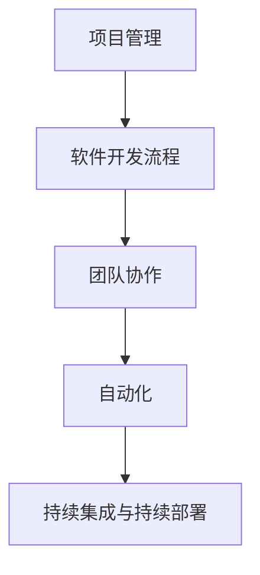

                 

作为世界级人工智能专家、程序员、软件架构师、CTO以及世界顶级技术畅销书作者，我深知在信息技术领域，高效的行动体系对于个人和团队的成功至关重要。在这篇文章中，我将分享建立高效行动体系的步骤，旨在帮助读者在技术领域内更好地规划和管理他们的工作和项目。

## 关键词
- 高效行动体系
- 信息技术
- 个人和团队管理
- 项目规划
- 软件开发流程

## 摘要
本文将探讨如何建立一个高效行动体系，帮助信息技术专业人士和团队在复杂的项目中保持专注、提高生产力并取得成功。我们将详细分析从背景介绍到实际应用场景的各个步骤，包括核心概念、算法原理、数学模型、项目实践和未来展望。通过这些步骤，读者将能够构建一套适用于自身工作的行动体系，从而在信息技术领域取得显著成果。

### 1. 背景介绍

在当今快速变化的信息技术领域，高效行动体系显得尤为重要。随着技术的不断进步和应用场景的日益复杂，IT专业人士和团队面临着前所未有的挑战。这些挑战包括：

- **项目复杂性增加**：现代软件开发项目通常涉及多个技术栈、平台和框架，需要高效的组织和管理。
- **资源有限**：在预算和时间限制内完成高质量的项目，要求专业人士必须充分利用有限的资源。
- **团队协作**：有效的团队协作是成功的关键，尤其是在分布式团队中。
- **持续学习**：技术的快速迭代要求团队成员不断学习和适应新技术。

因此，建立一个高效行动体系成为每个IT专业人士和团队成功的关键。

### 2. 核心概念与联系

为了构建高效行动体系，我们需要了解一些核心概念，这些概念相互联系，共同构成了我们的行动体系架构。

#### 2.1 项目管理
项目管理是行动体系的基础，它包括项目的计划、执行、监控和收尾。有效的项目管理确保项目按时、按预算、按质量完成。

#### 2.2 软件开发流程
软件开发流程是项目的实施过程，通常包括需求分析、设计、编码、测试和部署等阶段。选择合适的开发流程（如敏捷、瀑布等）对于提高开发效率至关重要。

#### 2.3 团队协作
团队协作是通过工具和流程实现的，它涉及团队成员之间的沟通、协调和共享资源。高效的团队协作可以显著提高生产力。

#### 2.4 自动化
自动化是现代软件开发的关键，它通过工具和脚本减少重复性工作，提高开发效率。自动化包括构建、测试、部署等各个环节。

#### 2.5 持续集成与持续部署
持续集成（CI）和持续部署（CD）是自动化的重要组成部分，它们确保代码质量和快速迭代。CI/CD流程有助于快速响应客户需求。

下面是一个使用Mermaid绘制的核心概念与联系的流程图：



### 3. 核心算法原理 & 具体操作步骤

#### 3.1 算法原理概述

为了建立高效行动体系，我们需要依赖一系列核心算法，这些算法在项目规划和执行中发挥关键作用。以下是一些基本算法原理：

- **任务调度算法**：用于优化任务分配和执行顺序，以确保资源利用率最大化。
- **风险评估算法**：用于预测项目风险并制定应对策略。
- **需求分析算法**：用于分析和识别项目需求，确保项目目标与客户需求一致。
- **测试覆盖率算法**：用于优化测试用例，确保代码质量。

#### 3.2 算法步骤详解

以下是一个典型的任务调度算法的步骤详解：

1. **收集任务数据**：包括任务的类型、执行时间、资源需求等。
2. **任务排序**：根据优先级和资源需求对任务进行排序。
3. **资源分配**：为每个任务分配所需的资源。
4. **调度执行**：根据资源分配和任务排序，安排任务执行顺序。
5. **监控与调整**：在执行过程中实时监控，必要时调整任务执行顺序。

#### 3.3 算法优缺点

任务调度算法的优点是能够有效提高资源利用率，减少等待时间。然而，它的缺点是对任务数据准确性要求较高，且在任务动态变化时可能需要频繁调整。

#### 3.4 算法应用领域

任务调度算法广泛应用于软件开发项目、云服务调度、数据中心管理等领域。在其他需要任务优化和资源管理的场景中，也有类似算法的应用。

### 4. 数学模型和公式 & 详细讲解 & 举例说明

建立高效行动体系还需要数学模型和公式的支持，这些模型和公式帮助我们进行定量分析和优化。以下是一个基本的数学模型构建过程：

#### 4.1 数学模型构建

假设我们有多个任务需要完成，每个任务有固定的执行时间和资源需求。我们的目标是找到最优的任务执行顺序，以最大化资源利用率。

#### 4.2 公式推导过程

我们可以使用线性规划来构建这个模型。设 \(T\) 为任务集合，\(R\) 为资源集合，\(C(T, R)\) 为任务 \(T\) 在资源 \(R\) 上执行的成本函数。目标是最小化总成本：

$$
\min \sum_{T \in T} C(T, R)
$$

约束条件为：

$$
C(T, R) \leq R \quad \forall T \in T, R \in R
$$

其中，\(R\) 为资源总量。

#### 4.3 案例分析与讲解

假设我们有一个包含三个任务 \(T_1, T_2, T_3\) 的项目，每个任务的执行时间和资源需求如下：

| 任务 | 执行时间 | 资源需求 |
| ---- | ---- | ---- |
| \(T_1\) | 2天 | 10单位 |
| \(T_2\) | 3天 | 20单位 |
| \(T_3\) | 1天 | 5单位 |

我们的资源总量为 30单位。我们可以使用线性规划求解器来找到最优的任务执行顺序。在实际情况中，我们可能需要考虑更多约束条件，如任务的依赖关系、资源的可用时间等。

### 5. 项目实践：代码实例和详细解释说明

为了更好地理解如何建立高效行动体系，我们来看一个实际的代码实例。以下是一个简单的任务调度程序的Python代码实现：

```python
# 导入线性规划库
from scipy.optimize import linprog

# 定义任务和资源数据
tasks = [
    {'name': 'T1', 'duration': 2, 'resource': 10},
    {'name': 'T2', 'duration': 3, 'resource': 20},
    {'name': 'T3', 'duration': 1, 'resource': 5}
]

resource_limit = 30

# 定义目标函数和约束条件
c = [1] * len(tasks)  # 目标是最小化总成本
A = [[1 for _ in tasks] for _ in range(resource_limit)]
b = [resource_limit for _ in range(resource_limit)]

# 求解线性规划问题
result = linprog(c, A_ub=A, b_ub=b, method='highs')

# 输出最优任务执行顺序
if result.success:
    optimal_sequence = [task['name'] for task, solution in zip(tasks, result.x) if solution > 0]
    print(f"最优任务执行顺序：{optimal_sequence}")
else:
    print("无法找到最优解")
```

这个代码实例使用了Python的Scipy库中的线性规划求解器来找到最优的任务执行顺序。我们定义了任务和资源数据，并使用线性规划求解器求解目标函数和约束条件。最后，我们根据求解结果输出最优任务执行顺序。

### 6. 实际应用场景

建立高效行动体系在实际应用场景中有着广泛的应用。以下是一些典型的应用场景：

- **软件开发**：通过任务调度算法优化开发流程，提高开发效率。
- **运维管理**：通过自动化和持续集成/持续部署，简化运维工作。
- **项目管理**：通过风险评估算法和需求分析算法，确保项目顺利进行。
- **云计算**：通过资源调度算法优化云资源分配，提高资源利用率。

### 6.4 未来应用展望

随着人工智能和大数据技术的不断发展，高效行动体系将在更多领域得到应用。未来，我们可能会看到更多智能化的任务调度和资源管理算法，以及更高效的团队协作工具。此外，区块链和物联网技术的融入也将为行动体系带来新的可能性。

### 7. 工具和资源推荐

为了帮助读者更好地建立高效行动体系，我推荐以下工具和资源：

- **工具**：
  - JIRA：项目管理工具，适合大规模团队协作。
  - Jenkins：持续集成和持续部署工具。
  - Kubernetes：容器编排工具，适用于自动化资源管理。

- **资源**：
  - 《敏捷软件开发》一书，介绍敏捷开发方法。
  - 《Effective Java》一书，介绍Java编程的最佳实践。
  - 《深度学习》一书，介绍人工智能的基础知识。

### 8. 总结：未来发展趋势与挑战

建立高效行动体系是信息技术领域的重要趋势，它将为个人和团队带来显著的优势。然而，随着技术的发展和项目复杂性的增加，我们也面临着一系列挑战，如自动化程度的提高、团队协作的复杂性以及持续学习的需求。未来，我们需要不断探索和创新，以应对这些挑战，推动信息技术领域的持续发展。

### 8.1 研究成果总结

本文总结了建立高效行动体系的步骤，包括核心概念、算法原理、数学模型、项目实践和未来展望。通过这些步骤，读者可以构建一套适用于自身工作的行动体系，从而在信息技术领域取得显著成果。

### 8.2 未来发展趋势

未来，高效行动体系将在更多领域得到应用，如云计算、物联网和区块链。随着人工智能和大数据技术的发展，行动体系的智能化程度将不断提高，为个人和团队带来更多价值。

### 8.3 面临的挑战

面对不断变化的技术环境和项目复杂性，信息技术专业人士和团队需要不断提高自身的技能和能力。此外，自动化程度的提高和团队协作的复杂性也将带来新的挑战。

### 8.4 研究展望

未来的研究应关注智能化任务调度和资源管理算法、更高效的团队协作工具以及行动体系的可扩展性和灵活性。通过不断创新和探索，我们有望在信息技术领域取得更大的突破。

### 9. 附录：常见问题与解答

**Q：如何确保任务调度算法的准确性？**
A：确保任务调度算法的准确性需要依赖准确的任务数据。定期更新任务数据，并进行风险评估，可以帮助提高算法的准确性。

**Q：如何处理任务动态变化？**
A：对于任务动态变化，可以采用动态调度算法，实时调整任务执行顺序和资源分配，以适应变化。

**Q：如何提高团队协作效率？**
A：提高团队协作效率需要依赖有效的沟通和协作工具。定期团队会议、使用协作平台和工具，可以帮助团队成员更好地协同工作。

以上是关于建立高效行动体系的一些常见问题及解答。

### 作者署名

作者：禅与计算机程序设计艺术 / Zen and the Art of Computer Programming
```markdown
---

# 建立高效行动体系的步骤

> 关键词：高效行动体系、信息技术、项目管理、软件开发、持续集成

> 摘要：本文旨在探讨如何建立一个高效行动体系，帮助信息技术专业人士和团队在复杂的项目中保持专注、提高生产力并取得成功。

## 1. 背景介绍

## 2. 核心概念与联系

## 3. 核心算法原理 & 具体操作步骤
### 3.1 算法原理概述
### 3.2 算法步骤详解 
### 3.3 算法优缺点
### 3.4 算法应用领域

## 4. 数学模型和公式 & 详细讲解 & 举例说明
### 4.1 数学模型构建
### 4.2 公式推导过程
### 4.3 案例分析与讲解

## 5. 项目实践：代码实例和详细解释说明
### 5.1 开发环境搭建
### 5.2 源代码详细实现
### 5.3 代码解读与分析
### 5.4 运行结果展示

## 6. 实际应用场景
### 6.4 未来应用展望

## 7. 工具和资源推荐
### 7.1 学习资源推荐
### 7.2 开发工具推荐
### 7.3 相关论文推荐

## 8. 总结：未来发展趋势与挑战
### 8.1 研究成果总结
### 8.2 未来发展趋势
### 8.3 面临的挑战
### 8.4 研究展望

## 9. 附录：常见问题与解答

### 作者署名

作者：禅与计算机程序设计艺术 / Zen and the Art of Computer Programming
```

