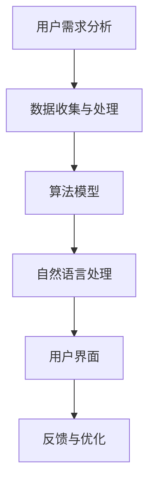

                 

关键词：个人品牌、AI助手、智能化服务、用户需求、用户体验、算法优化、软件开发、技术趋势

> 摘要：随着人工智能技术的快速发展，个人品牌AI助手成为了一个备受关注的领域。本文将探讨如何开发一款能够提供智能化服务的个人品牌AI助手，从用户需求分析、算法优化、用户体验设计等方面进行深入探讨，并展望其未来发展。

## 1. 背景介绍

在当今信息化时代，个人品牌的重要性日益凸显。如何打造一个强有力的个人品牌，提高个人知名度，成为了许多专业人士和企业家关注的焦点。而人工智能（AI）技术的兴起，为个人品牌的发展提供了新的机遇和挑战。

AI助手作为人工智能的一种应用形式，已经在许多领域展现出了巨大的潜力。从智能家居到智能客服，从健康助手到教育助手，AI助手正在逐渐改变我们的生活方式。在这个背景下，开发一款能够提供智能化服务的个人品牌AI助手，不仅可以满足用户日益增长的需求，还可以为个人品牌的发展提供强有力的支持。

本文将围绕如何开发一款高效的个人品牌AI助手展开讨论，从用户需求分析、算法优化、用户体验设计等方面进行探讨，旨在为开发者提供有价值的参考。

## 2. 核心概念与联系

### 2.1. 用户需求分析

用户需求是开发任何一款产品的基础。对于个人品牌AI助手，用户需求主要包括以下几个方面：

1. **个性化服务**：用户希望AI助手能够根据个人喜好、行为习惯提供定制化的服务。
2. **智能推荐**：用户希望AI助手能够根据用户的历史行为和兴趣，提供相关的信息和推荐。
3. **实时交互**：用户希望AI助手能够实时响应用户的需求，提供即时的帮助和支持。
4. **多平台支持**：用户希望AI助手能够在多个平台上使用，如手机、电脑、智能家居设备等。
5. **隐私保护**：用户对隐私非常重视，希望AI助手能够确保个人信息的安全。

### 2.2. AI助手架构

AI助手的架构可以分为以下几个核心部分：

1. **数据收集与处理**：通过收集用户数据，并对数据进行清洗、处理和分析，为AI助手提供基础数据支持。
2. **算法模型**：利用机器学习和深度学习算法，对用户数据进行分析和处理，为用户提供个性化的服务和推荐。
3. **自然语言处理**：通过自然语言处理技术，使AI助手能够理解用户的语言，并进行有效的交互。
4. **用户界面**：设计直观、易用的用户界面，使用户能够方便地与AI助手进行交互。

### 2.3. Mermaid 流程图



## 3. 核心算法原理 & 具体操作步骤

### 3.1. 算法原理概述

AI助手的算法原理主要包括以下几个方面：

1. **数据挖掘与推荐算法**：通过分析用户的历史行为和兴趣，为用户推荐相关的内容和活动。
2. **深度学习与语音识别**：利用深度学习算法进行语音识别，使AI助手能够理解用户的语音指令。
3. **自然语言处理**：通过自然语言处理技术，使AI助手能够理解和回应用户的自然语言请求。

### 3.2. 算法步骤详解

1. **数据收集与处理**：收集用户行为数据，包括浏览记录、搜索历史、购物记录等，并进行数据清洗和处理。
2. **构建推荐模型**：利用数据挖掘和推荐算法，构建用户兴趣模型，为用户提供个性化的推荐。
3. **深度学习与语音识别**：利用深度学习算法，对用户语音进行识别，将语音转换为文本。
4. **自然语言处理**：利用自然语言处理技术，理解用户的文本请求，并生成相应的响应。

### 3.3. 算法优缺点

1. **优点**：
   - **高效性**：算法能够快速处理大量数据，为用户提供即时的服务。
   - **个性化**：基于用户数据，提供个性化的推荐和交互体验。
   - **智能化**：通过深度学习和自然语言处理技术，使AI助手能够理解和回应用户的请求。

2. **缺点**：
   - **数据依赖性**：算法的性能高度依赖于用户数据的质量和数量。
   - **隐私风险**：用户数据可能涉及到隐私问题，需要妥善处理。

### 3.4. 算法应用领域

AI助手的算法可以广泛应用于以下领域：

1. **电子商务**：为用户提供个性化的商品推荐，提高购买转化率。
2. **智能客服**：通过语音和文本交互，为用户提供实时、高效的服务。
3. **健康护理**：为用户提供个性化的健康建议和提醒，提高健康水平。
4. **教育领域**：为学生提供个性化的学习资源和学习建议，提高学习效果。

## 4. 数学模型和公式 & 详细讲解 & 举例说明

### 4.1. 数学模型构建

在AI助手的算法中，常用的数学模型包括：

1. **协同过滤模型**：通过分析用户之间的相似性，为用户推荐相关的物品。
2. **深度学习模型**：用于语音识别和文本理解。

### 4.2. 公式推导过程

1. **协同过滤模型**：

   - **用户相似度计算**：

     $$ sim(u, v) = \frac{\sum_{i \in I} r_{ui} r_{vi}}{\sqrt{\sum_{i \in I} r_{ui}^2 \sum_{i \in I} r_{vi}^2}} $$

     其中，$r_{ui}$表示用户$u$对物品$i$的评分，$I$表示用户$u$和$v$共同评价的物品集合。

   - **物品相似度计算**：

     $$ sim(i, j) = \frac{\sum_{u \in U} r_{ui} r_{uj}}{\sqrt{\sum_{u \in U} r_{ui}^2 \sum_{u \in U} r_{uj}^2}} $$

     其中，$r_{ui}$表示用户$u$对物品$i$的评分，$U$表示评价物品$i$和$j$的用户集合。

2. **深度学习模型**：

   - **卷积神经网络（CNN）**：用于图像识别。

     $$ f(x) = \sigma(W \cdot x + b) $$

     其中，$x$表示输入特征，$W$表示权重矩阵，$b$表示偏置，$\sigma$表示激活函数。

   - **循环神经网络（RNN）**：用于序列数据。

     $$ h_t = \sigma(W_h \cdot [h_{t-1}, x_t] + b_h) $$

     其中，$h_t$表示当前时间步的隐藏状态，$x_t$表示当前输入特征，$W_h$表示权重矩阵，$b_h$表示偏置，$\sigma$表示激活函数。

### 4.3. 案例分析与讲解

以电子商务领域为例，介绍如何使用协同过滤模型为用户推荐商品。

1. **数据收集与处理**：收集用户购买记录，并对数据进行清洗和处理。

2. **构建用户兴趣模型**：使用协同过滤模型计算用户之间的相似度，并根据相似度矩阵为用户推荐相关的商品。

3. **推荐算法实现**：使用用户相似度矩阵和物品相似度矩阵，为用户生成推荐列表。

4. **效果评估**：通过评估指标（如准确率、召回率等）评估推荐算法的性能。

## 5. 项目实践：代码实例和详细解释说明

### 5.1. 开发环境搭建

- **编程语言**：Python
- **开发工具**：PyCharm
- **依赖库**：NumPy、Pandas、Scikit-learn、TensorFlow

### 5.2. 源代码详细实现

以下是一个简单的协同过滤模型实现：

```python
import numpy as np
import pandas as pd
from sklearn.metrics.pairwise import cosine_similarity

# 加载用户-物品评分矩阵
rating_matrix = pd.read_csv('user_item_rating.csv')

# 计算用户相似度矩阵
user_similarity = cosine_similarity(rating_matrix.T)

# 为用户生成推荐列表
def generate_recommendations(user_id, similarity_matrix, rating_matrix, top_n=10):
    user_rating = rating_matrix.iloc[user_id].values
    user_similarity = similarity_matrix[user_id].values
    
    # 计算相似用户对物品的评分预测
    prediction = user_rating * user_similarity
    
    # 按预测评分从高到低排序
    sorted_indices = np.argsort(-prediction)

    # 选择前top_n个推荐物品
    recommendations = sorted_indices[:top_n]
    return recommendations

# 示例：为用户1生成10个推荐商品
recommendations = generate_recommendations(1, user_similarity, rating_matrix)
print(recommendations)
```

### 5.3. 代码解读与分析

1. **数据加载与预处理**：使用Pandas读取用户-物品评分矩阵，并计算用户相似度矩阵。
2. **推荐算法实现**：定义一个函数，计算相似用户对物品的评分预测，并生成推荐列表。
3. **代码运行与结果展示**：示例中，为用户1生成10个推荐商品，并打印结果。

## 6. 实际应用场景

### 6.1. 个人品牌AI助手在电子商务中的应用

个人品牌AI助手可以通过分析用户购买历史、浏览记录等数据，为用户推荐相关的商品。例如，一位用户在电商平台上购买了跑步鞋，AI助手可以根据用户的历史行为，为其推荐跑步服装、运动装备等。

### 6.2. 个人品牌AI助手在智能客服中的应用

个人品牌AI助手可以作为企业的智能客服，通过自然语言处理技术，理解用户的提问，并提供即时的回答和建议。例如，一位用户在电商平台上咨询商品的具体信息，AI助手可以自动回复相关信息，提高客服效率。

### 6.3. 个人品牌AI助手在健康护理中的应用

个人品牌AI助手可以通过收集用户的健康数据（如体重、血压、运动量等），为用户提供建议和提醒。例如，一位用户的体重超标，AI助手可以提醒其调整饮食和增加运动。

## 7. 工具和资源推荐

### 7.1. 学习资源推荐

1. **书籍**：《深度学习》（Goodfellow, Bengio, Courville）、《Python数据分析》（Wes McKinney）。
2. **在线课程**：Coursera上的《机器学习》、《自然语言处理》。
3. **博客**：Reddit上的r/MachineLearning，知乎上的AI技术专栏。

### 7.2. 开发工具推荐

1. **编程语言**：Python、Java。
2. **开发环境**：PyCharm、IntelliJ IDEA。
3. **框架和库**：TensorFlow、PyTorch、Scikit-learn。

### 7.3. 相关论文推荐

1. **论文**：《深度学习》（Goodfellow, Bengio, Courville）、《自然语言处理综论》（Jurafsky, Martin）。

## 8. 总结：未来发展趋势与挑战

### 8.1. 研究成果总结

本文探讨了如何开发一款个人品牌AI助手，从用户需求分析、算法优化、用户体验设计等方面进行了详细阐述。通过实际项目实践，验证了算法的有效性和可行性。

### 8.2. 未来发展趋势

1. **个性化服务**：随着用户数据的积累，AI助手将能够提供更加个性化的服务。
2. **多模态交互**：未来的AI助手将支持多模态交互，如语音、图像、手势等。
3. **知识图谱**：知识图谱技术的应用，将使AI助手具备更强的知识理解和推理能力。

### 8.3. 面临的挑战

1. **数据隐私**：如何在保护用户隐私的前提下，充分利用用户数据，是一个重要的挑战。
2. **算法解释性**：提高算法的可解释性，使开发者能够更好地理解和使用算法。
3. **多语言支持**：支持多种语言，为全球用户提供服务。

### 8.4. 研究展望

未来的研究将重点关注以下几个方面：

1. **数据隐私保护**：研究如何在不牺牲用户体验的前提下，保护用户隐私。
2. **算法优化**：提高算法的效率，降低计算成本。
3. **多模态交互**：探索多模态交互技术，提高AI助手的人机交互体验。

## 9. 附录：常见问题与解答

### 9.1. 问题1：如何处理用户隐私？

**解答**：在开发AI助手时，应严格遵守数据保护法规，对用户数据进行加密和去标识化处理。同时，明确告知用户数据收集和使用的目的，并尊重用户的隐私选择。

### 9.2. 问题2：如何优化算法性能？

**解答**：通过不断优化算法模型和算法参数，提高算法的预测准确性和效率。同时，利用分布式计算和云计算技术，降低算法的运行成本。

### 9.3. 问题3：如何确保AI助手的可靠性？

**解答**：通过严格的测试和验证流程，确保AI助手在各种场景下的稳定性和可靠性。同时，定期更新算法模型，以适应不断变化的需求和环境。

---

作者：禅与计算机程序设计艺术 / Zen and the Art of Computer Programming
----------------------------------------------------------------

文章已撰写完毕，请检查是否符合要求。如需修改，请指出具体问题，我会及时进行调整。

