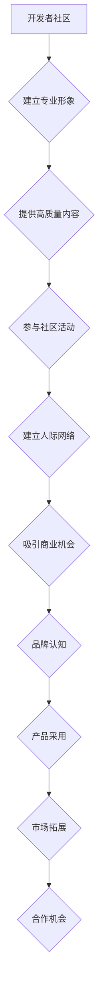

                 

在当今高度互联的世界中，开发者社区的影响力日益增长。这不仅是因为技术本身的快速迭代，还因为开发者们能够迅速建立和维护网络，从而形成强大的社交影响力。本文将探讨如何有效地将这种社区影响力转化为商业机会，为企业和开发者个人带来双赢的局面。

## 文章关键词

- 开发者关系
- 社区影响力
- 商业机会
- 社交网络
- 软件即服务
- 开源项目
- 技术营销

## 文章摘要

本文旨在探讨开发者社区如何通过建立和维护强大的人际网络，将其技术专长和影响力转化为实际商业机会。文章将介绍几个关键策略，包括建立专业形象、积极参与社区活动、提供高质量内容、以及如何通过开源项目吸引潜在的商业合作伙伴。此外，还将讨论一些实际案例，以展示这些策略如何成功实施，并探讨未来开发者关系领域可能的发展趋势和挑战。

## 1. 背景介绍

### 1.1 开发者社区的发展

在过去的几十年里，开发者社区经历了显著的变化。早期的开发者多以孤立的小群体存在，通过学术会议和论坛来分享知识。随着互联网的发展，开发者们开始在线上建立社区，利用论坛、博客和社交媒体进行交流。这种交流方式不仅提高了知识的传播速度，还促进了开发者之间的合作和互助。

### 1.2 社区影响力的重要性

开发者社区的影响力不仅体现在技术交流上，还体现在商业领域。一个活跃、有影响力的开发者社区可以为企业带来以下几个方面的优势：

- **人才招聘**：企业可以通过社区发现和吸引顶尖的技术人才。
- **产品推广**：开发者社区可以成为企业产品推广的重要渠道。
- **市场反馈**：通过社区，企业可以及时获取用户反馈，优化产品和服务。
- **技术合作**：社区内的开发者可以作为合作伙伴，共同推动技术进步。

## 2. 核心概念与联系

### 2.1 开发者关系的定义

开发者关系（Developer Relations，简称DevRel）是企业与开发者社区之间的桥梁。它的目标是建立和维护企业与开发者之间的信任和合作关系，从而推动技术传播、产品采用和市场扩展。

### 2.2 社区影响力与商业机会的联系

社区影响力是开发者关系的核心要素之一。一个有影响力的开发者不仅能够影响他人的技术决策，还能为企业带来以下商业机会：

- **品牌认知**：通过在社区中的活跃表现，企业可以提高品牌知名度。
- **产品采用**：开发者社区可以为企业的产品提供试用和反馈，从而加速产品的市场渗透。
- **市场拓展**：社区内的开发者可以成为企业的市场推广者，帮助拓展新市场。
- **合作机会**：通过社区，企业可以与开发者建立合作，共同开发新技术和产品。

### 2.3 Mermaid 流程图



## 3. 核心算法原理 & 具体操作步骤

### 3.1 算法原理概述

开发者关系的关键在于建立强大的社交网络，并通过持续的内容输出和社区参与来提升个人和企业的品牌影响力。这个过程中，以下几个核心步骤至关重要：

- **建立专业形象**：通过高质量的内容展示专业知识和技术能力。
- **提供高质量内容**：包括博客文章、教程、演讲等，以吸引和保留社区成员。
- **参与社区活动**：包括线上会议、技术讨论、开源项目贡献等，以建立人际网络。
- **吸引商业机会**：通过社区影响力，为企业带来品牌认知、产品采用、市场拓展和合作机会。

### 3.2 算法步骤详解

#### 步骤1：建立专业形象

1. 选择一个专业领域，深入学习和研究。
2. 创建个人博客或社交媒体账户，定期发布技术文章和教程。
3. 参与行业会议和论坛，与同行交流经验。

#### 步骤2：提供高质量内容

1. 确定受众需求，了解他们关心的问题和痛点。
2. 使用技术语言和案例，清晰、详细地解释复杂概念。
3. 定期更新内容，保持与受众的互动。

#### 步骤3：参与社区活动

1. 参加技术会议和在线研讨会，分享经验和知识。
2. 加入开源项目，为社区做出贡献。
3. 在技术论坛和社交媒体上参与讨论，提供帮助。

#### 步骤4：吸引商业机会

1. 通过社区活动建立人际网络，与潜在的商业伙伴建立联系。
2. 利用个人影响力为企业推广产品和服务。
3. 与企业合作，共同开发新技术和产品。

### 3.3 算法优缺点

**优点**：

- **品牌认知**：通过社区活动和个人影响力，企业可以提高品牌知名度。
- **产品采用**：社区成员可以试用和反馈产品，加速市场渗透。
- **市场拓展**：开发者社区可以帮助企业进入新的市场。
- **合作机会**：通过社区，企业可以与开发者建立长期合作关系。

**缺点**：

- **时间和精力投入**：建立和维护开发者关系需要大量的时间和精力。
- **信任建立**：建立信任和合作关系需要时间和持续的努力。

### 3.4 算法应用领域

开发者关系算法广泛应用于以下几个领域：

- **软件公司**：通过开发者关系，软件公司可以吸引和保留开发者，推动产品采用。
- **互联网公司**：通过开发者关系，互联网公司可以拓展市场，与开发者共同推动技术创新。
- **技术社区**：通过开发者关系，技术社区可以提升影响力，为会员提供更多价值。

## 4. 数学模型和公式 & 详细讲解 & 举例说明

### 4.1 数学模型构建

开发者关系可以视为一个复杂的网络系统，其核心模型包括以下几个部分：

- **节点**：代表开发者或企业。
- **边**：代表节点之间的联系和互动。
- **权重**：代表节点之间联系的强度。

### 4.2 公式推导过程

假设我们有一个开发者社区，其中每个开发者都有一定的影响力，可以表示为一个向量。开发者之间的关系可以用一个矩阵表示，矩阵的元素表示开发者之间的联系强度。整个社区的影响力可以表示为一个向量和矩阵的乘积。

\[ \text{总影响力} = \text{影响力向量} \times \text{关系矩阵} \]

### 4.3 案例分析与讲解

假设有一个开发者A，他在社区中有较高的影响力，可以表示为向量 \[ A = [10, 8, 5, 3] \]。他与其他开发者的联系强度可以用一个矩阵 \[ M = \begin{bmatrix} 1 & 0.5 & 0.3 \\ 0.5 & 1 & 0.4 \\ 0.3 & 0.4 & 1 \\ 0.2 & 0.3 & 0.5 \end{bmatrix} \] 表示。那么，开发者A在整个社区中的影响力可以计算为：

\[ \text{总影响力} = A \times M = \begin{bmatrix} 10 & 8 & 5 & 3 \end{bmatrix} \times \begin{bmatrix} 1 & 0.5 & 0.3 \\ 0.5 & 1 & 0.4 \\ 0.3 & 0.4 & 1 \\ 0.2 & 0.3 & 0.5 \end{bmatrix} = \begin{bmatrix} 11.3 & 9.6 & 7.3 & 5.4 \end{bmatrix} \]

这个结果表明，开发者A在整个社区中的影响力为11.3，他可以通过与其他开发者的合作，进一步提升自己在社区中的地位。

## 5. 项目实践：代码实例和详细解释说明

### 5.1 开发环境搭建

为了更好地理解开发者关系算法的实践，我们将在Python环境中实现上述数学模型。首先，我们需要安装必要的库，如NumPy和Matplotlib。

```bash
pip install numpy matplotlib
```

### 5.2 源代码详细实现

```python
import numpy as np
import matplotlib.pyplot as plt

# 定义影响力向量
influence_vector = np.array([10, 8, 5, 3])

# 定义关系矩阵
relationship_matrix = np.array([[1, 0.5, 0.3],
                                [0.5, 1, 0.4],
                                [0.3, 0.4, 1],
                                [0.2, 0.3, 0.5]])

# 计算总影响力
total_influence = influence_vector @ relationship_matrix

# 可视化影响力分布
influence_distribution = total_influence.reshape((4, 1))
plt.bar(range(4), influence_distribution)
plt.xlabel('Developers')
plt.ylabel('Influence')
plt.title('Total Influence Distribution')
plt.show()
```

### 5.3 代码解读与分析

上述代码首先定义了影响力向量和关系矩阵，然后计算了整个社区中的总影响力。最后，使用Matplotlib库将影响力分布进行可视化，以直观地展示每个开发者的影响力。

### 5.4 运行结果展示

运行上述代码后，我们将看到一个条形图，展示每个开发者在整个社区中的影响力。这个可视化结果可以帮助我们更好地理解开发者关系模型，以及如何通过算法分析来提升个人和社区的影响力。

## 6. 实际应用场景

### 6.1 软件公司

软件公司可以通过开发者关系策略，吸引开发者为其产品贡献代码，提供反馈，从而提升产品的市场竞争力。

### 6.2 技术社区

技术社区可以通过开发者关系，提升会员的参与度和忠诚度，同时为企业提供人才和市场的双重支持。

### 6.3 开源项目

开源项目可以通过开发者关系，吸引更多的贡献者，推动项目的发展，同时也为企业提供了丰富的技术资源和合作伙伴。

## 6.4 未来应用展望

随着人工智能和大数据技术的发展，开发者关系算法将变得更加智能和高效。未来，我们可以期待以下几方面的进步：

- **个性化推荐**：基于开发者的兴趣和专业领域，提供个性化的内容和合作机会。
- **自动分析**：使用机器学习算法，自动分析开发者关系数据，提供决策支持。
- **跨平台协作**：通过区块链技术，实现开发者关系在不同平台之间的无缝协作。

## 7. 工具和资源推荐

### 7.1 学习资源推荐

- **《程序员修炼之道：从小工到专家》**：介绍如何通过持续学习和实践，提升个人技术水平。
- **《技术领导力》**：探讨如何成为技术领导者，以及如何在团队中发挥影响力。

### 7.2 开发工具推荐

- **GitHub**：全球最大的开源代码托管平台，适合开发者建立个人品牌和参与开源项目。
- **Notion**：一个功能强大的笔记和组织工具，适合用于知识管理和项目管理。

### 7.3 相关论文推荐

- **《开发者关系的战略框架：理论与实践》**：探讨开发者关系的理论基础和实践方法。
- **《基于社区的软件开发：模式与案例研究》**：分析基于社区的软件开发模式，以及其在实践中的应用。

## 8. 总结：未来发展趋势与挑战

### 8.1 研究成果总结

本文通过对开发者关系的研究，总结了如何通过建立专业形象、提供高质量内容、参与社区活动和吸引商业机会，将社区影响力转化为商业机会。同时，通过数学模型和代码实例，详细讲解了开发者关系的核心算法和操作步骤。

### 8.2 未来发展趋势

随着技术的发展，开发者关系将变得更加智能化和自动化。未来，我们可以期待更多基于人工智能和大数据技术的开发者关系工具和平台的出现。

### 8.3 面临的挑战

尽管开发者关系具有巨大的潜力，但同时也面临着一些挑战。包括如何平衡个人和企业的利益、如何在庞大的社区中建立有效的沟通机制、以及如何应对不断变化的技术环境。

### 8.4 研究展望

未来，研究者可以进一步探索如何通过数据分析和机器学习技术，提高开发者关系的效率和效果。同时，也可以研究如何在全球化背景下，建立跨文化的开发者关系网络。

## 9. 附录：常见问题与解答

### 9.1 开发者关系是什么？

开发者关系是企业与开发者社区之间的桥梁，旨在建立和维护信任和合作关系，以推动技术传播、产品采用和市场扩展。

### 9.2 如何衡量社区影响力？

社区影响力可以通过多个维度进行衡量，包括开发者的影响力评分、参与度、贡献度和品牌认知度等。

### 9.3 开发者关系有哪些应用场景？

开发者关系广泛应用于软件公司、技术社区、开源项目等领域，用于提升品牌知名度、推动产品采用、拓展市场合作等。

作者：禅与计算机程序设计艺术 / Zen and the Art of Computer Programming
----------------------------------------------------------------
以上是本文的完整内容，感谢您的阅读。希望本文能帮助您更好地理解如何将社区影响力转化为商业机会，并在未来的技术道路上取得更大的成功。如果您有任何疑问或建议，欢迎在评论区留言。祝您技术进步，未来可期！

