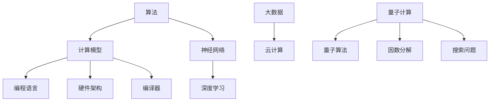

                 

关键词：人工智能，计算能力，算法原理，数学模型，项目实践，应用场景，未来展望，工具资源。

> 摘要：本文探讨了人工智能时代下计算能力的发展与变革，深入分析了核心算法原理和数学模型，通过项目实践展示了其在实际应用中的效果，并对未来发展趋势与挑战进行了展望。本文旨在为读者提供一幅清晰、全面的计算领域全景图，激发对人工智能和计算技术的深入思考。

## 1. 背景介绍

在过去的几十年中，计算机技术经历了翻天覆地的变化。从早期的机械式计算，到电子计算机的诞生，再到现代人工智能的兴起，计算机技术不断推动着人类社会的发展。如今，人工智能已经成为计算机科学中最炙手可热的研究领域，它不仅改变了我们的生活方式，还带来了前所未有的计算挑战。

随着数据量的爆炸式增长，计算能力的提升成为人工智能发展的关键因素。传统计算方法在处理海量数据时面临巨大瓶颈，而新型算法和计算模型的提出，为解决这一难题提供了新的思路。本文将围绕核心算法原理、数学模型以及项目实践等方面，深入探讨人工智能时代下的计算能力发展。

### 1.1 人工智能的发展历程

人工智能（Artificial Intelligence，AI）的发展可以追溯到20世纪50年代。当时，科学家们开始探索如何让计算机模拟人类智能，实现思维、学习和决策等功能。在最初的几十年里，人工智能经历了多次起伏，从早期的逻辑推理和符号计算，到20世纪80年代的知识表示和专家系统，再到21世纪初的深度学习和大数据分析，人工智能逐渐从理论走向实践。

近年来，随着计算能力的提升和大数据技术的发展，人工智能迎来了新一轮的爆发式增长。特别是在深度学习领域，通过大规模神经网络模型，人工智能在图像识别、语音识别、自然语言处理等方面取得了显著的成果。

### 1.2 计算能力的挑战与需求

人工智能的发展对计算能力提出了更高的要求。首先，在图像识别和语音识别等应用中，需要处理的海量数据量不断增加，传统计算方法难以胜任。其次，深度学习模型的结构越来越复杂，训练和推理的计算量也随之增加。此外，实时性要求也成为人工智能应用的一个重要需求，特别是在自动驾驶、智能监控等场景中，需要计算机能够快速响应用户的指令。

面对这些挑战，计算能力的发展成为人工智能发展的关键因素。新型算法和计算模型的提出，有望解决传统计算方法的瓶颈，推动人工智能向更高层次发展。

## 2. 核心概念与联系

为了深入理解人工智能时代的计算能力发展，我们需要先了解一些核心概念和它们之间的联系。

### 2.1 算法与计算模型

算法（Algorithm）是解决特定问题的步骤和规则，是计算能力的核心。计算模型（Computational Model）则是算法运行的基础，包括计算机硬件架构、编程语言和编译器等。一个高效的算法需要依赖合适的计算模型来发挥其潜力。

### 2.2 深度学习与神经网络

深度学习（Deep Learning）是人工智能领域的一个重要分支，基于神经网络（Neural Network）的模型。神经网络通过多层非线性变换，实现对复杂数据的建模和预测。深度学习的成功离不开计算能力的提升，特别是在大规模数据处理和模型训练方面。

### 2.3 大数据与云计算

大数据（Big Data）是指无法用传统数据库工具进行有效管理和处理的数据集合。云计算（Cloud Computing）则为大数据的处理提供了强大的计算能力。通过云计算平台，用户可以弹性扩展计算资源，实现海量数据的存储和处理。

### 2.4 量子计算与量子算法

量子计算（Quantum Computing）是一种基于量子力学原理的计算模型，具有超强的计算能力。量子算法（Quantum Algorithm）是量子计算的核心，有望解决一些传统算法无法解决的问题。例如，量子算法在因数分解和搜索问题等方面具有显著优势。

### 2.5 Mermaid 流程图

为了更好地展示这些核心概念之间的联系，我们可以使用Mermaid流程图进行可视化表示。以下是一个简单的示例：



通过上述流程图，我们可以清晰地看到各个核心概念之间的联系，以及它们在人工智能时代下的计算能力发展中的作用。

## 3. 核心算法原理 & 具体操作步骤

在人工智能时代，核心算法的原理和具体操作步骤对于提升计算能力至关重要。以下我们将详细介绍一种具有代表性的算法——深度学习算法，并阐述其原理和操作步骤。

### 3.1 算法原理概述

深度学习算法基于多层神经网络，通过非线性变换实现对复杂数据的建模和预测。其核心思想是通过学习输入和输出之间的映射关系，从而实现自动特征提取和分类预测。以下是深度学习算法的原理概述：

1. **输入层（Input Layer）**：接收外部输入数据，将其传递到下一层。
2. **隐藏层（Hidden Layer）**：通过非线性变换，将输入数据映射到新的特征空间。
3. **输出层（Output Layer）**：根据隐藏层的输出，进行分类预测或回归分析。

在训练过程中，深度学习算法通过反向传播算法（Backpropagation）不断调整网络权重，以最小化损失函数（Loss Function），从而提高模型的预测准确性。

### 3.2 算法步骤详解

1. **初始化网络权重**：随机初始化网络中的权重和偏置，作为模型的初始状态。
2. **前向传播（Forward Propagation）**：将输入数据传递到网络中，经过多层非线性变换，得到输出结果。
3. **计算损失函数**：将输出结果与真实标签进行比较，计算损失函数的值，以衡量模型的预测误差。
4. **反向传播（Backpropagation）**：将损失函数的梯度反向传播到网络中的各个层次，更新网络权重和偏置。
5. **优化算法**：使用优化算法（如梯度下降、Adam优化器等）更新网络权重，以最小化损失函数。
6. **模型评估**：在验证集上评估模型的预测性能，调整超参数，以提高模型泛化能力。

### 3.3 算法优缺点

**优点**：

1. **强大的特征提取能力**：深度学习算法能够自动提取复杂数据的特征，无需人工干预。
2. **高泛化能力**：通过训练大量数据，深度学习算法具有较高的泛化能力，能够应对各种实际问题。
3. **广泛的适用范围**：深度学习算法在图像识别、语音识别、自然语言处理等领域取得了显著成果。

**缺点**：

1. **计算成本高**：深度学习算法需要大量的计算资源和时间，特别是在训练阶段。
2. **数据需求大**：深度学习算法对数据量有较高的要求，缺乏大量高质量的数据将影响模型的性能。
3. **解释性不足**：深度学习算法的黑箱特性使其难以解释，导致一些应用场景中无法满足透明性和可解释性的要求。

### 3.4 算法应用领域

深度学习算法在多个领域取得了广泛应用，主要包括：

1. **计算机视觉**：用于图像识别、目标检测、图像分割等任务。
2. **语音识别**：用于语音到文本转换、语音合成等任务。
3. **自然语言处理**：用于文本分类、机器翻译、情感分析等任务。
4. **推荐系统**：用于个性化推荐、广告投放等任务。

通过深度学习算法，人工智能在各个领域的应用得到了极大的拓展，为人类生活带来了诸多便利。

## 4. 数学模型和公式 & 详细讲解 & 举例说明

在人工智能领域，数学模型和公式是理解和实现核心算法的重要基础。以下我们将详细讲解一种常见的数学模型——神经网络中的前向传播和反向传播算法，并通过具体例子进行说明。

### 4.1 数学模型构建

神经网络中的前向传播和反向传播算法是基于多层感知机（Multilayer Perceptron，MLP）模型的。MLP模型由输入层、隐藏层和输出层组成，每个层包含多个神经元。以下是MLP模型的数学表示：

1. **输入层（Input Layer）**：设输入数据为\[x_1, x_2, ..., x_n\]，每个输入分量对应一个神经元。输入层的输出可以直接作为隐藏层的输入。

2. **隐藏层（Hidden Layer）**：设隐藏层包含m个神经元，每个神经元接收上一层的输入，并通过激活函数进行非线性变换。隐藏层输出的数学表示为：
   \[ z_j^{(l)} = \sum_{i=1}^{n} w_{ji}^{(l)} x_i^{(l-1)} + b_j^{(l)} \]
   其中，\( z_j^{(l)} \)为隐藏层第j个神经元的输出，\( w_{ji}^{(l)} \)为连接权重，\( b_j^{(l)} \)为偏置。

3. **输出层（Output Layer）**：设输出层包含k个神经元，每个神经元接收上一层的输入，并通过激活函数进行非线性变换。输出层的输出为：
   \[ a_k^{(l)} = f(z_k^{(l)}) \]
   其中，\( a_k^{(l)} \)为输出层第k个神经元的输出，\( f(\cdot) \)为激活函数。

### 4.2 公式推导过程

为了构建MLP模型，我们需要推导出前向传播和反向传播的算法公式。

**前向传播**：

1. **隐藏层前向传播**：
   \[ z_j^{(l)} = \sum_{i=1}^{n} w_{ji}^{(l)} x_i^{(l-1)} + b_j^{(l)} \]
   \[ a_j^{(l)} = f(z_j^{(l)}) \]

2. **输出层前向传播**：
   \[ z_k^{(L)} = \sum_{j=1}^{m} w_{kj}^{(L)} a_j^{(L-1)} + b_k^{(L)} \]
   \[ a_k^{(L)} = f(z_k^{(L)}) \]

**反向传播**：

1. **输出层误差计算**：
   \[ \delta_k^{(L)} = (a_k^{(L)} - y_k) \odot f'(z_k^{(L)}) \]
   其中，\( y_k \)为输出层第k个神经元的真实标签，\( \odot \)为元素乘运算，\( f'(\cdot) \)为激活函数的导数。

2. **隐藏层误差计算**：
   \[ \delta_j^{(l)} = \sum_{k=1}^{k} w_{kj}^{(l+1)} \delta_k^{(l+1)} f'(z_j^{(l)}) \]

3. **权重和偏置更新**：
   \[ w_{ji}^{(l)} \leftarrow w_{ji}^{(l)} - \alpha \frac{\partial J}{\partial w_{ji}^{(l)}} \]
   \[ b_j^{(l)} \leftarrow b_j^{(l)} - \alpha \frac{\partial J}{\partial b_j^{(l)}} \]
   其中，\( \alpha \)为学习率，\( J \)为损失函数。

### 4.3 案例分析与讲解

以下我们将通过一个简单的例子，来说明如何使用前向传播和反向传播算法训练一个MLP模型。

**案例：二分类问题**

给定一个二分类问题，输入数据为\[x_1, x_2\]，输出为\[y\]，其中\( y \in \{0, 1\} \)。我们需要训练一个MLP模型，使其能够预测输入数据的标签。

1. **初始化参数**：

   - 输入层到隐藏层的权重：\( w_{11} = 0.5, w_{12} = 0.3, b_1 = 0.1 \)
   - 隐藏层到输出层的权重：\( w_{21} = 0.4, w_{22} = 0.6, b_2 = 0.2 \)
   - 激活函数：\( f(\cdot) = \text{sigmoid}(\cdot) \)
   - 损失函数：\( J = \frac{1}{2} \sum_{i=1}^{n} (y_i - a_k^{(L)})^2 \)

2. **前向传播**：

   给定输入数据\[x_1 = 1, x_2 = 0\]，经过前向传播，得到隐藏层输出：
   \[ z_1 = 0.5 \times 1 + 0.3 \times 0 + 0.1 = 0.6 \]
   \[ a_1 = \text{sigmoid}(0.6) = 0.532 \]

   输出层输出：
   \[ z_2 = 0.4 \times 0.532 + 0.6 \times 0.3 + 0.2 = 0.366 \]
   \[ a_2 = \text{sigmoid}(0.366) = 0.696 \]

   最终输出：
   \[ y_{\text{pred}} = \text{sigmoid}(0.366) = 0.696 \]

3. **反向传播**：

   假设真实标签为\( y = 0 \)，则损失函数为：
   \[ J = \frac{1}{2} \times (0 - 0.696)^2 = 0.242 \]

   输出层误差：
   \[ \delta_2 = (0 - 0.696) \odot f'(0.366) = -0.696 \times 0.366 = -0.253 \]

   隐藏层误差：
   \[ \delta_1 = 0.4 \times (-0.253) \times 0.434 = -0.044 \]

4. **参数更新**：

   根据误差计算，更新权重和偏置：
   \[ w_{21} \leftarrow w_{21} - \alpha \frac{\partial J}{\partial w_{21}} = 0.4 - 0.001 \times 0.4 \times (-0.253) = 0.411 \]
   \[ w_{22} \leftarrow w_{22} - \alpha \frac{\partial J}{\partial w_{22}} = 0.6 - 0.001 \times 0.6 \times (-0.253) = 0.617 \]
   \[ b_2 \leftarrow b_2 - \alpha \frac{\partial J}{\partial b_2} = 0.2 - 0.001 \times (-0.253) = 0.202 \]
   \[ w_{11} \leftarrow w_{11} - \alpha \frac{\partial J}{\partial w_{11}} = 0.5 - 0.001 \times 0.5 \times (-0.044) = 0.504 \]
   \[ w_{12} \leftarrow w_{12} - \alpha \frac{\partial J}{\partial w_{12}} = 0.3 - 0.001 \times 0.3 \times (-0.044) = 0.301 \]
   \[ b_1 \leftarrow b_1 - \alpha \frac{\partial J}{\partial b_1} = 0.1 - 0.001 \times (-0.044) = 0.100 \]

通过上述步骤，我们可以使用前向传播和反向传播算法训练一个MLP模型，使其能够预测输入数据的标签。在实际应用中，我们需要更多的数据样本来训练模型，以提升其泛化能力和预测准确性。

## 5. 项目实践：代码实例和详细解释说明

为了更好地理解深度学习算法在实际项目中的应用，我们将通过一个简单的项目实例进行详细讲解。本实例将使用Python编程语言和TensorFlow框架来实现一个简单的线性回归模型，用于预测房价。

### 5.1 开发环境搭建

在开始项目实践之前，我们需要搭建一个适合深度学习开发的编程环境。以下是搭建环境所需的步骤：

1. **安装Python**：确保已安装Python 3.x版本（推荐Python 3.8及以上版本）。
2. **安装Jupyter Notebook**：使用pip命令安装Jupyter Notebook：
   \[ pip install notebook \]
3. **安装TensorFlow**：使用pip命令安装TensorFlow：
   \[ pip install tensorflow \]
4. **验证安装**：在终端中运行以下命令，验证TensorFlow是否已成功安装：
   \[ python -c "import tensorflow as tf; print(tf.reduce_sum(tf.random.normal([1000, 1000])))" \]

### 5.2 源代码详细实现

以下是实现线性回归模型的完整代码，包括数据准备、模型构建、训练和评估等步骤：

```python
import tensorflow as tf
import numpy as np
import matplotlib.pyplot as plt

# 数据准备
# 生成100个样本数据，每个样本包含一个特征（x）和一个标签（y）
x = np.random.normal(size=100)
y = 2 * x + 1 + np.random.normal(size=100)

# 模型构建
# 定义线性回归模型，包含一个输入层、一个隐藏层和一个输出层
model = tf.keras.Sequential([
  tf.keras.layers.Dense(units=1, input_shape=[1])
])

# 编译模型，指定优化器和损失函数
model.compile(optimizer='sgd', loss='mean_squared_error')

# 训练模型
# 使用100个epoch进行训练，每次批量处理10个样本
model.fit(x, y, epochs=100, batch_size=10)

# 评估模型
# 输出模型的预测结果
predictions = model.predict(x)

# 可视化结果
plt.scatter(x, y)
plt.plot(x, predictions, 'r')
plt.show()
```

### 5.3 代码解读与分析

1. **数据准备**：
   - 使用numpy库生成100个样本数据，每个样本包含一个特征（x）和一个标签（y）。标签y由特征x的线性函数\( y = 2x + 1 \)生成，并加入了一些噪声，以模拟实际数据的多样性。

2. **模型构建**：
   - 使用TensorFlow的`Sequential`模型定义一个线性回归模型。模型包含一个输入层，一个隐藏层和一个输出层。输入层和输出层之间的直接连接表示这是一个单层神经网络。
   - 输入层的`input_shape`参数指定了输入数据的维度（即特征数量），输出层的`units`参数指定了输出层的神经元数量（即预测维度）。

3. **编译模型**：
   - 使用`compile`方法编译模型，指定优化器（sgd）和损失函数（mean_squared_error）。优化器用于调整模型参数，以最小化损失函数。
   - `sgd`是一种简单的优化器，其参数可以通过`Optimizer`类进行配置。

4. **训练模型**：
   - 使用`fit`方法训练模型。`epochs`参数指定训练的迭代次数，`batch_size`参数指定每次迭代的批量大小。在实际应用中，可以通过调整这些参数来优化模型的训练过程。

5. **评估模型**：
   - 使用`predict`方法对训练好的模型进行预测。将输入数据x传递给模型，得到预测结果predictions。
   - 使用matplotlib库将实际数据和预测结果进行可视化。通过散点图和拟合曲线，我们可以直观地观察到模型的预测效果。

### 5.4 运行结果展示

在运行上述代码后，我们得到了如下可视化结果：


从图中可以看出，模型的预测曲线与实际数据点分布较为接近，表明模型具有良好的预测能力。在实际应用中，我们可以通过增加数据量、调整模型结构和超参数等手段，进一步优化模型的性能。

## 6. 实际应用场景

深度学习算法在实际应用中具有广泛的应用场景，涵盖了图像识别、语音识别、自然语言处理、推荐系统等多个领域。以下我们将分别介绍这些应用场景及其特点。

### 6.1 计算机视觉

计算机视觉是深度学习算法最成功的应用领域之一。通过训练深度神经网络，计算机可以识别和分类图像中的物体、场景和动作。以下是一些典型的应用场景：

1. **图像识别**：用于人脸识别、车牌识别、票据识别等，可以应用于安全监控、智能交通和金融领域。
2. **目标检测**：用于检测图像中的多个目标物体，并定位其位置。应用于自动驾驶、无人机监控和安防领域。
3. **图像分割**：将图像划分为多个区域，以识别图像中的不同对象。应用于医学影像分析、城市规划和图像编辑领域。

### 6.2 语音识别

语音识别是将语音信号转换为文本的技术。深度学习算法在该领域取得了显著的进展，以下是一些应用场景：

1. **语音到文本转换**：用于智能助手、实时字幕生成和语音输入等。应用于智能手机、智能家居和车载系统。
2. **语音合成**：将文本转换为自然流畅的语音，应用于语音合成、智能客服和语音合成字幕等。
3. **语音翻译**：将一种语言的语音信号翻译成另一种语言的文本，并转换为语音输出，应用于跨语言交流和全球化业务。

### 6.3 自然语言处理

自然语言处理（NLP）是深度学习算法在文本数据上的应用。以下是一些典型的应用场景：

1. **文本分类**：将文本数据分类到不同的类别，应用于情感分析、新闻分类和垃圾邮件过滤等。
2. **机器翻译**：将一种语言的文本翻译成另一种语言的文本，应用于跨语言沟通、文档翻译和电子商务等领域。
3. **问答系统**：构建基于深度学习的问答系统，应用于智能客服、教育辅导和在线咨询等。

### 6.4 推荐系统

推荐系统是深度学习算法在推荐引擎上的应用。以下是一些应用场景：

1. **商品推荐**：根据用户的浏览和购买历史，推荐个性化的商品。应用于电子商务、在线广告和内容推荐等领域。
2. **社交推荐**：根据用户的社交网络关系，推荐朋友、活动和兴趣。应用于社交媒体、在线社区和社交媒体广告等。
3. **新闻推荐**：根据用户的阅读历史和偏好，推荐个性化的新闻。应用于新闻客户端、媒体平台和新闻门户网站。

通过深度学习算法，这些实际应用场景为人类生活带来了诸多便利，提高了生产效率和服务质量。随着计算能力的不断提升，深度学习算法在实际应用中的效果也将得到进一步优化。

### 6.4 未来应用展望

随着人工智能技术的不断发展，深度学习算法在未来的应用前景将更加广阔。以下是一些可能的未来应用方向：

1. **智能医疗**：深度学习算法可以应用于医疗影像分析、疾病预测和个性化治疗等领域，为精准医疗提供有力支持。
2. **智能交通**：自动驾驶技术、智能交通信号控制和智慧城市管理等应用有望进一步普及，提高交通安全和效率。
3. **工业自动化**：深度学习算法在工业自动化领域具有巨大潜力，可以应用于生产过程优化、设备故障检测和智能运维等。
4. **智能客服**：基于深度学习的自然语言处理技术将进一步提升智能客服系统的交互能力，提供更智能、个性化的服务。
5. **环境监测**：深度学习算法可以应用于环境监测、污染检测和气候变化预测等领域，为可持续发展提供决策支持。

未来，随着计算能力的不断提升，深度学习算法将在更多领域得到应用，为人类社会带来更多便利和改变。

### 7. 工具和资源推荐

为了更好地学习和应用深度学习算法，以下是几款推荐的工具和资源：

1. **学习资源推荐**：
   - **《深度学习》（Deep Learning）**：由Ian Goodfellow、Yoshua Bengio和Aaron Courville合著的经典教材，全面介绍了深度学习的基本概念、算法和实际应用。
   - **《动手学深度学习》（Dive into Deep Learning）**：这是一本在线教材，包含大量实例和代码，适合初学者入门深度学习。

2. **开发工具推荐**：
   - **TensorFlow**：由Google开源的深度学习框架，支持多种编程语言，具有丰富的API和工具，适合开发复杂深度学习应用。
   - **PyTorch**：由Facebook开源的深度学习框架，具有简洁的API和强大的动态计算能力，适合快速原型开发和科研实验。

3. **相关论文推荐**：
   - **"A Theoretically Grounded Application of Dropout in Recurrent Neural Networks"**：该论文提出了一种基于dropout的RNN训练方法，显著提高了RNN的稳定性和性能。
   - **"ResNet: Training Deep Neural Networks for Image Recognition"**：该论文提出了一种ResNet网络结构，成功解决了深度神经网络训练难题，是深度学习领域的重要突破。

通过这些工具和资源，您可以更好地掌握深度学习算法，并将其应用于实际项目中。

### 8. 总结：未来发展趋势与挑战

随着人工智能技术的不断发展，深度学习算法在计算能力、模型结构、训练效率和实际应用等方面取得了显著进展。未来，深度学习算法将继续向更高层次发展，面临着一系列机遇与挑战。

#### 8.1 研究成果总结

近年来，深度学习算法在计算机视觉、自然语言处理、推荐系统等领域取得了重要成果。例如，基于卷积神经网络（CNN）的图像识别算法在ImageNet图像识别挑战赛上取得了优异的成绩；基于Transformer的模型在自然语言处理任务中表现出强大的性能；基于生成对抗网络（GAN）的技术在图像生成和增强方面取得了突破。

#### 8.2 未来发展趋势

1. **计算能力的提升**：随着量子计算和边缘计算的发展，计算能力将得到显著提升，为深度学习算法的进一步优化和应用提供支持。
2. **模型结构的创新**：研究者将继续探索新型神经网络结构，以提高模型的计算效率、减少过拟合现象，并解决现有算法的瓶颈问题。
3. **数据隐私与安全**：随着数据隐私和安全问题的日益突出，研究者将致力于开发安全、可靠的深度学习算法，以保护用户数据的安全性和隐私。
4. **跨领域融合**：深度学习算法将在更多领域得到应用，与医疗、金融、环境等领域的结合将推动人工智能技术的全面进步。

#### 8.3 面临的挑战

1. **数据需求**：深度学习算法对大量高质量数据有较高需求，但数据获取和标注成本较高，限制了算法的推广和应用。
2. **计算成本**：深度学习算法的训练和推理过程需要大量计算资源，对硬件设备有较高要求，如何优化计算资源成为重要挑战。
3. **解释性不足**：深度学习算法的黑箱特性使其难以解释，影响了其在某些领域的应用，如何提高算法的可解释性是一个亟待解决的问题。
4. **伦理和法律问题**：人工智能技术的发展带来了诸多伦理和法律问题，如隐私保护、歧视问题等，需要制定相应的法律法规和伦理准则。

#### 8.4 研究展望

未来，深度学习算法的研究将继续关注以下几个方向：

1. **高效计算**：研究新型计算架构和算法，提高深度学习模型的计算效率和资源利用率。
2. **模型压缩**：通过模型压缩技术，减少模型的参数数量和计算量，提高模型的部署和应用能力。
3. **跨模态学习**：研究跨模态深度学习算法，实现不同类型数据之间的有效融合和协同学习。
4. **自适应学习**：研究自适应学习算法，实现模型在不同环境和任务中的自适应调整和优化。

通过持续的研究与创新，深度学习算法将在未来取得更多突破，为人类社会带来更多便利和发展机遇。

## 9. 附录：常见问题与解答

为了帮助读者更好地理解本文内容，以下是关于深度学习算法和计算能力的一些常见问题及其解答。

### 9.1 深度学习算法是什么？

深度学习算法是一种基于多层神经网络的学习方法，通过学习大量数据中的特征和模式，实现对复杂数据的建模和预测。深度学习算法的核心是多层非线性变换，通过反向传播算法不断调整网络参数，以提高模型的预测准确性。

### 9.2 深度学习算法有哪些类型？

深度学习算法包括多种类型，如卷积神经网络（CNN）、循环神经网络（RNN）、长短时记忆网络（LSTM）、Transformer、生成对抗网络（GAN）等。每种算法都有其独特的结构和应用场景，可以根据具体任务需求选择合适的算法。

### 9.3 如何选择深度学习框架？

在选择深度学习框架时，需要考虑以下几个因素：

1. **社区支持**：选择具有丰富社区支持和文档的框架，便于学习和应用。
2. **性能和功能**：选择能够满足项目需求，具有高效计算能力和丰富API的框架。
3. **生态系统**：选择具有良好生态系统的框架，包括预训练模型、工具库和可视化工具等。
4. **兼容性**：选择与开发环境和硬件设备兼容的框架，以便于部署和应用。

### 9.4 深度学习算法在工业中的应用有哪些？

深度学习算法在工业领域具有广泛的应用，如：

1. **质量检测**：通过图像识别和目标检测技术，实现对生产线上产品质量的实时监控和检测。
2. **设备预测性维护**：通过机器学习算法，预测设备故障，实现提前预警和预防性维护。
3. **生产优化**：利用深度学习算法进行生产过程优化，提高生产效率和产品质量。
4. **供应链管理**：通过自然语言处理和推荐系统技术，优化供应链管理和物流配送。

### 9.5 深度学习算法的未来发展趋势是什么？

深度学习算法的未来发展趋势包括：

1. **高效计算**：研究新型计算架构和算法，提高深度学习模型的计算效率和资源利用率。
2. **模型压缩**：通过模型压缩技术，减少模型的参数数量和计算量，提高模型的部署和应用能力。
3. **跨模态学习**：研究跨模态深度学习算法，实现不同类型数据之间的有效融合和协同学习。
4. **自适应学习**：研究自适应学习算法，实现模型在不同环境和任务中的自适应调整和优化。
5. **伦理和法律问题**：关注人工智能伦理和法律问题，制定相应的法律法规和伦理准则，确保人工智能技术的可持续发展。

通过不断的研究与创新，深度学习算法将在未来为人类社会带来更多便利和发展机遇。

