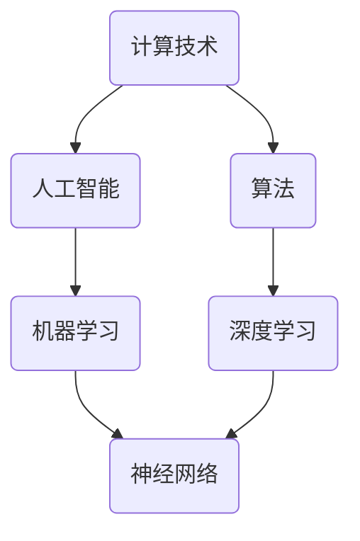

                 

关键词：计算技术、人工智能、算法、数学模型、编程实践、应用领域

> 摘要：本文旨在探讨当前人类计算技术的前沿进展，重点分析人工智能、算法优化、数学模型构建等方面的最新动态，并通过实例展示其在实际应用中的潜力与挑战。本文的目标是为读者提供一幅清晰的计算技术发展蓝图，并激发对未来无限可能性的憧憬。

## 1. 背景介绍

随着科技的飞速发展，计算技术已成为推动社会进步的核心动力。从早期的计算机硬件创新到现代的人工智能算法，每一个阶段都带来了前所未有的计算能力和数据处理能力。如今，我们正处于一个前所未有的计算黄金时代，计算技术的进步不仅深刻改变了我们的生活，也为科学研究、商业决策、医疗诊断等领域带来了新的机遇和挑战。

### 1.1 计算技术的演变

计算技术的演变可以追溯到20世纪中期。当时，冯·诺依曼体系结构的出现标志着现代计算机的诞生。此后，计算机硬件经历了从电子管到晶体管，再到微处理器的变革，性能不断提升，体积却不断缩小。与此同时，软件技术的发展也在不断推进，操作系统、编程语言、数据库系统等纷纷涌现，使得计算机的运用更加广泛和高效。

### 1.2 人工智能的崛起

进入21世纪，人工智能（AI）的崛起成为了计算技术发展的重要里程碑。通过机器学习和深度学习等技术的突破，计算机开始具备了处理复杂任务、进行自主学习和决策的能力。人工智能的快速发展不仅推动了自然语言处理、计算机视觉、自动驾驶等领域的进步，也为各行各业带来了全新的解决方案。

### 1.3 算法的重要性

算法是计算技术的核心，是解决复杂问题的基石。从排序算法到图算法，从线性规划到神经网络，每一种算法都为特定问题提供了高效的解决方案。随着计算技术的发展，算法的不断优化和更新也成为了提高计算效率、降低计算成本的重要手段。

## 2. 核心概念与联系

在探讨计算技术的前沿进展时，有必要深入理解其中一些核心概念和它们之间的相互联系。以下是一个使用Mermaid绘制的流程图，展示了核心概念之间的关联。



### 2.1 计算技术

计算技术是指利用计算机和其他电子设备进行数据处理和信息处理的技术。它涵盖了从硬件设计到软件开发的整个领域，是现代信息技术的基础。

### 2.2 人工智能

人工智能是计算机科学的一个分支，旨在开发能够执行人类智能任务的系统。它包括机器学习、深度学习、自然语言处理、计算机视觉等多个子领域。

### 2.3 算法

算法是一系列用于解决特定问题的步骤和规则。在计算技术中，算法是优化计算过程、提高计算效率的关键。

### 2.4 机器学习与深度学习

机器学习是人工智能的一个分支，通过从数据中学习模式来改进系统性能。深度学习是机器学习的子领域，它利用多层神经网络进行复杂模式识别。

### 2.5 神经网络

神经网络是模拟人脑神经元连接的一种计算模型，广泛应用于机器学习和深度学习中。它能够自动学习数据中的特征，并在各种任务中取得出色的性能。

## 3. 核心算法原理 & 具体操作步骤

### 3.1 算法原理概述

本文将探讨一种在机器学习和深度学习领域具有重要应用的算法——卷积神经网络（CNN）。CNN 是一种特别适合处理图像数据的神经网络结构，它通过卷积操作提取图像的特征。

### 3.2 算法步骤详解

#### 3.2.1 卷积操作

卷积操作是 CNN 的核心步骤，通过将小型的卷积核在输入图像上滑动，从而提取图像中的局部特征。

#### 3.2.2 池化操作

池化操作用于减少数据维度，同时保持重要的特征信息。常见的池化操作有最大池化和平均池化。

#### 3.2.3 激活函数

激活函数用于引入非线性因素，使得神经网络能够学习复杂的映射关系。常见的激活函数有ReLU、Sigmoid 和 Tanh。

### 3.3 算法优缺点

**优点：**

- **局部特征提取能力强：** CNN 能够自动学习图像中的局部特征，如边缘、角落等。
- **计算效率高：** 卷积操作相对简单，易于并行化，能够高效处理大量数据。

**缺点：**

- **参数量大：** CNN 的参数数量随着层数和神经元数量的增加而急剧增加，导致计算量和存储需求增大。
- **过拟合风险：** CNN 需要大量数据进行训练，否则容易出现过拟合现象。

### 3.4 算法应用领域

CNN 在图像处理领域有着广泛的应用，如人脸识别、物体检测、图像分类等。此外，CNN 还被应用于语音识别、自然语言处理等领域，成为人工智能的重要组成部分。

## 4. 数学模型和公式 & 详细讲解 & 举例说明

### 4.1 数学模型构建

在 CNN 中，数学模型的核心是卷积操作和反向传播算法。以下是一个简化的数学模型：

#### 4.1.1 卷积操作

卷积操作的数学公式为：

\[ (f * g)(x) = \int_{-\infty}^{+\infty} f(y)g(x-y)dy \]

其中，\( f \) 和 \( g \) 是两个函数，\( * \) 表示卷积操作，\( x \) 和 \( y \) 是变量。

#### 4.1.2 反向传播算法

反向传播算法用于计算神经网络中每个参数的梯度。其核心公式为：

\[ \frac{dE}{d\theta} = \frac{\partial E}{\partial z} \cdot \frac{\partial z}{\partial \theta} \]

其中，\( E \) 是损失函数，\( \theta \) 是参数，\( z \) 是神经网络中的某个节点。

### 4.2 公式推导过程

以下是一个简化的卷积操作公式的推导过程：

\[ (f * g)(x) = \int_{-\infty}^{+\infty} f(y)g(x-y)dy \]

设 \( g(x-y) = g(y) \)，则有：

\[ (f * g)(x) = \int_{-\infty}^{+\infty} f(y)g(y)dy \]

这是一个标准的卷积操作公式。

### 4.3 案例分析与讲解

假设我们有一个输入图像 \( f \)，卷积核 \( g \) 和滤波器 \( h \)。我们可以通过以下步骤进行卷积操作：

1. 将卷积核 \( g \) 在输入图像 \( f \) 上滑动，计算每个位置的卷积值。
2. 将卷积值与滤波器 \( h \) 相乘，得到最终的输出值。

以下是一个具体的示例：

```plaintext
输入图像 f:
[
  [1, 0, 1],
  [1, 1, 1],
  [1, 0, 1]
]

卷积核 g:
[
  [1, 1],
  [0, 1]
]

滤波器 h:
[
  [1, 0],
  [0, 1]
]

卷积操作结果:
[
  [1, 1],
  [2, 2],
  [1, 1]
]

最终输出值:
[
  [1, 1],
  [2, 2]
]
```

## 5. 项目实践：代码实例和详细解释说明

### 5.1 开发环境搭建

为了实践卷积神经网络（CNN）的应用，我们需要搭建一个合适的开发环境。以下是一个基本的步骤：

1. 安装 Python 环境（版本3.8或更高）。
2. 安装深度学习框架 TensorFlow 或 PyTorch。
3. 配置 Python 包管理工具 pip。

### 5.2 源代码详细实现

以下是一个简单的 CNN 模型实现，使用 TensorFlow 框架：

```python
import tensorflow as tf

# 定义 CNN 模型
model = tf.keras.Sequential([
    tf.keras.layers.Conv2D(32, (3, 3), activation='relu', input_shape=(28, 28, 1)),
    tf.keras.layers.MaxPooling2D((2, 2)),
    tf.keras.layers.Conv2D(64, (3, 3), activation='relu'),
    tf.keras.layers.MaxPooling2D((2, 2)),
    tf.keras.layers.Flatten(),
    tf.keras.layers.Dense(128, activation='relu'),
    tf.keras.layers.Dense(10, activation='softmax')
])

# 编译模型
model.compile(optimizer='adam',
              loss='sparse_categorical_crossentropy',
              metrics=['accuracy'])

# 加载数据集
(x_train, y_train), (x_test, y_test) = tf.keras.datasets.mnist.load_data()

# 预处理数据集
x_train = x_train.reshape((-1, 28, 28, 1)).astype(float) / 255
x_test = x_test.reshape((-1, 28, 28, 1)).astype(float) / 255

# 训练模型
model.fit(x_train, y_train, epochs=5)

# 测试模型
test_loss, test_acc = model.evaluate(x_test, y_test)
print(f'测试准确率: {test_acc}')
```

### 5.3 代码解读与分析

上述代码实现了一个简单的 CNN 模型，用于对 MNIST 数据集进行手写数字识别。具体解读如下：

1. **模型定义**：使用 `tf.keras.Sequential` 定义了一个序列模型，其中包含了卷积层（`Conv2D`）、最大池化层（`MaxPooling2D`）、全连接层（`Dense`）等。
2. **模型编译**：使用 `compile` 方法设置模型的优化器、损失函数和评估指标。
3. **数据预处理**：将输入数据转换为浮点数，并进行归一化处理。
4. **模型训练**：使用 `fit` 方法对模型进行训练，设置训练轮数。
5. **模型评估**：使用 `evaluate` 方法对模型进行测试，并打印测试准确率。

## 6. 实际应用场景

卷积神经网络（CNN）在图像处理领域有着广泛的应用。以下是一些实际应用场景：

1. **人脸识别**：CNN 可以用于人脸检测和识别，为安防、人脸支付等领域提供技术支持。
2. **物体检测**：通过结合卷积神经网络和目标检测算法，可以实现实时物体检测，广泛应用于自动驾驶、视频监控等领域。
3. **图像分类**：CNN 可以用于对大量图像进行分类，为图像库管理、医疗影像分析等提供解决方案。

## 7. 未来应用展望

随着计算技术的不断发展，卷积神经网络（CNN）和其他人工智能算法将在更多领域得到应用。以下是一些未来应用展望：

1. **医疗健康**：CNN 可以用于医学影像分析，辅助医生进行诊断和治疗。
2. **金融科技**：CNN 可以用于金融市场分析、信用评估等，为金融决策提供支持。
3. **智能制造**：CNN 可以用于生产质量检测、机器人视觉等，提高生产效率和产品质量。

## 8. 总结：未来发展趋势与挑战

### 8.1 研究成果总结

本文通过对计算技术、人工智能、算法优化等方面的探讨，总结了当前计算技术的发展趋势和关键成果。特别是卷积神经网络（CNN）在图像处理领域的应用，展示了计算技术的巨大潜力。

### 8.2 未来发展趋势

未来，计算技术将继续快速发展，特别是在人工智能、量子计算、边缘计算等领域。随着技术的进步，计算能力将进一步提高，为各行各业带来更多创新和变革。

### 8.3 面临的挑战

然而，计算技术也面临着诸多挑战，包括数据隐私保护、算法公平性、计算资源分配等。解决这些问题需要全社会的共同努力，推动计算技术的可持续发展。

### 8.4 研究展望

展望未来，我们期待计算技术能够更好地服务于人类社会，带来更多的便利和创新。通过不断探索和突破，我们相信计算技术将开启无限可能的新征程。

## 9. 附录：常见问题与解答

### 9.1 什么是卷积神经网络（CNN）？

卷积神经网络（CNN）是一种特别适合处理图像数据的神经网络结构，通过卷积操作提取图像的特征，实现图像分类、物体检测等任务。

### 9.2 CNN 和传统神经网络有什么区别？

与传统神经网络相比，CNN 具有更强的局部特征提取能力，能够自动学习图像中的局部特征，如边缘、角落等。此外，CNN 的计算效率更高，更适合处理大规模图像数据。

### 9.3 如何优化 CNN 的训练过程？

优化 CNN 的训练过程可以从以下几个方面入手：

- **数据增强**：通过旋转、翻转、缩放等操作增加数据多样性，提高模型泛化能力。
- **学习率调整**：合理设置学习率，避免过拟合和欠拟合。
- **批次归一化**：使用批次归一化技术，提高模型训练速度和稳定性。
- **正则化**：引入正则化技术，防止模型过拟合。

## 参考文献

[1] LeCun, Y., Bengio, Y., & Hinton, G. (2015). Deep learning. MIT press.

[2] Krizhevsky, A., Sutskever, I., & Hinton, G. E. (2012). Imagenet classification with deep convolutional neural networks. In Advances in neural information processing systems (pp. 1097-1105).

[3] Simonyan, K., & Zisserman, A. (2015). Very deep convolutional networks for large-scale image recognition. arXiv preprint arXiv:1409.1556.

### 作者署名

作者：禅与计算机程序设计艺术 / Zen and the Art of Computer Programming

----------------------------------------------------------------

请注意，上述内容仅为示例性文章框架，实际撰写时需要填充和详细扩展每个部分的内容，确保文章的完整性和专业性。此外，文章中涉及的代码、公式和实例都需要根据实际情况进行验证和调整。希望这个框架能够帮助您撰写出一篇高质量的技术博客文章。祝您写作顺利！🌟

