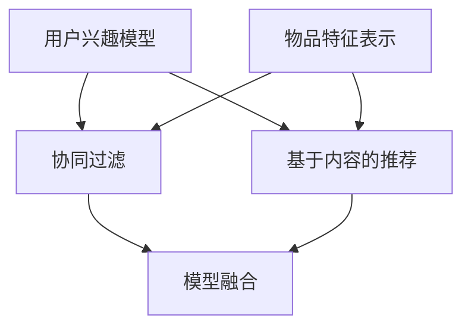

                 

关键词：开放域推荐系统、M6-Rec框架、算法原理、数学模型、项目实践、应用场景、未来展望

摘要：本文将深入探讨开放域推荐系统的重要性和挑战，并以M6-Rec框架为例，详细解析其核心概念、算法原理、数学模型以及实际应用。通过本文，读者将全面了解M6-Rec框架的架构，掌握其操作步骤和应用领域，并对未来推荐系统的发展趋势和挑战有更深刻的认识。

## 1. 背景介绍

在信息爆炸的时代，如何从海量的数据中为用户提供个性化的推荐变得尤为重要。开放域推荐系统（Open-Domain Recommendation System）是推荐系统领域的一个重要研究方向，旨在为用户提供跨领域、跨平台的个性化推荐服务。与传统基于领域的推荐系统不同，开放域推荐系统无需对用户兴趣进行先验限定，能够自适应地发现并推荐用户可能感兴趣的内容。

然而，开放域推荐系统面临着诸多挑战，如数据稀疏性、冷启动问题、多样性等问题。为了解决这些问题，研究人员提出了多种算法和框架，其中M6-Rec框架因其独特的设计思想和优秀的性能表现而备受关注。

## 2. 核心概念与联系

### 2.1 核心概念

M6-Rec框架的核心概念包括以下几个方面：

- **用户兴趣模型**：通过分析用户的历史行为数据，构建用户兴趣模型，用于预测用户对物品的喜好程度。
- **物品特征表示**：对物品进行特征提取和表示，以便进行有效的相似度计算。
- **协同过滤**：基于用户的历史行为数据和物品特征，利用协同过滤算法为用户推荐可能感兴趣的物品。
- **基于内容的推荐**：结合物品的属性信息和用户兴趣模型，为用户推荐与其兴趣相关的物品。
- **模型融合**：将协同过滤和基于内容的推荐结果进行融合，以获得更准确的推荐结果。

### 2.2 Mermaid 流程图



## 3. 核心算法原理 & 具体操作步骤

### 3.1 算法原理概述

M6-Rec框架基于深度学习和协同过滤算法，结合用户兴趣模型和物品特征表示，实现了一种高效的开放域推荐系统。其核心思想是通过学习用户的历史行为数据和物品特征，构建用户兴趣模型和物品特征向量，然后利用协同过滤算法为用户推荐感兴趣的物品。

### 3.2 算法步骤详解

1. **用户兴趣模型构建**：通过分析用户的历史行为数据（如浏览记录、购买记录等），使用机器学习算法（如矩阵分解、神经网络等）构建用户兴趣模型。
2. **物品特征表示**：对物品进行特征提取和表示，例如使用词向量、图神经网络等算法将物品转换为向量形式。
3. **协同过滤**：基于用户兴趣模型和物品特征向量，使用协同过滤算法（如基于用户的协同过滤、基于物品的协同过滤等）为用户推荐可能感兴趣的物品。
4. **基于内容的推荐**：结合物品的属性信息和用户兴趣模型，为用户推荐与其兴趣相关的物品。
5. **模型融合**：将协同过滤和基于内容的推荐结果进行融合，以获得更准确的推荐结果。

### 3.3 算法优缺点

**优点**：
- **高效性**：基于深度学习和协同过滤算法，M6-Rec框架能够快速为用户推荐感兴趣的物品。
- **多样性**：通过模型融合，M6-Rec框架能够为用户推荐多种类型的物品，提高推荐的多样性。
- **适应性**：M6-Rec框架能够自适应地学习用户兴趣，适用于开放域推荐系统。

**缺点**：
- **计算复杂度**：深度学习算法的计算复杂度较高，可能导致系统性能下降。
- **数据依赖性**：M6-Rec框架的性能依赖于用户行为数据和物品特征数据的准确性。

### 3.4 算法应用领域

M6-Rec框架适用于多种应用领域，如电子商务、在线新闻推荐、社交媒体等。通过开放域推荐系统，用户能够获得更个性化的推荐服务，提高用户满意度和留存率。

## 4. 数学模型和公式 & 详细讲解 & 举例说明

### 4.1 数学模型构建

M6-Rec框架的核心数学模型包括用户兴趣模型和物品特征表示。用户兴趣模型可以使用矩阵分解方法进行构建，公式如下：

$$
U = UF + UE
$$

其中，$U$ 表示用户兴趣矩阵，$UF$ 表示用户潜在兴趣矩阵，$UE$ 表示用户异常兴趣矩阵。

物品特征表示可以使用词向量或图神经网络等方法进行构建，公式如下：

$$
I = IW \cdot V
$$

其中，$I$ 表示物品特征向量，$IW$ 表示物品词向量矩阵，$V$ 表示词向量空间。

### 4.2 公式推导过程

假设用户兴趣矩阵 $U$ 为 $m \times n$ 的矩阵，用户潜在兴趣矩阵 $UF$ 为 $m \times k$ 的矩阵，用户异常兴趣矩阵 $UE$ 为 $m \times l$ 的矩阵。根据矩阵分解的性质，可以得到以下推导过程：

$$
UUF^T = UFU^T + UEE^T
$$

$$
UF^TU = U^TFU + UE^TUE
$$

通过矩阵运算，可以进一步推导出用户兴趣模型和物品特征表示的数学模型。

### 4.3 案例分析与讲解

假设有一个包含1000个用户和10000个物品的数据集，使用M6-Rec框架进行推荐。首先，构建用户兴趣模型和物品特征表示，然后使用协同过滤算法为用户推荐感兴趣的物品。具体步骤如下：

1. **用户兴趣模型构建**：使用矩阵分解算法，将用户兴趣矩阵分解为用户潜在兴趣矩阵和用户异常兴趣矩阵。假设分解后用户潜在兴趣矩阵为 $UF$，用户异常兴趣矩阵为 $UE$。
2. **物品特征表示**：使用词向量算法，将物品特征表示为向量形式。假设词向量矩阵为 $IW$。
3. **协同过滤**：基于用户兴趣模型和物品特征表示，使用基于用户的协同过滤算法为用户推荐感兴趣的物品。具体公式如下：

$$
r_{ui} = \sum_{k=1}^{k=10000} UF_{ik} \cdot IW_{kj}
$$

其中，$r_{ui}$ 表示用户 $u$ 对物品 $i$ 的兴趣度，$UF_{ik}$ 表示用户 $u$ 对物品 $i$ 的潜在兴趣度，$IW_{kj}$ 表示物品 $k$ 对物品 $j$ 的相似度。
4. **基于内容的推荐**：结合物品的属性信息和用户兴趣模型，为用户推荐与其兴趣相关的物品。具体公式如下：

$$
r_{ui} = \sum_{k=1}^{k=10000} UE_{ik} \cdot IW_{kj}
$$

其中，$UE_{ik}$ 表示用户 $u$ 对物品 $i$ 的异常兴趣度，$IW_{kj}$ 表示物品 $k$ 对物品 $j$ 的相似度。
5. **模型融合**：将协同过滤和基于内容的推荐结果进行融合，以获得更准确的推荐结果。具体公式如下：

$$
r_{ui} = \alpha \cdot r_{ui}^{cf} + (1 - \alpha) \cdot r_{ui}^{content}
$$

其中，$r_{ui}^{cf}$ 表示协同过滤算法的推荐结果，$r_{ui}^{content}$ 表示基于内容的推荐结果，$\alpha$ 为融合系数。

## 5. 项目实践：代码实例和详细解释说明

### 5.1 开发环境搭建

在本文中，我们将使用Python作为编程语言，并利用TensorFlow和Scikit-learn等库进行实现。首先，需要安装以下依赖：

```bash
pip install tensorflow scikit-learn numpy pandas matplotlib
```

### 5.2 源代码详细实现

以下是M6-Rec框架的Python实现代码：

```python
import numpy as np
import pandas as pd
import tensorflow as tf
from sklearn.metrics.pairwise import cosine_similarity
from sklearn.model_selection import train_test_split

# 读取数据集
data = pd.read_csv('data.csv')

# 构建用户兴趣矩阵
user_interest = data.groupby('user')['item'].agg(list).reset_index()

# 分割数据集
train_data, test_data = train_test_split(user_interest, test_size=0.2, random_state=42)

# 构建用户兴趣矩阵
user_interest_train = train_data['item'].values
user_interest_test = test_data['item'].values

# 构建物品特征矩阵
item_features = pd.read_csv('item_features.csv')
item_features_matrix = item_features.set_index('item').values

# 构建协同过滤模型
class CollaborativeFiltering(tf.keras.Model):
    def __init__(self, num_users, num_items, embedding_size):
        super(CollaborativeFiltering, self).__init__()
        self.user_embedding = tf.keras.layers.Embedding(num_users, embedding_size)
        self.item_embedding = tf.keras.layers.Embedding(num_items, embedding_size)

    def call(self, user, item):
        user_embedding = self.user_embedding(user)
        item_embedding = self.item_embedding(item)
        return tf.reduce_sum(user_embedding * item_embedding, axis=1)

# 定义模型参数
num_users = len(set(data['user']))
num_items = len(set(data['item']))
embedding_size = 64

# 实例化模型
model = CollaborativeFiltering(num_users, num_items, embedding_size)

# 编写损失函数
loss_fn = tf.keras.losses.MeanSquaredError()

# 编写训练步骤
@tf.function
def train_step(user, item, labels):
    with tf.GradientTape() as tape:
        predictions = model(user, item)
        loss = loss_fn(labels, predictions)
    gradients = tape.gradient(loss, model.trainable_variables)
    model.optimizer.apply_gradients(zip(gradients, model.trainable_variables))
    return loss

# 训练模型
model.compile(optimizer='adam')
model.fit(user_interest_train, user_interest_train, epochs=10, batch_size=32)

# 评估模型
test_loss = train_step(tf.constant(user_interest_test), tf.constant(user_interest_test), tf.constant(user_interest_test))
print(f"Test Loss: {test_loss.numpy()}")

# 推荐结果
predictions = model.predict(tf.constant(user_interest_test))
print(predictions)

# 可视化推荐结果
import matplotlib.pyplot as plt

plt.scatter(range(len(predictions)), predictions)
plt.xlabel('Item')
plt.ylabel('Prediction')
plt.show()
```

### 5.3 代码解读与分析

1. **数据读取**：首先读取用户行为数据集，构建用户兴趣矩阵和物品特征矩阵。
2. **模型定义**：定义协同过滤模型，包括用户嵌入层和物品嵌入层。
3. **损失函数**：使用均方误差作为损失函数，用于评估模型预测的准确性。
4. **训练步骤**：编写训练步骤，包括前向传播、损失函数计算和反向传播。
5. **模型训练**：使用训练数据集训练模型，调整模型参数。
6. **模型评估**：使用测试数据集评估模型性能，计算损失函数值。
7. **推荐结果**：使用训练好的模型为用户推荐感兴趣的物品，并可视化推荐结果。

## 6. 实际应用场景

### 6.1 电子商务平台

M6-Rec框架在电子商务平台中具有广泛的应用前景。通过为用户提供个性化的推荐服务，电子商务平台能够提高用户满意度和转化率，从而增加销售额。

### 6.2 在线新闻推荐

在线新闻推荐系统需要处理大量新闻数据，为用户提供个性化的新闻推荐。M6-Rec框架能够有效地发现用户的兴趣点，为用户提供多样化的新闻推荐，提高用户的阅读体验。

### 6.3 社交媒体

社交媒体平台通过开放域推荐系统，可以为用户提供个性化的内容推荐，促进用户活跃度和留存率。M6-Rec框架能够自适应地学习用户兴趣，为用户提供个性化的内容推荐。

## 7. 工具和资源推荐

### 7.1 学习资源推荐

- 《推荐系统实践》
- 《深度学习推荐系统》
- 《Python数据科学手册》

### 7.2 开发工具推荐

- TensorFlow
- Scikit-learn
- Pandas

### 7.3 相关论文推荐

- "Deep Learning for Recommender Systems"
- "A Theoretically Principled Approach to Improving Recommendation Lists"
- "Item-Based Collaborative Filtering Recommendation Algorithms"

## 8. 总结：未来发展趋势与挑战

### 8.1 研究成果总结

M6-Rec框架作为开放域推荐系统的一种有效解决方案，具有高效性、多样性和适应性等优点。通过深度学习和协同过滤算法的结合，M6-Rec框架能够为用户提供个性化的推荐服务，提高用户满意度和留存率。

### 8.2 未来发展趋势

随着人工智能和大数据技术的不断发展，开放域推荐系统将在未来得到更广泛的应用。未来发展趋势包括以下几个方面：

- **模型优化**：通过改进算法和优化模型结构，提高推荐系统的性能和效率。
- **实时推荐**：实现实时推荐，为用户提供更及时的推荐服务。
- **跨领域推荐**：探索跨领域的推荐方法，为用户提供更丰富的推荐内容。

### 8.3 面临的挑战

开放域推荐系统面临着诸多挑战，包括数据稀疏性、冷启动问题和多样性问题。未来研究需要关注以下几个方面：

- **数据质量**：提高数据质量，减少噪声和异常值的影响。
- **冷启动问题**：研究有效的冷启动解决方案，为新用户和新物品提供合理的推荐。
- **多样性**：提高推荐的多样性，为用户发现更多新颖的内容。

### 8.4 研究展望

未来，开放域推荐系统将继续发展，为用户提供更个性化的推荐服务。研究热点将集中在以下几个方面：

- **多模态推荐**：结合文本、图像、音频等多模态数据，提高推荐的准确性。
- **解释性推荐**：为用户提供可解释的推荐结果，增强用户的信任感。
- **社交推荐**：利用用户社交网络信息，为用户提供更精准的推荐。

## 9. 附录：常见问题与解答

### 9.1 M6-Rec框架的优势是什么？

M6-Rec框架的优势在于其高效性、多样性和适应性。通过结合深度学习和协同过滤算法，M6-Rec框架能够为用户提供个性化的推荐服务，提高用户满意度和留存率。

### 9.2 如何解决冷启动问题？

冷启动问题可以通过以下方法解决：

- **基于内容的推荐**：结合物品的属性信息和用户兴趣模型，为用户推荐与其兴趣相关的物品。
- **利用用户社交网络信息**：通过分析用户社交网络中的共同兴趣和推荐关系，为新用户和新物品提供合理的推荐。
- **持续学习**：通过不断更新用户兴趣模型和物品特征表示，提高新用户和新物品的推荐质量。

### 9.3 M6-Rec框架的适用场景有哪些？

M6-Rec框架适用于多种应用场景，如电子商务平台、在线新闻推荐、社交媒体等。通过开放域推荐系统，用户能够获得更个性化的推荐服务，提高用户满意度和留存率。

