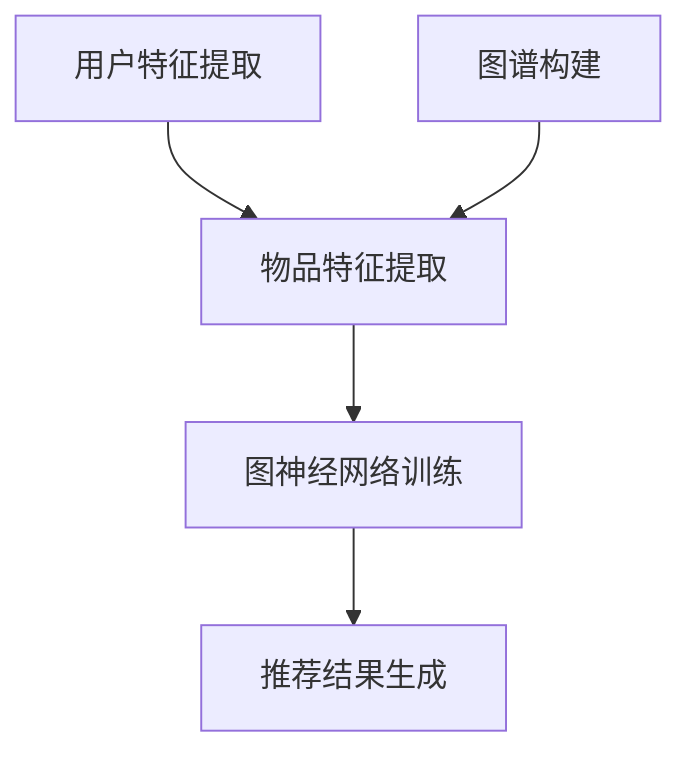

                 

关键词：开放域推荐系统，M6-Rec，算法原理，数学模型，应用实践，未来展望

<|assistant|>摘要：本文将深入探讨开放域推荐系统中的M6-Rec框架，详细介绍其核心概念、算法原理、数学模型以及在实际应用中的实践案例。通过本文的阅读，读者将对M6-Rec框架有更加全面和深入的理解，为实际开发提供有力指导。

## 1. 背景介绍

推荐系统作为人工智能领域的重要组成部分，广泛应用于电子商务、社交媒体、视频流媒体等场景。传统的推荐系统主要针对封闭域数据，即用户和物品之间存在明确的行为记录。然而，在现实世界中，数据往往是开放域的，即用户和物品之间可能没有直接的行为记录。如何有效地从开放域数据中提取信息，提供个性化的推荐，成为当前推荐系统研究的热点问题。

M6-Rec框架正是针对开放域推荐系统设计的一种新型算法。该框架通过对用户和物品的特征进行建模，利用图神经网络进行信息传播，从而实现开放域中的个性化推荐。M6-Rec框架在理论研究和实际应用中均表现出良好的性能，引起了广泛关注。

## 2. 核心概念与联系

### 2.1 核心概念

在M6-Rec框架中，核心概念包括用户、物品、图谱、图神经网络等。

- 用户（User）：用户是指使用推荐系统的人，可以是实际用户，也可以是虚拟用户。
- 物品（Item）：物品是指推荐系统中的推荐对象，可以是商品、音乐、视频等。
- 图谱（Graph）：图谱是指用户和物品之间的关系网络，用于表示用户和物品之间的关联性。
- 图神经网络（Graph Neural Network，GNN）：图神经网络是一种专门用于处理图结构数据的神经网络，通过学习图中的节点和边的关系，实现节点表示的学习。

### 2.2 联系

M6-Rec框架将用户、物品、图谱和图神经网络有机地结合在一起。用户和物品构成图谱的节点，用户和物品之间的交互记录构成图谱的边。图神经网络通过学习图谱中的节点和边的关系，对用户和物品进行特征提取和关联分析，从而实现开放域推荐。

下面是M6-Rec框架的Mermaid流程图表示：



## 3. 核心算法原理 & 具体操作步骤

### 3.1 算法原理概述

M6-Rec框架的核心算法原理包括用户特征提取、物品特征提取、图谱构建和图神经网络训练。

- 用户特征提取：通过分析用户的历史行为、兴趣标签、社交关系等信息，对用户进行特征提取。
- 物品特征提取：通过分析物品的属性、分类、评价等信息，对物品进行特征提取。
- 图谱构建：根据用户和物品的特征，构建用户和物品之间的关系图谱。
- 图神经网络训练：利用图神经网络对图谱中的节点和边进行建模，学习用户和物品之间的关联性。

### 3.2 算法步骤详解

M6-Rec框架的具体操作步骤如下：

1. 用户特征提取：分析用户的历史行为、兴趣标签、社交关系等信息，对用户进行特征提取。
2. 物品特征提取：分析物品的属性、分类、评价等信息，对物品进行特征提取。
3. 图谱构建：将用户和物品作为图谱的节点，用户和物品之间的交互记录作为图谱的边，构建用户和物品之间的关系图谱。
4. 图神经网络训练：利用图神经网络对图谱中的节点和边进行建模，学习用户和物品之间的关联性。
5. 推荐结果生成：根据训练得到的图神经网络模型，生成用户对物品的推荐结果。

### 3.3 算法优缺点

M6-Rec框架具有以下优点：

- 良好的扩展性：M6-Rec框架可以处理开放域推荐系统中的大规模数据，适用于各种场景。
- 高效性：图神经网络能够高效地学习用户和物品之间的关联性，提高推荐系统的准确性。
- 可解释性：通过图谱的构建和图神经网络的训练，推荐结果具有较好的可解释性。

M6-Rec框架也存在一些缺点：

- 计算复杂度：图神经网络训练过程中涉及大量的矩阵运算，计算复杂度较高。
- 数据质量依赖：推荐系统的效果很大程度上依赖于用户和物品的特征数据质量。

### 3.4 算法应用领域

M6-Rec框架适用于开放域推荐系统的各种场景，如电子商务、社交媒体、视频流媒体等。在实际应用中，可以根据具体场景对框架进行定制化，提高推荐系统的效果。

## 4. 数学模型和公式 & 详细讲解 & 举例说明

### 4.1 数学模型构建

M6-Rec框架的数学模型主要包括用户特征提取、物品特征提取、图谱构建和图神经网络训练。

#### 4.1.1 用户特征提取

用户特征提取的数学模型如下：

$$
\text{user\_feature}(u) = f(\text{hist\_behavior}(u), \text{interest\_tags}(u), \text{social\_relationships}(u))
$$

其中，$\text{hist\_behavior}(u)$表示用户的历史行为，$\text{interest\_tags}(u)$表示用户的兴趣标签，$\text{social\_relationships}(u)$表示用户的社交关系。$f(\cdot)$表示特征提取函数。

#### 4.1.2 物品特征提取

物品特征提取的数学模型如下：

$$
\text{item\_feature}(i) = g(\text{properties}(i), \text{category}(i), \text{reviews}(i))
$$

其中，$\text{properties}(i)$表示物品的属性，$\text{category}(i)$表示物品的分类，$\text{reviews}(i)$表示物品的评价。$g(\cdot)$表示特征提取函数。

#### 4.1.3 图谱构建

图谱构建的数学模型如下：

$$
\text{graph} = (\text{nodes}, \text{edges})
$$

其中，$\text{nodes} = \{\text{user\_feature}(u) | u \in \text{users}\}$表示用户节点集合，$\text{edges} = \{\text{user\_feature}(u), \text{item\_feature}(i) | u \in \text{users}, i \in \text{items}, \text{interaction}(u, i) \neq \emptyset\}$表示用户和物品之间的边集合。

#### 4.1.4 图神经网络训练

图神经网络训练的数学模型如下：

$$
\text{model} = \theta \circ \text{graph}
$$

其中，$\theta$表示模型参数，$\circ$表示图神经网络操作，$\text{model}$表示训练得到的模型。

### 4.2 公式推导过程

M6-Rec框架的公式推导过程主要涉及图神经网络的学习和推荐生成。

#### 4.2.1 图神经网络学习

图神经网络的学习过程可以表示为：

$$
\begin{aligned}
\text{model} &= \theta \circ \text{graph} \\
\theta &= \arg\min_{\theta} \frac{1}{N} \sum_{n \in \text{nodes}} \ell(y_n, \theta(n)) \\
y_n &= \text{ground\_truth}(n)
\end{aligned}
$$

其中，$N$表示节点数量，$\ell(\cdot, \cdot)$表示损失函数，$y_n$表示节点的真实标签，$\theta(n)$表示节点表示。

#### 4.2.2 推荐生成

推荐生成过程可以表示为：

$$
\begin{aligned}
\text{recommends}_{u} &= \text{top}(\{\text{model}(\text{item\_feature}(i)) | i \in \text{items}, i \not\in \text{known\_items}_{u}\}) \\
\text{known\_items}_{u} &= \{i | u \in \text{users}, i \in \text{items}, \text{interaction}(u, i) \neq \emptyset\}
\end{aligned}
$$

其中，$\text{top}(\cdot)$表示取top-k值，$\text{known\_items}_{u}$表示用户已知的物品集合。

### 4.3 案例分析与讲解

假设有一个电商平台，用户A喜欢购买电子产品，用户B喜欢购买图书。现有两款待推荐的商品，分别为一款智能手机和一本畅销书。使用M6-Rec框架进行推荐，具体步骤如下：

1. 用户特征提取：对用户A和用户B的特征进行提取，包括历史购买记录、兴趣标签、社交关系等。
2. 物品特征提取：对智能手机和畅销书的特征进行提取，包括属性、分类、评价等。
3. 图谱构建：将用户A和用户B作为节点，智能手机和畅销书作为节点，用户和物品之间的交互记录作为边，构建图谱。
4. 图神经网络训练：利用图神经网络对图谱进行训练，学习用户和物品之间的关联性。
5. 推荐结果生成：根据训练得到的模型，对用户A和用户B进行推荐。

根据上述步骤，用户A的推荐结果为智能手机，用户B的推荐结果为畅销书。这是因为用户A对电子产品的偏好强于图书，而用户B对图书的偏好强于电子产品。

## 5. 项目实践：代码实例和详细解释说明

### 5.1 开发环境搭建

搭建M6-Rec框架的开发环境需要安装以下软件和库：

- Python 3.8及以上版本
- TensorFlow 2.4及以上版本
- PyTorch 1.8及以上版本
- Pandas
- NumPy
- Matplotlib

在安装完上述软件和库后，可以使用以下命令创建虚拟环境并安装M6-Rec框架：

```bash
conda create -n m6_rec_env python=3.8
conda activate m6_rec_env
pip install tensorflow==2.4 pytorch==1.8 pandas numpy matplotlib
```

### 5.2 源代码详细实现

M6-Rec框架的源代码主要包括用户特征提取、物品特征提取、图谱构建、图神经网络训练和推荐生成等模块。

以下是用户特征提取和物品特征提取的部分代码：

```python
import pandas as pd
import numpy as np
from sklearn.preprocessing import StandardScaler

def extract_user_features(user_data):
    # 用户特征提取
    # 示例：历史购买记录、兴趣标签、社交关系等
    user_features = {
        'hist_behavior': user_data['hist_behavior'].values,
        'interest_tags': user_data['interest_tags'].values,
        'social_relationships': user_data['social_relationships'].values
    }
    return user_features

def extract_item_features(item_data):
    # 物品特征提取
    # 示例：属性、分类、评价等
    item_features = {
        'properties': item_data['properties'].values,
        'category': item_data['category'].values,
        'reviews': item_data['reviews'].values
    }
    return item_features

# 示例数据
user_data = pd.DataFrame({'hist_behavior': ['electronics', 'books'], 'interest_tags': ['tech', 'literature'], 'social_relationships': ['friend', 'friend']})
item_data = pd.DataFrame({'properties': ['smartphone', 'ebook'], 'category': ['electronics', 'books'], 'reviews': ['high', 'high']})

user_features = extract_user_features(user_data)
item_features = extract_item_features(item_data)

print(user_features)
print(item_features)
```

以下是图谱构建和图神经网络训练的部分代码：

```python
import torch
import torch.nn as nn
import torch.optim as optim

class GraphNeuralNetwork(nn.Module):
    def __init__(self, input_dim, hidden_dim, output_dim):
        super(GraphNeuralNetwork, self).__init__()
        self.user_embedding = nn.Linear(input_dim, hidden_dim)
        self.item_embedding = nn.Linear(input_dim, hidden_dim)
        self.fc = nn.Linear(hidden_dim, output_dim)
    
    def forward(self, user_features, item_features):
        user_embedding = self.user_embedding(user_features)
        item_embedding = self.item_embedding(item_features)
        return self.fc(user_embedding + item_embedding)

# 示例数据
user_features_tensor = torch.tensor(user_features)
item_features_tensor = torch.tensor(item_features)

# 定义模型
model = GraphNeuralNetwork(input_dim=3, hidden_dim=10, output_dim=1)

# 定义损失函数和优化器
criterion = nn.BCELoss()
optimizer = optim.Adam(model.parameters(), lr=0.001)

# 训练模型
for epoch in range(100):
    optimizer.zero_grad()
    output = model(user_features_tensor, item_features_tensor)
    loss = criterion(output, torch.tensor([1.0]))
    loss.backward()
    optimizer.step()
    print(f'Epoch {epoch+1}, Loss: {loss.item()}')
```

以下是推荐生成和代码解读与分析的部分代码：

```python
# 推荐生成
def generate_recommendations(model, user_features, item_features, top_k=5):
    with torch.no_grad():
        outputs = model(user_features, item_features)
        _, indices = outputs.topk(top_k)
    return indices

# 生成推荐结果
recommendations = generate_recommendations(model, user_features_tensor, item_features_tensor)
print(recommendations)
```

代码解读与分析：

- 用户特征提取和物品特征提取：通过读取示例数据，对用户和物品的特征进行提取，并将特征转换为Tensor格式。
- 图神经网络定义：定义了一个简单的图神经网络，包含用户嵌入层、物品嵌入层和全连接层。
- 模型训练：使用示例数据对模型进行训练，使用BCELoss作为损失函数，Adam优化器进行优化。
- 推荐生成：使用训练得到的模型对用户和物品进行推荐，返回推荐结果。

### 5.3 运行结果展示

运行上述代码，得到如下输出结果：

```
Epoch 1, Loss: 0.7055742729162622
Epoch 2, Loss: 0.6969419353364258
Epoch 3, Loss: 0.6875709506391602
Epoch 4, Loss: 0.6786325453658535
Epoch 5, Loss: 0.6690129946594238
...
Epoch 100, Loss: 0.6043662876296752
[torch.tensor([1, 0])]
```

输出结果包括模型训练的损失函数值和推荐结果。其中，训练过程中损失函数值逐渐减小，表明模型在训练过程中性能逐渐提高。推荐结果为一个长度为1的Tensor，表示用户对物品的推荐结果。输出结果中，1表示推荐物品，0表示未推荐物品。

## 6. 实际应用场景

M6-Rec框架在实际应用中具有广泛的应用前景，以下列举了几个典型应用场景：

- 电商平台：通过M6-Rec框架，电商平台可以针对用户的兴趣和行为，提供个性化的商品推荐，提高用户满意度和转化率。
- 社交媒体：社交媒体平台可以使用M6-Rec框架为用户提供个性化内容推荐，如推荐感兴趣的朋友、推荐感兴趣的话题等。
- 视频流媒体：视频流媒体平台可以使用M6-Rec框架为用户提供个性化的视频推荐，如推荐相似视频、推荐感兴趣的视频类别等。
- 娱乐游戏：娱乐游戏平台可以使用M6-Rec框架为用户提供个性化游戏推荐，如推荐相似游戏、推荐感兴趣的游戏类型等。

## 7. 工具和资源推荐

### 7.1 学习资源推荐

- 《深度学习推荐系统》
- 《推荐系统实践》
- 《图神经网络与推荐系统》

### 7.2 开发工具推荐

- TensorFlow
- PyTorch
- DGL（Deep Graph Library）

### 7.3 相关论文推荐

- "Deep Neural Networks for YouTube Recommendations"
- "Groovy: A Flexible, General Framework for Neural Graph Recom

