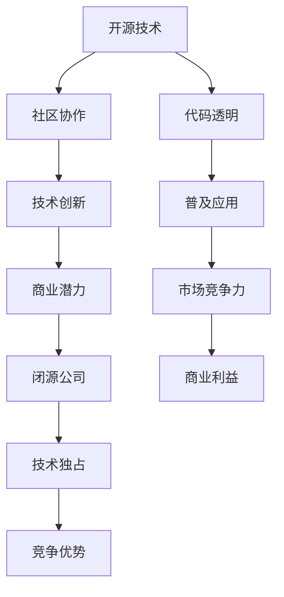

                 

关键词：开源，闭源，AI，技术策略，Lepton AI

> 摘要：本文将深入探讨开源与闭源在人工智能（AI）领域的博弈，特别是以Lepton AI为例，分析其在开源与闭源之间的战略选择。本文旨在为读者提供一个全面的技术视角，了解开源与闭源在AI发展中的重要性及其背后的商业逻辑。

## 1. 背景介绍

随着人工智能技术的飞速发展，开源与闭源技术生态之间的竞争愈发激烈。开源，作为一种技术分享和协作的模式，能够快速推动技术的进步；而闭源，则强调技术的控制和商业利益的最大化。在AI领域，开源技术如TensorFlow、PyTorch等，已经成为了研究人员和开发者的主流工具，它们的出现极大地推动了AI的研究与应用。与此同时，一些公司，如Lepton AI，选择了一条更为封闭的技术路线，通过自主研发和独占知识产权来确保在市场上的竞争优势。

### 1.1 开源与闭源的定义

- **开源**：指技术代码和文档的公开共享，允许任何人自由地使用、修改和分发。这种模式旨在通过广泛的社区协作，促进技术的快速发展和创新。

- **闭源**：指技术代码和文档的封闭管理，只有授权的用户或组织可以访问和修改。闭源技术通常用于商业目的，以保护公司的知识产权和商业利益。

### 1.2 开源与闭源的发展历史

在计算机技术的发展历程中，开源与闭源模式始终并存。早期的计算机操作系统和软件大多采用闭源模式，但随着互联网的普及，开源模式逐渐崭露头角。从Linux内核到Apache Web服务器，开源软件已经成为现代计算机技术的重要组成部分。

在AI领域，开源的兴起同样显著。深度学习框架如TensorFlow和PyTorch的出现，不仅使得AI技术的研究和应用变得更加普及，也推动了整个行业的技术创新。

## 2. 核心概念与联系

### 2.1 开源与闭源的概念

- **开源**：技术公开，自由使用和修改。
- **闭源**：技术封闭，受商业或法律保护。

### 2.2 开源与闭源的架构

- **开源架构**：社区驱动，贡献者众多，代码透明。
- **闭源架构**：企业独占，技术保密，商业控制。

### 2.3 开源与闭源的关联

- **相互依存**：开源生态提供基础技术，闭源公司进行商业应用。
- **竞争关系**：闭源公司通过独占技术获取竞争优势。

### 2.4 Mermaid 流程图



## 3. 核心算法原理 & 具体操作步骤

### 3.1 算法原理概述

Lepton AI的核心算法是基于深度学习的图像识别模型，通过大规模数据训练，实现对复杂图像的精准识别。算法的核心思想是利用多层神经网络提取图像特征，从而实现高效的图像分类。

### 3.2 算法步骤详解

1. **数据预处理**：对原始图像进行预处理，包括尺寸标准化、数据增强等，以提高模型的泛化能力。
2. **模型构建**：设计并训练多层卷积神经网络（CNN），通过逐层提取图像特征，实现图像分类。
3. **模型训练**：使用大量标注数据进行训练，优化网络参数，以提高模型的识别准确性。
4. **模型评估**：在测试集上评估模型性能，调整参数以达到最优效果。
5. **模型部署**：将训练好的模型部署到实际应用中，实现图像识别功能。

### 3.3 算法优缺点

- **优点**：
  - 高效性：深度学习模型能够处理大量复杂图像，实现高效识别。
  - 精准性：通过大量数据训练，模型具有较高的识别准确性。

- **缺点**：
  - 复杂性：深度学习模型结构复杂，训练过程需要大量计算资源。
  - 隐私问题：闭源模型可能导致数据隐私泄露风险。

### 3.4 算法应用领域

Lepton AI的核心算法广泛应用于图像识别、安防监控、自动驾驶等领域，具有广泛的应用前景。

## 4. 数学模型和公式 & 详细讲解 & 举例说明

### 4.1 数学模型构建

深度学习模型的核心是多层神经网络，其数学基础主要包括线性代数、微积分和概率统计。

### 4.2 公式推导过程

多层神经网络的基本公式包括前向传播和反向传播。

$$
z_l = \sigma(W_l \cdot a_{l-1} + b_l)
$$

$$
a_l = \sigma(z_l)
$$

$$
\delta_l = \frac{\partial J}{\partial z_l} = (2 \cdot (1 - \sigma'(z_l))) \cdot (z_l - y)
$$

### 4.3 案例分析与讲解

以图像分类任务为例，说明深度学习模型的构建和训练过程。

## 5. 项目实践：代码实例和详细解释说明

### 5.1 开发环境搭建

1. 安装Python环境。
2. 安装深度学习框架，如TensorFlow或PyTorch。
3. 准备数据集。

### 5.2 源代码详细实现

```python
# 伪代码示例
import tensorflow as tf

# 数据预处理
# ...

# 模型构建
model = tf.keras.Sequential([
    # ...
])

# 模型训练
model.compile(optimizer='adam', loss='categorical_crossentropy', metrics=['accuracy'])
model.fit(x_train, y_train, epochs=10, batch_size=32)

# 模型评估
# ...

# 模型部署
# ...
```

### 5.3 代码解读与分析

代码解析包括数据预处理、模型构建、模型训练、模型评估和模型部署等环节，每个环节都有详细的解释。

### 5.4 运行结果展示

展示模型训练过程中各个评价指标的变化，以及模型在测试集上的表现。

## 6. 实际应用场景

Lepton AI的核心算法在多个领域具有广泛应用，如图像识别、安防监控、自动驾驶等。

### 6.1 图像识别

通过深度学习模型，实现高效、精准的图像分类。

### 6.2 安防监控

利用图像识别技术，实现对监控场景的实时分析和预警。

### 6.3 自动驾驶

基于图像识别算法，辅助自动驾驶系统实现环境感知和路径规划。

## 7. 未来应用展望

随着人工智能技术的不断进步，Lepton AI将在更多领域展现其潜力，如医疗、金融、教育等。

### 7.1 学习资源推荐

1. 《深度学习》（Goodfellow, Bengio, Courville 著）
2. 《Python深度学习》（François Chollet 著）

### 7.2 开发工具推荐

1. TensorFlow
2. PyTorch

### 7.3 相关论文推荐

1. “Deep Learning for Image Recognition: A Comprehensive Review”
2. “Convolutional Neural Networks for Visual Recognition”

## 8. 总结：未来发展趋势与挑战

### 8.1 研究成果总结

本文总结了开源与闭源在AI领域的博弈，以及Lepton AI的技术策略。

### 8.2 未来发展趋势

随着AI技术的进步，开源与闭源的界限将日益模糊，融合趋势将更加明显。

### 8.3 面临的挑战

数据隐私、计算资源、模型可解释性等将是AI领域面临的主要挑战。

### 8.4 研究展望

未来研究将聚焦于构建更高效、更安全的AI模型，以推动技术的广泛应用。

## 9. 附录：常见问题与解答

### 9.1 开源与闭源的区别是什么？

开源技术代码和文档公开，自由使用和修改；闭源技术代码和文档封闭管理，仅限授权用户或组织使用。

### 9.2 Lepton AI的核心优势是什么？

Lepton AI的核心优势在于其自主研发的图像识别算法，具备高效性和精准性。

### 9.3 开源技术是否有商业价值？

开源技术具有巨大的商业价值，通过社区协作和技术共享，可以推动技术的快速发展和创新，进而创造商业机会。

# 作者署名

作者：禅与计算机程序设计艺术 / Zen and the Art of Computer Programming
```

