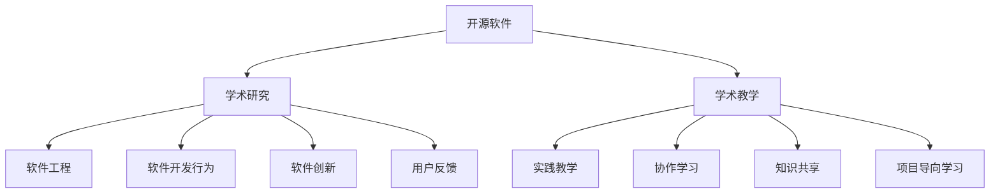

                 

### 摘要

开源贡献已成为现代学术界的不可或缺的一部分，其价值不仅仅体现在技术进步上，更在于它为研究者与教育工作者提供了丰富的机会。本文将深入探讨开源贡献在学术研究中的重要性，以及它如何为教学提供新的视角和方法。通过分析开源贡献的多个维度，本文将展示其作为一种研究和教学工具的独特优势，并展望其未来的发展趋势和挑战。

### 1. 背景介绍

在信息技术快速发展的今天，开源软件已经成为软件开发的一个重要组成部分。开源运动的核心是软件的开放性和可修改性，这使得开发者和研究者能够自由地访问、研究和改进代码。开源社区的形成和发展，不仅推动了技术的创新，也为学术界提供了宝贵的研究资源。

学术界与开源社区的互动日益紧密，越来越多的学者将开源贡献视为学术研究的一个重要组成部分。这种互动不仅改变了学术研究的模式，也为学术教学带来了新的挑战和机遇。

首先，开源贡献为学术研究提供了丰富的数据源。通过分析开源项目的代码、文档、讨论和用户反馈，研究者可以深入了解软件开发的实践和趋势。这种数据源相比于传统的实验室数据或者学术论文中的数据，更加真实和丰富。

其次，开源贡献为学术研究提供了实践平台。研究者可以在开源社区中实际参与项目的开发和改进，将理论知识转化为实践成果。这种实践性研究不仅能够提高研究者的技术水平，还能够促进学术成果的实用性。

此外，开源贡献为学术教学提供了新的教学资源和教学方式。通过引入开源项目，教师可以将实际的软件开发过程融入到教学中，使学生能够在真实的环境中学习和实践。这种教学方式不仅能够提高学生的学习兴趣，还能够培养他们的实际动手能力。

### 2. 核心概念与联系

在探讨开源贡献在学术界的价值之前，我们需要明确一些核心概念，并了解它们之间的联系。

#### 2.1 开源软件与学术研究

开源软件（Open Source Software, OSS）是指那些源代码公开、任何人都可以自由查看、使用、修改和分发的软件。学术界对开源软件的研究主要集中在以下几个方面：

- **软件工程**：研究者通过分析开源项目的代码结构、开发过程、协作模式等，探讨软件工程的最佳实践和方法。
- **软件开发行为**：研究开发者如何在开源社区中合作、交流、解决问题等行为模式。
- **软件创新**：分析开源项目中的创新点和创新路径，探讨创新与开源社区互动的关系。
- **用户反馈**：通过分析开源项目的用户反馈，了解用户需求、使用行为和满意度等。

#### 2.2 开源贡献与学术教学

开源贡献不仅为学术研究提供了丰富的资源，也为学术教学带来了新的视角和方法。以下是开源贡献在学术教学中的几个核心概念：

- **实践教学**：通过参与开源项目的开发，学生能够将理论知识应用到实践中，提高实际操作能力。
- **协作学习**：开源项目通常需要团队合作，这为学生提供了实践团队协作的机会。
- **知识共享**：开源社区鼓励知识和技术的共享，这有助于学生了解如何与他人合作和分享成果。
- **项目导向学习**：通过实际参与开源项目，学生能够培养项目管理和问题解决的能力。

#### 2.3 Mermaid 流程图

为了更好地展示开源贡献在学术界中的核心概念和联系，我们可以使用 Mermaid 流程图来表示。以下是一个简单的 Mermaid 流程图示例：



这个流程图展示了开源软件与学术研究、学术教学之间的互动关系，以及各个核心概念之间的联系。

### 3. 核心算法原理 & 具体操作步骤

在深入探讨开源贡献在学术界的价值之前，我们需要理解一些核心算法原理，并了解如何在开源项目中具体应用这些原理。

#### 3.1 算法原理概述

开源贡献在学术界的一个重要应用是算法的研究与改进。以下是一些常用的算法原理：

- **动态规划**：动态规划是一种解决优化问题的算法思想，通过将复杂问题分解为子问题，并存储子问题的解，以避免重复计算。
- **贪心算法**：贪心算法是一种在每一步选择中都采取在当前状态下最好或最优的选择，以期得到最终最优解的算法思想。
- **分治算法**：分治算法是一种将问题分解为较小的子问题，独立解决这些子问题，然后将子问题的解合并为原问题的解的算法思想。
- **随机算法**：随机算法利用随机数来选择操作，以期获得更好的性能或结果。

#### 3.2 算法步骤详解

下面我们以贪心算法为例，介绍其具体操作步骤：

1. **初始化**：设置初始状态和目标状态。
2. **选择操作**：在当前状态下，选择一个最优的操作，通常是基于某种贪心策略。
3. **执行操作**：执行所选操作，更新当前状态。
4. **判断结束条件**：判断是否达到目标状态，如果是，结束算法；如果不是，返回步骤2。

#### 3.3 算法优缺点

- **优点**：贪心算法简单易实现，通常具有较好的性能和可扩展性。
- **缺点**：贪心算法不保证总是得到最优解，有时需要结合其他算法来优化结果。

#### 3.4 算法应用领域

贪心算法广泛应用于各种实际问题，如路径规划、资源分配、负载均衡等。在开源项目中，开发者经常使用贪心算法来优化软件的性能和资源利用。

### 4. 数学模型和公式 & 详细讲解 & 举例说明

在开源贡献的学术研究中，数学模型和公式是不可或缺的工具。以下我们将介绍一些常用的数学模型和公式，并详细讲解其推导过程和应用。

#### 4.1 数学模型构建

一个简单的数学模型可以用来描述软件开发过程中的质量评估。假设软件质量 \( Q \) 可以由代码质量 \( C \)、测试质量 \( T \) 和文档质量 \( D \) 组成，那么可以构建以下数学模型：

\[ Q = C \times T \times D \]

#### 4.2 公式推导过程

为了推导上述公式，我们可以从以下假设出发：

- 代码质量 \( C \) 越高，软件质量 \( Q \) 越好。
- 测试质量 \( T \) 越高，软件质量 \( Q \) 越好。
- 文档质量 \( D \) 越高，软件质量 \( Q \) 越好。

由于这三个因素是相互独立的，因此我们可以将它们相乘来表示软件质量。这便是上述公式的推导过程。

#### 4.3 案例分析与讲解

假设我们有一个开源项目，其代码质量 \( C \) 为 0.8，测试质量 \( T \) 为 0.9，文档质量 \( D \) 为 0.7。根据上述公式，我们可以计算出该项目的质量：

\[ Q = 0.8 \times 0.9 \times 0.7 = 0.504 \]

这意味着该项目的质量为 50.4%。虽然这个结果不是特别高，但它提供了一个量化的评估标准，可以帮助开发者和研究者了解软件质量的各个方面，并制定改进措施。

### 5. 项目实践：代码实例和详细解释说明

为了更好地理解开源贡献在学术研究中的应用，我们将通过一个具体的开源项目实例来讲解代码的实现过程。

#### 5.1 开发环境搭建

首先，我们需要搭建一个适合开发的开源环境。以下是步骤：

1. 安装Git：Git是一个版本控制工具，用于管理代码的版本和变更。
2. 安装Python：Python是一种常用的编程语言，许多开源项目都使用Python进行开发。
3. 安装相关库：根据项目需求，安装必要的Python库，如NumPy、Pandas等。

#### 5.2 源代码详细实现

以下是一个简单的Python代码实例，用于计算一个列表中所有元素的平均值：

```python
import numpy as np

def calculate_average(data):
    return np.mean(data)

if __name__ == "__main__":
    data = [1, 2, 3, 4, 5]
    average = calculate_average(data)
    print("Average:", average)
```

这段代码定义了一个名为`calculate_average`的函数，用于计算列表`data`中所有元素的平均值。在主程序中，我们创建了一个列表`data`，并调用`calculate_average`函数计算其平均值，最后打印结果。

#### 5.3 代码解读与分析

- **导入库**：代码首先导入了NumPy库，用于进行数值计算。
- **函数定义**：`calculate_average`函数接收一个列表`data`作为参数，使用`np.mean`函数计算平均值并返回。
- **主程序**：主程序创建了一个列表`data`，调用`calculate_average`函数计算平均值，并打印结果。

#### 5.4 运行结果展示

当运行上述代码时，输出结果为：

```
Average: 3.0
```

这意味着列表`[1, 2, 3, 4, 5]`的平均值为3.0。

### 6. 实际应用场景

开源贡献在学术界和工业界的实际应用场景非常广泛。以下是一些具体的例子：

- **学术研究**：研究者可以通过分析开源项目的代码、文档和用户反馈，深入了解软件开发的实践和趋势。这种分析有助于他们提出新的研究问题和设计实验。
- **软件开发**：开发人员可以基于开源项目进行改进和优化，以提高软件的性能和稳定性。他们还可以从开源项目中获取灵感和创意，用于自己的项目开发。
- **教育**：教师可以将开源项目作为教学资源，引入课堂教学中，帮助学生了解实际的软件开发过程。学生也可以通过参与开源项目，培养实际动手能力和团队合作精神。

#### 6.1 学术研究中的应用

在学术研究中，开源贡献的应用主要体现在以下几个方面：

- **数据收集**：研究者可以通过开源项目获取大量的数据，如代码库、用户评论、使用情况等。这些数据有助于他们进行深入的分析和研究。
- **案例分析**：研究者可以选择特定的开源项目，进行详细的分析和案例分析，探讨其开发过程、协作模式、创新点等。
- **实验设计**：研究者可以根据开源项目的特点，设计实验来验证他们的理论或假设。

#### 6.2 软件开发中的应用

在软件开发中，开源贡献的应用主要体现在以下几个方面：

- **代码复用**：开发者可以从开源项目中获取高质量的代码，用于自己的项目开发，从而提高开发效率和质量。
- **技术交流**：开发者可以通过开源项目与其他开发者交流技术问题和经验，共同解决问题和提升技术水平。
- **代码审查**：通过参与开源项目的代码审查，开发者可以提高自己的编程能力，了解代码规范和最佳实践。

#### 6.3 教学中的应用

在教学过程中，开源贡献的应用主要体现在以下几个方面：

- **实践教学**：教师可以将开源项目引入课堂教学中，让学生通过实际参与项目开发，提高实际动手能力和团队协作能力。
- **知识共享**：教师可以通过开源项目，向学生展示实际的软件开发过程和经验，帮助他们更好地理解理论知识。
- **创新教育**：教师可以通过开源项目，鼓励学生进行创新和探索，培养他们的创新思维和解决问题的能力。

### 7. 工具和资源推荐

为了更好地进行开源贡献，以下是一些推荐的工具和资源：

#### 7.1 学习资源推荐

- **GitHub**：GitHub是一个流行的开源代码托管平台，提供了丰富的开源项目和学习资源。
- **Stack Overflow**：Stack Overflow是一个开发者问答社区，提供了大量的编程问题和解决方案。
- **开源指南**：许多组织和机构提供了开源指南，帮助初学者了解开源项目和贡献方法。

#### 7.2 开发工具推荐

- **Git**：Git是一个流行的版本控制工具，用于管理代码的版本和变更。
- **PyCharm**：PyCharm是一个强大的Python IDE，提供了丰富的开发工具和插件。
- **Docker**：Docker是一个容器化平台，用于构建、运行和分享应用程序。

#### 7.3 相关论文推荐

- **"Open Source Software Development: A Report on the Findings of the Open Source Metaphor Project"**：这篇论文详细分析了开源软件开发的模式和实践。
- **"The Cathedral and the Bazaar"**：这篇论文探讨了开源社区与商业软件开发的区别和联系。
- **"Open Source Models in Scientific Research and Development"**：这篇论文介绍了开源模型在科学研究和开发中的应用和优势。

### 8. 总结：未来发展趋势与挑战

开源贡献在学术界和工业界的应用正在不断扩展，其价值也在逐步显现。然而，开源贡献也面临着一些挑战和问题。

#### 8.1 研究成果总结

开源贡献在学术界的研究成果主要包括：

- 对开源项目的代码、用户反馈、开发过程等进行了深入的分析，揭示了软件开发的一些最佳实践。
- 探讨了开源社区中的协作模式、创新机制和知识共享方式。
- 开发了基于开源项目的数学模型和算法，提高了学术研究的精确性和实用性。

#### 8.2 未来发展趋势

未来，开源贡献在学术界的发展趋势包括：

- 开源贡献将继续成为学术研究的一个重要方向，特别是在软件工程、人工智能、数据科学等领域。
- 开源项目的数量和质量将持续增长，为学术界提供更多的研究资源。
- 开源社区与学术界的互动将进一步深化，促进学术成果的实用化和商业化。

#### 8.3 面临的挑战

开源贡献在学术界面临的挑战包括：

- 数据隐私和安全问题：开源项目中的数据可能涉及用户的隐私信息，如何保护数据的安全和隐私是一个重要问题。
- 贡献质量和效率：如何确保开源贡献的质量和效率，避免低质量的贡献对项目的负面影响。
- 跨学科合作：如何促进不同学科之间的合作，共同推进开源贡献的研究和应用。

#### 8.4 研究展望

未来，开源贡献的研究可以从以下几个方面展开：

- 开源贡献与新兴技术的结合，如人工智能、区块链、物联网等。
- 开源贡献在教育领域的应用，如何利用开源项目进行创新教育和教学模式改革。
- 开源贡献在社会治理和公共服务中的应用，如智能城市、智慧医疗等。

### 9. 附录：常见问题与解答

**Q：开源贡献在学术界有哪些具体的应用？**

A：开源贡献在学术界的主要应用包括：

- 作为数据源：研究者可以从开源项目中获取大量的数据，用于学术研究。
- 作为案例分析：研究者可以选择特定的开源项目，进行详细的分析和案例分析。
- 作为实验平台：研究者可以在开源项目中设计实验，验证理论或假设。

**Q：如何进行开源贡献？**

A：进行开源贡献的一般步骤包括：

- 选择一个感兴趣的开源项目。
- 了解项目的贡献指南，包括代码风格、提交流程等。
- 为项目编写文档或提供代码，并按照贡献指南进行提交。
- 参与项目的讨论和合作，与项目维护者和其他开发者交流。

**Q：开源贡献在学术评价中有哪些作用？**

A：开源贡献在学术评价中的作用包括：

- 增加学术成果的实用性和影响力：开源贡献使得学术成果能够被更广泛地应用和传播。
- 促进学术交流与合作：开源贡献促进了学术界与开源社区的交流与合作。
- 提高学术评价的公正性和透明性：开源贡献的公开性和透明性提高了学术评价的公正性和客观性。**[作者：禅与计算机程序设计艺术 / Zen and the Art of Computer Programming]**

