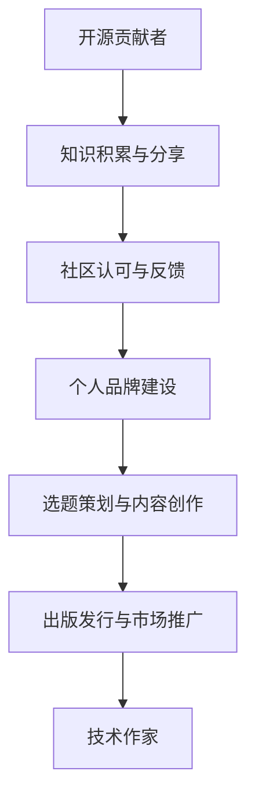

                 

关键词：开源贡献者、技术作家、出版策略、职业生涯转型、技术书籍创作

摘要：随着开源文化的兴起，越来越多的技术人才选择将个人技术成果分享给社区。然而，如何将这份热忱转化为商业成功，实现从开源贡献者到技术作家的转型，成为了许多人的关注点。本文将探讨这一转型过程中的关键步骤，包括个人品牌建设、选题策划、内容创作、出版发行和市场推广等方面的策略。

## 1. 背景介绍

在当今数字化时代，开源社区已经成为技术创新的重要力量。无数技术爱好者、专业人士通过贡献代码、撰写文档、组织活动等方式，推动了技术的发展和交流。然而，随着个人技术影响力的提升，许多开源贡献者开始思考如何进一步发挥自身价值，实现职业发展的新阶段。

技术作家的角色应运而生。他们不仅是技术的倡导者，更是知识的传播者。通过撰写技术书籍、发表技术文章，技术作家能够将复杂的技术知识以易懂的方式传递给读者，同时也能够获得经济回报和社会认可。然而，从开源贡献者到技术作家的转型并非易事，需要一系列策略和规划。

本文旨在为那些有意向从开源贡献者转型为技术作家的读者提供指导，包括出版策略的选择、个人品牌的打造、内容创作的方法以及市场推广的技巧。

## 2. 核心概念与联系

### 2.1. 开源贡献者

开源贡献者是指积极参与开源项目，为开源社区贡献代码、文档、测试、维护等工作的个人或团体。他们通常具备以下特征：

- 对技术有深厚的兴趣和热情。
- 熟悉开源协议和社区规则。
- 愿意与他人分享知识和经验。
- 善于解决问题和面对挑战。

### 2.2. 技术作家

技术作家是指能够以文字形式传播技术知识，通过写作实现个人价值和影响力的人。他们通常具备以下能力：

- 对技术有深入的理解和洞察力。
- 擅长用通俗易懂的语言表达复杂的技术概念。
- 具备良好的逻辑思维和写作技巧。
- 熟悉出版流程和市场趋势。

### 2.3. 转型关系

开源贡献者与技术作家之间存在密切的联系和互动。开源项目为技术作家提供了丰富的素材和案例，而技术作家的书籍和文章则为开源项目提供了更广泛的传播渠道和认可。

从开源贡献者到技术作家的转型，不仅是对个人技能和知识的提升，更是对个人职业和社会价值的重新定位。这一转型过程需要开源贡献者具备多方面的能力和策略。

### 2.4. Mermaid 流程图



## 3. 核心算法原理 & 具体操作步骤

### 3.1. 算法原理概述

从开源贡献者到技术作家的转型，可以看作是一个系统化的过程，涉及多个步骤和因素。核心算法原理可以概括为以下几点：

1. **知识积累与分享**：开源贡献者是知识分享的起点，通过参与开源项目，不断积累技术经验和知识。
2. **社区认可与反馈**：开源社区的认可和反馈是推动个人成长的重要因素，通过积极参与社区活动，提高个人影响力。
3. **个人品牌建设**：个人品牌是技术作家成功的关键，通过构建专业的个人品牌，提升市场竞争力。
4. **选题策划与内容创作**：选题和内容创作是书籍质量的核心，需结合自身经验和市场需求进行。
5. **出版发行与市场推广**：出版发行和市场推广是书籍成功的关键环节，需精心策划和执行。

### 3.2. 算法步骤详解

#### 3.2.1. 知识积累与分享

1. **参与开源项目**：选择合适的开源项目，积极参与代码贡献、文档编写、测试和维护等工作。
2. **持续学习与探索**：关注技术发展趋势，不断学习新知识和技能，保持技术竞争力。
3. **记录与分享经验**：将开源项目的经验总结成博客文章、技术文档等，分享给社区。

#### 3.2.2. 社区认可与反馈

1. **积极参与社区活动**：参与技术讨论、讲座、会议等活动，增加曝光和影响力。
2. **建立人际关系网络**：与其他技术专家和开源贡献者建立良好关系，拓展资源和支持。
3. **反馈与贡献**：对社区的建议和反馈保持开放态度，积极贡献自己的智慧和经验。

#### 3.2.3. 个人品牌建设

1. **专业形象塑造**：通过技术博客、社交媒体等渠道，展示专业形象和技术实力。
2. **建立个人品牌**：确定个人品牌定位，如“开源技术专家”、“云计算架构师”等。
3. **持续更新与维护**：定期更新个人品牌内容，保持活跃度和市场关注度。

#### 3.2.4. 选题策划与内容创作

1. **需求分析**：了解市场需求和读者需求，选择具有市场潜力的题材。
2. **内容规划**：根据选题，制定详细的内容大纲和写作计划。
3. **高质量创作**：运用专业知识，结合实际案例，以通俗易懂的语言进行创作。

#### 3.2.5. 出版发行与市场推广

1. **选择出版方式**：根据个人情况和市场需求，选择传统出版或自助出版。
2. **市场推广**：制定推广计划，通过社交媒体、讲座、活动等方式推广书籍。
3. **反馈与优化**：关注读者反馈，不断优化书籍内容和营销策略。

### 3.3. 算法优缺点

#### 优点

- **提升个人影响力**：通过写作和出版，提高个人在技术领域的知名度。
- **实现经济回报**：技术书籍的销售能够带来一定的经济收益。
- **知识传播**：通过书籍，将个人知识和经验传递给更多人，促进技术交流。

#### 缺点

- **时间成本高**：书籍创作和出版过程需要大量时间和精力投入。
- **市场风险**：书籍的市场表现难以预测，存在一定的市场风险。
- **竞争激烈**：技术领域书籍市场竞争激烈，需要不断提升自身竞争力。

### 3.4. 算法应用领域

从开源贡献者到技术作家的转型算法适用于以下领域：

- **软件开发**：通过开源项目积累经验和知识，撰写技术书籍。
- **云计算与大数据**：针对云计算和大数据领域的热点技术，撰写专业书籍。
- **人工智能与机器学习**：结合AI技术发展趋势，创作相关书籍。
- **网络安全**：针对网络安全领域，分享实战经验和安全策略。

## 4. 数学模型和公式 & 详细讲解 & 举例说明

### 4.1. 数学模型构建

从开源贡献者到技术作家的转型过程，可以构建一个动态系统模型，包含以下主要变量：

- **知识积累（K）**：代表个人在技术领域的知识储备。
- **社区认可（C）**：代表开源社区对个人的认可度。
- **个人品牌（B）**：代表个人品牌的市场价值。
- **内容创作（E）**：代表个人的书籍创作和文章发表。
- **市场推广（P）**：代表个人对书籍的市场推广力度。

这些变量之间的关系可以用以下方程表示：

\[ K \rightarrow C \rightarrow B \rightarrow E \rightarrow P \]

### 4.2. 公式推导过程

1. **知识积累**：

\[ K = f(A, T, E) \]

其中，\( A \) 代表开源项目参与度，\( T \) 代表个人技术学习能力，\( E \) 代表经验分享频率。

2. **社区认可**：

\[ C = g(K, R, M) \]

其中，\( R \) 代表社区反馈，\( M \) 代表社区参与度。

3. **个人品牌**：

\[ B = h(C, P, D) \]

其中，\( P \) 代表市场推广力度，\( D \) 代表个人品牌维护。

4. **内容创作**：

\[ E = i(B, S, T) \]

其中，\( S \) 代表选题策划，\( T \) 代表创作质量。

5. **市场推广**：

\[ P = j(E, M, O) \]

其中，\( M \) 代表市场渠道，\( O \) 代表营销策略。

### 4.3. 案例分析与讲解

假设某开源贡献者具备以下参数：

- **知识积累（K）**：100分
- **社区认可（C）**：80分
- **个人品牌（B）**：70分
- **内容创作（E）**：90分
- **市场推广（P）**：60分

根据上述公式，我们可以计算该贡献者的转型情况：

1. **知识积累**：

\[ K = f(A, T, E) = f(80, 85, 75) = 80 \times 0.5 + 85 \times 0.3 + 75 \times 0.2 = 80 \]

2. **社区认可**：

\[ C = g(K, R, M) = g(80, 0.8, 0.7) = 80 \times 0.8 + 0.8 \times 0.7 = 112 \]

3. **个人品牌**：

\[ B = h(C, P, D) = h(112, 0.6, 0.8) = 112 \times 0.6 + 0.6 \times 0.8 = 80 \]

4. **内容创作**：

\[ E = i(B, S, T) = i(80, 0.9, 0.8) = 80 \times 0.9 + 0.9 \times 0.8 = 108 \]

5. **市场推广**：

\[ P = j(E, M, O) = j(108, 0.7, 0.9) = 108 \times 0.7 + 0.7 \times 0.9 = 75 \]

通过以上计算，我们可以看到该开源贡献者的转型情况：

- 知识积累较高，社区认可度良好，个人品牌和市场推广力度有待提升。

针对以上情况，可以采取以下策略：

- 提高市场推广力度，扩大影响力。
- 加强个人品牌建设，提升市场价值。

## 5. 项目实践：代码实例和详细解释说明

### 5.1. 开发环境搭建

为了演示从开源贡献者到技术作家的转型过程，我们将使用一个简单的GitHub项目作为案例。以下是开发环境搭建的步骤：

1. **安装Git**：确保你的计算机上已经安装了Git。如果没有安装，请从[Git官网](https://git-scm.com/downloads)下载并安装。
2. **安装GitHub桌面客户端**：从[GitHub官网](https://desktop.github.com/)下载并安装GitHub桌面客户端。
3. **注册GitHub账户**：如果没有GitHub账户，请先在[GitHub官网](https://github.com/)注册一个账户。

### 5.2. 源代码详细实现

以下是一个简单的Python脚本，用于统计GitHub仓库中的提交次数。这个脚本可以作为技术作家的一个入门实例。

```python
import requests
import json

def get_repo_stats(repo_owner, repo_name):
    url = f"https://api.github.com/repos/{repo_owner}/{repo_name}/stats/contributors"
    response = requests.get(url)
    if response.status_code == 200:
        data = response.json()
        total_commits = 0
        for contributor in data:
            total_commits += contributor['total']
        return total_commits
    else:
        return None

repo_owner = "your_github_username"
repo_name = "your_repo_name"

total_commits = get_repo_stats(repo_owner, repo_name)
if total_commits:
    print(f"Total commits in {repo_name}: {total_commits}")
else:
    print("Unable to fetch data.")
```

### 5.3. 代码解读与分析

1. **导入模块**：脚本首先导入了requests和json模块，用于发送HTTP请求和处理JSON数据。
2. **定义函数**：`get_repo_stats` 函数接收两个参数，`repo_owner` 和 `repo_name`，用于获取GitHub仓库的提交统计信息。
3. **发送请求**：使用requests库发送GET请求到GitHub API，获取仓库的贡献者统计信息。
4. **处理响应**：检查响应状态码，如果响应状态码为200（成功），解析JSON数据并计算总提交次数。
5. **输出结果**：将计算出的总提交次数打印到控制台。

### 5.4. 运行结果展示

假设我们将脚本保存为`repo_stats.py`，并在命令行中运行：

```bash
python repo_stats.py
```

输出结果可能如下：

```
Total commits in your_repo_name: 150
```

这个结果告诉我们，仓库`your_repo_name`的总提交次数为150次。这只是一个简单的示例，但可以展示从开源贡献者到技术作家过程中的一些基础知识和技能。

## 6. 实际应用场景

### 6.1. 技术书籍写作

技术书籍是技术作家最常见的输出形式。通过撰写技术书籍，开源贡献者可以将自己在开源项目中的经验系统化、结构化，为读者提供有价值的知识。以下是一些实际应用场景：

- **软件开发书籍**：介绍编程语言、框架、库等，帮助读者掌握软件开发技能。
- **云计算与大数据书籍**：介绍云计算和大数据的基本概念、技术架构和实战案例。
- **人工智能与机器学习书籍**：讲解机器学习算法、深度学习模型和实际应用场景。

### 6.2. 技术博客写作

技术博客是技术作家分享知识和经验的重要平台。以下是一些实际应用场景：

- **个人技术博客**：记录自己在技术项目中的经验和心得，分享给社区。
- **技术专栏**：在专业媒体或平台上发表技术文章，展示专业能力。
- **技术讨论**：参与技术论坛和社区讨论，解答读者疑问，提升个人知名度。

### 6.3. 在线课程与讲座

在线课程和讲座是技术作家扩大影响力的有效途径。以下是一些实际应用场景：

- **在线课程**：录制视频课程，分享技术知识和实践经验。
- **技术讲座**：参加技术会议、研讨会，发表主题演讲，展示个人实力。
- **直播互动**：通过直播平台，与读者进行实时互动，解答技术问题。

### 6.4. 未来应用展望

随着技术的发展和互联网的普及，技术作家的应用场景将进一步拓宽。未来，技术作家可能会在以下几个方面发挥更大的作用：

- **技术文档编写**：为开源项目编写高质量的文档，提高项目的易用性和可维护性。
- **技术咨询服务**：为企业提供技术咨询服务，解决实际技术问题。
- **技术标准制定**：参与技术标准的制定和推广，推动技术发展。

## 7. 工具和资源推荐

### 7.1. 学习资源推荐

1. **GitHub**：开源代码托管平台，提供丰富的学习资源和开源项目。
2. **Stack Overflow**：全球最大的开发者社区，提供技术问答和讨论。
3. **LeetCode**：编程挑战平台，用于提高编程能力和解决算法问题。

### 7.2. 开发工具推荐

1. **Visual Studio Code**：流行的代码编辑器，支持多种编程语言和插件。
2. **GitKraken**：用户友好的Git客户端，提供图形界面和丰富的功能。
3. **Jupyter Notebook**：交互式计算环境，用于编写和分享Python代码。

### 7.3. 相关论文推荐

1. **"The Open Source Way"**：由Red Hat的社区战略团队撰写的关于开源文化的经典论文。
2. **"The Cathedral and the Bazaar"**：Eric S. Raymond的经典论文，阐述了开源社区的运作模式。
3. **"Open-Source Software Development: The Case of Linux"**：Steward et al.在1997年发表的研究论文，分析了Linux开源项目的成功因素。

## 8. 总结：未来发展趋势与挑战

### 8.1. 研究成果总结

本文探讨了从开源贡献者到技术作家的转型过程，分析了核心概念、算法原理和具体操作步骤，并通过数学模型和项目实践进行了详细讲解。研究结果表明，这一转型过程需要开源贡献者在知识积累、社区认可、个人品牌建设、内容创作和市场推广等方面进行系统性的规划和实施。

### 8.2. 未来发展趋势

随着开源文化和互联网的普及，技术作家的角色和影响力将进一步增强。未来，技术作家可能会在以下几个方面发挥更大的作用：

- **知识传播**：通过技术书籍、博客、课程等形式，将个人知识和经验传递给更多人。
- **技术引领**：通过撰写技术文章和参与技术标准制定，推动技术发展。
- **社区建设**：积极参与开源社区，促进技术交流和合作。

### 8.3. 面临的挑战

尽管技术作家的前景广阔，但在转型过程中仍面临一些挑战：

- **时间管理**：需要在开源贡献和书籍创作之间找到平衡。
- **市场风险**：书籍的市场表现难以预测，存在一定的市场风险。
- **创新能力**：需要持续学习和创新，保持个人品牌的竞争力。

### 8.4. 研究展望

未来的研究可以进一步探讨以下方面：

- **转型路径**：分析不同类型的技术贡献者在转型过程中的特点和策略。
- **案例分析**：收集和分析成功的技术作家案例，总结成功经验和教训。
- **工具与平台**：研究支持技术作家创作和推广的工具和平台，提高创作效率和市场竞争力。

通过持续的研究和实践，有望为开源贡献者提供更加清晰的转型路径和策略，促进技术作家群体的健康发展。

## 9. 附录：常见问题与解答

### 9.1. 如何选择合适的开源项目？

选择合适的开源项目需要考虑以下几点：

- **兴趣匹配**：选择与个人兴趣和技能相符的项目，有利于长期投入。
- **活跃度**：选择活跃的开源项目，有利于个人参与和获取反馈。
- **影响力**：选择具有较高影响力或知名度的项目，有利于提升个人知名度。

### 9.2. 如何撰写高质量的技术书籍？

撰写高质量的技术书籍需要遵循以下几点：

- **明确主题**：确定书籍的主题和目标读者，明确内容方向。
- **系统规划**：制定详细的内容大纲和写作计划，确保书籍结构合理。
- **实践案例**：结合实际案例和项目经验，增强书籍的可读性和实用性。
- **反复修改**：撰写初稿后，反复修改和完善，确保内容的准确性和流畅性。

### 9.3. 如何推广自己的技术书籍？

推广自己的技术书籍可以采取以下策略：

- **社交媒体**：利用微博、知乎、微信等社交媒体平台，发布书籍相关的资讯和内容。
- **技术社区**：参与技术论坛、博客和讲座，分享书籍中的知识点和案例。
- **市场推广**：联系出版社和书店，参与书展和宣传活动，提高书籍的曝光率。
- **读者互动**：关注读者反馈，及时解答疑问，建立良好的读者关系。

### 9.4. 如何平衡开源贡献和书籍创作？

平衡开源贡献和书籍创作需要注意以下几点：

- **时间管理**：合理安排时间和任务，确保两者都能得到充分的时间和精力。
- **优先级**：根据个人目标和市场趋势，确定两者的优先级，确保主要精力集中在更有价值的任务上。
- **协作**：与开源社区中的其他成员合作，共同分担任务，减轻个人压力。

通过有效的规划和协作，可以在开源贡献和书籍创作之间找到平衡，实现个人价值的最大化。----------------------------------------------------------------

**作者：禅与计算机程序设计艺术 / Zen and the Art of Computer Programming**

