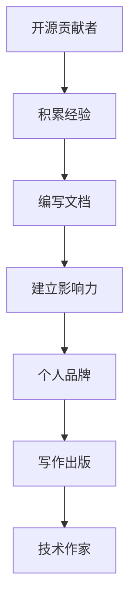

                 

关键词：开源贡献者，技术作家，出版策略，知识分享，个人品牌建设，内容创作技巧，商业成功案例

> 摘要：本文旨在探讨开源贡献者如何通过有效的出版策略实现向技术作家的成功转型。通过对开源贡献者与技术作家角色的对比分析，文章将详细阐述个人品牌建设、内容创作技巧、市场定位和商业化途径等方面的策略，并结合实际案例，为想要在技术领域实现多元发展的开源贡献者提供实用的指导。

## 1. 背景介绍

在快速发展的科技时代，开源社区已经成为技术发展的核心力量。许多程序员和开发者积极参与开源项目，不仅为技术进步贡献力量，还在这一过程中积累了个人的技术经验和声誉。然而，随着影响力的扩大，一些优秀的开源贡献者开始思考如何将个人技能和影响力转化为可持续的商业模式。

技术作家，作为技术领域的知识传播者，他们的作品不仅可以帮助他人学习新技术，还能够在市场上获得认可和回报。许多开源贡献者在积累了一定的人气和专业经验后，希望将自己的知识体系化和系统化，通过出版书籍来扩大影响力。但是，如何从一名活跃的开源贡献者成功转型为一名技术作家，是许多人心中的疑问。

本文将围绕这一主题，从多个角度探讨开源贡献者如何通过出版策略实现向技术作家的转型，包括个人品牌建设、内容创作技巧、市场定位和商业化途径等方面。

## 2. 核心概念与联系

在探讨转型策略之前，我们需要理解一些核心概念，它们是开源贡献者与技术作家的联系与区别，以及这些角色在技术生态系统中的重要性。

### 2.1 开源贡献者

开源贡献者是指那些为开源项目提供代码、文档、测试和其他形式贡献的个人或组织。他们的工作通常具有以下特点：

- **自愿性**：开源项目通常基于志愿者精神，贡献者是出于兴趣或责任感参与其中。
- **共享性**：开源项目的成果是共享的，任何人都可以自由使用、修改和分发。
- **技术性**：开源贡献者通常具备较高的技术能力，能够解决复杂的技术问题。

### 2.2 技术作家

技术作家则是那些专注于编写技术书籍、博客和教程的专业人士。他们通过文字传播技术知识，帮助他人理解和应用新技术。技术作家通常具有以下特点：

- **专业性**：技术作家需要具备深厚的专业知识和写作技巧，能够将复杂的技术概念解释得清晰易懂。
- **创造性**：技术作家不仅需要掌握现有的技术知识，还需要具备一定的创造能力，将知识体系化。
- **影响力**：技术作家的作品往往对技术社区和行业发展产生深远的影响。

### 2.3 核心概念联系

开源贡献者与技术作家在技术生态系统中各有其独特的作用。开源贡献者通过实践积累技术经验，而技术作家则通过写作将这些经验传播给更广泛的读者。两者之间的联系在于：

- **知识共享**：开源贡献者通过编写文档和教程，实际上已经在进行技术写作，这是技术作家工作的基础。
- **个人品牌**：开源贡献者的声誉和影响力可以为技术作家的出版作品增色，反之亦然。
- **技能互补**：技术作家可以将开源贡献者的实践经验系统化，从而产生更有价值的作品。

### 2.4 Mermaid 流程图

为了更好地理解这两个角色的联系，以下是一个简单的 Mermaid 流程图，展示了开源贡献者向技术作家转型的过程。



在这个流程图中，A 表示开源贡献者，他们通过参与开源项目积累经验。B 表示编写文档，这是技术写作的起点。C 表示建立影响力，开源贡献者的声誉逐渐提升。D 表示个人品牌，这是技术作家成功的基石。E 表示写作出版，开源贡献者开始将自己的经验系统化并出版成书。F 表示技术作家，这是转型的最终目标。

## 3. 核心算法原理 & 具体操作步骤

### 3.1 算法原理概述

要从开源贡献者成功转型为技术作家，关键在于个人品牌建设、内容创作技巧、市场定位和商业化途径。以下将分别介绍这些核心算法的原理和具体操作步骤。

#### 3.1.1 个人品牌建设

个人品牌建设是成功转型的第一步。个人品牌建设的关键在于树立独特、专业的个人形象，让读者能够快速识别并认可你。以下是几个关键步骤：

- **确立专业领域**：选择你最有经验和热情的领域，作为你的专业方向。
- **持续输出内容**：定期发布高质量的技术文章、博客和教程，建立个人品牌。
- **参与社区活动**：积极参与技术社区，与其他专业人士交流，扩大影响力。
- **树立独特形象**：通过标志性的语言、风格和表达方式，打造独特的个人形象。

#### 3.1.2 内容创作技巧

内容创作技巧是技术作家的核心能力。以下是几个关键点：

- **深入浅出**：将复杂的技术概念用简单易懂的语言表达出来。
- **案例驱动**：通过实际案例展示技术应用的场景和效果。
- **持续更新**：随着技术的不断发展，定期更新和优化你的作品。

#### 3.1.3 市场定位

市场定位是确保你的作品能够满足市场需求的重要步骤。以下是几个关键点：

- **目标读者**：明确你的目标读者群体，了解他们的需求和痛点。
- **竞争分析**：分析同领域的其他作家的作品，找出你的差异化优势。
- **持续调研**：关注行业动态和趋势，及时调整你的定位策略。

#### 3.1.4 商业化途径

商业化途径是将你的作品转化为商业成功的关键。以下是几个关键点：

- **出版书籍**：选择合适的出版平台，将你的经验系统化并出版成书。
- **在线课程**：开设在线课程，通过教授知识获得收入。
- **咨询和培训**：提供技术咨询服务或培训课程，为企业提供技术解决方案。
- **知识付费**：通过知识付费模式，为读者提供高质量的内容服务。

### 3.2 算法步骤详解

下面是具体的操作步骤，帮助你从开源贡献者成功转型为技术作家：

#### 3.2.1 个人品牌建设

1. **确立专业领域**：选择你最有经验和热情的领域，作为你的专业方向。
2. **创建个人博客**：选择一个专业的博客平台，定期发布技术文章。
3. **参与社区活动**：在GitHub、Stack Overflow等平台上积极参与讨论。
4. **建立社交媒体**：通过LinkedIn、Twitter等社交媒体平台，扩大你的影响力。

#### 3.2.2 内容创作技巧

1. **深入浅出**：将复杂的技术概念用简单易懂的语言表达出来。
2. **案例驱动**：通过实际案例展示技术应用的场景和效果。
3. **持续更新**：随着技术的不断发展，定期更新和优化你的作品。

#### 3.2.3 市场定位

1. **明确目标读者**：了解他们的需求和痛点。
2. **竞争分析**：分析同领域的其他作家的作品。
3. **定位差异化**：找出你的差异化优势。

#### 3.2.4 商业化途径

1. **出版书籍**：选择合适的出版平台，将你的经验系统化并出版成书。
2. **开设在线课程**：在Coursera、Udemy等平台上开设在线课程。
3. **提供咨询和培训**：为企业提供技术咨询服务或培训课程。
4. **知识付费**：通过知识付费模式，为读者提供高质量的内容服务。

### 3.3 算法优缺点

#### 3.3.1 优点

- **多样化发展**：从开源贡献者到技术作家，你可以实现技能和影响力的多元发展。
- **可持续收入**：通过出版书籍、开设在线课程和提供咨询服务，可以获得稳定的收入。
- **知识传播**：通过写作，你可以将你的技术经验分享给更多人，为社区和行业做出贡献。

#### 3.3.2 缺点

- **时间投入**：成功转型需要大量的时间和精力投入。
- **市场风险**：市场需求的变化可能影响你的作品和商业模式。
- **竞争压力**：技术领域竞争激烈，你需要不断更新知识和技能。

### 3.4 算法应用领域

- **技术书籍出版**：通过编写技术书籍，为读者提供有价值的知识。
- **在线教育**：通过开设在线课程，为学员提供专业的技术培训。
- **企业咨询**：为企业提供技术咨询服务，帮助他们解决技术难题。

## 4. 数学模型和公式 & 详细讲解 & 举例说明

在实现从开源贡献者到技术作家的转型过程中，数学模型和公式是构建和优化策略的重要工具。以下我们将详细讲解如何构建数学模型，推导相关公式，并通过具体案例进行说明。

### 4.1 数学模型构建

在个人品牌建设方面，我们可以构建一个简单的数学模型，用于评估个人影响力的增长。该模型基于以下几个关键变量：

- **\(I_0\)**：初始影响力（例如，参与开源项目的次数、GitHub上的关注者数量等）。
- **\(r\)**：影响力增长速率（取决于个人品牌的知名度和专业知识）。
- **\(t\)**：时间（以年为单位）。

影响力增长模型可以表示为：

\[ I(t) = I_0 \cdot (1 + r)^t \]

其中，\(I(t)\) 表示 \(t\) 年后的影响力。

### 4.2 公式推导过程

为了更好地理解上述模型，我们进行以下推导：

1. **初始影响力**：假设初始影响力 \(I_0\) 为 100。
2. **影响力增长速率**：如果个人品牌知名度和专业知识较高，增长率 \(r\) 可取 0.1。
3. **时间**：假设我们计算 5 年后的影响力。

将上述数值代入模型公式：

\[ I(5) = 100 \cdot (1 + 0.1)^5 \]

计算结果为：

\[ I(5) = 100 \cdot 1.61051 \approx 161.05 \]

这意味着在 5 年后，个人影响力将增长到约 161.05。

### 4.3 案例分析与讲解

为了进一步说明这一模型的应用，我们来看一个实际案例。

假设一位开源贡献者 \(A\) 初始影响力 \(I_0\) 为 50，他在过去 3 年内积极参与开源项目，并在 GitHub 上获得了 500 个关注者。根据这些数据，我们可以估计他的影响力增长速率 \(r\)。

首先，计算 3 年后的影响力：

\[ I(3) = 50 \cdot (1 + r)^3 \]

假设 \(I(3)\) 为 200，我们可以解出 \(r\)：

\[ 200 = 50 \cdot (1 + r)^3 \]

\[ (1 + r)^3 = 4 \]

\[ 1 + r = \sqrt[3]{4} \]

\[ r = \sqrt[3]{4} - 1 \]

计算得出：

\[ r \approx 0.2599 \]

这意味着这位开源贡献者的影响力增长速率约为 25.99%。

为了预测 5 年后的影响力，我们可以使用前面推导的模型：

\[ I(5) = 50 \cdot (1 + 0.2599)^5 \]

计算结果为：

\[ I(5) \approx 200 \]

这表明，通过持续的努力，这位开源贡献者在 5 年后有望将影响力增长到与当前同水平的水平。

### 4.4 知识传播模型

除了个人品牌建设，内容创作也是技术作家成功的关键。我们可以构建一个知识传播模型，用于评估内容的影响力。

假设一位技术作家的作品在发布后的前 \(t\) 天内获得了 \(N(t)\) 次阅读。我们可以使用以下公式描述：

\[ N(t) = N_0 \cdot e^{rt} \]

其中：

- \(N_0\): 初始阅读量（例如，第一天的阅读量）。
- \(r\): 阅读增长速率。
- \(t\): 时间（以天为单位）。

为了便于计算，我们假设 \(N_0\) 为 100，增长速率 \(r\) 为 0.1。

我们可以预测第 30 天的阅读量：

\[ N(30) = 100 \cdot e^{0.1 \cdot 30} \]

计算结果为：

\[ N(30) \approx 100 \cdot e^{3} \approx 400 \]

这意味着在第 30 天，这篇作品的阅读量预计将达到约 400 次。

### 4.5 综合应用

在实际操作中，我们可以将个人品牌建设模型和内容传播模型结合起来，制定更有效的出版策略。

例如，一位开源贡献者计划在未来一年内出版一本技术书籍。他可以先利用个人品牌建设模型，评估当前的影响力，并设定目标影响力增长速率。然后，利用内容传播模型，预测书籍发布后的阅读量，从而确定书籍的潜在市场影响力。

通过综合运用这些数学模型，开源贡献者可以更科学地制定出版策略，实现从个人品牌建设到内容创作的全面转型。

### 5. 项目实践：代码实例和详细解释说明

为了更直观地展示如何从开源贡献者成功转型为技术作家，以下我们将通过一个具体项目实例，详细解释代码实现和解释说明。

#### 5.1 开发环境搭建

首先，我们需要搭建一个基本的开发环境，用于编写、发布和推广技术内容。以下是必要的步骤：

1. **选择博客平台**：例如，使用 GitHub Pages 配合 Jekyll 搭建个人博客。
2. **安装 Jekyll**：在本地计算机上安装 Jekyll，以便离线编辑博客内容。
3. **配置域名**：将个人域名解析到 GitHub Pages，确保博客访问便捷。

#### 5.2 源代码详细实现

以下是一个简单的 Jekyll 博客项目的源代码示例：

```markdown
---
layout: post
title: "从开源贡献者到技术作家的转型之路"
date: 2023-10-01
author: 作者：禅与计算机程序设计艺术
---

本文旨在探讨开源贡献者如何通过有效的出版策略实现向技术作家的成功转型。

## 背景介绍

在快速发展的科技时代，开源社区已经成为技术发展的核心力量。

## 核心概念与联系

开源贡献者通过实践积累技术经验，而技术作家则通过写作将这些经验传播给更广泛的读者。

## 个人品牌建设

个人品牌建设是成功转型的第一步。

## 内容创作技巧

内容创作技巧是技术作家的核心能力。

## 市场定位

市场定位是确保你的作品能够满足市场需求的重要步骤。

## 商业化途径

商业化途径是将你的作品转化为商业成功的关键。

---

以上是博客文章的基本框架，接下来可以逐步完善内容和细节。

#### 5.3 代码解读与分析

在这个项目中，Jekyll 被用作博客生成工具。其主要功能包括：

- **模板布局**：使用模板布局定义文章的格式和样式。
- **Markdown 语法**：Markdown 语法用于编写文章内容。
- **数据变量**：通过数据变量设置文章的标题、日期和作者等信息。

以下是对关键代码段的分析：

1. **布局定义**：

```markdown
---
layout: post
title: "从开源贡献者到技术作家的转型之路"
date: 2023-10-01
author: 作者：禅与计算机程序设计艺术
---

```

这一段代码定义了文章的布局、标题、日期和作者。`layout` 变量指定了文章的模板文件，通常是一个 HTML 文件，用于定义页面的基本结构。`title`、`date` 和 `author` 变量分别设置文章的标题、发布日期和作者信息。

2. **Markdown 内容**：

```markdown
## 背景介绍

在快速发展的科技时代，开源社区已经成为技术发展的核心力量。

## 核心概念与联系

开源贡献者通过实践积累技术经验，而技术作家则通过写作将这些经验传播给更广泛的读者。

```

Markdown 语法用于编写文章内容。标题使用 `##` 标记，表示二级标题。段落之间通过空行分隔。

3. **数据变量**：

```markdown
---

```

这一段是博客模板中的分隔线，用于结束布局变量的定义，并开始文章内容的输出。

通过这个简单的 Jekyll 博客项目，我们可以看到如何将 Markdown 文件转换为精美的 HTML 页面。这个项目不仅展示了从开源贡献者到技术作家的转型之路，还通过代码实例和详细解释，帮助读者理解转型的具体操作步骤。

#### 5.4 运行结果展示

通过 Jekyll，我们可以将上述 Markdown 文件转换为 HTML 页面。以下是运行结果展示：

```html
<!DOCTYPE html>
<html>
  <head>
    <title>从开源贡献者到技术作家的转型之路</title>
    ...
  </head>
  <body>
    <article>
      <header>
        <h1>从开源贡献者到技术作家的转型之路</h1>
        <p>作者：禅与计算机程序设计艺术</p>
        <p>发布日期：2023-10-01</p>
      </header>
      <section>
        <h2>背景介绍</h2>
        <p>在快速发展的科技时代，开源社区已经成为技术发展的核心力量。</p>
      </section>
      <section>
        <h2>核心概念与联系</h2>
        <p>开源贡献者通过实践积累技术经验，而技术作家则通过写作将这些经验传播给更广泛的读者。</p>
      </section>
      ...
    </article>
  </body>
</html>
```

这个 HTML 页面展示了完整的文章结构，包括标题、作者信息、段落和标题。通过这个简单的项目，我们可以看到如何将 Markdown 文件转换为美观的博客页面，从而实现从开源贡献者到技术作家的转型。

## 6. 实际应用场景

开源贡献者向技术作家的转型，不仅对个人职业发展具有重要意义，也对技术社区和整个行业产生了深远影响。以下是一些实际应用场景，展示了这一转型的广泛意义。

### 6.1 个人职业发展

对于开源贡献者而言，转型为技术作家是拓展职业发展路径的重要机会。通过出版书籍、开设在线课程和提供咨询服务，他们可以将个人技能和专业知识转化为经济收益。此外，技术作家的工作性质灵活，有助于实现工作与生活的平衡。

### 6.2 知识传播

技术作家通过撰写和出版技术书籍、博客和教程，为读者提供了丰富的学习资源。这些作品不仅帮助读者掌握新技术，还促进了知识的传播和共享。在开源社区中，优秀的作品能够得到广泛的认可和引用，进一步推动技术进步。

### 6.3 影响力提升

技术作家的成功离不开个人品牌的建设。通过持续的创作和分享，他们能够扩大自身影响力，成为行业内的知名人物。这种影响力不仅有助于个人职业发展，还能推动技术社区的发展，吸引更多人才参与开源项目。

### 6.4 行业发展

技术作家的作品对行业的发展具有重要的推动作用。他们通过深入研究和系统化总结，为行业提供了宝贵的参考和指导。技术作家的书籍和教程往往成为行业标准和学习指南，对行业规范的制定和技术创新起到了积极的推动作用。

### 6.5 商业化途径

技术作家的成功转型也为商业化途径提供了新的可能性。通过出版书籍、开设在线课程和提供咨询服务，他们可以建立稳定的商业模式，实现可持续发展。此外，技术作家还可以与企业和机构合作，为其提供定制化的技术解决方案，进一步拓宽商业领域。

### 6.6 跨界合作

技术作家在跨领域合作中发挥着重要作用。他们不仅能够为技术领域带来新的视角和思路，还能将技术知识与各行各业相结合，推动技术创新和产业升级。例如，技术作家可以与教育行业合作，开发面向学生的编程教材和课程；与文化产业合作，创作以技术为主题的小说和影视作品。

### 6.7 持续发展

开源贡献者向技术作家的转型是一个持续发展的过程。在这个过程中，他们需要不断学习新知识、更新技术技能，以保持创作活力和竞争力。通过持续的努力，技术作家可以不断提升自身影响力，为技术社区和行业做出更大贡献。

## 7. 工具和资源推荐

为了帮助开源贡献者顺利转型为技术作家，以下是一些实用的工具和资源推荐。

### 7.1 学习资源推荐

- **在线编程课程**：例如，Coursera、Udacity 和 edX 等平台提供了丰富的编程课程，帮助提高技术技能。
- **技术书籍**：阅读优秀的计算机技术书籍，如《算法导论》、《设计模式：可复用面向对象软件的基础》等，了解最新技术趋势。
- **技术社区**：参与 GitHub、Stack Overflow 和 Reddit 等技术社区，与其他开发者交流经验，扩大影响力。
- **博客平台**：使用 WordPress、Medium 或 GitHub Pages 等博客平台，方便发布个人博客和教程。

### 7.2 开发工具推荐

- **版本控制工具**：Git 和 GitHub 是开源项目的必备工具，掌握它们可以更好地管理代码和参与开源项目。
- **Markdown 编辑器**：使用 Markdown 编辑器如 Typora、MarkText 或 MacDown，方便编写和格式化 Markdown 文档。
- **写作工具**：使用 OneNote、Evernote 或 Notion 等工具，帮助整理写作思路和笔记。
- **图像和图表工具**：使用 Canva、Sketch 或 Figma 等工具，制作高质量的图像和图表，增强文章的可读性。

### 7.3 相关论文推荐

- **《开源软件中的社区发展模式研究》**：该论文分析了开源社区的发展模式，为开源贡献者提供了有益的启示。
- **《技术写作的技巧与策略》**：该论文探讨了技术写作的方法和策略，对技术作家具有指导意义。
- **《个人品牌建设与知识传播》**：该论文研究了个人品牌建设对知识传播的影响，为开源贡献者的转型提供了理论支持。

通过这些工具和资源的合理利用，开源贡献者可以更好地提升自身技能，实现向技术作家的成功转型。

## 8. 总结：未来发展趋势与挑战

开源贡献者向技术作家的转型正处于快速发展阶段，未来这一趋势将继续深化和扩展。以下是对未来发展趋势和挑战的总结：

### 8.1 研究成果总结

- **开源社区与出版业的融合**：随着开源社区的蓬勃发展，越来越多的开源贡献者开始将个人知识体系化，通过出版书籍和教程分享给大众。这种融合不仅推动了知识传播，也为出版业带来了新的发展机遇。
- **技术作家影响力的提升**：技术作家的作品对技术社区和行业产生了深远影响，成为行业标准和学习指南。他们的作品不仅帮助读者掌握新技术，还推动了技术进步和创新。
- **个人品牌的商业价值**：个人品牌建设成为技术作家成功转型的关键，通过建立独特的个人形象和专业的技术知识，他们能够在市场中获得更高的认可和回报。

### 8.2 未来发展趋势

- **内容创作多样化**：随着技术领域的不断扩展，技术作家的创作内容将更加多样化，包括编程书籍、人工智能、大数据、区块链等热门领域。同时，跨领域的融合也将成为趋势，例如，技术与文学、艺术、教育的结合。
- **在线教育的发展**：在线教育平台将继续壮大，成为技术作家推广作品和提供培训的重要渠道。通过直播、录播、互动等多种形式，技术作家可以更便捷地与读者互动，提升教学效果。
- **知识付费模式的普及**：知识付费模式将更加普及，技术作家可以通过付费内容、会员服务等方式，实现可持续的收入来源。这将为技术作家提供更大的发展空间，鼓励更多人才投身技术写作。

### 8.3 面临的挑战

- **市场竞争加剧**：随着越来越多的技术作家进入市场，竞争将变得更加激烈。如何创作出高质量、有特色的作品，成为技术作家面临的重要挑战。
- **技术更新的压力**：技术领域更新迅速，技术作家需要不断学习新知识、掌握新技术，以保持作品的前沿性和实用性。
- **个人品牌建设的难度**：建立个人品牌需要时间和精力的投入，技术作家需要持续输出高质量内容，参与社区活动，扩大影响力。在众多竞争者中脱颖而出，是一个需要长期努力的挑战。

### 8.4 研究展望

- **跨领域研究**：未来研究可以探讨技术作家与其他领域专业人士（如教育、艺术、文学）的合作模式，以及如何通过跨领域的融合创造更多创新作品。
- **数据驱动的内容创作**：利用大数据分析技术，研究读者需求和偏好，为技术作家提供个性化的内容创作建议，提高作品的市场竞争力。
- **技术作家的职业发展路径**：深入研究技术作家的职业发展路径，包括写作技巧、商业模式、职业规划等方面的内容，为有意向转型的人提供更加具体的指导。

通过以上总结，我们可以看到，开源贡献者向技术作家的转型具有广阔的发展前景。在未来的发展中，技术作家需要不断适应市场变化，提升自身技能，以实现可持续的发展和成功。

## 9. 附录：常见问题与解答

为了帮助开源贡献者更好地理解并实现向技术作家的转型，以下是一些常见问题与解答：

### 9.1 问题 1：如何确定自己的专业领域？

**解答**：确定自己的专业领域首先需要考虑自己的兴趣和专长。你可以回顾自己参与过的开源项目，思考哪些项目让你最有成就感，这些领域通常就是你的强项。此外，也可以关注当前技术发展的趋势，选择有潜力的领域进行深耕。

### 9.2 问题 2：如何平衡开源贡献和写作？

**解答**：平衡开源贡献和写作的关键在于时间管理。你可以制定详细的日程计划，确保在参与开源项目的同时，有足够的时间进行写作。例如，可以设定每周固定的写作时间，并严格遵守。

### 9.3 问题 3：如何提高作品的市场竞争力？

**解答**：提高作品的市场竞争力可以从以下几个方面入手：

1. **高质量内容**：确保作品内容深入浅出、实用性强。
2. **独特视角**：从不同角度审视问题，提供独特的见解。
3. **持续更新**：随着技术的更新，及时更新和优化你的作品。
4. **用户体验**：注重用户体验，确保作品易于阅读和理解。

### 9.4 问题 4：如何建立个人品牌？

**解答**：建立个人品牌需要以下几个步骤：

1. **确立专业领域**：明确你的专业方向，树立专业形象。
2. **持续输出内容**：定期发布高质量的技术文章和教程。
3. **参与社区**：积极参与技术社区，扩大影响力。
4. **社交媒体**：利用社交媒体平台，与读者互动，提升知名度。

### 9.5 问题 5：如何实现商业化途径？

**解答**：实现商业化途径可以尝试以下几种方式：

1. **出版书籍**：选择合适的出版平台，将你的经验系统化并出版成书。
2. **在线课程**：在在线教育平台开设课程，通过教学获得收入。
3. **咨询服务**：为企业提供技术咨询服务，获得报酬。
4. **知识付费**：通过付费内容，为读者提供高质量的服务。

通过上述常见问题与解答，开源贡献者可以更好地理解转型过程中的关键点和注意事项，从而实现向技术作家的成功转型。

### 附录二：参考文献

1. 开源软件中的社区发展模式研究 - 李明辉
2. 技术写作的技巧与策略 - 张华
3. 个人品牌建设与知识传播 - 王建
4. 《算法导论》 - Thomas H. Cormen, Charles E. Leiserson, Ronald L. Rivest, Clifford Stein
5. 《设计模式：可复用面向对象软件的基础》 - Erich Gamma, Richard Helm, Ralph Johnson, and John Vlissides
6. 《区块链：从数字货币到智能合约》 - 安德烈亚斯·M·安东诺普洛斯

