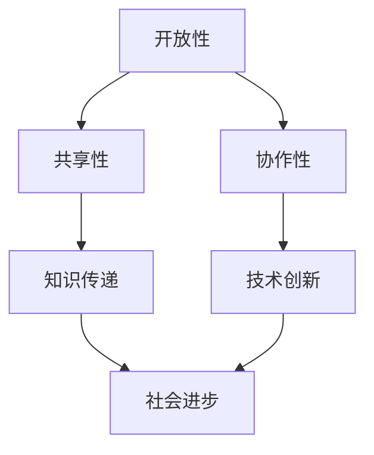

                 

关键词：开源运动，社会影响，知识共享，技术普惠，计算机编程，软件创新

> 摘要：本文探讨了开源运动对社会的影响，特别是在知识共享和技术普惠方面的作用。通过分析开源运动的起源、核心概念以及其在全球范围内的应用，揭示了开源运动如何通过打破信息壁垒、促进技术传播和创新，从而推动社会进步。

## 1. 背景介绍

开源运动（Open Source Movement）起源于20世纪80年代，起源于计算机科学领域。最初，它是指软件的源代码可以被公众自由查看、修改和分享。随着时间的推移，开源运动的概念逐渐扩展到包括硬件、数据和其他知识领域。开源运动的核心理念是开放性、共享性和协作性，它倡导通过集体智慧推动技术的进步和创新。

开源运动的核心概念包括：

1. **开放性（Openness）**：鼓励信息的透明和共享，使人们可以自由地访问、使用和修改知识。
2. **共享性（Sharing）**：通过协作和合作，促进知识和技能的传递和积累。
3. **协作性（Collaboration）**：通过集体智慧，实现更高效的问题解决和技术创新。

开源运动的目标是打破信息垄断，实现知识普惠，从而推动社会的发展和进步。

## 2. 核心概念与联系

为了更好地理解开源运动的核心概念，我们可以使用Mermaid流程图来描述其原理和架构。



### 2.1 开放性

开放性是开源运动的基石，它强调信息的透明度和可访问性。在软件开发领域，这意味着源代码必须向公众开放，允许任何人查看和修改。这种开放性不仅促进了知识的传播，还激发了创新。

### 2.2 共享性

共享性是指知识和资源的共享。在开源运动中，共享性体现在代码、文档、数据和其他资源的免费提供。这种共享性促进了知识的积累和传递，使得更多人能够受益。

### 2.3 协作性

协作性是指通过集体智慧实现更高效的问题解决和技术创新。在开源项目中，来自不同背景和领域的贡献者可以共同合作，共同解决问题。这种协作性不仅提高了项目的质量，还促进了知识的共享和传播。

## 3. 核心算法原理 & 具体操作步骤

### 3.1 算法原理概述

开源运动的核心算法原理可以概括为“共同进化”。在这个原理下，知识和技能通过不断的迭代和优化，不断进化，从而推动技术的进步。具体来说，开源项目的参与者通过以下步骤实现这一原理：

1. **问题发现**：参与者识别出项目中存在的问题或不足。
2. **解决方案提出**：参与者提出改进方案或解决方案。
3. **方案评估**：项目团队对解决方案进行评估和讨论。
4. **方案实施**：被认可的最佳方案被实施到项目中。
5. **迭代优化**：在实施过程中，方案不断优化和迭代，以提高项目质量。

### 3.2 算法步骤详解

1. **问题发现**：开源项目的参与者通过各种渠道收集项目中的问题信息，包括用户反馈、错误报告等。
2. **解决方案提出**：针对发现的问题，参与者可以独立或合作提出解决方案。
3. **方案评估**：项目团队对提出的解决方案进行评估，考虑其可行性、效率和影响。
4. **方案实施**：被认可的解决方案会被纳入项目中，并立即开始实施。
5. **迭代优化**：在实施过程中，项目团队会持续监控解决方案的效果，并根据反馈进行优化和迭代。

### 3.3 算法优缺点

**优点：**

- **高效性**：通过集体智慧，快速找到并解决问题。
- **创新性**：开放性和共享性促进了新的想法和解决方案的产生。
- **适应性**：开源项目可以根据不同环境和需求进行灵活调整。

**缺点：**

- **资源分散**：由于开源项目通常由多个贡献者维护，资源可能分散，导致项目管理困难。
- **质量控制**：开源项目可能因为贡献者的不同背景和水平导致质量控制不一致。

### 3.4 算法应用领域

开源算法广泛应用于各个领域，包括软件开发、硬件设计、数据分析等。在软件开发领域，著名的开源项目如Linux内核、Python等，极大地推动了计算机技术的发展。在硬件设计领域，开源硬件项目如Arduino、Raspberry Pi等，为硬件爱好者提供了丰富的资源和平台。在数据分析领域，开源算法如Scikit-learn、TensorFlow等，为数据科学家提供了强大的工具。

## 4. 数学模型和公式 & 详细讲解 & 举例说明

### 4.1 数学模型构建

开源运动的数学模型可以概括为“共同进化模型”。在这个模型中，知识被视为一种资源，通过迭代和优化不断进化。具体来说，模型包括以下几个部分：

- **知识库（Knowledge Base）**：存储所有已知的知识和信息。
- **知识传递机制（Knowledge Transfer Mechanism）**：确保知识在参与者之间高效传递。
- **优化机制（Optimization Mechanism）**：通过评估和选择最佳方案，优化知识库。

### 4.2 公式推导过程

共同进化模型的公式可以表示为：

\[ \Delta K = f(\Delta t, K, I) \]

其中：

- \( \Delta K \) 表示知识库的增量。
- \( \Delta t \) 表示时间间隔。
- \( K \) 表示当前知识库的状态。
- \( I \) 表示外部输入，包括新的知识、问题和解决方案。

公式的推导过程如下：

1. **知识传递**：在时间 \( \Delta t \) 内，知识库中的知识会通过传递机制传递给其他参与者。
2. **知识评估**：参与者对传递的知识进行评估，选择最佳方案。
3. **知识整合**：被选择的方案被整合到知识库中，更新知识库的状态。

### 4.3 案例分析与讲解

以Linux内核的开源开发为例，我们可以看到共同进化模型的具体应用。Linux内核的知识库包含了大量的源代码、文档和讨论记录。在每次迭代中，参与者会提出改进方案，并通过评估和讨论，选择最佳方案进行实施。这个过程持续迭代，不断优化Linux内核的性能和稳定性。

## 5. 项目实践：代码实例和详细解释说明

### 5.1 开发环境搭建

为了实践开源运动，我们可以以一个简单的Python项目为例。首先，我们需要搭建一个基本的Python开发环境。

1. 安装Python：在官方网站（https://www.python.org/）下载并安装Python。
2. 安装IDE：可以选择PyCharm、VSCode等Python支持的IDE。
3. 安装依赖：根据项目需求，安装相应的Python库，例如`numpy`、`pandas`等。

### 5.2 源代码详细实现

以下是一个简单的Python代码实例，用于计算两个数的和。

```python
# 导入所需的库
import numpy as np

# 定义函数，计算两个数的和
def add(a, b):
    return a + b

# 主函数
def main():
    # 读取用户输入的两个数
    a = float(input("请输入第一个数："))
    b = float(input("请输入第二个数："))

    # 计算和并输出结果
    result = add(a, b)
    print(f"{a} 和 {b} 的和为：{result}")

# 调用主函数
if __name__ == "__main__":
    main()
```

### 5.3 代码解读与分析

上述代码首先导入了`numpy`库，用于处理数学运算。然后定义了一个名为`add`的函数，用于计算两个数的和。在主函数`main`中，代码读取用户输入的两个数，调用`add`函数计算和，并输出结果。

### 5.4 运行结果展示

运行上述代码后，程序会提示用户输入两个数，例如：

```
请输入第一个数：5
请输入第二个数：10
```

程序将输出：

```
5 和 10 的和为：15
```

这表明代码成功地计算了两个数的和。

## 6. 实际应用场景

开源运动在各个领域都有广泛应用。以下是一些实际应用场景：

### 6.1 软件开发

在软件开发领域，开源项目如Linux、Python等，极大地推动了技术的发展。开发者可以自由地使用、修改和分享这些项目，从而提高了开发效率。

### 6.2 硬件设计

在硬件设计领域，开源硬件项目如Arduino、Raspberry Pi等，为硬件爱好者提供了丰富的资源和平台。这些项目不仅促进了硬件的创新，还降低了硬件开发的门槛。

### 6.3 数据分析

在数据分析领域，开源算法如Scikit-learn、TensorFlow等，为数据科学家提供了强大的工具。这些工具不仅提高了数据分析的效率，还推动了人工智能技术的发展。

## 7. 工具和资源推荐

### 7.1 学习资源推荐

- 《开源运动：历史、现状与未来》
- 《开源之道》
- 《开源软件开发实践》

### 7.2 开发工具推荐

- Python：https://www.python.org/
- PyCharm：https://www.jetbrains.com/pycharm/
- VSCode：https://code.visualstudio.com/

### 7.3 相关论文推荐

- "The Cathedral and the Bazaar"：讨论了开源运动的核心原理。
- "Open Source Software Development: A Survey"：全面分析了开源软件开发的方法和实践。

## 8. 总结：未来发展趋势与挑战

开源运动在社会发展中扮演着越来越重要的角色。随着技术的进步和人们对知识普惠的需求增加，开源运动将继续发展。以下是未来发展趋势与挑战：

### 8.1 研究成果总结

- 开源运动在推动技术创新、提高开发效率方面取得了显著成果。
- 开源运动促进了知识的共享和传播，推动了社会进步。

### 8.2 未来发展趋势

- 开源运动将向更多领域扩展，包括人工智能、物联网等。
- 开源运动将更加注重社区建设和知识产权保护。

### 8.3 面临的挑战

- 资源分散和项目管理困难。
- 质量控制和知识产权保护。

### 8.4 研究展望

- 加强开源运动的标准化和规范化。
- 探索新的开源模式和商业模式。

## 9. 附录：常见问题与解答

### 9.1 开源运动的起源是什么？

开源运动起源于20世纪80年代的计算机科学领域，最初是指软件的源代码可以被公众自由查看、修改和分享。

### 9.2 开源运动的核心原则是什么？

开源运动的核心原则包括开放性、共享性和协作性。

### 9.3 开源运动对社会有哪些影响？

开源运动通过打破信息壁垒、促进技术传播和创新，推动社会进步。它在软件开发、硬件设计、数据分析等领域都有广泛应用。

### 9.4 如何参与开源运动？

参与开源运动可以通过以下途径：

- 加入开源社区，参与项目讨论和贡献。
- 开发自己的开源项目，分享你的知识和经验。
- 为开源项目提供文档和测试，帮助项目成长。

作者：禅与计算机程序设计艺术 / Zen and the Art of Computer Programming
----------------------------------------------------------------


