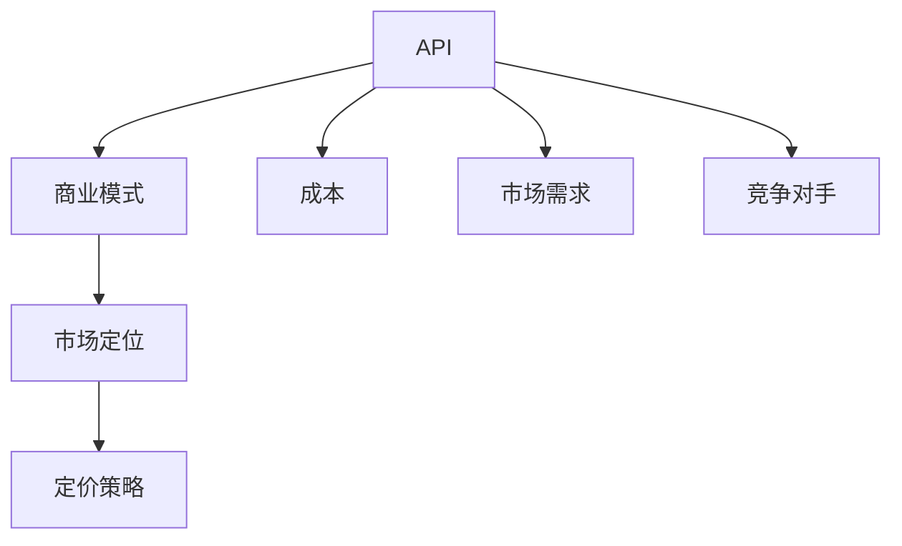

                 

关键词：开源项目、API商业化、策略、定价模型、收益分析、市场定位、风险管理

> 摘要：本文旨在探讨开源项目的API商业化路径，分析策略和定价模型，以及开源项目API商业化面临的挑战和机遇。文章首先介绍了开源项目的背景和重要性，随后深入讨论了API商业化的核心概念，并从多个角度探讨了定价策略的制定。文章最后总结了开源项目API商业化的未来发展趋势，提出了针对潜在风险和挑战的应对策略。

## 1. 背景介绍

开源项目是指那些其源代码可以被公众自由查看、修改和分发的软件项目。它们依托于开放源代码许可协议（如GPL、MIT等），吸引了全球开发者的参与和贡献。开源项目的发展不仅推动了技术的创新，也为企业和开发者提供了丰富的技术资源。

然而，开源项目的发展也面临着资金、人力和维护等挑战。因此，许多开源项目团队开始探索将API商业化作为一条重要的收入来源。API商业化指的是将开源项目中的API（应用程序编程接口）以付费服务的形式提供给第三方使用，从而获得收益。

开源项目的API商业化不仅是项目可持续发展的需要，也是满足企业用户个性化需求的有效途径。通过API商业化，开源项目能够实现技术输出，同时也为企业提供了定制化服务的机会。

### 1.1 开源项目的兴起与发展

开源项目起源于20世纪90年代，当时自由软件运动和开源软件理念的兴起，为软件开发模式带来了重大变革。Linux操作系统、Apache HTTP服务器等开源软件的崛起，展示了开源项目的巨大潜力。

随着互联网的发展，开源项目逐渐成为技术创新的重要力量。现代开源项目通常基于协作开发模式，通过互联网进行代码的共享和协作。这种模式不仅提高了开发效率，还促进了技术的快速迭代和优化。

开源项目的发展离不开社区的支持，社区成员通过贡献代码、测试、反馈等方式共同推动项目前进。这种合作精神使得开源项目能够不断吸收新的创意和技术，保持其竞争力和创新力。

### 1.2 开源项目面临的挑战

尽管开源项目在技术创新方面具有显著优势，但它们也面临着一系列挑战。首先是资金问题，开源项目通常缺乏稳定的资金来源，导致项目维护和发展受限。其次是人力的不足，许多开源项目依赖志愿者或兼职开发者的支持，这在一定程度上影响了项目的发展速度和质量。

此外，开源项目还面临着知识产权和商业利益冲突的挑战。开源许可协议虽然保证了项目的自由性和可访问性，但也可能引发商业用户与开源社区之间的法律纠纷。

### 1.3 API商业化的兴起

随着云计算和API经济的兴起，API商业化逐渐成为开源项目的重要收入来源。API商业化不仅为开源项目提供了资金支持，还能够提高项目的知名度和影响力。

API商业化使得开源项目能够将技术输出给第三方，从而实现价值变现。通过API商业化，企业用户可以获得定制化的技术解决方案，而开源项目团队则能够通过提供付费服务获得收益。

API商业化还促进了开源社区与企业之间的互动，为双方创造了共赢的机会。企业通过使用开源项目API，能够减少研发成本，提升产品竞争力；而开源项目团队则能够通过商业化获得资金支持，进一步推动项目发展。

## 2. 核心概念与联系

在探讨开源项目的API商业化之前，我们需要了解一些核心概念，包括API、商业模式、市场定位和定价策略等。这些概念相互关联，共同构成了开源项目API商业化的基础。

### 2.1 API

API是应用程序编程接口的缩写，它定义了不同软件组件之间如何进行通信和交互的规则和协议。API广泛应用于软件开发中，允许开发者无需深入了解底层实现，即可方便地使用第三方服务或功能。

对于开源项目来说，API是其核心功能的重要组成部分。通过开放API，开源项目可以提供更加灵活和便捷的服务，满足不同用户的多样化需求。

### 2.2 商业模式

商业模式是指企业如何创造、传递和获取价值的一种商业结构。在开源项目的API商业化中，商业模式起着关键作用。常见的开源项目API商业模式包括订阅制、付费API调用和定制服务等形式。

选择合适的商业模式，不仅能够提高开源项目的收益，还能够满足不同用户的个性化需求。例如，订阅制适合那些需要长期稳定使用的用户，而付费API调用则适合那些对特定功能有临时需求的用户。

### 2.3 市场定位

市场定位是指企业在目标市场中的位置和角色。在开源项目的API商业化中，市场定位决定了项目如何与竞争对手区分开来，以及如何满足用户需求。

有效的市场定位需要综合考虑项目的特性、目标用户群体和市场环境等因素。例如，一个专注于大数据处理的开源项目，可以选择定位在提供高性能数据处理API上，从而满足大型企业用户的需求。

### 2.4 定价策略

定价策略是企业在制定产品或服务价格时所采用的方法和原则。在开源项目的API商业化中，定价策略决定了项目如何将价值转化为收益。

合理的定价策略需要考虑多个因素，包括成本、市场需求、竞争对手定价等。常见的定价策略有成本加成定价、市场渗透定价和差异化定价等。

### 2.5 相关概念流程图

以下是开源项目API商业化中相关概念的关系流程图，展示了核心概念之间的相互关联。



## 3. 核心算法原理 & 具体操作步骤

### 3.1 算法原理概述

开源项目API商业化的核心算法原理主要包括收益分析、成本计算和定价模型构建。这些算法帮助项目团队制定合理的商业化策略，从而实现最大化收益。

#### 收益分析

收益分析旨在计算开源项目API商业化的潜在收益。它包括两个方面：直接收益和间接收益。直接收益主要来自API调用费用、订阅费用和定制服务费用；间接收益则包括品牌提升、用户增长和后续业务机会等。

#### 成本计算

成本计算包括开发成本、运营成本和风险管理成本。开发成本是指API开发和维护所需的资源投入；运营成本包括服务器租赁、带宽费用和客户服务费用等；风险管理成本则涉及法律、技术和管理等方面的风险。

#### 定价模型构建

定价模型构建是制定商业策略的关键步骤。它通常基于收益分析结果，结合成本计算和市场定位，制定出合理的定价策略。常见的定价模型包括固定价格、动态定价和基于使用量的定价等。

### 3.2 算法步骤详解

以下是开源项目API商业化核心算法的具体操作步骤：

#### 步骤1：收益分析

1. 收集历史API调用数据，分析不同用户群体的使用模式和需求。
2. 根据API调用频率、调用次数和使用时长等指标，估算潜在收益。

#### 步骤2：成本计算

1. 计算开发成本，包括人力、硬件、软件和其他相关费用。
2. 估算运营成本，包括服务器租赁、带宽费用和客户服务费用等。
3. 评估风险管理成本，包括法律、技术和管理等方面的风险。

#### 步骤3：定价模型构建

1. 根据收益分析和成本计算结果，确定合理的定价策略。
2. 选择合适的定价模型，如固定价格、动态定价或基于使用量的定价。
3. 制定具体的定价方案，包括价格水平、价格调整周期和优惠政策等。

### 3.3 算法优缺点

开源项目API商业化的核心算法具有以下优缺点：

#### 优点

1. 收益分析能够帮助项目团队了解市场潜力和用户需求，为定价策略提供依据。
2. 成本计算有助于项目团队合理分配资源，降低商业化风险。
3. 定价模型构建能够根据市场变化和用户需求灵活调整，提高竞争力。

#### 缺点

1. 收益分析依赖于历史数据，可能导致预测结果偏差。
2. 成本计算过程中可能存在不确定因素，影响成本估算的准确性。
3. 定价模型构建需要综合考虑多种因素，可能导致策略复杂化。

### 3.4 算法应用领域

开源项目API商业化的核心算法适用于多种场景：

1. 提供第三方API服务的开源项目，如天气API、地图API等。
2. 为企业用户提供定制化API服务的开源项目，如大数据处理API、人工智能API等。
3. 通过API商业化实现技术输出的开源项目，如云计算API、物联网API等。

## 4. 数学模型和公式 & 详细讲解 & 举例说明

在开源项目API商业化的过程中，数学模型和公式是分析和决策的重要工具。以下我们将详细介绍收益模型、成本模型和定价模型的构建方法，并利用实际案例进行说明。

### 4.1 数学模型构建

开源项目API商业化的数学模型主要包括以下三个方面：

1. **收益模型**：用于估算API商业化的潜在收益。
2. **成本模型**：用于计算API商业化所需的成本。
3. **定价模型**：用于制定合理的定价策略。

#### 收益模型

收益模型的基本公式为：

\[ \text{收益} = (\text{API调用次数} \times \text{单价}) + (\text{订阅用户数} \times \text{订阅费用}) + \text{其他收益} \]

其中，API调用次数、单价、订阅用户数和订阅费用可以通过市场调研和数据分析得到。

#### 成本模型

成本模型的基本公式为：

\[ \text{成本} = \text{开发成本} + \text{运营成本} + \text{风险管理成本} \]

开发成本包括人力资源、硬件设备、软件开发等费用；运营成本包括服务器租赁、带宽费用、客户服务等费用；风险管理成本包括法律费用、技术支持费用等。

#### 定价模型

定价模型的基本公式为：

\[ \text{价格} = \text{成本} \times \text{定价系数} + \text{利润} \]

定价系数通常取决于市场需求、竞争对手定价和产品定位等因素；利润则是项目团队期望获得的收益。

### 4.2 公式推导过程

以下是对收益模型、成本模型和定价模型公式的推导过程：

#### 收益模型推导

1. **API调用收益**：

   假设某一开源项目API的单价为\( p \)，API调用次数为\( n \)，则API调用收益为：

   \[ \text{API调用收益} = n \times p \]

2. **订阅收益**：

   假设订阅费用为\( s \)，订阅用户数为\( m \)，则订阅收益为：

   \[ \text{订阅收益} = m \times s \]

3. **其他收益**：

   假设其他收益为\( o \)，则其他收益为：

   \[ \text{其他收益} = o \]

   综合以上三部分，开源项目API商业化的收益模型为：

   \[ \text{收益} = n \times p + m \times s + o \]

#### 成本模型推导

1. **开发成本**：

   假设开发成本为\( d \)，则开发成本为：

   \[ \text{开发成本} = d \]

2. **运营成本**：

   假设运营成本为\( o \)，则运营成本为：

   \[ \text{运营成本} = o \]

3. **风险管理成本**：

   假设风险管理成本为\( r \)，则风险管理成本为：

   \[ \text{风险管理成本} = r \]

   综合以上三部分，开源项目API商业化的成本模型为：

   \[ \text{成本} = d + o + r \]

#### 定价模型推导

1. **成本**：

   根据成本模型，项目总成本为：

   \[ \text{成本} = d + o + r \]

2. **定价系数**：

   假设定价系数为\( c \)，则定价系数为：

   \[ \text{定价系数} = c \]

3. **利润**：

   假设项目团队期望获得的利润为\( p \)，则利润为：

   \[ \text{利润} = p \]

   根据定价模型，项目API的价格为：

   \[ \text{价格} = (d + o + r) \times c + p \]

### 4.3 案例分析与讲解

以下我们将通过一个实际案例，对上述数学模型进行应用和分析。

#### 案例背景

假设某一开源项目团队计划商业化其API服务，目前已有1000个活跃用户。项目团队对市场进行了调研，得出以下数据：

- API调用单价为10元；
- 每个订阅用户每月支付20元；
- 项目总开发成本为50万元，运营成本为10万元，风险管理成本为5万元；
- 项目团队期望获得20%的利润。

#### 收益分析

1. **API调用收益**：

   每月API调用次数为\( 1000 \times 10 = 10000 \)次，则API调用收益为：

   \[ 10000 \times 10 = 100000 \text{元} \]

2. **订阅收益**：

   假设订阅用户数为\( m \)，则订阅收益为：

   \[ m \times 20 \]

   为了简化计算，我们假设订阅用户数为50个，则订阅收益为：

   \[ 50 \times 20 = 1000 \text{元} \]

3. **其他收益**：

   假设其他收益为5000元，则总收益为：

   \[ 100000 + 1000 + 5000 = 115000 \text{元} \]

#### 成本计算

1. **开发成本**：

   开发成本为50万元，则开发成本为：

   \[ 500000 \text{元} \]

2. **运营成本**：

   运营成本为10万元，则运营成本为：

   \[ 100000 \text{元} \]

3. **风险管理成本**：

   风险管理成本为5万元，则风险管理成本为：

   \[ 50000 \text{元} \]

   总成本为：

   \[ 500000 + 100000 + 50000 = 650000 \text{元} \]

#### 定价策略

根据收益和成本分析，项目团队可以制定以下定价策略：

1. **API调用价格**：

   定价系数为\( 1.2 \)，则API调用价格为：

   \[ 10 \times 1.2 = 12 \text{元} \]

2. **订阅价格**：

   订阅价格为20元，无需调整。

3. **利润**：

   项目团队期望获得20%的利润，即：

   \[ 115000 \times 0.2 = 23000 \text{元} \]

   根据定价模型，项目API的价格为：

   \[ 12 \text{元} + 20 \text{元} + 23000 \text{元} = 263000 \text{元} \]

   这里的价格是一个理论值，实际定价可能根据市场情况进一步调整。

### 4.4 模型优缺点

开源项目API商业化的数学模型具有以下优缺点：

#### 优点

1. **定量分析**：数学模型能够对开源项目API商业化的收益、成本和定价进行定量分析，提供决策依据。
2. **灵活性**：模型可以根据实际情况进行灵活调整，以适应不同的市场环境和用户需求。
3. **科学性**：模型基于经济学和管理学原理，具有一定的科学性。

#### 缺点

1. **数据依赖**：模型依赖于历史数据和预测数据，可能导致分析结果偏差。
2. **复杂性**：模型可能涉及多个变量和参数，导致计算和决策过程复杂。
3. **适应性**：模型可能无法完全适应所有市场环境和用户需求，需要不断优化和调整。

### 4.5 模型应用领域

开源项目API商业化的数学模型适用于以下领域：

1. **收益分析**：用于评估开源项目API商业化的潜在收益。
2. **成本控制**：用于计算开源项目API商业化所需的成本，以便进行成本控制和优化。
3. **定价决策**：用于制定合理的定价策略，以提高开源项目API的商业化成功率。

## 5. 项目实践：代码实例和详细解释说明

### 5.1 开发环境搭建

为了更好地理解和实践开源项目API商业化的过程，我们将使用Python语言和Flask框架搭建一个简单的API服务。以下是开发环境的搭建步骤：

1. **安装Python**：确保已安装Python 3.6及以上版本。
2. **安装Flask**：在终端中执行以下命令安装Flask：

   ```bash
   pip install Flask
   ```

3. **创建虚拟环境**（可选）：为了更好地管理项目依赖，建议创建一个虚拟环境：

   ```bash
   python -m venv venv
   source venv/bin/activate  # 对于Windows用户，使用 `venv\Scripts\activate`
   ```

### 5.2 源代码详细实现

以下是使用Flask搭建的简单API服务的代码示例：

```python
from flask import Flask, jsonify, request

app = Flask(__name__)

# 假设这是我们的开源API，提供天气信息查询功能
def get_weather(city):
    # 这里用一个简单的硬编码来模拟API调用
    weather_data = {
        'Beijing': 'Sunny',
        'Shanghai': 'Rainy',
        'New York': 'Cloudy'
    }
    return weather_data.get(city, 'Unknown City')

@app.route('/weather', methods=['GET'])
def weather():
    city = request.args.get('city')
    weather = get_weather(city)
    return jsonify({'city': city, 'weather': weather})

if __name__ == '__main__':
    app.run(debug=True)
```

### 5.3 代码解读与分析

这段代码定义了一个简单的Flask应用程序，提供了一个天气信息查询的API接口。以下是代码的详细解读和分析：

1. **导入模块**：代码首先导入了`Flask`模块，这是Flask框架的核心。此外，还导入了`jsonify`和`request`模块，用于处理JSON数据和HTTP请求。

2. **初始化Flask应用**：使用`Flask(__name__)`初始化Flask应用。

3. **定义天气信息查询函数**：`get_weather`函数接收一个城市名称作为参数，并返回该城市的天气信息。这里使用一个简单的字典来模拟真实的API调用。

4. **定义API接口**：`weather`函数定义了一个`/weather`的GET接口，用于接收并处理HTTP请求。它从请求中获取城市名称，调用`get_weather`函数获取天气信息，并将结果以JSON格式返回。

5. **运行应用**：`if __name__ == '__main__':`语句确保只有在直接运行该脚本时才会执行`app.run(debug=True)`，启动Flask应用。

### 5.4 运行结果展示

在终端中运行上述代码后，应用将启动并监听一个随机端口。例如，假设端口号为5000，可以访问`http://127.0.0.1:5000/weather?city=Beijing`来查询北京的天气信息。

以下是可能的输出结果：

```json
{
  "city": "Beijing",
  "weather": "Sunny"
}
```

### 5.5 部署与商业化

在实际场景中，需要将这个简单的API服务部署到服务器上，并进行商业化。以下是部署和商业化的关键步骤：

1. **服务器部署**：将代码部署到云服务器或物理服务器上，确保API服务能够稳定运行。
2. **API权限管理**：实现API调用权限管理，防止未授权的访问。
3. **定价策略**：根据市场需求和成本，制定合理的API调用价格和订阅费用。
4. **客户服务**：提供客户支持，解答用户疑问，收集用户反馈。
5. **持续迭代**：根据用户反馈和市场需求，不断优化API服务，提升用户体验。

## 6. 实际应用场景

开源项目的API商业化在实际应用中具有广泛的应用场景，以下将探讨几个典型的应用领域：

### 6.1 提供第三方API服务

开源项目可以通过提供第三方API服务来实现商业化。例如，一个开源的天气API项目，可以提供全球各地的实时天气数据给企业用户，帮助这些用户构建天气预报、智能出行等应用。这种服务通常采用按需付费或订阅模式，用户可以根据自己的需求选择合适的计费方式。

### 6.2 定制化API服务

许多企业有特定的业务需求，但开源项目可能无法完全满足这些需求。在这种情况下，开源项目团队可以提供定制化API服务，根据企业的特定需求进行API定制和优化。这种服务通常针对大型企业用户，收费较高，但能够为企业带来显著的商业价值。

### 6.3 技术输出

一些开源项目在技术领域具有较高的知名度和技术水平，可以通过将API商业化实现技术输出。例如，一个开源的图像识别API项目，可以将其技术输出给需要图像处理功能的企业，帮助企业快速实现图像识别功能，节省研发时间和成本。

### 6.4 生态系统构建

开源项目可以通过构建生态系统来实现商业化。例如，一个开源的区块链平台项目，可以通过提供一系列的API服务，构建一个完整的区块链生态系统。用户可以通过这些API服务进行区块链开发、应用部署等操作，从而促进项目的商业化。

### 6.5 跨领域合作

开源项目可以与其他领域的企业或机构进行跨领域合作，实现资源共享和互补。例如，一个开源的数据分析API项目，可以与一家大数据分析公司合作，为用户提供更全面的数据分析服务。这种合作不仅可以实现双赢，还能够推动项目的商业化进程。

## 7. 未来应用展望

开源项目的API商业化在未来将面临更多的机遇和挑战。以下是对未来发展趋势和可能面临的挑战的展望：

### 7.1 未来发展趋势

1. **API经济的进一步发展**：随着云计算和物联网的普及，API经济将迎来更广阔的发展空间。更多企业将认识到API的重要性，从而推动开源项目API商业化的需求。

2. **个性化定制服务的普及**：企业对个性化定制服务的需求日益增长，开源项目可以通过提供定制化API服务，满足企业的多样化需求，实现商业价值的提升。

3. **生态系统的构建**：开源项目可以通过构建生态系统，吸引更多的开发者和企业参与，形成良性的商业模式，推动项目的可持续发展。

4. **技术创新的推动**：开源项目团队可以通过商业化获得的资金支持，持续进行技术创新，提高项目的技术水平和竞争力。

### 7.2 面临的挑战

1. **市场竞争加剧**：随着更多开源项目加入API商业化，市场竞争将变得更加激烈。项目团队需要不断创新和优化，才能在市场中脱颖而出。

2. **数据安全和隐私保护**：随着API商业化的发展，数据安全和隐私保护将成为重要议题。项目团队需要采取有效措施，确保用户数据的安全和隐私。

3. **法律和合规问题**：开源项目在商业化过程中，可能会面临法律和合规问题。项目团队需要了解相关法律法规，确保项目的合法性和合规性。

4. **用户需求的变化**：用户需求不断变化，项目团队需要及时响应市场变化，调整商业模式和定价策略。

### 7.3 应对策略

1. **持续创新**：项目团队需要持续进行技术创新，提高项目的技术水平和竞争力。

2. **用户反馈机制**：建立完善的用户反馈机制，及时了解用户需求，优化产品和服务。

3. **合规性评估**：定期进行合规性评估，确保项目的合法性和合规性。

4. **灵活的商业模式**：根据市场需求和用户反馈，灵活调整商业模式和定价策略。

## 8. 总结：未来发展趋势与挑战

开源项目的API商业化是一条充满机遇和挑战的发展路径。通过对开源项目API商业化的深入探讨，我们可以看到其面临的收益分析、成本计算和定价策略等核心问题。同时，开源项目API商业化在技术创新、市场定位和商业模式等方面具有显著优势。

然而，开源项目API商业化也面临着市场竞争、数据安全和法律合规等挑战。项目团队需要不断创新和优化，才能在激烈的市场竞争中脱颖而出。

展望未来，开源项目的API商业化将继续发展，成为企业技术输出和生态系统构建的重要途径。项目团队应抓住机遇，应对挑战，推动开源项目API商业化的可持续发展。

## 9. 附录：常见问题与解答

### 9.1 开源项目API商业化的优点是什么？

开源项目API商业化的优点包括：

1. **收益来源多样**：开源项目可以通过API调用费用、订阅费用和定制服务等多种方式获得收益。
2. **技术输出**：通过API商业化，开源项目可以将自身的技术优势输出给企业用户，实现技术变现。
3. **降低企业成本**：企业用户可以通过使用开源项目API，节省研发成本，提高产品竞争力。
4. **品牌提升**：开源项目API商业化有助于提升项目知名度和影响力，增强社区参与度。

### 9.2 开源项目API商业化的风险有哪些？

开源项目API商业化的风险包括：

1. **市场竞争**：随着更多开源项目加入API商业化，市场竞争将变得更加激烈。
2. **数据安全和隐私保护**：开源项目需要确保用户数据的安全和隐私，避免数据泄露和滥用。
3. **法律合规**：开源项目在商业化过程中，可能面临法律和合规问题，需要确保项目的合法性和合规性。
4. **用户需求变化**：用户需求不断变化，开源项目需要及时响应市场变化，调整商业模式和定价策略。

### 9.3 如何制定合理的定价策略？

制定合理的定价策略需要考虑以下因素：

1. **成本计算**：了解项目的成本结构，包括开发成本、运营成本和风险管理成本。
2. **市场需求**：分析市场需求，了解目标用户群体的支付能力和需求。
3. **竞争对手定价**：了解竞争对手的定价策略，确保自身定价具有竞争力。
4. **产品定位**：根据产品定位和目标市场，选择合适的定价模型，如固定价格、动态定价或基于使用量的定价。

### 9.4 开源项目如何保护自身知识产权？

开源项目可以通过以下方式保护自身知识产权：

1. **选择合适的开源许可协议**：如GPL、MIT等，明确项目代码的授权和使用方式。
2. **版权声明**：在项目源代码中添加版权声明，明确项目所有者和版权信息。
3. **法律咨询**：聘请专业律师提供法律咨询，确保项目符合相关法律法规。
4. **开源社区合作**：与开源社区合作，共同推动项目的可持续发展，减少知识产权纠纷。

### 9.5 开源项目API商业化有哪些成功案例？

开源项目API商业化的成功案例包括：

1. **GitHub API**：GitHub通过提供API服务，吸引了大量开发者和企业用户，成为其重要的收入来源。
2. **OpenWeatherMap API**：OpenWeatherMap提供全球天气数据API服务，吸引了众多企业和个人用户，实现了商业化。
3. **Twitter API**：Twitter的API服务为第三方应用提供了强大的数据接口，推动了生态系统的构建。

## 作者署名

作者：禅与计算机程序设计艺术 / Zen and the Art of Computer Programming

