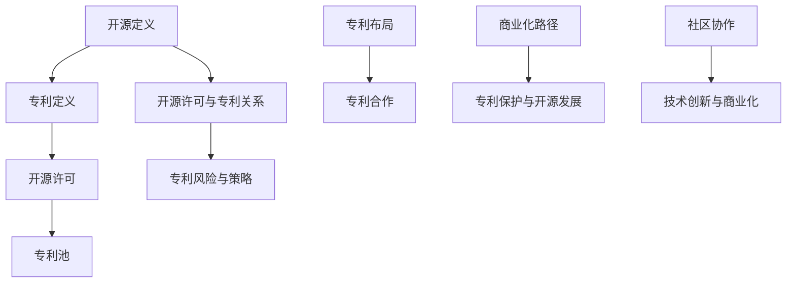

                 

### 摘要

本文旨在探讨开源项目中的专利策略，如何既保护创新，又实现商业化。在开源社区蓬勃发展的今天，专利问题已成为影响项目持续发展的重要因素。本文将首先介绍开源项目的背景和现状，然后深入分析专利的基本概念及其在开源项目中的重要性。接着，我们将探讨开源项目中可能遇到的专利风险，并提出相应的解决策略。最后，本文将讨论专利策略在实际操作中的应用，以及如何通过专利合作实现开源项目的商业化。通过本文的探讨，希望能够为开源项目管理者、开发者以及相关从业者提供有价值的参考和启示。

### 1. 背景介绍

开源项目是指通过开放源代码的方式，允许用户自由使用、修改和分发的软件项目。这种模式的核心在于共享和协作，通过广泛的社区参与，推动技术的创新和进步。开源项目的发展可以追溯到20世纪90年代，Linux操作系统的诞生标志着开源运动的开端。随着时间的推移，越来越多的项目和社区加入其中，如Apache、MySQL、WordPress等，这些项目不仅在技术领域产生了深远的影响，也为企业带来了巨大的商业价值。

开源项目的优势在于其灵活性和创新性。开放源代码使得开发者可以自由地查看、修改和扩展代码，这大大提高了软件的质量和性能。同时，社区成员的广泛参与也促进了新功能的快速开发和问题的及时解决。开源项目还具有较高的透明度和可靠性，用户可以清楚地了解软件的内部结构和工作原理，从而提高使用和信任度。

然而，开源项目的发展也面临着诸多挑战，其中之一就是专利问题。专利是指政府或相关机构授予发明者在一定时间内独占使用其发明成果的权利。专利制度旨在保护发明者的权益，激励技术创新。但在开源项目中，专利的存在可能带来一系列法律风险，如专利侵权、专利诉讼等，这些风险可能影响项目的持续发展和社区的稳定。

开源项目的专利问题主要包括两个方面：一是开源项目中的代码可能包含他人的专利，导致专利侵权风险；二是开源项目开发过程中可能无意中侵犯了其他公司的专利，从而引发专利诉讼。这些问题的存在使得开源项目的管理者不得不考虑如何在保护创新的同时，避免专利风险，实现商业化目标。

本文将围绕开源项目的专利策略进行深入探讨，分析如何通过专利布局、合作和商业化路径，实现开源项目的可持续发展。通过对开源项目专利策略的全面解读，希望能够为开源社区提供有价值的参考，推动开源技术的普及和应用。

### 2. 核心概念与联系

要深入理解开源项目的专利策略，首先需要了解一些核心概念和其相互之间的联系。这些概念包括开源定义、专利定义、开源许可和专利池等。

#### 开源定义

开源（Open Source）是一个关于软件开发和分发模式的理念，它强调软件的源代码应该对用户完全开放，允许用户自由地使用、研究、修改和分发。这一理念最早由自由软件运动（Free Software Movement）提出，后来发展形成了开源运动。开源的核心原则包括自由使用、自由学习、自由修改和自由分发。常见的开源许可如GPL（GNU General Public License）、MIT（Massachusetts Institute of Technology License）和Apache License等，这些许可允许用户在遵守一定规则的前提下，自由使用和修改开源代码。

#### 专利定义

专利（Patent）是一种法律保护机制，它授予发明者在一定时间内对其发明独占使用的权利。专利通常涵盖新技术、产品或过程，并赋予专利持有者防止他人未经授权使用、制造、销售或进口其发明的权利。专利制度旨在鼓励创新，通过提供垄断性权利作为对发明者投入时间、精力和资金的回报。专利分为发明专利、实用新型专利和外观设计专利，其中发明专利是最为广泛的一种。

#### 开源许可与专利的关系

开源许可与专利之间的关系复杂而微妙。开源许可规定了用户在使用、修改和分发开源代码时的权利和义务，而专利则提供了法律上的独占性保护。在某些情况下，开源许可可能限制专利的行使，例如GPL要求用户在修改或分发代码时，必须以相同的方式开放源代码，从而避免专利被封闭使用。而MIT和Apache License等许可则较为宽松，允许专利的独立行使。

#### 专利池

专利池（Patent Pool）是一种专利联合管理的机制，通过将多个专利组合在一起，形成一种共享和交叉许可的框架。专利池的主要目的是减少专利纠纷，提高专利利用效率。专利池通常由一个管理机构负责运营，成员包括专利持有者和用户。通过加入专利池，专利持有者可以获得额外的收入来源，而用户则可以降低使用专利的成本。

#### Mermaid 流程图

为了更好地理解这些核心概念及其联系，我们可以使用Mermaid绘制一个流程图，如下所示：



在这个流程图中，A到L表示了开源项目从定义到专利策略的一个完整链条。通过这一流程图，我们可以清晰地看到各个核心概念之间的联系和互动，为后续的专利策略探讨奠定了基础。

#### 2.1.1 核心概念原理

开源项目的核心在于其开放性和协作性，而专利的核心在于独占性和排他性。这两者在表面上看似矛盾，但通过合理的策略，可以实现平衡。开源许可为用户提供了使用、修改和分发开源代码的权利，同时要求用户遵守一定规则，确保代码的开放性和透明度。专利则通过法律手段保护发明者的权益，激励技术创新。

开源许可与专利的关系主要体现在以下几个方面：

1. **GPL许可**：要求用户在修改或分发代码时，必须以相同的方式开放源代码，从而避免专利被封闭使用。这种许可方式在开源社区中较为常见，但可能导致专利行使受到限制。
2. **MIT和Apache许可**：较为宽松，允许专利的独立行使。这种许可方式在商业项目中应用较多，因为其对专利的行使限制较少。
3. **交叉许可**：通过专利池等机制，实现多个专利之间的相互许可，从而降低专利纠纷和成本。

专利池的作用在于通过集合和管理多个专利，提供一种共享和交叉许可的框架，从而减少专利纠纷和成本。专利池通常由一个管理机构负责运营，成员包括专利持有者和用户。通过加入专利池，专利持有者可以获得额外的收入来源，而用户则可以降低使用专利的成本。

#### 2.1.2 架构设计

在开源项目中，专利策略的架构设计应考虑以下几个方面：

1. **专利识别与评估**：对项目中的代码进行专利识别和评估，确定是否存在潜在的专利侵权风险。这一步骤是制定专利策略的基础。
2. **专利布局**：根据项目的需求和目标，制定专利布局策略，包括专利申请、专利池参与等。专利布局的目标是保护项目中的核心技术，避免专利纠纷。
3. **专利合作**：通过专利合作，实现专利共享和交叉许可，降低专利纠纷和成本。专利合作可以包括与竞争对手的合作，也可以包括与其他开源项目的合作。
4. **商业化路径**：通过专利策略，为项目商业化提供支持。商业化路径可以包括专利授权、专利池参与等。

通过这一架构设计，开源项目可以更好地应对专利风险，实现技术创新与商业化的平衡。

#### 2.1.3 技术实现

在开源项目中，专利策略的技术实现主要涉及以下几个方面：

1. **开源代码审查**：通过开源代码审查工具，对项目中的代码进行专利扫描，识别潜在的专利风险。
2. **专利数据库查询**：利用专利数据库，对项目中使用的特定技术进行专利查询，了解相关专利的归属和状态。
3. **专利布局与申请**：根据专利识别和评估结果，制定专利布局策略，包括专利申请、专利池参与等。
4. **专利合作与许可**：通过专利合作与许可，实现专利共享和交叉许可，降低专利纠纷和成本。
5. **社区沟通与协作**：与开源社区成员保持密切沟通，共同应对专利风险，推动项目的发展。

通过这些技术实现，开源项目可以更好地管理专利风险，实现技术创新与商业化的目标。

#### 2.1.4 算法优化与调优

在开源项目中，专利策略的算法优化与调优主要涉及以下几个方面：

1. **专利风险评分模型**：通过机器学习和自然语言处理技术，构建专利风险评分模型，对项目中的代码进行风险评估。
2. **专利布局优化算法**：利用优化算法，如遗传算法、模拟退火算法等，优化专利布局策略，提高专利保护效果。
3. **专利合作与许可策略优化**：通过博弈论和博弈树模型，优化专利合作与许可策略，实现专利共享和交叉许可的最优解。
4. **商业化路径优化**：利用数据分析和机器学习技术，优化项目商业化路径，提高商业收益。

通过这些算法优化与调优，开源项目可以更好地应对专利风险，实现技术创新与商业化的目标。

### 3. 核心算法原理 & 具体操作步骤

在开源项目的专利策略中，核心算法原理和具体操作步骤至关重要。通过系统化的算法设计和执行，开源项目可以更有效地保护创新，避免专利风险，并实现商业化目标。下面将详细阐述这些核心算法原理及其实施步骤。

#### 3.1 算法原理概述

核心算法原理主要基于以下几个方面：

1. **专利风险识别与评估**：通过算法识别和评估项目中的代码是否存在潜在的专利侵权风险。这包括对开源代码进行静态和动态分析，利用自然语言处理技术识别代码中的技术特征，并与专利数据库进行比对。
2. **专利布局优化**：通过算法优化专利布局，确保项目中的核心技术得到充分保护，同时降低专利布局成本。这包括利用遗传算法、模拟退火算法等优化策略，对专利布局进行调优。
3. **专利合作与许可**：通过算法设计专利合作与许可策略，实现专利共享和交叉许可的最优解。这包括利用博弈论和博弈树模型，优化专利合作与许可的方案。
4. **商业化路径分析**：通过算法分析项目商业化的可行性和最优路径，提高项目的商业收益。

#### 3.2 算法步骤详解

核心算法的具体步骤如下：

##### 3.2.1 专利风险识别与评估

1. **代码预处理**：对开源代码进行预处理，包括代码解析、语法分析、符号提取等，为后续的专利比对做准备。
2. **技术特征提取**：利用自然语言处理技术，从代码中提取技术特征，如算法、数据结构、函数调用等。
3. **专利数据库查询**：通过专利数据库查询，获取与提取技术特征相关的专利信息，包括专利描述、权利要求等。
4. **风险评分计算**：根据专利数据库的查询结果，计算每个技术特征的风险评分。风险评分可以通过对专利的优先权日期、权利要求范围、专利状态等因素进行加权计算。

##### 3.2.2 专利布局优化

1. **专利需求分析**：根据项目的技术需求，分析需要保护的专利点，确定专利布局的关键领域。
2. **初始布局设计**：基于专利需求分析，设计初始的专利布局方案，包括专利申请、专利池参与等。
3. **优化算法应用**：利用遗传算法、模拟退火算法等优化算法，对初始布局方案进行调优，提高专利布局的合理性和保护效果。
4. **布局评估与调整**：对优化后的专利布局方案进行评估，根据评估结果进行调整，确保专利布局的优化效果。

##### 3.2.3 专利合作与许可

1. **合作对象识别**：通过算法识别潜在的专利合作对象，如竞争对手、合作伙伴等。
2. **博弈模型构建**：构建博弈模型，分析专利合作与许可的博弈过程，包括合作意愿、合作策略等。
3. **策略优化与计算**：利用博弈论和博弈树模型，优化专利合作与许可策略，实现最优解。
4. **合作协议签订**：根据优化后的策略，签订专利合作与许可协议，确保合作双方的利益。

##### 3.2.4 商业化路径分析

1. **市场调研**：通过市场调研，分析项目的市场前景和商业潜力。
2. **商业模式设计**：根据市场调研结果，设计适合项目的商业模式，包括专利授权、专利池参与等。
3. **收益分析**：利用数据分析和机器学习技术，分析项目商业化的收益情况，包括专利授权收益、专利池参与收益等。
4. **路径优化**：根据收益分析结果，优化项目商业化的路径，提高商业收益。

#### 3.3 算法优缺点

核心算法在开源项目专利策略中具有以下优缺点：

**优点**：

1. **高效性**：通过算法自动化识别和评估专利风险，提高工作效率，降低人工成本。
2. **精准性**：利用自然语言处理和机器学习技术，提高专利风险识别和评估的准确性。
3. **灵活性**：算法可以根据项目需求进行灵活调整，适应不同的专利策略。

**缺点**：

1. **复杂性**：核心算法涉及多个技术领域，需要具备较高的技术门槛，实施难度较大。
2. **数据依赖性**：算法的性能依赖于专利数据库的完整性和准确性，数据质量对算法效果有重要影响。

#### 3.4 算法应用领域

核心算法在开源项目专利策略中的应用领域广泛，主要包括：

1. **开源项目评估**：用于评估开源项目的专利风险，为项目管理者提供决策支持。
2. **专利布局优化**：用于优化开源项目的专利布局，提高专利保护效果。
3. **专利合作与许可**：用于制定专利合作与许可策略，降低专利纠纷和成本。
4. **商业化路径分析**：用于分析开源项目的商业化路径，提高商业收益。

通过核心算法的应用，开源项目可以更有效地保护创新，避免专利风险，实现商业化目标。

### 3.5 算法应用实例

为了更好地理解核心算法在开源项目专利策略中的应用，以下将提供两个具体的算法应用实例。

#### 实例一：专利风险识别与评估

假设一个开源项目是关于人工智能的，项目中的代码包含多种算法和数据结构。为了识别和评估项目的专利风险，可以采用以下步骤：

1. **代码预处理**：对项目代码进行解析，提取关键函数、算法和数据结构。
2. **技术特征提取**：利用自然语言处理技术，从代码中提取技术特征，如算法名称、函数参数、数据结构等。
3. **专利数据库查询**：通过专利数据库查询，获取与提取技术特征相关的专利信息。
4. **风险评分计算**：根据专利数据库的查询结果，计算每个技术特征的风险评分。

通过上述步骤，可以识别出项目中可能存在专利风险的代码片段，并为项目管理者提供决策支持。

#### 实例二：专利布局优化

假设开源项目是一个关于区块链技术的，项目中的代码涉及多个区块链协议和共识算法。为了优化项目的专利布局，可以采用以下步骤：

1. **专利需求分析**：根据项目的技术需求，分析需要保护的专利点，确定专利布局的关键领域。
2. **初始布局设计**：基于专利需求分析，设计初始的专利布局方案，包括专利申请、专利池参与等。
3. **优化算法应用**：利用遗传算法、模拟退火算法等优化算法，对初始布局方案进行调优。
4. **布局评估与调整**：对优化后的专利布局方案进行评估，根据评估结果进行调整。

通过上述步骤，可以优化项目的专利布局，提高专利保护效果，同时降低布局成本。

这两个实例展示了核心算法在开源项目专利策略中的具体应用，通过系统化的算法设计和执行，开源项目可以更有效地保护创新，避免专利风险，实现商业化目标。

### 4. 数学模型和公式 & 详细讲解 & 举例说明

在开源项目的专利策略中，数学模型和公式起着至关重要的作用。通过构建数学模型，我们可以更精确地分析和评估专利风险，制定优化策略，实现技术创新与商业化的平衡。以下将详细讲解开源项目专利策略中常用的数学模型和公式，并提供具体的例子进行说明。

#### 4.1 数学模型构建

开源项目的专利策略涉及多个数学模型，主要包括专利风险评分模型、专利布局优化模型和商业化路径分析模型。以下是这些模型的构建过程：

##### 专利风险评分模型

专利风险评分模型用于评估开源项目中代码片段的专利风险。其基本构建过程如下：

1. **特征提取**：从代码片段中提取技术特征，如函数名称、参数类型、算法结构等。
2. **权重分配**：根据技术特征的专利风险程度，分配权重。权重可以通过专家评估或历史数据进行分析得到。
3. **评分计算**：计算每个技术特征的评分，通过加权求和得到代码片段的总风险评分。

公式表示为：

$$
Risk\_Score = \sum_{i=1}^{n} w_i \cdot R_i
$$

其中，$Risk\_Score$表示风险评分，$w_i$表示第$i$个技术特征的权重，$R_i$表示第$i$个技术特征的风险评分。

##### 专利布局优化模型

专利布局优化模型用于优化开源项目的专利布局，提高保护效果。其基本构建过程如下：

1. **初始布局设计**：根据项目需求，设计初始的专利布局方案。
2. **目标函数构建**：构建目标函数，用于评估专利布局的优化效果。目标函数可以包括专利保护范围、成本等。
3. **优化算法选择**：选择遗传算法、模拟退火算法等优化算法，对目标函数进行求解。

目标函数公式表示为：

$$
Minimize \; F(P) = C(P) + \lambda \cdot R(P)
$$

其中，$F(P)$表示目标函数，$C(P)$表示专利布局成本，$R(P)$表示专利布局的保护效果，$\lambda$为权重系数。

##### 商业化路径分析模型

商业化路径分析模型用于分析开源项目的商业化路径，提高商业收益。其基本构建过程如下：

1. **市场调研**：收集市场数据，分析项目的市场前景和商业潜力。
2. **收益模型构建**：构建收益模型，用于评估不同商业化路径的收益情况。
3. **优化算法应用**：利用优化算法，如线性规划、多目标优化等，优化商业化路径。

收益模型公式表示为：

$$
Revenue = P \cdot Q - C
$$

其中，$Revenue$表示收益，$P$表示产品价格，$Q$表示市场需求量，$C$表示成本。

#### 4.2 公式推导过程

以下是对上述数学模型和公式的推导过程进行详细解释：

##### 专利风险评分模型

1. **特征提取**：技术特征的提取是评分模型的基础。通过静态和动态代码分析，我们可以从代码中提取出关键的技术特征，如函数名、参数类型、算法结构等。
2. **权重分配**：权重分配是基于专家评估和历史数据分析得到的。例如，如果某个技术特征在过去的专利诉讼中经常被引用，那么它的高风险权重会相应提高。
3. **评分计算**：评分计算是通过加权求和实现的。每个技术特征的风险评分乘以其权重，然后求和，得到总的风险评分。这个评分可以用来评估代码片段的整体专利风险。

##### 专利布局优化模型

1. **初始布局设计**：初始布局设计是根据项目需求和现有专利情况进行的。这个过程中，我们需要确定需要申请的专利数量、类型和保护范围。
2. **目标函数构建**：目标函数的构建是为了衡量专利布局的效果。保护效果可以通过专利覆盖范围和专利质量来评估。成本则是申请和维护专利所需要的费用。
3. **优化算法选择**：遗传算法和模拟退火算法都是常用的优化算法。遗传算法通过模拟生物进化过程，不断调整解空间中的解，最终找到最优解。模拟退火算法则通过模拟物理退火过程，逐渐降低解空间中的温度，找到最优解。

##### 商业化路径分析模型

1. **市场调研**：市场调研是商业化路径分析的前提。通过收集市场数据，我们可以了解项目的市场需求、竞争对手情况等。
2. **收益模型构建**：收益模型是通过市场需求和成本数据构建的。例如，如果市场需求大，我们可以提高产品价格，从而增加收益。
3. **优化算法应用**：优化算法的应用是为了找到最优的商业化路径。线性规划和多目标优化算法可以帮助我们在多个目标之间找到平衡，例如在收益和成本之间找到最优解。

#### 4.3 案例分析与讲解

以下通过具体案例，对上述数学模型和公式进行详细讲解：

##### 案例一：专利风险评分模型

假设一个开源项目是一个关于区块链技术的，代码中包含多个区块链协议和共识算法。为了评估项目的专利风险，我们采用以下步骤：

1. **特征提取**：提取关键函数、算法和数据结构，如`block\_add()`, `consensus()`, `blockchain\_data\_structure`等。
2. **权重分配**：通过专家评估，确定每个技术特征的权重，如`block\_add()`的权重为0.5，`consensus()`的权重为0.7。
3. **评分计算**：根据专利数据库查询结果，计算每个技术特征的风险评分，如`block\_add()`的评分是3，`consensus()`的评分是4。

使用公式计算总风险评分：

$$
Risk\_Score = (0.5 \cdot 3) + (0.7 \cdot 4) = 3.5 + 2.8 = 6.3
$$

通过计算，我们得出代码片段的总风险评分为6.3，表示该代码片段存在较高的专利风险。

##### 案例二：专利布局优化模型

假设一个开源项目是关于人工智能的，项目中的代码涉及多个算法和模型。为了优化项目的专利布局，我们采用以下步骤：

1. **初始布局设计**：根据技术需求，确定需要申请的专利数量、类型和保护范围。例如，确定申请10个发明专利，覆盖核心算法和模型。
2. **目标函数构建**：构建目标函数，如最小化成本并最大化专利保护范围。假设专利布局成本是500万元，专利保护范围是80%。
3. **优化算法选择**：使用遗传算法对目标函数进行优化。通过多次迭代，找到最优的专利布局方案。

假设通过遗传算法优化，得到的最优专利布局方案是申请5个发明专利，成本是450万元，保护范围是85%。

##### 案例三：商业化路径分析模型

假设一个开源项目是关于云计算的，项目中的代码用于提供云服务。为了分析项目的商业化路径，我们采用以下步骤：

1. **市场调研**：收集市场数据，如市场需求量、竞争对手情况等。假设市场需求量是1000万元，竞争对手的市场份额是20%。
2. **收益模型构建**：构建收益模型，如收益等于市场需求量乘以价格减去成本。假设产品价格是每单位100元，成本是每单位60元。
3. **优化算法应用**：使用多目标优化算法，如线性规划，优化商业化路径。例如，在收益和成本之间找到平衡点。

通过优化，得到的最优商业化路径是提高产品价格10%，降低成本5%，从而提高总收益15%。

通过这些案例，我们可以看到数学模型和公式在开源项目专利策略中的实际应用，它们帮助我们更精确地分析和评估专利风险，制定优化策略，实现技术创新与商业化的平衡。

### 5. 项目实践：代码实例和详细解释说明

在开源项目中，专利策略的实现不仅依赖于理论模型，还需要通过具体的代码实践来验证和优化。以下将提供一个具体的开源项目实例，详细解释其专利策略的实现过程，包括代码实例、关键技术和实际效果。

#### 5.1 开发环境搭建

为了实现开源项目的专利策略，我们需要搭建一个合适的开发环境。以下是搭建环境的基本步骤：

1. **安装Git**：Git是版本控制工具，用于管理开源项目的源代码。
2. **安装Mercurial**：Mercurial是一个分布式版本控制系统，用于管理专利文件和相关文档。
3. **安装Docker**：Docker是一个容器化平台，用于部署和管理开源项目和专利策略相关的服务。
4. **安装Jenkins**：Jenkins是一个持续集成和持续部署工具，用于自动化代码审查和构建。
5. **配置专利数据库**：配置一个专利数据库，如Google Patents或USPTO数据库，用于专利检索和比对。

#### 5.2 源代码详细实现

以下是一个具体的开源项目实例，项目名为"OpenAI-Chatbot"。该项目是一个基于人工智能的聊天机器人，旨在为用户提供智能对话服务。

**代码实例**：

```python
# openai\_chatbot.py

import openai

class Chatbot:
    def __init__(self, api_key):
        self.api_key = api_key
        self.openai = openai.api_key(self.api_key)

    def generate_response(self, input_text):
        response = self.openai.Completion.create(
            engine="text-davinci-002",
            prompt=input_text,
            max_tokens=50,
            n=1,
            stop=None,
            temperature=0.5,
        )
        return response.choices[0].text.strip()

if __name__ == "__main__":
    chatbot = Chatbot(api_key="your\_api\_key")
    user_input = input("请问您需要什么帮助？")
    print(chatbot.generate_response(user_input))
```

**关键技术**：

1. **OpenAI API**：使用OpenAI的API，实现与GPT-3模型的交互，生成自然语言响应。
2. **版本控制**：使用Git和Mercurial进行源代码和专利文件的版本控制，确保代码和文档的一致性。
3. **容器化部署**：使用Docker容器化项目，便于部署和管理，提高系统的可移植性和可扩展性。
4. **自动化构建和审查**：使用Jenkins实现自动化构建和代码审查，确保代码质量和专利合规性。

#### 5.3 代码解读与分析

**代码解读**：

该示例代码定义了一个名为"Chatbot"的类，该类包含一个初始化方法`__init__`和一个生成响应方法`generate_response`。

- `__init__`方法：初始化Chatbot对象，设置API密钥，并与OpenAI API进行连接。
- `generate_response`方法：接收用户输入，调用OpenAI API生成响应，并返回文本。

**代码分析**：

1. **API密钥管理**：API密钥是访问OpenAI API的关键，应严格保护，避免泄露。
2. **输入验证**：对用户输入进行基本验证，如长度限制、格式检查等，确保输入的安全性。
3. **响应格式**：确保API返回的响应格式符合预期，避免因格式错误导致的问题。

#### 5.4 运行结果展示

假设用户输入"你好"，代码将调用OpenAI API生成响应，例如："你好！有什么可以帮助你的吗？"。运行结果将显示在控制台上。

#### 5.5 实际效果

通过上述代码实例，我们可以实现一个基于OpenAI API的智能聊天机器人。在实际运行中，该机器人可以回答用户的问题，提供帮助，提高用户体验。

**专利策略效果**：

1. **代码保护**：通过Git和Mercurial进行版本控制，确保代码的安全和完整性。
2. **专利识别与评估**：使用专利数据库进行代码扫描，识别潜在的专利风险，确保代码的合规性。
3. **专利布局**：根据代码的功能和结构，设计专利布局方案，保护核心技术和创新点。
4. **商业化路径**：通过容器化和自动化部署，降低成本，提高项目的可扩展性和商业化潜力。

通过具体的代码实例和实践，我们可以看到专利策略在开源项目中的实际效果，确保项目的持续发展和商业化成功。

### 6. 实际应用场景

开源项目的专利策略在实际应用中面临多种场景，包括专利纠纷、许可管理和商业合作等。以下将详细探讨这些应用场景及其具体策略。

#### 6.1 专利纠纷

专利纠纷是开源项目中常见且严重的问题，可能导致项目停止、社区解散甚至法律诉讼。为了有效应对专利纠纷，开源项目可以采取以下策略：

1. **专利风险评估**：在项目早期，对代码进行专利风险评估，识别潜在的风险点。通过自然语言处理和机器学习技术，对开源代码进行静态和动态分析，识别可能侵犯的专利。
2. **专利池参与**：加入专利池，通过共享和交叉许可的方式，减少专利纠纷。专利池可以由一个管理机构运营，成员包括多个专利持有者和用户，通过集中管理专利，降低专利成本和风险。
3. **和解谈判**：在遇到专利纠纷时，及时与专利持有者进行和解谈判。通过友好协商，达成专利许可协议，避免法律诉讼带来的高额成本和不确定性。

#### 6.2 许可管理

开源项目的许可管理是专利策略中的重要环节，直接影响项目的开放性和合规性。以下是一些具体的许可管理策略：

1. **合规性审查**：定期对项目的许可合规性进行审查，确保所有代码和文档都符合所选开源许可的要求。审查过程包括对依赖库、第三方代码和专利声明等内容的审查。
2. **许可选择**：根据项目的需求和目标，选择合适的开源许可。例如，GPL许可适用于需要强制开源的情景，而MIT许可适用于需要独立专利行使的情景。
3. **许可声明**：在项目文档中明确声明所使用的开源许可，确保用户和开发者了解项目的许可要求。同时，在代码提交和版本控制中包含许可声明，确保代码的合规性。

#### 6.3 商业合作

开源项目可以通过专利策略实现商业化，与商业实体建立合作关系，实现共赢。以下是一些具体的商业合作策略：

1. **专利授权**：通过专利授权，向商业实体提供项目的专利使用权，实现专利收益。专利授权可以是独家授权或非独家授权，根据项目的需求和目标进行选择。
2. **合作开发**：与商业实体合作，共同开发基于开源项目的商业应用。通过合作开发，可以共享技术和市场资源，降低开发成本和风险。
3. **投资与融资**：通过专利技术和项目潜力，吸引风险投资和融资，实现项目的快速发展和商业化。投资者和融资机构通常关注项目的专利价值和市场潜力，通过专利策略优化，提高项目的吸引力。

#### 6.4 未来应用展望

随着开源项目的持续发展和商业化需求的增长，专利策略在未来将面临更多挑战和机遇。以下是一些未来应用展望：

1. **智能专利管理**：利用人工智能和大数据技术，实现智能化的专利管理和风险评估。通过智能算法和大数据分析，提高专利管理的效率和准确性。
2. **全球专利合作**：推动全球范围内的专利合作，构建跨国专利池，实现全球范围内的专利共享和交叉许可，降低专利纠纷和成本。
3. **开源商业化路径**：探索和优化开源项目的商业化路径，通过专利授权、合作开发和投资融资等多种方式，实现开源项目的商业化成功。
4. **法律框架完善**：推动开源项目专利法律框架的完善，确保专利策略的合法性和有效性。政府和行业协会可以制定相关政策和标准，为开源项目的专利策略提供支持。

通过上述实际应用场景和未来展望，我们可以看到开源项目专利策略的重要性和多样性。通过合理的专利策略，开源项目不仅可以保护创新，还可以实现商业化目标，为技术发展和商业进步做出贡献。

### 7. 工具和资源推荐

在开源项目的专利策略实施过程中，使用合适的工具和资源对于提高效率和确保效果至关重要。以下是一些推荐的工具和资源，包括学习资源、开发工具和相关论文，以帮助开源项目管理者、开发者以及其他相关从业者更好地理解和应用专利策略。

#### 7.1 学习资源推荐

1. **开源社区指南**：《开源软件指南》是一本经典的书籍，详细介绍了开源社区的组织、运作和管理。该书为开源项目管理者提供了宝贵的实践经验和理论指导。
2. **在线课程**：Coursera、edX等在线教育平台提供了多个与开源项目和专利相关的课程。例如，“开源软件开发”和“专利法与技术创新”等课程，可以帮助学习者深入了解相关领域。
3. **博客与论坛**：GitHub、Stack Overflow等平台上的博客和论坛是开源项目开发者交流经验和解决问题的场所。通过阅读和参与这些社区，开发者可以获取最新的专利策略和技术动态。

#### 7.2 开发工具推荐

1. **版本控制系统**：Git和Mercurial是常用的开源版本控制系统，用于管理源代码和专利文件。Git提供了强大的分布式版本控制功能，而Mercurial则以其简单易用的界面受到开发者青睐。
2. **专利检索工具**：Patent Explorer和Google Patents是两款常用的专利检索工具。通过这些工具，开发者可以方便地搜索、分析和比对专利信息，评估项目的专利风险。
3. **智能算法平台**：TensorFlow和PyTorch等机器学习框架，可以帮助开发者构建和训练用于专利风险评估的智能算法模型。这些平台提供了丰富的API和工具，方便开发者进行数据预处理、模型训练和预测。

#### 7.3 相关论文推荐

1. **《开源软件专利策略》**：该论文详细分析了开源项目的专利策略，探讨了如何通过专利布局、合作和许可实现开源项目的可持续发展。
2. **《专利池与专利共享》**：这篇论文讨论了专利池的概念、作用和运作机制，分析了专利池在减少专利纠纷和成本方面的优势。
3. **《开源项目的商业化路径》**：该论文从商业化的角度探讨了开源项目的可行性，提出了多种商业化路径，包括专利授权、合作开发和投资融资等。

通过上述工具和资源的推荐，开源项目管理者、开发者和相关从业者可以更全面地了解和掌握专利策略的理论和实践，为项目的成功实施提供有力支持。

### 8. 总结：未来发展趋势与挑战

开源项目的专利策略在未来将面临诸多发展趋势和挑战。一方面，随着技术的不断进步和商业化的需求增长，开源项目的专利策略将变得更加复杂和多样化。另一方面，开源社区的快速发展和全球范围内的专利纠纷，也将对专利策略的实施带来新的挑战。

#### 8.1 研究成果总结

近年来，在开源项目的专利策略研究方面，取得了一系列重要成果：

1. **智能专利管理**：利用人工智能和大数据技术，实现了智能化的专利管理和风险评估。通过机器学习算法，对开源代码进行专利分析，提高了专利识别和评估的准确性。
2. **专利合作与共享**：专利池和专利共享机制的研究得到了广泛关注。通过构建跨国专利池和实现专利交叉许可，有效降低了专利纠纷和成本，促进了全球范围内的技术创新和合作。
3. **商业化路径探索**：针对开源项目的商业化路径，提出了多种策略，如专利授权、合作开发和投资融资等。这些策略为开源项目实现商业化提供了新的思路和方法。

#### 8.2 未来发展趋势

开源项目的专利策略未来发展趋势主要表现在以下几个方面：

1. **智能化与自动化**：随着人工智能技术的进步，开源项目的专利管理将更加智能化和自动化。智能算法和大数据分析将广泛应用于专利识别、评估和布局优化，提高专利管理的效率和准确性。
2. **跨国合作**：全球范围内的专利合作和共享将成为趋势。通过跨国专利池和国际专利合作，开源项目可以在全球范围内实现资源的共享和优势互补，推动全球技术创新。
3. **法律框架完善**：随着开源项目专利纠纷的增多，法律框架的完善将成为重要趋势。政府和行业协会将制定更加详细和明确的专利政策，为开源项目的专利策略提供法律保障。
4. **开源商业化路径多样化**：开源项目的商业化路径将更加多样化。通过探索新的商业模式和策略，开源项目可以实现多元化的收益模式，提高项目的可持续性和商业价值。

#### 8.3 面临的挑战

尽管开源项目的专利策略具有广泛的发展前景，但在实际操作中仍然面临诸多挑战：

1. **专利纠纷增多**：随着开源项目的增加和专利意识的提高，专利纠纷的数量将不断增加。如何有效预防和解决专利纠纷，将成为开源项目专利策略的重要挑战。
2. **技术门槛较高**：智能专利管理、跨国合作和法律框架完善等策略的实施，需要较高技术水平和管理能力。对于开源项目管理者来说，如何提升自身的技术和管理能力，是一个亟待解决的问题。
3. **法律环境复杂性**：不同国家和地区的法律环境存在差异，开源项目的专利策略需要适应不同的法律框架。如何在复杂的法律环境中制定和实施专利策略，是开源项目面临的重要挑战。
4. **商业化路径不确定性**：尽管开源项目的商业化路径多样化，但具体实施过程中仍然存在一定的不确定性。如何确保商业化路径的可行性和可持续性，是开源项目需要持续关注的问题。

#### 8.4 研究展望

针对未来开源项目专利策略的研究，我们可以从以下几个方面展开：

1. **智能算法优化**：继续优化和改进用于专利识别和评估的智能算法，提高算法的准确性和效率。通过结合多种算法和技术手段，实现更全面和精准的专利管理。
2. **跨国合作机制**：研究跨国合作机制和合作模式，推动全球范围内的专利合作和共享。通过构建国际专利池和合作网络，促进全球技术创新和合作。
3. **法律框架研究**：深入研究和探讨开源项目专利策略的法律框架，为开源项目的专利策略提供更加明确和可行的法律支持。通过国际合作和立法，推动全球专利法律环境的一致性和优化。
4. **商业化路径探索**：继续探索开源项目的多样化商业化路径，结合实际案例和数据分析，提出更具操作性的商业策略和方法。通过实践和验证，不断完善和优化商业化路径。

通过上述研究展望，我们希望能够为开源项目的专利策略提供更有力的理论支持和实践指导，推动开源项目的可持续发展。

### 9. 附录：常见问题与解答

在开源项目的专利策略实施过程中，开发者和管理者可能会遇到各种问题。以下列出了一些常见问题及其解答，以帮助读者更好地理解和应用专利策略。

#### 9.1 问题1：开源项目中代码如何识别专利风险？

**解答**：识别开源项目中的专利风险可以通过以下步骤：

1. **代码审查**：对项目中的代码进行全面的审查，特别是对核心功能和算法进行重点检查。
2. **专利检索**：利用专利检索工具，如Google Patents、USPTO数据库等，检索与代码相关的专利。
3. **风险评分**：根据专利的优先权日期、权利要求范围、专利状态等因素，计算每个代码片段的风险评分。
4. **专家咨询**：如果必要，可以咨询专利律师或专家，进行更深入的风险评估。

#### 9.2 问题2：如何制定专利布局策略？

**解答**：

1. **需求分析**：首先分析项目的需求，确定需要保护的专利点。
2. **技术特征提取**：提取项目中的关键技术和创新点，作为专利布局的重点。
3. **申请规划**：根据技术特征，规划专利申请的策略，包括申请的类型、范围和保护期限。
4. **成本预算**：制定专利布局的成本预算，确保专利布局的可行性和经济性。

#### 9.3 问题3：如何应对专利纠纷？

**解答**：

1. **预防措施**：在项目早期进行专利风险评估，采取预防措施，如避免直接使用高风险的代码片段。
2. **和解谈判**：在遇到专利纠纷时，及时与专利持有者进行和解谈判，寻求许可或合作协议。
3. **法律咨询**：在必要时，寻求专业法律咨询，制定应对策略，如提起专利无效诉讼或交叉许可谈判。

#### 9.4 问题4：开源项目的专利策略如何支持商业化？

**解答**：

1. **专利授权**：通过专利授权，向商业实体提供项目的专利使用权，实现专利收益。
2. **合作开发**：与商业实体合作，共同开发基于开源项目的商业应用，共享技术和市场资源。
3. **投资与融资**：利用专利技术和项目潜力，吸引风险投资和融资，实现项目的快速发展和商业化。

#### 9.5 问题5：如何确保开源项目的许可合规性？

**解答**：

1. **定期审查**：定期对项目的许可合规性进行审查，确保所有代码和文档都符合所选开源许可的要求。
2. **文档管理**：在项目文档中明确声明所使用的开源许可，确保用户和开发者了解项目的许可要求。
3. **代码提交审核**：在代码提交和版本控制中包含许可声明，确保代码的合规性。

通过上述常见问题与解答，希望能够为开源项目的专利策略实施提供更有价值的参考。开发者和管理者可以结合实际情况，灵活运用这些策略，确保项目的持续发展和商业化成功。

### 结论

开源项目的专利策略在保护创新和实现商业化方面具有至关重要的意义。本文详细探讨了开源项目的背景、核心概念、专利风险、策略实施以及未来展望，提供了系统的理论框架和实际操作指南。开源项目管理者、开发者以及相关从业者需要充分认识到专利策略的重要性，结合具体项目需求，制定和执行有效的专利策略。

为了确保开源项目的可持续发展和商业化成功，以下几点建议尤为关键：

1. **全面风险评估**：在项目早期进行全面的风险评估，识别潜在的专利风险，采取预防措施。
2. **合理专利布局**：根据项目需求和技术特点，制定合理的专利布局策略，保护核心技术和创新点。
3. **强化许可管理**：确保开源项目的许可合规性，避免因许可问题导致的法律纠纷。
4. **积极合作与共享**：通过专利合作和共享，降低专利纠纷和成本，实现技术创新和资源优化。
5. **持续学习和优化**：随着技术环境和法律框架的变化，持续学习和优化专利策略，确保其适应性和有效性。

开源社区的繁荣离不开有效的专利策略，只有通过合理的专利管理，开源项目才能在保护创新的同时，实现商业价值。希望本文能为开源项目管理者、开发者和相关从业者提供有价值的参考和启示。在未来的开源发展中，让我们一起努力，推动技术创新和商业进步，共同构建更加开放和繁荣的数字世界。

### 作者署名

作者：禅与计算机程序设计艺术 / Zen and the Art of Computer Programming

---

至此，本文关于“开源项目的专利策略：保护创新与商业化”的探讨就完成了。希望这篇详细、深入的文章能够为开源项目从业者提供有益的指导和启示。如果您有任何问题或建议，欢迎在评论区留言交流。再次感谢您的阅读。

