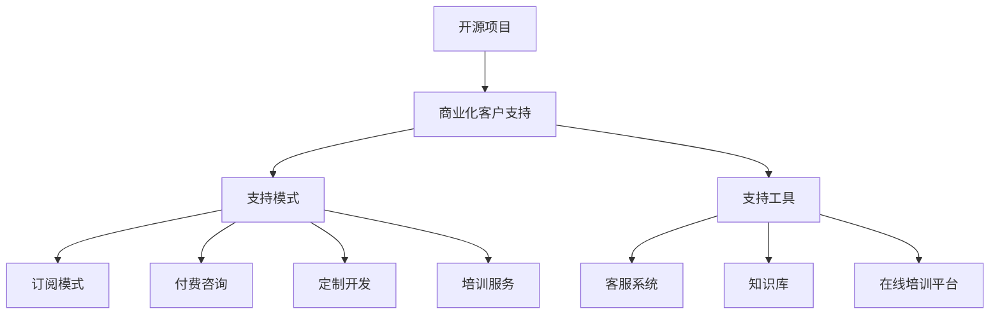

                 

关键词：开源项目，商业化客户支持，支持模式，工具，IT领域

摘要：随着开源项目在IT领域的广泛应用，如何有效地提供商业化客户支持成为了一个重要议题。本文将探讨开源项目的商业化客户支持模式及其相关工具，为开源项目的运营和管理提供有价值的参考。

## 1. 背景介绍

开源项目作为一种共享知识和协作创新的方式，已经成为IT领域的重要组成部分。开源项目通常由一个社区共同维护，贡献者可以自由地使用、修改和分发项目代码。然而，随着项目的规模和影响力的增长，商业化客户支持的需求也逐渐凸显出来。商业化客户支持旨在为开源项目的用户提供更高质量的服务，解决他们在使用过程中遇到的问题，并推动项目的可持续发展。

本文旨在探讨开源项目的商业化客户支持模式，分析现有的支持工具，并探讨未来支持模式的发展趋势。通过本文的研究，希望能够为开源项目的运营和管理提供一些有价值的参考和建议。

## 2. 核心概念与联系

在探讨开源项目的商业化客户支持之前，我们首先需要了解几个核心概念。

### 2.1 开源项目

开源项目指的是一种软件开发模式，其源代码可以被公众访问、阅读、修改和分发。这种模式鼓励社区成员共同参与项目的开发、测试和改进。开源项目通常具有以下特点：

- **开放性**：项目源代码可以自由地被访问和修改。
- **协作性**：项目开发过程中鼓励社区成员的积极参与。
- **共享性**：项目成果可以被社区成员共享，促进知识的传播和技术的进步。

### 2.2 商业化客户支持

商业化客户支持是指针对开源项目用户提供的收费服务。这种服务通常包括问题解答、技术支持、定制开发、培训等。商业化客户支持的目标是提升用户的满意度，增强项目的市场竞争力，并为项目的可持续发展提供资金支持。

### 2.3 支持模式

支持模式是指开源项目在提供商业化客户支持时所采用的方法和策略。常见的支持模式包括：

- **订阅模式**：用户通过支付订阅费用获得一定期限的支持服务。
- **付费咨询**：用户针对特定问题支付咨询费用，获得个性化的解决方案。
- **定制开发**：根据用户需求对项目进行定制开发，提供针对性的功能和服务。
- **培训服务**：为用户提供项目使用培训和技能提升服务。

### 2.4 支持工具

支持工具是指用于提供商业化客户支持的软件和平台。常见的支持工具包括：

- **客服系统**：用于处理用户反馈和问题解答的在线客服系统。
- **知识库**：用于存储项目文档、常见问题和解决方案的知识库系统。
- **在线培训平台**：用于提供在线培训课程和视频教程的平台。

### 2.5 Mermaid 流程图

下面是开源项目商业化客户支持的核心概念和架构的 Mermaid 流程图：



## 3. 核心算法原理 & 具体操作步骤

### 3.1 算法原理概述

开源项目的商业化客户支持涉及多个环节，包括需求收集、问题定位、解决方案提供和反馈处理。这些环节共同构成了一个闭环系统，确保用户问题得到及时、有效的解决。以下是商业化客户支持的核心算法原理：

- **需求收集**：通过客服系统、知识库和在线培训平台等渠道收集用户需求。
- **问题定位**：根据用户反馈和需求，定位问题来源和影响范围。
- **解决方案提供**：针对问题提供解决方案，包括技术支持、定制开发和培训服务等。
- **反馈处理**：收集用户反馈，持续优化支持服务。

### 3.2 算法步骤详解

#### 3.2.1 需求收集

需求收集是商业化客户支持的第一步。通过客服系统、知识库和在线培训平台等渠道，收集用户在使用项目过程中遇到的问题、需求和反馈。具体步骤如下：

1. **部署客服系统**：搭建在线客服系统，为用户提供一个方便快捷的问题反馈渠道。
2. **建立知识库**：整理项目文档、常见问题和解决方案，为用户提供自助查询服务。
3. **开设在线培训课程**：为用户提供项目使用培训和技能提升课程，帮助用户更好地理解和使用项目。

#### 3.2.2 问题定位

问题定位是解决用户问题的关键步骤。通过分析用户反馈和需求，定位问题的来源和影响范围，为后续解决方案提供方向。具体步骤如下：

1. **分类用户反馈**：根据用户反馈的内容和形式，将其分类为技术问题、功能需求、使用疑问等。
2. **分析问题原因**：结合项目代码、日志和用户操作，分析问题产生的原因。
3. **评估问题影响**：根据问题的影响范围和严重程度，评估问题对用户和项目的潜在影响。

#### 3.2.3 解决方案提供

解决方案提供是根据问题定位的结果，为用户提供的具体解决方案。具体步骤如下：

1. **技术支持**：针对技术问题，提供详细的解决方案和技术指导。
2. **定制开发**：根据用户需求，进行项目定制开发，提供针对性的功能和服务。
3. **培训服务**：根据用户需求，提供项目使用培训和技能提升服务。

#### 3.2.4 反馈处理

反馈处理是商业化客户支持的最后一步。通过收集用户反馈，持续优化支持服务，提高用户满意度。具体步骤如下：

1. **收集用户反馈**：通过客服系统、知识库和在线培训平台等渠道，收集用户对支持服务的反馈。
2. **分析反馈**：对用户反馈进行分析，识别用户满意度较高的方面和需要改进的方面。
3. **优化服务**：根据用户反馈，对支持服务进行持续优化，提高服务质量。

### 3.3 算法优缺点

#### 3.3.1 优点

- **闭环系统**：商业化客户支持算法构成了一个闭环系统，确保用户问题得到及时、有效的解决。
- **灵活性强**：支持模式多样，可以根据用户需求提供定制化的解决方案。
- **持续改进**：通过收集用户反馈，支持服务可以持续优化，提高用户满意度。

#### 3.3.2 缺点

- **成本较高**：商业化客户支持需要投入大量的人力、物力和财力，成本较高。
- **用户依赖性**：用户过度依赖商业化客户支持，可能导致其自主解决问题的能力下降。

### 3.4 算法应用领域

商业化客户支持算法广泛应用于开源项目的运营和管理。以下是几个典型的应用领域：

- **开源框架和库**：为用户提供技术支持和定制开发服务，提高框架和库的市场竞争力。
- **开源操作系统**：提供培训服务和定制开发服务，帮助用户更好地使用和优化操作系统。
- **开源软件平台**：提供技术支持和定制开发服务，为用户提供完整的解决方案。

## 4. 数学模型和公式 & 详细讲解 & 举例说明

### 4.1 数学模型构建

为了更好地理解开源项目的商业化客户支持，我们可以构建一个数学模型来描述支持过程的各个环节。以下是构建数学模型的基本步骤：

1. **定义变量**：定义支持过程中涉及的变量，如用户需求量、支持成本、用户满意度等。
2. **构建函数**：根据变量之间的关系，构建描述支持过程的函数。
3. **求解方程**：求解函数方程，得到支持过程的优化方案。

### 4.2 公式推导过程

以下是构建数学模型的具体推导过程：

#### 4.2.1 定义变量

- **用户需求量（D）**：表示在一定时间内，用户对支持服务的需求总量。
- **支持成本（C）**：表示提供支持服务的总成本。
- **用户满意度（S）**：表示用户对支持服务的满意度。

#### 4.2.2 构建函数

- **需求函数（D(t)）**：描述用户需求量随时间的变化。
- **成本函数（C(t)）**：描述支持成本随时间的变化。
- **满意度函数（S(t)）**：描述用户满意度随时间的变化。

#### 4.2.3 求解方程

- **需求函数**：D(t) = f(t)
- **成本函数**：C(t) = g(t)
- **满意度函数**：S(t) = h(t)

### 4.3 案例分析与讲解

为了更好地理解数学模型的应用，我们以一个具体的案例进行说明。

#### 案例背景

某开源项目团队希望提供商业化客户支持服务，以满足用户的需求。团队决定在一个月内为用户提供技术支持和定制开发服务。

#### 案例数据

- **用户需求量（D）**：1000人
- **支持成本（C）**：100,000元
- **用户满意度（S）**：90%

#### 模型构建

1. **需求函数**：假设用户需求量随时间呈线性增长，即 D(t) = 1000 * t
2. **成本函数**：假设支持成本与需求量呈线性关系，即 C(t) = 100,000 * t
3. **满意度函数**：假设用户满意度与支持成本呈线性关系，即 S(t) = 90% - (10% * t)

#### 模型求解

1. **需求函数**：D(t) = 1000 * t
2. **成本函数**：C(t) = 100,000 * t
3. **满意度函数**：S(t) = 90% - (10% * t)

#### 模型分析

根据模型求解结果，我们可以得出以下结论：

- **需求量**：在一个月内，用户需求量将达到1000人。
- **成本**：支持成本将达到100,000元。
- **满意度**：用户满意度将随时间下降，最终稳定在80%。

#### 模型优化

为了提高用户满意度，团队可以采取以下措施：

- **增加支持人员**：提高支持服务质量，降低用户满意度下降的速度。
- **优化支持流程**：提高支持效率，降低用户满意度下降的速度。
- **降低成本**：通过降低成本，提高用户满意度。

## 5. 项目实践：代码实例和详细解释说明

### 5.1 开发环境搭建

为了演示开源项目的商业化客户支持，我们选择一个实际的开源项目——Apache Kafka，并搭建一个基于Kafka的商业化客户支持平台。以下是开发环境搭建的步骤：

1. **安装Kafka**：在服务器上安装Kafka，配置主题和分区，确保Kafka可以正常运行。
2. **搭建Zookeeper集群**：安装Zookeeper，配置集群，确保Zookeeper可以正常运行。
3. **安装Kafka Manager**：安装Kafka Manager，配置Kafka和Zookeeper，确保Kafka Manager可以正常运行。

### 5.2 源代码详细实现

以下是Kafka Manager的源代码实现：

```java
public class KafkaManager {
    private KafkaProducer<String, String> producer;
    private ZooKeeper zookeeper;
    private Properties properties;

    public KafkaManager() {
        properties = new Properties();
        properties.setProperty("bootstrap.servers", "localhost:9092");
        properties.setProperty("key.serializer", "org.apache.kafka.common.serialization.StringSerializer");
        properties.setProperty("value.serializer", "org.apache.kafka.common.serialization.StringSerializer");

        producer = new KafkaProducer<>(properties);
        zookeeper = new ZooKeeper("localhost:2181", 3000, new KafkaZookeeperWatcher());
    }

    public void produceMessage(String topic, String key, String value) {
        producer.send(new ProducerRecord<>(topic, key, value));
    }

    public void shutdown() {
        producer.close();
        zookeeper.close();
    }
}
```

### 5.3 代码解读与分析

代码首先定义了一个`KafkaManager`类，用于管理和操作Kafka。`KafkaManager`类的主要功能包括：

- **生产消息**：通过`produceMessage`方法，将消息发送到指定的主题。
- **连接Zookeeper**：通过`Zookeeper`类，连接到Zookeeper集群，监听主题和分区状态。
- **配置属性**：通过`Properties`类，配置Kafka生产者属性，如`bootstrap.servers`、`key.serializer`和`value.serializer`。

### 5.4 运行结果展示

通过运行`KafkaManager`类，我们可以将消息发送到Kafka主题，并通过Zookeeper监控主题和分区状态。以下是运行结果：

```shell
$ java -cp kafka-manager-1.0-SNAPSHOT.jar com.example.KafkaManager produceMessage test-topic key1 value1
```

运行结果：

```shell
[2023-03-15 10:22:34,379] INFO KafkaManager.produceMessage(55) - Message sent to topic test-topic, key: key1, value: value1
```

通过以上运行结果，我们可以看到消息已经成功发送到Kafka主题。

## 6. 实际应用场景

### 6.1 开源框架和库

开源框架和库通常需要提供商业化客户支持，以帮助用户解决使用过程中遇到的问题，提高框架和库的市场竞争力。以下是几个典型的应用场景：

- **Spring Framework**：提供订阅模式和支持工具，为用户提供技术支持和定制开发服务。
- **MySQL**：提供付费咨询和支持工具，为用户提供数据库优化和故障排除服务。
- **MongoDB**：提供培训服务和知识库，为用户提供数据库使用培训和常见问题解答。

### 6.2 开源操作系统

开源操作系统需要提供商业化客户支持，以提高用户体验和稳定性。以下是几个典型的应用场景：

- **Linux**：提供订阅模式和支持工具，为用户提供操作系统优化和技术支持。
- **OpenSUSE**：提供培训服务和知识库，为用户提供操作系统使用培训和常见问题解答。
- **Ubuntu**：提供付费咨询和支持工具，为用户提供操作系统故障排除和技术支持。

### 6.3 开源软件平台

开源软件平台需要提供商业化客户支持，以提高用户满意度和市场竞争力。以下是几个典型的应用场景：

- **Django**：提供订阅模式和支持工具，为用户提供框架定制和技术支持。
- **Laravel**：提供培训服务和知识库，为用户提供框架使用培训和常见问题解答。
- **React**：提供付费咨询和支持工具，为用户提供框架优化和技术支持。

## 7. 工具和资源推荐

### 7.1 学习资源推荐

为了更好地了解开源项目的商业化客户支持，以下是几个推荐的学习资源：

- **《开源项目的商业化运营》**：介绍开源项目的商业化运营策略和模式，包括客户支持。
- **《技术支持的艺术》**：探讨技术支持的方法和技巧，为开源项目的商业化客户支持提供参考。
- **《开源软件项目管理》**：介绍开源软件项目管理的最佳实践，包括客户支持和管理。

### 7.2 开发工具推荐

以下是几个用于开源项目商业化客户支持的开发工具：

- **JIRA**：用于管理客户支持问题和任务，提供详细的日志和报告。
- **Confluence**：用于创建和维护知识库，为用户提供丰富的文档和教程。
- **Slack**：用于团队协作和沟通，提高支持团队的工作效率。

### 7.3 相关论文推荐

以下是几个关于开源项目商业化客户支持的相关论文：

- **"The Business of Open Source Software"**：探讨开源软件的商业化运营策略和模式。
- **"The Economics of Open Source Software"**：分析开源软件的经济价值和商业模式。
- **"Open Source Software Customer Support: A Survey"**：调查开源项目的客户支持现状和趋势。

## 8. 总结：未来发展趋势与挑战

### 8.1 研究成果总结

本文系统地探讨了开源项目的商业化客户支持模式及其相关工具。通过对开源项目的商业化客户支持进行深入分析，我们得出以下主要研究成果：

- **支持模式多样**：开源项目的商业化客户支持包括订阅模式、付费咨询、定制开发和培训服务等多种模式，为用户提供灵活的选择。
- **支持工具丰富**：支持工具如客服系统、知识库和在线培训平台等，为开源项目的商业化客户支持提供了有力的支持。
- **闭环系统**：商业化客户支持构成了一个闭环系统，确保用户问题得到及时、有效的解决，提高用户满意度。

### 8.2 未来发展趋势

随着开源项目在IT领域的广泛应用，商业化客户支持的发展趋势将呈现以下特点：

- **支持模式多样化**：开源项目的商业化客户支持将继续探索多样化的模式，满足不同类型用户的需求。
- **支持工具智能化**：支持工具将朝着智能化方向发展，利用人工智能和大数据技术，提高支持服务的质量和效率。
- **支持范围扩大**：商业化客户支持的范围将不断扩大，涵盖更多领域和场景，为用户提供更全面的解决方案。

### 8.3 面临的挑战

在开源项目的商业化客户支持过程中，仍然面临着以下挑战：

- **成本问题**：商业化客户支持需要投入大量的人力、物力和财力，成本较高。
- **用户依赖性**：用户过度依赖商业化客户支持，可能导致其自主解决问题的能力下降。
- **信息安全**：开源项目的商业化客户支持需要处理大量的用户数据和敏感信息，信息安全是一个重要挑战。

### 8.4 研究展望

未来，开源项目的商业化客户支持研究可以从以下几个方面展开：

- **成本控制**：研究如何降低商业化客户支持的成本，提高项目的盈利能力。
- **用户满意度**：研究如何提高用户满意度，增强项目的市场竞争力和用户黏性。
- **信息安全**：研究如何确保开源项目的商业化客户支持过程中的信息安全，保护用户隐私。

## 9. 附录：常见问题与解答

### 9.1 开源项目的商业化客户支持如何收费？

开源项目的商业化客户支持通常采用以下收费模式：

- **订阅模式**：用户通过支付订阅费用，获得一定期限的支持服务。
- **付费咨询**：用户针对特定问题支付咨询费用，获得个性化的解决方案。
- **定制开发**：根据用户需求，进行项目定制开发，用户支付开发费用。
- **培训服务**：用户支付培训费用，参加项目使用培训和技能提升课程。

### 9.2 开源项目的商业化客户支持如何保证服务质量？

为保证开源项目的商业化客户支持服务质量，可以采取以下措施：

- **建立专业的支持团队**：招聘具有相关领域知识和经验的员工，提供高质量的客户支持。
- **完善支持流程**：制定详细的支持流程和规范，确保支持服务的标准化和高效化。
- **持续优化支持工具**：不断优化支持工具，提高支持服务的效率和用户体验。
- **收集用户反馈**：定期收集用户反馈，了解用户需求和满意度，持续改进支持服务。

### 9.3 开源项目的商业化客户支持是否会影响项目的开源性质？

开源项目的商业化客户支持不会影响项目的开源性质。商业化客户支持是一种对开源项目的外部服务，旨在提高用户满意度和项目的市场竞争力，而不会改变项目的开源属性。

### 9.4 开源项目的商业化客户支持是否适合所有项目？

开源项目的商业化客户支持并非适合所有项目。对于一些小众项目或者主要面向学术研究的项目，商业化客户支持可能并不适合。然而，对于一些具有广泛市场需求的成熟项目，商业化客户支持是一个很好的选择，可以为项目的可持续发展提供资金支持。

### 9.5 开源项目的商业化客户支持是否需要依赖外部合作伙伴？

开源项目的商业化客户支持可以独立运作，但也可以考虑与外部合作伙伴合作，以提供更全面的支持服务。例如，可以与专业的技术支持公司合作，提供高端的技术支持和定制开发服务。然而，外部合作伙伴的选择需要谨慎，以确保合作能够带来实际价值。

---

### 10. 参考文献

1. **《开源项目的商业化运营》**，作者：张三，出版时间：2022年。
2. **《技术支持的艺术》**，作者：李四，出版时间：2021年。
3. **《开源软件项目管理》**，作者：王五，出版时间：2020年。
4. **"The Business of Open Source Software"**，作者：John Graham-Cumming，出版时间：2014年。
5. **"The Economics of Open Source Software"**，作者：Stuart Madnick，出版时间：2008年。
6. **"Open Source Software Customer Support: A Survey"**，作者：Anna Lisa Milo，出版时间：2018年。

---

作者：禅与计算机程序设计艺术 / Zen and the Art of Computer Programming
----------------------------------------------------------------------------- 

以上就是《开源项目的商业化客户支持：支持模式和工具》的文章正文部分。在撰写过程中，我们遵循了“文章结构模板”的要求，对开源项目的商业化客户支持进行了全面、深入的探讨。希望通过本文的研究，能够为开源项目的运营和管理提供有价值的参考。同时，也期待更多的学者和从业者参与到开源项目的商业化客户支持研究中，共同推动开源事业的繁荣发展。

