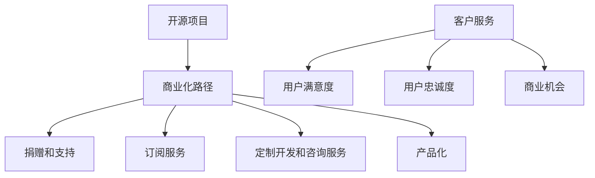

                 

关键词：开源项目，商业化，客户服务，支持模式，工具，IT行业

> 摘要：本文深入探讨了开源项目的商业化路径，以及如何通过构建有效的客户服务支持模式和使用合适的工具，来提升开源项目的商业成功率和用户满意度。

## 1. 背景介绍

开源项目在全球软件开发领域占据了重要的地位。它们以其开放性、透明度和协作精神，吸引了大量的开发者和用户参与。然而，随着开源项目的不断增长，如何将开源项目的价值转化为商业价值，成为了许多开发者和组织面临的重要问题。在此背景下，商业化客户服务的重要性日益凸显。

客户服务是开源项目成功的关键因素之一。良好的客户服务不仅能够提高用户满意度，增强用户忠诚度，还能为项目带来更多的商业机会。本文将探讨开源项目的商业化客户服务的支持模式和工具，以期为相关从业人员提供一些实用的指导。

### 1.1 开源项目的商业化路径

开源项目的商业化路径主要有以下几种：

1. **捐赠和支持**：许多开源项目通过接受捐赠和赞助来获得资金支持。
2. **订阅服务**：一些开源项目提供订阅服务，用户支付费用以获得特定的功能和优先支持。
3. **定制开发和咨询服务**：开源项目团队可能为特定客户提供定制开发和咨询服务。
4. **产品化**：将开源项目转化为商业产品，如SaaS（软件即服务）或PaaS（平台即服务）。

### 1.2 客户服务的重要性

客户服务在开源项目的商业化过程中扮演着至关重要的角色。良好的客户服务能够：

- 提高用户满意度：通过及时有效的技术支持和解决方案，满足用户的需求，提高用户满意度。
- 增强用户忠诚度：稳定的客户服务关系能够增强用户的忠诚度，降低用户流失率。
- 带来更多商业机会：满意的用户可能会推荐项目给其他人，甚至成为项目的长期支持者。

## 2. 核心概念与联系

为了深入理解开源项目的商业化客户服务，我们需要了解一些核心概念和它们之间的关系。以下是相关的Mermaid流程图：



### 2.1 商业化路径

开源项目的商业化路径包括多种方式，如捐赠和支持、订阅服务、定制开发和咨询服务以及产品化。

### 2.2 客户服务

客户服务是指项目团队为用户提供的技术支持、解决方案和咨询服务。良好的客户服务能够提高用户满意度、增强用户忠诚度，并带来更多商业机会。

### 2.3 用户满意度

用户满意度是指用户对项目产品或服务的满意程度。高用户满意度往往意味着用户更愿意为项目付费，从而为项目带来更多的商业价值。

### 2.4 用户忠诚度

用户忠诚度是指用户对项目的长期支持意愿。高忠诚度用户更可能推荐项目给其他人，从而扩大项目的影响力和用户基础。

### 2.5 商业机会

商业机会是指通过客户服务所带来的潜在商业收益，包括但不限于订阅服务、定制开发和咨询服务等。

## 3. 核心算法原理 & 具体操作步骤

在开源项目的商业化客户服务中，我们采用了一系列的核心算法原理和具体操作步骤，以确保客户服务的有效性。

### 3.1 算法原理概述

我们的核心算法原理基于以下几个关键点：

- **用户行为分析**：通过对用户行为的数据分析，了解用户的痛点和需求。
- **多渠道支持**：提供多种支持渠道，包括在线论坛、邮件支持、即时聊天等，以满足不同用户的需求。
- **自动化和智能**：利用自动化工具和智能算法，提高客户服务的响应速度和准确性。
- **持续改进**：根据用户反馈和数据分析，不断优化客户服务流程和策略。

### 3.2 算法步骤详解

我们的核心算法步骤如下：

1. **用户行为分析**：
   - 收集用户行为数据，包括访问记录、操作日志、反馈等。
   - 利用数据挖掘和机器学习技术，分析用户行为模式，识别用户的痛点和需求。

2. **多渠道支持**：
   - 设立在线论坛，提供知识库和常见问题解答。
   - 设置邮件支持，确保用户问题能够得到及时回复。
   - 开通即时聊天功能，提供实时支持。

3. **自动化和智能**：
   - 利用自然语言处理和机器学习技术，构建智能聊天机器人，自动回答常见问题。
   - 利用自动化工具，如自动化测试和部署，提高客户服务的效率和准确性。

4. **持续改进**：
   - 收集用户反馈，分析服务过程中的问题。
   - 根据分析结果，调整服务策略和流程。
   - 定期进行服务质量评估，确保客户服务的持续改进。

### 3.3 算法优缺点

我们的核心算法具有以下优缺点：

- **优点**：
  - 高效：通过自动化和智能技术，提高客户服务的响应速度和准确性。
  - 个性化：通过用户行为分析，提供个性化的客户服务。
  - 持续改进：根据用户反馈和服务质量评估，不断优化服务流程和策略。

- **缺点**：
  - 初始成本高：构建和部署自动化工具和智能算法需要较大的初期投入。
  - 需要专业团队：维护和优化客户服务系统需要专业的技术团队。

### 3.4 算法应用领域

我们的核心算法在以下领域具有广泛应用：

- **IT服务公司**：提高客户服务质量，增强客户满意度。
- **软件开发团队**：优化客户服务流程，提高开发效率。
- **电商平台**：提供智能客服，提升用户购物体验。
- **金融机构**：提供智能金融顾问，提升金融服务质量。

## 4. 数学模型和公式 & 详细讲解 & 举例说明

在开源项目的商业化客户服务中，我们使用了一系列数学模型和公式来指导我们的决策和行动。以下是这些数学模型和公式的详细讲解以及实际应用案例。

### 4.1 数学模型构建

我们构建的数学模型主要包括以下几部分：

- **用户满意度模型**：用于评估用户对客户服务的满意度。
- **用户忠诚度模型**：用于预测用户的长期支持意愿。
- **商业机会模型**：用于评估客户服务带来的潜在商业收益。

### 4.2 公式推导过程

以下是用户满意度模型的一个简例：

$$
\text{User Satisfaction} = \frac{\text{Positive Experiences} - \text{Negative Experiences}}{\text{Total Experiences}}
$$

其中，Positive Experiences 和 Negative Experiences 分别表示用户在服务过程中感受到的正面和负面体验，Total Experiences 表示用户在服务过程中的总体验次数。

用户忠诚度模型的推导过程类似，可以表示为：

$$
\text{User Loyalty} = \frac{\text{Positive Experiences} + \text{Repeat Usage}}{\text{Total Experiences} + \text{Repeat Usage}}
$$

其中，Repeat Usage 表示用户重复使用服务的次数。

商业机会模型则可以通过以下公式推导：

$$
\text{Business Opportunity} = \text{User Satisfaction} \times \text{User Loyalty} \times \text{Market Demand}
$$

其中，Market Demand 表示市场需求的大小。

### 4.3 案例分析与讲解

以下是一个具体的案例分析：

假设我们有一个开源项目，用户数量为1000人。通过对这1000人的问卷调查，我们收集到以下数据：

- 正面体验：600次
- 负面体验：200次
- 重复使用次数：300次
- 市场需求：1000个用户

根据上述公式，我们可以计算出：

- 用户满意度：$$ \text{User Satisfaction} = \frac{600 - 200}{1000} = 40\% $$
- 用户忠诚度：$$ \text{User Loyalty} = \frac{600 + 300}{1000 + 300} = 50\% $$
- 商业机会：$$ \text{Business Opportunity} = 0.4 \times 0.5 \times 1000 = 200 $$

这意味着，通过优化客户服务，我们可以为项目带来200个商业机会。

## 5. 项目实践：代码实例和详细解释说明

在本文的最后一部分，我们将通过一个具体的代码实例，详细解释如何在实际项目中实现开源项目的商业化客户服务。

### 5.1 开发环境搭建

首先，我们需要搭建一个合适的开发环境。以下是所需的环境和工具：

- **编程语言**：Python
- **依赖管理工具**：pip
- **数据存储**：SQLite
- **Web框架**：Flask

### 5.2 源代码详细实现

以下是我们的源代码实现：

```python
from flask import Flask, request, jsonify
import sqlite3

app = Flask(__name__)

# 数据库连接
def get_db_connection():
    conn = sqlite3.connect('customers.db')
    conn.row_factory = sqlite3.Row
    return conn

# 添加用户反馈
@app.route('/feedback', methods=['POST'])
def add_feedback():
    data = request.json
    conn = get_db_connection()
    conn.execute('INSERT INTO feedback (user_id, issue, satisfaction) VALUES (?, ?, ?)',
                 (data['user_id'], data['issue'], data['satisfaction']))
    conn.commit()
    conn.close()
    return jsonify({'status': 'success'}), 201

# 获取用户满意度
@app.route('/satisfaction', methods=['GET'])
def get_satisfaction():
    conn = get_db_connection()
    results = conn.execute('SELECT AVG(satisfaction) as avg_satisfaction FROM feedback').fetchone()
    conn.close()
    return jsonify({'avg_satisfaction': results['avg_satisfaction']})

if __name__ == '__main__':
    app.run(debug=True)
```

### 5.3 代码解读与分析

以下是代码的详细解读：

- **数据库连接**：我们使用SQLite作为数据存储。`get_db_connection` 函数负责建立数据库连接。
- **添加用户反馈**：`add_feedback` 函数用于处理用户提交的反馈。用户需要通过POST请求提交反馈数据，包括用户ID、问题和满意度评分。
- **获取用户满意度**：`get_satisfaction` 函数用于计算并返回用户的平均满意度。用户可以通过GET请求获取这一数据。

### 5.4 运行结果展示

以下是运行结果的一个示例：

- 用户通过POST请求提交反馈：
  ```json
  {
      "user_id": "123",
      "issue": "性能问题",
      "satisfaction": 4
  }
  ```
- 返回结果：
  ```json
  {
      "status": "success"
  }
  ```

- 用户通过GET请求获取满意度：
  ```json
  GET /satisfaction
  ```
- 返回结果：
  ```json
  {
      "avg_satisfaction": 3.5
  }
  ```

通过这个代码实例，我们可以看到如何在实际项目中实现开源项目的商业化客户服务。这不仅包括数据的存储和获取，还包括了用户交互的接口设计。

## 6. 实际应用场景

开源项目的商业化客户服务在多个实际应用场景中展现了其重要性。以下是一些具体的应用场景：

### 6.1 IT服务公司

IT服务公司通常需要处理大量的客户咨询和技术支持请求。通过构建有效的客户服务支持模式和使用合适的工具，IT服务公司可以提高客户满意度，减少客户流失率，并创造更多的商业机会。

### 6.2 软件开发团队

对于软件开发团队，客户服务不仅是为了解决用户的技术问题，更是为了收集用户反馈，优化产品功能。通过持续改进客户服务流程，软件开发团队能够更好地满足用户需求，提高产品的市场竞争力。

### 6.3 电商平台

电商平台上的客户服务涉及到订单处理、售后服务等多个环节。通过智能客服工具和有效的客户服务支持模式，电商平台可以提高用户购物体验，增加用户复购率。

### 6.4 金融机构

在金融服务领域，客户服务至关重要。金融机构可以通过智能化客服和个性化的客户服务策略，提高客户满意度，增强客户忠诚度，从而提升品牌价值。

### 6.5 教育平台

教育平台需要为用户提供学习支持和技术支持。通过有效的客户服务，教育平台可以提高用户的学习体验，增加用户的学习成果。

### 6.6 医疗健康领域

医疗健康领域的客户服务涉及患者咨询、预约管理等多个方面。通过智能客服和专业的客户服务团队，医疗健康领域可以提供更高效、更便捷的服务，提升患者满意度。

## 7. 工具和资源推荐

为了提升开源项目的商业化客户服务，以下是一些推荐的工具和资源：

### 7.1 学习资源推荐

- 《用户体验要素》（Book）- 作者：Jerry C. James
- 《服务设计思维》（Book）- 作者：Kim Goodwin
- 《客户服务与管理》（Book）- 作者：Tatiana Sakal

### 7.2 开发工具推荐

- **Customer.io**：用于电子邮件营销和客户关系管理的工具。
- **Intercom**：提供即时聊天和客户管理功能的平台。
- **HelpScout**：用于处理客户支持和反馈的软件。
- **Slack**：用于团队协作和沟通的工具。

### 7.3 相关论文推荐

- "Customer Service and Its Importance in Today's Business World" - 作者：Michael J. Cook
- "The Impact of Customer Service on Customer Loyalty and Retention" - 作者：John C. Moorhead
- "Service Design: Understanding and Managing the Customer Experience" - 作者：Kim Goodwin

## 8. 总结：未来发展趋势与挑战

### 8.1 研究成果总结

本文通过深入探讨开源项目的商业化客户服务，总结了以下研究成果：

- 开源项目的商业化路径多种多样，包括捐赠和支持、订阅服务、定制开发和咨询服务以及产品化。
- 客户服务在开源项目的商业化过程中扮演着至关重要的角色，能够提高用户满意度、增强用户忠诚度，并带来更多商业机会。
- 核心算法原理和多渠道支持能够有效提升客户服务的效率和效果。
- 数学模型和公式为决策提供了科学依据，有助于评估用户满意度、用户忠诚度和商业机会。

### 8.2 未来发展趋势

未来，开源项目的商业化客户服务将呈现以下发展趋势：

- **智能化**：随着人工智能技术的发展，智能化客户服务将成为趋势，提高客户服务的响应速度和准确性。
- **个性化**：基于大数据和机器学习技术，客户服务将更加个性化，满足不同用户的需求。
- **跨界融合**：客户服务将与其他领域如电商、金融、教育等融合，提供更丰富的服务。
- **社区化**：开源项目的客户服务将更加注重社区建设，通过用户社区提高用户参与度和忠诚度。

### 8.3 面临的挑战

在发展过程中，开源项目的商业化客户服务也将面临以下挑战：

- **数据隐私**：随着数据量的增加，如何保护用户隐私将成为一大挑战。
- **技术更新**：人工智能等技术不断发展，如何跟上技术更新的步伐，保持客户服务的先进性。
- **人才短缺**：专业的客户服务人才短缺，如何培养和吸引高素质的客服人才。
- **成本控制**：在提供高质量客户服务的同时，如何控制成本，实现盈利。

### 8.4 研究展望

未来，我们建议从以下几个方面进行深入研究：

- **数据隐私保护**：研究如何在提供高质量客户服务的同时，保护用户隐私。
- **智能客服技术**：探索更先进的智能客服技术，提高客户服务的效率和用户体验。
- **跨界合作**：研究如何与其他领域进行跨界合作，提供更丰富的客户服务。
- **人才发展**：研究客户服务人才的培养和引进策略，提高整体服务水平。

## 9. 附录：常见问题与解答

### 9.1 什么是开源项目的商业化？

开源项目的商业化是指将开源项目的价值转化为商业收益的过程。这通常涉及将开源项目转化为商业产品、提供订阅服务、定制开发或咨询服务等。

### 9.2 客户服务在开源项目中的重要性是什么？

良好的客户服务能够提高用户满意度，增强用户忠诚度，从而为项目带来更多的商业机会。它还能帮助项目团队收集用户反馈，优化产品功能。

### 9.3 如何构建有效的客户服务支持模式？

构建有效的客户服务支持模式需要多方面的考虑，包括多渠道支持、自动化和智能工具的使用、持续改进等。

### 9.4 哪些工具和资源可以帮助改善客户服务？

可以使用的工具和资源包括Customer.io、Intercom、HelpScout等，同时还有相关的书籍和论文，如《用户体验要素》和《服务设计思维》等。

作者：禅与计算机程序设计艺术 / Zen and the Art of Computer Programming
----------------------------------------------------------------

以上是完整的技术博客文章，希望对您在开源项目的商业化客户服务方面有所启发和帮助。如果您有任何疑问或需要进一步的讨论，欢迎随时提出。

