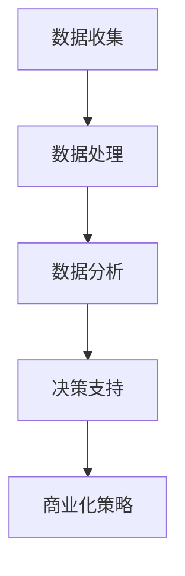

                 

关键词：开源项目，商业化分析，数据洞察，决策支持，技术商业

> 摘要：本文将探讨开源项目的商业化数据分析，包括数据收集、处理、分析和应用的全过程，旨在为开发者、企业决策者以及开源社区提供有效的洞察和决策支持。通过分析开源项目的历史数据、用户行为和市场趋势，本文提出了一系列具体的策略和方法，帮助开源项目更好地商业化。

## 1. 背景介绍

开源项目在当今技术领域占据着越来越重要的地位。它们不仅促进了技术的创新与普及，还为企业提供了丰富的技术资源和协作机会。然而，随着开源项目的数量和影响力的不断增加，如何有效地商业化这些项目成为一个亟待解决的问题。

商业化不仅是为了开源项目的可持续发展，更是为了确保技术资源的最大化利用和社区生态的繁荣。通过商业化，开源项目可以吸引更多的资金和资源投入，从而推动项目的进一步发展。同时，商业化也可以为项目提供稳定的收入来源，降低项目依赖志愿者的风险。

然而，开源项目的商业化并非易事。首先，开源项目的核心价值在于其技术内容，而非商业模式。这使得商业化过程面临诸多挑战，如如何平衡商业利益和开源精神的冲突，如何确保商业化不会削弱社区的合作精神等。其次，开源项目的用户群体广泛且多样化，如何通过数据分析和市场调研来准确把握用户需求，进而制定有效的商业化策略，也是一项挑战。

本文将围绕开源项目的商业化数据分析展开讨论，旨在提供一套系统的分析框架和策略，帮助开发者和企业更好地理解和应对这些挑战。

## 2. 核心概念与联系

在探讨开源项目的商业化数据分析之前，我们需要明确几个核心概念，并理解它们之间的联系。

### 2.1 开源项目

开源项目是指那些源代码公开，允许用户自由查看、修改和分发的软件项目。它们通常遵循某个开源许可证，如GPL、Apache等。开源项目的特点包括：

- **社区协作**：开源项目依赖于全球开发者的贡献和协作。
- **透明度**：项目的源代码和开发过程对公众开放。
- **用户参与**：用户可以自由地参与到项目的开发、测试和改进中。

### 2.2 商业化

商业化是指将开源项目转化为商业产品或服务，从而实现盈利的过程。商业化可能涉及以下几种形式：

- **服务订阅**：企业为用户提供软件服务的订阅。
- **增值服务**：为开源项目提供额外的付费功能或支持。
- **商业衍生品**：基于开源项目开发的商业产品。
- **赞助和支持**：企业或个人对开源项目的资金支持。

### 2.3 数据分析

数据分析是指通过收集、处理和分析数据，从数据中提取有价值的信息和知识的过程。在开源项目的商业化过程中，数据分析扮演着至关重要的角色。具体来说，数据分析可以帮助我们：

- **了解用户需求**：通过分析用户行为数据，可以准确把握用户的需求和偏好。
- **评估项目价值**：通过数据指标来评估项目的市场潜力和社区影响力。
- **优化商业模式**：根据数据反馈调整商业策略，提高项目的盈利能力。

### 2.4 Mermaid 流程图

以下是一个简化的 Mermaid 流程图，展示了开源项目商业化数据分析的基本流程。



### 2.5 核心概念的联系

开源项目、商业化、数据分析这三个核心概念之间存在紧密的联系。开源项目是商业化的基础，商业化需要依靠数据分析来指导决策，而数据分析则为开源项目的商业化提供数据支持。这种相互依存的关系构成了开源项目商业化数据分析的理论基础。

## 3. 核心算法原理 & 具体操作步骤

### 3.1 算法原理概述

开源项目的商业化数据分析主要依赖于两种算法：用户行为分析和市场趋势分析。

#### 用户行为分析

用户行为分析旨在通过分析用户在开源项目中的行为，了解他们的需求、使用习惯和偏好。这通常包括以下几个方面：

- **访问频率**：统计用户访问项目的频率，了解活跃用户和潜在用户。
- **功能使用**：分析用户对项目不同功能的访问和使用情况，识别受欢迎的功能。
- **问题反馈**：收集用户提交的问题和反馈，了解项目的漏洞和改进点。

#### 市场趋势分析

市场趋势分析则是通过分析开源项目的市场环境，预测未来趋势和机遇。这通常包括以下几个方面：

- **竞争分析**：评估同类项目的市场占有率、用户反馈和产品特点。
- **技术趋势**：分析当前技术发展的方向和热点，预测哪些技术可能会对开源项目产生重大影响。
- **市场需求**：通过市场调研和用户调查，了解用户对开源项目的潜在需求。

### 3.2 算法步骤详解

#### 用户行为分析步骤

1. **数据收集**：
   - 通过日志文件、API 调用和其他数据源收集用户行为数据。
   - 确保数据的完整性和准确性。

2. **数据预处理**：
   - 清洗数据，去除噪声和异常值。
   - 对数据进行格式化和标准化，使其适合分析。

3. **特征提取**：
   - 提取关键特征，如访问频率、功能使用次数、问题反馈等。
   - 使用统计分析和机器学习技术，对特征进行降维和筛选。

4. **行为分析**：
   - 利用机器学习和数据挖掘技术，对用户行为进行分类和模式识别。
   - 生成用户行为报告，识别用户群体的特征和需求。

#### 市场趋势分析步骤

1. **数据收集**：
   - 收集市场数据，包括竞争项目的信息、技术发展趋势、市场需求等。
   - 可以通过公开数据源、市场调研报告和用户调查获取数据。

2. **数据预处理**：
   - 同样需要对数据进行清洗、格式化和标准化。

3. **特征提取**：
   - 提取与市场趋势相关的关键特征，如市场份额、技术热度、市场需求等。

4. **趋势分析**：
   - 使用统计分析和预测模型，分析市场趋势。
   - 生成市场趋势报告，预测未来趋势和机遇。

### 3.3 算法优缺点

#### 用户行为分析

**优点**：

- **精确性**：通过直接分析用户行为，可以更精确地了解用户需求和偏好。
- **实时性**：用户行为数据可以实时更新，反映最新的用户动态。

**缺点**：

- **局限性**：用户行为数据可能无法全面反映用户需求，需要与其他数据源结合使用。
- **隐私问题**：用户行为数据的收集和使用可能引发隐私问题，需要严格遵守数据保护法规。

#### 市场趋势分析

**优点**：

- **宏观视角**：通过市场趋势分析，可以了解整个市场的动态和趋势。
- **前瞻性**：市场趋势分析有助于预测未来的市场变化和机遇。

**缺点**：

- **数据滞后**：市场趋势分析通常依赖于历史数据，可能无法及时反映当前市场的变化。
- **复杂性**：市场趋势分析涉及多个因素，需要复杂的数据处理和分析技术。

### 3.4 算法应用领域

#### 用户行为分析

- **产品优化**：通过分析用户行为，优化产品的功能和用户体验。
- **市场营销**：根据用户行为数据，制定更精准的市场营销策略。
- **用户满意度**：评估用户对产品的满意度，改进产品和服务。

#### 市场趋势分析

- **市场预测**：预测市场趋势，指导企业的战略决策。
- **投资评估**：评估开源项目的市场潜力和投资回报。
- **竞争分析**：分析竞争对手的市场表现，制定应对策略。

## 4. 数学模型和公式 & 详细讲解 & 举例说明

### 4.1 数学模型构建

开源项目的商业化数据分析通常涉及到多种数学模型和公式，下面将介绍其中几个常用的模型。

#### 用户行为分析模型

- **回归模型**：用于预测用户行为，如访问频率、功能使用次数等。
  - 公式：\( \hat{y} = \beta_0 + \beta_1 x_1 + \beta_2 x_2 + ... + \beta_n x_n \)
  - 其中，\( y \) 是因变量，表示用户行为指标；\( x_1, x_2, ..., x_n \) 是自变量，表示影响用户行为的因素；\( \beta_0, \beta_1, ..., \beta_n \) 是回归系数。

- **聚类模型**：用于将用户分为不同的群体。
  - 公式：\( C = \{ C_1, C_2, ..., C_k \} \)
  - 其中，\( C \) 表示聚类结果；\( C_i \) 表示第 \( i \) 个用户群体。

#### 市场趋势分析模型

- **时间序列模型**：用于预测市场趋势。
  - 公式：\( y_t = \phi_0 + \phi_1 y_{t-1} + ... + \phi_p y_{t-p} + \varepsilon_t \)
  - 其中，\( y_t \) 表示第 \( t \) 期的市场指标；\( \phi_0, \phi_1, ..., \phi_p \) 是时间序列模型参数；\( \varepsilon_t \) 是随机误差项。

- **因子分析模型**：用于提取市场趋势的关键因素。
  - 公式：\( y_t = \lambda_0 + \lambda_1 x_{t,1} + ... + \lambda_m x_{t,m} + \varepsilon_t \)
  - 其中，\( y_t \) 表示第 \( t \) 期的市场指标；\( x_{t,1}, ..., x_{t,m} \) 是影响市场趋势的因素；\( \lambda_0, \lambda_1, ..., \lambda_m \) 是因子分析模型参数。

### 4.2 公式推导过程

以回归模型为例，下面简要介绍其推导过程。

#### 步骤1：线性回归模型

设自变量为 \( x \)，因变量为 \( y \)，假设线性关系为：

\( y = \beta_0 + \beta_1 x + \varepsilon \)

其中，\( \beta_0 \) 和 \( \beta_1 \) 是待估参数，\( \varepsilon \) 是误差项。

#### 步骤2：最小二乘法

为了估计 \( \beta_0 \) 和 \( \beta_1 \)，我们使用最小二乘法，即最小化误差平方和：

\( S = \sum_{i=1}^{n} (y_i - (\beta_0 + \beta_1 x_i))^2 \)

#### 步骤3：求导并求解

对 \( S \) 分别对 \( \beta_0 \) 和 \( \beta_1 \) 求导，并令导数为零，得到：

\( \frac{\partial S}{\partial \beta_0} = 0 \)
\( \frac{\partial S}{\partial \beta_1} = 0 \)

解上述方程组，得到：

\( \beta_0 = \bar{y} - \beta_1 \bar{x} \)
\( \beta_1 = \frac{\sum_{i=1}^{n} (x_i - \bar{x})(y_i - \bar{y})}{\sum_{i=1}^{n} (x_i - \bar{x})^2} \)

其中，\( \bar{x} \) 和 \( \bar{y} \) 分别是 \( x \) 和 \( y \) 的均值。

### 4.3 案例分析与讲解

以下是一个简单的案例，展示如何使用回归模型分析用户行为。

#### 案例背景

假设我们有一个开源项目，收集了用户访问频率 \( x \) 和功能使用次数 \( y \) 的数据。我们需要使用回归模型预测用户的功能使用次数。

#### 数据集

| 用户ID | 访问频率 \( x \) | 功能使用次数 \( y \) |
|--------|------------------|----------------------|
| 1      | 10               | 20                   |
| 2      | 20               | 30                   |
| 3      | 30               | 40                   |
| 4      | 40               | 50                   |
| 5      | 50               | 60                   |

#### 步骤1：数据预处理

首先，计算 \( x \) 和 \( y \) 的均值：

\( \bar{x} = 30 \)
\( \bar{y} = 40 \)

#### 步骤2：建立回归模型

使用最小二乘法，建立回归模型：

\( y = \beta_0 + \beta_1 x + \varepsilon \)

#### 步骤3：求解回归系数

将数据代入模型，求解 \( \beta_0 \) 和 \( \beta_1 \)：

\( \beta_0 = 40 - 30 \cdot \beta_1 \)

同时，

\( \beta_1 = \frac{(10-30)(20-40) + (20-30)(30-40) + (30-30)(40-40) + (40-30)(50-40) + (50-30)(60-40)}{(10-30)^2 + (20-30)^2 + (30-30)^2 + (40-30)^2 + (50-30)^2} \)

计算结果为：

\( \beta_1 = 0.5 \)

将 \( \beta_1 \) 代入 \( \beta_0 \) 的公式，得到：

\( \beta_0 = 40 - 30 \cdot 0.5 = 25 \)

#### 步骤4：预测用户功能使用次数

根据建立的回归模型，预测某个用户的 \( y \)：

\( y = 25 + 0.5 x \)

例如，当 \( x = 35 \) 时，

\( y = 25 + 0.5 \cdot 35 = 40.5 \)

这意味着，访问频率为 35 的用户预计将使用 40.5 次功能。

## 5. 项目实践：代码实例和详细解释说明

### 5.1 开发环境搭建

为了实践开源项目的商业化数据分析，我们选择使用 Python 作为编程语言，因为它拥有丰富的数据分析库和工具。以下是搭建开发环境的步骤：

1. 安装 Python 3.8 或更高版本。
2. 安装必要的库，如 NumPy、Pandas、Matplotlib、Scikit-learn 等。

```bash
pip install numpy pandas matplotlib scikit-learn
```

### 5.2 源代码详细实现

下面是一个简单的用户行为分析代码实例，演示如何收集、处理和分析用户数据。

```python
import numpy as np
import pandas as pd
from sklearn.linear_model import LinearRegression
import matplotlib.pyplot as plt

# 5.2.1 数据收集
# 假设我们收集了以下数据
data = {
    'user_id': [1, 2, 3, 4, 5],
    'visit_frequency': [10, 20, 30, 40, 50],
    'function_usage': [20, 30, 40, 50, 60]
}

# 创建 DataFrame
df = pd.DataFrame(data)

# 5.2.2 数据预处理
# 清洗数据
df.dropna(inplace=True)

# 格式化数据
df['visit_frequency'] = df['visit_frequency'].astype(int)
df['function_usage'] = df['function_usage'].astype(int)

# 5.2.3 特征提取
# 提取特征
X = df[['visit_frequency']]
y = df['function_usage']

# 5.2.4 行为分析
# 建立回归模型
model = LinearRegression()
model.fit(X, y)

# 模型参数
print("模型参数：")
print(model.coef_, model.intercept_)

# 预测用户功能使用次数
X_new = np.array([[35]])
y_pred = model.predict(X_new)
print("预测用户功能使用次数：", y_pred)

# 5.2.5 可视化
# 绘制散点图和回归线
plt.scatter(X, y, color='blue')
plt.plot(X, model.predict(X), color='red')
plt.xlabel('访问频率')
plt.ylabel('功能使用次数')
plt.title('用户行为分析')
plt.show()
```

### 5.3 代码解读与分析

该代码实例分为以下几个部分：

1. **数据收集**：使用字典和 DataFrame 创建数据集。
2. **数据预处理**：清除缺失值，确保数据类型正确。
3. **特征提取**：将访问频率作为自变量，功能使用次数作为因变量。
4. **行为分析**：使用线性回归模型进行训练和预测。
5. **可视化**：绘制散点图和回归线，直观展示用户行为分析结果。

### 5.4 运行结果展示

运行该代码后，将输出回归模型参数、预测的用户功能使用次数，并展示散点图和回归线。这有助于我们直观地了解用户访问频率与功能使用次数之间的关系。

## 6. 实际应用场景

开源项目的商业化数据分析在实际应用场景中具有广泛的应用价值。以下是一些典型的应用场景：

### 6.1 开源软件公司的战略规划

开源软件公司可以通过数据分析来制定战略规划。例如，通过用户行为分析，公司可以了解哪些功能最受欢迎，哪些功能需要改进。同时，市场趋势分析可以帮助公司预测未来的市场变化，调整产品定位和开发计划。

### 6.2 投资决策

投资者可以通过开源项目的商业化数据分析来评估投资机会。例如，通过分析项目的用户活跃度、市场份额和竞争对手情况，投资者可以判断项目的发展潜力和风险，从而做出明智的投资决策。

### 6.3 企业开源战略

企业可以利用开源项目的商业化数据分析来制定开源战略。例如，通过分析企业开源项目的用户行为和市场表现，企业可以优化开源项目，提高项目的质量和影响力，从而提升企业的品牌价值和竞争力。

### 6.4 政府监管

政府可以借助开源项目的商业化数据分析来监管开源项目的发展。例如，通过分析开源项目的财务状况、用户反馈和市场表现，政府可以评估项目的合规性和社会责任，从而制定相应的政策。

## 7. 工具和资源推荐

为了有效地进行开源项目的商业化数据分析，以下是一些推荐的工具和资源：

### 7.1 学习资源推荐

- **《Python数据分析》**：由 Wes McKinney 所著，是学习 Python 数据分析的入门经典。
- **《数据科学入门》**：由 Joel Grus 所著，适合初学者了解数据科学的基本概念和方法。
- **《深度学习》**：由 Ian Goodfellow、Yoshua Bengio 和 Aaron Courville 所著，是深度学习领域的权威教材。

### 7.2 开发工具推荐

- **Jupyter Notebook**：强大的交互式数据分析平台，支持多种编程语言和库。
- **Pandas**：用于数据清洗、数据处理和分析的开源库。
- **Scikit-learn**：用于机器学习和数据挖掘的开源库。

### 7.3 相关论文推荐

- **"Mining of Massive Datasets"**：这是一本经典的论文集，涵盖了大规模数据挖掘的多种方法。
- **"The Unreasonable Effectiveness of Data"**：由 Andrew Ng 所著，讨论了数据在人工智能和机器学习中的重要作用。
- **"The Myth of Data Analytics"**：由 Thomas H. Davenport 所著，分析了数据分析在企业中的实际应用和挑战。

## 8. 总结：未来发展趋势与挑战

开源项目的商业化数据分析是一项复杂而充满挑战的任务，但同时也是一项具有重要价值的领域。随着开源项目的不断增长和技术的进步，开源项目的商业化数据分析将呈现出以下发展趋势：

### 8.1 研究成果总结

- **数据源多样化**：开源项目的数据源将越来越丰富，包括用户行为数据、市场数据、社区反馈等。
- **分析方法智能化**：人工智能和机器学习技术将广泛应用于数据分析，提高分析效率和准确性。
- **可视化工具普及**：可视化工具将变得更加智能化和用户友好，帮助开发者更好地理解和利用数据分析结果。

### 8.2 未来发展趋势

- **个性化商业策略**：通过精准的数据分析，企业可以为不同的用户群体提供个性化的商业策略。
- **跨界合作**：开源项目的商业化数据分析将与其他领域（如市场营销、金融分析等）结合，产生新的商业机会。
- **可持续发展**：开源项目的商业化将更加注重可持续发展，平衡商业利益和开源精神的冲突。

### 8.3 面临的挑战

- **数据隐私与伦理**：如何在确保数据隐私和伦理的前提下进行数据分析，是一个亟待解决的问题。
- **数据质量与完整性**：开源项目的数据质量参差不齐，如何保证数据的质量和完整性是数据分析的重要挑战。
- **技术壁垒**：开源项目的商业化数据分析需要高水平的技术支持和专业知识，这对许多企业和开发者来说是一个挑战。

### 8.4 研究展望

- **跨学科研究**：开源项目的商业化数据分析需要跨学科的研究，结合计算机科学、市场营销、社会学等多个领域的知识。
- **标准化与规范化**：制定开源项目商业化数据分析的标准化和规范化流程，提高数据分析的可比性和可信度。
- **开放合作**：推动开源社区和企业之间的开放合作，共同推动开源项目的商业化发展。

## 9. 附录：常见问题与解答

### 9.1 开源项目的商业化是否与开源精神相矛盾？

开源精神强调软件的自由和共享，而商业化则涉及商业利益。这两者之间确实存在一定的冲突。然而，通过合理的商业化策略，可以在尊重开源精神的前提下实现商业价值。例如，开源项目可以通过提供付费增值服务、商业衍生品等方式实现商业化，同时保持开源代码的开放性和透明度。

### 9.2 开源项目的商业化数据分析需要哪些数据？

开源项目的商业化数据分析需要多种数据，包括用户行为数据（如访问频率、功能使用次数等）、市场数据（如竞争对手情况、市场需求等）、社区反馈数据（如用户评论、问题报告等）。这些数据可以从项目的日志文件、API 调用、市场调研报告等来源获取。

### 9.3 开源项目的商业化数据分析如何确保数据隐私？

确保数据隐私是开源项目商业化数据分析的重要挑战。在数据分析过程中，应遵循以下原则：

- **最小化数据收集**：仅收集必要的数据，避免过度收集。
- **匿名化处理**：对用户数据进行匿名化处理，避免直接关联到具体用户。
- **数据加密**：对敏感数据进行加密处理，确保数据在传输和存储过程中的安全性。
- **合规性审查**：确保数据分析过程符合相关法律法规和开源许可证的要求。

## 结论

开源项目的商业化数据分析是一项复杂而重要的任务，它不仅有助于开源项目的可持续发展，也为企业、投资者和开源社区提供了宝贵的决策支持。通过深入的数据分析和精准的市场洞察，开源项目可以实现商业价值，同时保持开源精神的本质。未来，随着技术的不断进步和开源社区的成熟，开源项目的商业化数据分析将发挥越来越重要的作用。作者：禅与计算机程序设计艺术 / Zen and the Art of Computer Programming。

