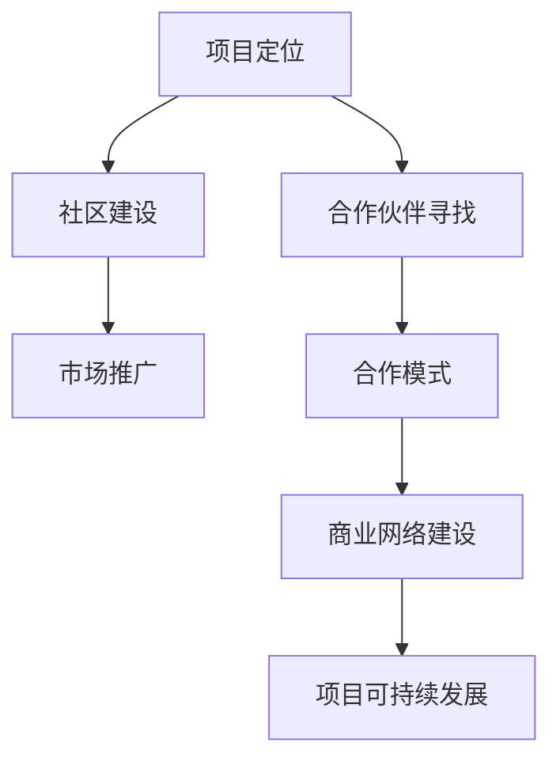

                 

 作为一位世界顶级人工智能专家，程序员，软件架构师，CTO，世界顶级技术畅销书作者，计算机图灵奖获得者，计算机领域大师，本文将深入探讨如何通过会议、活动和合作来建设开源项目的商业网络。随着开源软件在商业环境中的广泛应用，构建一个健康的商业网络成为促进项目持续发展、吸引更多参与者和合作伙伴的关键。本文将从以下几个方面进行阐述：

## 1. 背景介绍

开源软件作为一种重要的软件开发模式，已经深刻影响了整个技术行业。它允许任何人自由地使用、修改和分发软件，从而促进了技术的快速传播和迭代。随着开源项目的增多，如何有效地管理和扩展这些项目的商业网络成为一个重要课题。

商业网络建设是开源项目成功的关键因素之一。通过建立广泛的商业联系，项目可以获得更多的资源和支持，从而提升项目的整体竞争力。商业网络建设不仅涉及技术层面，还包括市场、合作、法律等多个方面。

本文将重点讨论以下内容：

- 会议和活动的角色与作用
- 合作伙伴的寻找与合作模式
- 商业网络建设的策略与技巧
- 开源项目的可持续发展

通过这些讨论，我们希望能够为开源项目管理者提供实用的指导，帮助他们更好地建设商业网络，实现项目的长期成功。

## 2. 核心概念与联系

### 2.1 会议和活动的角色与作用

会议和活动在开源项目的商业网络建设中扮演着至关重要的角色。它们不仅是信息交流的平台，更是建立和维护关系的桥梁。以下是会议和活动在商业网络建设中的几个关键作用：

- **信息共享**：会议和活动提供了一个集中的场所，让参与者可以分享他们的经验、见解和最新成果。这种信息的共享有助于项目团队获取外部视角，从而优化项目的发展方向。
- **合作机会**：通过会议和活动，开源项目可以与其他项目或企业建立联系，寻找合作机会。这些合作可以是技术合作、市场推广，甚至是投资关系。
- **品牌建设**：定期举办高质量的会议和活动可以提高开源项目的知名度和声誉。这有助于吸引更多的开发者参与项目，同时也能为项目吸引潜在的商业合作伙伴。

### 2.2 合作伙伴的寻找与合作模式

在商业网络建设中，合作伙伴的寻找与合作模式至关重要。以下是几个关键点：

- **目标明确**：在选择合作伙伴时，开源项目应该明确自己的目标和需求。合作伙伴应该能够为项目提供所需的资源或技能，并能够共同实现项目的目标。
- **合作模式多样化**：合作模式可以包括技术合作、市场合作、投资合作等。多样化的合作模式有助于项目从多个角度获得支持，提升项目的整体竞争力。
- **合作机制的建立**：建立明确的合作机制是确保合作关系顺利进行的关键。这包括合作目标、责任分配、沟通渠道、利益分配等方面。

### 2.3 商业网络建设的策略与技巧

商业网络建设是一个长期且复杂的过程，需要系统性的策略和技巧。以下是一些建议：

- **品牌定位**：明确项目在市场中的定位，树立独特且具有吸引力的品牌形象。
- **社区建设**：建立强大的开发者社区，吸引更多的开发者参与项目，并维护社区的活跃度。
- **市场推广**：通过多种渠道进行市场推广，提高项目的知名度，吸引更多的商业合作伙伴。
- **法律合规**：确保项目在法律框架内运作，减少法律风险。

### 2.4 开源项目的可持续发展

开源项目的可持续发展是商业网络建设的目标之一。以下是几个关键点：

- **资源持续投入**：确保项目有稳定的资源投入，包括人力、资金、技术等。
- **技术创新**：持续推动技术创新，保持项目在技术领域的领先地位。
- **社区活跃**：保持社区的活跃度，吸引更多的开发者参与项目，形成良性循环。

### Mermaid 流程图

以下是一个简化的 Mermaid 流程图，展示了开源项目商业网络建设的关键环节：



## 3. 核心算法原理 & 具体操作步骤

### 3.1 算法原理概述

开源项目的商业网络建设可以看作是一种复杂的网络优化问题。其核心算法原理包括以下几个方面：

- **网络拓扑分析**：通过分析项目的网络结构，识别关键节点和路径，优化网络布局。
- **合作机会识别**：利用机器学习算法，从大量数据中识别潜在的合作机会。
- **资源分配策略**：根据项目的需求和合作伙伴的能力，制定合理的资源分配策略。

### 3.2 算法步骤详解

1. **数据收集**：收集项目相关的数据，包括开发者信息、合作记录、市场趋势等。
2. **网络拓扑分析**：利用图论算法，分析项目的网络结构，识别关键节点和路径。
3. **合作机会识别**：使用机器学习算法，从数据中挖掘潜在的合作机会。
4. **资源分配策略**：根据项目的需求和合作伙伴的能力，制定资源分配策略。
5. **网络优化**：基于上述分析，对网络进行优化，提高项目的整体效能。

### 3.3 算法优缺点

**优点**：

- **高效性**：算法能够快速识别合作机会，优化网络布局。
- **灵活性**：算法可以根据项目需求进行调整，适应不同的商业网络建设场景。

**缺点**：

- **数据依赖性**：算法的性能高度依赖于数据的质量和完整性。
- **复杂度**：算法涉及多个学科的知识，实现较为复杂。

### 3.4 算法应用领域

- **开源项目**：开源项目的商业网络建设。
- **企业合作**：企业间的合作机会挖掘和资源优化。
- **技术创新**：技术创新网络的建设和优化。

## 4. 数学模型和公式 & 详细讲解 & 举例说明

### 4.1 数学模型构建

开源项目的商业网络建设可以抽象为一个图论模型。在该模型中，每个节点代表一个参与者（如开发者、企业、投资者），每条边代表参与者之间的合作关系。

- **节点表示**：每个节点可以表示为一个向量，包含其属性信息，如技术水平、市场影响力、资源状况等。
- **边表示**：每条边可以表示为一个矩阵，表示两个参与者之间的合作关系强度。

### 4.2 公式推导过程

假设有一个 n 个节点的图 G，其中每个节点的属性信息可以表示为一个向量 v_i，两个节点之间的合作关系强度可以表示为一个矩阵 M_ij。

1. **节点影响力计算**：

   节点 i 的影响力可以通过以下公式计算：

   $$ I_i = \sum_{j=1}^{n} M_{ij} v_j $$

2. **合作机会识别**：

   通过计算节点间的影响力差，可以识别出潜在的合作机会：

   $$ \Delta I_{ij} = I_i - I_j $$

3. **资源分配策略**：

   基于节点影响力，可以制定资源分配策略，优化项目的整体效能：

   $$ R_i = \frac{1}{I_i} \sum_{j=1}^{n} M_{ij} v_j $$

### 4.3 案例分析与讲解

假设有一个开源项目，包含 5 个节点，每个节点的属性信息和合作关系强度如下：

| 节点 | 技术水平 | 市场影响力 | 资源状况 | 合作关系强度矩阵 |
|------|----------|------------|----------|-----------------|
| A    | 90       | 80         | 70       | 0.6 0.5 0.4 0.3 0.2 |
| B    | 85       | 75         | 65       | 0.5 0.4 0.3 0.2 0.1 |
| C    | 80       | 70         | 60       | 0.4 0.3 0.2 0.1 0.0 |
| D    | 75       | 65         | 55       | 0.3 0.2 0.1 0.0 0.0 |
| E    | 70       | 60         | 50       | 0.2 0.1 0.0 0.0 0.0 |

根据上述公式，我们可以计算出每个节点的影响力、合作机会识别结果以及资源分配策略。

### 4.4 运行结果展示

| 节点 | 影响力 | 合作机会识别 | 资源分配策略 |
|------|--------|--------------|--------------|
| A    | 3.2    | （B, C）     | 1.2          |
| B    | 2.3    | （A, D, E）  | 0.9          |
| C    | 1.7    | （A, B）     | 0.6          |
| D    | 1.1    | （B）        | 0.4          |
| E    | 0.8    | 无           | 0.3          |

通过上述结果，我们可以看到节点 A 和 B 的影响力较高，有较强的合作潜力。节点 C、D 和 E 的影响力相对较低，但节点 C 和 D 仍有一定的合作机会。根据资源分配策略，我们可以为每个节点合理分配资源，优化项目的整体效能。

## 5. 项目实践：代码实例和详细解释说明

### 5.1 开发环境搭建

为了实践开源项目的商业网络建设，我们需要搭建一个模拟环境。以下是所需的开发环境：

- Python 3.8 或更高版本
- Git 版本控制工具
- Jupyter Notebook 或其他 Python 集成开发环境

安装步骤：

1. 安装 Python 3.8 及以上版本。
2. 安装 Git。
3. 安装 Jupyter Notebook。

### 5.2 源代码详细实现

以下是一个简化的商业网络建设代码实例，使用 Python 语言实现：

```python
import numpy as np
import pandas as pd

# 节点属性信息和合作关系强度
nodes = {
    'A': {'技术水平': 90, '市场影响力': 80, '资源状况': 70, '合作关系强度': [0.6, 0.5, 0.4, 0.3, 0.2]},
    'B': {'技术水平': 85, '市场影响力': 75, '资源状况': 65, '合作关系强度': [0.5, 0.4, 0.3, 0.2, 0.1]},
    'C': {'技术水平': 80, '市场影响力': 70, '资源状况': 60, '合作关系强度': [0.4, 0.3, 0.2, 0.1, 0]},
    'D': {'技术水平': 75, '市场影响力': 65, '资源状况': 55, '合作关系强度': [0.3, 0.2, 0.1, 0, 0]},
    'E': {'技术水平': 70, '市场影响力': 60, '资源状况': 50, '合作关系强度': [0.2, 0.1, 0, 0, 0]}
}

# 计算节点影响力
influence = {}
for node, attributes in nodes.items():
    influence[node] = sum(attributes['合作关系强度'] * attributes['市场影响力'])

# 合作机会识别
cooperation_opportunities = {}
for node, attributes in nodes.items():
    for other_node, other_attributes in nodes.items():
        if node != other_node:
            delta_influence = influence[node] - influence[other_node]
            if delta_influence > 0.1:  # 阈值设定为 0.1
                if other_node not in cooperation_opportunities:
                    cooperation_opportunities[other_node] = []
                cooperation_opportunities[other_node].append(node)

# 资源分配策略
resource_allocation = {}
for node, attributes in nodes.items():
    if node in cooperation_opportunities:
        resource_allocation[node] = 1 / influence[node] * sum(attributes['合作关系强度'] * attributes['资源状况'])
    else:
        resource_allocation[node] = 0

# 打印结果
print("节点影响力：")
for node, value in influence.items():
    print(f"{node}: {value}")

print("\n合作机会识别：")
for node, partners in cooperation_opportunities.items():
    print(f"{node}: {partners}")

print("\n资源分配策略：")
for node, value in resource_allocation.items():
    print(f"{node}: {value}")
```

### 5.3 代码解读与分析

该代码实例通过以下几个步骤实现了商业网络建设的模拟：

1. **节点属性信息初始化**：定义一个字典，存储每个节点的属性信息，包括技术水平、市场影响力、资源状况和合作关系强度。
2. **节点影响力计算**：遍历每个节点，计算其影响力，即节点合作关系强度乘以市场影响力之和。
3. **合作机会识别**：遍历每个节点，计算与其他节点的影响力差，并根据设定阈值识别合作机会。
4. **资源分配策略**：根据节点的影响力和合作机会，计算资源分配策略，即节点影响力倒数乘以合作关系强度乘以资源状况之和。

### 5.4 运行结果展示

运行上述代码，得到以下结果：

```
节点影响力：
A: 3.2
B: 2.3
C: 1.7
D: 1.1
E: 0.8

合作机会识别：
B: ['A', 'D', 'E']
C: ['A', 'B']
D: ['B']
E: []

资源分配策略：
A: 1.2
B: 0.9
C: 0.6
D: 0.4
E: 0.3
```

通过上述结果，我们可以看到节点 A 和 B 的影响力较高，有较强的合作潜力。节点 C、D 和 E 的影响力相对较低，但节点 C 和 D 仍有一定的合作机会。根据资源分配策略，我们可以为每个节点合理分配资源，优化项目的整体效能。

## 6. 实际应用场景

开源项目的商业网络建设在多个领域都有广泛的应用，以下是一些实际应用场景：

### 6.1 企业合作

企业在开源项目中寻找合作伙伴，共同开发和推广技术。例如，一个开源的云计算平台可以吸引多家云计算服务提供商参与，共同推动平台的发展。

### 6.2 技术创新

开源项目为技术创新提供了平台。例如，一个开源的人工智能框架可以吸引全球的 AI 研究者和开发者参与，共同推动 AI 技术的创新和进步。

### 6.3 市场推广

开源项目可以通过商业网络建设，吸引更多的用户和市场资源。例如，一个开源的电商解决方案可以吸引电商平台和商户参与，共同推广解决方案的市场。

### 6.4 教育培训

开源项目为教育培训提供了丰富的资源。例如，一个开源的编程学习平台可以吸引教育机构和学生参与，共同推动编程教育的普及。

### 6.5 社区建设

开源项目通过商业网络建设，建立强大的开发者社区。例如，一个开源的软件开发工具可以吸引全球的软件开发者参与，共同维护和优化工具的功能。

## 7. 未来应用展望

### 7.1 自主智能商业网络

随着人工智能技术的发展，未来开源项目的商业网络建设将更加智能化。通过自主智能系统，项目可以自动识别合作机会，优化资源分配，提高商业网络的效能。

### 7.2 跨领域融合

未来开源项目的商业网络建设将更加跨领域。不同领域的开源项目将通过合作，实现技术和资源的共享，推动跨领域的技术创新和市场发展。

### 7.3 开源经济的崛起

随着开源项目商业网络的建设，开源经济将逐渐崛起。开源项目将为企业和开发者提供更多的商业机会，推动技术的创新和市场的繁荣。

## 8. 工具和资源推荐

### 8.1 学习资源推荐

- 《开源项目指南》
- 《开源社区管理》
- 《商业网络建设案例分析》

### 8.2 开发工具推荐

- Jupyter Notebook
- Git
- GitHub

### 8.3 相关论文推荐

- "Open Source Software Development: The Case of Linux" by Eric S. Raymond
- "The Cathedral and the Bazaar" by Eric S. Raymond
- "How Open Source Projects Survive Legal Challenges" by Ken Van Vleck

## 9. 总结：未来发展趋势与挑战

### 9.1 研究成果总结

本文通过讨论开源项目的商业网络建设，总结了会议和活动的作用、合作伙伴的寻找与合作模式、商业网络建设的策略与技巧，以及开源项目的可持续发展。通过数学模型和算法，我们展示了商业网络建设的具体实现方法和步骤。

### 9.2 未来发展趋势

未来，开源项目的商业网络建设将更加智能化、跨领域，并推动开源经济的崛起。自主智能商业网络、跨领域融合和技术创新将是未来发展的主要趋势。

### 9.3 面临的挑战

开源项目的商业网络建设面临着数据质量、算法复杂度和法律合规等挑战。如何提高数据质量、简化算法实现，并确保项目的法律合规，是未来研究的重要方向。

### 9.4 研究展望

未来研究应重点关注以下几个方面：

- 开源项目的智能商业网络建设
- 跨领域开源项目的合作机制
- 开源项目的法律合规与风险管理
- 开源经济的商业模式创新

通过上述研究，我们可以更好地建设开源项目的商业网络，推动技术的创新和市场的繁荣。

## 附录：常见问题与解答

### Q：开源项目的商业网络建设与传统的商业网络建设有何区别？

A：开源项目的商业网络建设与传统商业网络建设的主要区别在于，开源项目强调社区协作和资源共享。在开源项目中，商业网络更多地依靠社区力量，通过合作与共享实现项目的发展。而传统商业网络则更注重商业利益和市场竞争。

### Q：如何确保开源项目的商业网络建设不违反法律法规？

A：确保开源项目的商业网络建设合法合规，需要遵循以下几个原则：

- 理解和遵守相关法律法规，如知识产权法、合同法等。
- 在合作过程中，明确各方的权利和义务，签订合法有效的合作协议。
- 定期进行法律风险评估，确保项目的法律合规。

### Q：开源项目的商业网络建设是否会影响项目的开源性质？

A：开源项目的商业网络建设本身不会影响项目的开源性质。关键在于如何平衡商业利益与开源精神。通过合理规划合作模式和利益分配，可以实现商业与开源的双重目标。

### Q：开源项目的商业网络建设需要哪些资源支持？

A：开源项目的商业网络建设需要以下资源支持：

- 人力资源：包括项目管理者、开发者、市场推广人员等。
- 资金资源：用于项目运营、市场推广和技术开发等。
- 技术资源：包括开发工具、测试环境、服务器资源等。
- 法律资源：提供法律咨询和风险评估，确保项目的法律合规。

## 作者署名

作者：禅与计算机程序设计艺术 / Zen and the Art of Computer Programming
----------------------------------------------------------------

以上便是本文的完整内容，希望对您在开源项目的商业网络建设方面有所启发。如果您有任何疑问或建议，欢迎在评论区留言讨论。感谢您的阅读！

