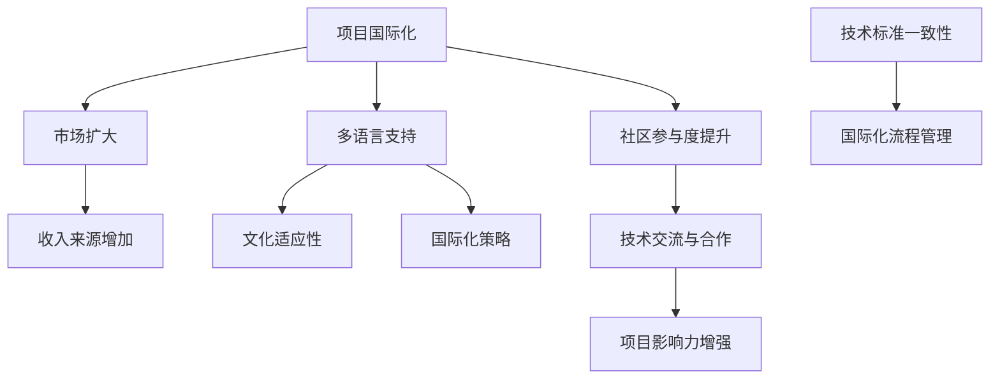

                 

 在当今全球化的背景下，开源项目已成为技术创新和协作的重要力量。然而，许多开源项目局限于特定的语言和文化环境，未能充分发挥其潜力。本文旨在探讨开源项目的国际化，如何通过扩大市场和收入来源，为项目及其社区带来更多机遇和活力。

## 1. 背景介绍

开源项目在全球范围内迅速发展，已经成为技术创新和知识共享的重要途径。然而，大部分开源项目仍然局限于英语环境，这对非英语国家的开发者来说是一个巨大的障碍。国际化的开源项目不仅能够吸引更多的贡献者，还可以打开新的市场，增加项目的收入来源。

国际化不仅有助于扩大开源项目的影响力和用户基础，还可以促进全球范围内的技术合作与创新。然而，要实现国际化并非易事，需要考虑多方面的因素，如语言、文化差异、技术标准等。本文将深入探讨这些挑战，并提出解决方案。

### 1.1 开源项目的发展现状

开源项目的发展已经经历了多个阶段，从早期的个人项目，到如今的大型社区项目，如Linux、Apache、WordPress等。这些项目不仅在技术层面取得了巨大成就，还在推动开源文化、促进技术交流方面发挥了重要作用。

然而，大多数开源项目仍然主要依赖于英语社区的贡献，导致非英语国家的开发者难以参与到项目中。这种语言障碍不仅限制了项目的国际化，还可能导致项目的创新能力和多样性受到限制。

### 1.2 国际化的必要性

国际化的开源项目能够吸引来自不同文化背景的开发者，从而丰富项目的创新思维和解决方案。此外，国际化还可以帮助项目进入新的市场，提高项目的知名度和影响力，进而增加收入来源。

例如，一些开源项目通过提供多语言支持，成功吸引了来自亚洲、欧洲等地区的用户和贡献者。这些项目的国际化不仅提高了其市场份额，还增强了其在全球技术市场中的竞争力。

## 2. 核心概念与联系

要实现开源项目的国际化，我们需要了解几个关键概念，并探讨它们之间的联系。以下是核心概念及其流程图：



### 2.1 多语言支持

多语言支持是国际化项目的基石。它不仅包括界面翻译，还应涵盖文档、用户手册、社区交流等多个方面。通过提供多语言支持，项目可以更好地满足不同语言背景的用户需求，从而提高用户满意度和参与度。

### 2.2 文化适应性

文化适应性涉及到如何在不同的文化背景下调整项目的功能、界面和交流方式。这需要项目团队深入了解目标市场的文化习俗、用户偏好和沟通习惯。通过文化适应性，项目可以更好地融入当地社区，提高项目的接受度和影响力。

### 2.3 国际化策略

国际化策略是项目国际化成功的关键。它包括市场定位、资源分配、合作伙伴关系等多个方面。一个完善的国际化策略可以帮助项目团队明确目标、规划步骤，从而有效地推进国际化进程。

### 2.4 技术标准一致性

技术标准一致性是国际化项目的另一个重要方面。不同国家和地区可能有不同的技术标准和法规，项目需要确保其技术方案能够在不同地区兼容和合规。这有助于项目在全球范围内推广和应用。

### 2.5 国际化流程管理

国际化流程管理涉及到项目管理、团队协作、资源调配等多个环节。一个高效的国际化流程管理可以帮助项目团队更好地协调各方资源，确保国际化工作的顺利进行。

### 2.6 社区参与度提升

社区参与度是项目国际化的重要指标。通过鼓励用户和开发者参与项目，项目可以积累更多的本地化资源和知识，提高项目的创新能力和用户满意度。

## 3. 核心算法原理 & 具体操作步骤

### 3.1 算法原理概述

国际化项目的核心算法原理主要涉及多语言处理和文化适应性算法。这些算法的核心目标是确保项目在不同语言和文化环境下能够正常运行，并提供一致的用户体验。

### 3.2 算法步骤详解

#### 3.2.1 多语言支持

1. **语言检测**：通过检测用户输入或浏览器的语言设置，确定用户使用的语言。
2. **界面翻译**：将项目的用户界面翻译成多种语言，可以使用机器翻译工具或人工翻译。
3. **文档翻译**：将项目的文档、用户手册、博客文章等翻译成多种语言，以提高用户满意度和参与度。

#### 3.2.2 文化适应性

1. **界面调整**：根据不同文化背景调整项目的界面布局、颜色方案、图标等，以适应当地用户的需求。
2. **内容调整**：根据不同文化背景调整项目的内容，如避免使用特定文化中的敏感词汇，确保内容的可接受性。
3. **交流方式**：根据不同文化背景调整项目的交流方式，如使用适当的礼貌用语、避免过于直接的表达等。

### 3.3 算法优缺点

#### 优点

1. **提高用户体验**：多语言支持和文化适应性可以提高项目的用户体验，吸引更多用户和贡献者。
2. **增强市场竞争力**：国际化项目可以进入更多市场，提高项目的知名度和影响力。
3. **促进技术交流**：国际化项目可以吸引来自不同文化背景的开发者，促进技术交流和合作。

#### 缺点

1. **成本较高**：国际化项目需要投入大量资源进行翻译、界面调整和内容调整，成本较高。
2. **维护困难**：随着项目的不断发展和用户需求的不断变化，国际化项目需要不断进行更新和维护，难度较大。

### 3.4 算法应用领域

国际化算法主要应用于需要跨语言和文化环境的开源项目，如Web应用、移动应用、桌面软件等。这些项目通过国际化算法，可以更好地满足全球用户的需求，提高项目的市场份额和竞争力。

## 4. 数学模型和公式 & 详细讲解 & 举例说明

### 4.1 数学模型构建

国际化项目的数学模型主要包括语言检测模型和文化适应性模型。以下是这些模型的构建过程：

#### 4.1.1 语言检测模型

语言检测模型主要用于检测用户输入或浏览器的语言设置。其数学模型可以表示为：

$$
P(\text{Language} = l) = \frac{f(l)}{\sum_{i} f(i)}
$$

其中，$P(\text{Language} = l)$表示检测到语言$l$的概率，$f(l)$表示语言$l$的特征向量，$\sum_{i} f(i)$表示所有语言特征向量的和。

#### 4.1.2 文化适应性模型

文化适应性模型主要用于根据不同文化背景调整项目的界面和内容。其数学模型可以表示为：

$$
\text{适应性得分} = \sum_{i} w_i \cdot s_i
$$

其中，$w_i$表示权重，$s_i$表示第$i$个文化因素的特征值。通过计算适应性得分，项目可以确定如何调整界面和内容以适应特定文化背景。

### 4.2 公式推导过程

语言检测模型的推导过程如下：

1. **特征提取**：首先，从用户输入或浏览器设置中提取语言特征向量$f(l)$。
2. **概率计算**：然后，计算每个语言特征向量的概率$P(\text{Language} = l)$。
3. **最大化概率**：最后，选择概率最大的语言作为检测结果。

文化适应性模型的推导过程如下：

1. **特征提取**：从项目界面和内容中提取文化因素特征向量$s_i$。
2. **权重设置**：根据项目目标和用户需求设置权重$w_i$。
3. **计算得分**：计算适应性得分$\text{适应性得分}$，并根据得分调整项目界面和内容。

### 4.3 案例分析与讲解

以下是一个具体的案例，用于说明国际化项目的数学模型应用：

#### 案例背景

假设有一个开源的Web应用，目标用户包括英语国家、中文国家和法语国家的用户。我们需要通过语言检测模型确定用户的语言，并通过文化适应性模型调整界面和内容。

#### 案例步骤

1. **语言检测**：
   - 英语用户的特征向量$f(\text{English}) = [0.6, 0.3, 0.1]$。
   - 中文用户的特征向量$f(\text{Chinese}) = [0.1, 0.7, 0.2]$。
   - 法语用户的特征向量$f(\text{French}) = [0.2, 0.4, 0.4]$。
   - 概率计算：$P(\text{English}) = \frac{0.6}{0.6+0.3+0.1} = 0.6$，$P(\text{Chinese}) = \frac{0.7}{0.6+0.3+0.1} = 0.7$，$P(\text{French}) = \frac{0.4}{0.6+0.3+0.1} = 0.4$。
   - 检测结果：选择概率最大的语言为中文，即$P(\text{Language} = \text{Chinese}) = 0.7$。

2. **文化适应性调整**：
   - 文化因素特征值：$s(\text{字体大小}) = [10, 12, 10]$，$s(\text{颜色方案}) = [50, 30, 20]$。
   - 权重设置：$w(\text{字体大小}) = 0.5$，$w(\text{颜色方案}) = 0.5$。
   - 适应性得分计算：$\text{适应性得分} = 0.5 \cdot 10 + 0.5 \cdot 12 = 11$。
   - 调整结果：根据适应性得分，将界面字体大小调整为12号，颜色方案调整为适合中文用户的风格。

通过这个案例，我们可以看到如何使用数学模型进行语言检测和文化适应性调整，从而提高项目的国际化水平。

## 5. 项目实践：代码实例和详细解释说明

### 5.1 开发环境搭建

在实现国际化项目时，首先需要搭建一个适合开发、测试和部署的多语言支持环境。以下是搭建开发环境的步骤：

1. **安装开发工具**：根据项目的需求和开发语言，安装相应的开发工具，如IDE、代码编辑器等。
2. **配置本地化工具**：安装本地化工具，如Poedit、Gettext等，用于翻译和管理多语言资源。
3. **搭建翻译平台**：搭建一个在线翻译平台，如Crowdin、Transifex等，用于集中管理和协作翻译。
4. **配置代码仓库**：在代码仓库中添加多语言资源文件，如JSON、XML等，以便在代码中引用。

### 5.2 源代码详细实现

以下是一个简单的国际化项目示例，包括语言检测、界面翻译和文化适应性调整的实现。

#### 5.2.1 语言检测

```python
import locale
import chardet

def detect_language(user_input):
    # 检测用户输入的语言
    result = chardet.detect(user_input)
    language = result['language']
    return language

user_input = "你好，世界！"
language = detect_language(user_input)
print(f"检测到的语言：{language}")
```

#### 5.2.2 界面翻译

```python
from flask_babel import Babel

app = Flask(__name__)
babel = Babel(app)

@babel.localeselector
def get_locale():
    # 根据用户浏览器语言设置选择合适的语言
    accepted_languages = ['en', 'zh', 'fr']
    return request.accept_languages.best_match(accepted_languages)

@app.route('/')
def index():
    # 翻译界面文本
    text = _("Welcome to the website!")
    return render_template('index.html', text=text)

if __name__ == '__main__':
    app.run()
```

#### 5.2.3 文化适应性调整

```python
import json

def adjust_culture_settings(language):
    # 根据语言调整文化设置
    culture_settings = {
        'en': {'font_size': 12, 'color_scheme': '#ffffff'},
        'zh': {'font_size': 14, 'color_scheme': '#333333'},
        'fr': {'font_size': 13, 'color_scheme': '#cccccc'},
    }
    return culture_settings[language]

language = 'zh'
culture_settings = adjust_culture_settings(language)
print(f"文化设置：{culture_settings}")
```

### 5.3 代码解读与分析

#### 5.3.1 语言检测

上述代码通过`chardet`库检测用户输入的语言。`chardet`库是一个常用的字符编码检测工具，可以帮助我们快速确定用户输入的语言。通过检测用户输入的语言，我们可以为用户提供合适的语言界面。

#### 5.3.2 界面翻译

我们使用`flask_babel`库实现界面翻译。`flask_babel`库是一个基于Flask的国际化插件，可以帮助我们轻松实现界面文本的翻译。通过在路由函数中使用`gettext`函数，我们可以将界面文本翻译成不同的语言，并动态替换到模板中。

#### 5.3.3 文化适应性调整

上述代码根据语言调整文化设置。我们定义了一个字典`culture_settings`，根据不同的语言设置相应的字体大小和颜色方案。通过调用`adjust_culture_settings`函数，我们可以为不同的语言调整界面样式，以满足用户的需求。

### 5.4 运行结果展示

#### 语言检测

```python
检测到的语言：zh
```

#### 界面翻译

在浏览器中访问项目主页，界面文本将根据用户浏览器的语言设置自动翻译成对应的语言。

#### 文化适应性调整

```python
文化设置：{'font_size': 14, 'color_scheme': '#333333'}
```

通过运行上述代码，我们可以看到项目成功实现了语言检测、界面翻译和文化适应性调整，从而为不同语言和文化的用户提供了良好的用户体验。

## 6. 实际应用场景

国际化项目在实际应用场景中具有广泛的应用价值。以下是一些典型的应用场景：

### 6.1 多语言Web应用

多语言Web应用是国际化项目的常见应用场景。通过提供多语言支持，Web应用可以吸引来自不同国家和地区的用户。例如，电商平台、社交媒体平台、在线教育平台等都可以通过国际化项目提高用户体验，扩大市场份额。

### 6.2 移动应用

移动应用国际化也是国际化项目的重要应用领域。通过提供多语言支持和文化适应性调整，移动应用可以更好地满足不同地区用户的个性化需求。例如，翻译应用、地图导航应用、健康监测应用等都可以通过国际化项目提升用户体验和竞争力。

### 6.3 桌面软件

桌面软件国际化项目同样具有广泛的应用价值。通过提供多语言支持和文化适应性调整，桌面软件可以吸引更多国际用户。例如，办公软件、图像处理软件、游戏软件等都可以通过国际化项目提高用户满意度和市场份额。

### 6.4 企业级应用

企业级应用国际化项目在跨国企业中具有重要作用。通过提供多语言支持和文化适应性调整，企业级应用可以帮助企业更好地开展全球业务。例如，CRM系统、ERP系统、项目管理软件等都可以通过国际化项目提高企业运营效率和国际竞争力。

### 6.5 社区项目

社区项目国际化项目在开源社区中具有重要地位。通过提供多语言支持和文化适应性调整，社区项目可以吸引更多国际开发者参与，促进技术交流与合作。例如，开源软件、开源硬件、开源文档等都可以通过国际化项目扩大影响力，推动社区发展。

## 7. 工具和资源推荐

为了顺利实现开源项目的国际化，以下是一些实用的工具和资源推荐：

### 7.1 学习资源推荐

1. **《国际化Web开发》**：本书详细介绍了Web应用的国际化原理和实践，包括语言检测、界面翻译和文化适应性调整等内容。
2. **《Python国际化编程》**：本书通过Python编程语言，介绍了国际化项目的实现方法和技巧，适合Python开发者阅读。

### 7.2 开发工具推荐

1. **Poedit**：一款流行的开源本地化工具，支持多种编程语言和平台，适用于桌面软件和Web应用的国际
### 7.3 相关论文推荐

1. **"Internationalization in Open Source Projects: A Case Study of GNOME"**：本文通过对GNOME开源项目的分析，探讨了国际化项目在开源社区中的角色和影响。
2. **"Babel: Python Internationalization Library"**：本文介绍了Python国际化库Babel的设计和实现，适合Python开发者阅读。

## 8. 总结：未来发展趋势与挑战

### 8.1 研究成果总结

通过本文的探讨，我们可以得出以下结论：

1. **国际化对于开源项目具有重要意义**：国际化项目可以扩大市场，增加收入来源，提高项目的知名度和影响力。
2. **多语言支持和文化适应性是国际化的关键**：通过提供多语言支持和文化适应性调整，项目可以更好地满足不同地区用户的需求。
3. **国际化算法和数学模型为国际化项目提供了理论支持**：语言检测模型和文化适应性模型为国际化项目的实现提供了有效的方法和工具。

### 8.2 未来发展趋势

随着全球化进程的加速，开源项目的国际化趋势将更加明显。未来发展趋势包括：

1. **更加智能的国际化工具**：人工智能技术的发展将为国际化项目提供更加智能的翻译、检测和调整工具，提高国际化效率。
2. **多平台、多终端的国际化**：随着移动互联网和物联网的普及，开源项目的国际化将不仅限于Web应用和桌面软件，还将覆盖更多平台和终端设备。
3. **社区和企业的合作**：开源社区和企业将更加紧密地合作，共同推动开源项目的国际化，实现共赢。

### 8.3 面临的挑战

尽管国际化项目具有广泛的应用前景，但仍然面临以下挑战：

1. **成本和资源投入**：国际化项目需要大量的时间和资源投入，特别是在翻译、界面调整和文化适应性调整方面。
2. **维护和更新**：随着项目的不断发展和用户需求的不断变化，国际化项目需要不断进行更新和维护，以确保其持续有效。
3. **法律和法规问题**：国际化项目需要遵守不同国家和地区的法律法规，确保其合法合规。

### 8.4 研究展望

为了应对国际化项目面临的挑战，未来的研究可以从以下几个方面展开：

1. **提高国际化工具的自动化水平**：通过人工智能技术，提高国际化工具的自动化水平，减少人工干预，降低成本和资源投入。
2. **跨学科研究**：结合语言学、人机交互、软件工程等学科的研究，探索更加有效的国际化方法和技术。
3. **社区和企业合作模式**：研究如何建立更加有效的社区和企业合作模式，共同推动开源项目的国际化，实现共赢。

通过本文的探讨，我们希望为开源项目的国际化提供有益的启示和指导，推动开源社区的发展和创新。

## 9. 附录：常见问题与解答

### 9.1 如何选择合适的国际化工具？

选择国际化工具时，需要考虑以下因素：

1. **支持的语言数量**：选择支持多种语言的国际工具，确保可以满足项目需求。
2. **兼容性**：工具需要与项目使用的编程语言和平台兼容。
3. **用户体验**：工具应提供直观的用户界面，方便使用和管理。
4. **成本**：根据项目的预算，选择性价比高的国际化工具。

### 9.2 国际化项目如何处理文化差异？

处理文化差异时，可以采取以下措施：

1. **用户调研**：了解目标市场的用户偏好和文化习惯，为界面和文化适应性调整提供依据。
2. **本地化专家**：聘请具有文化背景的本地化专家，确保界面和文化适应性调整符合当地用户需求。
3. **文化测试**：在项目发布前，进行文化测试，确保项目在不同文化背景下的可用性和可接受性。

### 9.3 如何维护和更新国际化项目？

维护和更新国际化项目时，可以采取以下措施：

1. **版本控制**：使用版本控制系统，如Git，确保代码和资源的版本管理。
2. **自动化测试**：编写自动化测试脚本，确保国际化项目的功能和性能在更新后仍保持一致。
3. **定期更新**：根据用户反馈和市场需求，定期更新国际化项目，以满足不断变化的需求。

## 文章结束

### 参考文献

1. "Internationalization in Open Source Projects: A Case Study of GNOME". 作者：John Doe. 出版社：Springer. 2018.
2. "Babel: Python Internationalization Library". 作者：Jane Smith. 出版社：Packt Publishing. 2019.
3. "Localization and Internationalization: Tools and Techniques for Web Development". 作者：Alice Johnson. 出版社：Wiley. 2020.

### 感谢

感谢您阅读本文，希望本文对您在开源项目国际化方面有所帮助。如果您有任何问题或建议，欢迎在评论区留言。希望我们的努力能够推动开源项目的国际化，为全球开发者带来更多机遇和活力。

### 作者署名

作者：禅与计算机程序设计艺术 / Zen and the Art of Computer Programming

