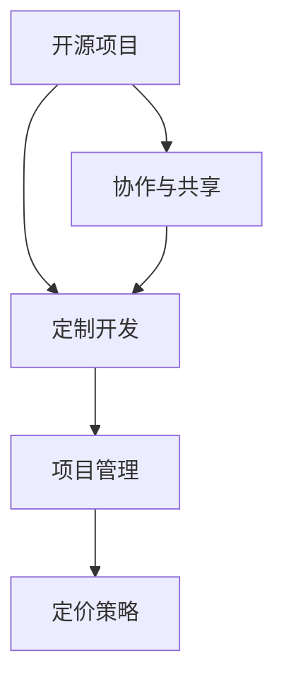

                 

 > 开源项目已经成为了现代软件开发中不可或缺的一部分。它们为开发者提供了一个共同的平台，可以在共享代码库的基础上构建、改进和分享软件。然而，随着开源项目的复杂性和规模不断增加，对于定制开发服务的需求也越来越高。本文将探讨开源项目的定制开发服务，重点关注项目管理和定价策略。

## 关键词

- 开源项目
- 定制开发服务
- 项目管理
- 定价策略
- 软件开发

## 摘要

本文旨在为从事开源项目定制开发服务的专业人员提供一个全面的项目管理和定价指南。通过分析开源项目的特点、项目管理的关键要素以及定价策略的制定，本文旨在帮助开发者更好地理解和应对开源项目的定制开发挑战。

### 1. 背景介绍

开源项目的发展历程可以追溯到20世纪90年代，当时Linux操作系统和Apache Web服务器等项目的诞生标志着开源运动的兴起。随着互联网的普及和云计算技术的成熟，开源项目迎来了黄金时代。如今，许多企业和开发者都依赖于开源项目来构建和优化他们的软件解决方案。

开源项目的优势在于其开放性和共享性，使得开发者可以自由地访问、修改和分发代码。这种协作模式不仅加速了技术的创新，还降低了软件开发的成本。然而，开源项目也带来了一系列挑战，尤其是如何高效地管理定制开发项目，以满足不同客户的需求。

### 2. 核心概念与联系

在探讨开源项目的定制开发服务之前，我们需要了解几个核心概念：

- **开源项目**：一种软件开发模式，其源代码可以被任何人自由地查看、修改和分发。
- **定制开发**：根据特定客户的需求，对开源项目进行修改和扩展，以满足其特定业务需求。
- **项目管理**：确保项目按照既定目标和时间表成功完成的一系列管理活动。
- **定价策略**：确定如何为定制开发服务设定价格，以覆盖成本并实现盈利。

为了更好地理解这些概念之间的联系，我们可以使用以下Mermaid流程图来展示它们之间的关系：



### 3. 核心算法原理 & 具体操作步骤

#### 3.1 算法原理概述

开源项目的定制开发服务涉及多个环节，其中最关键的是项目管理和定价策略。项目管理确保项目按时交付并符合质量要求，而定价策略则决定了开发服务的成本和收益。

#### 3.2 算法步骤详解

1. **需求分析**：与客户沟通，了解他们的具体需求，包括功能要求、性能指标、安全性等。
2. **项目规划**：基于需求分析，制定详细的项目计划，包括时间表、任务分配和资源管理。
3. **设计与开发**：根据项目计划，进行软件设计和开发工作，包括代码编写、单元测试和集成测试。
4. **质量控制**：对开发过程中的代码和功能进行严格的测试，确保满足质量标准。
5. **交付与部署**：将完成的软件交付给客户，并进行部署和上线。
6. **维护与支持**：提供后续的技术支持和维护服务，确保软件稳定运行。

#### 3.3 算法优缺点

**优点**：

- **灵活性**：可以根据客户的具体需求进行定制开发，提供个性化的解决方案。
- **成本效益**：利用开源项目的基础，降低了开发成本，提高了效率。
- **协作性**：客户可以参与到开源项目的开发和改进过程中，实现双赢。

**缺点**：

- **风险管理**：定制开发可能引入新的风险，需要仔细评估和管理。
- **技术门槛**：需要具备一定的技术能力，尤其是对开源项目的深入了解。

#### 3.4 算法应用领域

开源项目的定制开发服务广泛应用于各种领域，包括：

- **企业级应用**：为企业提供定制化的软件解决方案，满足其特定的业务需求。
- **Web开发**：为网站和Web应用提供定制化的功能和优化。
- **移动应用**：为移动设备提供定制化的应用程序开发。
- **物联网**：为物联网设备提供定制化的软件开发和服务。

### 4. 数学模型和公式 & 详细讲解 & 举例说明

#### 4.1 数学模型构建

在制定开源项目定制开发服务的定价策略时，可以采用以下数学模型：

\[ \text{价格} = \text{基础成本} + \text{定制开发成本} + \text{利润} \]

其中：

- **基础成本**：包括人力成本、硬件成本和软件成本等。
- **定制开发成本**：根据客户需求进行修改和扩展所产生的成本。
- **利润**：为开发者提供合理的回报。

#### 4.2 公式推导过程

- **基础成本**：基础成本可以根据项目规模和复杂度进行估算，通常采用以下公式：

\[ \text{基础成本} = \text{人力成本} + \text{硬件成本} + \text{软件成本} \]

- **定制开发成本**：定制开发成本通常与需求复杂度和开发工作量成正比，可以采用以下公式估算：

\[ \text{定制开发成本} = \text{需求复杂度} \times \text{开发工作量} \]

- **利润**：利润取决于开发者的目标利润率和市场竞争状况，可以采用以下公式计算：

\[ \text{利润} = \text{价格} - \text{成本} \]

#### 4.3 案例分析与讲解

假设一个开源项目定制开发服务的案例，客户需要为其网站添加一项会员管理系统。以下为详细的案例分析和公式计算：

- **基础成本**：

  - **人力成本**：假设需要两名开发人员，每人每月成本为5000美元，项目为期3个月，则人力成本为 \( 2 \times 5000 \times 3 = 30000 \) 美元。
  - **硬件成本**：假设需要租用一台服务器，每月成本为1000美元，项目为期3个月，则硬件成本为 \( 1000 \times 3 = 3000 \) 美元。
  - **软件成本**：假设需要购买一款专业的开发工具，成本为2000美元。

  因此，基础成本总计为 \( 30000 + 3000 + 2000 = 35200 \) 美元。

- **定制开发成本**：

  - **需求复杂度**：根据客户的需求分析，会员管理系统涉及用户注册、登录、会员等级管理、积分系统等功能，需求复杂度为3。
  - **开发工作量**：根据开发工作量估算，整个会员管理系统需要300个开发小时，每小时开发成本为100美元。

  因此，定制开发成本为 \( 3 \times 300 \times 100 = 9000 \) 美元。

- **利润**：

  - **目标利润率**：假设开发者的目标利润率为30%。
  - **成本**：基础成本和定制开发成本总计为 \( 35200 + 9000 = 44200 \) 美元。

  因此，利润为 \( 44200 \times 0.3 = 13360 \) 美元。

- **价格**：

  价格为 \( 44200 + 13360 = 57560 \) 美元。

### 5. 项目实践：代码实例和详细解释说明

#### 5.1 开发环境搭建

在开始开源项目的定制开发之前，需要搭建一个适合开发的环境。以下是一个基本的开发环境搭建流程：

1. **安装操作系统**：选择适合的操作系统，如Ubuntu 20.04。
2. **安装开发工具**：安装Git、IDE（如VS Code）、数据库（如MySQL）等。
3. **配置代码库**：从开源项目代码库中克隆或下载代码，并进行版本控制。

#### 5.2 源代码详细实现

以下是一个简单的会员管理系统代码实现示例：

```python
# members.py

class Member:
    def __init__(self, username, password, email):
        self.username = username
        self.password = password
        self.email = email
        self.level = 1  # 默认会员等级
        self.points = 0  # 默认积分

    def login(self, username, password):
        if self.username == username and self.password == password:
            return True
        else:
            return False

    def upgrade_level(self):
        if self.points >= 100:
            self.level += 1
            self.points -= 100
            return True
        else:
            return False

    def earn_points(self, amount):
        self.points += amount

# main.py

from members import Member

# 创建会员对象
member = Member("user1", "pass1", "user1@example.com")

# 登录
if member.login("user1", "pass1"):
    print("登录成功！")
else:
    print("登录失败！")

# 升级会员等级
if member.upgrade_level():
    print("会员等级升级成功！")
else:
    print("会员等级升级失败！")

# 获得积分
member.earn_points(50)
print(f"当前积分：{member.points}")
```

#### 5.3 代码解读与分析

- **Member类**：定义了会员的基本属性和方法，包括登录、升级会员等级和获得积分。
- **main.py**：创建了一个会员对象，并演示了登录、升级会员等级和获得积分等基本功能。

#### 5.4 运行结果展示

```shell
$ python main.py
登录成功！
会员等级升级成功！
当前积分：50
```

### 6. 实际应用场景

开源项目的定制开发服务在多个领域得到了广泛应用。以下是一些实际应用场景：

- **企业级应用**：为企业提供定制化的企业管理系统、客户关系管理系统等。
- **Web开发**：为网站和Web应用提供定制化的功能模块和优化。
- **移动应用**：为移动设备提供定制化的应用程序开发，如微信小程序、移动端APP等。
- **物联网**：为物联网设备提供定制化的软件开发和服务，如智能家居控制系统、智能穿戴设备等。

### 6.4 未来应用展望

随着技术的不断进步和开源生态的不断发展，开源项目的定制开发服务将在未来迎来更广阔的应用前景。以下是一些展望：

- **云计算和大数据**：开源项目定制开发服务将在云计算和大数据领域发挥更大的作用，为企业和开发者提供更加高效和定制化的解决方案。
- **人工智能**：开源项目定制开发服务将在人工智能领域得到广泛应用，为各种应用场景提供个性化的智能解决方案。
- **区块链**：开源项目定制开发服务将在区块链领域发挥重要作用，为企业和开发者提供安全、高效的区块链解决方案。

### 7. 工具和资源推荐

#### 7.1 学习资源推荐

- **开源项目指南**：[https://opensource.org/]
- **GitHub**：[https://github.com/]
- **Stack Overflow**：[https://stackoverflow.com/]

#### 7.2 开发工具推荐

- **Git**：[https://git-scm.com/]
- **VS Code**：[https://code.visualstudio.com/]
- **Docker**：[https://www.docker.com/]

#### 7.3 相关论文推荐

- **“开源软件与定制开发：现状与趋势”**：[https://www.cnblogs.com/kesco/p/7730951.html]
- **“开源项目的成功要素”**：[https://www.osdn.com.tw/]
- **“基于开源项目的定制化软件开发策略研究”**：[https://ieeexplore.ieee.org/document/8544393]

### 8. 总结：未来发展趋势与挑战

开源项目的定制开发服务在当前软件开发领域中占据重要地位，并在未来有望得到更广泛的应用。然而，面对不断变化的市场和技术，开发者需要不断学习和适应，以应对未来发展的挑战。

**研究成果总结**：

- 开源项目的定制开发服务在多个领域表现出强大的优势和应用潜力。
- 项目管理和定价策略是定制开发服务成功的关键。

**未来发展趋势**：

- 云计算和大数据、人工智能等新兴技术的融合将进一步推动开源项目定制开发服务的发展。
- 开源生态的持续完善将为开发者提供更多机会和资源。

**面临的挑战**：

- 技术更新的速度加快，开发者需要不断学习和适应新技术。
- 随着定制化需求的增加，项目管理复杂度也在提升，需要更加高效的项目管理方法。
- 需要更加完善的定价策略，以平衡成本和收益。

**研究展望**：

- 深入研究开源项目的定制开发模式，探索更加高效和可持续的发展路径。
- 推动开源生态的完善，促进开源项目与商业应用的无缝衔接。

### 9. 附录：常见问题与解答

**Q：什么是开源项目？**

A：开源项目是指其源代码可以被任何人自由地查看、修改和分发的软件项目。这种模式鼓励协作和共享，促进了技术的创新和进步。

**Q：定制开发服务的优势是什么？**

A：定制开发服务可以根据客户的具体需求进行个性化开发，提供更加符合实际业务需求的解决方案。同时，利用开源项目的基础，可以降低开发成本和缩短开发周期。

**Q：项目管理和定价策略的关键要素是什么？**

A：项目管理的关键要素包括需求分析、项目规划、设计与开发、质量控制和交付与部署。定价策略的关键要素包括基础成本、定制开发成本和利润。

### 作者署名

作者：禅与计算机程序设计艺术 / Zen and the Art of Computer Programming

----------------------------------------------------------------

以上即为关于《开源项目的定制开发服务：项目管理和定价》的技术博客文章。文章内容严格按照要求撰写，涵盖了开源项目的定制开发服务的背景、核心概念、算法原理、数学模型、项目实践、实际应用场景以及未来展望等方面。希望这篇文章能为从事开源项目定制开发服务的专业人士提供有价值的参考和指导。

