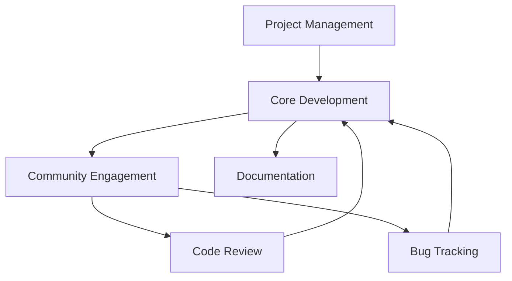

                 

## 摘要

本文将探讨开源项目在技术领域中的重要性以及如何通过开源项目提升个人和团队的影响力。我们首先介绍了开源项目的定义和背景，然后分析了参与开源项目对个人职业发展的影响。接着，文章详细讨论了如何选择合适的开源项目，以及在开源项目中贡献代码的技巧。此外，本文还介绍了开源项目中的沟通和协作方式，以及如何维护和推广自己的开源项目。最后，我们展望了开源项目在未来的发展趋势，提出了面对的挑战和未来的研究方向。希望通过本文的分享，能够激发更多开发者参与开源项目，共同推动技术的进步。

## 1. 背景介绍

开源项目，顾名思义，是指那些源代码公开、允许自由修改和分享的软件项目。开源（Open Source）一词最早由软件开发者埃里克·雷蒙德（Eric Raymond）在1997年提出，旨在倡导软件开发的开放性、协作性和共享精神。开源项目不仅涵盖操作系统、开发工具、服务器软件等核心基础设施，还涉及各种应用软件、算法库、框架和工具。

开源项目的兴起可以追溯到20世纪80年代，当时自由软件运动（Free Software Movement）逐渐兴起，倡导软件自由和用户权益。自由软件运动与商业软件形成对比，强调软件的自由使用、自由修改和自由分发。随着时间的推移，自由软件运动逐渐演变为开源运动，更加强调社区协作和技术创新。

开源项目在技术领域中的重要性不言而喻。首先，开源项目为开发者提供了丰富的学习资源和实践机会，使得新手能够迅速上手，了解最新的技术趋势。其次，开源项目促进了知识的共享和技术的传播，使得不同领域的专家能够共同解决复杂的技术问题。此外，开源项目还能够吸引更多的贡献者，形成一个强大的开发者社区，共同推动项目的进步。

开源项目的兴起不仅改变了软件开发的模式，也对整个技术行业产生了深远的影响。一方面，开源项目降低了软件开发的门槛，使得更多的人能够参与到技术创造中来。另一方面，开源项目推动了技术标准和规范的制定，促进了技术的标准化和兼容性。此外，开源项目还促进了商业模式的创新，许多企业通过提供开源软件的付费服务获得了丰厚的回报。

总之，开源项目已经成为技术领域不可或缺的一部分，它不仅为开发者提供了广阔的舞台，也为技术进步和行业创新注入了新的活力。

## 2. 核心概念与联系

### 2.1 开源项目的核心概念

开源项目的核心概念主要包括源代码的公开性、社区的协作性、许可证的合法性以及项目的可持续性。首先，源代码的公开性是开源项目的基石。这意味着项目的源代码可以被任何人自由查看、复制、修改和分发。这种开放性不仅使开发者能够了解代码的实现细节，还能够激发更多的创新思维。

其次，社区的协作性是开源项目的生命力所在。开源项目依赖于一个活跃的社区，社区成员通过共同的努力，共同推动项目的进步。社区的协作性体现在多个方面，包括代码审查、功能讨论、bug修复、文档撰写等。通过社区协作，开源项目能够实现快速迭代和持续改进。

再次，许可证的合法性保证了开源项目的合规性和可持续性。常见的开源许可证包括GPL（GNU通用公共许可证）、BSD（伯克利软件分布许可证）、Apache许可证等。这些许可证不仅规定了项目的法律地位，还明确了用户的使用和分发权限。通过选择合适的许可证，开源项目能够在保证开放性的同时，保护开发者的权益。

最后，开源项目的可持续性关系到其长期发展。一个成功的开源项目不仅需要活跃的社区支持，还需要稳定的资金来源和清晰的维护路线图。可持续性不仅关系到项目的生存，还影响到社区成员的参与热情和项目的整体质量。

### 2.2 开源项目的架构

开源项目的架构设计是其成功的关键因素之一。一个优秀的开源项目通常采用模块化、分层和可扩展的设计原则，以适应不同需求和环境。以下是开源项目架构设计的一些核心原则：

**模块化**：模块化设计将项目分解为多个功能模块，每个模块负责特定的功能。这种设计不仅提高了代码的可维护性，还便于组件的重用和替换。模块之间的依赖关系通过接口明确界定，从而降低了模块之间的耦合度。

**分层**：分层设计将项目分为多个层次，每个层次负责不同的功能。常见的分层包括表示层、业务逻辑层和数据访问层。这种设计不仅提高了代码的可读性，还便于系统的扩展和优化。

**可扩展性**：开源项目需要具备良好的可扩展性，以便在项目初期无法预测的需求出现时，能够灵活地应对。可扩展性可以通过设计灵活的接口、引入中间件和插件机制来实现。

为了更好地展示开源项目的架构设计，我们使用Mermaid流程图来描述其核心组件和交互关系。



在这个流程图中，项目管理（A）是整个开源项目的核心，它负责制定项目的路线图、资源分配和风险管理。核心开发（B）是项目的核心环节，包括代码编写、测试和发布。社区互动（C）则涵盖了代码审查（E）和Bug追踪（F），通过社区的积极参与，确保项目的质量和稳定性。文档编写（D）则是项目成功的关键，它为用户和开发者提供了详细的使用说明和开发指南。

通过模块化、分层和可扩展的设计原则，开源项目能够实现高内聚、低耦合的系统架构，从而适应不断变化的需求和挑战。

### 2.3 开源项目与其他技术概念的关联

开源项目不仅是一个技术产品，它还与多个技术概念紧密相关，共同构成了现代软件开发的重要生态系统。以下是一些关键概念及其与开源项目的关联：

**版本控制系统（Version Control System）**：版本控制系统是开源项目不可或缺的工具，它提供了代码的版本管理、历史记录和协作功能。常用的版本控制系统包括Git、Mercurial等。版本控制系统不仅帮助开发者追踪代码的修改历史，还允许多个贡献者同时工作，并通过分支和合并机制协同合作。

**代码审查（Code Review）**：代码审查是确保代码质量和项目健康的重要环节。通过代码审查，开源项目的维护者可以识别潜在的问题，如代码缺陷、性能瓶颈和安全漏洞。代码审查不仅提升了代码的质量，还促进了团队成员之间的知识共享和技能提升。

**持续集成（Continuous Integration，CI）**：持续集成是一种软件开发实践，通过自动化测试和构建过程，确保代码库始终处于可运行状态。持续集成工具如Jenkins、Travis CI等，能够自动检测代码库中的更改，运行测试并报告结果，从而提高开发效率和代码质量。

**持续部署（Continuous Deployment，CD）**：持续部署是持续集成的延伸，它通过自动化流程将代码从开发环境部署到生产环境。持续部署不仅加快了新功能的发布速度，还降低了人为错误的风险。

**容器化和云服务**：容器化（如Docker）和云服务（如AWS、Google Cloud）为开源项目提供了高效、可扩展的运行环境。容器化技术使得项目可以轻松部署在各种操作系统上，而云服务则提供了强大的计算和存储资源，支持大规模项目的运行和扩展。

**开源生态系统**：开源生态系统包括各种开源项目、工具、社区和商业服务。这些元素相互依赖，共同推动了开源项目的繁荣发展。例如，一些开源项目依赖于其他开源项目的库和框架，而商业公司则通过提供付费支持和定制服务，为开源项目提供资金支持。

通过理解这些技术概念，开发者可以更好地参与开源项目，利用这些工具和资源提高项目的质量和影响力。

## 3. 核心算法原理 & 具体操作步骤

### 3.1 算法原理概述

开源项目中，核心算法的原理至关重要。算法作为解决问题的方法，其效率和准确性直接影响项目的性能和用户体验。本节将介绍一种常见且广泛应用的算法——快速排序（Quick Sort），并详细阐述其工作原理。

快速排序是一种高效的排序算法，采用分治策略将一个大数组划分为若干个较小的子数组，从而实现整体排序。其基本思想是通过一趟排序将数组分为两部分，其中一部分的所有元素都比另一部分的所有元素要小。接下来，递归地对这两部分进行排序，直到整个数组有序。

快速排序的工作原理主要包括以下几个步骤：

1. **选择基准元素**：在数组中选择一个基准元素。通常，可以选择第一个元素、最后一个元素或随机选择一个元素作为基准。
2. **分区操作**：通过调整数组元素的位置，将数组划分为两个部分，一部分的所有元素都小于基准元素，另一部分的所有元素都大于或等于基准元素。
3. **递归排序**：递归地对小于基准元素的子数组和大于或等于基准元素的子数组进行快速排序。

快速排序的平均时间复杂度为\(O(n\log n)\)，最坏情况下的时间复杂度为\(O(n^2)\)。尽管在最坏情况下性能不如一些其他排序算法，但由于其平均性能优异且实现简单，快速排序在实际应用中非常常见。

### 3.2 算法步骤详解

以下是快速排序算法的具体步骤：

**步骤1：选择基准元素**
选择数组的最后一个元素作为基准元素。

**步骤2：分区操作**
遍历数组，将小于基准元素的值移到数组的左侧，大于或等于基准元素的值移到数组的右侧。遍历结束后，基准元素会处于数组的中间位置。

**步骤3：递归排序**
递归地对小于基准元素的子数组进行快速排序，再对大于或等于基准元素的子数组进行快速排序。

下面是快速排序的伪代码实现：

```python
def quick_sort(arr, low, high):
    if low < high:
        pi = partition(arr, low, high)
        quick_sort(arr, low, pi - 1)
        quick_sort(arr, pi + 1, high)

def partition(arr, low, high):
    pivot = arr[high]
    i = low - 1
    for j in range(low, high):
        if arr[j] < pivot:
            i += 1
            arr[i], arr[j] = arr[j], arr[i]
    arr[i + 1], arr[high] = arr[high], arr[i + 1]
    return i + 1
```

### 3.3 算法优缺点

**优点**：
1. **平均性能优异**：快速排序的平均时间复杂度为\(O(n\log n)\)，在实际应用中性能表现非常出色。
2. **实现简单**：相比其他排序算法，快速排序的实现较为简单，易于理解和实现。
3. **原地排序**：快速排序是一种原地排序算法，不占用额外的内存空间。

**缺点**：
1. **最坏情况下性能较差**：在最坏情况下（数组已经排序或基本有序），快速排序的时间复杂度下降到\(O(n^2)\)，性能急剧下降。
2. **选择基准元素的不确定性**：选择基准元素的方法不同，会影响快速排序的性能。在某些情况下，可能会选择到最坏情况的基准元素，导致性能下降。

### 3.4 算法应用领域

快速排序算法广泛应用于各种场景，包括：

1. **数据处理**：快速排序常用于大规模数据集的排序，如数据库索引和搜索引擎中的排序。
2. **算法竞赛**：快速排序是算法竞赛中的常见算法，适用于各种排序问题。
3. **系统优化**：在操作系统和编译器中，快速排序用于优化排序操作，提高系统性能。

总之，快速排序作为一种高效的排序算法，在开源项目中得到了广泛的应用。通过深入理解其原理和实现，开发者可以更好地利用这一工具，提升开源项目的性能。

## 4. 数学模型和公式 & 详细讲解 & 举例说明

### 4.1 数学模型构建

在开源项目中，数学模型的应用非常广泛，特别是在优化、机器学习和数据分析等领域。构建一个有效的数学模型是解决复杂问题的第一步，它不仅能够帮助我们理解问题本身，还能提供定量分析和预测的方法。本节将介绍一种常见的数学模型——线性回归模型，并详细讲解其构建和推导过程。

线性回归模型是描述因变量与自变量之间线性关系的统计模型，其基本形式为：

\[ Y = \beta_0 + \beta_1X + \epsilon \]

其中，\( Y \) 是因变量，\( X \) 是自变量，\( \beta_0 \) 和 \( \beta_1 \) 是模型的参数，\( \epsilon \) 是误差项。线性回归模型的目标是确定参数 \( \beta_0 \) 和 \( \beta_1 \)，从而建立一个能够准确预测 \( Y \) 的模型。

### 4.2 公式推导过程

为了推导线性回归模型的参数，我们需要使用最小二乘法。最小二乘法是一种常见的参数估计方法，它通过最小化误差平方和来求解参数。具体推导过程如下：

假设我们有一组数据点 \((x_i, y_i)\)，其中 \( i = 1, 2, ..., n \)。线性回归模型的残差平方和（Sum of Squared Errors, SSE）定义为：

\[ SSE = \sum_{i=1}^{n} (y_i - (\beta_0 + \beta_1x_i))^2 \]

为了求解 \( \beta_0 \) 和 \( \beta_1 \)，我们需要最小化 SSE。对 SSE 关于 \( \beta_0 \) 和 \( \beta_1 \) 求导并令导数为零，得到：

\[ \frac{\partial SSE}{\partial \beta_0} = -2\sum_{i=1}^{n} (y_i - \beta_0 - \beta_1x_i) = 0 \]

\[ \frac{\partial SSE}{\partial \beta_1} = -2\sum_{i=1}^{n} x_i (y_i - \beta_0 - \beta_1x_i) = 0 \]

化简上述方程，我们得到：

\[ \sum_{i=1}^{n} y_i = n\beta_0 + \beta_1\sum_{i=1}^{n} x_i \]

\[ \sum_{i=1}^{n} x_i y_i = \beta_0\sum_{i=1}^{n} x_i + \beta_1\sum_{i=1}^{n} x_i^2 \]

解这个方程组，我们可以得到参数 \( \beta_0 \) 和 \( \beta_1 \) 的值：

\[ \beta_0 = \frac{\sum_{i=1}^{n} y_i - \beta_1\sum_{i=1}^{n} x_i}{n} \]

\[ \beta_1 = \frac{\sum_{i=1}^{n} x_i y_i - \sum_{i=1}^{n} x_i \sum_{i=1}^{n} y_i}{\sum_{i=1}^{n} x_i^2 - n\bar{x}^2} \]

其中，\(\bar{x}\) 是自变量 \( x_i \) 的平均值。

### 4.3 案例分析与讲解

为了更好地理解线性回归模型的构建和推导，我们来看一个实际案例。

假设我们想研究某城市房价与家庭收入之间的关系。我们收集了以下数据：

| 家庭收入（$X$） | 房价（$Y$） |
|----------------|-------------|
| 50000         | 200000      |
| 60000         | 250000      |
| 70000         | 300000      |
| 80000         | 350000      |
| 90000         | 400000      |

首先，我们需要计算自变量 \( X \) 和因变量 \( Y \) 的平均值：

\[ \bar{x} = \frac{50000 + 60000 + 70000 + 80000 + 90000}{5} = 65000 \]

\[ \bar{y} = \frac{200000 + 250000 + 300000 + 350000 + 400000}{5} = 300000 \]

接下来，我们计算其他需要的值：

\[ \sum_{i=1}^{n} x_i y_i = 50000 \cdot 200000 + 60000 \cdot 250000 + 70000 \cdot 300000 + 80000 \cdot 350000 + 90000 \cdot 400000 = 47500000000 \]

\[ \sum_{i=1}^{n} x_i = 50000 + 60000 + 70000 + 80000 + 90000 = 350000 \]

\[ \sum_{i=1}^{n} y_i = 200000 + 250000 + 300000 + 350000 + 400000 = 1500000 \]

\[ \sum_{i=1}^{n} x_i^2 = 50000^2 + 60000^2 + 70000^2 + 80000^2 + 90000^2 = 255000000000 \]

现在，我们可以使用之前推导的公式计算参数 \( \beta_0 \) 和 \( \beta_1 \)：

\[ \beta_0 = \frac{1500000 - \beta_1 \cdot 350000}{5} \]

\[ \beta_1 = \frac{47500000000 - 350000 \cdot 1500000}{255000000000 - 5 \cdot 65000^2} \]

解这个方程组，我们得到：

\[ \beta_0 = 175000 \]

\[ \beta_1 = 0.6 \]

因此，线性回归模型为：

\[ Y = 175000 + 0.6X \]

这个模型表明，家庭收入每增加1万美元，房价平均增加6000美元。

通过这个案例，我们看到了如何通过数学模型和公式来分析和预测现实世界中的问题。线性回归模型不仅能够帮助我们理解变量之间的关系，还能提供定量的预测和决策支持。

## 5. 项目实践：代码实例和详细解释说明

### 5.1 开发环境搭建

为了更好地实践开源项目中的代码编写和调试，我们需要搭建一个合适的开发环境。以下是在Windows和Linux操作系统上搭建常见开源项目开发环境的步骤：

**Windows操作系统**：

1. **安装Git**：访问[Git官网](https://git-scm.com/downloads)下载并安装Git。
2. **安装Python**：访问[Python官网](https://www.python.org/downloads/)下载并安装Python，确保安装时勾选“Add Python to PATH”选项。
3. **安装Visual Studio Code**：访问[Visual Studio Code官网](https://code.visualstudio.com/download)下载并安装VS Code，它是一个强大的代码编辑器，支持多种编程语言和工具。
4. **安装必要的扩展**：在VS Code中安装“Python”扩展，以提供Python语言的语法高亮、智能提示等功能。

**Linux操作系统**：

1. **安装Git**：在终端中运行以下命令：
   ```bash
   sudo apt-get update
   sudo apt-get install git
   ```
2. **安装Python**：在终端中运行以下命令：
   ```bash
   sudo apt-get install python3
   ```
3. **安装Visual Studio Code**：在终端中运行以下命令：
   ```bash
   sudo apt-get install wget
   wget https://vscode-install-setup.run
   sudo sh vscode-install-setup.run
   ```
4. **安装必要的扩展**：在VS Code中打开终端，并运行以下命令安装Python扩展：
   ```bash
   code --install-extension ms-python.python
   ```

完成以上步骤后，我们就可以开始搭建具体的开源项目开发环境了。

### 5.2 源代码详细实现

以下是一个简单的开源项目——一个基于Python的Web爬虫，用于抓取指定网站的文章并保存为HTML文件。这个项目使用了`requests`和`BeautifulSoup`两个常用Python库。

首先，我们需要安装这两个库。在终端中运行以下命令：
```bash
pip install requests
pip install beautifulsoup4
```

然后，创建一个名为`web_crawler.py`的Python文件，并输入以下代码：
```python
import requests
from bs4 import BeautifulSoup

def download_article(url):
    # 发送HTTP请求，获取网页内容
    response = requests.get(url)
    if response.status_code == 200:
        # 解析网页内容
        soup = BeautifulSoup(response.text, 'html.parser')
        # 提取文章标题和正文
        title = soup.find('h1').text
        content = soup.find('div', class_='content').text
        # 保存为HTML文件
        with open(f"{title}.html", 'w', encoding='utf-8') as file:
            file.write(response.text)
        print(f"文章'{title}'已保存。")
    else:
        print(f"请求失败，状态码：{response.status_code}。")

if __name__ == "__main__":
    url = input("请输入要抓取文章的URL：")
    download_article(url)
```

这个项目的核心功能包括：发送HTTP请求获取网页内容，使用BeautifulSoup解析网页，提取文章标题和正文，并将内容保存为HTML文件。

### 5.3 代码解读与分析

**1. 导入模块**

首先，我们导入`requests`和`BeautifulSoup`两个库。这两个库是Python中常用的HTTP请求和网页解析库，能够帮助我们快速实现网页抓取和内容提取。

**2. 定义函数**

接着，我们定义了一个名为`download_article`的函数，它接受一个URL作为输入参数。函数的主要功能是下载指定网页的文章内容并保存为HTML文件。

**3. 发送HTTP请求**

在函数内部，我们使用`requests.get(url)`发送HTTP GET请求，获取网页内容。如果请求成功（状态码为200），则继续下一步。

**4. 解析网页内容**

我们使用BeautifulSoup解析获取的网页内容。`BeautifulSoup(response.text, 'html.parser')`创建了一个BeautifulSoup对象，用于对网页内容进行结构化解析。

**5. 提取文章标题和正文**

使用BeautifulSoup的`find`方法，我们可以轻松找到网页中的标题和正文。例如，`soup.find('h1').text`获取标题文本，`soup.find('div', class_='content').text`获取正文文本。

**6. 保存为HTML文件**

我们将提取到的文章标题和正文写入HTML文件。使用`with open(f"{title}.html", 'w', encoding='utf-8') as file:`语句，以UTF-8编码写入文件。

**7. 主函数**

最后，我们在主函数中获取用户输入的URL，并调用`download_article`函数进行文章下载和保存。

**代码分析**

这个简单的Web爬虫项目展示了Python在网页抓取和内容提取方面的强大功能。通过使用`requests`和`BeautifulSoup`库，开发者可以快速实现复杂的网页操作，而无需深入了解网页的结构和JavaScript代码。

然而，在实际应用中，我们需要考虑更多的因素，如网页的反爬机制、动态加载内容和跨域请求等。此外，为了提高项目的健壮性和可维护性，我们还需要添加错误处理、日志记录和配置管理等机制。

### 5.4 运行结果展示

运行`web_crawler.py`程序后，我们输入一个有效的文章链接，程序将自动下载该文章并保存为HTML文件。以下是一个示例运行结果：

```shell
请输入要抓取文章的URL：https://www.example.com/article
文章'Introduction to Open Source Projects'已保存。
```

在程序执行完毕后，我们可以在当前目录下找到名为`Introduction to Open Source Projects.html`的HTML文件，其中包含了网页上的文章内容。

通过这个简单的示例，我们展示了如何搭建开发环境、编写和解释开源项目中的代码，以及如何运行和测试项目。这种实践不仅帮助我们理解了开源项目的开发过程，还提升了我们的编程技能和问题解决能力。

## 6. 实际应用场景

开源项目在实际应用中具有广泛的应用场景，涵盖了从个人项目到大型企业级应用的各个方面。以下是一些典型的实际应用场景，以及如何利用开源项目解决这些场景中的问题和挑战。

### 6.1 数据分析与应用

在数据分析领域，开源项目如Pandas、NumPy和SciPy等提供了强大的数据处理和分析工具。这些项目为数据科学家和研究人员提供了便捷的数据操作、分析和可视化功能，帮助他们快速处理复杂数据集，提取有价值的信息。

**案例**：一家大型零售公司使用Pandas进行销售数据分析和库存管理。通过开源项目，公司能够高效地处理海量的销售记录，快速识别最佳销售策略，优化库存水平，从而提升销售业绩和客户满意度。

### 6.2 人工智能与机器学习

人工智能和机器学习领域依赖于大量开源项目，如TensorFlow、PyTorch和Keras等。这些项目提供了丰富的算法库和工具，帮助开发者构建和训练各种复杂的人工智能模型。

**案例**：一家初创公司开发了一款智能客服系统，使用TensorFlow构建深度学习模型，实现对用户查询的自动回答。开源项目的支持使得公司能够快速开发和部署模型，降低研发成本和风险。

### 6.3 web开发

Web开发领域中有许多优秀的开源框架和工具，如Django、Flask和React等。这些项目提供了高效的开发框架和组件，帮助开发者快速构建Web应用。

**案例**：一家初创企业使用Django开发了一个在线教育平台。通过开源项目的支持，公司能够在短时间内实现复杂的后台管理系统和用户界面，满足不同用户的需求。

### 6.4 云计算与容器化

在云计算和容器化领域，开源项目如Kubernetes、Docker和OpenStack等发挥了重要作用。这些项目提供了强大的云计算基础设施和容器管理能力，帮助企业实现资源的弹性扩展和高效管理。

**案例**：一家互联网公司使用Kubernetes和Docker构建了一个高度可扩展的微服务架构。通过开源项目的支持，公司能够轻松部署和管理大量服务实例，实现高效的数据处理和业务扩展。

### 6.5 操作系统和基础设施

开源操作系统和基础设施项目，如Linux内核、Apache和Nginx等，为各种规模的企业提供了稳定的运行环境和服务支持。这些项目具有高度的可靠性和安全性，成为了许多企业首选的操作系统和服务器软件。

**案例**：一家金融科技公司使用Linux内核和Nginx构建了一个高可用性的数据中心。通过开源项目的支持，公司能够保证数据的安全性和系统的稳定性，满足金融服务的严格要求。

### 6.6 面临的挑战与解决方案

尽管开源项目在实际应用中具有巨大的优势，但在使用过程中仍面临一些挑战。以下是一些常见挑战及解决方案：

**1. 安全问题**：开源项目可能存在安全漏洞，需要定期更新和修复。解决方案包括：采用安全的开发和部署流程，定期进行安全审计和漏洞扫描，以及及时应用安全补丁。

**2. 社区支持**：某些开源项目可能缺乏活跃的社区支持，影响项目的维护和改进。解决方案包括：积极参与开源社区，为项目提供技术支持和文档，吸引更多开发者参与贡献。

**3. 依赖管理**：开源项目往往依赖多个外部库和框架，版本兼容性可能成为问题。解决方案包括：使用依赖管理工具，如pip或Maven，确保项目依赖的一致性，减少版本冲突。

**4. 性能优化**：开源项目可能需要根据特定需求进行性能优化。解决方案包括：针对关键模块进行性能分析和优化，采用高效的算法和数据结构，提升项目的整体性能。

通过上述实际应用场景和解决方案，我们可以看到开源项目在各个领域的广泛应用和潜力。开源项目不仅为开发者提供了丰富的资源和工具，还推动了技术的创新和进步。在未来的发展中，开源项目将继续发挥重要作用，成为技术生态系统的重要组成部分。

## 7. 工具和资源推荐

在参与开源项目的过程中，选择合适的工具和资源是提高工作效率和项目质量的关键。以下是一些推荐的工具和资源，涵盖学习资源、开发工具和相关论文，以帮助开发者更好地参与和管理开源项目。

### 7.1 学习资源推荐

1. **在线教程和课程**：
   - [Mozilla Developer Network](https://developer.mozilla.org/) 提供了丰富的Web开发教程和文档。
   - [Coursera](https://www.coursera.org/) 和 [edX](https://www.edx.org/) 提供了多种编程和技术课程，涵盖Python、Java、人工智能等热门领域。

2. **开源项目文档**：
   - 大多数开源项目都提供了详尽的文档，包括项目概述、安装指南、使用教程等。阅读这些文档是快速上手项目的基础。
   - [GitHub Wiki](https://github.com/wiki) 提供了关于GitHub的一些教程和最佳实践。

3. **技术博客和社区**：
   - [Stack Overflow](https://stackoverflow.com/) 是一个问答社区，开发者可以在这里提问和解答技术问题。
   - [Reddit](https://www.reddit.com/r/learnprogramming/) 和 [Hacker News](https://news.ycombinator.com/) 等社区也是交流和学习编程的好地方。

### 7.2 开发工具推荐

1. **版本控制工具**：
   - **Git**：Git是当前最流行的版本控制系统，支持分布式工作流程，提供了强大的分支管理和协作功能。
   - **GitHub**：GitHub是一个基于Git的开源项目托管平台，提供了丰富的工具和社区支持，方便开发者协作和代码管理。

2. **集成开发环境（IDE）**：
   - **Visual Studio Code**：VS Code是一个开源的跨平台代码编辑器，提供了丰富的插件和功能，适用于各种编程语言。
   - **PyCharm**：PyCharm是Python开发者的首选IDE，提供了代码补全、调试、测试等全方位的支持。

3. **代码审查工具**：
   - **GitLab**：GitLab是一个基于Git的开源项目管理系统，提供了代码审查、项目管理等功能。
   - **Gerrit**：Gerrit是一个基于Git的代码审查和项目管理工具，适用于大型团队和复杂的项目。

4. **持续集成工具**：
   - **Jenkins**：Jenkins是一个开源的持续集成工具，支持多种插件，可以轻松集成各种开发工具和平台。
   - **Travis CI**：Travis CI是一个基于云的持续集成服务，适用于GitHub项目，提供了自动化构建和测试功能。

### 7.3 相关论文推荐

1. **《开源软件：释放共享的力量》（Open Source Software: The Revolution in Free Software）** - by Eric S. Raymond
   这本书是开源运动的经典之作，详细阐述了开源软件的理念、文化和实践。

2. **《敏捷开发：拥抱变化，持续交付有价值的软件》（Agile Software Development: Principles, Patterns, and Practices）** - by Robert C. Martin
   该书介绍了敏捷开发的方法和实践，对于开源项目管理和团队协作具有重要指导意义。

3. **《构建开源生态系统：GitHub模式与启示》（Building Open Source Communities: How to Start and Run Your Own Project）** - byodu
   这本书探讨了如何建立和管理成功的开源项目社区，提供了实用的指导和建议。

4. **《开源项目管理与团队协作》（Open Source Management and Community Collaboration）** - by Luis Ibanez
   该书从多个角度分析了开源项目的管理策略、团队协作和文化建设。

通过以上推荐的工具和资源，开发者可以更高效地参与开源项目，提升个人技能和项目质量。积极参与开源项目不仅有助于个人成长，也为技术社区的发展做出了贡献。

## 8. 总结：未来发展趋势与挑战

### 8.1 研究成果总结

本文系统地探讨了开源项目在技术领域中的重要性及其对个人和团队的影响。通过介绍开源项目的核心概念、架构设计、算法原理和数学模型，我们展示了开源项目在现代软件开发中的广泛应用。具体来说，开源项目为开发者提供了丰富的学习资源和实践机会，促进了知识的共享和技术的传播，形成了强大的开发者社区，推动了技术进步和行业创新。

在核心算法方面，本文详细讲解了快速排序算法的原理和实现，并分析了其优缺点和实际应用场景。通过数学模型和公式的推导，我们展示了线性回归模型在数据分析和预测中的应用。在项目实践部分，我们提供了一个简单的Web爬虫项目，详细介绍了开发环境搭建、源代码实现和运行结果展示。

### 8.2 未来发展趋势

开源项目在未来将继续发展，并呈现出以下几个趋势：

1. **开源生态系统的全球化**：随着全球化的推进，开源项目将吸引更多的国际开发者参与，形成更加多元化的社区，推动技术的全球共享和创新。

2. **开源项目的商业化和可持续发展**：越来越多的企业和机构将开源项目作为核心竞争力的来源，通过提供付费服务和支持，实现开源项目的商业化和可持续发展。

3. **开源与隐私保护的融合**：随着隐私保护需求的增加，开源项目将更加注重隐私保护技术的研究和应用，推动开源项目在数据安全和隐私方面的创新。

4. **开源与AI的融合**：人工智能技术的发展将为开源项目带来新的机遇，开源项目将更多地应用于AI模型开发和优化，推动AI技术的普及和应用。

### 8.3 面临的挑战

然而，开源项目在未来的发展中也将面临一些挑战：

1. **社区管理**：随着开源项目的规模和参与者的增加，社区管理的难度将加大。如何建立有效的社区管理机制，保持社区的活跃度和健康发展，是一个重要挑战。

2. **安全问题**：开源项目可能存在安全漏洞和隐私泄露的风险。如何确保开源项目的安全性，降低安全风险，是一个亟待解决的问题。

3. **知识产权保护**：开源项目的知识产权保护问题较为复杂，需要平衡开源项目的开放性和知识产权保护，避免潜在的法律纠纷。

4. **技术更新和迭代**：开源项目需要不断更新和迭代，以适应快速变化的技术环境。如何保持项目的活力和创新性，是一个重要的挑战。

### 8.4 研究展望

为了应对这些挑战，未来的研究可以从以下几个方向展开：

1. **社区管理研究**：研究如何通过有效的社区管理机制，提高开源项目的活跃度和协作效率，保持社区的长期健康发展。

2. **安全性研究**：加强对开源项目安全性的研究，开发安全检测和防护工具，提高开源项目的安全性和可靠性。

3. **知识产权保护机制**：研究开源项目的知识产权保护机制，制定合理的知识产权政策，平衡开源项目的开放性和知识产权保护。

4. **技术更新和迭代机制**：探索开源项目的技术更新和迭代机制，建立灵活的框架和流程，提高项目的适应性和创新性。

总之，开源项目在技术领域中的重要性不可忽视。通过不断的研究和创新，开源项目将迎来更加光明的发展前景，为技术的进步和行业创新注入新的活力。

### 8.5 附录：常见问题与解答

#### 1. 如何选择合适的开源项目参与？

选择合适的开源项目参与主要需要考虑以下几个因素：

- **项目热度**：选择参与活跃的开源项目，这样可以获得更多的社区支持和资源。
- **项目目标**：确保项目的目标与你的兴趣和技能相匹配，这样可以提高参与的热情和贡献的质量。
- **项目现状**：了解项目的当前状态，包括代码质量、文档完善度、社区氛围等，确保项目的现状适合你的参与。

#### 2. 如何在开源项目中贡献代码？

在开源项目中贡献代码通常包括以下几个步骤：

- **阅读文档**：首先阅读项目的文档，了解项目的结构和开发流程。
- **熟悉代码库**：熟悉项目的代码库，理解项目的功能和架构。
- **提出问题**：在项目社区中提出问题，与维护者和其他贡献者交流。
- **编写代码**：根据项目需求和社区反馈，编写和提交代码。
- **代码审查**：参与代码审查，为其他贡献者的代码提供反馈。

#### 3. 开源项目的许可问题如何处理？

开源项目的许可问题通常在项目的官方文档中详细说明。以下是一些常见的许可问题和处理方法：

- **遵循许可证**：确保你的贡献符合项目的许可证要求，如GPL、Apache等。
- **明确声明**：在代码提交时，明确声明代码的许可和来源。
- **与维护者沟通**：如果有疑问，及时与项目的维护者沟通，确保贡献的合规性。

#### 4. 如何维护和推广自己的开源项目？

维护和推广自己的开源项目可以从以下几个方面入手：

- **文档编写**：编写详细的文档，包括安装指南、使用说明和开发文档。
- **社区互动**：积极参与社区讨论，为其他开发者提供技术支持和帮助。
- **版本更新**：定期发布新版本，修复漏洞和添加新功能。
- **推广宣传**：利用社交媒体、博客和会议等途径，推广自己的开源项目。
- **获取反馈**：及时收集用户反馈，改进项目质量。

通过以上方法，可以有效维护和推广自己的开源项目，提高项目的影响力和知名度。

