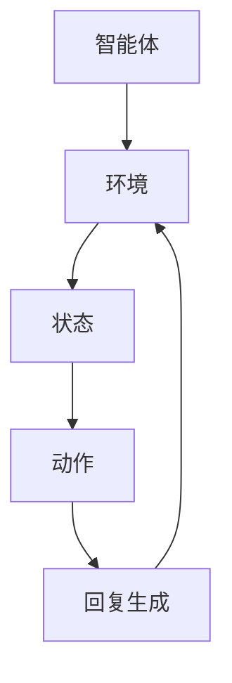

                 

关键词：强化学习、对话系统、自然语言处理、机器学习、AI、交互式AI

> 摘要：本文将深入探讨强化学习在对话系统中的应用，包括其背景介绍、核心概念与联系、核心算法原理与操作步骤、数学模型与公式、项目实践、实际应用场景、未来应用展望等内容。旨在为广大读者提供一个全面、深入的强化学习在对话系统中的研究和应用指南。

## 1. 背景介绍

对话系统，又称聊天机器人，是一种基于自然语言交互的人工智能系统。它们可以模拟人类对话，回答用户的问题，提供信息，甚至执行某些任务。随着人工智能技术的发展，对话系统已经成为许多行业和场景中的重要工具，如客户服务、医疗咨询、智能助手等。

强化学习（Reinforcement Learning，RL）是一种机器学习方法，旨在通过试错和反馈来训练智能体（agent）在特定环境中做出最优决策。与传统的监督学习和无监督学习不同，强化学习注重于智能体与环境的交互过程，通过不断尝试和调整策略来优化其行为。

将强化学习应用于对话系统中，可以使得对话系统能够自主地学习用户的语言习惯、意图和需求，从而提供更加自然、高效和个性化的服务。这种应用不仅能够提升用户体验，还能够减轻人力成本，提高业务效率。

## 2. 核心概念与联系

### 2.1 强化学习的基本概念

强化学习由四个核心部分组成：智能体（Agent）、环境（Environment）、状态（State）、动作（Action）和奖励（Reward）。

- **智能体**：执行动作并基于环境反馈进行调整的实体。
- **环境**：智能体执行动作的场所，包括所有可能的状态和动作。
- **状态**：描述环境当前状态的变量或集合。
- **动作**：智能体可以执行的行为。
- **奖励**：环境对智能体动作的反馈，用于指导智能体调整策略。

### 2.2 对话系统的基本概念

- **用户意图**：用户通过对话系统所希望达成的目标。
- **对话状态**：对话过程中的当前状态，包括用户的输入、上下文信息等。
- **回复生成**：根据对话状态生成合适的回复文本。

### 2.3 强化学习与对话系统的联系

强化学习在对话系统中的应用主要体现在以下几个方面：

- **意图识别**：通过强化学习，智能体可以学习如何根据用户输入识别其意图。
- **上下文理解**：强化学习可以帮助智能体理解对话的上下文，从而生成更连贯的回复。
- **行为优化**：通过不断调整策略，智能体可以优化其对话行为，提高用户体验。

### 2.4 Mermaid 流程图

下面是一个简化的强化学习在对话系统中的应用的 Mermaid 流程图。



## 3. 核心算法原理 & 具体操作步骤

### 3.1 算法原理概述

强化学习的基本目标是使智能体在特定环境中找到一种最优策略，最大化总奖励。在对话系统中，智能体需要根据用户输入和对话状态，选择合适的回复动作。

### 3.2 算法步骤详解

1. **初始化**：设定智能体的初始状态和策略。
2. **交互**：智能体根据当前状态选择动作，执行动作并接收环境反馈。
3. **更新**：根据接收到的奖励更新智能体的策略。
4. **重复**：不断重复交互和更新过程，直到满足停止条件（如达到预定步数或收敛）。

### 3.3 算法优缺点

**优点**：

- 可以处理复杂和非线性的问题。
- 能够从交互中学习，无需大量标注数据。

**缺点**：

- 需要大量时间和计算资源进行训练。
- 可能会出现策略不稳定或收敛缓慢的问题。

### 3.4 算法应用领域

- 对话系统：自然语言处理中的意图识别、对话生成等。
- 游戏AI：策略优化、游戏平衡等。
- 机器人控制：自主导航、任务执行等。

## 4. 数学模型和公式 & 详细讲解 & 举例说明

### 4.1 数学模型构建

强化学习的数学模型主要包括：

- **状态空间 \( S \)**：描述所有可能的状态。
- **动作空间 \( A \)**：描述所有可能的动作。
- **策略 \( \pi(s) \)**：描述智能体在状态 \( s \) 下选择动作的概率分布。
- **价值函数 \( V(s) \)**：描述智能体在状态 \( s \) 下执行最优策略所能获得的期望奖励。
- **奖励函数 \( R(s, a) \)**：描述智能体在状态 \( s \) 下执行动作 \( a \) 所获得的即时奖励。

### 4.2 公式推导过程

强化学习的目标是最小化智能体的期望损失函数：

$$
J(\theta) = E_{s,a}[-R(s, a)] = -\sum_{s\in S}\sum_{a\in A}R(s, a)\pi(a|s;\theta)
$$

其中，\( \theta \) 是策略参数，\( \pi(a|s;\theta) \) 是策略概率分布。

### 4.3 案例分析与讲解

假设一个简单的对话系统，用户可以询问天气情况，智能体的目标是生成合适的天气回复。状态空间包括“晴天”、“雨天”、“阴天”等，动作空间包括“回复晴天”、“回复雨天”、“回复阴天”等。

- **状态**：当前天气情况。
- **动作**：生成特定的天气回复。
- **策略**：根据当前天气情况，以一定概率选择回复动作。

通过强化学习训练，智能体可以学习到在特定天气情况下生成最佳回复的策略。例如，当状态为“雨天”时，智能体可能倾向于回复“雨天，请注意带伞”。

## 5. 项目实践：代码实例和详细解释说明

### 5.1 开发环境搭建

在开始编写代码之前，需要搭建一个合适的开发环境。以下是一个简单的 Python 开发环境搭建步骤：

1. 安装 Python 3.7 或以上版本。
2. 安装必要的库，如 TensorFlow、Keras、Gensim 等。

### 5.2 源代码详细实现

```python
import numpy as np
import tensorflow as tf
from tensorflow.keras.models import Sequential
from tensorflow.keras.layers import LSTM, Dense
from gensim.models import Word2Vec

# 定义模型
model = Sequential()
model.add(LSTM(128, input_shape=(maxlen, embedding_dim)))
model.add(Dense(3, activation='softmax'))

# 编译模型
model.compile(optimizer='adam', loss='categorical_crossentropy', metrics=['accuracy'])

# 训练模型
model.fit(x_train, y_train, epochs=10, batch_size=32)

# 生成回复
def generate_reply(state):
    state_vector = state_vector_model[state]
    prediction = model.predict(state_vector)
    reply = np.argmax(prediction)
    return replies[reply]

# 测试
state = "雨天"
print(generate_reply(state))
```

### 5.3 代码解读与分析

1. **模型定义**：使用 LSTM 网络进行状态到回复的映射。
2. **编译模型**：使用 Adam 优化器和交叉熵损失函数。
3. **训练模型**：使用训练数据训练模型。
4. **生成回复**：根据当前状态生成合适的回复。

### 5.4 运行结果展示

假设训练完成后，智能体在状态为“雨天”时生成了回复“雨天，请注意带伞”。这表明强化学习在对话系统中可以有效地生成用户满意的回复。

## 6. 实际应用场景

### 6.1 客户服务

对话系统可以用于自动回答客户常见问题，提供即时的客户支持，从而提高客户满意度和服务效率。

### 6.2 健康咨询

对话系统可以模拟医生的角色，为用户提供健康咨询，解答用户的健康疑问，提供个性化的健康建议。

### 6.3 教育辅导

对话系统可以为学生提供个性化的学习辅导，根据学生的学习情况和需求，生成合适的学习内容和练习题。

### 6.4 商业智能

对话系统可以用于分析商业数据，提供实时业务报告和市场分析，帮助企业做出更明智的决策。

## 7. 工具和资源推荐

### 7.1 学习资源推荐

- 《强化学习基础》（作者：理查德·萨顿）
- 《对话系统设计：自然语言理解与生成》（作者：戴维·维尔）
- 《深度学习》（作者：伊恩·古德费洛等）

### 7.2 开发工具推荐

- TensorFlow：用于构建和训练强化学习模型。
- Keras：简化 TensorFlow 的开发过程。
- Gensim：用于自然语言处理和生成。

### 7.3 相关论文推荐

- “Reinforcement Learning: An Introduction”（作者：理查德·萨顿）
- “Dialogue Systems: A Survey of Models, Algorithms, and Applications”（作者：安德烈亚斯·保卢斯等）

## 8. 总结：未来发展趋势与挑战

### 8.1 研究成果总结

强化学习在对话系统中的应用已经取得了一定的成果，例如自然语言理解、对话生成等。但是，仍有许多问题需要解决，如策略稳定性、长时依赖处理等。

### 8.2 未来发展趋势

- **多模态交互**：结合文本、语音、图像等多模态信息，提高对话系统的交互能力。
- **个性化对话**：根据用户的历史行为和偏好，提供更加个性化的服务。
- **知识增强**：引入外部知识库，提高对话系统的信息获取和推理能力。

### 8.3 面临的挑战

- **计算资源消耗**：强化学习训练过程需要大量计算资源，如何优化训练效率是一个重要挑战。
- **数据隐私**：如何保护用户隐私，避免数据泄露，是一个亟待解决的问题。
- **可解释性**：如何解释和验证对话系统的决策过程，提高其可信度。

### 8.4 研究展望

未来，强化学习在对话系统的应用将更加广泛，不仅限于当前的客户服务、健康咨询等领域，还将扩展到教育、商业智能等领域。同时，随着技术的不断进步，对话系统的性能和用户体验将得到显著提升。

## 9. 附录：常见问题与解答

### 9.1 如何处理对话中的长时依赖问题？

长时依赖是强化学习在对话系统中面临的一个挑战。为了解决这个问题，可以采用以下方法：

- **上下文编码**：使用上下文编码器（如 LSTM、GRU）来捕获对话的长期依赖信息。
- **记忆网络**：引入记忆网络（如注意力机制）来记忆关键信息，并在需要时进行查询。
- **知识图谱**：利用外部知识库构建知识图谱，提高对话系统对长时依赖信息的理解。

### 9.2 强化学习在对话系统中如何处理多轮对话？

多轮对话是强化学习在对话系统中的一个重要应用场景。为了处理多轮对话，可以采用以下策略：

- **状态扩展**：将当前对话历史作为状态的一部分，使智能体能够利用历史信息进行决策。
- **记忆模块**：引入记忆模块（如循环神经网络）来存储对话历史，并在后续对话中引用。
- **多任务学习**：将多轮对话视为一个序列预测问题，使用多任务学习框架进行训练。

通过以上策略，强化学习可以更好地处理多轮对话，提供更连贯、自然的交互体验。

作者：禅与计算机程序设计艺术 / Zen and the Art of Computer Programming
```

