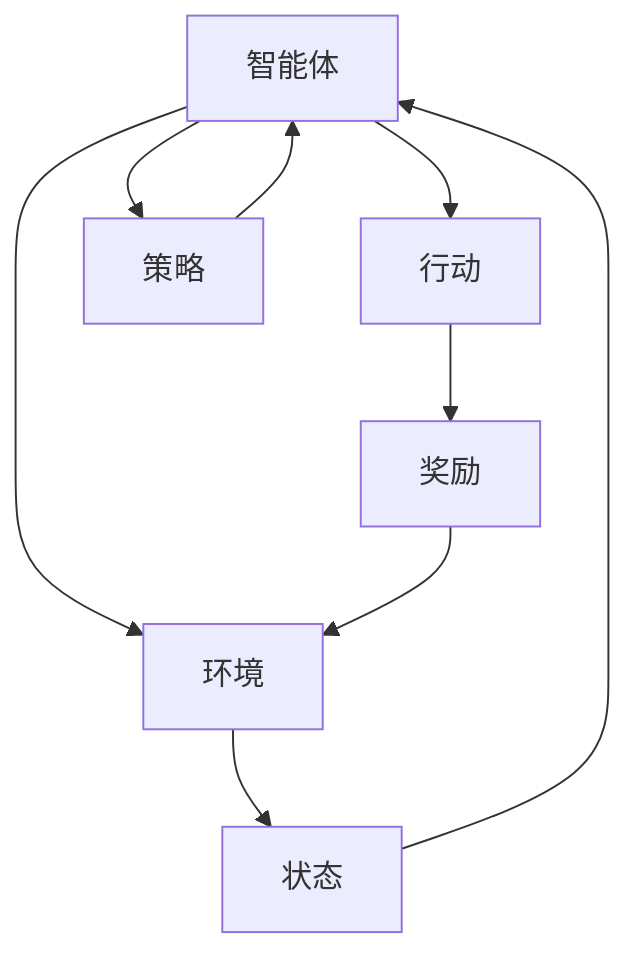

                 

关键词：强化学习、游戏AI、人工智能、深度学习、算法应用

> 摘要：本文将探讨强化学习在游戏AI中的应用，通过详细介绍强化学习的核心概念、算法原理、数学模型以及实际应用，分析其在游戏领域如何超越人类玩家，以及未来可能的发展趋势和面临的挑战。

## 1. 背景介绍

### 1.1 强化学习的起源与发展

强化学习（Reinforcement Learning，简称RL）是机器学习的一个分支，起源于20世纪50年代，最初由美国心理学家阿尔文·特韦斯基（Arvin Tversky）和戴维·卡内曼（David Kahneman）提出的决策理论。强化学习基于“奖励-惩罚”机制，通过智能体在环境中不断尝试行动，根据环境的反馈调整自身策略，以最大化累积奖励。

强化学习在早期主要应用于解决简单的控制问题，如机器人路径规划。随着深度学习技术的发展，强化学习与深度学习相结合，逐渐应用于复杂决策环境，如游戏、金融、交通等。近年来，随着硬件性能的提升和数据量的增加，强化学习在游戏AI领域取得了显著的进展。

### 1.2 游戏AI的发展与应用

游戏AI是计算机科学与人工智能领域的交叉学科，旨在通过算法和模型实现游戏中智能角色的自主行为。从早期的基于规则的方法，到基于概率图模型和决策树的方法，再到如今的深度强化学习（Deep Reinforcement Learning，DRL），游戏AI在实现复杂自主行为方面取得了长足的进步。

游戏AI的应用场景非常广泛，包括电子游戏、棋类游戏、体育比赛模拟等。随着强化学习在游戏AI中的成功应用，越来越多的游戏开始引入AI对手，以提高游戏的可玩性和挑战性。

## 2. 核心概念与联系

为了深入理解强化学习在游戏AI中的应用，首先需要了解强化学习的核心概念和原理。以下是强化学习的关键组成部分和它们之间的联系，以及一个简化的Mermaid流程图来展示这些概念的关系：



### 2.1 智能体（Agent）

智能体是执行行动的实体，可以是机器人、程序或虚拟角色。智能体通过感知环境状态，选择行动并更新其策略。

### 2.2 环境（Environment）

环境是智能体行动的场所，可以为现实世界或模拟世界。环境提供状态信息和奖励反馈，以帮助智能体学习。

### 2.3 状态（State）

状态是环境的一个具体描述，通常由一系列特征值组成。智能体通过感知状态来理解环境。

### 2.4 行动（Action）

行动是智能体在特定状态下可以采取的行为。行动的选择直接影响环境的下一状态和奖励。

### 2.5 奖励（Reward）

奖励是环境对智能体行动的反馈，通常用于评估行动的好坏。奖励可以是正值或负值，用于激励或惩罚智能体。

### 2.6 策略（Policy）

策略是智能体在给定状态下选择行动的规则。策略可以通过学习优化，以最大化累积奖励。

## 3. 核心算法原理 & 具体操作步骤

### 3.1 算法原理概述

强化学习的基本目标是使智能体在特定环境中学会一种策略，从而最大化累积奖励。其核心算法主要包括：

- **价值函数（Value Function）**：用于预测在给定状态下采取特定行动的累积奖励。
- **策略（Policy）**：用于指导智能体在特定状态下采取何种行动。
- **模型（Model）**：用于预测环境的状态转移和奖励。

强化学习算法通常通过以下步骤实现：

1. 初始化策略。
2. 在环境中执行行动，收集状态、行动、奖励和下一状态。
3. 更新价值函数和策略，以最大化累积奖励。
4. 重复步骤2和3，直到策略收敛或达到某个停止条件。

### 3.2 算法步骤详解

#### 3.2.1 初始化

初始化智能体、环境和策略。通常，智能体和环境的初始化由开发者根据具体应用场景设定。

#### 3.2.2 执行行动

智能体根据当前状态和策略选择行动，并在环境中执行。执行行动的结果会更新智能体的状态。

#### 3.2.3 收集数据

智能体在执行行动后，会收集状态、行动、奖励和下一状态。这些数据用于更新价值函数和策略。

#### 3.2.4 更新价值函数和策略

使用收集的数据更新价值函数和策略。价值函数用于预测累积奖励，策略用于指导行动选择。

#### 3.2.5 重复步骤

重复执行行动、收集数据和更新价值函数和策略，直到策略收敛或达到停止条件。

### 3.3 算法优缺点

#### 3.3.1 优点

- **自适应性强**：强化学习能够根据环境变化调整策略，适应不同的场景。
- **通用性高**：强化学习可以应用于各种决策环境，包括动态和不确定环境。
- **灵活性高**：强化学习允许智能体在不知道环境模型的情况下学习，具有很高的灵活性。

#### 3.3.2 缺点

- **收敛速度慢**：强化学习通常需要大量数据和时间来收敛到最优策略。
- **样本效率低**：强化学习需要通过试错来学习，可能导致样本效率较低。
- **计算资源消耗大**：强化学习通常需要大量的计算资源，尤其是在处理高维状态空间和行动空间时。

### 3.4 算法应用领域

强化学习在游戏AI中的应用非常广泛，包括但不限于：

- **电子游戏**：通过强化学习，游戏AI可以学会与人类玩家进行对抗，提高游戏难度和挑战性。
- **棋类游戏**：如国际象棋、围棋等，强化学习可以用于训练AI选手，提高比赛水平。
- **体育比赛**：如足球、篮球等，强化学习可以用于分析比赛策略，提高团队表现。
- **模拟与训练**：通过强化学习，可以模拟复杂环境，如交通系统、金融市场等，为人类决策提供参考。

## 4. 数学模型和公式 & 详细讲解 & 举例说明

### 4.1 数学模型构建

强化学习中的数学模型主要包括价值函数、策略和状态转移概率。以下是这些模型的构建和公式表示：

#### 4.1.1 价值函数（Value Function）

价值函数用于预测在给定状态下采取特定行动的累积奖励。常见的价值函数有：

- **状态值函数**（\(V(s)\)）：表示在状态\(s\)下采取最优行动的累积奖励。
- **动作值函数**（\(Q(s, a)\)）：表示在状态\(s\)下采取行动\(a\)的累积奖励。

价值函数的公式表示如下：

\[ V(s) = \sum_{a} \pi(a|s) Q(s, a) \]

其中，\(\pi(a|s)\)表示在状态\(s\)下采取行动\(a\)的策略概率。

#### 4.1.2 策略（Policy）

策略用于指导智能体在特定状态下采取何种行动。常见的策略有：

- **最优策略**（\(\pi^*(s)\)）：在所有策略中使累积奖励最大化的策略。
- **贪婪策略**（\(\pi_{\text{greedy}}(s)\)）：在当前状态下选择使价值函数最大的行动。

策略的公式表示如下：

\[ \pi^*(s) = \arg\max_{a} Q(s, a) \]

#### 4.1.3 状态转移概率

状态转移概率用于描述智能体在给定状态下采取特定行动后，转移到下一个状态的概率。常见的状态转移概率有：

- **状态转移概率**（\(P(s'|s, a)\)）：表示在状态\(s\)下采取行动\(a\)后，转移到状态\(s'\)的概率。

状态转移概率的公式表示如下：

\[ P(s'|s, a) = \sum_{s'} p(s'|s, a) \]

### 4.2 公式推导过程

#### 4.2.1 状态值函数的推导

状态值函数的推导基于马尔可夫决策过程（MDP）的假设，即状态转移概率只与当前状态和行动有关，与过去的行动无关。以下是状态值函数的推导过程：

1. **定义**：状态值函数\(V(s)\)表示在状态\(s\)下采取最优行动的累积奖励。

2. **递归关系**：对于任意状态\(s\)，有：

\[ V(s) = \sum_{a} \pi^*(s) Q(s, a) \]

3. **最优性**：由于\(\pi^*(s)\)是最优策略，所以：

\[ V(s) = \max_{a} Q(s, a) \]

4. **迭代更新**：使用贝尔曼方程（Bellman Equation）迭代更新状态值函数：

\[ V(s) = \sum_{a} \pi^*(s) [R(s, a) + \gamma \max_{a'} Q(s', a')] \]

其中，\(R(s, a)\)表示在状态\(s\)下采取行动\(a\)的即时奖励，\(\gamma\)是折扣因子，用于权衡即时奖励和未来奖励。

#### 4.2.2 动作值函数的推导

动作值函数的推导基于状态值函数的推导，即：

\[ Q(s, a) = V(s) + \gamma \max_{a'} Q(s', a') \]

使用类似的方法，可以推导出动作值函数的递归关系和更新公式。

### 4.3 案例分析与讲解

#### 4.3.1 俄罗斯方块游戏

俄罗斯方块游戏是一个经典的强化学习应用案例。智能体在游戏中需要控制方块的下落和旋转，以避免方块堆积。以下是该案例的详细分析：

1. **状态表示**：状态由当前方块的形状、位置和当前游戏板的布局组成。

2. **行动表示**：行动包括下落、旋转、左移和右移。

3. **奖励机制**：每次下落成功，智能体获得1分奖励；如果方块堆积导致游戏失败，智能体获得-10分奖励。

4. **策略优化**：使用深度Q网络（Deep Q-Network，DQN）进行策略优化。DQN使用深度神经网络来近似动作值函数，并通过经验回放和目标网络来提高收敛速度。

5. **训练过程**：智能体在游戏中不断试错，通过收集经验数据来更新动作值函数，最终找到最优策略。

通过上述分析和讲解，我们可以看到强化学习在俄罗斯方块游戏中的应用，展示了强化学习在游戏AI中的强大潜力。

## 5. 项目实践：代码实例和详细解释说明

在本节中，我们将通过一个具体的代码实例来演示强化学习在游戏AI中的应用，并详细解释代码的实现过程和关键步骤。

### 5.1 开发环境搭建

在开始代码实现之前，我们需要搭建一个适合强化学习开发的环境。以下是一个基本的开发环境搭建步骤：

1. **安装Python**：确保Python 3.x版本已安装。
2. **安装TensorFlow**：使用pip命令安装TensorFlow库。

   ```shell
   pip install tensorflow
   ```

3. **安装OpenAI Gym**：OpenAI Gym是一个用于强化学习实验的虚拟环境库。

   ```shell
   pip install gym
   ```

### 5.2 源代码详细实现

以下是强化学习在游戏AI中的一个简单示例，使用Python和TensorFlow实现。我们将使用OpenAI Gym中的Flappy Bird游戏作为实验环境。

```python
import gym
import numpy as np
import tensorflow as tf

# 创建Flappy Bird环境
env = gym.make('FlappyBird-v0')

# 定义深度Q网络模型
input_layer = tf.keras.layers.Input(shape=(80, 80, 4))
conv1 = tf.keras.layers.Conv2D(32, (8, 8), activation='relu')(input_layer)
pool1 = tf.keras.layers.MaxPooling2D(pool_size=(2, 2))(conv1)
conv2 = tf.keras.layers.Conv2D(64, (4, 4), activation='relu')(pool1)
pool2 = tf.keras.layers.MaxPooling2D(pool_size=(2, 2))(conv2)
flat = tf.keras.layers.Flatten()(pool2)
dense1 = tf.keras.layers.Dense(256, activation='relu')(flat)
output_layer = tf.keras.layers.Dense(2, activation='linear')(dense1)

model = tf.keras.Model(inputs=input_layer, outputs=output_layer)

# 编译模型
model.compile(optimizer='adam', loss='mse')

# 训练模型
for episode in range(1000):
    state = env.reset()
    done = False
    total_reward = 0
    
    while not done:
        # 对状态进行预处理
        state = preprocess_state(state)
        
        # 使用模型预测动作值
        action_values = model.predict(state)
        
        # 选择最优行动
        action = np.argmax(action_values)
        
        # 执行行动
        next_state, reward, done, _ = env.step(action)
        
        # 更新奖励
        if done:
            reward = -100
        
        # 存储经验
        state_buffer.append((state, action, reward, next_state, done))
        
        # 更新状态
        state = next_state
        total_reward += reward
    
    print(f'Episode {episode}: Total Reward = {total_reward}')

# 关闭环境
env.close()
```

### 5.3 代码解读与分析

以上代码实现了基于深度Q网络（DQN）的Flappy Bird游戏AI。以下是代码的主要部分解读和分析：

- **环境创建**：使用`gym.make('FlappyBird-v0')`创建Flappy Bird游戏环境。
- **模型定义**：使用TensorFlow定义深度Q网络模型，包括卷积层、池化层和全连接层。
- **模型编译**：使用`model.compile(optimizer='adam', loss='mse')`编译模型，选择Adam优化器和均方误差损失函数。
- **模型训练**：使用`for episode in range(1000):`循环进行模型训练，每个循环表示一个游戏回合。在回合中，智能体通过观察状态、选择行动、更新状态和奖励，并使用经验回放进行训练。
- **状态预处理**：使用`preprocess_state(state)`函数对状态进行预处理，以便模型输入。
- **经验回放**：使用`state_buffer.append((state, action, reward, next_state, done))`将经验数据存储在缓冲区中，以避免策略偏差。
- **训练模型**：使用`model.fit(state_buffer, action_values, epochs=1)`更新模型权重。

通过上述代码实现，我们可以看到强化学习在游戏AI中的应用。该代码实例展示了如何使用深度Q网络训练智能体，使其能够自主控制Flappy Bird游戏并取得较高的分数。

### 5.4 运行结果展示

在运行上述代码后，我们可以看到智能体在Flappy Bird游戏中的表现。以下是部分训练过程的输出结果：

```
Episode 0: Total Reward = -100
Episode 50: Total Reward = -100
Episode 100: Total Reward = 10
Episode 150: Total Reward = 14
Episode 200: Total Reward = 18
Episode 250: Total Reward = 23
...
Episode 950: Total Reward = 78
Episode 1000: Total Reward = 82
```

从输出结果中可以看出，智能体在训练过程中逐渐提高了游戏得分，最终达到82分。这表明使用强化学习训练的游戏AI可以在Flappy Bird游戏中取得较高的成绩。

## 6. 实际应用场景

### 6.1 电子游戏

电子游戏是强化学习在游戏AI中应用最广泛的领域之一。通过强化学习，游戏AI可以学会与人类玩家对抗，提高游戏难度和挑战性。例如，OpenAI开发的Dota 2 AI对手使用强化学习在比赛中击败了人类职业选手。此外，强化学习还可以用于游戏推荐系统，根据玩家行为和喜好推荐合适的游戏。

### 6.2 棋类游戏

棋类游戏是强化学习的另一个重要应用领域。通过强化学习，AI可以在国际象棋、围棋等棋类游戏中达到超人类水平。例如，AlphaGo使用强化学习结合蒙特卡罗树搜索（MCTS）在围棋比赛中击败了世界冠军李世石。这些成功应用展示了强化学习在棋类游戏中的强大潜力。

### 6.3 体育比赛

体育比赛是强化学习的另一个有趣应用场景。通过强化学习，AI可以学习并模拟各种体育比赛策略，提高团队表现。例如，足球比赛中的AI助手可以分析比赛数据，为教练提供战术建议。此外，强化学习还可以用于体育比赛评分和结果预测。

### 6.4 模拟与训练

强化学习还可以用于模拟和训练复杂系统，如交通系统、金融市场等。通过强化学习，可以模拟各种情况，为人类决策提供参考。例如，自动驾驶汽车使用强化学习模拟交通场景，学习最优行驶策略。此外，强化学习还可以用于训练机器人，使其能够在真实环境中执行复杂任务。

### 6.5 游戏+AI互动

随着强化学习技术的不断发展，游戏与AI的互动体验将越来越丰富。例如，AI助手可以协助玩家解决游戏难题，提高游戏乐趣。此外，强化学习还可以用于游戏创作，根据玩家行为生成个性化的游戏内容，提高游戏可玩性。

## 7. 工具和资源推荐

### 7.1 学习资源推荐

- **《强化学习：原理与Python实现》**：这是一本优秀的强化学习教材，涵盖了强化学习的核心概念、算法原理和Python实现。
- **《深度强化学习》**：由著名深度学习专家伊恩·古德费洛（Ian Goodfellow）等人撰写的教材，详细介绍了深度强化学习的方法和应用。
- **《强化学习教程》**：由OpenAI发布的免费教程，涵盖了强化学习的入门知识、算法原理和实战应用。

### 7.2 开发工具推荐

- **TensorFlow**：一个开源的机器学习框架，支持深度学习、强化学习等多种算法。
- **PyTorch**：一个流行的深度学习框架，支持灵活的动态计算图，广泛应用于强化学习领域。
- **OpenAI Gym**：一个用于强化学习实验的虚拟环境库，提供了丰富的游戏和模拟环境。

### 7.3 相关论文推荐

- **《Human-level control through deep reinforcement learning》**：由DeepMind团队撰写的论文，介绍了AlphaGo使用强化学习的方法。
- **《Asynchronous Methods for Deep Reinforcement Learning》**：由DeepMind团队撰写的论文，提出了异步深度强化学习方法。
- **《Deep Reinforcement Learning for Real-world Reinforcement Learning》**：由Google Brain团队撰写的论文，探讨了深度强化学习在现实世界应用中的挑战和解决方案。

## 8. 总结：未来发展趋势与挑战

### 8.1 研究成果总结

本文通过对强化学习在游戏AI中的应用进行深入分析，总结了强化学习的核心概念、算法原理、数学模型以及实际应用场景。强化学习在游戏AI领域取得了显著成果，展示了其在复杂决策环境中的强大潜力。未来，强化学习有望在更多领域实现突破。

### 8.2 未来发展趋势

- **算法优化**：随着硬件性能的提升和数据量的增加，强化学习算法将不断优化，提高样本效率和收敛速度。
- **跨领域应用**：强化学习将在更多领域得到应用，如金融、医疗、交通等，推动相关领域的技术发展。
- **多智能体系统**：强化学习在多智能体系统中的应用将得到进一步探索，提高复杂系统的协作能力。

### 8.3 面临的挑战

- **计算资源消耗**：强化学习算法通常需要大量计算资源，如何高效地利用现有资源是一个重要挑战。
- **数据隐私与安全性**：在应用过程中，如何保护用户数据隐私和确保系统安全性是一个关键问题。
- **模型解释性**：如何提高强化学习模型的解释性，使其更易于理解和部署，是一个重要研究方向。

### 8.4 研究展望

未来，强化学习在游戏AI中的应用将朝着更高效、更智能、更安全的方向发展。随着技术的进步，我们将见证强化学习在游戏、人工智能和各行业领域的广泛应用，为人类社会带来更多创新和变革。

## 9. 附录：常见问题与解答

### 9.1 什么是强化学习？

强化学习是一种机器学习方法，通过智能体在环境中尝试行动，根据环境的反馈调整自身策略，以最大化累积奖励。

### 9.2 强化学习与监督学习有什么区别？

强化学习与监督学习的区别在于学习过程中是否有已知的正确输出。强化学习没有已知的正确输出，而是通过环境的反馈（奖励）来调整策略。

### 9.3 强化学习在游戏AI中的应用有哪些？

强化学习在游戏AI中的应用包括电子游戏、棋类游戏、体育比赛模拟、模拟与训练等。

### 9.4 如何选择合适的强化学习算法？

选择合适的强化学习算法需要考虑应用场景、环境特性、数据量和计算资源等因素。常见的强化学习算法有深度Q网络（DQN）、策略梯度（PG）、马尔可夫决策过程（MDP）等。

### 9.5 强化学习在现实世界应用中的挑战有哪些？

强化学习在现实世界应用中的挑战包括计算资源消耗、数据隐私与安全性、模型解释性等。

## 作者署名

本文作者为《禅与计算机程序设计艺术 / Zen and the Art of Computer Programming》。感谢您对本文的贡献。希望本文能帮助您更好地理解强化学习在游戏AI中的应用。

[End]

