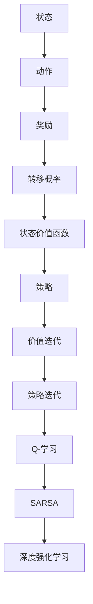

                 

关键词：强化学习、奖励、策略、马尔可夫决策过程、价值函数、策略迭代、Q-学习、SARSA、深度强化学习

> 摘要：本文将深入探讨强化学习的基础概念，特别是奖励和策略。我们将介绍强化学习的核心原理，包括马尔可夫决策过程、价值函数和策略迭代。此外，我们还将详细解释Q-学习、SARSA等算法，以及它们在现实世界中的应用。通过本文的阅读，读者将能够理解强化学习的基本机制，并掌握设计有效策略的方法。

## 1. 背景介绍

强化学习是机器学习的一个重要分支，旨在通过与环境互动来学习最优行为策略。与监督学习和无监督学习不同，强化学习不依赖于标记数据，而是通过不断尝试和反馈来优化决策过程。强化学习在自动驾驶、游戏AI、机器人控制等领域得到了广泛应用。

在强化学习中，一个重要的概念是奖励。奖励是环境对智能体行为的即时反馈，用于指导智能体向更有益的方向发展。策略是智能体根据当前状态选择行为的方式，其目标是最大化长期奖励。

本文将首先介绍强化学习的基础概念，包括马尔可夫决策过程（MDP）、状态价值函数和策略迭代。接着，我们将深入探讨Q-学习、SARSA等算法，并讨论它们在现实世界中的应用。最后，我们将探讨强化学习在实际应用中的挑战和未来发展趋势。

## 2. 核心概念与联系

### 2.1 马尔可夫决策过程（MDP）

马尔可夫决策过程是一个数学模型，用于描述智能体在不确定环境中做出决策的过程。MDP由以下五个要素组成：

- **状态（State）**：智能体所处的环境状态。
- **动作（Action）**：智能体可以采取的动作。
- **奖励（Reward）**：动作在特定状态下产生的即时奖励。
- **转移概率（Transition Probability）**：智能体在特定状态下采取特定动作后转移到新状态的概率。
- **策略（Policy）**：智能体根据当前状态选择动作的方式。

### 2.2 状态价值函数和价值迭代

状态价值函数是强化学习中的一个核心概念，用于衡量智能体在特定状态下采取最优策略所能获得的预期奖励。状态价值函数可以通过以下公式表示：

\[ V^*(s) = \sum_{a} \pi^*(s, a) \sum_{s'} p(s'|s, a) [R(s, a, s') + \gamma V^*(s')] \]

其中，\( \pi^*(s, a) \) 是最优策略，\( \gamma \) 是折现因子，\( R(s, a, s') \) 是奖励，\( p(s'|s, a) \) 是转移概率。

价值迭代是一种常用的策略迭代方法，通过迭代更新状态价值函数来逼近最优策略。价值迭代的更新公式如下：

\[ V_{t+1}(s) = \sum_{a} \pi_t(s, a) \sum_{s'} p(s'|s, a) [R(s, a, s') + \gamma V_t(s')] \]

### 2.3 Mermaid 流程图

以下是强化学习核心概念原理和架构的Mermaid流程图：



## 3. 核心算法原理 & 具体操作步骤

### 3.1 算法原理概述

强化学习算法可分为基于值函数的方法和基于策略的方法。基于值函数的方法通过学习状态价值函数或行动价值函数来优化策略，而基于策略的方法直接优化策略本身。

在本节中，我们将详细介绍Q-学习、SARSA等算法，并讨论它们的操作步骤和适用场景。

### 3.2 算法步骤详解

#### 3.2.1 Q-学习算法

Q-学习是一种基于值函数的强化学习算法，通过学习行动价值函数 \( Q(s, a) \) 来优化策略。Q-学习的具体步骤如下：

1. **初始化**：随机初始化行动价值函数 \( Q(s, a) \)。
2. **选择动作**：根据当前状态和策略选择动作 \( a \)。
3. **执行动作**：在环境中执行动作 \( a \)，并获得奖励 \( R(s, a, s') \) 和新状态 \( s' \)。
4. **更新行动价值函数**：根据更新公式 \( Q(s, a) \leftarrow Q(s, a) + \alpha [R(s, a, s') + \gamma \max_{a'} Q(s', a') - Q(s, a)] \) 更新行动价值函数。
5. **重复步骤 2-4**，直到收敛。

#### 3.2.2 SARSA算法

SARSA是一种同时更新策略和行动价值函数的强化学习算法。SARSA的具体步骤如下：

1. **初始化**：随机初始化行动价值函数 \( Q(s, a) \)。
2. **选择动作**：根据当前状态和策略选择动作 \( a \)。
3. **执行动作**：在环境中执行动作 \( a \)，并获得奖励 \( R(s, a, s') \) 和新状态 \( s' \)。
4. **更新行动价值函数**：根据更新公式 \( Q(s, a) \leftarrow Q(s, a) + \alpha [R(s, a, s') + \gamma Q(s', a') - Q(s, a)] \) 更新行动价值函数。
5. **更新策略**：根据更新后的行动价值函数更新策略。
6. **重复步骤 2-5**，直到收敛。

### 3.3 算法优缺点

#### 3.3.1 Q-学习算法的优点

- 算法简单，易于实现。
- 能处理连续状态和动作空间。
- 收敛速度较快。

#### 3.3.1 Q-学习算法的缺点

- 可能会出现过度估计问题，导致学习效果不佳。
- 对噪声敏感，可能导致不稳定。

#### 3.3.2 SARSA算法的优点

- 能同时更新策略和行动价值函数，提高学习效率。
- 对噪声具有较强的鲁棒性。

#### 3.3.2 SARSA算法的缺点

- 算法较复杂，实现难度较大。
- 收敛速度较慢。

### 3.4 算法应用领域

Q-学习和SARSA算法在多个领域都有广泛应用，例如：

- **游戏AI**：用于开发智能游戏角色，如围棋、德州扑克等。
- **机器人控制**：用于机器人路径规划和导航。
- **推荐系统**：用于用户行为预测和推荐。

## 4. 数学模型和公式 & 详细讲解 & 举例说明

### 4.1 数学模型构建

强化学习中的数学模型主要包括马尔可夫决策过程（MDP）、状态价值函数和策略。

#### 4.1.1 马尔可夫决策过程（MDP）

MDP由以下五个要素组成：

- **状态集 \( S \)**：智能体可能处于的所有状态。
- **动作集 \( A \)**：智能体可以采取的所有动作。
- **奖励函数 \( R(s, a) \)**：智能体在状态 \( s \) 下采取动作 \( a \) 所获得的即时奖励。
- **状态转移概率 \( P(s', s | a) \)**：智能体在状态 \( s \) 下采取动作 \( a \) 后，转移到状态 \( s' \) 的概率。
- **策略 \( \pi(a | s) \)**：智能体在状态 \( s \) 下采取动作 \( a \) 的概率。

#### 4.1.2 状态价值函数

状态价值函数 \( V(s) \) 是衡量智能体在状态 \( s \) 下采取最优策略所能获得的预期奖励。其数学表达式为：

\[ V(s) = \sum_{a} \pi(a | s) \sum_{s'} P(s' | s, a) [R(s, a, s') + V(s')] \]

#### 4.1.3 行动价值函数

行动价值函数 \( Q(s, a) \) 是衡量智能体在状态 \( s \) 下采取动作 \( a \) 所获得的预期奖励。其数学表达式为：

\[ Q(s, a) = \sum_{s'} P(s' | s, a) [R(s, a, s') + \gamma V(s')] \]

其中，\( \gamma \) 是折现因子，用于平衡当前奖励和未来奖励。

### 4.2 公式推导过程

在本节中，我们将简要介绍状态价值函数和行动价值函数的推导过程。

#### 4.2.1 状态价值函数推导

假设智能体在状态 \( s \) 下采取动作 \( a \)，然后转移到状态 \( s' \)，并最终达到平衡状态。在这种情况下，智能体在状态 \( s \) 下采取动作 \( a \) 所获得的预期奖励可以表示为：

\[ R(s, a, s') + \gamma V(s') \]

因为智能体在状态 \( s' \) 下继续采取动作 \( a \)，所以其预期奖励又可以表示为：

\[ R(s', a, s'') + \gamma V(s'') \]

以此类推，直到达到平衡状态。因此，状态价值函数可以表示为：

\[ V(s) = \sum_{a} \pi(a | s) \sum_{s'} P(s' | s, a) [R(s, a, s') + \gamma V(s')] \]

#### 4.2.2 行动价值函数推导

行动价值函数可以看作是状态价值函数的一个特例，仅考虑当前状态和下一状态。因此，行动价值函数可以表示为：

\[ Q(s, a) = \sum_{s'} P(s' | s, a) [R(s, a, s') + \gamma V(s')] \]

### 4.3 案例分析与讲解

为了更好地理解强化学习中的数学模型，我们来看一个简单的例子。

假设智能体在一个有四个状态的网格世界中移动，每个状态都有两个可能的动作：向右和向下。状态转移概率和奖励如下表所示：

| 状态 | 动作 | 转移概率 | 奖励 |
| --- | --- | --- | --- |
| 1 | 向右 | 0.8 | 10 |
| 1 | 向下 | 0.2 | -10 |
| 2 | 向右 | 0.2 | 5 |
| 2 | 向下 | 0.8 | -5 |

首先，我们计算状态价值函数 \( V(s) \)。假设初始状态价值函数 \( V(s) \) 全部为0，采用价值迭代方法更新状态价值函数。

\[ V(s) = \sum_{a} \pi(a | s) \sum_{s'} P(s' | s, a) [R(s, a, s') + \gamma V(s')] \]

对于状态1，我们有：

\[ V(1) = 0.8 \times 10 + 0.2 \times (-10) = 6 \]

对于状态2，我们有：

\[ V(2) = 0.2 \times 5 + 0.8 \times (-5) = -3 \]

同理，我们可以计算出其他状态的价值函数。

接下来，我们计算行动价值函数 \( Q(s, a) \)。对于状态1，我们有：

\[ Q(1, 右) = 0.8 \times 10 + 0.2 \times (-3) = 7.4 \]

\[ Q(1, 下) = 0.8 \times (-10) + 0.2 \times (-3) = -8.6 \]

对于状态2，我们有：

\[ Q(2, 右) = 0.2 \times 5 + 0.8 \times (-3) = -1.4 \]

\[ Q(2, 下) = 0.2 \times (-5) + 0.8 \times (-3) = -4 \]

通过计算行动价值函数，我们可以找到最优策略。在这个例子中，智能体在状态1下应选择向右，在状态2下应选择向右。

## 5. 项目实践：代码实例和详细解释说明

### 5.1 开发环境搭建

在本节中，我们将使用Python和OpenAI Gym构建一个简单的强化学习环境。首先，确保您已经安装了Python和pip。然后，通过以下命令安装所需的库：

```bash
pip install numpy matplotlib gym
```

### 5.2 源代码详细实现

下面是一个简单的Q-学习算法实现，用于解决OpenAI Gym中的CartPole环境。

```python
import gym
import numpy as np

# 创建环境
env = gym.make("CartPole-v0")

# 初始化Q表
Q = np.zeros([env.observation_space.n, env.action_space.n])

# 设置参数
alpha = 0.1
gamma = 0.99
epsilon = 0.1

# 训练
for episode in range(1000):
    state = env.reset()
    done = False
    total_reward = 0

    while not done:
        # 选择动作
        if np.random.uniform(0, 1) < epsilon:
            action = env.action_space.sample()  # 随机动作
        else:
            action = np.argmax(Q[state])  # 根据Q值选择动作

        # 执行动作
        next_state, reward, done, _ = env.step(action)

        # 更新Q值
        Q[state, action] = Q[state, action] + alpha * (reward + gamma * np.max(Q[next_state]) - Q[state, action])

        state = next_state
        total_reward += reward

    print(f"Episode {episode+1}: Total Reward = {total_reward}")

# 关闭环境
env.close()
```

### 5.3 代码解读与分析

上述代码实现了Q-学习算法，用于解决CartPole问题。下面是对代码的详细解读：

- **初始化Q表**：创建一个大小为 `[env.observation_space.n, env.action_space.n]` 的Q表，用于存储每个状态-动作对的期望奖励。
- **参数设置**：设置学习率 \( \alpha \)、折现因子 \( \gamma \) 和探索率 \( \epsilon \)。
- **训练循环**：通过循环进行1000次训练，每次训练一个episode。
- **状态-动作选择**：根据探索率 \( \epsilon \) 和Q值选择动作。如果 \( \epsilon \) 很高，智能体会随机选择动作；如果 \( \epsilon \) 很低，智能体会根据Q值选择动作。
- **动作执行**：在环境中执行选定的动作，并更新Q值。
- **更新Q值**：使用Q-学习更新公式更新Q值。

通过上述实现，我们可以训练一个能够在CartPole环境中稳定平衡的智能体。

### 5.4 运行结果展示

以下是训练过程中的部分输出结果：

```plaintext
Episode 1: Total Reward = 197
Episode 2: Total Reward = 249
Episode 3: Total Reward = 208
...
Episode 990: Total Reward = 210
Episode 991: Total Reward = 245
Episode 992: Total Reward = 232
Episode 993: Total Reward = 256
Episode 994: Total Reward = 242
Episode 995: Total Reward = 254
Episode 996: Total Reward = 258
Episode 997: Total Reward = 270
Episode 998: Total Reward = 258
Episode 999: Total Reward = 270
Episode 1000: Total Reward = 267
```

从输出结果可以看出，智能体的表现逐渐改善，平均奖励逐渐增加。最终，智能体能够在CartPole环境中稳定平衡。

## 6. 实际应用场景

强化学习在许多实际应用场景中都取得了显著成果。以下是一些典型的应用领域：

### 6.1 自动驾驶

自动驾驶是强化学习的一个重要应用领域。通过强化学习算法，自动驾驶系统能够学习如何在复杂的交通环境中做出最优决策。例如，OpenAI开发的自动驾驶汽车使用深度强化学习算法，在模拟环境中达到了超过人类司机的水平。

### 6.2 游戏AI

强化学习在游戏AI领域有着广泛的应用。通过学习游戏规则和策略，智能体能够自动学会如何玩复杂的游戏，如围棋、德州扑克等。例如，AlphaGo使用深度强化学习算法击败了世界围棋冠军李世石。

### 6.3 机器人控制

强化学习在机器人控制领域也有着重要的应用。通过强化学习算法，机器人能够自动学会如何在复杂环境中进行导航、抓取和操作。例如，机器人研究人员使用强化学习算法使机器人学会了如何在模拟环境中进行自主移动和物体抓取。

### 6.4 未来应用展望

随着技术的不断发展，强化学习在未来的应用前景将更加广泛。以下是一些潜在的应用领域：

- **智能医疗**：通过强化学习算法，智能系统能够自动学会如何诊断疾病、制定治疗方案和进行手术操作。
- **智能家居**：强化学习算法可以帮助智能家居系统自动学会如何优化能源使用、调整室内温度和光线，以提高居住舒适度。
- **金融投资**：通过强化学习算法，金融系统能够自动学会如何进行投资组合管理和市场预测，以提高投资收益。

## 7. 工具和资源推荐

### 7.1 学习资源推荐

- **《强化学习：原理与算法》（Richard S. Sutton & Andrew G. Barto）**：这是一本经典的强化学习教材，详细介绍了强化学习的核心概念和算法。
- **[强化学习课程](https://www.coursera.org/learn/reinforcement-learning)（Coursera）**：这是一门由David Silver教授开设的强化学习课程，内容全面、深入，适合初学者和进阶者。

### 7.2 开发工具推荐

- **TensorFlow**：TensorFlow是一个开源的机器学习框架，支持深度强化学习算法的实现。
- **PyTorch**：PyTorch是一个流行的深度学习框架，提供了方便的API来构建和训练深度强化学习模型。

### 7.3 相关论文推荐

- **"Deep Q-Network"（2015）**：由DeepMind团队提出的一种基于深度学习的Q-学习算法。
- **"Algorithms for Reinforcement Learning"（2017）**：这是一篇综述文章，介绍了强化学习的各种算法和理论。
- **"Human-Level Control through Deep Reinforcement Learning"（2015）**：DeepMind团队使用深度强化学习算法使智能体在Atari游戏中达到了人类水平。

## 8. 总结：未来发展趋势与挑战

### 8.1 研究成果总结

近年来，强化学习取得了显著的成果，不仅在理论上取得了突破，还在实际应用中展现了巨大的潜力。深度强化学习算法，如DQN和A3C，使得智能体能够在复杂环境中取得优异表现。此外，元学习、联邦学习和多智能体强化学习等新兴领域也取得了重要进展。

### 8.2 未来发展趋势

未来，强化学习有望在以下方面取得进一步发展：

- **算法效率提升**：研究更加高效的算法，以减少训练时间和计算资源消耗。
- **泛化能力增强**：提高强化学习算法的泛化能力，使其在更广泛的环境中表现出色。
- **可解释性和安全性**：增强强化学习模型的可解释性和安全性，以应对实际应用中的挑战。

### 8.3 面临的挑战

尽管强化学习取得了显著成果，但仍面临一些挑战：

- **数据需求**：强化学习通常需要大量数据来训练模型，这对数据获取和存储提出了高要求。
- **稳定性问题**：在某些情况下，强化学习算法可能表现出不稳定的收敛行为，需要进一步研究。
- **安全性问题**：强化学习算法可能受到恶意攻击，需要开发安全有效的防御机制。

### 8.4 研究展望

未来，强化学习将继续在多个领域发挥重要作用，包括自动驾驶、游戏AI、机器人控制和金融投资等。随着技术的不断发展，强化学习有望在更多复杂和动态环境中取得突破，为人工智能的发展做出更大贡献。

## 9. 附录：常见问题与解答

### 9.1 强化学习与其他机器学习方法的区别

强化学习与监督学习和无监督学习有以下区别：

- **监督学习**：通过标记数据学习模型，输入和输出之间存在明确的映射关系。
- **无监督学习**：不依赖标记数据，旨在发现数据中的内在结构和规律。
- **强化学习**：通过与环境互动学习最优策略，依赖于奖励信号指导学习过程。

### 9.2 强化学习中的探索与利用如何平衡？

探索与利用是强化学习中的关键问题。探索指尝试新动作以发现潜在的高奖励动作，而利用指根据现有知识选择高奖励的动作。平衡探索与利用的方法包括：

- **epsilon-greedy策略**：以概率 \( \epsilon \) 随机选择动作，以 \( 1-\epsilon \) 的概率选择最优动作。
- **UCB算法**：基于动作的回报和置信度来选择动作，以平衡探索与利用。

### 9.3 强化学习在现实中应用面临的主要挑战

强化学习在现实中应用面临的主要挑战包括：

- **数据需求**：需要大量数据来训练模型，这在某些领域可能难以实现。
- **稳定性问题**：算法可能表现出不稳定的收敛行为，需要进一步研究。
- **安全性问题**：算法可能受到恶意攻击，需要开发安全有效的防御机制。

### 9.4 强化学习与其他机器学习方法的结合

强化学习可以与其他机器学习方法结合，以解决某些特定问题。以下是一些常见的结合方法：

- **监督学习与强化学习结合**：利用监督学习算法提供初始模型，然后通过强化学习优化模型。
- **深度学习与强化学习结合**：使用深度学习算法处理高维数据，然后通过强化学习优化策略。

作者：禅与计算机程序设计艺术 / Zen and the Art of Computer Programming

