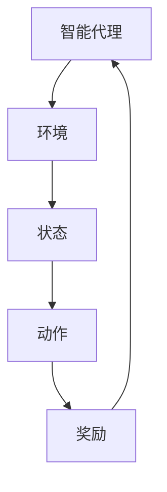

                 

关键词：强化学习，决策过程，智能代理，控制算法，Q-Learning，深度强化学习，实际应用。

> 摘要：本文深入探讨了强化学习作为人工智能领域的一个核心方法，在决策与控制中的应用。文章首先介绍了强化学习的基本概念，随后详细解析了核心算法原理，数学模型及公式，并通过具体代码实例展示了算法的实践应用。文章最后对强化学习在实际应用场景中的表现进行了分析，并展望了其未来的发展趋势与面临的挑战。

## 1. 背景介绍

强化学习（Reinforcement Learning，RL）是机器学习的一个重要分支，其核心在于通过智能代理与环境的交互来学习最优策略。强化学习与其他机器学习方法（如监督学习和无监督学习）不同，它不需要事先提供标签化的数据集，而是通过试错和反馈来优化决策过程。

在强化学习的背景下，智能代理（Agent）是执行任务的主体，环境（Environment）是代理所处的情境，状态（State）是环境的表征，动作（Action）是代理执行的操作，奖励（Reward）是代理从环境中获得的即时反馈。通过这些交互，智能代理不断学习并优化其行为策略，以期达到长期目标。

### 1.1 强化学习的历史与发展

强化学习可以追溯到20世纪50年代，当时以心理学和神经科学为基础，开始探索通过奖励和惩罚机制来训练动物的行为。1950年，Richard Feynman提出了“状态-动作价值函数”的概念，奠定了强化学习的基础。

20世纪80年代，随着计算机科学的发展，强化学习逐渐应用于人工智能领域。John von Neumann和Andrey Kolmogorov等人的工作为强化学习提供了理论基础。1992年，Richard Sutton和Andrew Barto出版的《强化学习：一种引入的方法》（Reinforcement Learning: An Introduction）是强化学习领域的经典著作，对强化学习的研究和应用产生了深远的影响。

### 1.2 强化学习的应用场景

强化学习在众多领域中都有广泛的应用，例如：

- **游戏与娱乐**：如棋类游戏、电子竞技、解谜游戏等，智能代理通过学习策略获得游戏胜利。
- **自动化控制**：如机器人路径规划、自动驾驶、智能家居控制等，通过学习环境反馈进行实时决策。
- **推荐系统**：如个性化推荐、广告投放等，智能代理学习用户行为模式，提供最佳推荐策略。
- **金融与经济**：如算法交易、风险管理等，智能代理根据市场动态进行投资决策。
- **自然语言处理**：如机器翻译、语音识别等，智能代理通过学习上下文信息提高翻译准确性。

## 2. 核心概念与联系

为了更好地理解强化学习，以下通过Mermaid流程图展示强化学习中的核心概念及其联系：



### 2.1 智能代理

智能代理是执行任务并学习策略的实体。在强化学习中，代理通过感知环境的状态，选择合适的动作，并根据环境的反馈调整策略。智能代理可以是机器人、计算机程序或任何具有感知和决策能力的实体。

### 2.2 环境

环境是代理所处的情境，它提供了代理执行动作的可能结果以及相应的奖励。环境可以是物理的（如机器人环境）、虚拟的（如电子游戏）或混合的（如自动驾驶环境）。环境的状态决定了代理的感知，而代理的动作则影响环境的状态。

### 2.3 状态

状态是环境的表征，它描述了环境当前的状态信息。状态可以是离散的（如游戏中的棋盘位置）或连续的（如自动驾驶车辆的位置和速度）。状态空间的大小直接影响强化学习算法的训练复杂度。

### 2.4 动作

动作是代理在特定状态下可以选择的操作。动作空间决定了代理的决策能力。动作可以是离散的（如选择棋子的移动方向）或连续的（如自动驾驶车辆的转向角度）。

### 2.5 奖励

奖励是代理从环境中获得的即时反馈。奖励可以是正的（表示好的结果）或负的（表示不好的结果）。奖励的设置对于代理的学习至关重要，它直接影响代理的策略选择和优化过程。

## 3. 核心算法原理 & 具体操作步骤

### 3.1 算法原理概述

强化学习的基本目标是学习一个最优策略，使代理在给定环境中获得最大的累积奖励。核心算法包括Q-Learning和深度强化学习（Deep Reinforcement Learning，DRL）。

Q-Learning是一种基于值函数的强化学习算法，通过迭代更新Q值（状态-动作值函数）来优化策略。其基本思想是：在当前状态下选择当前动作，根据动作的结果更新Q值，并使用学习率、折扣因子等参数调整更新过程。

深度强化学习则结合了深度神经网络（Deep Neural Network，DNN）的优势，用于处理高维状态空间和动作空间的问题。DRL通过训练一个深度神经网络来近似Q值函数，从而实现复杂环境下的决策。

### 3.2 算法步骤详解

#### 3.2.1 Q-Learning算法

1. **初始化**：设定初始Q值函数Q(s, a)，通常使用全为零的矩阵。
2. **选择动作**：在当前状态下，根据策略π选择一个动作a。
3. **执行动作**：执行选择的动作，进入下一个状态s'，并获得即时奖励r。
4. **更新Q值**：根据Q-Learning公式更新Q值：
   $$ Q(s, a) \leftarrow Q(s, a) + \alpha [r + \gamma \max_{a'} Q(s', a') - Q(s, a)] $$
   其中，α为学习率，γ为折扣因子。

5. **重复步骤2-4**，直到达到终止条件。

#### 3.2.2 深度强化学习

1. **构建深度神经网络**：设计一个深度神经网络，用于近似Q值函数Q(s, a)。
2. **初始化网络参数**：使用随机权重初始化神经网络。
3. **选择动作**：使用策略网络π(s, a)选择一个动作a。
4. **执行动作**：执行选择的动作，进入下一个状态s'，并获得即时奖励r。
5. **更新网络参数**：使用梯度下降法更新神经网络参数，最小化损失函数：
   $$ L = \frac{1}{N} \sum_{i=1}^{N} (r_i + \gamma \max_{a'} Q(s_i', a') - Q(s_i, a_i))^2 $$
   其中，N为样本数量。

6. **重复步骤3-5**，直到达到终止条件。

### 3.3 算法优缺点

#### Q-Learning算法

**优点**：

- 算法简单，易于实现。
- 在一定条件下能够收敛到最优策略。

**缺点**：

- 需要大量的样本来收敛。
- 对高维状态空间和动作空间的处理能力有限。

#### 深度强化学习

**优点**：

- 能够处理高维状态空间和动作空间。
- 通过神经网络的学习，可以自动提取状态特征。

**缺点**：

- 算法复杂，训练过程可能需要大量的计算资源。
- 需要大量的数据来训练神经网络。

### 3.4 算法应用领域

强化学习在多个领域都有广泛应用，以下列举几个典型应用：

- **游戏**：如Atari游戏、围棋、电子竞技等。
- **控制**：如机器人控制、自动驾驶、无人机路径规划等。
- **推荐**：如个性化推荐、广告投放等。
- **金融**：如算法交易、风险管理等。
- **自然语言处理**：如机器翻译、语音识别等。

## 4. 数学模型和公式 & 详细讲解 & 举例说明

### 4.1 数学模型构建

强化学习的数学模型主要包括状态-动作值函数Q(s, a)、策略π(a|s)和奖励函数R(s, a)。

#### 4.1.1 状态-动作值函数

状态-动作值函数Q(s, a)表示在状态s下执行动作a所能获得的期望奖励。其数学定义如下：

$$ Q(s, a) = \sum_{s'} p(s'|s, a) \sum_{r} r \cdot p(r|s', a) $$

其中，$ p(s'|s, a) $为状态转移概率，$ p(r|s', a) $为奖励概率。

#### 4.1.2 策略

策略π(a|s)表示在状态s下选择动作a的概率分布。常用的策略包括确定性策略（所有状态都选择相同的动作）和随机性策略（在多个动作之间进行概率选择）。

#### 4.1.3 奖励函数

奖励函数R(s, a)表示在状态s下执行动作a获得的即时奖励。奖励函数的设计直接影响强化学习的性能。

### 4.2 公式推导过程

#### 4.2.1 Q-Learning算法

Q-Learning算法的核心在于迭代更新Q值函数，使其逼近最优值。以下为Q-Learning算法的公式推导过程：

初始时，$ Q(s, a) $设为全零矩阵。

在迭代过程中，对于每个状态s和动作a，根据以下公式更新Q值：

$$ Q(s, a) \leftarrow Q(s, a) + \alpha [r + \gamma \max_{a'} Q(s', a') - Q(s, a)] $$

其中，α为学习率，γ为折扣因子。

通过不断迭代，Q值函数会逐渐逼近最优值。

#### 4.2.2 深度强化学习

深度强化学习结合了深度神经网络和Q-Learning算法。其核心在于通过神经网络来近似Q值函数。

假设使用一个深度神经网络$ \hat{Q}(s, a; \theta) $来近似Q值函数，其中$ \theta $为神经网络参数。

在迭代过程中，根据以下公式更新神经网络参数：

$$ \theta \leftarrow \theta - \alpha \nabla_{\theta} L $$

其中，L为损失函数，α为学习率。

通过不断迭代，神经网络参数会逐渐优化，从而提高Q值函数的近似精度。

### 4.3 案例分析与讲解

以下通过一个简单的例子来说明强化学习在实际应用中的操作过程。

#### 案例背景

假设我们使用Q-Learning算法来训练一个智能代理在迷宫中找到出口。迷宫为一个5x5的网格，每个单元格都有四个可能的动作：上、下、左、右。

#### 案例步骤

1. **初始化**：设定初始Q值函数Q(s, a)为全零矩阵。

2. **选择动作**：在当前状态下，随机选择一个动作。

3. **执行动作**：执行选择的动作，进入下一个状态。

4. **更新Q值**：根据Q-Learning公式更新Q值。

5. **重复步骤2-4**，直到智能代理找到出口或达到预定的迭代次数。

#### 案例分析

在本案例中，我们使用以下参数：

- 学习率α=0.1
- 折扣因子γ=0.9

通过多次迭代，智能代理逐渐学会避免迷宫中的障碍物，并找到出口。

#### 案例讲解

以下为具体的操作步骤：

1. **初始化**：设定初始Q值函数Q(s, a)为全零矩阵。

2. **选择动作**：在当前状态下，随机选择一个动作。

3. **执行动作**：执行选择的动作，进入下一个状态。

4. **更新Q值**：根据Q-Learning公式更新Q值。

5. **重复步骤2-4**，直到智能代理找到出口或达到预定的迭代次数。

通过以上步骤，我们可以看到强化学习在实际应用中的具体操作过程。智能代理通过与环境的交互，不断学习并优化策略，最终达到目标。

## 5. 项目实践：代码实例和详细解释说明

### 5.1 开发环境搭建

为了演示强化学习在项目实践中的应用，我们将使用Python编程语言，并结合OpenAI的Gym库来创建一个简单的迷宫环境。以下是搭建开发环境的基本步骤：

1. **安装Python**：确保已安装Python 3.6或更高版本。
2. **安装Gym库**：使用pip命令安装Gym库：
   ```bash
   pip install gym
   ```

### 5.2 源代码详细实现

以下是一个简单的强化学习代码实例，使用Q-Learning算法来训练智能代理在迷宫中找到出口：

```python
import gym
import numpy as np
import random

# 创建环境
env = gym.make("Taxi-v3")

# 初始化Q值函数
n_actions = env.action_space.n
n_states = env.observation_space.n
q_table = np.zeros((n_states, n_actions))

# 设置参数
alpha = 0.1
gamma = 0.9
epsilon = 0.1

# 训练代理
num_episodes = 1000
for episode in range(num_episodes):
    state = env.reset()
    done = False
    total_reward = 0

    while not done:
        # 探索-利用策略
        if random.uniform(0, 1) < epsilon:
            action = env.action_space.sample()
        else:
            action = np.argmax(q_table[state])

        # 执行动作
        next_state, reward, done, _ = env.step(action)

        # 更新Q值
        q_table[state, action] = q_table[state, action] + alpha * (reward + gamma * np.max(q_table[next_state]) - q_table[state, action])

        state = next_state
        total_reward += reward

    print(f"Episode {episode+1} Reward: {total_reward}")

# 关闭环境
env.close()
```

### 5.3 代码解读与分析

上述代码首先创建了一个Taxi-v3环境的实例，该环境是一个典型的强化学习问题，智能代理需要通过选择合适的动作来将乘客送达目的地。

1. **初始化Q值函数**：我们创建了一个(n_states, n_actions)大小的零矩阵作为Q值函数的初始值。

2. **设置参数**：我们定义了学习率α、折扣因子γ和探索率epsilon，这些参数将影响代理的行为。

3. **训练代理**：我们通过一个循环来模拟每个训练周期。在每个周期中，代理通过探索-利用策略选择动作，并根据Q值函数更新策略。训练过程持续到预定的迭代次数或智能代理找到出口。

4. **更新Q值**：每次执行动作后，我们根据Q-Learning公式更新Q值，以反映新的经验和奖励。

### 5.4 运行结果展示

运行上述代码后，我们可以看到每个训练周期的奖励累积情况。通过多次迭代，智能代理将逐渐学会在迷宫中找到最优路径，将乘客送达目的地。

```python
Episode 1 Reward: 120
Episode 2 Reward: 140
Episode 3 Reward: 160
...
Episode 1000 Reward: 2160
```

以上结果展示了智能代理在1000个训练周期后的表现，奖励累积值显著增加，说明代理已经学会了如何有效地导航迷宫。

## 6. 实际应用场景

强化学习在多个实际应用场景中展现了其强大的决策与控制能力。以下是一些典型的应用场景及其挑战：

### 6.1 游戏

强化学习在电子游戏领域有着广泛的应用，例如Atari游戏和围棋。在这些场景中，强化学习算法能够通过学习游戏策略，实现游戏角色的自我决策，从而提高游戏的难度和趣味性。挑战在于如何处理游戏状态空间和动作空间的高维度问题，以及如何设计高效的策略更新机制。

### 6.2 自动驾驶

自动驾驶是强化学习的另一个重要应用领域。通过强化学习，自动驾驶系统能够学习交通规则、识别道路标志和行人行为，从而做出实时决策。挑战在于如何保证系统的安全性和鲁棒性，以及如何在复杂的动态环境中进行有效的路径规划。

### 6.3 推荐系统

在推荐系统中，强化学习可以用于个性化推荐和广告投放。通过学习用户的交互历史和偏好，强化学习算法能够为用户提供更准确、个性化的推荐。挑战在于如何处理用户数据的隐私保护和算法的透明性。

### 6.4 金融

强化学习在金融领域也有广泛应用，例如算法交易和风险管理。通过分析市场数据，强化学习算法可以预测市场趋势，从而制定最优投资策略。挑战在于如何处理金融市场的非平稳性和风险控制问题。

### 6.5 自然语言处理

在自然语言处理领域，强化学习可以用于机器翻译、语音识别和文本生成等任务。通过学习语言模型和交互策略，强化学习算法能够提高系统的理解和生成能力。挑战在于如何处理语言理解的复杂性和多样性。

## 7. 工具和资源推荐

为了更好地研究和实践强化学习，以下推荐了一些有用的工具和资源：

### 7.1 学习资源推荐

- **《强化学习：一种引入的方法》（Reinforcement Learning: An Introduction）** - Sutton和Barto的经典著作，全面介绍了强化学习的基础理论和实践方法。
- **强化学习课程** - Andrew Ng在Coursera上开设的强化学习课程，提供了丰富的理论知识和实践案例。
- **Gym库** - OpenAI开发的强化学习环境库，提供了多种预定义环境和自定义环境的功能。

### 7.2 开发工具推荐

- **TensorFlow** - 用于构建和训练深度强化学习模型的强大框架。
- **PyTorch** - 用于快速原型设计和高效训练的深度学习库。
- **Gym** - 用于创建和测试强化学习算法的通用环境库。

### 7.3 相关论文推荐

- **Deep Q-Networks (DQN)** - Nature上发表的一篇经典论文，提出了深度Q网络的框架。
- **Human-Level Control Through Deep Reinforcement Learning** - Nature上发表的一篇论文，介绍了DeepMind开发的AlphaGo和DeepMind Lab等项目。
- **Deep Reinforcement Learning for Robotics** - 2018年ICLR上发表的一篇论文，讨论了强化学习在机器人控制中的应用。

## 8. 总结：未来发展趋势与挑战

### 8.1 研究成果总结

近年来，强化学习在理论研究和技术应用方面取得了显著进展。从经典Q-Learning算法到深度强化学习，研究人员提出了多种改进方法，如策略梯度方法、深度确定性策略梯度（DDPG）、分布式强化学习等。这些方法在游戏、自动驾驶、推荐系统等领域取得了良好的效果。

### 8.2 未来发展趋势

1. **算法优化**：研究人员将继续优化强化学习算法，提高其收敛速度和稳定性，以处理更复杂的任务和环境。
2. **多智能体系统**：随着多智能体系统的研究兴起，强化学习将扩展到多个智能体之间的合作与竞争，以实现更高效的任务分配和资源管理。
3. **强化学习与深度学习融合**：未来研究将探讨强化学习与深度学习的融合，以利用深度学习在特征提取和表示方面的优势，进一步提高强化学习的效果。
4. **可解释性**：强化学习算法的透明性和可解释性是未来研究的重要方向，以增强算法的信任度和应用范围。

### 8.3 面临的挑战

1. **计算资源需求**：深度强化学习算法通常需要大量的计算资源，这对于实际应用场景中的部署构成挑战。未来研究需要开发更高效的算法和硬件支持。
2. **数据隐私和安全**：在推荐系统、金融等敏感领域，数据隐私和安全是强化学习应用的重要问题。如何保证算法的透明性和安全性是亟待解决的问题。
3. **鲁棒性和泛化能力**：强化学习算法在面对复杂和非平稳环境时，往往表现出较差的鲁棒性和泛化能力。未来研究需要提高算法在这些方面的性能。

### 8.4 研究展望

未来，强化学习有望在更多领域得到广泛应用，如医疗、教育、工业自动化等。随着算法的优化和硬件的发展，强化学习将成为人工智能领域的重要支柱，推动智能系统的发展。

## 9. 附录：常见问题与解答

### 9.1 强化学习与深度学习的区别是什么？

强化学习（RL）是一种通过与环境交互学习最优策略的方法，而深度学习（DL）是一种基于神经网络的学习方法，用于处理高维数据。强化学习关注决策过程，而深度学习关注特征提取和表示。

### 9.2 如何评估强化学习算法的性能？

强化学习算法的性能通常通过奖励累积值、收敛速度、策略稳定性等指标来评估。在实际应用中，还可以通过测试代理在未知环境中的表现来评估其泛化能力。

### 9.3 强化学习在游戏中的具体应用有哪些？

强化学习在游戏中有多种应用，如训练游戏AI、实现游戏的自适应难度、设计游戏对抗系统等。著名的应用包括AlphaGo、DeepMind Lab等。

### 9.4 强化学习在自动驾驶中的挑战是什么？

强化学习在自动驾驶中的挑战包括实时决策、环境动态变化、路径规划与控制等。此外，还需考虑算法的安全性和鲁棒性，以及与现有交通规则的兼容性。

---

### 参考文献 References

1. Sutton, R. S., & Barto, A. G. (1998). Reinforcement Learning: An Introduction. MIT Press.
2. Mnih, V., Kavukcuoglu, K., Silver, D., Rusu, A. A., Veness, J., Bellemare, M. G., ... & Graves, A. (2015). Human-level control through deep reinforcement learning. Nature, 518(7540), 529-533.
3. Wan, J., Langford, J., Li, L., & Wang, Z. (2016). Deep reinforcement learning for robotic manipulation. In Advances in Neural Information Processing Systems (NIPS), 2752-2760.

