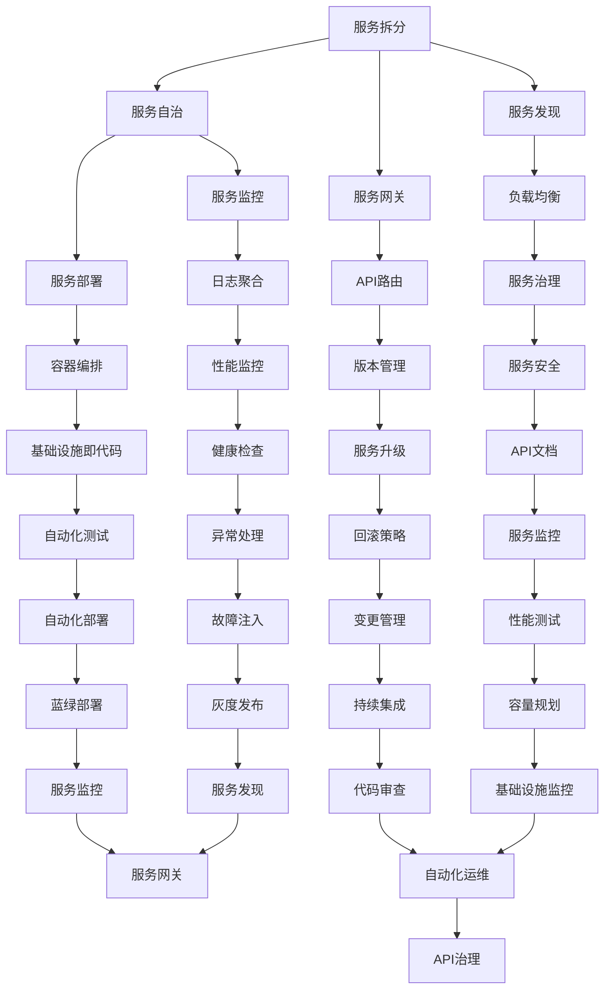

                 

关键词：微服务、架构设计、分布式系统、服务治理、API网关、容器化、云原生、服务发现、负载均衡、持续集成、持续部署、DevOps、微服务框架

摘要：本文将深入探讨微服务架构的设计、实现与治理，旨在为读者提供全面的微服务架构指南。文章首先介绍微服务架构的背景和核心概念，随后详细讲解微服务的架构模式、设计原则、实现技术，以及服务治理的方法和实践。通过案例分析、代码实例和实际应用场景的讨论，本文将帮助读者更好地理解和应用微服务架构，为构建高效、可靠、可扩展的分布式系统提供指导。

## 1. 背景介绍

在互联网和移动设备的普及推动下，现代应用场景越来越复杂，对系统的要求也越来越高。传统的单体应用架构已经无法满足快速变化的市场需求，因此，微服务架构应运而生。微服务架构将复杂的应用拆分成一组小型、独立的服务，通过服务间的松耦合实现系统的可扩展性和可维护性。

微服务架构起源于2000年初的互联网公司，如亚马逊、Netflix等。这些公司通过将大型单体应用拆分成一系列微服务，大大提高了系统的灵活性和可靠性。随着容器化技术的成熟和云原生的发展，微服务架构逐渐成为分布式系统设计的主流。

微服务架构的优势包括：

1. **可扩展性**：通过水平扩展服务实例，可以轻松应对高并发和大数据量的场景。
2. **灵活性**：每个服务可以独立开发、测试和部署，降低系统的复杂性。
3. **可维护性**：服务模块化使得问题定位和修复更加简单，同时也便于团队分工协作。
4. **可重用性**：服务可以独立升级，不会影响其他服务的正常运行。

然而，微服务架构也带来了一些挑战，如服务治理、网络通信复杂性、数据一致性等。本文将重点讨论这些挑战的解决方法。

## 2. 核心概念与联系

### 2.1 微服务的定义与特点

微服务（Microservices）是一种架构风格，它强调通过拆分大型应用为多个小型、独立的、可协作的服务来实现分布式系统。每个微服务代表一个具体的业务功能，具有自己的数据库和后端逻辑。

微服务的特点包括：

1. **独立性**：每个服务都是独立的，可以独立部署、测试和扩展。
2. **轻量级**：服务通常采用轻量级技术栈，如Spring Boot、Node.js等，便于快速开发和部署。
3. **自治性**：服务拥有自己的业务逻辑、数据库和数据存储，可以独立管理和维护。
4. **分布式**：服务通过API或其他通信协议进行通信，通常位于不同的主机或集群上。

### 2.2 微服务架构模式

微服务架构模式主要包括以下几种：

1. **服务拆分**：根据业务需求和功能独立性，将大型应用拆分为多个微服务。
2. **服务编排**：通过编排和调度服务，实现业务流程的自动化和优化。
3. **服务自治**：确保每个服务具有独立的部署、监控和管理能力。
4. **服务发现**：实现服务实例的自动注册和发现，便于服务的调用和负载均衡。
5. **服务网关**：提供统一的入口和路由，简化客户端的调用逻辑。

### 2.3 微服务架构与SOA的联系与区别

微服务架构和面向服务架构（SOA）在概念上相似，但存在一些关键区别：

1. **服务规模**：SOA通常涉及多个大型服务，而微服务更注重小型、独立的、自治的服务。
2. **通信方式**：SOA通常使用企业服务总线（ESB）进行复杂的业务流程管理和数据交换，而微服务则采用轻量级的API网关和RESTful API。
3. **架构风格**：SOA强调服务重用和互操作性，而微服务更注重业务的模块化和快速迭代。

### 2.4 Mermaid 流程图



## 3. 核心算法原理 & 具体操作步骤

### 3.1 算法原理概述

微服务架构的核心在于服务的拆分、编排和治理。以下是一些核心算法原理和具体操作步骤：

1. **服务拆分算法**：根据业务需求和功能独立性，将大型应用拆分为多个微服务。
2. **服务编排算法**：通过编排和调度服务，实现业务流程的自动化和优化。
3. **服务治理算法**：实现对服务实例的自动注册、发现、负载均衡和监控。

### 3.2 算法步骤详解

1. **服务拆分步骤**：
   - **业务分析**：分析业务需求，确定服务边界。
   - **功能划分**：根据功能独立性，将应用拆分为多个微服务。
   - **数据分离**：确保每个服务拥有独立的数据存储和管理。

2. **服务编排步骤**：
   - **服务注册**：服务启动时向服务发现组件注册。
   - **服务发现**：客户端通过服务发现组件获取服务实例信息。
   - **服务调用**：客户端通过API网关调用服务。

3. **服务治理步骤**：
   - **服务监控**：实现对服务实例的监控和报警。
   - **负载均衡**：根据服务实例的健康状况和负载情况，进行流量分配。
   - **服务升级**：实现服务实例的灰度发布和回滚策略。

### 3.3 算法优缺点

**服务拆分算法**：
- **优点**：提高系统的可维护性和可扩展性，降低系统复杂度。
- **缺点**：增加了服务的通信复杂度，需要考虑数据一致性和服务间依赖。

**服务编排算法**：
- **优点**：实现业务流程的自动化和优化，提高系统的灵活性。
- **缺点**：增加了系统的复杂度，需要考虑服务的协同和资源调度。

**服务治理算法**：
- **优点**：实现对服务的全面管理和监控，提高系统的可靠性和稳定性。
- **缺点**：增加了系统的管理和维护成本，需要考虑服务的安全性。

### 3.4 算法应用领域

微服务架构在以下领域有广泛应用：

1. **电子商务**：提高系统的响应速度和可扩展性，支持高并发和大数据量。
2. **金融科技**：实现业务的灵活性和快速迭代，提高系统的可靠性和安全性。
3. **物联网**：处理海量设备的数据传输和业务处理，提高系统的实时性和可扩展性。

## 4. 数学模型和公式 & 详细讲解 & 举例说明

### 4.1 数学模型构建

微服务架构中的数学模型主要包括以下几个方面：

1. **服务拆分模型**：基于业务需求和功能独立性，构建服务拆分模型。
2. **服务编排模型**：基于业务流程和资源调度，构建服务编排模型。
3. **服务治理模型**：基于服务监控和负载均衡，构建服务治理模型。

### 4.2 公式推导过程

1. **服务拆分模型**：

   服务拆分模型的目标是最大化服务的独立性和可维护性，最小化服务的依赖关系。

   假设应用A需要拆分为多个微服务，定义以下参数：

   - \( n \)：服务数量
   - \( m \)：功能模块数量
   - \( k \)：服务间的依赖关系数量

   目标函数：

   \[ \text{Maximize} \ \sum_{i=1}^{n} \ \text{Service\_Independence}(i) \]

   约束条件：

   \[ \sum_{i=1}^{n} \ \text{Function\_Modules}(i) = m \]
   \[ \sum_{i=1}^{n} \ \text{Service\_Dependencies}(i) = k \]

   其中，\(\text{Service\_Independence}(i)\) 表示服务 \( i \) 的独立性，\(\text{Function\_Modules}(i)\) 表示服务 \( i \) 包含的功能模块数量，\(\text{Service\_Dependencies}(i)\) 表示服务 \( i \) 的依赖关系数量。

2. **服务编排模型**：

   服务编排模型的目标是优化业务流程和服务调度。

   假设业务流程包括多个服务 \( S_1, S_2, ..., S_n \)，定义以下参数：

   - \( p_i \)：服务 \( i \) 的处理时间
   - \( c_i \)：服务 \( i \) 的成本
   - \( r_i \)：服务 \( i \) 的响应时间

   目标函数：

   \[ \text{Minimize} \ \sum_{i=1}^{n} \ \text{Cost}(i) + \ \text{Response\_Time}(S) \]

   约束条件：

   \[ S = \sum_{i=1}^{n} \ p_i \]
   \[ \sum_{i=1}^{n} \ c_i \leq C \]
   \[ \text{Response\_Time}(S) \leq T \]

   其中，\(\text{Cost}(i)\) 表示服务 \( i \) 的成本，\(\text{Response\_Time}(S)\) 表示业务流程的响应时间，\( C \) 表示总成本，\( T \) 表示最大响应时间。

3. **服务治理模型**：

   服务治理模型的目标是实现对服务的全面监控和管理。

   假设服务集群包括多个服务实例 \( S_1, S_2, ..., S_n \)，定义以下参数：

   - \( h_i \)：服务 \( i \) 的健康状态
   - \( l_i \)：服务 \( i \) 的负载状态
   - \( w_i \)：服务 \( i \) 的权重

   目标函数：

   \[ \text{Maximize} \ \sum_{i=1}^{n} \ \text{Healthiness}(i) + \ \text{LoadBalance}(i) \]

   约束条件：

   \[ \sum_{i=1}^{n} \ h_i = H \]
   \[ \sum_{i=1}^{n} \ l_i = L \]
   \[ \sum_{i=1}^{n} \ w_i = W \]

   其中，\(\text{Healthiness}(i)\) 表示服务 \( i \) 的健康状态，\(\text{LoadBalance}(i)\) 表示服务 \( i \) 的负载状态，\( H \) 表示总健康状态，\( L \) 表示总负载状态，\( W \) 表示总权重。

### 4.3 案例分析与讲解

假设一个电子商务平台需要拆分为多个微服务，服务拆分模型如下：

- 服务数量 \( n = 5 \)
- 功能模块数量 \( m = 20 \)
- 服务间的依赖关系数量 \( k = 10 \)

目标函数：

\[ \text{Maximize} \ \sum_{i=1}^{5} \ \text{Service\_Independence}(i) \]

约束条件：

\[ \sum_{i=1}^{5} \ \text{Function\_Modules}(i) = 20 \]
\[ \sum_{i=1}^{5} \ \text{Service\_Dependencies}(i) = 10 \]

通过求解目标函数和约束条件，可以得到最优的服务拆分方案，如下：

- 服务1：商品管理（5个功能模块，无依赖关系）
- 服务2：订单管理（5个功能模块，依赖服务1）
- 服务3：用户管理（5个功能模块，依赖服务1）
- 服务4：支付管理（3个功能模块，依赖服务1和2）
- 服务5：库存管理（2个功能模块，依赖服务1和4）

通过上述拆分，每个服务都具有较高的独立性，降低了服务间的依赖关系，提高了系统的可维护性和可扩展性。

## 5. 项目实践：代码实例和详细解释说明

### 5.1 开发环境搭建

为了实现微服务架构，我们首先需要搭建一个适合的开发环境。以下是一个基本的开发环境搭建步骤：

1. 安装操作系统：推荐使用Ubuntu 20.04或更高版本。
2. 安装Java开发工具包（JDK）：版本推荐11或更高。
3. 安装Maven：用于构建和管理项目依赖。
4. 安装Docker：用于容器化和部署微服务。
5. 安装Kubernetes：用于服务编排和治理。

### 5.2 源代码详细实现

以下是一个简单的商品管理微服务的源代码实现，基于Spring Boot框架：

```java
// ProductService.java
package com.example.products;

import org.springframework.boot.SpringApplication;
import org.springframework.boot.autoconfigure.SpringBootApplication;
import org.springframework.web.bind.annotation.*;

@SpringBootApplication
@RestController
public class ProductService {

    private List<Product> products = new ArrayList<>();

    @GetMapping("/products")
    public List<Product> getAllProducts() {
        return products;
    }

    @PostMapping("/products")
    public Product createProduct(@RequestBody Product product) {
        products.add(product);
        return product;
    }

    @DeleteMapping("/products/{id}")
    public void deleteProduct(@PathVariable Long id) {
        products.removeIf(product -> product.getId().equals(id));
    }

    public static void main(String[] args) {
        SpringApplication.run(ProductService.class, args);
    }
}

// Product.java
package com.example.products;

import javax.persistence.*;

@Entity
public class Product {

    @Id
    @GeneratedValue(strategy = GenerationType.IDENTITY)
    private Long id;

    private String name;
    private double price;

    // Getters and Setters
}
```

### 5.3 代码解读与分析

上述代码实现了商品管理微服务的核心功能：

1. **启动类**：`ProductService` 是 Spring Boot 的启动类，通过 `@SpringBootApplication` 注解标识。
2. **RESTful API**：`@RestController` 注解表示该类是一个RESTful风格的控制器，`@GetMapping` 和 `@PostMapping` 注解分别表示处理GET和POST请求。
3. **数据模型**：`Product` 类是商品的数据模型，通过 `@Entity` 注解标识为实体类，并使用 `@Id` 和 `@GeneratedValue` 注解定义主键。

### 5.4 运行结果展示

假设我们通过以下命令启动服务：

```shell
mvn spring-boot:run
```

服务启动后，可以通过以下命令测试API：

```shell
# 查询所有商品
GET http://localhost:8080/products

# 添加商品
POST http://localhost:8080/products
Content-Type: application/json

{
  "name": "iPhone 13",
  "price": 799.99
}

# 删除商品
DELETE http://localhost:8080/products/1
```

通过这些测试，我们可以验证商品管理微服务的正常运行。

## 6. 实际应用场景

微服务架构在多个实际应用场景中表现出色：

1. **电子商务平台**：通过微服务架构，电子商务平台可以实现高并发、大数据量的处理，同时提高系统的灵活性和可维护性。
2. **金融科技**：金融科技公司可以利用微服务架构快速迭代和部署，提高系统的可靠性和安全性。
3. **物联网**：物联网应用通常涉及海量设备和数据的处理，微服务架构可以提高系统的实时性和可扩展性。
4. **在线教育**：在线教育平台通过微服务架构可以实现课程管理、用户管理、支付系统等功能的独立开发和部署，提高系统的稳定性。

### 6.4 未来应用展望

随着云计算、人工智能和物联网等技术的不断发展，微服务架构在未来将继续发挥重要作用：

1. **云原生微服务**：云原生微服务将更注重服务的自动化、弹性扩展和持续集成/持续部署（CI/CD）。
2. **服务网格**：服务网格将提供更高效的服务发现、负载均衡和安全保障。
3. **智能微服务**：结合人工智能技术，微服务可以实现更智能的服务编排、优化和预测。

## 7. 工具和资源推荐

为了更好地实践微服务架构，以下是一些建议的工

