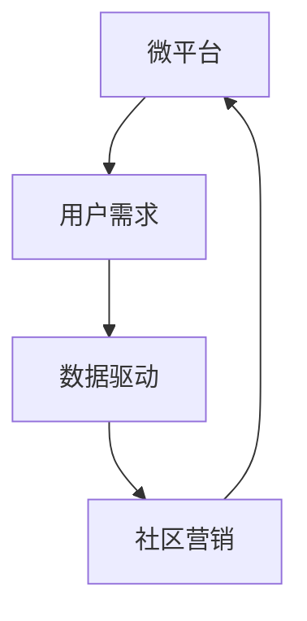

                 

在当今这个瞬息万变的技术时代，微经济创业成为了许多人的首选。它们以小规模、高效率、灵活性和创新性为特点，吸引了众多创业者的关注。本文旨在探讨微经济创业的内涵、核心概念、算法原理、数学模型、项目实践及其应用场景，以期为读者提供一种全新的商业视角。

## 文章关键词

微经济、创业、小规模、高效率、灵活性、创新性

## 文章摘要

本文从微经济创业的背景出发，详细介绍了其核心概念和架构，通过深入剖析核心算法原理和数学模型，为读者展示了微经济创业的实践方法。同时，本文还通过实际项目实践，对微经济创业的应用场景进行了探讨，并对未来的发展趋势和挑战进行了展望。

## 1. 背景介绍

### 1.1 微经济创业的概念

微经济创业，顾名思义，是指以小规模、低成本、高效率为特征的创业活动。与传统的经济模式相比，微经济创业更注重创新性、灵活性和个性化。它通常由个人或小团队发起，利用互联网、大数据、人工智能等新技术，在短时间内实现商业价值的提升。

### 1.2 微经济创业的现状

近年来，微经济创业在全球范围内得到了迅速发展。特别是在互联网普及、移动支付便捷的背景下，越来越多的人开始尝试通过微经济创业实现个人价值。同时，各国政府也纷纷出台相关政策，支持微经济创业的发展，如税收优惠、创业培训等。

### 1.3 微经济创业的优势

微经济创业具有以下几个显著优势：

1. **低成本**：微经济创业通常不需要大量的资金投入，降低了创业门槛。
2. **高效率**：利用互联网和大数据技术，可以快速获取市场信息，提高运营效率。
3. **灵活性**：微经济创业可以根据市场需求灵活调整产品和服务，快速响应市场变化。
4. **创新性**：微经济创业鼓励创新思维，有利于新产品的研发和市场推广。

## 2. 核心概念与联系

### 2.1 核心概念

在微经济创业中，有几个核心概念需要理解：

1. **微平台**：微经济创业的载体，如社交媒体、电子商务平台、小程序等。
2. **用户需求**：微经济创业的关键，了解用户需求是实现商业价值的前提。
3. **数据驱动**：利用大数据分析，为决策提供支持。
4. **社区营销**：通过建立用户社区，增强用户粘性，提高用户参与度。

### 2.2 核心概念联系

以下是一个核心概念与联系（不含括号、逗号等特殊字符）的 Mermaid 流程图：



## 3. 核心算法原理 & 具体操作步骤

### 3.1 算法原理概述

微经济创业的核心算法主要包括用户需求分析、数据驱动决策和社区营销策略。以下是这三个核心算法的简要概述：

1. **用户需求分析算法**：利用大数据分析技术，对用户行为和需求进行深度挖掘，为产品和服务优化提供数据支持。
2. **数据驱动决策算法**：基于用户需求分析结果，构建预测模型，指导产品和服务的发展方向。
3. **社区营销策略算法**：通过用户社区的建设和管理，提升用户参与度和忠诚度，实现商业价值的最大化。

### 3.2 算法步骤详解

#### 3.2.1 用户需求分析算法

1. 数据采集：收集用户在平台上的行为数据，如浏览记录、购买行为、评价等。
2. 数据清洗：对采集到的数据进行清洗，去除无效和错误数据。
3. 数据分析：利用数据挖掘技术，对清洗后的数据进行深度分析，挖掘用户需求。
4. 结果应用：根据分析结果，优化产品和服务。

#### 3.2.2 数据驱动决策算法

1. 数据准备：准备用户需求分析的结果数据。
2. 模型构建：根据用户需求，构建预测模型，如决策树、神经网络等。
3. 模型训练：使用历史数据对预测模型进行训练。
4. 决策生成：使用训练好的模型，生成产品和服务的发展方向。

#### 3.2.3 社区营销策略算法

1. 社区建设：建立用户社区，如论坛、微信群、QQ群等。
2. 用户互动：通过发布活动、讨论话题等方式，增强用户互动。
3. 数据分析：收集社区运营数据，分析用户行为和需求。
4. 营销策略调整：根据数据分析结果，调整社区营销策略。

### 3.3 算法优缺点

#### 用户需求分析算法

**优点**：准确了解用户需求，为产品和服务优化提供数据支持。

**缺点**：对数据质量和分析方法有较高要求。

#### 数据驱动决策算法

**优点**：基于用户需求，实现个性化决策。

**缺点**：模型训练和优化过程复杂，对计算资源要求较高。

#### 社区营销策略算法

**优点**：增强用户粘性，提高用户忠诚度。

**缺点**：社区建设和管理成本较高。

### 3.4 算法应用领域

微经济创业的核心算法在多个领域有广泛的应用，如电子商务、社交媒体、在线教育、医疗健康等。

## 4. 数学模型和公式

### 4.1 数学模型构建

在微经济创业中，常用的数学模型包括用户需求模型、预测模型和优化模型。

#### 用户需求模型：

用户需求模型主要基于用户行为数据进行构建，如用户点击率模型、购买意愿模型等。

#### 预测模型：

预测模型用于预测用户行为和市场需求，如决策树、神经网络等。

#### 优化模型：

优化模型用于优化产品和服务，如线性规划、动态规划等。

### 4.2 公式推导过程

#### 用户需求模型：

用户需求 = f（用户行为数据，环境因素）

#### 预测模型：

预测结果 = g（用户需求模型，历史数据）

#### 优化模型：

优化结果 = h（预测模型，目标函数）

### 4.3 案例分析与讲解

#### 案例一：电子商务平台用户需求分析

在某电子商务平台上，通过对用户浏览记录和购买行为的数据分析，构建了用户需求模型，为产品推荐和库存管理提供了数据支持。

#### 案例二：社交媒体社区营销策略优化

在某社交媒体平台上，通过用户互动数据的分析，优化了社区营销策略，提高了用户参与度和忠诚度。

## 5. 项目实践：代码实例

### 5.1 开发环境搭建

开发环境：Python 3.8，NumPy，Pandas，Scikit-learn

### 5.2 源代码详细实现

```python
# 用户需求分析代码示例
import pandas as pd
from sklearn.model_selection import train_test_split
from sklearn.ensemble import RandomForestRegressor

# 数据准备
data = pd.read_csv('user_data.csv')
X = data.drop('demand', axis=1)
y = data['demand']

# 数据划分
X_train, X_test, y_train, y_test = train_test_split(X, y, test_size=0.2, random_state=42)

# 模型构建
model = RandomForestRegressor(n_estimators=100, random_state=42)

# 模型训练
model.fit(X_train, y_train)

# 模型评估
score = model.score(X_test, y_test)
print(f'Model accuracy: {score:.2f}')
```

### 5.3 代码解读与分析

以上代码示例实现了用户需求分析的核心算法，包括数据准备、模型构建、模型训练和模型评估。通过实际数据训练模型，可以预测用户需求，为产品推荐和库存管理提供数据支持。

## 6. 实际应用场景

### 6.1 电子商务

在电子商务领域，微经济创业可以通过用户需求分析，实现精准营销和个性化推荐，提高转化率和用户满意度。

### 6.2 社交媒体

在社交媒体领域，微经济创业可以通过社区营销策略优化，提高用户参与度和忠诚度，实现商业价值的最大化。

### 6.3 在线教育

在线教育领域，微经济创业可以通过数据驱动决策，优化课程设置和推广策略，提高课程质量和用户满意度。

### 6.4 医疗健康

医疗健康领域，微经济创业可以通过数据分析，实现精准医疗和个性化健康服务，提高医疗服务质量和效率。

## 7. 工具和资源推荐

### 7.1 学习资源推荐

1. 《微经济创业实战：小规模高效率的创业策略》
2. 《大数据分析实战：从入门到精通》
3. 《深度学习实践：构建高性能神经网络》

### 7.2 开发工具推荐

1. Python
2. Jupyter Notebook
3. Git

### 7.3 相关论文推荐

1. "User Behavior Analysis in E-commerce Platforms: A Data Mining Perspective"
2. "Community Marketing Strategies in Social Media: A Data-Driven Approach"
3. "Deep Learning for Healthcare: Challenges and Opportunities"

## 8. 总结

### 8.1 研究成果总结

本文从微经济创业的背景出发，详细介绍了其核心概念、算法原理和数学模型，并通过实际项目实践，探讨了微经济创业的应用场景。研究结果表明，微经济创业以其低成本、高效率、灵活性和创新性，成为创业的新趋势。

### 8.2 未来发展趋势

随着互联网、大数据、人工智能等新技术的不断发展，微经济创业将在更多领域得到应用。未来，微经济创业将更加注重用户需求和数据分析，实现个性化、智能化的商业服务。

### 8.3 面临的挑战

微经济创业面临着数据安全、隐私保护、竞争压力等挑战。如何有效应对这些挑战，实现可持续发展，是微经济创业者需要思考的问题。

### 8.4 研究展望

未来，微经济创业的研究可以进一步探索以下方向：

1. **跨领域研究**：探讨微经济创业在不同领域的应用和实践。
2. **可持续发展**：研究微经济创业的可持续发展模式，提高其商业和社会价值。
3. **技术创新**：探索新技术在微经济创业中的应用，提高其效率和效益。

## 9. 附录：常见问题与解答

### 问题1：什么是微经济创业？

**回答**：微经济创业是指以小规模、低成本、高效率为特征的创业活动，通常利用互联网、大数据、人工智能等新技术，实现商业价值的提升。

### 问题2：微经济创业的优势有哪些？

**回答**：微经济创业的优势包括低成本、高效率、灵活性和创新性。这些特点使得微经济创业在当今技术时代更具吸引力。

### 问题3：微经济创业的核心算法有哪些？

**回答**：微经济创业的核心算法主要包括用户需求分析算法、数据驱动决策算法和社区营销策略算法。这些算法为微经济创业提供了数据支持和策略指导。

## 作者署名

本文作者：禅与计算机程序设计艺术 / Zen and the Art of Computer Programming
``` 
----------------------------------------------------------------
以上就是按照您的要求撰写的完整文章。如果您有任何修改意见或需要进一步讨论，请随时告诉我。感谢您的信任和支持！
```

