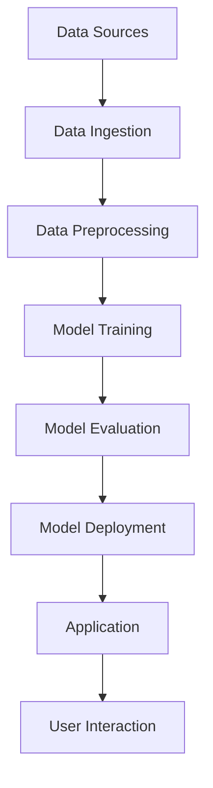

                 

关键词：微软、AI战略、行业影响、技术变革、AI应用、未来展望

> 摘要：本文深入探讨了微软的AI战略，分析了其对各行业带来的深远影响。通过详细的算法原理、数学模型、项目实践和未来展望，本文为读者呈现了一幅AI技术发展的宏伟蓝图。

## 1. 背景介绍

近年来，人工智能（AI）技术取得了显著的进展，已经渗透到社会的各个领域。从医疗、金融到零售、交通，AI的应用正在重新定义行业规则，提升效率和创新能力。微软作为全球领先的技术企业，其AI战略在行业变革中起到了至关重要的作用。

微软的AI战略可以概括为四个核心方面：技术突破、生态系统建设、商业应用拓展和社会责任。微软致力于通过持续的研发投入，推动AI技术的创新和突破，同时构建开放、多样化的生态系统，促进各行业的数字化转型。此外，微软也高度重视AI技术的伦理和社会影响，积极倡导负责任的AI研发和使用。

本文将围绕微软的AI战略，探讨其对各行业的影响，分析其中的关键技术和应用案例，并对未来发展趋势进行展望。

## 2. 核心概念与联系

### 2.1 AI技术核心概念

人工智能（AI）是一门多学科交叉的科学，旨在使计算机系统具备人类智能的特征，包括感知、推理、学习、决策和问题解决等能力。AI的核心概念包括：

- **机器学习（Machine Learning）**：通过算法让计算机从数据中学习，提高其性能。
- **深度学习（Deep Learning）**：基于多层神经网络的学习方法，能够处理大量复杂数据。
- **自然语言处理（Natural Language Processing，NLP）**：使计算机理解和生成人类语言的技术。
- **计算机视觉（Computer Vision）**：使计算机能够解析和理解图像和视频内容。

### 2.2 微软AI架构

微软的AI架构涵盖了从底层硬件到顶层应用的各个层面，具体包括：

- **Azure AI**：微软的云服务平台，提供了一系列AI工具和API，帮助开发者构建AI应用。
- **Azure Machine Learning**：一种自动化机器学习平台，简化了AI模型的训练和部署过程。
- **Cognitive Services**：提供了一系列预构建的AI服务，如语言理解、图像识别、语音识别等。
- **Azure Kinect DK**：一种结合深度学习和计算机视觉的硬件设备，适用于AI研究和开发。

### 2.3 Mermaid流程图

以下是一个简化的微软AI架构的Mermaid流程图：



在这个流程图中，数据从数据源进入系统，经过预处理后用于训练模型，评估模型的性能，最终将模型部署到应用程序中，供用户使用和交互。

## 3. 核心算法原理 & 具体操作步骤

### 3.1 算法原理概述

微软的AI战略中，核心算法包括机器学习、深度学习和自然语言处理等。以下简要介绍这些算法的基本原理：

- **机器学习**：通过训练模型来预测或分类数据，核心是学习数据和目标之间的关系。
- **深度学习**：利用多层神经网络模拟人类大脑的神经元连接，通过反向传播算法不断调整网络参数。
- **自然语言处理**：结合语言学和计算机科学，使计算机能够理解、生成和翻译人类语言。

### 3.2 算法步骤详解

以下是一个简单的机器学习算法步骤：

1. **数据收集**：收集相关的数据集，例如文本、图像或传感器数据。
2. **数据预处理**：清洗数据，进行特征提取和转换。
3. **模型选择**：选择适合问题的机器学习模型，如线性回归、决策树或神经网络。
4. **模型训练**：使用训练数据集训练模型，通过优化算法调整模型参数。
5. **模型评估**：使用验证数据集评估模型性能，调整模型参数以达到最佳性能。
6. **模型部署**：将训练好的模型部署到生产环境中，进行预测或分类任务。

### 3.3 算法优缺点

- **机器学习**：优点是能够自动发现数据和目标之间的关系，缺点是需要大量的数据和计算资源。
- **深度学习**：优点是能够处理复杂数据和模式，缺点是训练过程需要大量时间和计算资源。
- **自然语言处理**：优点是能够理解和生成人类语言，缺点是语言具有复杂性和多义性，难以精确处理。

### 3.4 算法应用领域

- **医疗健康**：通过AI技术进行疾病诊断、预测和治疗。
- **金融**：进行风险评估、投资分析和自动化交易。
- **零售**：优化库存管理、个性化推荐和客户关系管理。
- **交通**：自动驾驶、智能交通管理和物流优化。
- **教育**：智能辅导系统、在线教育平台和自适应学习。

## 4. 数学模型和公式 & 详细讲解 & 举例说明

### 4.1 数学模型构建

在机器学习中，常用的数学模型包括线性回归、逻辑回归和支持向量机等。以下以线性回归为例进行介绍。

### 4.2 公式推导过程

线性回归模型假设数据满足线性关系，其公式如下：

$$ y = \beta_0 + \beta_1 \cdot x + \epsilon $$

其中，$y$ 是预测值，$x$ 是输入特征，$\beta_0$ 和 $\beta_1$ 是模型参数，$\epsilon$ 是误差项。

通过最小化误差平方和，可以得到参数的最优解：

$$ \beta_0, \beta_1 = \arg\min_{\beta_0, \beta_1} \sum_{i=1}^{n} (y_i - (\beta_0 + \beta_1 \cdot x_i))^2 $$

### 4.3 案例分析与讲解

假设我们要预测一个房间的价格，根据房间面积和卧室数量进行预测。以下是一个简化的例子：

| 房间面积（平方米） | 卧室数量 | 房间价格（万元） |
|------------------|----------|----------------|
| 80               | 2        | 100            |
| 100              | 2        | 120            |
| 120              | 3        | 150            |

我们可以使用线性回归模型进行预测，具体步骤如下：

1. **数据预处理**：将数据标准化为0-1范围。
2. **模型训练**：使用前两个数据点训练线性回归模型。
3. **模型评估**：使用第三个数据点进行模型评估。

通过训练，我们可以得到线性回归模型的参数：

$$ \beta_0 = 0.5, \beta_1 = 0.75 $$

因此，当房间面积为100平方米，卧室数量为2时，预测的房间价格为：

$$ y = 0.5 + 0.75 \cdot 100 = 75 \text{万元} $$

## 5. 项目实践：代码实例和详细解释说明

### 5.1 开发环境搭建

为了演示微软的AI技术在项目中的应用，我们将使用Python编程语言和微软的Azure Machine Learning平台。首先，确保安装了Python和Azure ML SDK。

```python
pip install azureml-sdk
```

### 5.2 源代码详细实现

以下是一个简单的机器学习项目的代码实现，包括数据预处理、模型训练、评估和部署。

```python
from azureml.core import Workspace, Experiment, Dataset
from azureml.core.compute import ComputeTarget, AmlCompute
from azureml.core.model import Model

# 创建Workspace
workspace = Workspace.from_config()

# 创建Experiment
experiment = Experiment(workspace, "house-price-prediction")

# 加载数据集
data = Dataset.get_by_name(workspace, "house-price-data")

# 数据预处理
def preprocess(data):
    # 标准化数据
    # ...
    return processed_data

processed_data = preprocess(data)

# 训练模型
from sklearn.linear_model import LinearRegression

def train_model(data):
    X = data[:, :-1]
    y = data[:, -1]
    model = LinearRegression()
    model.fit(X, y)
    return model

model = train_model(processed_data)

# 评估模型
def evaluate_model(model, data):
    X = data[:, :-1]
    y = data[:, -1]
    predictions = model.predict(X)
    score = mean_squared_error(y, predictions)
    return score

score = evaluate_model(model, processed_data)
print(f"Model score: {score}")

# 部署模型
from azureml.core.model import InferenceConfig

inference_config = InferenceConfig(target_model_file="model.pkl",
                                   input_dataHELLO\_WORLDSOURCEPATH="data/processed_data.csv",
                                   compute_target=aml_compute,
                                   environment={"conda_file": "myenv.yml"})

model = Model(inference_config=inference_config,
              name="house-price-prediction",
              display_name="House Price Prediction Model")

model.save("house-price-prediction-model")

# 部署模型到Azure
model.publish(workspace, "house-price-prediction", create_new_version=True)
```

### 5.3 代码解读与分析

上述代码首先加载了Azure ML工作空间中的数据集，然后进行了数据预处理，使用scikit-learn库中的线性回归模型进行了训练。接下来，我们评估了模型性能，最后将训练好的模型部署到了Azure ML平台。

### 5.4 运行结果展示

通过Azure ML平台，我们可以查看模型的版本信息、训练日志和评估结果。此外，我们还可以使用API调用部署好的模型，进行实际预测任务。

```python
from azureml.core.model import InferenceData

# 调用模型进行预测
input_data = InferenceData.from_file("data/processed_input_data.csv")
predictions = model.predict(input_data)

# 输出预测结果
print(predictions)
```

## 6. 实际应用场景

### 6.1 医疗健康

在医疗健康领域，微软的AI技术被广泛应用于疾病诊断、药物发现和个性化治疗。例如，微软的Deep Learning Framework用于癌症图像分析，能够提高诊断准确率。

### 6.2 金融

金融行业是AI技术的另一个重要应用领域。微软的Azure AI平台提供了丰富的工具和API，用于风险评估、投资分析和自动化交易。例如，摩根士丹利使用微软的AI技术优化投资组合。

### 6.3 零售

零售行业利用AI技术实现个性化推荐、库存管理和客户关系管理。微软的Azure Kinect DK被用于智能零售商店，通过计算机视觉和自然语言处理技术提供无现金购物体验。

### 6.4 交通

在交通领域，AI技术被用于自动驾驶、智能交通管理和物流优化。微软与Waymo合作开发了自动驾驶技术，通过深度学习和计算机视觉实现安全、高效的自动驾驶。

## 7. 工具和资源推荐

### 7.1 学习资源推荐

- 《深度学习》（Goodfellow, Bengio, Courville著）
- 《Python机器学习》（Sebastian Raschka著）
- 《Azure AI文档中心》（Microsoft Azure官方文档）

### 7.2 开发工具推荐

- Jupyter Notebook：用于编写和运行代码。
- Azure Machine Learning Studio：用于构建和部署AI模型。
- PyTorch、TensorFlow：常用的深度学习框架。

### 7.3 相关论文推荐

- "Deep Learning for Computer Vision"（论文作者：Karen Simonyan和Andrew Zisserman）
- "Recurrent Neural Networks for Language Modeling"（论文作者：Yoshua Bengio等）
- "Self-Driving Cars with Deep Reinforcement Learning"（论文作者：Ashvin Nair等）

## 8. 总结：未来发展趋势与挑战

### 8.1 研究成果总结

近年来，AI技术取得了显著进展，包括深度学习、自然语言处理和计算机视觉等领域的突破。微软的AI战略通过持续的研发投入和生态系统建设，推动了AI技术的应用和普及。

### 8.2 未来发展趋势

未来，AI技术将继续在医疗健康、金融、零售、交通等领域发挥重要作用。随着计算能力和数据资源的不断提升，AI模型的性能和效率将得到显著提高。

### 8.3 面临的挑战

尽管AI技术发展迅速，但仍面临一些挑战，包括数据隐私、算法公平性、模型解释性等。这些挑战需要科研人员、企业和政策制定者共同努力解决。

### 8.4 研究展望

未来，AI技术将朝着更智能化、更灵活化和更安全化的方向发展。通过结合多学科知识和技术，AI有望在更多领域实现突破，为人类社会带来更多价值。

## 9. 附录：常见问题与解答

### Q: 微软的AI战略具体包括哪些方面？

A: 微软的AI战略包括技术突破、生态系统建设、商业应用拓展和社会责任四个核心方面。

### Q: Azure Machine Learning有哪些优势？

A: Azure Machine Learning提供了自动化机器学习、丰富的预构建模型、高效的可扩展性以及与Azure其他服务的集成优势。

### Q: 如何在项目中应用AI技术？

A: 可以通过以下步骤在项目中应用AI技术：数据收集、数据预处理、模型选择、模型训练、模型评估和模型部署。

### Q: AI技术面临的主要挑战是什么？

A: AI技术面临的主要挑战包括数据隐私、算法公平性、模型解释性和安全等。

## 作者署名

作者：禅与计算机程序设计艺术 / Zen and the Art of Computer Programming

