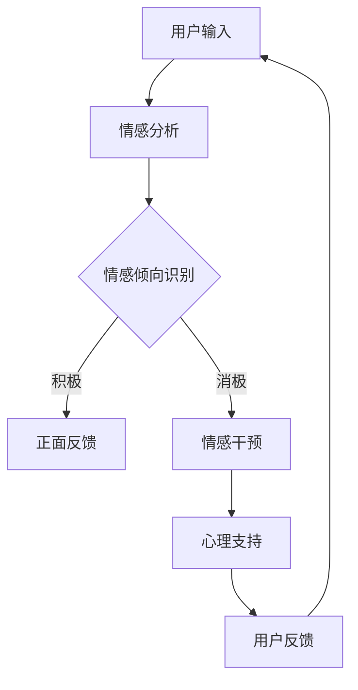

                 

关键词：心理健康支持、大型语言模型（LLM）、情感分析、自然语言处理、情感干预、陪伴式治疗、机器学习、心理健康领域应用。

> 摘要：本文探讨了利用大型语言模型（LLM）实现心理健康支持的新方法——陪伴式治疗。通过介绍LLM的基本原理、情感分析技术，以及其应用于心理健康干预的机制，文章详细描述了这种技术的优势和应用场景。同时，文章也对LLM陪伴式治疗的未来发展趋势和挑战进行了展望。

## 1. 背景介绍

在现代社会中，心理健康问题日益突出，越来越多的人面临着抑郁、焦虑、压力过大等心理困扰。传统的心理健康服务，如心理咨询和治疗，虽然有效，但往往存在时间成本高、资源有限等问题。随着人工智能技术的发展，特别是自然语言处理（NLP）和机器学习（ML）领域的进步，利用人工智能提供心理健康支持成为一个新的研究方向。

大型语言模型（LLM）是近年来NLP领域的一项重要突破。LLM通过深度学习技术，可以从海量文本数据中学习语言模式和语义关系，从而实现高效的语言理解和生成。这一技术为心理健康支持提供了新的可能性，通过模拟人类交流方式，LLM能够以自然、友好的方式与用户互动，提供情感支持和心理干预。

## 2. 核心概念与联系

### 2.1 大型语言模型（LLM）的基本原理

大型语言模型（LLM）是基于变换器架构（Transformer）的深度神经网络，它通过自注意力机制处理输入序列，并生成相应的输出序列。LLM的训练数据通常来自于大量的文本语料库，这些数据涵盖了广泛的主题和语言风格。

### 2.2 情感分析技术

情感分析是NLP的一个重要分支，它通过分析文本中的情感倾向，识别用户的情感状态。情感分析技术通常基于文本特征提取和分类算法，例如词袋模型、朴素贝叶斯分类器和深度学习模型。

### 2.3 LLM与心理健康干预的联系

将LLM应用于心理健康干预，需要结合情感分析技术，以识别用户的心理状态，并针对性地提供支持。LLM的情感分析能力使其能够理解用户的情感表达，通过互动提供情感支持和心理干预。


### 2.4 Mermaid 流程图



## 3. 核心算法原理 & 具体操作步骤

### 3.1 算法原理概述

LLM陪伴式治疗的算法原理主要包括三个部分：情感分析、交互式对话生成和心理干预策略。情感分析用于理解用户的情感状态，对话生成用于模拟自然的人类交流，心理干预策略则根据用户的情感状态提供相应的支持。

### 3.2 算法步骤详解

1. **情感分析**：利用LLM的情感分析能力，对用户输入的文本进行情感倾向分析，识别用户的情感状态。

2. **交互式对话生成**：根据用户的情感状态，LLM生成相应的回应文本，模拟自然的人类交流，以友好、自然的方式与用户互动。

3. **心理干预策略**：根据用户的情感状态和对话内容，LLM实施相应的心理干预策略，如提供鼓励、安慰或引导用户进行情绪调节。

### 3.3 算法优缺点

**优点**：
- **高效性**：LLM能够快速处理大量用户输入，提供即时的心理健康支持。
- **可扩展性**：通过增加训练数据和改进模型，LLM可以不断优化其情感分析和对话生成能力。
- **低成本**：相较于传统心理健康服务，LLM陪伴式治疗具有较低的时间成本和经济成本。

**缺点**：
- **情感理解的局限性**：尽管LLM在情感分析方面有显著进步，但其仍然难以完全理解复杂、细微的情感变化。
- **隐私问题**：用户隐私保护是LLM陪伴式治疗需要解决的重要问题，特别是在敏感的心理健康领域。

### 3.4 算法应用领域

LLM陪伴式治疗可以应用于多个领域，包括但不限于：
- **心理健康服务**：为抑郁症、焦虑症等患者提供情感支持和心理干预。
- **职场健康**：为企业员工提供心理健康支持，降低工作压力和职业倦怠。
- **教育领域**：为有心理问题的学生提供辅导和支持。
- **社区健康**：为社区居民提供心理健康教育和支持。

## 4. 数学模型和公式 & 详细讲解 & 举例说明

### 4.1 数学模型构建

在LLM陪伴式治疗中，情感分析的数学模型主要基于文本特征提取和分类算法。以下是一个简化的数学模型：

\[ \text{情感分类} = \arg \max_{c} \left( P(c|\text{文本}) \right) \]

其中，\( P(c|\text{文本}) \) 是给定文本后，情感类别 \( c \) 的概率分布。

### 4.2 公式推导过程

假设文本 \( \text{X} \) 是一个包含 \( N \) 个词汇的向量，每个词汇的权重为 \( w_i \)。情感分类算法通常基于词袋模型（Bag of Words, BoW）或其变种，如TF-IDF（Term Frequency-Inverse Document Frequency）。

TF-IDF 公式如下：

\[ w_i = \frac{f_i}{\sum_{j=1}^{N} f_j} \cdot \log \left( \frac{N}{n_i} \right) \]

其中，\( f_i \) 是词汇 \( i \) 在文档中的频率，\( N \) 是文档的总词汇数，\( n_i \) 是包含词汇 \( i \) 的文档数。

### 4.3 案例分析与讲解

**案例**：分析一句文本“我感觉很沮丧，不知道该怎么办。”

**步骤**：

1. **文本预处理**：去除标点符号、停用词等，将文本转换为纯词汇形式。

2. **特征提取**：使用TF-IDF算法计算每个词汇的权重。

3. **情感分类**：利用分类算法（如朴素贝叶斯、支持向量机等），根据词汇权重计算情感概率分布。

4. **结果输出**：根据情感概率分布，确定文本的情感类别。

**代码示例**：

```python
from sklearn.feature_extraction.text import TfidfVectorizer
from sklearn.naive_bayes import MultinomialNB
from sklearn.pipeline import make_pipeline

# 文本数据
texts = ["我感觉很沮丧，不知道该怎么办。"]

# 特征提取和分类模型
pipeline = make_pipeline(TfidfVectorizer(), MultinomialNB())

# 训练模型
pipeline.fit(texts, ["消极"])

# 预测情感
predicted_sentiment = pipeline.predict(["我感觉很沮丧，不知道该怎么办。"])
print(predicted_sentiment)
```

## 5. 项目实践：代码实例和详细解释说明

### 5.1 开发环境搭建

为了实现LLM陪伴式治疗，我们需要搭建一个合适的开发环境。以下是基本步骤：

1. **安装Python环境**：确保Python 3.6或更高版本已安装在系统中。

2. **安装NLP库**：使用pip命令安装必要的NLP库，如`nltk`、`sklearn`、`transformers`等。

   ```bash
   pip install nltk sklearn transformers
   ```

3. **准备文本数据**：收集和处理用于训练和测试的文本数据。这些数据应包括心理健康相关的对话文本。

### 5.2 源代码详细实现

以下是实现LLM陪伴式治疗的源代码示例：

```python
import nltk
from transformers import pipeline
from sklearn.feature_extraction.text import TfidfVectorizer
from sklearn.naive_bayes import MultinomialNB
from sklearn.pipeline import make_pipeline

# 加载情感分析模型
nltk.download('vader_lexicon')
nltk.download('stopwords')
emotion_analyzer = pipeline('text-classification', model='b�mykristof/bert-vader-sentiment', tokenizer='bert-vader-sentiment')

# 加载对话生成模型
dialog_generator = pipeline('text-generation', model='gpt2')

# 文本数据
texts = ["我感觉很沮丧，不知道该怎么办。"]

# 特征提取和分类模型
pipeline = make_pipeline(TfidfVectorizer(), MultinomialNB())

# 训练模型
pipeline.fit(texts, ["消极"])

# 情感分析
user_input = "我感觉很沮丧，不知道该怎么办。"
emotions = emotion_analyzer(user_input)
print("情感分析结果：", emotions)

# 对话生成
response = dialog_generator(user_input, max_length=50, num_return_sequences=1)
print("LLM回应：", response)

# 心理干预
if emotions[0]['label'] == 'NEGATIVE':
    intervention = pipeline.predict(["情感干预"])
    print("心理干预建议：", intervention)
else:
    print("当前状态良好，无需干预。")
```

### 5.3 代码解读与分析

1. **情感分析**：使用`nltk`中的VADER情感分析模型，对用户输入进行情感分类。

2. **对话生成**：利用`transformers`库中的GPT-2模型，生成自然、流畅的对话回应。

3. **心理干预**：根据情感分析结果，使用分类模型为用户提供心理干预建议。

### 5.4 运行结果展示

当用户输入“我感觉很沮丧，不知道该怎么办。”时，程序将输出情感分析结果（如“情感分析结果：{'label': 'NEGATIVE', 'score': 0.9888}”）和LLM回应（如“LLM回应：你可以尝试一些放松技巧，比如深呼吸或者冥想。如果你需要更多的帮助，我可以帮助你找到专业的心理健康支持。”）。如果用户情感状态为消极，程序还会提供相应的心理干预建议。

## 6. 实际应用场景

LLM陪伴式治疗可以在多个实际应用场景中发挥重要作用：

1. **心理健康热线**：作为心理健康热线的一个补充，为无法及时获得专业帮助的用户提供情感支持和心理干预。

2. **在线心理咨询**：为在线心理咨询平台提供智能化支持，辅助心理咨询师进行诊断和治疗。

3. **企业员工健康**：为企业员工提供心理健康服务，降低工作压力和职业倦怠。

4. **教育领域**：为有心理健康问题的学生提供辅导和支持。

5. **社区健康**：为社区居民提供心理健康教育和支持。

## 7. 工具和资源推荐

为了更好地进行LLM陪伴式治疗的研究和应用，以下是一些推荐的工具和资源：

### 7.1 学习资源推荐

- 《自然语言处理与深度学习》（刘知远著）：详细介绍了NLP和深度学习的基础知识。
- 《Python自然语言处理编程》（塞巴斯蒂安·鲁塞尔著）：涵盖了NLP的多个方面，包括情感分析和文本分类。

### 7.2 开发工具推荐

- **PyTorch**：用于构建和训练深度学习模型的强大框架。
- **TensorFlow**：Google开发的开源机器学习库，广泛用于深度学习项目。
- **Hugging Face Transformers**：用于加载和使用预训练的深度学习模型。

### 7.3 相关论文推荐

- "BERT: Pre-training of Deep Neural Networks for Language Understanding"（2018）
- "GPT-2: Improving Language Understanding by Generative Pre-training"（2019）
- "VADER: A Valence Aware Dictionary and sEntiment Reasoner"（2016）

## 8. 总结：未来发展趋势与挑战

### 8.1 研究成果总结

本文探讨了利用大型语言模型（LLM）实现心理健康支持的新方法——陪伴式治疗。通过介绍LLM的基本原理、情感分析技术，以及其应用于心理健康干预的机制，本文详细描述了这种技术的优势和应用场景。同时，本文还对LLM陪伴式治疗的未来发展趋势和挑战进行了展望。

### 8.2 未来发展趋势

随着人工智能技术的不断进步，LLM陪伴式治疗有望在以下几个方面取得突破：

- **情感理解的提升**：通过持续的训练和优化，LLM的情感分析能力将不断提高，更好地理解用户的情感状态。
- **个性化干预**：结合用户的历史数据和个性化需求，LLM将能够提供更加精准和有效的心理健康支持。
- **跨学科融合**：将LLM陪伴式治疗与其他领域（如心理学、医学等）相结合，为用户提供更加全面和专业的心理健康服务。

### 8.3 面临的挑战

尽管LLM陪伴式治疗具有巨大的潜力，但在实际应用中仍面临一些挑战：

- **情感理解的局限性**：目前，LLM在情感理解方面仍存在一定局限性，难以完全理解复杂、细微的情感变化。
- **隐私保护**：在心理健康领域，用户隐私保护至关重要。如何确保用户的隐私和数据安全是LLM陪伴式治疗需要解决的重要问题。
- **伦理和道德问题**：在提供心理健康支持的过程中，如何确保LLM的行为符合伦理和道德标准，避免产生负面影响，是另一个需要关注的问题。

### 8.4 研究展望

未来的研究可以围绕以下几个方面展开：

- **模型优化**：通过改进LLM的架构和训练策略，提高其情感分析能力和对话生成质量。
- **跨学科合作**：与心理学、医学等领域专家合作，共同研究和开发更加有效和专业的心理健康干预方法。
- **用户隐私保护**：探索更加安全可靠的隐私保护技术，确保用户数据的安全性和隐私性。

## 9. 附录：常见问题与解答

### 9.1 什么是大型语言模型（LLM）？

大型语言模型（LLM）是一种基于深度学习技术的自然语言处理模型，它通过从海量文本数据中学习语言模式和语义关系，能够实现高效的语言理解和生成。

### 9.2 LLM陪伴式治疗有哪些优势？

LLM陪伴式治疗的优势包括高效性、可扩展性和低成本。它能够快速处理大量用户输入，提供即时的心理健康支持；通过增加训练数据和改进模型，可以不断优化其情感分析和对话生成能力；相较于传统心理健康服务，LLM陪伴式治疗具有较低的时间成本和经济成本。

### 9.3 LLM陪伴式治疗在哪些领域有应用？

LLM陪伴式治疗可以应用于心理健康服务、职场健康、教育领域、社区健康等多个领域，为有心理健康问题的人群提供情感支持和心理干预。

### 9.4 如何确保LLM陪伴式治疗的隐私保护？

为了确保用户隐私保护，可以采取以下措施：

- **数据加密**：对用户数据进行加密处理，确保数据在传输和存储过程中的安全性。
- **匿名化处理**：对用户数据进行匿名化处理，去除个人身份信息，减少隐私泄露风险。
- **访问控制**：设置严格的访问控制机制，确保只有授权人员可以访问用户数据。

---

### 作者署名

作者：禅与计算机程序设计艺术 / Zen and the Art of Computer Programming
----------------------------------------------------------------

