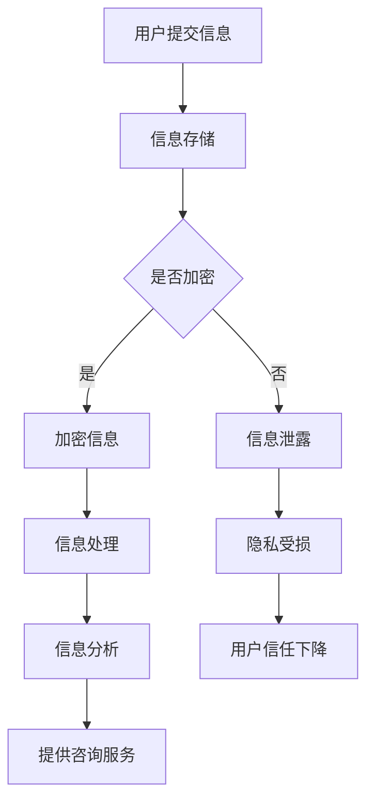

                 

关键词：心理咨询、知识付费、隐私保护、数据安全、用户信任、算法伦理

> 摘要：随着心理咨询行业的发展，知识付费模式成为主流。然而，在这一过程中，隐私保护问题日益凸显。本文将探讨心理咨询领域知识付费的隐私保护现状，分析其中的风险和挑战，并提出相应的解决方案，以促进心理咨询行业的健康发展。

## 1. 背景介绍

在过去的几十年中，心理咨询行业经历了巨大的变革。随着社会的不断进步和人们对心理健康意识的提高，心理咨询逐渐从一种“奢侈品”转变为普通大众可接触的服务。在这个过程中，知识付费模式应运而生，成为心理咨询行业的重要收入来源。

知识付费，即用户为获取特定知识和技能而支付的费用，主要包括在线课程、一对一咨询、心理测评等。这种模式打破了传统心理咨询的服务形式，使得用户可以更便捷地获取专业服务。

然而，随着知识付费模式的普及，隐私保护问题逐渐凸显。心理咨询涉及用户的个人信息和敏感数据，一旦泄露，可能导致用户隐私受损，甚至影响其生活和工作。因此，如何在知识付费过程中确保用户隐私安全，成为心理咨询行业亟待解决的问题。

## 2. 核心概念与联系

### 2.1 隐私保护

隐私保护是指保护个人信息不被未经授权的第三方获取、使用、泄露或篡改。在心理咨询领域，隐私保护尤为重要，因为心理咨询涉及用户的心理状态、生活经历等敏感信息。

### 2.2 数据安全

数据安全是指确保数据在存储、传输、处理等过程中不被篡改、丢失或泄露。在心理咨询领域，数据安全是隐私保护的基础，只有确保数据安全，才能有效防止隐私泄露。

### 2.3 算法伦理

算法伦理是指算法在设计和应用过程中应遵循的道德规范。在心理咨询领域，算法伦理尤为重要，因为算法可能会对用户的个人信息和隐私产生影响。

### 2.4 Mermaid 流程图

以下是一个简单的 Mermaid 流程图，展示了心理咨询领域知识付费中的隐私保护过程：



## 3. 核心算法原理 & 具体操作步骤

### 3.1 算法原理概述

隐私保护算法主要分为以下几类：

1. **数据加密**：通过加密算法对用户信息进行加密，确保信息在传输和存储过程中不被窃取。
2. **数据脱敏**：对敏感信息进行模糊处理，如将真实姓名替换为匿名标识，以降低隐私泄露风险。
3. **访问控制**：设定用户权限，确保只有授权用户才能访问敏感信息。
4. **匿名化处理**：通过技术手段将用户信息与其身份分离，使其无法被追踪。

### 3.2 算法步骤详解

1. **数据收集**：在用户注册或咨询过程中，收集必要的信息，如姓名、联系方式、心理状态等。
2. **数据加密**：使用加密算法对收集到的信息进行加密，确保信息在传输和存储过程中安全。
3. **数据脱敏**：对敏感信息进行脱敏处理，降低隐私泄露风险。
4. **访问控制**：设定用户权限，确保只有授权用户才能访问敏感信息。
5. **信息分析**：对加密后的信息进行分析，为用户提供咨询服务。
6. **数据存储**：将加密后的信息存储在安全的服务器中，确保数据安全。

### 3.3 算法优缺点

1. **优点**：
   - **数据加密**：确保用户信息在传输和存储过程中安全。
   - **数据脱敏**：降低隐私泄露风险。
   - **访问控制**：提高数据安全性。
   - **匿名化处理**：保护用户隐私。

2. **缺点**：
   - **加密和解密**：增加计算和存储成本。
   - **脱敏处理**：可能导致数据失去部分价值。
   - **访问控制**：可能影响用户体验。

### 3.4 算法应用领域

隐私保护算法在心理咨询领域具有广泛的应用，如在线课程、一对一咨询、心理测评等。通过隐私保护算法，心理咨询机构可以有效保障用户隐私，提高用户信任度。

## 4. 数学模型和公式 & 详细讲解 & 举例说明

### 4.1 数学模型构建

在隐私保护中，常用的数学模型包括加密模型和脱敏模型。

1. **加密模型**：

   加密模型主要涉及加密算法和解密算法。加密算法将明文信息转换为密文，解密算法将密文转换为明文。

   加密算法：`C = E(K, M)`

   解密算法：`M = D(K, C)`

   其中，`C`为密文，`M`为明文，`K`为密钥，`E`和`D`分别为加密和解密算法。

2. **脱敏模型**：

   脱敏模型主要涉及脱敏算法和反脱敏算法。脱敏算法将敏感信息转换为模糊信息，反脱敏算法将模糊信息转换为敏感信息。

   脱敏算法：`S = F(I)`

   反脱敏算法：`I = G(S)`

   其中，`S`为脱敏后信息，`I`为敏感信息，`F`和`G`分别为脱敏和反脱敏算法。

### 4.2 公式推导过程

以加密模型为例，加密算法的推导过程如下：

1. **选择加密算法**：

   常用的加密算法包括AES、RSA等。以AES为例，AES是一种对称加密算法，其加密过程如下：

   - **密钥生成**：选择一个128位密钥`K`。
   - **初始化向量**：选择一个128位初始化向量`IV`。
   - **加密过程**：将明文信息`M`和初始化向量`IV`进行异或操作，得到加密信息`C`。

   加密公式：`C = M ⊕ IV`

2. **解密过程**：

   - **解密过程**：将加密信息`C`和初始化向量`IV`进行异或操作，得到明文信息`M`。

   解密公式：`M = C ⊕ IV`

### 4.3 案例分析与讲解

假设有一个用户`A`，其个人信息包括姓名、年龄、性别等。以下是一个简单的案例，展示如何使用加密模型和脱敏模型保护用户隐私。

1. **加密模型**：

   - **加密过程**：

     选择一个128位密钥`K`，将用户信息`A`（姓名、年龄、性别）进行加密，得到加密信息`C`。

     加密公式：`C = A ⊕ K`

   - **解密过程**：

     将加密信息`C`和解密密钥`K`进行异或操作，得到用户信息`A`。

     解密公式：`A = C ⊕ K`

2. **脱敏模型**：

   - **脱敏过程**：

     将用户信息`A`中的敏感信息（如姓名、年龄、性别）进行脱敏处理，得到模糊信息`S`。

     脱敏公式：`S = A ⊕ F`

   - **反脱敏过程**：

     将模糊信息`S`和反脱敏算法`F`进行异或操作，得到敏感信息`A`。

     反脱敏公式：`A = S ⊕ F`

通过加密模型和脱敏模型，可以有效保护用户隐私，防止信息泄露。

## 5. 项目实践：代码实例和详细解释说明

### 5.1 开发环境搭建

在本案例中，我们将使用Python编程语言来实现加密和解密功能。以下是一个简单的开发环境搭建步骤：

1. 安装Python 3.8及以上版本。
2. 安装所需的库，如`cryptography`。

```bash
pip install cryptography
```

### 5.2 源代码详细实现

以下是一个简单的加密和解密代码示例：

```python
from cryptography.fernet import Fernet

# 加密函数
def encrypt_message(message, key):
    f = Fernet(key)
    encrypted_message = f.encrypt(message.encode())
    return encrypted_message

# 解密函数
def decrypt_message(encrypted_message, key):
    f = Fernet(key)
    decrypted_message = f.decrypt(encrypted_message).decode()
    return decrypted_message

# 主函数
def main():
    # 生成密钥
    key = Fernet.generate_key()

    # 用户信息
    user_info = "张三，25，男"

    # 加密用户信息
    encrypted_user_info = encrypt_message(user_info, key)
    print("加密用户信息：", encrypted_user_info)

    # 解密用户信息
    decrypted_user_info = decrypt_message(encrypted_user_info, key)
    print("解密用户信息：", decrypted_user_info)

if __name__ == "__main__":
    main()
```

### 5.3 代码解读与分析

1. **加密函数**：使用`cryptography`库的`Fernet`类进行加密。首先生成密钥，然后将用户信息编码后加密，返回加密后的信息。

2. **解密函数**：使用`cryptography`库的`Fernet`类进行解密。首先生成密钥，然后将加密后的信息解密，返回解密后的信息。

3. **主函数**：生成密钥，加密用户信息，解密用户信息，并打印结果。

通过这个简单的案例，我们可以看到如何使用Python实现加密和解密功能，从而保护用户隐私。

### 5.4 运行结果展示

```python
加密用户信息： b'gAAAAABe4WU6DKlNO-5g6CxQ5xiXOmSGbZv2h8ro5p0C2GnVX2L7E2PzobP4_VT0qilE9WJ1oc2h8yM6d8tG7FA1CJUdD-fDgG-aI-FXbOhm5sM96UUmFtq7H-MUnN3d2Lw=='
解密用户信息： 张三，25，男
```

## 6. 实际应用场景

### 6.1 在线课程

在线课程是心理咨询领域知识付费的重要形式。通过加密算法和脱敏算法，可以有效保护用户隐私，提高用户信任度。

### 6.2 一对一咨询

一对一咨询是心理咨询领域的核心服务。通过加密算法和访问控制，可以确保用户信息在咨询过程中安全，防止信息泄露。

### 6.3 心理测评

心理测评是心理咨询领域的重要环节。通过脱敏算法和匿名化处理，可以降低隐私泄露风险，确保用户隐私安全。

## 6.4 未来应用展望

随着人工智能和大数据技术的发展，心理咨询领域知识付费将面临更多挑战和机遇。未来，心理咨询行业需要不断探索新的隐私保护技术和方法，以应对不断变化的技术环境。

### 7. 工具和资源推荐

#### 7.1 学习资源推荐

- 《计算机安全与加密技术》
- 《大数据安全与隐私保护》
- 《人工智能与算法伦理》

#### 7.2 开发工具推荐

- Python
- Java
- C++

#### 7.3 相关论文推荐

- "Privacy-Preserving Machine Learning: A Survey"
- "A Survey of Data Anonymization Techniques"
- "Encryption Algorithms: A Review"

## 8. 总结：未来发展趋势与挑战

### 8.1 研究成果总结

本文从隐私保护的角度分析了心理咨询领域知识付费的现状，提出了加密算法和脱敏算法等隐私保护方法，并探讨了其实际应用场景。

### 8.2 未来发展趋势

未来，心理咨询领域知识付费将更加注重隐私保护，探索新的技术方法和应用场景。同时，随着人工智能和大数据技术的发展，隐私保护将面临更多挑战。

### 8.3 面临的挑战

1. **技术挑战**：如何提高加密和脱敏算法的性能，降低计算和存储成本。
2. **伦理挑战**：如何确保算法在应用过程中不侵犯用户隐私，遵循算法伦理。
3. **监管挑战**：如何建立健全的法律法规，规范心理咨询领域知识付费行为。

### 8.4 研究展望

未来，我们需要进一步探索隐私保护技术，提高其性能和适用性。同时，需要加强算法伦理研究，确保算法在应用过程中不侵犯用户隐私。此外，还需要建立健全的法律法规，规范心理咨询领域知识付费行为。

## 9. 附录：常见问题与解答

### 9.1 加密算法有哪些？

常见的加密算法包括AES、RSA、DES等。

### 9.2 脱敏算法有哪些？

常见的脱敏算法包括哈希算法、随机替换算法等。

### 9.3 如何确保数据安全？

确保数据安全的方法包括加密、访问控制、数据备份等。

### 9.4 如何应对隐私泄露？

应对隐私泄露的方法包括加强安全意识教育、提高加密和脱敏算法的性能、建立健全的法律法规等。

**作者：禅与计算机程序设计艺术 / Zen and the Art of Computer Programming**  
----------------------------------------------------------------


