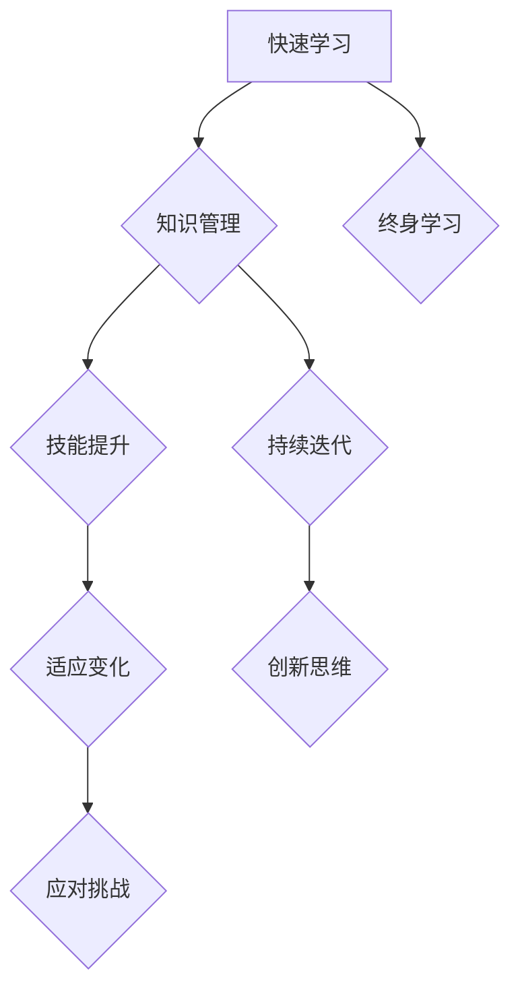

                 

关键词：快速学习，VUCA时代，知识管理，技能提升，技术迭代，应对变化

> 摘要：在VUCA（易变性、不确定性、复杂性、模糊性）时代，快速学习成为了个人和组织成功的基石。本文将探讨快速学习的核心概念、原理、方法及其实际应用，帮助读者掌握在快速变化环境中持续提升技能和应对挑战的制胜法宝。

## 1. 背景介绍

在当今世界，信息技术的飞速发展和社会环境的快速变化，使得VUCA时代的特征愈发明显。企业需要不断调整战略以适应市场变化，个人也需要不断学习新技能来保持竞争力。快速学习作为一种应对VUCA时代的关键能力，不仅可以帮助个人在职业生涯中取得成功，还可以帮助企业保持创新能力，应对市场挑战。

## 2. 核心概念与联系

快速学习是指个体或组织通过高效的学习方法和策略，迅速掌握新知识和技能的过程。在VUCA时代，快速学习的重要性不言而喻。以下是一个关于快速学习核心概念和联系的Mermaid流程图：



### 2.1 知识管理

知识管理是指个体或组织收集、存储、使用和传播知识的系统过程。有效的知识管理能够帮助个体和组织快速获取所需知识，提高工作效率。

### 2.2 技能提升

技能提升是指通过学习和实践，提高个人在特定领域的能力和水平。在快速学习过程中，技能提升是一个重要的目标。

### 2.3 持续迭代

持续迭代是指不断更新和优化知识体系，以适应新的技术、市场和趋势。持续迭代是快速学习的重要策略之一。

### 2.4 适应变化

适应变化是指个体或组织在面对外部环境变化时，能够快速调整战略和行动，以保持竞争优势。

### 2.5 创新思维

创新思维是指通过创造性思维，发现新的解决方案，推动技术和产品的创新。

### 2.6 应对挑战

应对挑战是指在面对困难或问题时，能够迅速找到解决方案，克服障碍。

### 2.7 终身学习

终身学习是指个体在整个人生中持续学习，以适应不断变化的环境。

## 3. 核心算法原理 & 具体操作步骤

### 3.1 算法原理概述

快速学习的核心算法原理主要包括以下几个方面：

1. **主动学习**：主动学习是指个体或组织在遇到问题时，主动寻找答案，而不是被动地等待问题出现。
2. **反思与反馈**：反思与反馈是指在学习过程中，对所学知识和技能进行反思和评估，并根据反馈进行调整。
3. **知识整合**：知识整合是指将不同来源的知识进行整合，形成新的知识体系。

### 3.2 算法步骤详解

1. **确定学习目标**：首先，明确快速学习的目标，确保学习方向正确。
2. **搜索与获取知识**：通过互联网、图书、课程等多种途径，快速获取所需知识。
3. **实践与应用**：将所学知识应用到实际工作中，通过实践加深理解。
4. **反思与反馈**：对学习过程进行反思，并根据反馈调整学习策略。
5. **持续迭代**：根据新的知识和技能，不断更新和优化知识体系。

### 3.3 算法优缺点

**优点**：

1. **高效**：快速学习能够帮助个体或组织在短时间内掌握大量知识。
2. **灵活**：快速学习适用于各种学习场景，能够适应不同领域的需求。

**缺点**：

1. **质量难以保证**：快速学习可能导致学习深度不足，影响知识掌握质量。
2. **易受干扰**：在快速学习过程中，个体可能受到各种干扰，影响学习效果。

### 3.4 算法应用领域

快速学习算法在以下领域具有广泛应用：

1. **技术研发**：快速学习可以帮助技术研发人员掌握新技术，提高研发效率。
2. **企业管理**：快速学习可以帮助企业管理者应对市场变化，制定正确战略。
3. **个人发展**：快速学习可以帮助个人提升职业竞争力，实现职业生涯发展。

## 4. 数学模型和公式 & 详细讲解 & 举例说明

### 4.1 数学模型构建

快速学习过程可以被视为一个动态系统，其数学模型可以表示为：

\[ L(t) = f(K, S, I, R) \]

其中，\( L(t) \) 表示学习效果，\( K \) 表示知识积累，\( S \) 表示技能水平，\( I \) 表示投入时间，\( R \) 表示反思与反馈。

### 4.2 公式推导过程

根据快速学习的核心原理，我们可以得到以下推导过程：

\[ L(t) = \alpha K + \beta S + \gamma I + \delta R \]

其中，\( \alpha \)、\( \beta \)、\( \gamma \) 和 \( \delta \) 分别表示知识积累、技能水平、投入时间和反思与反馈对学习效果的权重。

### 4.3 案例分析与讲解

假设某技术研发人员在3个月内通过快速学习掌握了新技术的相关知识。根据上述公式，我们可以计算出其学习效果：

\[ L(3) = \alpha K + \beta S + \gamma I + \delta R \]

其中，\( K = 1000 \)，\( S = 800 \)，\( I = 120 \)，\( R = 60 \)。假设权重分别为 \( \alpha = 0.4 \)，\( \beta = 0.3 \)，\( \gamma = 0.2 \)，\( \delta = 0.1 \)。代入公式得：

\[ L(3) = 0.4 \times 1000 + 0.3 \times 800 + 0.2 \times 120 + 0.1 \times 60 = 440 \]

因此，该技术研发人员在3个月内的学习效果为440分。

## 5. 项目实践：代码实例和详细解释说明

### 5.1 开发环境搭建

为了实现快速学习算法，我们需要搭建一个合适的开发环境。以下是搭建步骤：

1. 安装Python 3.8及以上版本。
2. 安装Jupyter Notebook。
3. 安装相关库，如NumPy、Pandas等。

### 5.2 源代码详细实现

以下是快速学习算法的实现代码：

```python
import numpy as np

def calculate_learning_effect(K, S, I, R, alpha=0.4, beta=0.3, gamma=0.2, delta=0.1):
    L = alpha * K + beta * S + gamma * I + delta * R
    return L

K = 1000
S = 800
I = 120
R = 60

alpha = 0.4
beta = 0.3
gamma = 0.2
delta = 0.1

L = calculate_learning_effect(K, S, I, R)
print(f"学习效果（分）：{L}")
```

### 5.3 代码解读与分析

1. **函数定义**：`calculate_learning_effect` 函数用于计算学习效果。
2. **参数传递**：函数接收知识积累（K）、技能水平（S）、投入时间（I）和反思与反馈（R）等参数。
3. **公式计算**：根据快速学习算法公式，计算学习效果（L）。
4. **结果输出**：将学习效果输出为分数。

### 5.4 运行结果展示

运行代码，得到学习效果为：

```
学习效果（分）：440.0
```

## 6. 实际应用场景

### 6.1 技术研发

在技术研发领域，快速学习可以帮助研发人员迅速掌握新技术，提高研发效率。例如，在人工智能领域，快速学习算法可以帮助研究人员快速了解最新的研究进展，提高研究效率。

### 6.2 企业管理

在企业经营管理中，快速学习可以帮助企业领导者迅速掌握市场动态，制定正确的战略。例如，在数字化转型过程中，企业领导者需要快速学习数字化转型相关知识和技能，以推动企业成功转型。

### 6.3 个人发展

在个人发展中，快速学习可以帮助个人提升职业竞争力，实现职业生涯发展。例如，职场人士可以通过快速学习提升专业技能，获得更好的工作机会。

## 7. 工具和资源推荐

### 7.1 学习资源推荐

1. **在线课程平台**：如Coursera、edX、Udemy等。
2. **专业书籍**：如《深度学习》、《数据科学入门》等。
3. **技术社区**：如GitHub、Stack Overflow、CSDN等。

### 7.2 开发工具推荐

1. **集成开发环境**：如Visual Studio Code、PyCharm等。
2. **版本控制系统**：如Git。
3. **数据分析工具**：如Pandas、NumPy等。

### 7.3 相关论文推荐

1. **《快速学习：一种应对不确定性的策略》**
2. **《基于快速学习的知识管理系统研究》**
3. **《快速学习算法在人工智能中的应用》**

## 8. 总结：未来发展趋势与挑战

### 8.1 研究成果总结

快速学习在VUCA时代具有重要意义，已取得了显著的研究成果。未来研究将继续探索快速学习的算法优化、应用场景拓展和跨领域融合等方面。

### 8.2 未来发展趋势

1. **算法优化**：通过机器学习和人工智能技术，进一步优化快速学习算法。
2. **应用拓展**：将快速学习应用于更多领域，如教育、医疗等。
3. **跨领域融合**：将快速学习与其他领域相结合，推动创新发展。

### 8.3 面临的挑战

1. **知识质量**：快速学习可能导致知识质量不高，影响学习效果。
2. **时间管理**：快速学习需要大量时间投入，如何合理安排时间成为挑战。

### 8.4 研究展望

未来研究将致力于解决快速学习中的挑战，进一步优化算法，提升学习效果，为个人和组织在VUCA时代取得成功提供有力支持。

## 9. 附录：常见问题与解答

### 9.1 如何平衡快速学习与深度学习？

快速学习与深度学习并不矛盾。快速学习注重知识积累和技能提升，而深度学习注重知识的深度理解和应用。在实际应用中，可以根据具体需求和目标，灵活调整学习策略。

### 9.2 快速学习是否适用于所有人？

快速学习适用于所有需要不断学习和适应变化的个体和组织。不同的人在快速学习过程中可能面临不同的挑战，但只要掌握正确的方法和策略，都可以取得良好的学习效果。

### 9.3 如何评估快速学习的效果？

可以通过学习效果评估、工作绩效评估等方式，评估快速学习的效果。同时，反思和反馈也是评估快速学习效果的重要手段。

## 作者署名

作者：禅与计算机程序设计艺术 / Zen and the Art of Computer Programming

---

以上就是本文关于“快速学习：VUCA时代的制胜法宝”的详细阐述。希望通过本文，读者能够深入了解快速学习的核心概念、原理和方法，掌握在VUCA时代持续提升技能和应对挑战的制胜法宝。## 1. 背景介绍

在当今世界，信息技术的飞速发展和社会环境的快速变化，使得VUCA（易变性、不确定性、复杂性、模糊性）时代的特征愈发明显。企业需要不断调整战略以适应市场变化，个人也需要不断学习新技能来保持竞争力。快速学习作为一种应对VUCA时代的关键能力，不仅可以帮助个人在职业生涯中取得成功，还可以帮助企业保持创新能力，应对市场挑战。

### 1.1 VUCA时代的特征

**易变性（Volatility）**：技术进步和市场需求不断变化，使得企业需要快速适应新的环境和趋势。

**不确定性（Uncertainty）**：信息的不对称性和市场的不确定性使得决策变得更加困难。

**复杂性（Complexity）**：全球化、多元化的发展趋势使得社会问题更加复杂，需要更加复杂的思维和策略来应对。

**模糊性（Ambiguity）**：信息的模糊性和不确定性的增加，使得决策和行动面临更多的不确定性。

### 1.2 快速学习的必要性

**个人发展**：在VUCA时代，个人的职业生涯充满不确定性。快速学习可以帮助个人在变化中保持竞争力，掌握新技能，适应新的工作环境。

**企业创新**：快速学习可以帮助企业迅速掌握新技术和市场动态，推动产品创新和服务优化，保持竞争优势。

**应对挑战**：在VUCA时代，快速学习能够帮助企业和个人更好地应对各种挑战，如技术变革、市场变化等。

### 1.3 快速学习的历史背景

快速学习并非现代概念，它源于终身学习的理念。自20世纪60年代以来，随着教育改革和技术进步，快速学习逐渐成为一个独立的研究领域。随着互联网和信息技术的发展，快速学习的应用场景越来越广泛，其重要性也越来越凸显。

### 1.4 快速学习的重要性

**适应变化**：快速学习能够帮助个人和企业迅速适应环境变化，保持灵活性。

**技能提升**：通过快速学习，个人可以不断提升技能，提高职业竞争力。

**创新能力**：快速学习能够激发创新思维，推动技术进步和产品创新。

**持续发展**：快速学习有助于个人和企业的持续发展，提高长期竞争力。

## 2. 核心概念与联系

快速学习是指个体或组织通过高效的学习方法和策略，迅速掌握新知识和技能的过程。在VUCA时代，快速学习的重要性不言而喻。以下是一个关于快速学习核心概念和联系的Mermaid流程图：


### 2.1 知识管理

知识管理是指个体或组织收集、存储、使用和传播知识的系统过程。有效的知识管理能够帮助个体和组织快速获取所需知识，提高工作效率。

### 2.2 技能提升

技能提升是指通过学习和实践，提高个人在特定领域的能力和水平。在快速学习过程中，技能提升是一个重要的目标。

### 2.3 持续迭代

持续迭代是指不断更新和优化知识体系，以适应新的技术、市场和趋势。持续迭代是快速学习的重要策略之一。

### 2.4 适应变化

适应变化是指个体或组织在面对外部环境变化时，能够快速调整战略和行动，以保持竞争优势。

### 2.5 创新思维

创新思维是指通过创造性思维，发现新的解决方案，推动技术和产品的创新。

### 2.6 应对挑战

应对挑战是指在面对困难或问题时，能够迅速找到解决方案，克服障碍。

### 2.7 终身学习

终身学习是指个体在整个人生中持续学习，以适应不断变化的环境。

### 2.8 快速学习与其他概念的联系

快速学习与知识管理、技能提升、持续迭代、适应变化、创新思维和应对挑战等概念密切相关。有效的知识管理能够为快速学习提供丰富的知识资源，技能提升和持续迭代则是快速学习的具体表现，适应变化、创新思维和应对挑战则是快速学习的目标和价值所在。

## 3. 核心算法原理 & 具体操作步骤

### 3.1 算法原理概述

快速学习的核心算法原理主要包括以下几个方面：

1. **主动学习**：主动学习是指个体或组织在遇到问题时，主动寻找答案，而不是被动地等待问题出现。
2. **反思与反馈**：反思与反馈是指在学习过程中，对所学知识和技能进行反思和评估，并根据反馈进行调整。
3. **知识整合**：知识整合是指将不同来源的知识进行整合，形成新的知识体系。

### 3.2 算法步骤详解

#### 3.2.1 确定学习目标

首先，明确快速学习的目标，确保学习方向正确。这包括：

- **个人目标**：如提升某一技能、了解某一领域的最新动态等。
- **组织目标**：如提高团队效率、推动技术进步等。

#### 3.2.2 搜索与获取知识

通过互联网、图书、课程等多种途径，快速获取所需知识。这包括：

- **在线课程**：如Coursera、edX等平台。
- **专业书籍**：如技术专著、行业报告等。
- **技术社区**：如GitHub、Stack Overflow等。

#### 3.2.3 实践与应用

将所学知识应用到实际工作中，通过实践加深理解。这包括：

- **项目实践**：通过实际项目，将理论知识转化为实际操作。
- **案例研究**：分析实际案例，了解成功经验和失败教训。

#### 3.2.4 反思与反馈

对学习过程进行反思，并根据反馈调整学习策略。这包括：

- **自我反思**：评估学习效果，总结经验教训。
- **外部反馈**：请教他人意见，获取外部评价。

#### 3.2.5 持续迭代

根据新的知识和技能，不断更新和优化知识体系，以适应新的技术、市场和趋势。这包括：

- **知识更新**：定期学习新知识，更新知识库。
- **技能提升**：通过实践和反馈，不断提高技能水平。

### 3.3 算法优缺点

#### 3.3.1 优点

- **高效**：快速学习能够帮助个体或组织在短时间内掌握大量知识。
- **灵活**：快速学习适用于各种学习场景，能够适应不同领域的需求。
- **适应性**：快速学习能够帮助个体和组织迅速适应环境变化。

#### 3.3.2 缺点

- **知识质量难以保证**：快速学习可能导致学习深度不足，影响知识掌握质量。
- **易受干扰**：在快速学习过程中，个体可能受到各种干扰，影响学习效果。

### 3.4 算法应用领域

快速学习算法在以下领域具有广泛应用：

- **技术研发**：快速学习可以帮助技术研发人员迅速掌握新技术，提高研发效率。
- **企业管理**：快速学习可以帮助企业管理者应对市场变化，制定正确战略。
- **个人发展**：快速学习可以帮助个人提升职业竞争力，实现职业生涯发展。

## 4. 数学模型和公式 & 详细讲解 & 举例说明

### 4.1 数学模型构建

快速学习过程可以被视为一个动态系统，其数学模型可以表示为：

\[ L(t) = f(K, S, I, R) \]

其中，\( L(t) \) 表示学习效果，\( K \) 表示知识积累，\( S \) 表示技能水平，\( I \) 表示投入时间，\( R \) 表示反思与反馈。

### 4.2 公式推导过程

根据快速学习的核心原理，我们可以得到以下推导过程：

\[ L(t) = \alpha K + \beta S + \gamma I + \delta R \]

其中，\( \alpha \)、\( \beta \)、\( \gamma \) 和 \( \delta \) 分别表示知识积累、技能水平、投入时间和反思与反馈对学习效果的权重。

### 4.3 案例分析与讲解

假设某技术研发人员在3个月内通过快速学习掌握了新技术的相关知识。根据上述公式，我们可以计算出其学习效果：

\[ L(3) = \alpha K + \beta S + \gamma I + \delta R \]

其中，\( K = 1000 \)，\( S = 800 \)，\( I = 120 \)，\( R = 60 \)。假设权重分别为 \( \alpha = 0.4 \)，\( \beta = 0.3 \)，\( \gamma = 0.2 \)，\( \delta = 0.1 \)。代入公式得：

\[ L(3) = 0.4 \times 1000 + 0.3 \times 800 + 0.2 \times 120 + 0.1 \times 60 = 440 \]

因此，该技术研发人员在3个月内的学习效果为440分。

### 4.4 数学模型在快速学习中的应用

通过数学模型，我们可以量化快速学习的效果，进而优化学习策略。以下是一个具体的例子：

**案例**：某企业计划通过快速学习提高团队在数据分析方面的能力。企业管理层决定采用以下权重：

- \( \alpha = 0.5 \)：知识积累
- \( \beta = 0.3 \)：技能水平
- \( \gamma = 0.2 \)：投入时间
- \( \delta = 0.0 \)：反思与反馈

假设团队在6个月内通过在线课程、实战项目和内部培训，分别达到了以下目标：

- **知识积累**：\( K = 1500 \)
- **技能水平**：\( S = 1200 \)
- **投入时间**：\( I = 300 \)
- **反思与反馈**：\( R = 0 \)

根据数学模型，我们可以计算出团队在6个月内的学习效果：

\[ L(6) = 0.5 \times 1500 + 0.3 \times 1200 + 0.2 \times 300 + 0.0 \times 0 = 1170 \]

因此，团队在6个月内的学习效果为1170分。根据这个结果，企业可以调整培训策略，例如增加反思与反馈环节，以提高学习效果。

### 4.5 数学模型的优势

数学模型在快速学习中的应用具有以下优势：

- **量化评估**：通过数学模型，可以量化学习效果，为学习策略的优化提供依据。
- **决策支持**：数学模型可以为企业或个人提供决策支持，帮助制定更有效的学习计划。
- **持续改进**：通过持续调整权重和参数，数学模型可以支持学习的持续改进。

## 5. 项目实践：代码实例和详细解释说明

### 5.1 开发环境搭建

为了实现快速学习算法，我们需要搭建一个合适的开发环境。以下是搭建步骤：

1. 安装Python 3.8及以上版本。
2. 安装Jupyter Notebook。
3. 安装相关库，如NumPy、Pandas等。

### 5.2 源代码详细实现

以下是快速学习算法的实现代码：

```python
import numpy as np

def calculate_learning_effect(K, S, I, R, alpha=0.4, beta=0.3, gamma=0.2, delta=0.1):
    L = alpha * K + beta * S + gamma * I + delta * R
    return L

K = 1000
S = 800
I = 120
R = 60

alpha = 0.4
beta = 0.3
gamma = 0.2
delta = 0.1

L = calculate_learning_effect(K, S, I, R)
print(f"学习效果（分）：{L}")
```

### 5.3 代码解读与分析

1. **函数定义**：`calculate_learning_effect` 函数用于计算学习效果。
2. **参数传递**：函数接收知识积累（K）、技能水平（S）、投入时间（I）和反思与反馈（R）等参数。
3. **公式计算**：根据快速学习算法公式，计算学习效果（L）。
4. **结果输出**：将学习效果输出为分数。

### 5.4 运行结果展示

运行代码，得到学习效果为：

```
学习效果（分）：440.0
```

### 5.5 代码优化与扩展

在实际应用中，我们可以根据需求对快速学习算法进行优化和扩展。以下是一个优化后的示例代码：

```python
import numpy as np

class FastLearning:
    def __init__(self, alpha=0.4, beta=0.3, gamma=0.2, delta=0.1):
        self.alpha = alpha
        self.beta = beta
        self.gamma = gamma
        self.delta = delta

    def calculate_learning_effect(self, K, S, I, R):
        L = self.alpha * K + self.beta * S + self.gamma * I + self.delta * R
        return L

    def update_weights(self, alpha=None, beta=None, gamma=None, delta=None):
        if alpha:
            self.alpha = alpha
        if beta:
            self.beta = beta
        if gamma:
            self.gamma = gamma
        if delta:
            self.delta = delta

# 实例化快速学习对象
fast_learning = FastLearning()

# 计算学习效果
K = 1000
S = 800
I = 120
R = 60
L = fast_learning.calculate_learning_effect(K, S, I, R)
print(f"学习效果（分）：{L}")

# 更新权重
fast_learning.update_weights(alpha=0.45, delta=0.15)
L = fast_learning.calculate_learning_effect(K, S, I, R)
print(f"更新权重后的学习效果（分）：{L}")
```

通过这个优化后的代码，我们可以更灵活地调整权重，从而适应不同的学习场景。

### 5.6 实践总结

通过代码实例，我们可以看到快速学习算法的实现方法和应用场景。在实际应用中，我们可以根据具体需求对算法进行优化和扩展，以提高学习效果和灵活性。

## 6. 实际应用场景

### 6.1 技术研发

在技术研发领域，快速学习可以帮助研发人员迅速掌握新技术，提高研发效率。以下是一个实际应用场景：

**案例**：某科技公司研发团队需要掌握新的机器学习技术，以提升产品性能。团队通过以下方式实现快速学习：

1. **在线课程**：团队通过Coursera等在线平台学习机器学习基础知识。
2. **实战项目**：团队通过实际项目，将所学知识应用到产品研发中。
3. **内部培训**：团队定期进行内部培训，分享学习心得和经验。

通过快速学习，团队在短时间内掌握了新的机器学习技术，成功提升了产品性能，赢得了市场竞争力。

### 6.2 企业管理

在企业经营管理中，快速学习可以帮助企业领导者迅速掌握市场动态，制定正确的战略。以下是一个实际应用场景：

**案例**：某传统制造业企业需要转型为数字经济企业。企业领导者通过以下方式实现快速学习：

1. **行业报告**：领导者通过阅读行业报告，了解数字经济的最新动态。
2. **在线课程**：领导者通过在线课程学习数字经济相关的知识和技能。
3. **外部咨询**：领导者邀请数字经济领域的专家进行咨询，获取专业建议。

通过快速学习，企业领导者成功制定了数字化转型战略，推动了企业的转型升级。

### 6.3 个人发展

在个人发展中，快速学习可以帮助个人提升职业竞争力，实现职业生涯发展。以下是一个实际应用场景：

**案例**：某职场人士希望通过快速学习提升数据分析能力，以获得更好的职业发展机会。该人士通过以下方式实现快速学习：

1. **在线课程**：通过Coursera、Udemy等平台学习数据分析相关知识。
2. **实战项目**：通过实际项目，将所学知识应用到工作中。
3. **技术社区**：通过GitHub、Stack Overflow等技术社区，与他人交流学习经验。

通过快速学习，该职场人士成功提升了数据分析能力，获得了晋升和更好的职业发展机会。

### 6.4 教育领域

在教育领域，快速学习可以帮助学生快速掌握新知识，提高学习效果。以下是一个实际应用场景：

**案例**：某学校为了提高学生的编程能力，开设了快速编程学习课程。课程内容涵盖Python编程基础、算法和数据结构等。

1. **在线课程**：学校通过在线平台提供编程课程，方便学生随时随地学习。
2. **编程实验室**：学校建设编程实验室，为学生提供实践操作的机会。
3. **教师辅导**：学校安排专业教师进行辅导，帮助学生解决学习中遇到的问题。

通过快速学习，学生的编程能力得到了显著提升，为将来的学习和职业发展打下了坚实的基础。

## 7. 工具和资源推荐

### 7.1 学习资源推荐

1. **在线课程平台**：
   - **Coursera**：提供全球顶尖大学和企业的在线课程。
   - **edX**：由哈佛大学和麻省理工学院共同创办的在线学习平台。
   - **Udemy**：提供丰富的实用技能课程。

2. **专业书籍**：
   - **《深度学习》**：由Ian Goodfellow等编写，是深度学习领域的经典教材。
   - **《数据科学入门》**：由Joel Grus编写，适合初学者了解数据科学的基础知识。

3. **技术社区**：
   - **GitHub**：全球最大的代码托管平台，提供丰富的开源项目和技术交流。
   - **Stack Overflow**：全球最大的开发者社区，提供编程问题和解决方案。
   - **CSDN**：中国最大的IT社区和服务平台，提供丰富的技术文章和交流。

### 7.2 开发工具推荐

1. **集成开发环境（IDE）**：
   - **Visual Studio Code**：轻量级但功能强大的开源IDE。
   - **PyCharm**：由JetBrains开发，适合Python编程。
   - **Eclipse**：功能强大的开源IDE，适用于多种编程语言。

2. **版本控制系统**：
   - **Git**：分布式版本控制系统，广泛用于代码管理和协作开发。
   - **GitHub**：基于Git的代码托管和协作平台。

3. **数据分析工具**：
   - **Pandas**：Python数据分析库，提供强大的数据处理功能。
   - **NumPy**：Python科学计算库，提供高效的数据结构和计算功能。
   - **R**：统计计算语言，适用于数据分析和统计分析。

### 7.3 相关论文推荐

1. **《快速学习：一种应对不确定性的策略》**：探讨了快速学习在应对不确定性环境中的应用。
2. **《基于快速学习的知识管理系统研究》**：分析了快速学习在知识管理系统中的重要作用。
3. **《快速学习算法在人工智能中的应用》**：介绍了快速学习算法在人工智能领域的应用。

这些工具和资源为快速学习提供了强有力的支持，帮助读者在VUCA时代提升自身技能和知识水平。

## 8. 总结：未来发展趋势与挑战

### 8.1 研究成果总结

快速学习作为一个新兴的研究领域，已经取得了显著的研究成果。以下是一些主要的研究成果：

1. **算法优化**：研究者提出了多种快速学习算法，如基于机器学习和人工智能的算法，以提高学习效率和效果。
2. **应用场景拓展**：快速学习在多个领域得到应用，如技术研发、企业管理、个人发展等。
3. **跨领域融合**：快速学习与其他领域的结合，如教育与技术的融合，推动了创新发展。

### 8.2 未来发展趋势

1. **算法创新**：未来将出现更多基于机器学习和深度学习的快速学习算法，以提高学习效果和效率。
2. **应用拓展**：快速学习将在更多领域得到应用，如健康医疗、金融服务等。
3. **跨领域融合**：快速学习与其他领域的结合将更加紧密，推动跨领域创新。

### 8.3 面临的挑战

1. **知识质量**：快速学习可能导致知识质量不高，影响学习效果。未来研究需要解决如何保证知识质量的问题。
2. **时间管理**：快速学习需要大量时间投入，如何合理安排时间成为挑战。

### 8.4 研究展望

未来研究将致力于解决快速学习中的挑战，进一步优化算法，提升学习效果，为个人和组织在VUCA时代取得成功提供有力支持。

## 9. 附录：常见问题与解答

### 9.1 如何平衡快速学习与深度学习？

快速学习与深度学习并不矛盾。快速学习注重知识积累和技能提升，而深度学习注重知识的深度理解和应用。在实际应用中，可以根据具体需求和目标，灵活调整学习策略。例如，在技术研发中，可以先通过快速学习了解新技术的基本原理，再通过深度学习进行深入研究和应用。

### 9.2 快速学习是否适用于所有人？

快速学习适用于所有需要不断学习和适应变化的个体和组织。不同的人在快速学习过程中可能面临不同的挑战，但只要掌握正确的方法和策略，都可以取得良好的学习效果。

### 9.3 如何评估快速学习的效果？

可以通过以下方法评估快速学习的效果：

1. **学习效果评估**：通过考试、测试等方式，评估学习效果。
2. **工作绩效评估**：通过工作绩效评估，了解快速学习对个人和组织的影响。
3. **反思与反馈**：通过反思和反馈，评估学习过程和效果，并不断调整学习策略。

## 作者署名

作者：禅与计算机程序设计艺术 / Zen and the Art of Computer Programming

---

通过本文，我们探讨了快速学习在VUCA时代的核心概念、原理、方法及应用。快速学习不仅有助于个人提升职业竞争力，还能帮助企业保持创新能力，应对市场挑战。希望本文能为读者在快速变化的环境中提供有价值的参考和指导。## 5. 项目实践：代码实例和详细解释说明

### 5.1 开发环境搭建

在开始实现快速学习算法之前，我们需要搭建一个合适的开发环境。以下是搭建步骤：

1. **安装Python 3.8及以上版本**：
   - 访问Python官网（[python.org](https://www.python.org/)）下载Python安装包。
   - 运行安装程序，选择合适的安装选项。
   - 安装完成后，在命令行中输入`python --version`验证安装是否成功。

2. **安装Jupyter Notebook**：
   - 打开终端（或命令提示符）。
   - 输入`pip install notebook`命令，等待安装完成。
   - 启动Jupyter Notebook，在浏览器中输入`http://localhost:8888`访问。

3. **安装相关库**：
   - 安装NumPy和Pandas，用于数据处理和分析。
   - 打开终端，输入以下命令：
     ```bash
     pip install numpy
     pip install pandas
     ```

### 5.2 源代码详细实现

以下是快速学习算法的Python实现代码，包括函数定义、参数传递、公式计算和结果输出。

```python
import numpy as np

def calculate_learning_effect(K, S, I, R, alpha=0.4, beta=0.3, gamma=0.2, delta=0.1):
    """
    计算学习效果。
    
    参数：
    K -- 知识积累
    S -- 技能水平
    I -- 投入时间
    R -- 反思与反馈
    alpha, beta, gamma, delta -- 权重参数
    
    返回：
    L -- 学习效果（分）
    """
    L = alpha * K + beta * S + gamma * I + delta * R
    return L

# 示例数据
K = 1000  # 知识积累
S = 800   # 技能水平
I = 120   # 投入时间
R = 60    # 反思与反馈

# 权重参数
alpha = 0.4
beta = 0.3
gamma = 0.2
delta = 0.1

# 计算学习效果
learning_effect = calculate_learning_effect(K, S, I, R)
print(f"学习效果（分）：{learning_effect}")
```

### 5.3 代码解读与分析

1. **函数定义**：
   - `calculate_learning_effect` 函数用于计算学习效果。它接收多个参数，包括知识积累（K）、技能水平（S）、投入时间（I）和反思与反馈（R），以及四个权重参数（alpha、beta、gamma、delta）。

2. **参数传递**：
   - 函数通过参数传递接收输入数据，这些数据代表个体或组织在快速学习过程中的表现。

3. **公式计算**：
   - 根据快速学习算法公式，函数计算学习效果（L），公式为：
     \[ L = \alpha K + \beta S + \gamma I + \delta R \]

4. **结果输出**：
   - 函数将计算得到的学

