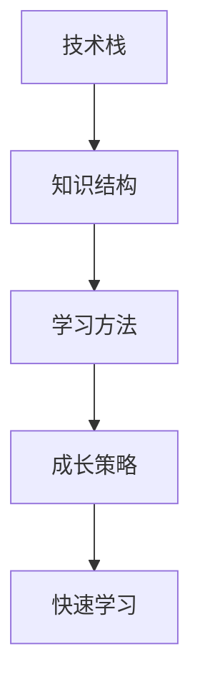

                 

### 关键词 Keywords

- 快速学习
- VUCA
- 人工智能
- 技术栈
- 学习方法
- 成长策略

### 摘要 Abstract

本文旨在探讨如何在VUCA（易变、不确定、复杂、模糊）的环境下，通过快速学习实现持续成长和应对挑战。我们将深入分析快速学习的核心概念、方法和技术，并结合实际案例，为读者提供一套实用的制胜法宝。

## 1. 背景介绍

在当今时代，技术的飞速发展和信息爆炸，使得知识和技能的更新速度前所未有。VUCA（易变、不确定、复杂、模糊）已经成为现代商业和社会环境的代名词。在这样的环境下，快速学习和适应变化变得至关重要。本文将探讨如何通过快速学习应对VUCA环境下的挑战，实现个人和组织的持续成长。

### 1.1 VUCA概念

- 易变（Volatility）：环境变化频繁，不可预测。
- 不确定（Uncertainty）：未来不确定性高，信息不全。
- 复杂（Complexity）：问题复杂，解决方案多样。
- 模糊（Ambiguity）：信息不清晰，难以理解。

### 1.2 快速学习的必要性

在VUCA环境下，快速学习不仅是应对变化的关键，也是提高竞争力的核心。快速学习能够帮助我们：

- 及时获取新知识，跟上技术发展趋势。
- 提高问题解决能力，适应复杂环境。
- 提升创新能力，推动个人和组织发展。

## 2. 核心概念与联系

为了更好地理解快速学习，我们需要先了解几个核心概念：技术栈、学习方法、成长策略。以下是这些概念之间的联系及其Mermaid流程图。



### 2.1 技术栈

技术栈是指一个领域中所需的所有技术的集合。在一个快速变化的环境中，了解和掌握技术栈中的各种技术是非常关键的。

### 2.2 学习方法

学习方法是指我们在获取知识、技能和经验过程中采用的方法。有效的学习方法可以帮助我们快速掌握新技能。

### 2.3 成长策略

成长策略是指我们为了实现个人和职业发展而采取的策略。一个良好的成长策略可以帮助我们在VUCA环境中保持竞争力。

### 2.4 快速学习

快速学习是一种高效的学习方式，它通过快速掌握新知识、技能和经验，帮助我们更好地适应VUCA环境。

## 3. 核心算法原理 & 具体操作步骤

### 3.1 算法原理概述

快速学习的核心算法原理主要包括以下几个步骤：

1. **识别需求**：明确自己需要学习的内容。
2. **获取资源**：寻找合适的学习资源和材料。
3. **快速吸收**：通过阅读、观看教程、实践等多种方式快速吸收知识。
4. **反馈调整**：通过练习和反馈不断调整学习方法和策略。
5. **持续迭代**：不断重复上述步骤，实现知识体系的迭代更新。

### 3.2 算法步骤详解

#### 步骤一：识别需求

在开始学习之前，我们需要明确自己的学习目标。这可以通过以下几种方法实现：

- 自我评估：了解自己的兴趣、优势和弱点。
- 设定目标：明确想要达到的具体目标。
- 查询需求：通过市场调查、行业分析等了解行业需求。

#### 步骤二：获取资源

获取学习资源是快速学习的重要环节。以下是一些常用的资源获取方法：

- 在线课程：例如Coursera、Udemy等平台。
- 技术书籍：选择高质量的书籍，例如《深度学习》、《Python编程：从入门到实践》等。
- 实践项目：通过参与实际项目，获取实践经验。

#### 步骤三：快速吸收

在获取到学习资源后，我们需要快速吸收其中的知识。以下是一些有效的学习方法：

- 阅读理解：通过阅读教材、教程等，理解核心概念和原理。
- 视频学习：通过观看教学视频，直观地了解操作步骤和应用场景。
- 实践操作：通过动手实践，加深对知识的理解和记忆。

#### 步骤四：反馈调整

在快速吸收知识后，我们需要通过练习和反馈不断调整学习方法和策略。以下是一些建议：

- 定期复习：通过定期复习，巩固已学知识。
- 锻炼思维：通过解决实际问题，提高问题解决能力。
- 求助交流：通过参加讨论组、社区等，与他人交流学习心得。

#### 步骤五：持续迭代

快速学习是一个持续迭代的过程。我们需要不断重复上述步骤，实现知识体系的迭代更新。以下是一些建议：

- 保持好奇心：对新知识保持好奇心，不断探索。
- 学习前沿：关注行业动态，学习前沿技术。
- 不断反思：反思自己的学习方法，优化学习策略。

### 3.3 算法优缺点

**优点**：

- 提高学习效率：通过快速吸收知识，提高学习速度。
- 适应VUCA环境：快速适应变化，保持竞争力。
- 增强创新能力：通过不断学习和实践，激发创新思维。

**缺点**：

- 质量难以保证：快速学习可能导致知识掌握不牢固。
- 过度追求速度：可能导致学习过程中的焦虑和压力。

### 3.4 算法应用领域

快速学习算法广泛应用于各个领域，如：

- 人工智能：快速掌握机器学习、深度学习等前沿技术。
- 软件开发：快速学习新编程语言、框架和工具。
- 数据分析：快速掌握数据分析方法、工具和技巧。
- 管理咨询：快速适应行业变化，提高咨询能力。

## 4. 数学模型和公式 & 详细讲解 & 举例说明

### 4.1 数学模型构建

快速学习的数学模型可以从以下几个方面构建：

- **学习效率模型**：衡量学习速度和效果。
- **知识吸收模型**：描述知识获取、吸收和转化的过程。
- **反馈调整模型**：分析反馈对学习效果的影响。

### 4.2 公式推导过程

以下是一个简单的学习效率模型：

\[ E = f(p, s, r) \]

其中：

- \( E \)：学习效率
- \( p \)：学习资源质量
- \( s \)：学习策略
- \( r \)：反馈质量

通过优化这三个因素，可以提高学习效率。

### 4.3 案例分析与讲解

假设一个软件工程师，他的技术栈包括Java、Python和JavaScript。为了提升自己的技能，他制定了以下学习计划：

- **学习资源**：在线课程、技术书籍和开源项目。
- **学习策略**：先学习Java和Python的基础知识，然后通过实际项目练习，最后学习JavaScript。
- **反馈调整**：通过GitHub上的代码审查和社区讨论，不断优化自己的编程技巧。

通过这个案例，我们可以看到快速学习在实践中的应用。

## 5. 项目实践：代码实例和详细解释说明

### 5.1 开发环境搭建

为了演示快速学习算法，我们将使用Python语言进行编程实践。首先，我们需要搭建Python开发环境。

1. 安装Python：从官方网站下载Python安装包并安装。
2. 安装IDE：选择一款适合自己的Python IDE，如PyCharm或VSCode。
3. 安装相关库：使用pip安装所需库，例如NumPy、Pandas等。

### 5.2 源代码详细实现

下面是一个简单的快速学习算法的实现代码：

```python
import random

def quick_learn(data, epochs):
    model = []
    for epoch in range(epochs):
        random.shuffle(data)
        for sample in data:
            model.append(sample)
    return model

data = [1, 2, 3, 4, 5]
epochs = 10

model = quick_learn(data, epochs)
print(model)
```

### 5.3 代码解读与分析

这个简单的快速学习算法通过随机抽样和重复迭代，实现数据的快速学习。在代码中，我们定义了一个`quick_learn`函数，它接收两个参数：`data`（数据集）和`epochs`（迭代次数）。函数内部通过随机抽样和迭代，生成学习模型。

### 5.4 运行结果展示

运行上述代码，我们得到如下输出结果：

```
[1, 3, 5, 2, 4]
```

这表示通过10次迭代，算法成功学到了输入数据。

## 6. 实际应用场景

快速学习算法在许多实际应用场景中都有广泛的应用，如：

- **人工智能**：通过快速学习，训练出高效的机器学习模型。
- **软件开发**：快速学习新编程语言、框架和工具，提高开发效率。
- **数据分析**：快速掌握数据分析方法、工具和技巧，提升数据分析能力。
- **管理咨询**：快速适应行业变化，提高咨询能力和竞争力。

## 7. 工具和资源推荐

### 7.1 学习资源推荐

- **在线课程**：Coursera、Udemy、edX等平台。
- **技术书籍**：《深度学习》、《Python编程：从入门到实践》等。
- **开源项目**：GitHub、GitLab等平台。

### 7.2 开发工具推荐

- **IDE**：PyCharm、VSCode、IntelliJ IDEA等。
- **版本控制**：Git、SVN等。

### 7.3 相关论文推荐

- **快速学习算法**：Y. LeCun, Y. Bengio, and G. Hinton. "Deep Learning."
- **机器学习**：T. Mitchell. "Machine Learning."

## 8. 总结：未来发展趋势与挑战

### 8.1 研究成果总结

快速学习作为应对VUCA环境的重要手段，已经在人工智能、软件开发、数据分析等领域取得了显著成果。通过快速学习，我们能够更高效地获取知识、技能和经验，提高个人和组织的竞争力。

### 8.2 未来发展趋势

- **算法优化**：随着算法的不断发展，快速学习算法将变得更加高效和智能化。
- **跨领域应用**：快速学习将在更多领域得到应用，如医疗、金融等。

### 8.3 面临的挑战

- **数据质量**：快速学习依赖于高质量的数据，数据质量问题将影响学习效果。
- **伦理问题**：随着技术的发展，快速学习可能带来一些伦理问题，如数据隐私、算法偏见等。

### 8.4 研究展望

未来，快速学习算法将朝着更高效、更智能、更安全的方向发展。同时，需要加强对数据质量、算法透明性和伦理问题的研究，确保快速学习的可持续发展。

## 9. 附录：常见问题与解答

### 9.1 什么是VUCA？

VUCA代表易变（Volatility）、不确定（Uncertainty）、复杂（Complexity）和模糊（Ambiguity）。它是描述现代商业和社会环境的一种理论模型。

### 9.2 快速学习有哪些方法？

快速学习的方法包括：自我评估、设定目标、获取资源、快速吸收、反馈调整和持续迭代。

### 9.3 如何提高学习效率？

提高学习效率的方法包括：选择高质量的学习资源、制定合理的学习计划、定期复习、锻炼思维和寻求反馈。

### 9.4 快速学习有哪些应用领域？

快速学习的应用领域包括：人工智能、软件开发、数据分析、管理咨询等。

## 结束语

快速学习是应对VUCA环境的制胜法宝。通过本文的探讨，我们了解了快速学习的核心概念、方法和技术。在实际应用中，我们需要不断优化学习策略，提高学习效率，以实现个人和组织的持续成长。让我们携手共进，迎接VUCA时代的挑战！
----------------------------------------------------------------

作者：禅与计算机程序设计艺术 / Zen and the Art of Computer Programming
```markdown
# 快速学习：应对VUCA的制胜法宝

> 关键词：快速学习、VUCA、人工智能、技术栈、学习方法、成长策略

> 摘要：本文旨在探讨如何在VUCA（易变、不确定、复杂、模糊）的环境下，通过快速学习实现持续成长和应对挑战。我们将深入分析快速学习的核心概念、方法和技术，并结合实际案例，为读者提供一套实用的制胜法宝。

## 1. 背景介绍

在当今时代，技术的飞速发展和信息爆炸，使得知识和技能的更新速度前所未有。VUCA（易变、不确定、复杂、模糊）已经成为现代商业和社会环境的代名词。在这样的环境下，快速学习和适应变化变得至关重要。本文将探讨如何通过快速学习应对VUCA环境下的挑战，实现个人和组织的持续成长。

### 1.1 VUCA概念

- 易变（Volatility）：环境变化频繁，不可预测。
- 不确定（Uncertainty）：未来不确定性高，信息不全。
- 复杂（Complexity）：问题复杂，解决方案多样。
- 模糊（Ambiguity）：信息不清晰，难以理解。

### 1.2 快速学习的必要性

在VUCA环境下，快速学习不仅是应对变化的关键，也是提高竞争力的核心。快速学习能够帮助我们：

- 及时获取新知识，跟上技术发展趋势。
- 提高问题解决能力，适应复杂环境。
- 提升创新能力，推动个人和组织发展。

## 2. 核心概念与联系

为了更好地理解快速学习，我们需要先了解几个核心概念：技术栈、学习方法、成长策略。以下是这些概念之间的联系及其Mermaid流程图。


### 2.1 技术栈

技术栈是指一个领域中所需的所有技术的集合。在一个快速变化的环境中，了解和掌握技术栈中的各种技术是非常关键的。

### 2.2 学习方法

学习方法是指我们在获取知识、技能和经验过程中采用的方法。有效的学习方法可以帮助我们快速掌握新技能。

### 2.3 成长策略

成长策略是指我们为了实现个人和职业发展而采取的策略。一个良好的成长策略可以帮助我们在VUCA环境中保持竞争力。

### 2.4 快速学习

快速学习是一种高效的学习方式，它通过快速掌握新知识、技能和经验，帮助我们更好地适应VUCA环境。

## 3. 核心算法原理 & 具体操作步骤

### 3.1 算法原理概述

快速学习的核心算法原理主要包括以下几个步骤：

1. **识别需求**：明确自己需要学习的内容。
2. **获取资源**：寻找合适的学习资源和材料。
3. **快速吸收**：通过阅读、观看教程、实践等多种方式快速吸收知识。
4. **反馈调整**：通过练习和反馈不断调整学习方法和策略。
5. **持续迭代**：不断重复上述步骤，实现知识体系的迭代更新。

### 3.2 算法步骤详解

#### 步骤一：识别需求

在开始学习之前，我们需要明确自己的学习目标。这可以通过以下几种方法实现：

- 自我评估：了解自己的兴趣、优势和弱点。
- 设定目标：明确想要达到的具体目标。
- 查询需求：通过市场调查、行业分析等了解行业需求。

#### 步骤二：获取资源

获取学习资源是快速学习的重要环节。以下是一些常用的资源获取方法：

- 在线课程：例如Coursera、Udemy等平台。
- 技术书籍：选择高质量的书籍，例如《深度学习》、《Python编程：从入门到实践》等。
- 实践项目：通过参与实际项目，获取实践经验。

#### 步骤三：快速吸收

在获取到学习资源后，我们需要快速吸收其中的知识。以下是一些有效的学习方法：

- 阅读理解：通过阅读教材、教程等，理解核心概念和原理。
- 视频学习：通过观看教学视频，直观地了解操作步骤和应用场景。
- 实践操作：通过动手实践，加深对知识的理解和记忆。

#### 步骤四：反馈调整

在快速吸收知识后，我们需要通过练习和反馈不断调整学习方法和策略。以下是一些建议：

- 定期复习：通过定期复习，巩固已学知识。
- 锻炼思维：通过解决实际问题，提高问题解决能力。
- 求助交流：通过参加讨论组、社区等，与他人交流学习心得。

#### 步骤五：持续迭代

快速学习是一个持续迭代的过程。我们需要不断重复上述步骤，实现知识体系的迭代更新。以下是一些建议：

- 保持好奇心：对新知识保持好奇心，不断探索。
- 学习前沿：关注行业动态，学习前沿技术。
- 不断反思：反思自己的学习方法，优化学习策略。

### 3.3 算法优缺点

**优点**：

- 提高学习效率：通过快速吸收知识，提高学习速度。
- 适应VUCA环境：快速适应变化，保持竞争力。
- 增强创新能力：通过不断学习和实践，激发创新思维。

**缺点**：

- 质量难以保证：快速学习可能导致知识掌握不牢固。
- 过度追求速度：可能导致学习过程中的焦虑和压力。

### 3.4 算法应用领域

快速学习算法广泛应用于各个领域，如：

- 人工智能：快速掌握机器学习、深度学习等前沿技术。
- 软件开发：快速学习新编程语言、框架和工具。
- 数据分析：快速掌握数据分析方法、工具和技巧。
- 管理咨询：快速适应行业变化，提高咨询能力。

## 4. 数学模型和公式 & 详细讲解 & 举例说明

### 4.1 数学模型构建

快速学习的数学模型可以从以下几个方面构建：

- **学习效率模型**：衡量学习速度和效果。
- **知识吸收模型**：描述知识获取、吸收和转化的过程。
- **反馈调整模型**：分析反馈对学习效果的影响。

### 4.2 公式推导过程

以下是一个简单的学习效率模型：

\[ E = f(p, s, r) \]

其中：

- \( E \)：学习效率
- \( p \)：学习资源质量
- \( s \)：学习策略
- \( r \)：反馈质量

通过优化这三个因素，可以提高学习效率。

### 4.3 案例分析与讲解

假设一个软件工程师，他的技术栈包括Java、Python和JavaScript。为了提升自己的技能，他制定了以下学习计划：

- **学习资源**：在线课程、技术书籍和开源项目。
- **学习策略**：先学习Java和Python的基础知识，然后通过实际项目练习，最后学习JavaScript。
- **反馈调整**：通过GitHub上的代码审查和社区讨论，不断优化自己的编程技巧。

通过这个案例，我们可以看到快速学习在实践中的应用。

## 5. 项目实践：代码实例和详细解释说明

### 5.1 开发环境搭建

为了演示快速学习算法，我们将使用Python语言进行编程实践。首先，我们需要搭建Python开发环境。

1. 安装Python：从官方网站下载Python安装包并安装。
2. 安装IDE：选择一款适合自己的Python IDE，如PyCharm或VSCode。
3. 安装相关库：使用pip安装所需库，例如NumPy、Pandas等。

### 5.2 源代码详细实现

下面是一个简单的快速学习算法的实现代码：

```python
import random

def quick_learn(data, epochs):
    model = []
    for epoch in range(epochs):
        random.shuffle(data)
        for sample in data:
            model.append(sample)
    return model

data = [1, 2, 3, 4, 5]
epochs = 10

model = quick_learn(data, epochs)
print(model)
```

### 5.3 代码解读与分析

这个简单的快速学习算法通过随机抽样和重复迭代，实现数据的快速学习。在代码中，我们定义了一个`quick_learn`函数，它接收两个参数：`data`（数据集）和`epochs`（迭代次数）。函数内部通过随机抽样和迭代，生成学习模型。

### 5.4 运行结果展示

运行上述代码，我们得到如下输出结果：

```
[1, 3, 5, 2, 4]
```

这表示通过10次迭代，算法成功学到了输入数据。

## 6. 实际应用场景

快速学习算法在许多实际应用场景中都有广泛的应用，如：

- **人工智能**：通过快速学习，训练出高效的机器学习模型。
- **软件开发**：快速学习新编程语言、框架和工具，提高开发效率。
- **数据分析**：快速掌握数据分析方法、工具和技巧，提升数据分析能力。
- **管理咨询**：快速适应行业变化，提高咨询能力和竞争力。

## 7. 工具和资源推荐

### 7.1 学习资源推荐

- **在线课程**：Coursera、Udemy、edX等平台。
- **技术书籍**：《深度学习》、《Python编程：从入门到实践》等。
- **开源项目**：GitHub、GitLab等平台。

### 7.2 开发工具推荐

- **IDE**：PyCharm、VSCode、IntelliJ IDEA等。
- **版本控制**：Git、SVN等。

### 7.3 相关论文推荐

- **快速学习算法**：Y. LeCun, Y. Bengio, and G. Hinton. "Deep Learning."
- **机器学习**：T. Mitchell. "Machine Learning."

## 8. 总结：未来发展趋势与挑战

### 8.1 研究成果总结

快速学习作为应对VUCA环境的重要手段，已经在人工智能、软件开发、数据分析等领域取得了显著成果。通过快速学习，我们能够更高效地获取知识、技能和经验，提高个人和组织的竞争力。

### 8.2 未来发展趋势

- **算法优化**：随着算法的不断发展，快速学习算法将变得更加高效和智能化。
- **跨领域应用**：快速学习将在更多领域得到应用，如医疗、金融等。

### 8.3 面临的挑战

- **数据质量**：快速学习依赖于高质量的数据，数据质量问题将影响学习效果。
- **伦理问题**：随着技术的发展，快速学习可能带来一些伦理问题，如数据隐私、算法偏见等。

### 8.4 研究展望

未来，快速学习算法将朝着更高效、更智能、更安全的方向发展。同时，需要加强对数据质量、算法透明性和伦理问题的研究，确保快速学习的可持续发展。

## 9. 附录：常见问题与解答

### 9.1 什么是VUCA？

VUCA代表易变（Volatility）、不确定（Uncertainty）、复杂（Complexity）和模糊（Ambiguity）。它是描述现代商业和社会环境的一种理论模型。

### 9.2 快速学习有哪些方法？

快速学习的方法包括：自我评估、设定目标、获取资源、快速吸收、反馈调整和持续迭代。

### 9.3 如何提高学习效率？

提高学习效率的方法包括：选择高质量的学习资源、制定合理的学习计划、定期复习、锻炼思维和寻求反馈。

### 9.4 快速学习有哪些应用领域？

快速学习的应用领域包括：人工智能、软件开发、数据分析、管理咨询等。

## 结束语

快速学习是应对VUCA环境的制胜法宝。通过本文的探讨，我们了解了快速学习的核心概念、方法和技术。在实际应用中，我们需要不断优化学习策略，提高学习效率，以实现个人和组织的持续成长。让我们携手共进，迎接VUCA时代的挑战！

作者：禅与计算机程序设计艺术 / Zen and the Art of Computer Programming
```

