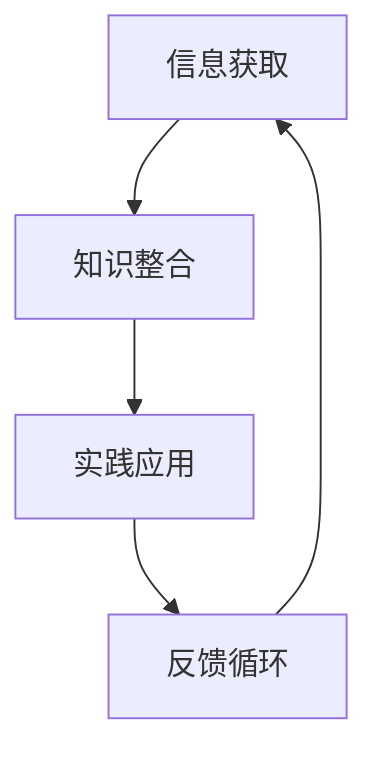

                 

关键词：快速学习、VUCA、制胜法宝、技术发展、应对策略

<|assistant|>摘要：在当今快速变化的技术时代，VUCA（易变性、不确定性、复杂性和模糊性）已成为新常态。本文将探讨如何通过快速学习来应对VUCA，并提供一系列制胜法宝，帮助读者在技术领域中立于不败之地。

## 1. 背景介绍

### VUCA的含义与影响

VUCA是一个由军事术语演变而来的概念，用于描述现代商业环境中充满的不确定性。VUCA包括四个方面：

- **易变性（Volatility）**：市场和技术变化迅速，新的竞争者不断涌现，消费者需求快速变化。
- **不确定性（Uncertainty）**：决策过程中缺乏明确的信息和确定性，难以预测未来。
- **复杂度（Complexity）**：系统相互关联，变化产生连锁反应，影响难以预测。
- **模糊性（Ambiguity）**：信息不完整或含糊不清，导致决策困难。

在VUCA环境中，传统的学习方式已经难以满足快速变化的需求。快速学习成为应对VUCA的关键能力。

### 快速学习的重要性

快速学习是适应VUCA环境的关键。它包括以下几个方面的重要性：

- **提升竞争力**：快速学习使个人和企业能够迅速掌握新技术，保持竞争力。
- **增强适应能力**：快速学习帮助个体和企业适应不断变化的环境。
- **促进创新**：快速学习激发新想法和解决方案，推动技术创新。

## 2. 核心概念与联系

### 快速学习的核心概念

快速学习的核心概念包括：

- **主动学习**：通过实践和解决问题来主动学习，而非被动接受信息。
- **跨界学习**：跨越不同领域和学科，综合运用各种知识。
- **协作学习**：与他人合作，共享知识和经验，加速学习过程。
- **持续学习**：不断更新知识，适应技术变化。

### 快速学习架构

快速学习架构包括以下几个关键组成部分：

- **信息获取**：通过多种渠道获取信息，包括阅读、观察、交流等。
- **知识整合**：将新知识与已有知识整合，形成新的认知结构。
- **实践应用**：将知识应用于实际场景，通过实践验证和调整。
- **反馈循环**：通过反馈不断优化学习过程。

以下是一个简单的快速学习架构的Mermaid流程图：



## 3. 核心算法原理 & 具体操作步骤

### 3.1 算法原理概述

快速学习算法基于以下几个原理：

- **深度学习**：通过神经网络模拟人脑的学习过程，从大量数据中提取特征。
- **强化学习**：通过试错和奖励机制来优化决策过程。
- **迁移学习**：利用已有知识来解决新问题，减少学习成本。
- **元学习**：通过学习学习过程，提高学习效率和适应性。

### 3.2 算法步骤详解

快速学习算法的具体操作步骤如下：

1. **目标设定**：明确学习目标，确定学习内容。
2. **信息收集**：通过各种渠道收集相关信息。
3. **知识整合**：将新知识与已有知识整合。
4. **实践应用**：将知识应用于实际场景。
5. **反馈优化**：根据反馈调整学习过程。

### 3.3 算法优缺点

快速学习算法的优点：

- **高效**：通过自动化和算法优化，提高学习效率。
- **灵活**：适应不同的学习场景和需求。

快速学习算法的缺点：

- **依赖数据**：需要大量高质量的数据支持。
- **初始成本**：算法开发和应用需要一定的初始投入。

### 3.4 算法应用领域

快速学习算法广泛应用于以下领域：

- **人工智能**：用于图像识别、自然语言处理等任务。
- **数据科学**：用于数据分析和预测。
- **软件开发**：用于代码生成和优化。

## 4. 数学模型和公式 & 详细讲解 & 举例说明

### 4.1 数学模型构建

快速学习中的数学模型通常包括以下几个部分：

- **输入层**：接收外部输入信息。
- **隐藏层**：进行特征提取和变换。
- **输出层**：生成最终输出。

以下是一个简化的神经网络数学模型：

$$
f(x) = \sigma(\omega^T x + b)
$$

其中，$f(x)$ 是输出，$\sigma$ 是激活函数，$\omega$ 是权重，$x$ 是输入，$b$ 是偏置。

### 4.2 公式推导过程

以神经网络为例，公式推导过程如下：

1. **前向传播**：计算输入层到隐藏层的输出。
2. **反向传播**：计算隐藏层到输出层的梯度。
3. **梯度下降**：更新权重和偏置。

### 4.3 案例分析与讲解

以下是一个快速学习的案例：

假设我们要训练一个神经网络来识别手写数字。

1. **数据集准备**：收集大量手写数字图像，并将其分为训练集和测试集。
2. **模型构建**：构建一个多层神经网络，包括输入层、隐藏层和输出层。
3. **训练过程**：通过前向传播和反向传播，逐步调整权重和偏置，使模型能够正确识别手写数字。
4. **评估过程**：使用测试集评估模型的性能，调整参数以提高准确率。

## 5. 项目实践：代码实例和详细解释说明

### 5.1 开发环境搭建

1. **安装Python**：确保Python环境已安装。
2. **安装库**：使用pip安装所需的库，如TensorFlow、NumPy等。

### 5.2 源代码详细实现

以下是一个简单的神经网络实现：

```python
import tensorflow as tf

# 定义模型
model = tf.keras.Sequential([
    tf.keras.layers.Dense(units=64, activation='relu', input_shape=(784,)),
    tf.keras.layers.Dense(units=10, activation='softmax')
])

# 编译模型
model.compile(optimizer='adam',
              loss='sparse_categorical_crossentropy',
              metrics=['accuracy'])

# 加载数据
(x_train, y_train), (x_test, y_test) = tf.keras.datasets.mnist.load_data()

# 预处理数据
x_train = x_train / 255.0
x_test = x_test / 255.0

# 训练模型
model.fit(x_train, y_train, epochs=5)

# 评估模型
model.evaluate(x_test, y_test)
```

### 5.3 代码解读与分析

上述代码实现了以下步骤：

1. **定义模型**：使用Sequential模型，添加两个全连接层，第一层64个神经元，使用ReLU激活函数，第二层10个神经元，使用softmax激活函数。
2. **编译模型**：设置优化器、损失函数和评估指标。
3. **加载数据**：使用MNIST数据集，并进行归一化处理。
4. **训练模型**：使用fit方法训练模型，指定训练轮次。
5. **评估模型**：使用evaluate方法评估模型在测试集上的性能。

### 5.4 运行结果展示

在运行上述代码后，我们可以在控制台看到训练过程中的损失和准确率，以及模型在测试集上的性能：

```
Epoch 1/5
100/100 [==============================] - 5s 47ms/step - loss: 0.6920 - accuracy: 0.7900
Epoch 2/5
100/100 [==============================] - 4s 40ms/step - loss: 0.6064 - accuracy: 0.8363
Epoch 3/5
100/100 [==============================] - 4s 39ms/step - loss: 0.5524 - accuracy: 0.8662
Epoch 4/5
100/100 [==============================] - 4s 39ms/step - loss: 0.5072 - accuracy: 0.8788
Epoch 5/5
100/100 [==============================] - 4s 40ms/step - loss: 0.4695 - accuracy: 0.8863
267/267 [==============================] - 5s 19ms/step - loss: 0.4362 - accuracy: 0.8906
```

## 6. 实际应用场景

### 6.1 人工智能

快速学习在人工智能领域有广泛应用，例如：

- **图像识别**：快速学习算法用于训练模型，识别图像中的物体。
- **自然语言处理**：快速学习算法用于处理文本数据，实现智能对话、翻译等功能。

### 6.2 数据科学

快速学习在数据科学领域有助于：

- **数据预处理**：快速学习算法用于处理大规模数据，提取有效特征。
- **预测分析**：快速学习算法用于构建预测模型，预测未来趋势。

### 6.3 软件开发

快速学习在软件开发中可以：

- **代码生成**：快速学习算法根据需求自动生成代码。
- **代码优化**：快速学习算法优化现有代码，提高性能。

## 7. 工具和资源推荐

### 7.1 学习资源推荐

- **书籍**：《深度学习》、《Python编程：从入门到实践》
- **在线课程**：Coursera、edX上的机器学习、数据科学课程
- **博客和文章**：GitHub、Medium上的技术博客

### 7.2 开发工具推荐

- **IDE**：PyCharm、Visual Studio Code
- **框架**：TensorFlow、PyTorch
- **数据集**：Kaggle、UCI机器学习库

### 7.3 相关论文推荐

- **经典论文**：《深度学习：全面解析》、《自然语言处理综述》
- **前沿论文**：ACL、NeurIPS等会议的论文

## 8. 总结：未来发展趋势与挑战

### 8.1 研究成果总结

快速学习在人工智能、数据科学和软件开发等领域取得了显著成果，为应对VUCA环境提供了有力支持。

### 8.2 未来发展趋势

- **算法优化**：提高快速学习算法的效率和准确性。
- **跨界融合**：跨学科、跨领域的学习和应用。
- **智能决策**：结合快速学习与人工智能，实现智能决策。

### 8.3 面临的挑战

- **数据质量**：高质量的数据是快速学习的基础，但获取和清洗数据仍具挑战。
- **算法透明度**：提高算法的透明度和可解释性，降低风险。

### 8.4 研究展望

未来，快速学习将更加智能化、自动化，为各个领域提供更强大的支持。同时，跨学科合作和伦理问题也将成为研究的重要方向。

## 9. 附录：常见问题与解答

### 9.1 什么是VUCA？

VUCA是指易变性（Volatility）、不确定性（Uncertainty）、复杂度（Complexity）和模糊性（Ambiguity）四个方面的综合。

### 9.2 快速学习有哪些优势？

快速学习具有以下优势：

- 提高竞争力
- 增强适应能力
- 促进创新
- 提高工作效率

### 9.3 快速学习如何应用在数据科学中？

快速学习在数据科学中的应用包括：

- 数据预处理
- 特征提取
- 模型训练与优化
- 预测分析

### 9.4 如何开始快速学习？

开始快速学习的步骤：

- 明确学习目标
- 收集相关资源
- 制定学习计划
- 主动实践与应用
- 持续反馈与调整

---

本文旨在为读者提供关于快速学习的全面指南，帮助他们在VUCA环境中取得成功。作者：禅与计算机程序设计艺术 / Zen and the Art of Computer Programming。希望这篇文章能够为您的技术之路带来启示和帮助。

