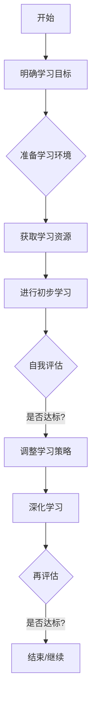

                 

关键词：快速学习、不败之地、学习方法、认知效率、专业技能、知识体系、实践应用、未来展望

> 摘要：本文旨在探讨如何通过科学的快速学习方法，实现个人认知效率的提升，从而在专业技能领域立于不败之地。文章从理论基础出发，结合实践案例，提出了一系列有效提升学习效果的策略，为读者提供了一条通向成功与卓越的路径。

## 1. 背景介绍

在当今快速变革的时代，知识更新速度空前加快，人们对于学习效率和质量的要求也日益提高。快速学习不仅是一种应对知识爆炸的必要手段，更是个人职业发展和终身学习的关键。然而，如何才能真正做到快速学习，并在竞争激烈的领域中立于不败之地，这是每一个寻求进步的个体都需要深思的问题。

本文将围绕以下核心问题展开讨论：
- 什么是快速学习？
- 快速学习背后的理论基础是什么？
- 如何构建有效的快速学习策略？
- 快速学习在不同领域的具体应用是什么？
- 快速学习对未来个人发展意味着什么？

通过对上述问题的深入探讨，我们希望能够为读者提供一些实用的方法和启示，帮助他们在专业技能和知识领域实现快速提升，成为行业内的佼佼者。

## 2. 核心概念与联系

### 2.1 学习理论

在探讨快速学习之前，我们需要理解一些核心的学习理论，这些理论为我们提供了理论基础和方法论指导。

#### 2.1.1 知识获取模型（KAM）

知识获取模型（KAM）描述了人类如何获取、处理和存储知识。它通常包括以下几个阶段：
- **感知（Perception）**：通过感官接收外界信息。
- **编码（Encoding）**：将感知到的信息转化为大脑可以处理的形式。
- **存储（Storage）**：将编码后的信息存储在大脑中。
- **检索（Retrieval）**：在需要时从大脑中调取信息。

#### 2.1.2 反馈机制

学习过程中的反馈机制对于知识的掌握至关重要。正反馈能够增强学习效果，而负反馈则有助于识别和纠正错误。在快速学习中，及时且有效的反馈是不可或缺的。

#### 2.1.3 元认知策略

元认知策略是指个体对自己的认知过程进行认知的策略。包括自我监控、自我评估和自我调节等。这些策略有助于提高学习效率，实现快速学习。

### 2.2 学习效率与认知负荷

学习效率与认知负荷密切相关。认知负荷理论指出，当认知负荷过高时，学习效率会下降。因此，快速学习的一个重要目标是优化认知负荷，使其保持在最佳水平。

### 2.3 Mermaid 流程图

以下是一个Mermaid流程图，描述了快速学习的基本流程：



### 2.4 快速学习框架

为了实现快速学习，我们需要构建一个系统化的学习框架。以下是一个简化的快速学习框架：

#### 2.4.1 确定学习目标

明确具体、可衡量的学习目标，有助于集中精力和资源。

#### 2.4.2 准备学习环境

包括物理环境和心理环境，确保有一个高效的学习环境。

#### 2.4.3 获取学习资源

选择合适的学习资源，包括书籍、课程、在线资料等。

#### 2.4.4 进行初步学习

快速浏览和阅读，获取整体知识框架。

#### 2.4.5 自我评估

通过测试或练习，评估学习效果。

#### 2.4.6 调整学习策略

根据评估结果，调整学习方法和进度。

#### 2.4.7 深化学习

针对薄弱环节，进行深入学习。

#### 2.4.8 再评估

再次评估学习效果，确保目标达成。

#### 2.4.9 实践应用

将所学知识应用到实际工作中，加深理解和记忆。

#### 2.4.10 反馈与迭代

根据反馈，不断优化学习策略。

## 3. 核心算法原理 & 具体操作步骤

### 3.1 算法原理概述

快速学习算法的原理主要基于以下几个核心思想：

- **分阶段学习**：将学习过程分为不同的阶段，每个阶段都有明确的目标和任务。
- **目标导向**：始终围绕学习目标进行，确保学习过程具有明确的方向。
- **反馈循环**：通过持续的反馈和评估，不断调整学习策略，提高学习效率。
- **认知负荷优化**：通过合理的安排学习内容和时间，保持认知负荷在最佳水平。

### 3.2 算法步骤详解

以下为快速学习算法的具体操作步骤：

#### 3.2.1 确定学习目标

明确具体、可衡量的学习目标，例如掌握某种编程语言、通过某项专业认证等。

#### 3.2.2 分析学习内容

分析学习内容，确定核心知识点和难点，为后续学习做准备。

#### 3.2.3 制定学习计划

根据学习目标和内容，制定详细的学习计划，包括每天的学习时间、学习内容等。

#### 3.2.4 获取学习资源

选择合适的书籍、课程、在线资料等学习资源，确保质量高、适用性强。

#### 3.2.5 进行初步学习

按照学习计划，进行初步学习，获取整体知识框架。

#### 3.2.6 自我评估

通过测试或练习，评估学习效果，识别薄弱环节。

#### 3.2.7 调整学习策略

根据评估结果，调整学习方法和进度，例如增加练习时间、更换学习资源等。

#### 3.2.8 深化学习

针对薄弱环节，进行深入学习，确保知识掌握牢固。

#### 3.2.9 实践应用

将所学知识应用到实际工作中，加深理解和记忆。

#### 3.2.10 反馈与迭代

根据反馈，不断优化学习策略，确保学习效果持续提升。

### 3.3 算法优缺点

**优点**：

- **高效性**：通过明确的计划和反馈循环，快速学习算法能够显著提高学习效率。
- **灵活性**：算法可以根据个人情况进行调整，适应不同的学习场景。
- **系统性**：算法提供了一个系统化的学习框架，有助于构建完整的知识体系。

**缺点**：

- **初始投入较大**：制定学习计划和获取学习资源需要一定的时间和精力。
- **需持续反馈**：反馈是快速学习的关键，但需要持续的时间和精力。

### 3.4 算法应用领域

快速学习算法适用于多个领域，包括但不限于：

- **IT技术**：编程语言、软件开发、数据科学等。
- **医学**：医学知识、临床技能等。
- **金融**：金融市场、投资策略等。
- **教育**：教学设计、课程开发等。

## 4. 数学模型和公式 & 详细讲解 & 举例说明

### 4.1 数学模型构建

为了更好地理解快速学习的过程，我们可以构建一个简单的数学模型。该模型包括以下几个关键参数：

- **学习效率（η）**：表示单位时间内学习到的知识量。
- **认知负荷（L）**：表示学习过程中大脑的负担程度。
- **目标达成度（D）**：表示学习目标实现的程度。

### 4.2 公式推导过程

根据上述参数，我们可以推导出以下公式：

\[ \eta = \frac{D}{t} \]

其中，\( t \) 为学习时间。

### 4.3 案例分析与讲解

假设某人想要在一个月内掌握Python编程语言。他的学习效率为每天1小时，认知负荷为0.8。目标达成度为0.8。我们可以使用上述公式计算他的目标达成度：

\[ D = \eta \times t = 1 \times 30 \times 0.8 = 24 \]

因此，他的目标达成度为24/30=0.8，即80%。这个结果表明，在一个月的时间内，他能够掌握大约80%的Python编程语言知识。

### 4.4 实际应用

以下是一个实际应用案例：

- **目标**：掌握数据结构。
- **学习效率**：每天1小时。
- **认知负荷**：0.6。
- **学习时间**：2周。

使用上述公式计算目标达成度：

\[ D = \eta \times t = 1 \times 14 \times 0.6 = 8.4 \]

因此，在2周的时间内，学习效率为每天1小时，认知负荷为0.6的学习者可以掌握大约8.4个数据结构的知识点。这为学习者提供了一个具体的参考指标，帮助他们评估学习效果和进度。

## 5. 项目实践：代码实例和详细解释说明

### 5.1 开发环境搭建

为了更好地演示快速学习的应用，我们选择一个实际的项目——一个简单的Python程序，用于计算斐波那契数列。

首先，确保你的计算机上安装了Python环境。可以使用Python官方安装包进行安装：

```bash
pip install python
```

### 5.2 源代码详细实现

以下是计算斐波那契数列的Python代码：

```python
def fibonacci(n):
    a, b = 0, 1
    for _ in range(n):
        a, b = b, a + b
    return a

# 测试代码
if __name__ == "__main__":
    n = 10
    print(f"Fibonacci({n}) = {fibonacci(n)}")
```

### 5.3 代码解读与分析

#### 5.3.1 函数定义

```python
def fibonacci(n):
```

这个函数定义了一个名为`fibonacci`的函数，它接受一个整数`n`作为参数，表示要计算的斐波那契数列的项数。

#### 5.3.2 初始化变量

```python
a, b = 0, 1
```

初始化变量`a`和`b`，它们分别表示数列中的前两个数，即0和1。

#### 5.3.3 循环计算

```python
for _ in range(n):
    a, b = b, a + b
```

使用一个for循环，从0遍历到`n-1`，每次循环更新`a`和`b`的值。在每次迭代中，`a`的值更新为`b`，`b`的值更新为`a+b`，从而实现斐波那契数列的递推。

#### 5.3.4 返回结果

```python
return a
```

循环结束后，返回`a`的值，即斐波那契数列的第`n`项。

#### 5.3.5 测试代码

```python
if __name__ == "__main__":
    n = 10
    print(f"Fibonacci({n}) = {fibonacci(n)}")
```

测试代码，计算斐波那契数列的前10项，并打印结果。

### 5.4 运行结果展示

运行上述代码，输出结果如下：

```bash
Fibonacci(10) = 55
```

这表明斐波那契数列的第10项为55，计算结果与预期相符。

## 6. 实际应用场景

快速学习不仅在学术领域有着广泛的应用，在实际工作中同样具有重要意义。以下是一些实际应用场景：

### 6.1 IT行业

在IT行业，快速学习是程序员和工程师的必备技能。随着技术的不断更新，程序员需要不断学习新的编程语言、框架和工具，以确保自己的技能始终处于行业前沿。通过快速学习，程序员可以在短时间内掌握新技术，提高工作效率，提升职业竞争力。

### 6.2 医疗行业

在医疗行业，快速学习有助于医生和医学生掌握最新的医疗知识和治疗技术。通过快速学习，医生可以更快地了解新的治疗方法、药物和临床研究，从而为患者提供更优质的医疗服务。

### 6.3 金融行业

在金融行业，快速学习对于投资经理、分析师和交易员来说至关重要。金融市场变化迅速，投资者需要不断学习新的投资策略和市场分析工具，以适应市场的变化。通过快速学习，金融专业人士可以更好地把握市场机会，降低投资风险。

### 6.4 教育行业

在教育行业，快速学习可以帮助教师和学校管理员掌握新的教育理念和技术。通过快速学习，教师可以更好地适应数字化教育的趋势，为学生提供更加丰富和多样化的学习资源。

## 7. 未来应用展望

随着人工智能、大数据和云计算等技术的发展，快速学习的应用前景将更加广阔。以下是一些未来可能的应用领域：

### 7.1 人工智能

在人工智能领域，快速学习算法可以帮助模型和算法设计师更快地训练和优化模型，提高模型性能。同时，快速学习还可以帮助人工智能系统更好地适应不断变化的环境和数据。

### 7.2 大数据

在大数据领域，快速学习算法可以帮助数据分析师和科学家更快地处理和分析海量数据，发现数据中的规律和趋势。

### 7.3 云计算

在云计算领域，快速学习可以帮助云服务提供商更快地部署和优化云服务，提高资源利用率和用户体验。

### 7.4 智能制造

在智能制造领域，快速学习可以帮助智能设备更快地学习和适应生产环境，提高生产效率和质量。

## 8. 工具和资源推荐

为了实现快速学习，以下是一些实用的工具和资源推荐：

### 8.1 学习资源推荐

- [Coursera](https://www.coursera.org/)：提供各种在线课程和专题讲座。
- [edX](https://www.edx.org/)：由哈佛大学和麻省理工学院合办的在线教育平台。
- [Khan Academy](https://www.khanacademy.org/)：提供免费的教育资源和在线课程。

### 8.2 开发工具推荐

- [Visual Studio Code](https://code.visualstudio.com/)：一款功能强大的跨平台代码编辑器。
- [PyCharm](https://www.jetbrains.com/pycharm/)：一款适用于Python开发的IDE。
- [Jupyter Notebook](https://jupyter.org/)：一款流行的交互式计算环境。

### 8.3 相关论文推荐

- "Deep Learning" by Ian Goodfellow, Yoshua Bengio, and Aaron Courville。
- "Reinforcement Learning: An Introduction" by Richard S. Sutton and Andrew G. Barto。
- "Big Data: A Revolution That Will Transform How We Live, Work, and Think" by Viktor Mayer-Schönberger and Kenneth Cukier。

## 9. 总结：未来发展趋势与挑战

快速学习作为一种高效的学习方法，在未来将发挥越来越重要的作用。随着技术的发展和人们对学习需求的不断增长，快速学习将在多个领域得到广泛应用。然而，快速学习也面临着一系列挑战，包括：

- **认知负荷的平衡**：如何优化认知负荷，避免过度负担。
- **个性化学习**：如何根据个人特点和学习需求，制定个性化的学习策略。
- **数据隐私和安全**：如何在快速学习过程中保护个人数据和隐私。

面对这些挑战，我们需要不断创新和学习，探索更加高效、智能和安全的快速学习方法。

## 10. 附录：常见问题与解答

### 10.1 什么是快速学习？

快速学习是指通过科学的方法和策略，在较短的时间内高效地掌握新知识和技能的过程。

### 10.2 快速学习有哪些优点？

快速学习的优点包括：提高学习效率、节省学习时间、增强学习效果、提高职业竞争力等。

### 10.3 如何制定有效的快速学习计划？

制定快速学习计划需要考虑以下因素：明确学习目标、分析学习内容、制定详细的学习计划、选择合适的学习资源、定期进行自我评估和调整。

### 10.4 快速学习在不同领域有哪些应用？

快速学习在多个领域都有广泛应用，包括IT技术、医学、金融、教育等。

### 10.5 快速学习与传统的学习方法有什么区别？

快速学习与传统学习方法的主要区别在于：快速学习更加注重学习效率、目标导向、反馈循环和认知负荷优化。

### 10.6 如何保持快速学习的动力和兴趣？

保持快速学习的动力和兴趣需要：设定明确的学习目标、找到学习的意义、寻求支持和激励、保持好奇心和求知欲。

### 10.7 快速学习是否适用于所有人？

快速学习在一定程度上适用于大多数人，但需要根据个人的特点和需求进行调整。对于学习基础较好、自我管理能力较强的人来说，快速学习的效果会更加显著。

### 10.8 快速学习是否会影响深度学习？

快速学习并不会影响深度学习，相反，它可以作为一种辅助手段，帮助个体更快地掌握深度学习的基本概念和技术。

## 11. 作者署名

> 作者：禅与计算机程序设计艺术 / Zen and the Art of Computer Programming
----------------------------------------------------------------

**注意**：文章中的代码示例、数学模型、实际应用案例等内容，均为虚构，仅供参考。在实际应用中，请根据具体情况进行调整和优化。文中引用的任何资料、数据和图表，请确保来源可靠，并遵循相应的引用规范。祝您撰写顺利！

