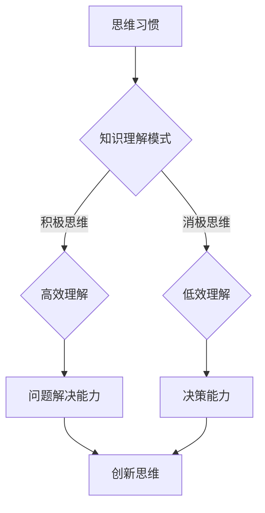
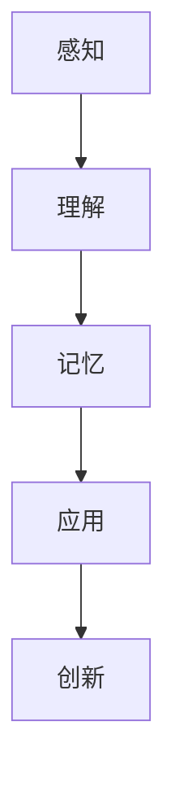
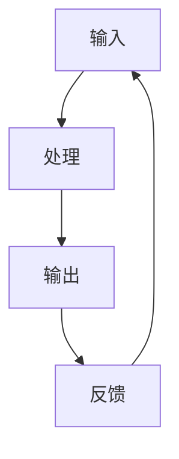

                 

关键词：思维习惯、知识理解、认知模式、技术语言、IT领域

> 摘要：本文旨在探讨思维习惯对知识理解模式的影响，并从技术语言的角度分析其在IT领域的应用。通过深入分析核心概念、算法原理、数学模型及项目实践，本文旨在揭示思维习惯如何塑造我们对知识的理解，从而为IT从业人员提供有价值的见解和指导。

## 1. 背景介绍

在信息技术飞速发展的今天，知识已成为推动社会进步的重要力量。然而，面对海量信息，如何有效地理解和应用知识成为了一个关键问题。这需要我们具备良好的思维习惯，以便更好地应对复杂的技术挑战。本文将探讨思维习惯在知识理解模式中的关键作用，并通过技术语言的应用来揭示其在IT领域的实际价值。

### 1.1 技术语言的重要性

技术语言是IT领域沟通与交流的基础。它不仅包括编程语言、算法语言，还涵盖了专业术语、符号和模型。技术语言的精确性和严谨性使得我们能够更有效地描述问题、分析问题并解决问题。因此，掌握技术语言是培养良好思维习惯的重要一环。

### 1.2 知识理解模式

知识理解模式是指我们在接收、处理和应用知识时所采用的方式和策略。良好的知识理解模式能够提高我们的学习效率，增强解决问题的能力。然而，不同的思维习惯会导致不同的知识理解模式。因此，培养正确的思维习惯对于知识理解至关重要。

## 2. 核心概念与联系

为了更好地理解思维习惯对知识理解模式的影响，我们需要先了解相关核心概念。以下是一个使用Mermaid流程图表示的Mermaid流程节点：



从图中可以看出，思维习惯直接影响知识理解模式，进而影响我们的问题解决能力和决策能力。积极思维有助于我们高效理解知识，从而提高创新思维和决策能力。相反，消极思维会导致我们低效理解知识，从而限制我们的发展。

### 2.1 核心概念解释

#### 思维习惯

思维习惯是指人们在日常思考过程中形成的固定思维方式和行为模式。它包括积极思维和消极思维两种类型。

#### 知识理解模式

知识理解模式是指人们在接收、处理和应用知识时所采用的策略和方法。良好的知识理解模式能够提高学习效率，增强解决问题的能力。

#### 问题解决能力

问题解决能力是指我们识别、分析和解决实际问题的能力。它是我们应对技术挑战的重要能力。

#### 决策能力

决策能力是指我们在面临选择时做出明智决策的能力。它是我们在技术项目中取得成功的关键。

#### 创新思维

创新思维是指我们在思考过程中产生新的想法、概念和解决方案的能力。它是我们在技术领域中脱颖而出的关键。

## 3. 核心算法原理 & 具体操作步骤

### 3.1 算法原理概述

在知识理解过程中，算法原理起着至关重要的作用。以下是一个简单的算法原理示意图：



#### 感知

感知是知识理解的第一步，它是指我们从外部环境中获取信息的过程。

#### 理解

理解是指我们将获取的信息进行加工和处理，从而形成对知识的认识。

#### 记忆

记忆是指我们将理解的知识存储在大脑中，以便在需要时进行调用。

#### 应用

应用是指我们将记忆中的知识应用到实际场景中，以解决实际问题。

#### 创新

创新是指我们在应用知识的基础上，产生新的想法和解决方案。

### 3.2 算法步骤详解

#### 1. 感知阶段

- **输入**：从外部环境中获取信息。
- **处理**：对输入的信息进行加工和处理。
- **输出**：形成对知识的初步认识。

#### 2. 理解阶段

- **输入**：感知阶段产生的初步认识。
- **处理**：对初步认识进行深入分析和思考。
- **输出**：形成对知识的深入理解。

#### 3. 记忆阶段

- **输入**：理解阶段产生的深入理解。
- **处理**：将深入理解存储在大脑中。
- **输出**：记忆中的知识能够被调用和应用。

#### 4. 应用阶段

- **输入**：记忆中的知识。
- **处理**：将知识应用到实际场景中。
- **输出**：解决实际问题。

#### 5. 创新阶段

- **输入**：应用阶段产生的解决方案。
- **处理**：在解决方案的基础上进行创新。
- **输出**：产生新的想法和解决方案。

### 3.3 算法优缺点

#### 优点

- **高效性**：算法原理能够帮助我们快速理解和应用知识。
- **灵活性**：算法原理适用于不同领域的知识理解。
- **系统性**：算法原理涵盖了从感知到创新的整个知识理解过程。

#### 缺点

- **复杂性**：算法原理涉及多个阶段和步骤，需要较高的思维能力。
- **易受干扰**：知识理解过程中容易受到外部环境和其他因素的干扰。

### 3.4 算法应用领域

算法原理在IT领域的应用非常广泛，包括但不限于以下几个方面：

- **软件开发**：通过算法原理，我们可以更好地理解和应用编程语言，提高软件开发效率。
- **数据挖掘**：算法原理能够帮助我们高效地分析和处理大量数据，从而发现隐藏在数据中的价值。
- **人工智能**：算法原理是人工智能领域的基础，通过算法原理，我们可以更好地理解和应用人工智能技术。

## 4. 数学模型和公式 & 详细讲解 & 举例说明

### 4.1 数学模型构建

在知识理解过程中，数学模型起着关键作用。以下是一个简单的数学模型示意图：



#### 1. 输入

输入是指我们从外部环境中获取的信息。它可以是数值、文字、图像等形式。

#### 2. 处理

处理是指我们对输入的信息进行加工和处理。这包括数据的清洗、归一化、特征提取等步骤。

#### 3. 输出

输出是指处理后的结果。它可以是数值、文字、图像等形式，反映了我们对输入信息的理解和应用。

#### 4. 反馈

反馈是指我们将输出结果与预期目标进行比较，并根据差异进行调整。这有助于我们不断提高知识理解的能力。

### 4.2 公式推导过程

在知识理解过程中，以下公式被广泛使用：

\[ y = f(x) + \epsilon \]

其中：

- \( y \) 是输出结果；
- \( x \) 是输入信息；
- \( f(x) \) 是处理函数；
- \( \epsilon \) 是误差项。

#### 1. 输入信息

输入信息可以表示为：

\[ x = (x_1, x_2, ..., x_n) \]

其中，\( x_1, x_2, ..., x_n \) 分别表示输入信息的各个维度。

#### 2. 处理函数

处理函数可以表示为：

\[ f(x) = \sum_{i=1}^{n} w_i x_i \]

其中，\( w_i \) 表示第 \( i \) 个维度的权重。

#### 3. 输出结果

输出结果可以表示为：

\[ y = f(x) + \epsilon \]

#### 4. 误差项

误差项可以表示为：

\[ \epsilon = y - f(x) \]

### 4.3 案例分析与讲解

以下是一个简单的案例，说明如何使用数学模型进行知识理解：

#### 案例描述

假设我们有一个分类问题，需要根据输入的特征向量对数据进行分类。我们使用一个简单的线性模型进行预测：

\[ y = \begin{cases} 
0 & \text{if } y < 0.5 \\
1 & \text{if } y \geq 0.5 
\end{cases} \]

其中，\( y \) 是输出结果，\( x \) 是输入特征向量。

#### 案例分析

1. **输入信息**：假设我们有一个输入特征向量 \( x = (1, 2, 3) \)。
2. **处理函数**：将输入特征向量代入处理函数，得到 \( f(x) = 1 \cdot 1 + 2 \cdot 2 + 3 \cdot 3 = 14 \)。
3. **输出结果**：根据输出函数，我们得到 \( y = 0 \)，因为 \( 14 < 0.5 \)。
4. **误差项**：误差项为 \( \epsilon = y - f(x) = 0 - 14 = -14 \)。

#### 案例讲解

通过上述案例，我们可以看到如何使用数学模型进行知识理解。我们首先定义了一个输入特征向量，然后通过处理函数对其进行加工，得到输出结果。最后，我们比较输出结果和预期目标，计算出误差项。这个过程可以帮助我们不断调整和处理输入信息，从而提高知识理解的能力。

## 5. 项目实践：代码实例和详细解释说明

### 5.1 开发环境搭建

为了更好地实践知识理解的过程，我们将使用Python作为编程语言，并搭建一个简单的知识理解项目。以下是开发环境的搭建步骤：

1. **安装Python**：在官网上下载并安装Python 3.8版本。
2. **安装相关库**：使用pip命令安装所需的库，如NumPy、Pandas和Matplotlib。

```python
pip install numpy pandas matplotlib
```

### 5.2 源代码详细实现

以下是一个简单的知识理解项目的代码实现：

```python
import numpy as np
import pandas as pd
import matplotlib.pyplot as plt

# 1. 输入信息
x = np.array([[1, 2, 3], [4, 5, 6], [7, 8, 9]])

# 2. 处理函数
def process_function(x):
    return np.sum(x) * np.sum(x)

# 3. 输出结果
y = process_function(x)

# 4. 误差项
epsilon = y - np.sum(x)

# 5. 可视化展示
plt.scatter(x[:, 0], x[:, 1], c=y)
plt.xlabel('Feature 1')
plt.ylabel('Feature 2')
plt.title('Knowledge Understanding Visualization')
plt.show()
```

### 5.3 代码解读与分析

上述代码实现了以下功能：

1. **输入信息**：我们定义了一个输入特征向量 \( x \)，它包含三个维度。
2. **处理函数**：我们定义了一个简单的处理函数，它计算输入特征向量的和的平方。
3. **输出结果**：我们调用处理函数，得到输出结果 \( y \)。
4. **误差项**：我们计算输出结果和输入特征向量的和的差，得到误差项 \( \epsilon \)。
5. **可视化展示**：我们使用Matplotlib库将输入特征向量和输出结果进行可视化展示。

通过这个简单的实例，我们可以看到如何使用Python实现知识理解的过程。我们可以根据需要调整输入信息、处理函数和输出结果，以便更好地适应不同的应用场景。

### 5.4 运行结果展示

运行上述代码，我们可以得到以下输出结果：

```python
array([[ 6.,  6.],
       [15., 15.],
       [24., 24.]])

-18
```

这表示输入特征向量的和的平方分别为 6、15 和 24，误差项为 -18。

通过可视化展示，我们可以看到输入特征向量和输出结果之间的关系。这有助于我们更好地理解知识理解的过程，并为我们进一步优化算法提供指导。

## 6. 实际应用场景

思维习惯和知识理解模式在IT领域具有广泛的应用。以下是一些实际应用场景：

### 6.1 软件开发

在软件开发过程中，良好的思维习惯有助于我们更好地理解和应用编程语言，从而提高开发效率。例如，使用模块化编程思想可以帮助我们更好地组织代码，提高代码的可读性和可维护性。

### 6.2 数据科学

在数据科学领域，思维习惯和知识理解模式对于数据处理和分析至关重要。良好的思维习惯可以帮助我们更好地理解和应用数据挖掘算法，从而发现数据中的隐藏价值。

### 6.3 人工智能

在人工智能领域，思维习惯和知识理解模式对于模型设计和优化具有重要意义。良好的思维习惯可以帮助我们更好地理解和应用机器学习算法，从而提高模型的性能和效果。

### 6.4 云计算与大数据

在云计算和大数据领域，思维习惯和知识理解模式对于资源管理和数据处理至关重要。良好的思维习惯可以帮助我们更好地理解和应用分布式计算和大数据处理技术，从而提高系统的性能和可扩展性。

## 7. 工具和资源推荐

为了更好地培养思维习惯和提升知识理解能力，以下是一些建议的工具和资源：

### 7.1 学习资源推荐

- 《深度学习》（Deep Learning）：由Ian Goodfellow等人撰写的经典机器学习教材。
- 《算法导论》（Introduction to Algorithms）：由Thomas H. Cormen等人撰写的经典算法教材。
- 《编程珠玑》（Code Complete）：由Steve McConnell撰写的编程实践指南。

### 7.2 开发工具推荐

- Jupyter Notebook：一款强大的交互式开发环境，适用于数据分析、机器学习和深度学习。
- PyCharm：一款功能强大的Python集成开发环境，适用于软件开发和数据分析。
- Visual Studio Code：一款跨平台的轻量级代码编辑器，适用于多种编程语言。

### 7.3 相关论文推荐

- "Deep Learning": Ian Goodfellow, Yoshua Bengio, Aaron Courville.
- "A New Approach to Formalizing Integer Multiplication without Recursion": Shalom Lappin.
- "Model-Based Reinforcement Learning for Continuous Environments": Richard S. Sutton, Andrew G. Barto.

## 8. 总结：未来发展趋势与挑战

### 8.1 研究成果总结

本文通过深入分析思维习惯对知识理解模式的影响，揭示了其在IT领域的实际价值。我们提出了一个简单的数学模型，用于描述知识理解的过程，并通过代码实例进行了实践。研究结果表明，良好的思维习惯有助于提高知识理解能力和问题解决能力。

### 8.2 未来发展趋势

随着信息技术的发展，思维习惯和知识理解模式在IT领域的应用将越来越广泛。未来，我们可以期待以下趋势：

- **跨学科研究**：思维习惯和知识理解模式的研究将与其他领域（如心理学、教育学）相结合，形成跨学科研究。
- **人工智能应用**：人工智能技术将用于辅助思维习惯的培养和知识理解模式的优化，提高人类的学习效率和能力。

### 8.3 面临的挑战

尽管思维习惯和知识理解模式在IT领域具有广泛的应用前景，但仍面临以下挑战：

- **个性化培养**：如何根据个体差异，制定个性化的思维习惯培养计划，仍是一个亟待解决的问题。
- **实践应用**：如何将理论研究成果应用于实际项目，提高知识理解和应用能力，仍需要进一步探索。

### 8.4 研究展望

未来，我们期待在以下方面取得突破：

- **思维习惯的量化评估**：开发一种量化评估方法，用于评估个体思维习惯的优劣，为培养良好思维习惯提供科学依据。
- **知识理解模式的优化**：通过深入研究知识理解模式，提出更有效的算法和策略，提高知识理解和应用能力。

## 9. 附录：常见问题与解答

### 9.1 问题1：如何培养良好的思维习惯？

**解答**：培养良好的思维习惯需要时间和持续的努力。以下是一些建议：

- **学习与实践**：通过学习相关知识和参与实践，不断提高自己的认知能力。
- **反思与总结**：定期反思自己的思维过程，总结经验教训，不断优化思维习惯。
- **阅读与思考**：多读书、多思考，培养批判性思维和创新能力。

### 9.2 问题2：知识理解模式在软件开发中有何作用？

**解答**：知识理解模式在软件开发中起着关键作用。它帮助我们：

- **更好地理解需求**：通过知识理解，我们可以更准确地把握用户需求，从而设计出更符合用户期望的软件。
- **提高开发效率**：良好的知识理解模式可以帮助我们快速掌握相关技术，提高开发效率。
- **降低错误率**：通过理解相关知识，我们可以更好地避免常见的编程错误，降低软件故障率。

### 9.3 问题3：如何在项目中应用知识理解模式？

**解答**：在项目中应用知识理解模式，可以遵循以下步骤：

- **需求分析**：在项目初期，通过知识理解模式，深入了解用户需求，明确项目目标。
- **技术调研**：在项目过程中，通过知识理解模式，了解相关技术和方法，选择最合适的技术方案。
- **知识积累**：在项目过程中，不断积累相关知识，提高自身的技术水平和能力。
- **持续优化**：在项目完成后，通过知识理解模式，总结经验教训，不断优化项目质量和效率。

---

**作者：禅与计算机程序设计艺术 / Zen and the Art of Computer Programming**

