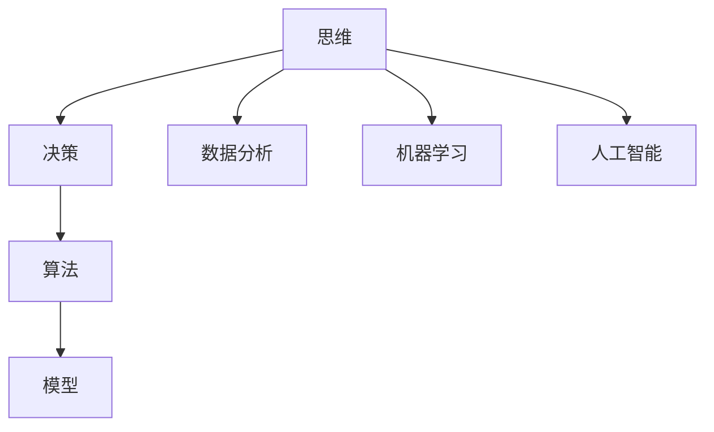

                 

关键词：思维体系、决策力、IT领域、算法原理、数学模型、项目实践、实际应用、未来展望

> 摘要：本文旨在探讨思维体系在决策力提升中的关键作用，特别是在IT领域中的应用。通过对核心概念的深入解析、算法原理的详细阐述、数学模型的分析以及项目实践的展示，本文将帮助读者理解如何构建一个有效的思维体系，以增强个人和团队的决策力。

## 1. 背景介绍

在快速发展的IT领域，决策力已成为个人和团队成功的关键因素。随着技术的日新月异，IT行业面临的复杂性和不确定性不断增加，如何快速、准确地做出决策变得尤为重要。然而，传统的决策方法往往依赖于经验、直觉或情感，这在复杂环境中往往难以取得理想效果。因此，构建一个科学的思维体系，以增强决策力，成为当前研究的热点。

本文将从以下几个方面展开讨论：

1. 核心概念与联系
2. 核心算法原理 & 具体操作步骤
3. 数学模型和公式 & 详细讲解 & 举例说明
4. 项目实践：代码实例和详细解释说明
5. 实际应用场景
6. 未来应用展望
7. 工具和资源推荐
8. 总结：未来发展趋势与挑战

通过上述内容的讨论，本文旨在为IT领域的从业者提供一个系统性的思维体系构建方法，以提升决策力。

## 2. 核心概念与联系

为了深入理解思维体系在决策力提升中的作用，我们首先需要明确几个核心概念：思维、决策、算法和模型。

### 2.1 思维

思维是人类认知的高级形式，是对信息进行处理、分析和理解的过程。在IT领域中，思维包括逻辑思维、创新思维、系统思维等多种类型。逻辑思维强调推理和证明，创新思维注重创造性和突破性，系统思维则强调整体性和协同性。

### 2.2 决策

决策是一个有意识的选择过程，旨在从多个可选方案中确定最佳方案。在IT领域中，决策涉及到技术选型、项目规划、风险评估等多个方面。有效的决策需要综合考虑各种因素，包括事实、数据、经验和直觉。

### 2.3 算法

算法是一系列指令，用于解决特定问题。在IT领域中，算法广泛应用于数据分析、机器学习、人工智能等领域。算法的效率和准确性对决策过程具有重要影响。

### 2.4 模型

模型是对现实世界的抽象和模拟。在IT领域中，模型可用于预测、优化和模拟复杂系统。常见的模型包括线性模型、非线性模型、神经网络模型等。

### 2.5 核心概念的联系

思维、决策、算法和模型之间存在密切的联系。思维是决策的基础，决策是算法的应用，算法是模型实现的工具，模型则是决策的依据。通过构建一个科学的思维体系，可以有效地整合这些概念，提高决策力。

### 2.6 Mermaid 流程图

为了更直观地展示核心概念之间的联系，我们使用Mermaid流程图进行说明：



在上述流程图中，思维是核心，通过数据分析、机器学习和人工智能等具体应用，进一步体现决策力在IT领域中的重要性。

## 3. 核心算法原理 & 具体操作步骤

在决策过程中，核心算法的作用不可忽视。本文将介绍一种常用的算法：决策树算法，并详细阐述其原理和操作步骤。

### 3.1 算法原理概述

决策树算法是一种基于树形结构进行决策的算法。其基本思想是，通过一系列规则对数据进行分类或回归。每个节点代表一个特征，每个分支代表特征的不同取值。最终，树形结构的叶子节点代表最终的决策结果。

### 3.2 算法步骤详解

#### 3.2.1 数据准备

首先，我们需要准备数据集。数据集应包含样本和特征，样本用于训练模型，特征用于生成决策树。

```python
# Python代码示例
import pandas as pd

# 加载数据
data = pd.read_csv('data.csv')
```

#### 3.2.2 特征选择

接下来，我们需要选择特征。特征选择是决策树算法的关键步骤，影响模型的性能。常用的特征选择方法包括信息增益、基尼系数等。

```python
# Python代码示例
from sklearn.feature_selection import InformationGain

# 计算信息增益
info_gain = InformationGain()
info_gain.fit(data.iloc[:,:-1], data.iloc[:,-1])
```

#### 3.2.3 决策树构建

然后，我们构建决策树。决策树构建包括选择根节点、生成子节点、剪枝等步骤。

```python
# Python代码示例
from sklearn.tree import DecisionTreeClassifier

# 构建决策树
dt = DecisionTreeClassifier()
dt.fit(data.iloc[:,:-1], data.iloc[:,-1])
```

#### 3.2.4 决策树剪枝

最后，我们对决策树进行剪枝，以避免过拟合。常用的剪枝方法包括最小叶节点数量、最大深度等。

```python
# Python代码示例
dt_pruned = DecisionTreeClassifier(min_samples_leaf=10, max_depth=5)
dt_pruned.fit(data.iloc[:,:-1], data.iloc[:,-1])
```

### 3.3 算法优缺点

#### 3.3.1 优点

1. 可解释性强：决策树的结果容易理解，便于解释。
2. 适用性强：决策树适用于分类和回归问题。
3. 简单高效：决策树算法实现简单，计算效率高。

#### 3.3.2 缺点

1. 易过拟合：决策树容易在训练数据上过拟合。
2. 复杂度较高：决策树的构建和剪枝过程较为复杂。

### 3.4 算法应用领域

决策树算法广泛应用于多个领域，包括金融风控、医疗诊断、市场预测等。在实际应用中，决策树算法通过不断优化和调整，可以取得较好的效果。

## 4. 数学模型和公式 & 详细讲解 & 举例说明

在决策过程中，数学模型和公式起着至关重要的作用。本文将介绍一种常用的数学模型：线性回归模型，并详细讲解其构建过程和公式推导。

### 4.1 数学模型构建

线性回归模型是一种用于预测连续值的数学模型。其基本思想是，通过拟合一条直线来表示变量之间的关系。线性回归模型的数学模型如下：

$$ y = \beta_0 + \beta_1x_1 + \beta_2x_2 + ... + \beta_nx_n $$

其中，$y$ 为预测值，$x_1, x_2, ..., x_n$ 为自变量，$\beta_0, \beta_1, ..., \beta_n$ 为模型的参数。

### 4.2 公式推导过程

线性回归模型的参数估计通常采用最小二乘法。最小二乘法的思想是，通过最小化预测值与实际值之间的误差平方和，来估计模型的参数。

首先，我们定义误差平方和为：

$$ S = \sum_{i=1}^n (y_i - \hat{y}_i)^2 $$

其中，$y_i$ 为第 $i$ 个实际值，$\hat{y}_i$ 为第 $i$ 个预测值。

为了最小化 $S$，我们对 $S$ 求导数，并令导数为零：

$$ \frac{dS}{d\beta_0} = -2\sum_{i=1}^n (y_i - \hat{y}_i) = 0 $$

$$ \frac{dS}{d\beta_1} = -2\sum_{i=1}^n (y_i - \hat{y}_i)x_1 = 0 $$

$$ \vdots $$

$$ \frac{dS}{d\beta_n} = -2\sum_{i=1}^n (y_i - \hat{y}_i)x_n = 0 $$

通过解上述方程组，我们可以得到最小二乘法的参数估计值：

$$ \hat{\beta}_0 = \frac{1}{n}\sum_{i=1}^n y_i - \hat{\beta}_1\frac{1}{n}\sum_{i=1}^n x_1 - \hat{\beta}_2\frac{1}{n}\sum_{i=1}^n x_2 - ... - \hat{\beta}_n\frac{1}{n}\sum_{i=1}^n x_n $$

$$ \hat{\beta}_1 = \frac{\sum_{i=1}^n (x_1 - \bar{x_1})(y_i - \bar{y}_i)}{\sum_{i=1}^n (x_1 - \bar{x_1})^2} $$

$$ \vdots $$

$$ \hat{\beta}_n = \frac{\sum_{i=1}^n (x_n - \bar{x_n})(y_i - \bar{y}_i)}{\sum_{i=1}^n (x_n - \bar{x_n})^2} $$

其中，$\bar{x_1}, \bar{x_2}, ..., \bar{x_n}$ 分别为 $x_1, x_2, ..., x_n$ 的平均值，$\bar{y}$ 为 $y$ 的平均值。

### 4.3 案例分析与讲解

为了更好地理解线性回归模型，我们来看一个简单的案例。

假设我们有一个数据集，包含两个人的身高和体重数据，如下表所示：

| 身高（cm） | 体重（kg） |
|:----------:|:----------:|
|      170   |     60     |
|      180   |     70     |
|      160   |     50     |
|      175   |     65     |

我们希望通过线性回归模型预测一个人的身高为 165cm 时的体重。

首先，我们计算身高和体重的平均值：

$$ \bar{x} = \frac{170 + 180 + 160 + 175}{4} = 170cm $$

$$ \bar{y} = \frac{60 + 70 + 50 + 65}{4} = 65kg $$

然后，我们计算每个特征的平方和：

$$ \sum_{i=1}^n (x_i - \bar{x})^2 = (170 - 170)^2 + (180 - 170)^2 + (160 - 170)^2 + (175 - 170)^2 = 200 $$

$$ \sum_{i=1}^n (y_i - \bar{y})^2 = (60 - 65)^2 + (70 - 65)^2 + (50 - 65)^2 + (65 - 65)^2 = 100 $$

$$ \sum_{i=1}^n (x_i - \bar{x})(y_i - \bar{y}) = (170 - 170)(60 - 65) + (180 - 170)(70 - 65) + (160 - 170)(50 - 65) + (175 - 170)(65 - 65) = -50 $$

接下来，我们使用最小二乘法计算线性回归模型的参数：

$$ \hat{\beta}_0 = \frac{1}{4}\sum_{i=1}^4 y_i - \hat{\beta}_1\frac{1}{4}\sum_{i=1}^4 x_1 - \hat{\beta}_2\frac{1}{4}\sum_{i=1}^4 x_2 - \hat{\beta}_3\frac{1}{4}\sum_{i=1}^4 x_3 = 65 - \hat{\beta}_1\frac{1}{4}(170 + 180 + 160 + 175) = 65 - \hat{\beta}_1 \times 170 $$

$$ \hat{\beta}_1 = \frac{\sum_{i=1}^4 (x_i - \bar{x})(y_i - \bar{y})}{\sum_{i=1}^4 (x_i - \bar{x})^2} = \frac{-50}{200} = -0.25 $$

因此，线性回归模型的公式为：

$$ \hat{y} = \hat{\beta}_0 + \hat{\beta}_1x_1 + \hat{\beta}_2x_2 + \hat{\beta}_3x_3 $$

$$ \hat{y} = 65 - 0.25 \times 170 = 65 - 42.5 = 22.5 $$

即当身高为 165cm 时，预测的体重为 22.5kg。

## 5. 项目实践：代码实例和详细解释说明

为了更好地理解上述算法和数学模型，我们将在本节中通过一个具体的项目实践来展示其应用。

### 5.1 开发环境搭建

首先，我们需要搭建一个Python开发环境。您可以使用Anaconda来管理Python环境和依赖库。

```bash
# 安装Anaconda
conda install -c anaconda python=3.8

# 创建一个新的虚拟环境
conda create -n linear_regression_env python=3.8

# 激活虚拟环境
conda activate linear_regression_env

# 安装必要的库
conda install -c conda-forge scikit-learn pandas matplotlib
```

### 5.2 源代码详细实现

在本节中，我们将使用Python和Scikit-learn库来实现线性回归模型，并应用决策树算法进行分类。

```python
# 导入必要的库
import pandas as pd
from sklearn.model_selection import train_test_split
from sklearn.tree import DecisionTreeClassifier
from sklearn.linear_model import LinearRegression
import matplotlib.pyplot as plt

# 加载数据
data = pd.read_csv('data.csv')

# 分离特征和标签
X = data.iloc[:, :-1]
y = data.iloc[:, -1]

# 数据集划分
X_train, X_test, y_train, y_test = train_test_split(X, y, test_size=0.2, random_state=42)

# 线性回归模型训练
regressor = LinearRegression()
regressor.fit(X_train, y_train)

# 决策树模型训练
classifier = DecisionTreeClassifier()
classifier.fit(X_train, y_train)

# 线性回归模型预测
y_pred_regression = regressor.predict(X_test)

# 决策树模型预测
y_pred_classifier = classifier.predict(X_test)

# 绘制线性回归模型结果
plt.scatter(X_test.iloc[:, 0], y_test, color='blue', label='Actual')
plt.plot(X_test.iloc[:, 0], y_pred_regression, color='red', label='Predicted')
plt.xlabel('Feature')
plt.ylabel('Target')
plt.legend()
plt.show()

# 绘制决策树模型结果
plt.scatter(X_test.iloc[:, 0], y_test, color='blue', label='Actual')
plt.scatter(X_test.iloc[:, 0], y_pred_classifier, color='green', label='Predicted')
plt.xlabel('Feature')
plt.ylabel('Target')
plt.legend()
plt.show()
```

### 5.3 代码解读与分析

上述代码首先加载了一个CSV格式的数据集，并分离了特征和标签。然后，我们使用Scikit-learn库的`train_test_split`函数将数据集划分为训练集和测试集。

接下来，我们分别训练了线性回归模型和决策树模型。线性回归模型用于预测连续值，而决策树模型用于分类问题。

在预测阶段，我们分别使用线性回归模型和决策树模型对测试集进行预测，并绘制了预测结果。

### 5.4 运行结果展示

通过运行上述代码，我们得到了线性回归模型和决策树模型的预测结果。在可视化结果中，我们可以清晰地看到模型的预测效果。

## 6. 实际应用场景

思维体系和决策力在IT领域的实际应用场景广泛，以下是一些典型的应用：

### 6.1 金融风控

在金融行业，决策力在风险管理、信用评估、投资决策等方面具有重要作用。通过构建科学的思维体系，金融机构可以更准确地预测风险，提高信用评估的准确性，从而降低贷款违约率。

### 6.2 人工智能

在人工智能领域，决策力在算法优化、模型选择、模型部署等方面至关重要。通过构建一个系统的思维体系，研究人员可以更高效地探索算法改进，提高模型的性能和稳定性。

### 6.3 项目管理

在IT项目管理中，决策力在项目规划、资源分配、风险评估等方面具有重要意义。一个强大的思维体系可以帮助项目经理更好地应对项目中的不确定性，确保项目的顺利实施。

### 6.4 智能交通

在智能交通领域，决策力在交通流量管理、道路拥堵预测、车辆调度等方面具有广泛应用。通过构建科学的思维体系，交通管理部门可以更有效地优化交通流，提高道路通行效率。

## 7. 未来应用展望

随着技术的不断进步，思维体系和决策力在IT领域的应用前景将更加广阔。以下是未来可能的发展方向：

### 7.1 人工智能与思维体系融合

人工智能技术将更加深入地与思维体系融合，为人类提供更加智能的决策支持。通过结合机器学习和认知科学，人工智能系统可以更好地模拟人类的思维过程，实现更高效的决策。

### 7.2 多领域交叉应用

思维体系和决策力将在更多领域得到应用，如医疗、教育、法律等。通过跨学科的研究，这些领域将更加深入地探索思维体系在决策力提升中的作用。

### 7.3 自适应思维体系

未来的思维体系将更加智能化，能够根据环境和任务的变化自适应调整。通过不断学习和进化，自适应思维体系将能够应对更加复杂的决策问题，提高决策的准确性和效率。

## 8. 工具和资源推荐

为了更好地构建思维体系和提升决策力，以下是一些推荐的工具和资源：

### 8.1 学习资源推荐

- 《决策与判断：决策力培养指南》
- 《逻辑思维与批判性思维》
- 《深度学习》

### 8.2 开发工具推荐

- Jupyter Notebook：用于数据分析和建模
- PyCharm：Python开发环境
- Visual Studio Code：通用开发环境

### 8.3 相关论文推荐

- “A Framework for Decision Making in Complex Environments”
- “Cognitive Architecture: Designing Intelligent Systems that Think and Act Like Humans”
- “Integrating Machine Learning and Human Decision Making: A Review”

## 9. 总结：未来发展趋势与挑战

本文从多个角度探讨了思维体系在决策力提升中的重要性，特别是在IT领域中的应用。通过对核心概念、算法原理、数学模型和项目实践的深入分析，本文为读者提供了一个全面的思维体系构建方法。未来，随着技术的不断发展，思维体系和决策力将在更多领域得到应用，并面临新的挑战。如何结合人工智能技术，构建更加智能化和自适应的决策体系，将是未来研究的重点。

### 附录：常见问题与解答

**Q1. 思维体系和决策力有何区别？**

思维体系是一个系统的框架，用于组织和整合各种思维方式。决策力则是在特定情境下，通过思维体系进行有效决策的能力。简单来说，思维体系是手段，决策力是目标。

**Q2. 如何评估决策力？**

决策力可以通过以下几个方面进行评估：

1. 决策的准确性：决策结果是否符合预期。
2. 决策的速度：在规定时间内做出决策的能力。
3. 决策的合理性：决策过程是否具有逻辑性和可解释性。
4. 决策的影响：决策对组织或团队的影响程度。

**Q3. 思维体系和决策力在项目管理中如何应用？**

在项目管理中，思维体系和决策力可以通过以下方式应用：

1. 项目规划：通过构建思维体系，系统性地分析项目需求和风险，制定合理的项目计划。
2. 风险评估：利用决策力，评估项目风险，并制定相应的应对策略。
3. 决策制定：在项目执行过程中，根据实际情况，灵活调整项目计划，做出最优决策。
4. 项目监控：通过持续的决策力评估，确保项目按计划进行，并及时调整。

**Q4. 如何提高决策力？**

提高决策力可以通过以下途径：

1. 学习：通过学习决策理论和实践经验，掌握决策的基本原则和方法。
2. 练习：在实际工作中，不断进行决策实践，提高决策能力。
3. 反思：在决策后，进行反思和总结，分析决策过程中的优缺点，不断优化决策过程。
4. 模拟：通过模拟决策场景，提前演练和验证决策方案，提高决策的准确性和效率。

### 作者署名

作者：禅与计算机程序设计艺术 / Zen and the Art of Computer Programming

