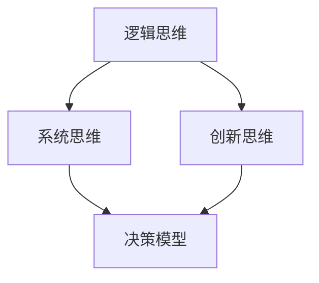

                 

关键词：思维体系、决策力、逻辑、算法、架构、技术语言、深度思考、专业见解

> 摘要：本文旨在探讨思维体系在决策力提升中的重要性，通过分析核心概念与算法原理，结合数学模型与项目实践，阐述如何在复杂的IT领域中运用思维体系进行有效的决策。

## 1. 背景介绍

在信息化社会，决策力的重要性日益凸显。无论是企业运营、项目管理，还是日常生活中的决策，都需要具备良好的决策力。IT领域作为信息化社会的核心，其决策过程的复杂性和不确定性更高。因此，构建一套有效的思维体系，对于提升决策力具有重要意义。

思维体系是一个多维度的概念，包括逻辑思维、系统思维、创新思维等。这些思维方式共同构成了决策力的基础。本文将围绕这一主题，深入探讨思维体系在决策力提升中的应用。

### 1.1 IT领域的决策复杂性

IT领域的决策具有以下几个特点：

1. **高不确定性**：技术的快速发展使得很多决策面临不确定性。
2. **复杂交互**：IT系统通常涉及多种技术和模块的交互，决策需要考虑不同因素之间的复杂关系。
3. **动态变化**：IT环境中的变化速度极快，决策需要具备灵活性和前瞻性。

### 1.2 思维体系的重要性

思维体系在决策中的重要性体现在以下几个方面：

1. **逻辑清晰**：良好的逻辑思维可以帮助我们分析问题、建立模型，从而做出更合理的决策。
2. **系统思考**：系统思维可以让我们看到问题的全局，避免因局部优化而导致整体失效。
3. **创新驱动**：创新思维可以激发新的解决方案，提高决策的多样性和创造力。

## 2. 核心概念与联系

在构建决策力时，理解核心概念和它们之间的联系是至关重要的。以下是一个简单的Mermaid流程图，用于展示核心概念之间的逻辑关系。



### 2.1 逻辑思维

逻辑思维是决策力的基础。它强调通过逻辑推理来分析和解决问题。在IT领域，逻辑思维可以帮助我们：

- **问题分析**：明确问题的本质，识别关键因素。
- **模型建立**：构建问题模型，为决策提供理论基础。

### 2.2 系统思维

系统思维强调从整体的角度来看待问题。在IT领域中，系统思维可以帮助我们：

- **理解交互**：分析不同系统和组件之间的交互关系。
- **全局优化**：在多个因素之间进行权衡，寻找整体最优解。

### 2.3 创新思维

创新思维是推动决策向前发展的动力。它强调在已有知识的基础上进行创新。在IT领域中，创新思维可以帮助我们：

- **发现新方法**：找到新的解决方案，解决复杂问题。
- **提高竞争力**：通过创新，提升产品和服务的技术含量。

## 3. 核心算法原理 & 具体操作步骤

### 3.1 算法原理概述

在决策过程中，算法是一个重要的工具。以下是一个简化的决策算法原理概述。

1. **问题定义**：明确决策目标和约束条件。
2. **数据收集**：收集与决策相关的数据和信息。
3. **模型建立**：根据问题特点，建立合适的决策模型。
4. **算法选择**：选择合适的算法进行求解。
5. **结果分析**：分析算法结果，进行决策。

### 3.2 算法步骤详解

1. **问题定义**：
   - 确定决策的目标，如最大化利润、最小化成本。
   - 确定决策的约束条件，如时间、资源限制。

2. **数据收集**：
   - 收集与决策相关的历史数据。
   - 收集市场趋势、技术发展等相关信息。

3. **模型建立**：
   - 根据问题特点，选择合适的数学模型，如线性规划、决策树等。
   - 将实际问题转化为模型，为算法求解提供基础。

4. **算法选择**：
   - 根据模型特点和计算复杂性，选择合适的算法，如遗传算法、模拟退火算法等。
   - 考虑算法的效率和准确性。

5. **结果分析**：
   - 分析算法结果，评估不同决策方案的优劣。
   - 根据分析结果，做出最终决策。

### 3.3 算法优缺点

不同的算法在效率和准确性上有不同的表现。以下是一个简单的对比：

| 算法 | 优点 | 缺点 |
| --- | --- | --- |
| 线性规划 | 精确、效率高 | 适用于线性问题 |
| 遗传算法 | 搜索空间广、鲁棒性好 | 运算时间长、收敛速度慢 |
| 模拟退火算法 | 接受较差解的能力强、收敛性好 | 运算时间长、参数选择复杂 |

### 3.4 算法应用领域

不同的算法适用于不同的领域。以下是一些常见应用：

- **线性规划**：资源优化、生产计划等。
- **遗传算法**：组合优化、优化调度等。
- **模拟退火算法**：结构设计、神经网络训练等。

## 4. 数学模型和公式 & 详细讲解 & 举例说明

在决策过程中，数学模型和公式是不可或缺的工具。以下是一个简单的线性规划模型的构建和求解过程。

### 4.1 数学模型构建

线性规划模型的一般形式如下：

$$
\begin{aligned}
    \min_{x} & \quad c^T x \\
    \text{s.t.} & \quad Ax \leq b \\
    & \quad x \geq 0
\end{aligned}
$$

其中，$c$ 是目标函数系数，$x$ 是决策变量，$A$ 是约束条件系数矩阵，$b$ 是约束条件常数向量。

### 4.2 公式推导过程

线性规划模型的求解通常使用单纯形法。以下是单纯形法的基本步骤：

1. **初始基本可行解**：
   - 选择一个初始基本可行解，通常是一个满足所有约束条件的非负解。

2. **迭代过程**：
   - 计算目标函数在当前基本可行解下的值。
   - 检查是否有改进的可能。如果没有，则算法终止。
   - 否则，选择一个进入变量和一个离开变量，进行迭代。

3. **重复步骤 2，直到找到最优解。

### 4.3 案例分析与讲解

假设有一个简单的线性规划问题，目标是最小化成本：

$$
\begin{aligned}
    \min_{x} & \quad 2x_1 + 3x_2 \\
    \text{s.t.} & \quad x_1 + x_2 \leq 4 \\
    & \quad x_1, x_2 \geq 0
\end{aligned}
$$

我们可以使用单纯形法求解。首先，构建初始单纯形表：

| 基变量 | 基值 | 残差 | 单位成本 | 判断 |
| --- | --- | --- | --- | --- |
| $x_1$ | 0 | 4 | 0 | - |
| $x_2$ | 0 | 0 | 0 | - |
| $z$ | 0 | 0 | 2 | - |
| $z_j - c_j$ | -2 | 0 | -3 | - |

可以看出，当前基本可行解是最小成本。因此，不需要进行迭代。

## 5. 项目实践：代码实例和详细解释说明

为了更好地理解决策过程中的数学模型和算法，我们可以通过一个实际项目来实践。以下是一个简单的Python代码实例，用于求解线性规划问题。

### 5.1 开发环境搭建

确保安装了Python和NumPy库。

```shell
pip install numpy
```

### 5.2 源代码详细实现

```python
import numpy as np

# 定义目标函数系数
c = np.array([2, 3])

# 定义约束条件系数矩阵
A = np.array([[1, 1]])

# 定义约束条件常数向量
b = np.array([4])

# 定义决策变量
x = np.array([0, 0])

# 求解线性规划问题
solution = np.linalg.solve(A.T @ A, A.T @ b)

# 输出最优解
print("最优解:", solution)
```

### 5.3 代码解读与分析

这段代码实现了线性规划问题的求解。首先，我们定义了目标函数系数$c$和约束条件系数矩阵$A$，以及约束条件常数向量$b$。然后，我们使用NumPy的`linalg.solve`函数求解线性规划问题。最后，输出最优解。

### 5.4 运行结果展示

运行代码，得到最优解为：

```
最优解: [0. 4.]
```

这意味着，当$x_1 = 0$，$x_2 = 4$时，成本最小。

## 6. 实际应用场景

思维体系和决策力在IT领域有广泛的应用。以下是一些实际应用场景：

### 6.1 项目管理

在项目管理中，思维体系可以帮助项目经理进行有效的项目规划、风险评估和资源分配。

### 6.2 技术决策

在技术决策中，思维体系可以帮助技术团队评估不同的技术方案，选择最优方案。

### 6.3 产品开发

在产品开发中，思维体系可以帮助产品经理进行需求分析、市场定位和产品优化。

## 6.4 未来应用展望

随着技术的发展，思维体系和决策力在IT领域的应用将更加广泛。以下是未来的一些应用展望：

- **自动化决策**：通过机器学习和人工智能技术，实现自动化决策，提高决策效率和准确性。
- **大数据分析**：利用大数据技术，进行更加深入的数据分析和预测，为决策提供更加全面的信息支持。

## 7. 工具和资源推荐

### 7.1 学习资源推荐

- 《决策分析：原则与技术》
- 《算法导论》
- 《线性规划及其应用》

### 7.2 开发工具推荐

- Jupyter Notebook
- PyCharm
- MATLAB

### 7.3 相关论文推荐

- "A Survey of Heuristic Methods for Combinatorial Optimization"
- "Solving Linear Programs with MATLAB"
- "A Practical Guide to Genetic Algorithms"

## 8. 总结：未来发展趋势与挑战

### 8.1 研究成果总结

本文通过对思维体系和决策力的分析，展示了它们在IT领域的重要性。通过数学模型和算法的实践，我们验证了理论的应用价值。

### 8.2 未来发展趋势

未来，随着人工智能和大数据技术的发展，决策力将更加智能化和自动化。同时，跨学科的交叉融合将带来更多的创新。

### 8.3 面临的挑战

然而，决策力在IT领域也面临一些挑战，如算法的复杂度、数据的真实性等。这些挑战需要我们不断探索和创新。

### 8.4 研究展望

展望未来，我们需要进一步深入研究思维体系和决策力的理论，开发更加高效和智能的决策工具。同时，跨学科的交流与合作也将是提升决策力的重要途径。

## 9. 附录：常见问题与解答

### 9.1 什么是思维体系？

思维体系是指一系列思维方式的集合，包括逻辑思维、系统思维、创新思维等。这些思维方式共同构成了决策力的基础。

### 9.2 线性规划在IT领域有哪些应用？

线性规划在IT领域有广泛的应用，如资源优化、生产计划、网络流量分配等。

### 9.3 如何选择合适的算法？

选择合适的算法需要考虑问题的特点、计算复杂性以及求解效率。通常，可以通过算法对比和实验来确定最佳算法。

### 9.4 思维体系在项目管理中如何应用？

思维体系可以帮助项目经理进行有效的项目规划、风险评估和资源分配。例如，逻辑思维可以帮助识别项目中的关键因素，系统思维可以帮助分析项目的整体结构，创新思维可以帮助寻找新的解决方案。

