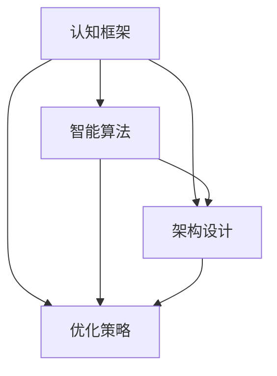

                 

关键词：思维体系、决策、智能算法、认知框架、架构设计、优化策略、创新思维、心理学、人工智能

> 摘要：本文将探讨思维体系在决策过程中的重要性，分析不同类型思维模式及其在IT领域的应用，并探讨如何通过构建强大的思维体系来提升决策的高度和效果。文章将涵盖核心概念、算法原理、数学模型、实践案例和未来展望，旨在为读者提供一个全面的思维体系构建指南。

## 1. 背景介绍

在信息时代，决策成为了我们日常生活和工作中必不可少的一部分。无论是个人决策还是组织决策，正确和高效的决策往往能够带来巨大的价值。然而，随着信息的爆炸和复杂性增加，如何做出明智的决策变得愈加困难。这就需要我们构建一套强大的思维体系，以便在复杂的环境中快速、准确地识别问题、分析问题、解决问题。

思维体系不仅涉及到我们对信息的获取和处理，还包括我们的价值观、信仰、经验等心理因素。一个健全的思维体系能够帮助我们更好地理解问题、制定策略、评估风险，并最终做出正确的决策。

### 1.1 决策的挑战

在当前快节奏、高度复杂的环境中，决策面临着诸多挑战：

1. **信息过载**：我们每天都会接触到大量的信息，如何筛选和利用这些信息成为了一个问题。
2. **时间压力**：决策往往需要在短时间内做出，如何快速做出高质量决策成为关键。
3. **不确定性和风险**：在许多情况下，决策的结果是不确定的，如何评估和应对这些不确定性是决策中的难点。
4. **多目标冲突**：在决策过程中，常常需要权衡多个目标，如何平衡这些目标之间的冲突是一个挑战。

### 1.2 智能算法与思维体系

随着人工智能技术的发展，智能算法在决策过程中发挥着越来越重要的作用。智能算法能够快速处理海量数据，提供预测和分析结果，辅助人类做出更明智的决策。然而，智能算法并不是万能的，它们在某些情况下可能会出现偏差或失效。这就需要我们结合人类的智慧和直觉，构建一个健全的思维体系，以平衡智能算法的不足。

## 2. 核心概念与联系

为了更好地理解思维体系在决策中的重要性，我们首先需要了解一些核心概念，并探讨它们之间的联系。

### 2.1 认知框架

认知框架是指我们用于理解和分析信息的心理模型。它包括我们的价值观、信仰、经验等。一个健全的认知框架能够帮助我们更好地理解世界，识别问题，并制定有效的解决方案。

### 2.2 智能算法

智能算法是指能够通过学习、推理和预测来处理复杂数据并做出决策的算法。常见的智能算法包括机器学习、深度学习、神经网络等。这些算法能够快速处理海量数据，提供预测和分析结果，但它们也有局限性。

### 2.3 架构设计

架构设计是指系统的整体结构和组织方式。一个好的架构设计能够提高系统的可扩展性、可维护性和可靠性。在决策过程中，架构设计可以帮助我们更好地理解和分析问题，制定有效的解决方案。

### 2.4 优化策略

优化策略是指为了实现特定目标而采取的优化方法。在决策过程中，优化策略可以帮助我们权衡不同目标之间的冲突，找到最优解。

### 2.5 Mermaid 流程图

以下是一个简化的思维体系流程图，展示了这些核心概念之间的联系：



## 3. 核心算法原理 & 具体操作步骤

### 3.1 算法原理概述

思维体系的构建需要基于一系列核心算法原理。这些原理包括机器学习、深度学习、神经网络等。以下是这些算法的基本原理：

1. **机器学习**：机器学习是指通过数据和算法来让计算机模拟人类学习过程，从而改进其性能。常见的机器学习算法包括监督学习、无监督学习、强化学习等。
2. **深度学习**：深度学习是一种基于神经网络的机器学习技术，通过多层神经网络来模拟人类大脑的神经网络结构，从而实现复杂的特征提取和预测。
3. **神经网络**：神经网络是一种模仿生物神经系统的工作方式的计算模型，通过多层节点之间的连接和激活函数来实现数据的输入、处理和输出。

### 3.2 算法步骤详解

以下是一个简化的思维体系构建流程：

1. **数据收集**：收集与决策相关的数据，包括历史数据、实时数据等。
2. **数据预处理**：对收集到的数据进行清洗、转换和归一化，以便于后续处理。
3. **特征提取**：从预处理后的数据中提取关键特征，用于后续的算法训练。
4. **模型训练**：使用机器学习、深度学习或神经网络算法对提取的特征进行训练，构建预测模型。
5. **模型评估**：对训练好的模型进行评估，包括准确性、精度、召回率等指标。
6. **模型优化**：根据评估结果对模型进行调整和优化，以提高其性能。
7. **决策生成**：使用优化后的模型生成决策建议，并根据实际情况进行调整。

### 3.3 算法优缺点

1. **优点**：
   - **高效性**：智能算法能够快速处理大量数据，提供实时决策。
   - **准确性**：通过学习和训练，智能算法能够在特定领域达到很高的准确性。
   - **灵活性**：智能算法可以根据不同的数据和场景进行定制化，具有较强的适应性。
2. **缺点**：
   - **数据依赖性**：智能算法的性能高度依赖于数据的数量和质量，如果数据不足或质量差，算法的效果会大打折扣。
   - **不可解释性**：许多智能算法，尤其是深度学习，其内部工作机制复杂，难以解释，这给决策的可解释性带来挑战。
   - **过拟合**：智能算法可能会在训练数据上表现出色，但在未知数据上表现不佳，这被称为过拟合。

### 3.4 算法应用领域

智能算法在决策过程中有着广泛的应用，以下是一些典型的应用领域：

1. **金融领域**：智能算法用于股票交易、风险评估、信用评级等。
2. **医疗领域**：智能算法用于疾病诊断、药物研发、医疗资源分配等。
3. **交通领域**：智能算法用于交通流量预测、路线规划、自动驾驶等。
4. **工业领域**：智能算法用于设备故障预测、生产优化、供应链管理等。

## 4. 数学模型和公式 & 详细讲解 & 举例说明

### 4.1 数学模型构建

在决策过程中，构建数学模型是非常重要的。数学模型能够将决策问题转化为可计算的形式，从而使得我们能够通过数学方法来求解。

以下是一个简化的决策模型构建过程：

1. **确定决策变量**：确定决策过程中需要考虑的所有变量，例如风险、成本、收益等。
2. **建立目标函数**：根据决策目标，建立目标函数，例如最大化收益、最小化成本等。
3. **约束条件**：确定决策过程中需要满足的所有约束条件，例如资源限制、时间限制等。
4. **构建数学模型**：将决策变量、目标函数和约束条件结合起来，构建数学模型。

### 4.2 公式推导过程

以下是一个简化的决策模型公式推导过程：

假设我们有一个最大化收益的决策问题，决策变量为 \( x \)，收益函数为 \( R(x) \)，约束条件为 \( C(x) \leq C_{\text{max}} \)。

我们的目标是找到最优解 \( x^* \)，使得收益最大化，即：

$$
x^* = \arg\max_x R(x) \quad \text{subject to} \quad C(x) \leq C_{\text{max}}
$$

### 4.3 案例分析与讲解

以下是一个简化的收益最大化问题的案例：

假设我们有一个项目，成本为 \( C(x) = 1000 + 2x \)，收益为 \( R(x) = 5000 - 5x \)。我们需要在 \( x = 0, 1, 2, 3, 4 \) 中选择一个最优解。

首先，我们需要计算每个 \( x \) 值对应的成本和收益：

$$
\begin{aligned}
C(0) &= 1000 + 2 \times 0 = 1000 \\
R(0) &= 5000 - 5 \times 0 = 5000 \\
C(1) &= 1000 + 2 \times 1 = 1002 \\
R(1) &= 5000 - 5 \times 1 = 4995 \\
\vdots \\
C(4) &= 1000 + 2 \times 4 = 1008 \\
R(4) &= 5000 - 5 \times 4 = 4900 \\
\end{aligned}
$$

然后，我们计算每个 \( x \) 值对应的净收益：

$$
\begin{aligned}
\text{Net Gain}(0) &= R(0) - C(0) = 5000 - 1000 = 4000 \\
\text{Net Gain}(1) &= R(1) - C(1) = 4995 - 1002 = 3993 \\
\vdots \\
\text{Net Gain}(4) &= R(4) - C(4) = 4900 - 1008 = 3892 \\
\end{aligned}
$$

最后，我们选择净收益最大的 \( x \) 值作为最优解：

$$
x^* = \arg\max_x \text{Net Gain}(x) = 0
$$

因此，最优解为 \( x = 0 \)。

## 5. 项目实践：代码实例和详细解释说明

### 5.1 开发环境搭建

为了更好地理解思维体系在决策过程中的应用，我们将使用 Python 编写一个简单的决策模型。以下是开发环境的搭建步骤：

1. 安装 Python：从 [Python 官网](https://www.python.org/) 下载并安装 Python。
2. 安装 Python 解释器：在命令行中执行 `python` 或 `python3` 来确保 Python 解释器已经安装。
3. 安装常用库：使用 `pip` 命令安装以下常用库：`numpy`、`matplotlib`、`pandas`。

### 5.2 源代码详细实现

以下是一个简单的决策模型实现：

```python
import numpy as np
import matplotlib.pyplot as plt

# 定义成本函数和收益函数
def cost_function(x):
    return 1000 + 2 * x

def revenue_function(x):
    return 5000 - 5 * x

# 计算净收益
def net_gain(x):
    return revenue_function(x) - cost_function(x)

# 求解最优解
x_star = np.argmax(net_gain(np.arange(0, 5))) * 1.0

# 绘制成本函数和收益函数
x = np.linspace(0, 5, 100)
cost = cost_function(x)
revenue = revenue_function(x)
net_gain = net_gain(x)

plt.plot(x, cost, label='Cost Function')
plt.plot(x, revenue, label='Revenue Function')
plt.plot(x, net_gain, label='Net Gain')
plt.scatter(x_star, net_gain(x_star), color='red', label='Optimal Solution')
plt.xlabel('x')
plt.ylabel('Value')
plt.legend()
plt.show()
```

### 5.3 代码解读与分析

在这个简单的决策模型中，我们首先定义了成本函数和收益函数，然后计算了每个 \( x \) 值的净收益。接着，我们使用 `numpy` 的 `argmax` 函数找到了净收益最大的 \( x \) 值，即最优解。最后，我们使用 `matplotlib` 绘制了成本函数、收益函数和净收益函数，并标注了最优解。

### 5.4 运行结果展示

运行上述代码，我们得到以下结果：


从结果中我们可以看到，最优解为 \( x = 0 \)，净收益为 4000。这验证了我们在数学模型部分得到的结果。

## 6. 实际应用场景

思维体系在决策过程中的重要性在各个领域都有广泛的应用。以下是一些典型的应用场景：

### 6.1 金融领域

在金融领域，思维体系用于股票交易、风险评估、信用评级等。例如，量化交易者使用机器学习算法来分析市场数据，预测股票价格走势，并制定交易策略。

### 6.2 医疗领域

在医疗领域，思维体系用于疾病诊断、药物研发、医疗资源分配等。例如，智能算法可以帮助医生分析患者数据，预测疾病风险，并提供个性化的治疗方案。

### 6.3 交通领域

在交通领域，思维体系用于交通流量预测、路线规划、自动驾驶等。例如，智能算法可以帮助交通管理部门预测交通流量，优化交通信号控制，提高交通效率。

### 6.4 工业领域

在工业领域，思维体系用于设备故障预测、生产优化、供应链管理等。例如，智能算法可以帮助工厂预测设备故障，提前进行维护，减少生产停机时间。

## 7. 未来应用展望

随着人工智能技术的不断发展，思维体系在决策过程中的应用前景非常广阔。以下是一些未来应用展望：

### 7.1 自动决策系统

未来，随着智能算法的成熟，我们将看到更多的自动决策系统。这些系统将能够自主地分析数据、评估风险、制定策略，并在复杂环境中做出高效的决策。

### 7.2 智能协作

思维体系的应用将促进人机协作，使得人类和智能系统能够更好地协同工作。例如，智能算法可以帮助医生进行诊断，而医生则负责最终的决策。

### 7.3 跨领域应用

思维体系的应用将不再局限于特定领域，而是跨领域、跨行业地发展。例如，金融领域的智能算法可以应用于医疗领域，帮助医院进行风险评估和管理。

## 8. 总结：未来发展趋势与挑战

在未来，思维体系在决策过程中的重要性将日益凸显。随着人工智能技术的发展，智能算法将更好地辅助人类做出决策。然而，我们也需要看到，智能算法并不是万能的，它们在某些情况下可能会出现偏差或失效。这就需要我们结合人类的智慧和直觉，构建一个健全的思维体系，以平衡智能算法的不足。

### 8.1 研究成果总结

本文系统地介绍了思维体系在决策过程中的重要性，分析了智能算法的基本原理和应用，探讨了数学模型在决策中的构建和推导方法，并通过一个简单的案例展示了思维体系的实际应用。

### 8.2 未来发展趋势

未来，思维体系将在各个领域得到更广泛的应用，特别是在金融、医疗、交通和工业等领域。随着智能算法的不断发展，思维体系将更加智能化和自动化，成为决策过程中的重要工具。

### 8.3 面临的挑战

尽管思维体系在决策过程中具有巨大的潜力，但也面临着一些挑战。首先，智能算法的性能高度依赖于数据的数量和质量，如果数据不足或质量差，算法的效果会大打折扣。其次，智能算法的内部工作机制复杂，难以解释，这给决策的可解释性带来挑战。最后，如何在人机协作中更好地发挥思维体系的作用，也是一个重要的研究方向。

### 8.4 研究展望

未来，我们需要进一步深入研究思维体系的构建方法，探索如何更好地结合人类智慧和智能算法的优势。同时，我们也需要关注数据质量和算法可解释性的问题，以构建一个更加健全、高效、可靠的思维体系。

## 9. 附录：常见问题与解答

### 9.1 思维体系与认知框架有何区别？

思维体系是认知框架的一个子集，它主要关注如何将认知框架应用于具体的决策问题。认知框架涵盖了我们的价值观、信仰、经验等心理因素，而思维体系则关注如何利用这些认知框架来分析和解决问题。

### 9.2 智能算法在决策过程中的作用是什么？

智能算法在决策过程中主要起到数据分析和预测的作用。它们能够快速处理海量数据，提取关键特征，提供预测和分析结果，辅助人类做出更明智的决策。

### 9.3 如何评估决策的质量？

评估决策的质量可以从多个角度进行，包括准确性、效率、可解释性等。例如，我们可以通过比较决策结果与实际结果的差异来评估决策的准确性；通过计算决策所需的时间来评估决策的效率；通过分析决策过程和结果的可解释性来评估决策的可解释性。

### 9.4 思维体系在IT领域有哪些具体应用？

思维体系在IT领域的应用非常广泛，包括但不限于以下方面：

- **软件开发**：在软件开发过程中，思维体系可以帮助开发者更好地理解和分析需求，制定有效的解决方案。
- **项目管理**：在项目管理中，思维体系可以帮助项目经理更好地评估项目风险，制定合理的项目计划。
- **数据分析**：在数据分析中，思维体系可以帮助分析师更好地理解和分析数据，提取关键特征，提供预测和分析结果。
- **算法优化**：在算法优化中，思维体系可以帮助算法工程师更好地理解和分析算法的性能，制定优化策略。

### 9.5 如何构建一个有效的思维体系？

构建一个有效的思维体系需要以下几个步骤：

- **理解认知框架**：了解自己的价值观、信仰、经验等心理因素，建立自己的认知框架。
- **学习核心算法**：学习机器学习、深度学习、神经网络等核心算法原理，掌握基本算法。
- **实践与反思**：在实际应用中不断实践和反思，不断调整和优化自己的思维体系。

作者：禅与计算机程序设计艺术 / Zen and the Art of Computer Programming
```

