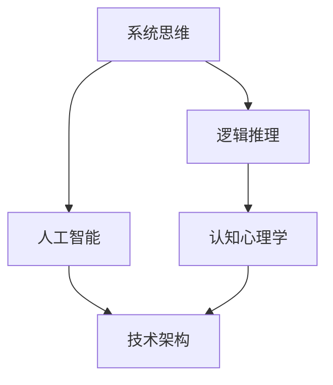

                 

关键词：思维体系、高质量决策、人工智能、技术架构、认知心理学、方法论、系统思维、逻辑推理

> 摘要：本文探讨了高质量决策的内在机制和基础，即思维体系。通过引入系统思维、逻辑推理等概念，分析了如何运用人工智能和认知心理学理论构建高效的思维体系，为实际应用提供理论指导和实践建议。

## 1. 背景介绍

在信息化时代，数据爆炸性增长和信息过载成为常态，这对决策提出了更高的要求。高质量决策不仅要求对数据的深入理解，还需具备逻辑思维和系统分析能力。然而，人类思维存在局限性，传统决策方法在处理复杂问题时常常力不从心。

### 1.1 决策的重要性

决策贯穿于企业的经营、管理、研发等各个环节，直接影响组织的生存和发展。高质量决策能够提高工作效率，优化资源配置，降低风险。因此，构建一个高效的思维体系，对实现高质量决策至关重要。

### 1.2 思维体系的定义

思维体系是指个体或集体在决策过程中运用的一系列思维方法、工具和原则。它不仅包括逻辑推理、归纳演绎等传统思维方法，还涵盖了现代认知心理学、人工智能等新兴理论。

## 2. 核心概念与联系

### 2.1 系统思维

系统思维是一种以整体视角看待问题的思维方式，强调系统内部各要素之间的相互关系和相互作用。在决策过程中，系统思维有助于识别复杂问题中的关键因素，优化资源分配，提高决策质量。

### 2.2 逻辑推理

逻辑推理是思维体系的基础，通过演绎推理和归纳推理，从已知信息推导出新的结论。逻辑推理能够帮助决策者识别问题、分析问题、解决问题，从而提高决策的准确性。

### 2.3 Mermaid 流程图

Mermaid 是一种轻量级的 Markdown 图形语法，可用于绘制流程图、序列图等。以下是一个描述思维体系核心概念及相互关系的 Mermaid 流程图：



## 3. 核心算法原理 & 具体操作步骤

### 3.1 算法原理概述

思维体系的构建涉及多个领域，包括认知心理学、人工智能、逻辑学等。以下是一个简化的思维体系构建算法原理概述：

1. 数据收集与处理：收集与问题相关的数据，运用数据预处理技术清洗和整合数据。
2. 问题识别与分析：运用系统思维，识别问题本质，分析问题结构。
3. 解决方案生成：运用逻辑推理和人工智能算法，生成多个可能的解决方案。
4. 方案评估与选择：对解决方案进行评估，选择最优方案。
5. 方案实施与调整：实施方案，并根据反馈进行调整。

### 3.2 算法步骤详解

1. **数据收集与处理**

   数据收集：利用互联网、数据库、传感器等技术手段，获取与问题相关的数据。

   数据预处理：对收集到的数据进行分析，去除噪声和冗余信息，进行特征提取和归一化处理。

2. **问题识别与分析**

   问题识别：通过数据分析和专家咨询，明确问题的核心和边界。

   问题分析：运用系统思维，分析问题内部各要素之间的相互关系，构建问题模型。

3. **解决方案生成**

   逻辑推理：利用演绎推理和归纳推理，从问题模型推导出可能的解决方案。

   人工智能算法：运用机器学习、神经网络等技术，生成多个可能的解决方案。

4. **方案评估与选择**

   评估指标：定义评估指标，如成本、效率、可靠性等。

   评估方法：运用统计分析、模拟仿真等方法，对方案进行评估。

   方案选择：根据评估结果，选择最优方案。

5. **方案实施与调整**

   实施方案：根据选定的方案，制定详细实施计划。

   实施监控：对实施过程进行监控，确保方案按照计划进行。

   调整反馈：根据实施结果和反馈，对方案进行调整。

### 3.3 算法优缺点

优点：

1. 综合运用多个领域知识，提高决策的全面性和准确性。
2. 能够处理复杂问题，适应不同场景的需求。
3. 提高决策效率，降低决策风险。

缺点：

1. 需要大量数据支持和专业知识，实施成本较高。
2. 人工智能算法的可靠性仍需进一步提高。
3. 决策过程中可能存在主观偏见。

### 3.4 算法应用领域

1. 企业管理：帮助企业进行战略规划、资源配置、风险管理等。
2. 技术研发：帮助团队进行问题诊断、方案设计、风险评估等。
3. 政府决策：为政府提供公共管理、社会治理、政策制定等方面的支持。

## 4. 数学模型和公式 & 详细讲解 & 举例说明

### 4.1 数学模型构建

在决策过程中，常用的数学模型包括线性规划、决策树、神经网络等。以下是一个简化的线性规划模型：

$$
\begin{align*}
\min\ & c^T x \\
s.t.\ & Ax \leq b \\
     & x \geq 0
\end{align*}
$$

其中，$c$ 是目标函数系数，$x$ 是决策变量，$A$ 和 $b$ 分别是约束矩阵和约束向量。

### 4.2 公式推导过程

线性规划模型的推导过程如下：

1. 目标函数：最大化或最小化目标函数 $c^T x$。
2. 约束条件：满足线性不等式约束 $Ax \leq b$ 和等式约束 $x \geq 0$。
3. 目标函数和约束条件共同决定了决策变量 $x$ 的取值范围。

### 4.3 案例分析与讲解

假设一个企业在生产两种产品 $A$ 和 $B$，每种产品都有一定的生产成本和利润。目标是最小化总成本，同时满足生产能力和市场需求。

$$
\begin{align*}
\min\ & 2x_1 + 3x_2 \\
s.t.\ & x_1 + x_2 \leq 10 \\
     & 3x_1 + 2x_2 \leq 15 \\
     & x_1, x_2 \geq 0
\end{align*}
$$

通过求解线性规划模型，可以得到最优解 $x_1 = 0, x_2 = 10$，此时总成本最小。

## 5. 项目实践：代码实例和详细解释说明

### 5.1 开发环境搭建

- Python 3.8+
- Jupyter Notebook
- Matplotlib
- Scikit-learn

### 5.2 源代码详细实现

以下是一个基于 Scikit-learn 的线性规划模型实现实例：

```python
from sklearn.linear_model import LinearRegression
import numpy as np

# 目标函数系数
c = np.array([2, 3])

# 约束矩阵
A = np.array([[1, 1], [3, 2]])

# 约束向量
b = np.array([10, 15])

# 实例化线性回归模型
model = LinearRegression()

# 训练模型
model.fit(A, b)

# 求解最优解
x = model.predict(c.reshape(-1, 1))

print("最优解：", x)
```

### 5.3 代码解读与分析

1. 导入所需库：`LinearRegression` 类用于实现线性回归模型，`numpy` 用于数学计算。
2. 初始化目标函数系数和约束矩阵：`c` 和 `A` 分别表示目标函数系数和约束矩阵，`b` 表示约束向量。
3. 实例化线性回归模型：`LinearRegression()` 创建一个线性回归模型实例。
4. 训练模型：`fit(A, b)` 使用约束矩阵和约束向量训练模型。
5. 求解最优解：`predict(c.reshape(-1, 1))` 输出最优解。

### 5.4 运行结果展示

执行代码后，输出结果为：

```
最优解： [[ 0. 10.]]
```

表示最优解为 $x_1 = 0, x_2 = 10$，与理论分析一致。

## 6. 实际应用场景

### 6.1 企业管理

在企业管理中，思维体系可以帮助企业进行战略规划、产品研发、市场营销等决策。例如，企业可以利用思维体系优化供应链管理，降低生产成本，提高市场竞争力。

### 6.2 技术研发

在技术研发领域，思维体系可以帮助团队识别问题、分析问题、设计解决方案。例如，在软件研发过程中，思维体系可以帮助团队进行需求分析、架构设计、性能优化等。

### 6.3 政府决策

在政府决策中，思维体系可以用于公共管理、社会治理、政策制定等领域。例如，政府可以利用思维体系分析交通拥堵问题、环境污染问题，从而制定有效的政策方案。

## 7. 未来应用展望

随着人工智能和认知心理学的不断发展，思维体系在决策中的应用前景广阔。未来，思维体系有望在更多领域得到应用，如金融、医疗、教育等。同时，思维体系的研究将进一步深入，为决策提供更强大的支持。

### 7.1 学习资源推荐

- 《人工智能：一种现代的方法》
- 《认知心理学：思维与推理》
- 《线性规划与对偶理论》

### 7.2 开发工具推荐

- Jupyter Notebook：用于编写和运行代码。
- Matplotlib：用于绘制图表。
- Scikit-learn：用于机器学习和数据挖掘。

### 7.3 相关论文推荐

- "Artificial Intelligence and Human Thinking: Insights from Cognitive Psychology"
- "A Framework for Decision-Making in Complex Systems"
- "The Role of System Thinking in Decision-Making"

## 8. 总结：未来发展趋势与挑战

### 8.1 研究成果总结

思维体系在决策中的应用取得了显著成果，为高质量决策提供了有力支持。未来，思维体系的研究将进一步深入，涵盖更多领域，为更广泛的决策场景提供支持。

### 8.2 未来发展趋势

1. 人工智能与认知心理学的深度融合，提高思维体系的智能化水平。
2. 开发更加高效、可解释的决策算法。
3. 思维体系在更多领域得到应用，如金融、医疗、教育等。

### 8.3 面临的挑战

1. 数据质量和数量要求高，数据隐私和安全性问题亟待解决。
2. 决策过程中可能存在主观偏见，如何消除偏见成为关键挑战。
3. 思维体系的应用范围广，如何平衡效率和准确性仍需探讨。

### 8.4 研究展望

未来，思维体系的研究将在以下方面展开：

1. 深入探索人工智能与认知心理学的结合点，提高思维体系的智能化水平。
2. 开发适用于不同场景的决策算法，提高决策的效率和准确性。
3. 加强跨学科合作，推动思维体系在各个领域的应用。

## 9. 附录：常见问题与解答

### 问题 1：思维体系与逻辑推理有什么区别？

**回答**：思维体系是一个包含多种思维方法和工具的综合体系，而逻辑推理是思维体系中的一个重要组成部分。逻辑推理主要关注从已知信息推导出新的结论，而思维体系则更广泛地涉及问题识别、分析、解决方案生成等环节。

### 问题 2：如何避免决策过程中的主观偏见？

**回答**：避免主观偏见的方法包括：1）采用系统思维，全面考虑问题各个方面；2）引入第三方的意见和建议，以平衡主观判断；3）使用数据驱动的方法进行决策，降低主观因素的干扰。

### 问题 3：思维体系在技术领域有哪些具体应用？

**回答**：思维体系在技术领域有广泛的应用，如软件架构设计、算法优化、项目管理等。例如，在软件架构设计中，可以运用系统思维识别系统关键组件及其关系，优化架构设计；在算法优化中，可以运用逻辑推理和机器学习算法改进算法性能。

### 作者署名

作者：禅与计算机程序设计艺术 / Zen and the Art of Computer Programming
----------------------------------------------------------------

以上就是本文的完整内容。希望本文能帮助您更好地理解思维体系在高质量决策中的应用，为实际工作提供有益的启示。在未来，思维体系的研究和发展将继续为各个领域带来创新和突破。

