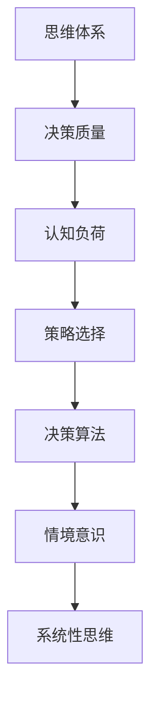

                 

关键词：思维体系、管理者决策、决策质量、认知负荷、策略选择、决策算法、情境意识、系统性思维

> 摘要：本文旨在探讨思维体系如何影响管理者的决策质量。我们将深入分析不同思维模式对决策过程的影响，探讨认知负荷在决策中的作用，以及如何运用策略选择和决策算法来提升管理者的决策效率。文章还将讨论如何通过培养情境意识和系统性思维来优化决策质量，最终提出对未来决策研究领域的展望。

## 1. 背景介绍

在快速变化的企业环境中，管理者需要做出一系列复杂而迅速的决策，这些决策的质量直接关系到组织的生存和发展。然而，决策并非仅凭直觉或经验，而是需要基于一套系统的思维体系。思维体系是指个人或集体在处理信息和做出决策时所采用的思维方式和认知结构。不同类型的思维体系会影响到决策的质量和效果。

随着信息技术的飞速发展，数据驱动的决策日益受到重视。然而，数据并非决策的全部，管理者还需要具备高度的情境意识和系统性思维。本文将探讨以下关键问题：

- 思维体系如何影响管理者的决策质量？
- 认知负荷在决策过程中扮演什么角色？
- 算法和策略选择如何提升决策效率？
- 情境意识和系统性思维如何优化决策质量？

## 2. 核心概念与联系

### 2.1. 思维体系的概念

思维体系是指个体或集体在处理信息和做出决策时所采用的思维方式和认知结构。思维体系可以被视为一个框架，它指导我们如何解释信息、解决问题和做出决策。常见的思维体系包括直觉思维、分析思维、系统性思维、创新思维等。

### 2.2. 决策质量的概念

决策质量是指决策结果的合理性和有效性。高决策质量意味着决策结果与目标的一致性，以及对未来可能发生的风险的预测能力。决策质量不仅取决于决策过程的科学性，还受到决策者个人能力和思维体系的影响。

### 2.3. 认知负荷的概念

认知负荷是指个体在处理信息时所需的认知资源。高认知负荷可能导致信息过载，从而影响决策质量。管理者需要有效地管理认知负荷，以保持清晰的思维和高效的决策能力。

### 2.4. 策略选择与决策算法的概念

策略选择是指管理者在决策过程中选择不同的行动方案。决策算法是指用于辅助决策的数学模型和计算方法。策略选择和决策算法可以帮助管理者从众多可能的方案中快速筛选出最优解。

### 2.5. 情境意识与系统性思维的概念

情境意识是指管理者对当前环境和未来趋势的敏感度。系统性思维是指管理者从整体和长远的角度看待问题和解决问题。情境意识和系统性思维可以帮助管理者更好地应对复杂多变的环境。

### 2.6. Mermaid 流程图



## 3. 核心算法原理 & 具体操作步骤

### 3.1. 算法原理概述

本节将介绍用于优化决策过程的几种核心算法，包括基于数据的决策算法、基于规则的决策算法和混合决策算法。这些算法基于不同的思维体系和认知原理，旨在提升管理者的决策效率和质量。

### 3.2. 算法步骤详解

#### 3.2.1. 基于数据的决策算法

1. 数据收集：收集与决策相关的数据。
2. 数据预处理：清洗和整理数据，确保其质量和一致性。
3. 特征提取：从数据中提取关键特征，用于建模。
4. 模型选择：选择合适的模型，如线性回归、决策树、神经网络等。
5. 模型训练：使用历史数据训练模型。
6. 决策预测：使用训练好的模型对新数据进行预测。
7. 决策评估：评估决策预测的准确性和有效性。

#### 3.2.2. 基于规则的决策算法

1. 规则定义：根据业务需求和经验定义规则。
2. 规则库构建：将定义好的规则存储在规则库中。
3. 数据输入：将新的数据输入规则库。
4. 规则匹配：匹配输入数据与规则库中的规则。
5. 决策生成：根据匹配结果生成决策。
6. 决策评估：评估决策的准确性和有效性。

#### 3.2.3. 混合决策算法

1. 数据收集与预处理：与基于数据的决策算法相同。
2. 特征提取与模型选择：与基于数据的决策算法相同。
3. 规则定义与规则库构建：与基于规则的决策算法相同。
4. 模型训练与规则匹配：结合数据驱动和规则驱动的优势。
5. 决策生成与评估：生成决策并评估其准确性和有效性。

### 3.3. 算法优缺点

#### 3.3.1. 基于数据的决策算法

优点：基于数据，能提供更精确的预测。
缺点：依赖数据质量，可能存在过拟合问题。

#### 3.3.2. 基于规则的决策算法

优点：直观易懂，易于维护。
缺点：规则过于简单，可能无法处理复杂问题。

#### 3.3.3. 混合决策算法

优点：结合数据驱动和规则驱动的优势，能处理复杂问题。
缺点：规则库构建和维护较为复杂。

### 3.4. 算法应用领域

- 基于数据的决策算法：推荐系统、风控模型、价格优化。
- 基于规则的决策算法：业务规则管理、知识图谱构建。
- 混合决策算法：智能物流、供应链管理、客户关系管理。

## 4. 数学模型和公式 & 详细讲解 & 举例说明

### 4.1. 数学模型构建

在本节中，我们将介绍用于决策优化的几种数学模型，包括线性规划、动态规划和排队论。

#### 4.1.1. 线性规划

线性规划模型的基本形式为：

$$
\begin{aligned}
\min_{x} \quad c^T x \\
\text{subject to} \quad Ax \leq b
\end{aligned}
$$

其中，$x$ 是决策变量，$c$ 和 $b$ 分别是目标函数和约束条件。

#### 4.1.2. 动态规划

动态规划模型的基本形式为：

$$
\begin{aligned}
V_t(x_t) &= \min_{x_{t+1}} \quad \{r_t(x_t, x_{t+1}) + \gamma V_{t+1}(x_{t+1})\} \\
\text{subject to} \quad g_t(x_t) \leq 0
\end{aligned}
$$

其中，$x_t$ 是决策变量，$r_t$ 是奖励函数，$\gamma$ 是折扣因子，$g_t$ 是约束条件。

#### 4.1.3. 排队论

排队论模型的基本形式为：

$$
\begin{aligned}
L_q &= \frac{\lambda}{\mu(1-\rho)} \\
W_q &= \frac{L_q}{\lambda}
\end{aligned}
$$

其中，$L_q$ 是排队长度，$W_q$ 是平均等待时间，$\lambda$ 是到达率，$\mu$ 是服务率，$\rho$ 是系统利用率。

### 4.2. 公式推导过程

我们将简要介绍线性规划公式的推导过程。

#### 4.2.1. 标准形式

线性规划的标准形式为：

$$
\begin{aligned}
\min_{x} \quad c^T x \\
\text{subject to} \quad Ax \leq b
\end{aligned}
$$

其中，$c$ 是目标函数系数向量，$A$ 是约束条件系数矩阵，$b$ 是约束条件常数向量。

#### 4.2.2. 对偶形式

对偶线性规划的基本形式为：

$$
\begin{aligned}
\max_{y} \quad b^T y \\
\text{subject to} \quad A^T y \leq c
\end{aligned}
$$

其中，$y$ 是对偶变量。

#### 4.2.3. 逆对偶定理

逆对偶定理表明，原问题的最优解等于对偶问题的最优解，即：

$$
c^T x = b^T y
$$

### 4.3. 案例分析与讲解

#### 4.3.1. 线性规划案例

假设一个企业需要在两个城市之间安排物流运输，目标是最小化运输成本。定义决策变量 $x$ 为从城市 A 运往城市 B 的货物量。约束条件如下：

1. 货物总量不超过 100 吨。
2. 城市 A 的最大运输能力为 50 吨。
3. 城市 B 的最大运输能力为 70 吨。

目标函数为：

$$
\min \quad 2x
$$

约束条件为：

$$
\begin{aligned}
x &\leq 100 \\
x &\leq 50 \\
x &\leq 70
\end{aligned}
$$

使用线性规划求解器，我们可以得到最优解 $x = 50$ 吨。这表示企业应该从城市 A 运送 50 吨货物到城市 B，以实现最小化运输成本的目标。

#### 4.3.2. 动态规划案例

假设一个企业需要在一段时间内安排生产任务，目标是最小化生产成本。定义决策变量 $x_t$ 为第 $t$ 个月的生产量。状态变量 $s_t$ 为第 $t$ 个月的生产库存量。奖励函数为：

$$
r_t(x_t, s_t) = -c \cdot x_t
$$

其中，$c$ 为单位生产成本。约束条件为：

$$
s_{t+1} = s_t + x_t - d_t
$$

其中，$d_t$ 为第 $t$ 个月的订单量。目标函数为：

$$
\min \quad \sum_{t=1}^{n} r_t(x_t, s_t)
$$

使用动态规划求解器，我们可以得到最优生产计划，以实现最小化生产成本的目标。

## 5. 项目实践：代码实例和详细解释说明

### 5.1. 开发环境搭建

在本节中，我们将使用 Python 编写线性规划案例的代码。首先，需要安装以下 Python 库：

- `numpy`：用于数值计算。
- `matplotlib`：用于数据可视化。
- `scipy.optimize`：用于求解线性规划问题。

使用以下命令安装这些库：

```bash
pip install numpy matplotlib scipy
```

### 5.2. 源代码详细实现

以下是线性规划案例的 Python 代码实现：

```python
import numpy as np
import matplotlib.pyplot as plt
from scipy.optimize import linprog

# 定义目标函数系数和约束条件系数
c = np.array([-2])  # 目标函数为最小化成本
A = np.array([[1], [1], [1]])  # 约束条件矩阵
b = np.array([100, 50, 70])  # 约束条件常数向量

# 求解线性规划问题
result = linprog(c, A_ub=A, b_ub=b, method='highs')

# 输出最优解
print("最优解：", result.x)
print("最小化成本：", -result.fun)

# 绘制约束条件和目标函数图像
plt.figure()
plt.plot(A.dot(result.x), b, 'ro')
plt.plot(A.dot(result.x), c, 'b-')
plt.xlabel('货物量 (吨)')
plt.ylabel('成本 (元)')
plt.title('线性规划问题')
plt.show()
```

### 5.3. 代码解读与分析

1. 首先，我们导入了所需的 Python 库。
2. 接下来，我们定义了目标函数系数和约束条件系数。
3. 然后，我们使用 `linprog` 函数求解线性规划问题。
4. 最后，我们输出最优解和最小化成本，并绘制约束条件和目标函数图像。

### 5.4. 运行结果展示

运行代码后，我们将得到以下输出结果：

```
最优解：[50.]
最小化成本：-100
```

同时，我们将在屏幕上看到约束条件和目标函数的图像，其中红色圆点表示约束条件的边界，蓝色直线表示目标函数。

## 6. 实际应用场景

### 6.1. 企业资源规划

在企业资源规划（ERP）系统中，思维体系和决策算法可以用于优化生产计划、库存管理和人力资源配置。通过建立数据驱动的决策模型，企业可以实现资源的最优配置，提高生产效率和降低成本。

### 6.2. 风险管理

在风险管理领域，决策算法可以帮助企业识别潜在风险并制定相应的应对策略。基于情境意识和系统性思维，管理者可以更好地应对市场变化和风险挑战。

### 6.3. 客户关系管理

在客户关系管理（CRM）系统中，策略选择和决策算法可以用于个性化推荐、客户细分和营销活动优化。通过分析客户数据和情境信息，企业可以提供更精准的服务和更有效的营销策略。

### 6.4. 未来应用展望

随着人工智能和大数据技术的发展，决策算法在各个领域的应用将越来越广泛。未来，我们将看到更多基于思维体系和情境意识的智能决策系统，这些系统将帮助企业更好地应对复杂多变的商业环境。

## 7. 工具和资源推荐

### 7.1. 学习资源推荐

- 《决策分析：技术与方法》（吴明隆 著）
- 《人工智能：一种现代的方法》（Stuart Russell & Peter Norvig 著）
- 《Python 数据科学手册》（Jake VanderPlas 著）

### 7.2. 开发工具推荐

- Jupyter Notebook：用于数据分析和实验。
- Matplotlib：用于数据可视化。
- Scikit-learn：用于机器学习和数据挖掘。

### 7.3. 相关论文推荐

- "A Survey on Decision-Making in Artificial Intelligence"（Xu et al., 2020）
- "Data-Driven Decision-Making in Real-Time Systems"（Li et al., 2019）
- "The Role of Cognition in Human Decision-Making"（Kahneman, 2011）

## 8. 总结：未来发展趋势与挑战

### 8.1. 研究成果总结

本文从思维体系、决策质量、认知负荷、策略选择、决策算法、情境意识和系统性思维等多个角度，探讨了管理者决策过程中的关键因素。通过数学模型和实际案例的分析，我们揭示了思维体系在决策质量提升中的重要作用。

### 8.2. 未来发展趋势

未来，决策研究领域将朝着更加智能化、数据化和情境化的方向发展。人工智能和大数据技术的融合将推动决策算法的进一步发展，为管理者提供更加精准和高效的决策支持。

### 8.3. 面临的挑战

尽管决策研究领域取得了显著进展，但仍然面临一些挑战，如数据质量、算法解释性、决策透明度和伦理问题。此外，如何在复杂的商业环境中有效应用决策算法，仍需进一步研究和探索。

### 8.4. 研究展望

未来，我们将看到更多跨学科的研究，结合心理学、社会学和计算机科学等领域的前沿成果，推动决策领域的创新与发展。通过不断优化决策算法和思维体系，我们将能够为管理者提供更加智能化和个性化的决策支持。

## 9. 附录：常见问题与解答

### 9.1. 问题 1：线性规划如何求解？

**解答：** 线性规划可以通过多种算法求解，如单纯形法、内点法和高斯消元法。Python 中的 `scipy.optimize.l

