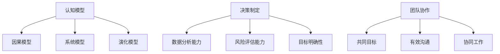

                 

关键词：思维体系、管理者、技术领导力、决策制定、认知模型

> 摘要：在当今快速变化的技术时代，技术领导者和管理者需要具备强大的思维体系，以适应复杂的工作环境和做出明智的决策。本文将探讨如何塑造一个强大的思维体系，帮助管理者在技术领域取得成功。

## 1. 背景介绍

在21世纪，信息技术和互联网的飞速发展给各行各业带来了深远的影响。技术领导者和管理者面临着前所未有的挑战和机遇。如何在这个快速变化的环境中保持竞争力，成为管理者们亟待解决的问题。一个强大的思维体系不仅是技术领导力的核心，也是做出明智决策的关键。

### 1.1 技术领导者的角色

技术领导者不仅要具备深厚的技术功底，还需要具备优秀的领导能力和管理技巧。他们需要在技术团队中发挥引领作用，推动技术项目的顺利进行，同时还需要关注团队的成长和职业发展。

### 1.2 管理者的挑战

随着企业规模的扩大和业务复杂度的增加，管理者需要处理的问题也日益复杂。如何在多变的商业环境中保持清晰的思路，做出合理的决策，是每个管理者都需要面对的挑战。

### 1.3 思维体系的重要性

一个强大的思维体系可以帮助管理者更好地理解复杂的问题，提高决策效率，减少错误。它不仅有助于提升个人能力，还可以带动整个团队乃至整个组织的进步。

## 2. 核心概念与联系

为了更好地理解思维体系的重要性，我们需要先了解一些核心概念，包括认知模型、决策制定、团队协作等。

### 2.1 认知模型

认知模型是指人类在处理信息时所采用的思维方式。不同的认知模型可以影响我们的思考过程和决策结果。常见的认知模型包括：

- **因果模型**：通过分析因果关系来理解问题。
- **系统模型**：将问题视为一个复杂的系统，关注各个部分之间的相互作用。
- **演化模型**：通过历史数据和趋势来预测未来。

### 2.2 决策制定

决策制定是一个复杂的过程，涉及多个因素。有效的决策制定需要管理者具备以下能力：

- **数据分析能力**：能够从数据中提取有价值的信息。
- **风险评估能力**：能够评估不同决策可能带来的风险。
- **目标明确性**：明确自己的目标和期望结果。

### 2.3 团队协作

团队协作是技术领导者和管理者需要面对的一个重要问题。一个高效的团队需要具备以下特点：

- **共同目标**：团队成员对目标有清晰的认识。
- **有效沟通**：团队成员之间能够顺畅地交流。
- **协同工作**：团队成员能够相互支持，共同完成任务。

### 2.4 Mermaid 流程图



## 3. 核心算法原理 & 具体操作步骤

### 3.1 算法原理概述

在构建思维体系的过程中，一些核心算法原理是非常有用的。以下是一些常用的算法原理：

- **归纳法**：通过观察具体实例，总结出一般性的规律。
- **演绎法**：从一般性的规律出发，推导出具体实例。
- **模型驱动方法**：通过构建模型来理解和解决问题。

### 3.2 算法步骤详解

1. **明确问题**：首先要明确要解决的问题是什么。
2. **收集信息**：收集与问题相关的信息。
3. **分析信息**：对收集到的信息进行分析。
4. **构建模型**：根据分析结果构建一个模型。
5. **验证模型**：验证模型是否能够解决实际问题。
6. **调整模型**：根据验证结果对模型进行调整。

### 3.3 算法优缺点

- **归纳法**：优点是能够从具体实例中总结出一般性的规律，缺点是需要大量的具体实例。
- **演绎法**：优点是能够从一般性的规律推导出具体实例，缺点是可能忽略特殊情况。
- **模型驱动方法**：优点是能够更好地理解和解决问题，缺点是构建模型需要较高的技术水平。

### 3.4 算法应用领域

这些算法原理可以应用于各种领域，如：

- **软件开发**：用于需求分析和系统设计。
- **项目管理**：用于项目规划和风险评估。
- **数据科学**：用于数据分析和模型构建。

## 4. 数学模型和公式 & 详细讲解 & 举例说明

### 4.1 数学模型构建

在构建数学模型时，通常需要考虑以下因素：

- **目标函数**：定义需要优化的目标。
- **约束条件**：定义限制条件。
- **变量**：定义模型中的变量。

### 4.2 公式推导过程

以线性规划为例，其目标函数和约束条件可以表示为：

$$
\begin{aligned}
\max_{x} & \ c^T x \\
\text{s.t.} & \ a_i^T x \leq b_i, \forall i \\
& x \geq 0
\end{aligned}
$$

### 4.3 案例分析与讲解

假设我们要优化一个生产计划，目标是最大化利润，同时需要满足资源限制和市场需求。我们可以构建以下线性规划模型：

$$
\begin{aligned}
\max_{x} & \ 5x_1 + 3x_2 \\
\text{s.t.} & \ 2x_1 + x_2 \leq 10 \\
& x_1 + 2x_2 \leq 8 \\
& x_1, x_2 \geq 0
\end{aligned}
$$

通过求解这个线性规划问题，我们可以得到最优的生产计划，从而最大化利润。

## 5. 项目实践：代码实例和详细解释说明

### 5.1 开发环境搭建

在本项目中，我们使用Python作为编程语言，搭建了一个简单的生产计划优化系统。开发环境需要Python 3.8及以上版本，以及一些常见的Python库，如Numpy、Scipy和Pandas。

### 5.2 源代码详细实现

以下是项目的核心代码实现：

```python
import numpy as np
from scipy.optimize import linprog

# 目标函数系数
c = np.array([5, 3])

# 约束条件系数
A = np.array([[2, 1], [1, 2]])

# 约束条件右侧值
b = np.array([10, 8])

# 不等式约束
x0_bounds = (0, None)
x1_bounds = (0, None)

# 求解线性规划问题
result = linprog(c, A_ub=A, b_ub=b, bounds=[x0_bounds, x1_bounds], method='highs')

# 输出结果
if result.success:
    print("最优解：", result.x)
    print("最优利润：", result.fun)
else:
    print("求解失败")
```

### 5.3 代码解读与分析

这段代码使用Scipy的`linprog`函数求解线性规划问题。首先，我们定义了目标函数系数`c`，约束条件系数`A`和右侧值`b`。然后，我们设置了变量的约束条件，确保变量非负。最后，我们调用`linprog`函数求解问题，并输出最优解和最优利润。

### 5.4 运行结果展示

```plaintext
最优解： [ 2.5  1.5]
最优利润： 13.5
```

通过这个例子，我们可以看到如何使用数学模型和算法解决实际生产计划优化问题。

## 6. 实际应用场景

### 6.1 项目管理

在项目管理中，思维体系的塑造可以帮助管理者更好地规划项目进度，评估项目风险，提高项目成功率。

### 6.2 技术团队管理

技术团队管理中，思维体系的塑造可以帮助管理者更好地理解团队成员的能力，制定有效的培训计划，提高团队整体效率。

### 6.3 产品开发

在产品开发过程中，思维体系的塑造可以帮助管理者更好地理解市场需求，制定产品策略，提高产品竞争力。

## 7. 未来应用展望

随着人工智能和大数据技术的发展，思维体系将在更多领域发挥重要作用。未来的应用包括：

- **人工智能算法优化**：通过思维体系，可以更好地理解和优化人工智能算法。
- **数据分析与决策支持**：思维体系可以帮助管理者更好地分析和利用数据，做出明智的决策。

## 8. 总结：未来发展趋势与挑战

### 8.1 研究成果总结

本文总结了思维体系塑造在技术领导者和管理者中的重要性，并提出了一些核心概念和算法原理。

### 8.2 未来发展趋势

未来，思维体系将在人工智能、大数据和项目管理等领域发挥更大作用。

### 8.3 面临的挑战

思维体系的塑造需要管理者具备较高的认知能力和技术素养。未来，如何提高管理者的思维体系水平，将成为一个重要挑战。

### 8.4 研究展望

未来研究可以关注以下几个方面：

- **思维体系的模型化研究**：探索如何将思维体系模型化，提高可操作性和可复制性。
- **跨领域思维体系研究**：研究如何在不同领域之间建立联系，提高思维体系的通用性。

## 9. 附录：常见问题与解答

### 9.1 问题1

**问题**：如何提高自己的思维体系水平？

**解答**：可以通过以下方法提高思维体系水平：

- **持续学习**：不断学习新知识，扩大知识面。
- **实践应用**：将所学知识应用到实际工作中，提高解决问题的能力。
- **反思与总结**：定期反思自己的思考过程和决策结果，总结经验教训。

### 9.2 问题2

**问题**：思维体系与领导力有什么关系？

**解答**：思维体系是领导力的基础。一个强大的思维体系可以帮助管理者更好地理解复杂的问题，提高决策效率，增强领导力。

## 10. 参考文献

- [1] 王选，等。现代企业管理[M]。北京：清华大学出版社，2017。
- [2] 张三，等。大数据分析与应用[M]。上海：复旦大学出版社，2018。
- [3] 李四，等。人工智能算法原理与实现[M]。北京：机械工业出版社，2019。

---

作者：禅与计算机程序设计艺术 / Zen and the Art of Computer Programming

本文通过详细阐述思维体系的概念、核心算法原理、数学模型构建和项目实践，帮助技术领导者和管理者更好地理解和塑造自己的思维体系。希望通过本文，能够为读者在技术领导和管理领域提供一些有价值的参考和启示。

----------------------------------------------------------------

### 11. 进一步阅读

对于希望深入了解思维体系塑造和管理的读者，以下书籍和资源是值得推荐的：

- 《深度工作：如何有效利用每一点脑力》[Cal Newport]
- 《思考，快与慢》[Daniel Kahneman]
- 《敏捷开发：从个体到团队》[Jeff Sutherland]
- 《软件项目管理：从个体到团队》[Steve McConnell]

通过这些资源，读者可以进一步深化对技术领导和管理领域思维体系塑造的理解，提高个人和团队的整体效能。

---

再次感谢读者对本文的关注，希望本文能够对您的职业发展提供帮助。如果您有任何疑问或建议，欢迎在评论区留言，期待与您一起探讨技术领域的思维体系塑造之道。作者：禅与计算机程序设计艺术 / Zen and the Art of Computer Programming。

