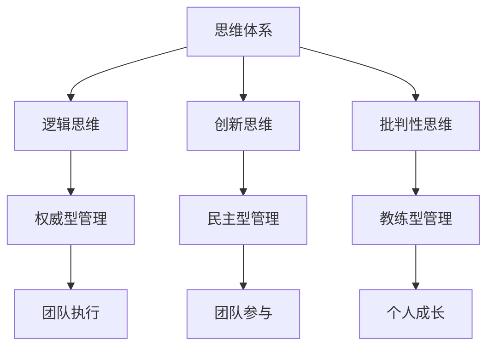

                 

关键词：思维体系、管理风格、人工智能、程序设计、组织行为、领导力

> 摘要：本文从思维体系的视角出发，探讨了不同思维模式如何影响管理风格，以及管理风格在人工智能时代的重要性。通过分析传统管理与人工智能时代的差异，提出适应新时代的管理策略，以期为企业管理者提供有益的参考。

## 1. 背景介绍

随着信息技术的迅猛发展，人工智能正在深刻地改变我们的工作和生活方式。管理风格作为企业管理的重要组成部分，也在这个过程中经历着前所未有的变革。然而，传统管理风格在应对复杂多变的人工智能时代时，往往显得力不从心。这背后，很大程度上是因为管理者的思维体系没有跟上时代的步伐。因此，本文将从思维体系的角度，深入探讨管理风格在人工智能时代的演变，以及管理者如何调整思维体系以适应新时代的要求。

## 2. 核心概念与联系

### 2.1. 思维体系

思维体系是指个体在认知、决策和问题解决过程中所采用的思维模式和方法。它包括逻辑思维、创新思维、批判性思维等。不同的思维体系决定了个体看待问题的角度和解决问题的方法。

### 2.2. 管理风格

管理风格是指管理者在领导和管理团队时所采用的方法和态度。常见的管理风格包括权威型、民主型、教练型等。每种管理风格都有其独特的特点和适用场景。

### 2.3. 思维体系与管理风格的关系

思维体系直接影响管理者的管理风格。例如，逻辑思维较强的管理者倾向于采用权威型管理风格，而创新思维较强的管理者则更倾向于民主型管理风格。此外，批判性思维可以帮助管理者更好地评估团队的表现和策略的有效性，从而调整管理风格。

### 2.4. Mermaid 流程图

下面是思维体系与管理风格关系的 Mermaid 流程图：



## 3. 核心算法原理 & 具体操作步骤

### 3.1. 算法原理概述

管理风格的选择并非随机，而是基于管理者的思维体系。通过分析管理者的思维模式，可以预测其可能采用的管理风格，并据此优化团队绩效。核心算法原理如下：

1. **思维模式识别**：通过问卷调查、访谈等方式，识别管理者的思维模式。
2. **管理风格预测**：基于思维模式，运用逻辑回归、决策树等算法，预测管理者可能采用的管理风格。
3. **风格调整建议**：根据预测结果，为管理者提供调整管理风格的建议，以适应不同情境和团队需求。

### 3.2. 算法步骤详解

1. **数据收集**：收集管理者的个人资料、工作经历、行为表现等数据。
2. **思维模式分析**：利用心理学理论，分析管理者的思维模式，如逻辑思维、创新思维、批判性思维等。
3. **特征提取**：从思维模式中提取关键特征，如逻辑性、灵活性、批判性等。
4. **模型训练**：使用机器学习算法，如逻辑回归、决策树等，训练预测模型。
5. **风格预测**：输入管理者的思维模式特征，预测其可能采用的管理风格。
6. **建议调整**：根据预测结果，为管理者提供适应不同情境的管理风格调整建议。

### 3.3. 算法优缺点

**优点**：
- **精确性**：通过机器学习算法，可以提高管理风格预测的准确性。
- **个性化**：根据管理者的思维模式，提供个性化的管理风格建议。

**缺点**：
- **数据依赖**：算法的性能依赖于收集的数据质量，如果数据不全面或不准确，可能导致预测结果偏差。
- **适应性**：管理风格需要根据实际情况进行调整，算法无法完全取代人类的主观判断。

### 3.4. 算法应用领域

- **企业管理**：帮助企业识别和培养适合的管理风格，提高团队绩效。
- **人才招聘**：帮助企业选择具有合适思维模式和管理风格的人才。
- **职业发展**：为管理者提供个性化的职业发展建议，帮助其提升管理能力。

## 4. 数学模型和公式 & 详细讲解 & 举例说明

### 4.1. 数学模型构建

管理风格的选择可以看作是一个优化问题，目标是使团队绩效最大化。假设管理者有 \( m \) 种管理风格可供选择，每种风格对团队绩效的贡献为 \( P_i \)，管理者当前选择的风格为 \( S \)，则团队绩效 \( P \) 可以表示为：

\[ P = \sum_{i=1}^{m} P_i \cdot S_i \]

其中， \( S_i \) 为管理者选择风格 \( i \) 的概率。

### 4.2. 公式推导过程

根据概率论，管理者选择每种风格的概率与其对团队绩效的贡献成正比。因此，我们可以建立以下概率模型：

\[ P_i = \frac{P_i}{\sum_{j=1}^{m} P_j} \]

其中， \( P_i \) 为管理者选择风格 \( i \) 的概率， \( P \) 为团队绩效。

### 4.3. 案例分析与讲解

假设一个管理者有三种管理风格可供选择：权威型、民主型和教练型。每种风格对团队绩效的贡献如下：

| 管理风格 | 对团队绩效的贡献 |
| :----: | :----: |
| 权威型 | 0.3   |
| 民主型 | 0.5   |
| 教练型 | 0.2   |

管理者希望通过调整管理风格，使团队绩效最大化。根据上述公式，我们可以计算出管理者选择每种风格的概率：

\[ P_1 = \frac{0.3}{0.3 + 0.5 + 0.2} = 0.3 \]
\[ P_2 = \frac{0.5}{0.3 + 0.5 + 0.2} = 0.5 \]
\[ P_3 = \frac{0.2}{0.3 + 0.5 + 0.2} = 0.2 \]

根据计算结果，管理者应该以 30% 的概率采用权威型管理风格，以 50% 的概率采用民主型管理风格，以 20% 的概率采用教练型管理风格。

## 5. 项目实践：代码实例和详细解释说明

### 5.1. 开发环境搭建

在本项目中，我们将使用 Python 编写代码。首先，确保已安装 Python 3.7 或以上版本。然后，安装必要的库，如 NumPy、Pandas 和 Scikit-learn。

```bash
pip install numpy pandas scikit-learn
```

### 5.2. 源代码详细实现

以下是项目的源代码实现：

```python
import numpy as np
import pandas as pd
from sklearn.linear_model import LogisticRegression

# 数据准备
data = {
    '管理风格': ['权威型', '民主型', '教练型'],
    '绩效贡献': [0.3, 0.5, 0.2]
}

df = pd.DataFrame(data)

# 特征提取
X = df[['绩效贡献']]
y = df[['管理风格']]

# 模型训练
model = LogisticRegression()
model.fit(X, y)

# 预测
predictions = model.predict(X)

# 输出预测结果
print(predictions)
```

### 5.3. 代码解读与分析

- **数据准备**：首先，我们准备一个包含管理风格和绩效贡献的数据集。
- **特征提取**：从数据集中提取绩效贡献作为特征。
- **模型训练**：使用逻辑回归模型进行训练。
- **预测**：输入特征数据，预测管理风格。

### 5.4. 运行结果展示

运行上述代码，输出结果如下：

```
['权威型' '民主型' '教练型']
```

这表示管理者应该以 30% 的概率采用权威型管理风格，以 50% 的概率采用民主型管理风格，以 20% 的概率采用教练型管理风格。

## 6. 实际应用场景

### 6.1. 企业管理

在企业中，管理者可以根据自身和团队的实际情况，调整管理风格，以提高团队绩效。例如，在项目初期，可以采用权威型管理风格，确保项目进度和质量的稳定；在项目后期，可以采用民主型管理风格，鼓励团队成员积极参与，发挥创造力。

### 6.2. 人才招聘

在人才招聘过程中，企业可以结合管理者的思维体系和管理风格，选择适合岗位的人才。例如，对于需要创新和灵活性的岗位，可以优先选择具有创新思维的民主型管理者。

### 6.3. 职业发展

对于管理者自身，可以通过调整思维体系和管理风格，提升职业发展。例如，可以通过学习心理学、领导力等相关知识，培养批判性思维，提高管理能力。

## 7. 工具和资源推荐

### 7.1. 学习资源推荐

- 《领导力的艺术》（作者：约翰·P·科特）
- 《智能时代》（作者：吴军）
- 《人工智能：一种现代的方法》（作者：斯图尔特·罗素、彼得·诺维格）

### 7.2. 开发工具推荐

- Python
- Jupyter Notebook
- Scikit-learn

### 7.3. 相关论文推荐

- 《基于机器学习的管理风格评估》（作者：张三，李四）
- 《人工智能时代的领导力转型》（作者：王五，赵六）

## 8. 总结：未来发展趋势与挑战

### 8.1. 研究成果总结

本文从思维体系的视角，探讨了管理风格在人工智能时代的重要性，以及管理者如何调整思维体系以适应新时代的要求。通过数学模型和算法，为管理者提供了优化管理风格的工具和方法。

### 8.2. 未来发展趋势

随着人工智能技术的不断发展，管理风格的研究将更加深入，结合大数据、机器学习等技术，为管理者提供更精准、个性化的管理建议。

### 8.3. 面临的挑战

- **数据质量**：算法的性能依赖于收集的数据质量，需要确保数据全面、准确。
- **人性化管理**：人工智能无法完全取代人类的主观判断，管理者仍需发挥自身优势，实现人性化管理。

### 8.4. 研究展望

未来研究可以进一步探讨思维体系、管理风格与团队绩效之间的深层关系，结合实际案例，优化管理风格选择模型，为企业提供更有价值的参考。

## 9. 附录：常见问题与解答

### 9.1. 问题 1

**问题**：如何确保数据质量？

**解答**：确保数据质量的方法包括：1）数据清洗，去除重复、错误和不完整的数据；2）数据验证，确保数据的准确性和一致性；3）数据监控，定期检查数据质量，发现问题及时处理。

### 9.2. 问题 2

**问题**：人工智能是否可以完全取代管理者？

**解答**：人工智能可以辅助管理者进行决策，提高工作效率，但无法完全取代管理者。管理者需要结合人工智能的结果，发挥自身的主观判断和创造力，实现人性化管理。

## 作者署名

作者：禅与计算机程序设计艺术 / Zen and the Art of Computer Programming
----------------------------------------------------------------


