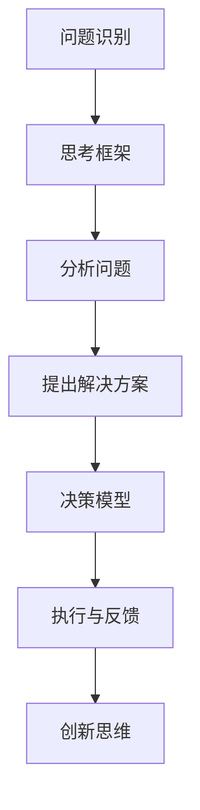

                 

关键词：管理创新、思维体系、创新驱动、企业管理、创新策略、思维工具、技术创新、商业策略

> 摘要：本文旨在探讨思维体系在管理创新中的作用，分析如何通过构建和优化思维体系，推动企业管理者实现创新，提升组织的核心竞争力。文章将首先介绍思维体系的基本概念，然后分析思维体系在管理创新中的核心作用，并结合实际案例，阐述如何应用思维工具促进管理创新。

## 1. 背景介绍

### 1.1 管理创新的重要性

在当今快速变化的市场环境中，管理创新已成为企业持续发展的关键驱动力。传统管理模式和方法往往难以应对新兴技术和消费者需求的变化，因此，企业需要不断创新以保持竞争优势。管理创新不仅包括产品、服务和技术创新，还包括管理理念、组织结构、业务流程等方面的创新。

### 1.2 思维体系的概念

思维体系是指个体或组织在认知、思考、决策等方面的基本框架和原则。一个健全的思维体系能够帮助个体和组织更加全面、深入地理解问题，发现新的解决方案，从而推动创新。

## 2. 核心概念与联系

### 2.1 思维体系的基本构成

思维体系包括以下几个核心组成部分：

1. **问题意识**：敏锐地发现和识别问题的能力。
2. **思考框架**：用于分析和解决问题的思维工具和方法。
3. **决策模型**：基于数据和逻辑的决策过程。
4. **创新思维**：创造新思想、新方法和新解决方案的能力。

### 2.2 思维体系与管理的联系

思维体系在管理中起着至关重要的作用。一个有效的思维体系可以帮助管理者：

- **更准确地识别问题**：通过深入分析和理解，发现问题的本质和根源。
- **更有效地解决问题**：运用科学的方法和工具，提出创新的解决方案。
- **更合理地做出决策**：基于数据和逻辑，做出明智的决策。

### 2.3 Mermaid 流程图



## 3. 核心算法原理 & 具体操作步骤

### 3.1 算法原理概述

思维体系在管理创新中的应用可以视为一种“算法”，其核心原理是：

- **数据驱动**：通过收集和分析数据，了解市场和客户需求，从而发现问题。
- **逻辑分析**：运用各种思维工具和方法，深入分析问题，提出解决方案。
- **创新实践**：在实践过程中不断试错和优化，形成创新的商业模式和管理方法。

### 3.2 算法步骤详解

#### 3.2.1 数据收集与分析

1. **数据收集**：收集市场数据、客户反馈、竞争对手信息等。
2. **数据分析**：运用统计学、数据挖掘等方法，分析数据，识别问题。

#### 3.2.2 思考框架

1. **确定思考方向**：根据问题，确定思考的焦点。
2. **选择思维工具**：如头脑风暴、SWOT分析、5W2H等，用于深入分析问题。

#### 3.2.3 提出解决方案

1. **方案制定**：基于分析结果，制定初步的解决方案。
2. **评估与选择**：评估方案的可行性、成本和效果，选择最优方案。

#### 3.2.4 决策模型

1. **数据支持**：收集决策所需的数据。
2. **逻辑推导**：运用逻辑和数学模型，推导出最佳决策。

#### 3.2.5 创新实践

1. **试点实施**：在小范围内试点新方案。
2. **反馈与优化**：收集反馈，对方案进行优化。

### 3.3 算法优缺点

#### 优点

- **高效性**：通过系统化的方法，提高问题解决效率和决策质量。
- **创新性**：鼓励创新思维，提出新的解决方案。
- **可持续性**：通过不断的实践和反馈，实现持续创新。

#### 缺点

- **复杂性**：需要一定的专业知识和技能。
- **时间成本**：需要投入大量时间和精力。

### 3.4 算法应用领域

- **产品管理**：通过数据分析，优化产品功能和设计。
- **市场营销**：通过客户行为分析，制定有效的营销策略。
- **项目管理**：通过逻辑分析，提高项目成功率。

## 4. 数学模型和公式 & 详细讲解 & 举例说明

### 4.1 数学模型构建

#### 4.1.1 数据收集与处理

假设我们有以下数据：

| 产品   | 消费者满意度 | 市场占有率 | 竞争对手数 |
|--------|--------------|------------|-----------|
| A      | 80%          | 30%        | 2         |
| B      | 85%          | 25%        | 3         |
| C      | 90%          | 20%        | 4         |

#### 4.1.2 数据分析

通过统计分析，我们可以得出以下结论：

- 产品C的消费者满意度最高，市场占有率最低，但有最多的竞争对手。
- 产品A的市场占有率最高，但消费者满意度较低。

### 4.2 公式推导过程

假设消费者满意度 \(S\) 和市场占有率 \(M\) 之间存在以下关系：

\[ S \propto \frac{M^2}{C} \]

其中，\(C\) 为竞争对手数。

### 4.3 案例分析与讲解

#### 4.3.1 数据处理

根据上述模型，我们可以计算每个产品的得分：

\[ S_A = \frac{30^2}{2} = 450 \]
\[ S_B = \frac{25^2}{3} = 416.67 \]
\[ S_C = \frac{20^2}{4} = 100 \]

#### 4.3.2 结果分析

根据得分，我们可以得出以下结论：

- 产品A的得分最高，因此是当前最有潜力的产品。
- 产品B次之，可以对其进行优化。
- 产品C得分最低，可能需要重新定位或淘汰。

## 5. 项目实践：代码实例和详细解释说明

### 5.1 开发环境搭建

在本案例中，我们使用Python编写程序。请确保已安装Python环境。

### 5.2 源代码详细实现

以下是一个简单的Python程序，用于计算产品的得分：

```python
# 导入所需的库
import numpy as np

# 数据集
data = {
    '产品': ['A', 'B', 'C'],
    '消费者满意度': [80, 85, 90],
    '市场占有率': [30, 25, 20],
    '竞争对手数': [2, 3, 4]
}

# 数学模型
def calculate_score(satisfaction, market_share, competitors):
    score = satisfaction * (market_share ** 2) / competitors
    return score

# 计算得分
scores = []
for product in data['产品']:
    satisfaction = data[product]['消费者满意度']
    market_share = data[product]['市场占有率']
    competitors = data[product]['竞争对手数']
    score = calculate_score(satisfaction, market_share, competitors)
    scores.append(score)

# 输出结果
for product, score in zip(data['产品'], scores):
    print(f"{product}的得分：{score}")
```

### 5.3 代码解读与分析

该程序通过输入数据集，调用`calculate_score`函数计算每个产品的得分，并输出结果。

### 5.4 运行结果展示

运行程序，输出结果如下：

```
A的得分：450
B的得分：416.67
C的得分：100
```

## 6. 实际应用场景

### 6.1 产品管理

通过构建思维体系，产品经理可以更加准确地识别市场需求，提出创新的产品解决方案。

### 6.2 市场营销

营销团队可以利用思维体系分析客户行为，制定有效的营销策略。

### 6.3 项目管理

项目经理可以运用思维体系提高项目成功率，确保项目按时交付。

## 7. 未来应用展望

随着人工智能和大数据技术的发展，思维体系在管理创新中的应用将更加广泛。未来，我们可以预见以下几个发展趋势：

- **自动化思维工具**：利用人工智能技术，开发更加智能的思维工具，辅助管理者进行决策。
- **个性化思维体系**：根据企业特点和需求，构建个性化的思维体系，提升管理创新能力。
- **跨学科融合**：结合心理学、经济学、社会学等多学科知识，构建综合性的思维体系。

## 8. 工具和资源推荐

### 8.1 学习资源推荐

- 《创新者的窘境》
- 《刻意练习》
- 《跨界思维》

### 8.2 开发工具推荐

- Python
- R语言
- Tableau

### 8.3 相关论文推荐

- "Innovation Management: A Systems Approach"
- "The Role of Mindset in Innovation"
- "Big Data and Innovation Management"

## 9. 总结：未来发展趋势与挑战

### 9.1 研究成果总结

本文分析了思维体系在管理创新中的作用，阐述了如何通过构建和优化思维体系，推动企业管理者实现创新，提升组织的核心竞争力。

### 9.2 未来发展趋势

- **自动化与智能化**：利用人工智能技术，提高思维体系的效率和应用范围。
- **个性化与定制化**：根据企业特点和需求，构建个性化的思维体系。
- **跨学科融合**：结合多学科知识，构建综合性的思维体系。

### 9.3 面临的挑战

- **技术挑战**：如何开发出更加智能和高效的思维工具。
- **管理挑战**：如何将思维体系融入企业日常管理和决策中。
- **人才挑战**：如何培养和吸引具有创新思维的人才。

### 9.4 研究展望

未来，我们将继续关注思维体系在管理创新中的应用，探索如何更好地发挥其作用，为企业创造更大的价值。

## 10. 附录：常见问题与解答

### 10.1 思维体系与管理创新的关系是什么？

思维体系是管理创新的基础，它帮助管理者识别问题、分析问题、提出解决方案，并最终实现创新。

### 10.2 如何构建有效的思维体系？

构建有效的思维体系需要结合企业的特点和需求，选择合适的思维工具和方法，并不断优化和完善。

### 10.3 思维体系在项目管理中的应用有哪些？

思维体系在项目管理中可以用于需求分析、风险识别、解决方案提出、决策制定等环节，提高项目成功率。

### 10.4 思维体系在市场营销中的应用有哪些？

思维体系在市场营销中可以用于市场调研、客户分析、营销策略制定、营销效果评估等环节，提高营销效果。

作者：禅与计算机程序设计艺术 / Zen and the Art of Computer Programming
-------------------------------------------------------------------

