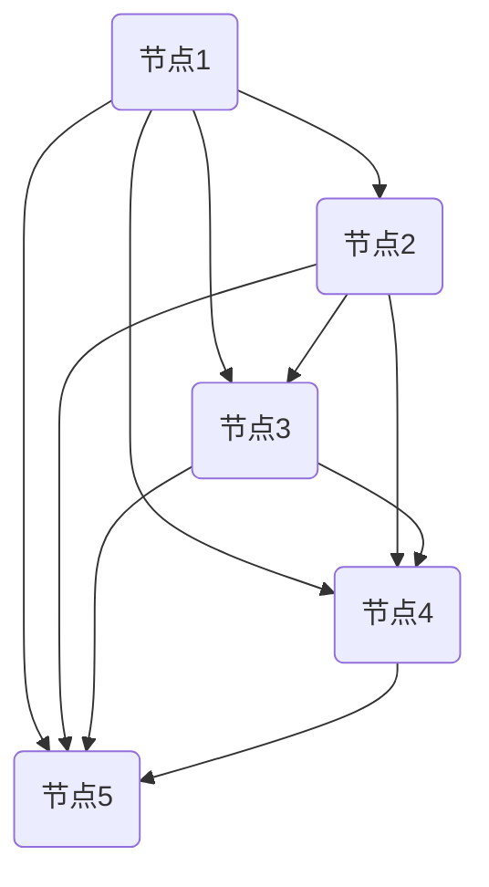

                 

关键词：思维导图、可视化思考、大脑数据处理、思维工具、记忆方法

> 摘要：本文将深入探讨思维导图这一强大的可视化工具，阐述其在提升大脑数据处理效率、优化思维流程和增强记忆能力方面的独特优势。通过分析思维导图的基本原理、构建方法和应用场景，读者将了解如何有效地利用这一工具，在日常生活和学习工作中实现思维的飞跃。

## 1. 背景介绍

在信息化时代，人类大脑需要处理的信息量急剧增加。传统线性思维方式逐渐显露出其局限性，难以满足现代复杂问题的解决需求。为了应对这一挑战，可视化思考工具应运而生。思维导图作为一种图形化的思维方式，以其直观、简洁的特点，迅速成为许多人提升思维效率、增强记忆力的首选工具。

思维导图最初由英国心理学家东尼·博赞（Tony Buzan）于1970年代提出。他认为，大脑更倾向于通过图像和颜色来处理信息，而非传统的文字和列表。思维导图正是基于这一理念，通过连接各个节点，将复杂的信息以图形化的方式展现出来，使大脑能够更高效地处理和记忆信息。

## 2. 核心概念与联系

### 2.1 思维导图的基本概念

思维导图是一种图形化的思维工具，它以中心主题为核心，通过分支和子分支的形式展开，将相关概念、想法和信息以图形化的方式组织起来。每个分支都代表一个相关的概念或想法，通过链接将这些分支和中心主题连接起来，形成一个整体的网络结构。

### 2.2 思维导图的基本原理

思维导图基于以下几点基本原理：

1. **非线性思维**：与传统线性思维不同，思维导图采用非线性结构，允许用户从不同角度和层面思考问题，从而发现新的联系和解决方案。

2. **视觉化处理**：人类大脑更容易理解和记忆图像信息，思维导图通过颜色、形状和图像等视觉元素，使信息更加直观、生动，提高大脑的信息处理效率。

3. **信息层级化**：思维导图通过不同的层级和分支结构，将复杂的信息进行分类和归纳，使信息更加有序和系统化。

4. **创造性思维**：思维导图鼓励用户在思考过程中自由发挥，通过分支和子分支的扩展，激发创造力和想象力。

### 2.3 Mermaid 流程图展示

下面是一个简单的思维导图示例，使用Mermaid语言进行描述：

```mermaid
mindmap
  A[中心主题]
  B1[分支1]
  B2[分支2]
  B3[分支3]
  A--B1
  A--B2
  A--B3
  B1--B11
  B1--B12
  B2--B21
  B2--B22
  B3--B31
  B3--B32
```

在这个示例中，`A` 是中心主题，`B1`、`B2` 和 `B3` 是主要分支，每个分支下面又有子分支。通过这种结构，信息被清晰地组织和展示出来。

## 3. 核心算法原理 & 具体操作步骤

### 3.1 算法原理概述

思维导图的构建主要基于以下原理：

1. **中心主题**：确定一个明确的中心主题，作为思维导图的起点和核心。
2. **分支扩展**：从中心主题出发，根据不同方向和层次，扩展出多个分支。
3. **节点连接**：使用线条将各个分支连接起来，形成一个整体的网络结构。
4. **视觉元素**：通过颜色、形状和图像等视觉元素，增强信息的可读性和记忆性。

### 3.2 算法步骤详解

1. **确定中心主题**：选择一个明确的中心主题，可以是问题、目标或任务。

2. **收集信息**：围绕中心主题，收集相关的信息、想法和知识点。

3. **构建分支**：将收集到的信息按照不同的方向和层次，构建出多个分支。

4. **连接节点**：使用线条将各个分支连接起来，形成一个整体的网络结构。

5. **添加视觉元素**：为各个节点和连接线添加颜色、形状和图像等视觉元素，增强信息的可读性和记忆性。

### 3.3 算法优缺点

**优点**：

1. **直观易懂**：思维导图通过图形化的方式，使信息更加直观、易懂。
2. **易于扩展**：思维导图的分支结构允许用户灵活地添加和删除节点，方便扩展和修改。
3. **提高记忆效果**：通过颜色、形状和图像等视觉元素，增强信息的记忆效果。

**缺点**：

1. **信息量限制**：思维导图的结构相对简单，难以处理大量复杂的信息。
2. **绘制复杂**：对于一些复杂的主题，构建思维导图的过程可能相对繁琐。

### 3.4 算法应用领域

1. **学习**：帮助学生整理学习资料，构建知识体系。
2. **工作**：帮助职场人士规划项目、整理思路，提高工作效率。
3. **思考**：帮助人们进行创造性思考，激发灵感。

## 4. 数学模型和公式 & 详细讲解 & 举例说明

### 4.1 数学模型构建

思维导图的构建可以看作是一个图论问题。我们可以将思维导图表示为一个有向图 \( G = (V, E) \)，其中 \( V \) 是节点集合，\( E \) 是边集合。每个节点代表一个概念或想法，边代表节点之间的关系。

### 4.2 公式推导过程

假设我们有一个思维导图 \( G \)，其中包含 \( n \) 个节点和 \( m \) 条边。我们可以使用以下公式来描述思维导图的特性：

1. **节点度数**：每个节点 \( v \) 的度数 \( d(v) \) 是与其相连的边的数量。
2. **平均节点度数**：平均节点度数 \( \bar{d} \) 是所有节点度数的平均值，即 \( \bar{d} = \frac{1}{n} \sum_{v \in V} d(v) \)。
3. **连接密度**：连接密度 \( \rho \) 是边的数量与可能的最大边数的比值，即 \( \rho = \frac{m}{n(n-1)/2} \)。

### 4.3 案例分析与讲解

假设我们有一个包含5个节点的思维导图，其中每两个节点之间都有一条边。这是一个完全图，我们可以使用上述公式来分析其特性：

1. **节点度数**：每个节点的度数都是4。
2. **平均节点度数**：平均节点度数 \( \bar{d} = \frac{4+4+4+4+4}{5} = 4 \)。
3. **连接密度**：连接密度 \( \rho = \frac{10}{5(5-1)/2} = 1 \)。

这个思维导图具有高度连通性，每个节点都与其他所有节点相连，因此信息传递效率非常高。

## 5. 项目实践：代码实例和详细解释说明

### 5.1 开发环境搭建

本文使用Python语言来构建思维导图，需要安装以下库：

```python
pip install matplotlib
```

### 5.2 源代码详细实现

下面是一个简单的Python代码示例，用于绘制一个基本的思维导图：

```python
import matplotlib.pyplot as plt
import networkx as nx

# 创建一个完全图
G = nx.complete_graph(5)

# 设置图的参数
nx.set_node_attributes(G, {'color': 'r'})
nx.set_edge_attributes(G, {'color': 'b'})

# 绘制图
plt.figure(figsize=(8, 8))
pos = nx.spring_layout(G)
nx.draw(G, pos, with_labels=True)

# 显示图形
plt.show()
```

这段代码首先创建了一个包含5个节点的完全图，然后为每个节点和边设置了颜色。最后使用`matplotlib`和`networkx`库绘制图形。

### 5.3 代码解读与分析

1. **导入库**：首先导入`matplotlib.pyplot`和`networkx`库。
2. **创建图**：使用`nx.complete_graph(5)`创建一个包含5个节点的完全图。
3. **设置参数**：使用`nx.set_node_attributes`和`nx.set_edge_attributes`设置节点和边的颜色。
4. **绘制图**：使用`nx.draw`函数绘制图形，并设置图形大小和标签。
5. **显示图形**：使用`plt.show()`显示绘制的图形。

通过这个示例，我们可以看到如何使用Python和`matplotlib`库来绘制简单的思维导图。

### 5.4 运行结果展示

运行上述代码后，会显示一个包含5个节点的完全图，每个节点都与其他节点相连，边和节点都带有颜色。



## 6. 实际应用场景

思维导图作为一种强大的可视化工具，在多个领域都有广泛的应用：

### 6.1 教育

在教育领域，思维导图可以帮助学生整理学习资料，构建知识体系。教师可以利用思维导图为学生设计教学活动，提高学习效果。

### 6.2 研究

在研究工作中，思维导图可以帮助研究人员整理研究思路，发现新的研究方向。通过构建思维导图，研究人员可以更清晰地理解复杂的研究问题。

### 6.3 工作

在职场中，思维导图可以帮助员工规划项目、整理思路，提高工作效率。项目经理可以利用思维导图来设计项目计划，团队成员可以利用思维导图来协同工作。

### 6.4 日常生活

在日常生活中，思维导图可以帮助人们规划时间、管理任务，提高生活质量。人们可以使用思维导图来记录生活点滴、管理个人成长计划等。

## 7. 工具和资源推荐

### 7.1 学习资源推荐

1. **东尼·博赞官方网站**：提供关于思维导图的基础知识和学习资源。
2. **《思维导图：使用思维导图提高工作效率》**：一本详细介绍思维导图应用技巧的书籍。

### 7.2 开发工具推荐

1. **MindMup**：一款在线思维导图工具，支持多种平台。
2. **Xmind**：一款功能强大的思维导图软件，支持多种操作系统。

### 7.3 相关论文推荐

1. **“思维导图在学习中的应用研究”**：探讨思维导图在学生学习中的效果和作用。
2. **“思维导图在项目管理工作中的应用”**：分析思维导图在项目管理中的优势和挑战。

## 8. 总结：未来发展趋势与挑战

### 8.1 研究成果总结

思维导图作为一种强大的可视化工具，已经在多个领域取得了显著的应用成果。通过实践证明，思维导图能够显著提升大脑数据处理效率、优化思维流程和增强记忆能力。

### 8.2 未来发展趋势

随着技术的不断进步，思维导图有望在人工智能、大数据分析等领域得到更广泛的应用。同时，思维导图工具也将不断优化，提供更智能、更高效的服务。

### 8.3 面临的挑战

尽管思维导图具有许多优势，但在处理大量复杂信息时，仍具有一定的局限性。未来的研究需要解决如何更高效地处理大规模数据，以及如何将思维导图与其他技术相结合，发挥其最大潜力。

### 8.4 研究展望

随着人工智能和大数据技术的不断发展，思维导图有望在更加广泛和深入的领域发挥重要作用。未来的研究将聚焦于如何更好地利用思维导图，提升人类思维的效率和能力。

## 9. 附录：常见问题与解答

### 9.1 思维导图与流程图有何区别？

思维导图主要关注信息的组织和扩展，强调思维的自由发挥和创造性。而流程图则侧重于展示信息处理的步骤和流程，更适用于描述具体的工作流程和操作步骤。

### 9.2 思维导图适合处理哪些类型的信息？

思维导图适合处理结构化或半结构化的信息，如学习资料、项目计划、创意构思等。对于大规模数据或复杂的系统，可能需要结合其他工具和方法。

### 9.3 怎样使用思维导图进行创造性思考？

使用思维导图进行创造性思考的关键是自由发挥和不断扩展。首先确定一个明确的中心主题，然后围绕主题收集相关想法和信息，通过分支和子分支的形式不断扩展，激发创造力和想象力。

---

作者：禅与计算机程序设计艺术 / Zen and the Art of Computer Programming
----------------------------------------------------------------

以上就是本文的全部内容。希望通过本文，读者能够对思维导图有更深入的了解，并能够将其有效地应用于日常生活和学习工作中。在未来的探索中，我们期待思维导图能够继续发挥其独特优势，助力人类思维的发展。

