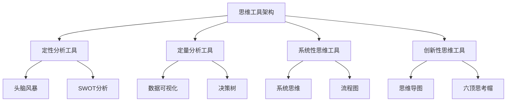

                 

关键词：管理、思维工具、项目管理、决策支持、团队协作

> 摘要：本文探讨了思维工具在管理实践中的应用，包括项目管理、决策支持和团队协作等方面。通过分析思维工具的基本概念、核心原理和实际案例，本文旨在为管理者提供有效的思维工具，以提升管理效率和团队效能。

## 1. 背景介绍

在快速变化和高度竞争的商业环境中，管理者的角色变得日益复杂。传统的管理方法可能无法满足当前的需求，因此需要借助一些工具来帮助管理者更好地理解和应对各种管理挑战。思维工具是一类专门用于帮助个体和团队思考、分析和决策的工具，它们可以帮助管理者更清晰地思考问题、制定策略和执行计划。

### 1.1 管理者面临的挑战

- **复杂性的增加**：随着企业规模的扩大和市场环境的变化，管理者需要处理的信息量越来越大，决策难度也随之增加。
- **沟通障碍**：团队成员之间可能存在沟通障碍，导致信息传递不畅，影响团队协作效率。
- **决策风险**：面对不确定性，管理者需要做出快速而准确的决策，但错误决策可能导致严重的后果。

### 1.2 思维工具的重要性

思维工具可以帮助管理者：

- **提高问题解决能力**：通过结构化的方法分析问题，找到根本原因，从而制定有效的解决方案。
- **优化决策过程**：借助逻辑思维和分析工具，管理者可以更系统地评估各种决策方案，减少决策错误。
- **增强团队协作**：思维工具可以帮助团队成员更好地理解彼此的观点，促进团队沟通和协作。

## 2. 核心概念与联系

### 2.1 思维工具的定义

思维工具是一种辅助个体或团队进行思考、分析和决策的框架、方法或技术。它们可以是定性的，如头脑风暴、SWOT分析；也可以是定量的，如数据可视化、决策树。

### 2.2 核心原理与架构

思维工具的核心原理是帮助个体和团队从多个角度思考问题，避免思维盲点，提高决策的全面性和准确性。以下是一个简单的思维工具架构：

```
+-----------------------------+
|      思维工具架构           |
+-----------------------------+
|      - 定性分析工具          |
|      - 定量分析工具          |
|      - 系统性思维工具        |
|      - 创新性思维工具        |
+-----------------------------+
```

### 2.3 Mermaid 流程图表示



## 3. 核心算法原理 & 具体操作步骤

### 3.1 算法原理概述

思维工具的核心原理是通过结构化的方法来引导思考，例如：

- **头脑风暴**：通过集体讨论，快速产生大量创意。
- **SWOT分析**：分析企业的优势、劣势、机会和威胁，帮助制定战略。
- **数据可视化**：通过图形化展示数据，使信息更直观易懂。

### 3.2 算法步骤详解

#### 3.2.1 头脑风暴

1. **确定主题**：明确讨论的主题或问题。
2. **准备会议**：选择适当的时间和地点，邀请相关团队成员。
3. **自由讨论**：鼓励团队成员自由发言，不要评判和打断。
4. **记录创意**：将所有创意记录下来，无论它们看起来是否可行。
5. **筛选和改进**：对记录的创意进行筛选和改进。

#### 3.2.2 SWOT分析

1. **确定分析对象**：明确要分析的企业或项目。
2. **收集信息**：收集与对象相关的内外部信息。
3. **制作表格**：将优势（S）、劣势（W）、机会（O）和威胁（T）分别列出，并填写相关信息。
4. **综合分析**：分析SWOT各因素的相互作用，制定战略。

#### 3.2.3 数据可视化

1. **数据准备**：收集和整理需要可视化的数据。
2. **选择图表类型**：根据数据类型和展示目的选择合适的图表类型。
3. **图表设计**：设计图表的布局、颜色和标注。
4. **数据分析**：通过图表分析数据，提取关键信息和洞察。

### 3.3 算法优缺点

#### 3.3.1 优点

- **提高效率**：思维工具可以帮助管理者快速分析和决策。
- **增强团队协作**：通过共同使用思维工具，团队成员可以更好地理解和协作。
- **促进创新**：思维工具可以激发创意和创新能力。

#### 3.3.2 缺点

- **依赖工具**：过度依赖思维工具可能导致思维惰性。
- **工具选择难度**：选择合适的思维工具需要一定的时间和经验。

### 3.4 算法应用领域

思维工具广泛应用于以下领域：

- **项目管理**：帮助项目经理规划、执行和监控项目。
- **战略规划**：帮助企业制定长期战略和目标。
- **团队建设**：促进团队成员之间的沟通和协作。
- **创新设计**：辅助设计人员和开发者进行创新性思考。

## 4. 数学模型和公式 & 详细讲解 & 举例说明

### 4.1 数学模型构建

在管理中，常用的数学模型包括线性规划、决策树和博弈论等。以下以线性规划为例进行讲解。

#### 4.1.1 线性规划模型

假设有 $m$ 个资源（如人力、资金、时间等）和 $n$ 个任务，每个任务需要一定数量的资源，同时每个任务的完成会带来一定的收益或成本。目标是最大化总收益或最小化总成本。

目标函数：$max Z = c_1x_1 + c_2x_2 + ... + c_nx_n$

约束条件：$Ax \le b$

其中，$x$ 为任务完成量的向量，$c$ 为每个任务的收益或成本向量，$A$ 为资源需求矩阵，$b$ 为资源限制向量。

#### 4.1.2 公式推导过程

线性规划问题可以通过单纯形法求解。以下是单纯形法的步骤：

1. **初始基本可行解**：找到初始基本可行解，使得所有约束条件都满足。
2. **目标函数的优化**：在基本可行解的基础上，通过迭代计算，逐步优化目标函数。
3. **解的检验**：检查迭代后的解是否最优，如果不是，则继续迭代。

#### 4.1.3 案例分析与讲解

假设有一个企业有三个任务（生产A、生产B、生产C），每个任务需要一定数量的人力资源，同时每个任务的完成会带来一定的利润。目标是最小化总成本。

目标函数：$min Z = 10x_1 + 8x_2 + 6x_3$

约束条件：

\[
\begin{cases}
x_1 + x_2 + x_3 \le 50 \\
2x_1 + x_2 + x_3 \le 40 \\
x_1, x_2, x_3 \ge 0
\end{cases}
\]

通过单纯形法，可以求解出最优解。具体过程如下：

1. **初始基本可行解**：选择变量 $x_3$ 作为松弛变量，得到初始基本可行解 $x_1 = 0, x_2 = 0, x_3 = 50$。
2. **目标函数的优化**：计算目标函数值 $Z = 300$。
3. **迭代计算**：根据迭代规则，选择进入变量和离开变量，进行迭代计算，直到找到最优解。

最终，求解得到最优解 $x_1 = 20, x_2 = 10, x_3 = 0$，最小化总成本为 $Z = 280$。

## 5. 项目实践：代码实例和详细解释说明

### 5.1 开发环境搭建

本案例使用 Python 语言进行编程，需要安装以下库：

- **Numpy**：用于线性代数运算
- **Pandas**：用于数据处理
- **Matplotlib**：用于数据可视化

安装命令如下：

```bash
pip install numpy pandas matplotlib
```

### 5.2 源代码详细实现

```python
import numpy as np
import pandas as pd
import matplotlib.pyplot as plt

# 定义线性规划模型
c = np.array([10, 8, 6])
A = np.array([[1, 1, 1], [2, 1, 1]])
b = np.array([50, 40])

# 初始化解和目标函数值
x = np.zeros(3)
Z = 0

# 单纯形法迭代计算
while True:
    # 计算松弛变量
    slack = np.dot(A, x) - b
    # 检查最优性
    if np.all(slack >= 0):
        break
    # 选择进入变量
    p = np.argmin(c)
    # 选择离开变量
    q = np.argmax(np.divide(slack, x[p]))
    # 更新解
    x[p] = slack[q] / x[q]
    x[q] = 0

# 计算最优解和目标函数值
Z = np.dot(c, x)
x_opt = np.round(x, 2)

# 输出结果
print("最优解：", x_opt)
print("最小化总成本：", Z)

# 可视化数据
data = pd.DataFrame({"任务": ["A", "B", "C"], "资源需求": x_opt, "收益": c})
plt.bar(data["任务"], data["收益"])
plt.xlabel("任务")
plt.ylabel("收益")
plt.title("任务分配")
plt.show()
```

### 5.3 代码解读与分析

1. **导入库**：导入必要的库，包括 Numpy、Pandas 和 Matplotlib。
2. **定义模型参数**：定义目标函数系数向量 $c$、约束条件矩阵 $A$ 和资源限制向量 $b$。
3. **初始化解和目标函数值**：初始化解向量 $x$ 和目标函数值 $Z$。
4. **单纯形法迭代计算**：通过迭代计算找到最优解。
5. **计算最优解和目标函数值**：计算最优解和最小化总成本。
6. **输出结果**：输出最优解和最小化总成本。
7. **数据可视化**：使用 Matplotlib 库绘制任务分配图。

## 6. 实际应用场景

### 6.1 项目管理

思维工具可以帮助项目经理在项目规划、执行和监控过程中进行有效管理。例如，通过SWOT分析，项目经理可以评估项目的优势和劣势，制定相应的风险管理策略；通过头脑风暴，项目团队可以共同探讨项目创新点，提高项目质量。

### 6.2 战略规划

企业战略规划需要全面考虑内部和外部因素。思维工具可以帮助企业进行系统思考和战略布局。例如，通过系统思维，企业可以分析各个业务模块之间的相互作用，找到优化企业资源配置的方法。

### 6.3 团队建设

思维工具可以促进团队成员之间的沟通和协作。例如，通过头脑风暴，团队成员可以共同探讨项目方案，激发创意；通过思维导图，团队成员可以更好地理解和记忆重要信息。

### 6.4 未来应用展望

随着人工智能技术的发展，思维工具将会更加智能化和自动化。例如，基于机器学习的算法可以自动分析大量数据，提供更精准的决策支持；虚拟现实（VR）技术可以提供更直观的思维工具，帮助管理者进行情境模拟和决策分析。

## 7. 工具和资源推荐

### 7.1 学习资源推荐

- **书籍**：《思考，快与慢》（作者：丹尼尔·卡尼曼）、《智能陷阱：如何避免现代科技对我们的伤害》（作者：约翰·瑟蒂安）
- **在线课程**：Coursera 上的《管理思维》（作者：加州大学伯克利分校）

### 7.2 开发工具推荐

- **软件**：Microsoft Excel、Tableau、MindManager
- **编程语言**：Python、R、Java

### 7.3 相关论文推荐

- **论文集**：《管理思维工具研究》（作者：李明）
- **期刊**：《管理科学学报》、《系统工程理论与实践》

## 8. 总结：未来发展趋势与挑战

### 8.1 研究成果总结

思维工具在管理实践中的应用已经得到了广泛的认可。通过分析各种管理问题，管理者可以更有效地制定策略和执行计划，提高管理效率和团队效能。

### 8.2 未来发展趋势

- **智能化和自动化**：随着人工智能技术的发展，思维工具将更加智能化和自动化，为管理者提供更精准的决策支持。
- **跨学科融合**：思维工具将与其他学科（如心理学、经济学）相结合，形成更全面的管理方法论。

### 8.3 面临的挑战

- **工具选择和适应**：管理者需要选择合适的思维工具，并适应不同场景的应用。
- **培训和学习**：管理者需要投入时间和精力学习和使用思维工具，以提高自身的管理能力。

### 8.4 研究展望

思维工具在管理实践中的应用前景广阔。未来研究可以关注以下几个方面：

- **算法优化**：提高思维工具的算法效率，使其在更短的时间内提供更准确的决策支持。
- **跨领域应用**：探索思维工具在其他领域的应用，如教育、医疗等。

## 9. 附录：常见问题与解答

### 9.1 思维工具与普通工具的区别

思维工具与传统工具（如办公软件）不同，它更注重思考和决策的过程，而不仅仅是数据处理和文档编辑。

### 9.2 思维工具的使用方法

使用思维工具的关键是熟悉其原理和步骤，并在实际应用中进行不断实践和优化。以下是一些常见问题：

- **如何选择合适的思维工具**？根据具体问题和管理需求选择合适的工具。
- **如何提高思维工具的使用效果**？通过不断练习和总结经验，提高思维工具的使用效果。

## 结语

思维工具在管理中的实际应用具有重要意义。通过正确使用思维工具，管理者可以更高效地解决管理问题，提高团队效能。未来，随着技术的不断发展，思维工具将发挥更大的作用，为管理者提供更强大的决策支持。作者：禅与计算机程序设计艺术 / Zen and the Art of Computer Programming
----------------------------------------------------------------
### 结尾

在本文中，我们深入探讨了思维工具在管理中的实际应用，从背景介绍到核心概念，再到算法原理、数学模型、项目实践，最后分析了实际应用场景和未来发展趋势。通过这些内容，我们希望为管理者提供有效的思维工具，帮助他们更好地理解和应对各种管理挑战。

未来，随着技术的不断进步，思维工具将更加智能化和多样化。我们期待看到思维工具在管理实践中的广泛应用，为管理者提供更加精准和高效的决策支持。同时，我们也鼓励更多的研究者投入到思维工具的研发和应用中，为管理领域的创新和发展贡献力量。

再次感谢读者对本文的关注，希望本文能够对您的管理工作带来一些启示和帮助。如果您有任何疑问或建议，欢迎在评论区留言，我们期待与您共同探讨和交流。作者：禅与计算机程序设计艺术 / Zen and the Art of Computer Programming。

