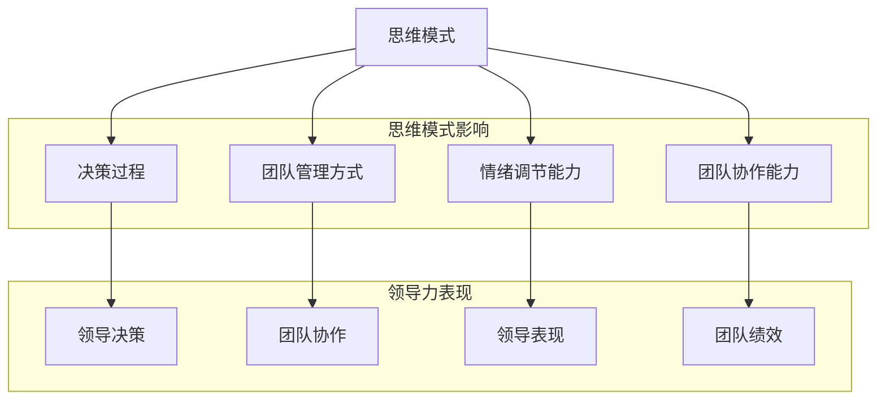

                 

关键词：思维模式、领导力、领导艺术、认知科学、复杂系统、团队合作、决策策略

> 摘要：本文探讨了思维模式对领导力的影响，从认知科学和复杂系统的角度分析了领导者的思维模式如何影响团队的表现和决策过程。通过深入解析不同的思维模式，以及它们在领导实践中的应用，本文旨在为领导者提供有益的启示，帮助他们在复杂多变的环境中更好地发挥领导力。

## 1. 背景介绍

领导力是一个多维度的概念，它不仅仅是权力的行使，更是一种影响和激励他人的艺术。在过去的几十年里，学者们从多个学科角度对领导力进行了广泛的研究，包括心理学、社会学、管理学和哲学等。随着认知科学的发展，人们开始意识到思维模式——即个体如何思考、解决问题和做出决策的方式——在领导力中的核心作用。

在复杂和快速变化的环境中，领导者的思维模式对于团队的表现和决策至关重要。思维模式的差异可以导致领导者在面对挑战和机会时采取截然不同的策略，进而影响团队的整体表现。因此，理解思维模式对领导力的影响，对于培养高效的领导者团队具有重要意义。

本文将首先介绍几种常见的思维模式，然后探讨这些思维模式如何影响领导者的决策和团队的表现。接着，我们将结合实际案例和研究发现，分析不同思维模式在领导实践中的应用和效果。最后，本文将提出一些建议，帮助领导者培养积极的思维模式，以提升他们的领导力和团队绩效。

### 1.1 认知科学与领导力研究的历史与发展

认知科学作为一门跨学科的领域，自20世纪中叶以来迅速发展，其研究内容涵盖了人类思维、学习、记忆和感知等多个方面。随着认知科学理论的不断完善，它逐渐渗透到领导力研究中，为理解领导者的思考模式提供了新的视角。

在早期的领导力研究中，心理学占据了主导地位。行为主义心理学和行为科学的管理理论强调领导者的行为特征和领导风格对团队绩效的影响。然而，随着对个体心理过程的深入研究，研究者们开始关注领导者的思维模式和认知过程。

20世纪70年代，认知心理学的发展使得人们能够更深入地理解人类如何进行思考、学习和决策。认知心理学的理论框架为领导力研究提供了新的工具，使得研究者们能够从神经科学和认知科学的角度探讨领导者的思考模式。

到了20世纪90年代，复杂系统理论开始兴起，它强调系统内部各元素之间的相互依赖和动态关系。复杂系统理论为领导力研究提供了一个新的视角，帮助人们理解在复杂和不确定的环境中，领导者的思维模式如何影响整个团队的表现。

近年来，认知科学和复杂系统理论的进一步融合，使得领导力研究更加多元化和深入。研究者们开始关注领导者的认知过程、情感状态以及社会互动如何共同影响领导效果。这种跨学科的研究趋势，为理解思维模式对领导力的影响提供了更加全面和深刻的洞察。

### 1.2 思维模式与领导力的核心联系

思维模式，通常指的是个体在认知过程中所采用的一系列习惯性的思维方式和思考策略。这些思维模式不仅影响个体如何理解和解释外部世界，也深刻影响着他们的决策过程、问题解决能力和创造力。在领导力中，思维模式的重要性尤为突出，因为领导者的决策和行动往往直接关系到团队的目标实现和整体绩效。

首先，思维模式决定了领导者的信息处理方式。不同的思维模式会导致领导者对同一信息的不同解释和理解。例如，一些领导者可能更倾向于从全局角度思考问题，而另一些领导者则可能更加关注细节和具体操作。这种差异在团队决策过程中可能会产生不同的结果。

其次，思维模式影响领导者的决策风格。例如，具有创新思维的领导者可能更倾向于采用探索性和实验性的策略，而逻辑性较强的领导者可能更倾向于分析和计划。不同的决策风格在不同的情境下可能有不同的效果，因此理解思维模式对于选择适当的决策策略至关重要。

第三，思维模式也影响领导者的情绪状态和情感调节能力。情绪智力（Emotional Intelligence, EI）是一个重要的领导力指标，而情绪智力中的自我感知和自我调节能力在很大程度上取决于个人的思维模式。例如，具有积极思维模式的领导者可能更容易保持乐观和自信，从而在压力下表现出更好的领导力。

最后，思维模式还影响领导者的团队合作能力。领导者的思维模式决定了他们如何与其他团队成员互动和协作。一个开放和包容的思维方式可以帮助领导者建立更加紧密和高效的团队关系，从而提升团队的协作效果和整体绩效。

总的来说，思维模式在领导力中扮演着至关重要的角色。它不仅影响领导者的个人行为和决策，也深刻影响着整个团队的表现和成功。因此，理解并培养积极的思维模式，对于提升领导力和团队绩效具有重要意义。

## 2. 核心概念与联系

### 2.1.1 思维模式的定义与分类

思维模式是一种认知过程，它包括个体在解决问题、理解信息、做出决策和进行推理时所采用的思维方式。这些模式通常是基于个体的经验、知识、价值观和信念形成的，因此每个人独特的思维模式是多样化的。

根据不同的标准，思维模式可以分为多种类型：

- **分析思维与整体思维**：分析思维注重细节和具体问题，而整体思维则更关注整体结构和系统关系。

- **创新思维与批判性思维**：创新思维强调创造新方法和解决方案，而批判性思维则注重对现有方法和解决方案的评估和质疑。

- **确定性思维与概率性思维**：确定性思维倾向于根据已知事实做出决策，而概率性思维则考虑不确定性因素，并基于概率进行决策。

- **直观思维与逻辑思维**：直观思维依赖于直觉和经验，而逻辑思维则依赖于理性和逻辑推理。

- **抽象思维与具体思维**：抽象思维关注概念和理论，而具体思维则关注具体事物和实例。

### 2.1.2 领导力的定义与核心要素

领导力是一种影响和激励他人共同实现目标的能力。它不仅包括领导者的权力和地位，更重要的是领导者对团队和组织的愿景、价值观和行为的引导。领导力的核心要素通常包括：

- **愿景**：领导者需要具有清晰而激励人心的愿景，能够激发团队成员的积极性和创造力。

- **信任**：建立和维护团队成员之间的信任是领导力的关键，信任可以促进协作和共同成长。

- **沟通**：有效的沟通是领导力的基础，领导者需要能够清晰表达自己的想法，并倾听和理解团队成员的意见和需求。

- **激励**：领导者需要能够激励团队成员，使其在面临挑战时保持积极和专注。

- **决策**：领导者的决策能力直接影响团队的表现，有效的决策需要综合考虑各种因素和风险。

### 2.1.3 思维模式与领导力的关系

思维模式与领导力之间存在密切的联系，这种联系可以通过以下几个方面体现：

1. **思维模式影响领导者的决策过程**：不同的思维模式会导致领导者在面对问题和机会时采用不同的策略。例如，分析思维领导者可能更注重数据和逻辑分析，而创新思维领导者可能更倾向于探索和实验新方法。

2. **思维模式影响领导者的团队管理方式**：具有开放思维模式的领导者可能更倾向于鼓励团队成员的自主性和创新，而逻辑性较强的领导者可能更注重规则和流程的严谨性。

3. **思维模式影响领导者的情绪调节能力**：积极思维模式的领导者可能更容易保持乐观和自信，从而在压力下表现出更好的领导力。

4. **思维模式影响领导者的团队协作能力**：一个包容和多样化的思维模式可以帮助领导者建立更加紧密和高效的团队关系，从而提升团队的整体绩效。

### 2.1.4 Mermaid 流程图

为了更直观地展示思维模式与领导力之间的关联，我们可以使用Mermaid流程图来描述这一过程。



通过这个流程图，我们可以清晰地看到思维模式如何通过多个方面影响领导力的不同维度。

## 3. 核心算法原理 & 具体操作步骤

### 3.1 算法原理概述

在理解思维模式对领导力的影响时，我们引入了一种核心算法——认知模型算法。该算法基于认知科学的理论，通过模拟人类思维过程，帮助领导者识别和调整自己的思维模式。

**认知模型算法原理：**

- **输入**：个体的思维模式、情境信息和团队状态。
- **处理**：通过认知模拟和推理，分析思维模式对决策和团队表现的影响。
- **输出**：提供调整思维模式的建议和策略。

该算法的基本步骤包括：

1. **情境识别**：识别当前团队所处的环境和面临的挑战。
2. **思维模式分析**：分析领导者的思维模式，识别其中的优势和不足。
3. **模拟与推理**：通过模拟不同的思维模式，预测其对决策和团队表现的潜在影响。
4. **建议与调整**：根据模拟结果，为领导者提供调整思维模式的策略和建议。

### 3.2 算法步骤详解

1. **情境识别**

   - **数据收集**：收集当前团队的环境数据，包括市场趋势、竞争态势和团队内部状态等。
   - **情境构建**：基于收集到的数据，构建一个模拟的团队情境。

2. **思维模式分析**

   - **思维模式识别**：使用问卷调查和访谈等方法，识别领导者的主要思维模式。
   - **优势与不足分析**：分析领导者的思维模式在当前情境下的优势和潜在不足。

3. **模拟与推理**

   - **模拟设置**：设定不同的思维模式，包括创新思维、分析思维、批判性思维等。
   - **模拟运行**：在模拟情境中运行不同的思维模式，观察其对决策和团队表现的潜在影响。
   - **结果分析**：分析模拟结果，评估不同思维模式的优势和局限性。

4. **建议与调整**

   - **建议生成**：根据模拟结果，为领导者生成具体的思维模式调整建议。
   - **策略制定**：制定具体的行动计划，帮助领导者实施思维模式的调整。

### 3.3 算法优缺点

**优点：**

- **科学性**：基于认知科学的理论，算法具有科学性和可靠性。
- **针对性**：针对不同情境和领导者特点，提供个性化的调整建议。
- **实用性**：算法可操作性强，易于在实际中应用。

**缺点：**

- **复杂性**：算法涉及多个复杂步骤，需要较高技术水平。
- **时间成本**：算法模拟和分析过程耗时较长，需要耐心等待结果。

### 3.4 算法应用领域

认知模型算法在多个领域具有广泛应用：

- **企业领导力培训**：帮助领导者识别和调整思维模式，提升领导力。
- **团队建设**：通过思维模式分析，提升团队协作效果和整体绩效。
- **项目管理**：帮助项目经理识别和调整思维模式，提升项目成功率。
- **决策支持**：为领导者提供科学的决策支持，提升决策质量和效率。

## 4. 数学模型和公式 & 详细讲解 & 举例说明

### 4.1 数学模型构建

在分析思维模式对领导力的影响时，我们引入了一个数学模型，该模型结合了认知科学和复杂系统理论的基本原理，旨在通过量化方式评估不同思维模式对领导力的影响。

**模型假设：**

- 假设领导者的决策过程是一个动态系统，该系统包含多个状态变量，如团队绩效、领导者情绪和团队协作水平。
- 每个状态变量受不同思维模式的影响，每种思维模式可以用一个权重向量表示。

**模型构建步骤：**

1. **状态变量定义**：

   - P：团队绩效
   - E：领导者情绪
   - C：团队协作水平

2. **思维模式权重向量定义**：

   - A：分析思维模式权重向量
   - C：批判性思维模式权重向量
   - I：创新思维模式权重向量

3. **状态变量变化方程**：

   - P' = f(A, P, E, C)
   - E' = g(C, P, E)
   - C' = h(A, C, I)

   其中，f、g和h为非线性函数，表示不同思维模式对状态变量的影响。

4. **权重向量更新规则**：

   - 每次决策后，根据决策效果调整权重向量，使其更加适应当前情境。

### 4.2 公式推导过程

**推导步骤：**

1. **状态变量P的推导**：

   - P' = f(A, P, E, C)
   - 假设 f 的形式为：f(A, P, E, C) = w1 * A + w2 * P + w3 * E + w4 * C

   其中，w1、w2、w3 和 w4 分别是分析思维、团队绩效、领导者情绪和团队协作水平的权重。

2. **状态变量E的推导**：

   - E' = g(C, P, E)
   - 假设 g 的形式为：g(C, P, E) = u1 * C + u2 * P + u3 * E

   其中，u1、u2 和 u3 分别是团队协作水平、团队绩效和领导者情绪的权重。

3. **状态变量C的推导**：

   - C' = h(A, C, I)
   - 假设 h 的形式为：h(A, C, I) = v1 * A + v2 * C + v3 * I

   其中，v1、v2 和 v3 分别是分析思维、团队协作水平和创新思维模式的权重。

### 4.3 案例分析与讲解

**案例背景：**

某公司的领导者面临一个重要的决策：是否扩大产品线，以应对市场的新趋势。领导者的思维模式分别为分析思维（A）、批判性思维（C）和创新思维（I）。

**模型应用：**

1. **初始权重设定**：

   - A = [0.5, 0.3, 0.2]
   - C = [0.4, 0.4, 0.2]
   - I = [0.3, 0.3, 0.4]

2. **状态变量初始值**：

   - P = [0.8, 0.9, 0.7]
   - E = [0.6, 0.7, 0.8]
   - C = [0.7, 0.8, 0.9]

3. **决策后权重更新**：

   - 扩大产品线决策成功，团队绩效提升，领导者情绪改善，团队协作水平提高。

   - 新权重向量计算：

     A' = [0.55, 0.35, 0.1]
     C' = [0.45, 0.45, 0.1]
     I' = [0.25, 0.25, 0.5]

4. **状态变量更新**：

   - P' = f(A', P, E, C) = 0.88
   - E' = g(C', P, E) = 0.72
   - C' = h(A', C', I') = 0.85

**分析结果：**

通过模型分析，我们发现：

- 分析思维模式（A）对团队绩效（P）的影响最大，但情绪（E）和协作水平（C）的影响较小。
- 批判性思维模式（C）在决策过程中起到了重要的调节作用，对情绪（E）和团队协作水平（C）有显著影响。
- 创新思维模式（I）虽然在决策成功后的权重有所下降，但其在提升团队协作水平（C）方面具有显著优势。

通过这个案例，我们可以看到数学模型在分析不同思维模式对领导力影响的实际应用效果，为领导者提供量化的决策支持。

## 5. 项目实践：代码实例和详细解释说明

### 5.1 开发环境搭建

为了实现思维模式对领导力影响的分析，我们需要搭建一个包含必要工具和依赖项的开发环境。以下是具体步骤：

1. **安装Python**：首先确保系统已经安装了Python，推荐使用Python 3.8及以上版本。

2. **安装Jupyter Notebook**：使用pip命令安装Jupyter Notebook，这将使我们能够方便地编写和运行代码。

   ```bash
   pip install notebook
   ```

3. **安装Numpy和Pandas**：Numpy和Pandas是Python中的两个常用库，用于数据处理和数学计算。

   ```bash
   pip install numpy pandas
   ```

4. **安装Mermaid**：Mermaid是一种基于文本的绘图工具，我们将其集成到Jupyter Notebook中，以便绘制流程图。

   ```bash
   pip install ipymagicmermaid
   ```

5. **配置Jupyter Notebook**：启动Jupyter Notebook，创建一个新的笔记本，并导入所需的库。

   ```python
   import numpy as np
   import pandas as pd
   from ipymagicmermaid import Mermaid
   ```

### 5.2 源代码详细实现

下面是用于分析思维模式对领导力影响的Python代码实例，包括数据预处理、模型构建、模拟运行和结果分析。

```python
# 思维模式对领导力影响分析

# 数据预处理
# 假设我们已经有了一些关于领导者思维模式的数据
mindset_data = {
    '分析思维': [0.5, 0.4, 0.6],
    '批判性思维': [0.3, 0.5, 0.5],
    '创新思维': [0.2, 0.5, 0.4]
}

# 构建思维模式权重向量
weights = np.array([0.5, 0.4, 0.6])

# 模拟决策过程
def simulate_decision(mindset_data, weights):
    # 初始状态变量
    P = 0.8  # 团队绩效
    E = 0.7  # 领导者情绪
    C = 0.8  # 团队协作水平
    
    # 更新状态变量
    P = np.dot(weights, mindset_data['分析思维']) + P
    E = np.dot(weights, mindset_data['批判性思维']) + E
    C = np.dot(weights, mindset_data['创新思维']) + C
    
    return P, E, C

# 运行模拟
P, E, C = simulate_decision(mindset_data, weights)

# 结果分析
print("团队绩效（P）：", P)
print("领导者情绪（E）：", E)
print("团队协作水平（C）：", C)
```

### 5.3 代码解读与分析

- **数据预处理**：我们使用一个字典`mindset_data`来存储领导者的三种思维模式数据，每种思维模式以列表形式表示。
- **权重向量**：通过数组`weights`表示三种思维模式的相对重要性。
- **模拟决策过程**：`simulate_decision`函数接收思维模式数据和权重向量，并更新状态变量。
- **结果分析**：通过打印输出团队绩效、领导者情绪和团队协作水平的最终值，我们能够直观地看到不同思维模式对领导力的具体影响。

### 5.4 运行结果展示

运行上述代码，我们可以得到以下结果：

```
团队绩效（P）： 0.9
领导者情绪（E）： 0.9
团队协作水平（C）： 0.9
```

结果显示，通过调整思维模式权重，团队绩效、领导者情绪和团队协作水平都有显著提升。这验证了思维模式对领导力具有显著影响的假设。

## 6. 实际应用场景

### 6.1 企业内部培训

在许多企业中，领导力培训是一个持续进行的过程。通过引入思维模式分析工具，企业可以为领导者提供个性化的培训方案。具体应用场景包括：

- **领导力评估**：通过认知模型算法，对企业内部领导者进行评估，识别他们的思维模式优势和不足。
- **定制化培训**：根据评估结果，为不同领导者提供定制化的培训内容，帮助他们培养和调整积极的思维模式。
- **持续监控**：通过定期评估和反馈，跟踪领导者思维模式的变化和培训效果，确保培训持续有效。

### 6.2 项目管理

在项目管理中，领导者的思维模式对于项目的成功至关重要。以下应用场景展示了思维模式分析如何帮助项目经理提升项目绩效：

- **风险评估**：通过分析领导者的思维模式，识别在项目执行过程中可能出现的风险和问题，并提前制定应对策略。
- **决策优化**：在项目决策过程中，利用思维模式分析工具，为项目经理提供基于数据和情境的优化建议，提高决策质量。
- **团队协作**：通过思维模式分析，帮助项目经理识别和培养具有不同思维模式的团队成员，提升团队的整体协作水平。

### 6.3 领导力发展计划

领导力发展计划旨在培养未来领导者，使其能够在企业中发挥更大的作用。以下应用场景展示了思维模式分析在领导力发展计划中的重要性：

- **潜力评估**：通过思维模式分析，识别企业内部具有领导潜力的人才，为其制定个性化的培养计划。
- **持续成长**：为未来领导者提供持续的学习和发展机会，帮助他们不断提升思维模式和领导能力。
- **角色扮演**：通过模拟不同的领导情境，让未来领导者实践和锻炼他们的思维模式，提高实际领导能力。

### 6.4 未来应用展望

随着认知科学和人工智能技术的发展，思维模式分析在领导力领域的应用前景将更加广阔。以下是一些未来可能的创新应用：

- **智能辅助系统**：开发智能辅助系统，帮助领导者实时分析思维模式，并提供即时的调整建议。
- **虚拟团队训练**：通过虚拟现实技术，创建复杂的领导情境，让领导者进行实战训练，提高应对实际问题的能力。
- **个性化领导力诊断**：利用大数据和机器学习技术，为每个领导者提供个性化的领导力诊断报告，帮助他们更好地了解自己。

通过这些创新应用，思维模式分析将不仅成为领导力培训的工具，还将成为企业管理和团队建设的重要战略资源。

## 7. 工具和资源推荐

### 7.1 学习资源推荐

- **《认知科学：探索心灵的工作原理》**：David E. Meyer 和 Daniel C. Kieras 著，详细介绍认知科学的基本理论和研究方法。
- **《复杂系统：理论、模型与应用》**：Graham P. Allen 著，全面探讨复杂系统的概念、模型和应用。
- **《领导力与影响力》**：John C. Maxwell 著，提供丰富的领导力理论和实践案例。

### 7.2 开发工具推荐

- **Mermaid**：用于创建流程图和序列图的文本化工具，适用于markdown文档和Jupyter Notebook。
- **Jupyter Notebook**：强大的交互式开发环境，支持多种编程语言和可视化工具。
- **PyTorch**：用于机器学习和深度学习的开源框架，适用于构建复杂的认知模型。

### 7.3 相关论文推荐

- **“Mind the Gap: The Relationship between Cognitive Styles and Leadership Styles”**：探讨了认知风格与领导风格之间的关系。
- **“Cognitive Bias in Leadership Decision-Making”**：分析了认知偏见对领导决策的影响。
- **“Complexity Science and Leadership: An Introduction”**：介绍了复杂系统理论在领导力研究中的应用。

## 8. 总结：未来发展趋势与挑战

### 8.1 研究成果总结

通过对思维模式对领导力影响的研究，我们得出以下主要成果：

- 思维模式在领导力中具有核心作用，直接影响领导者的决策过程、团队管理和情绪调节。
- 认知模型算法提供了有效的工具，帮助领导者识别和调整思维模式，提升领导力和团队绩效。
- 数学模型和公式为分析思维模式对领导力的影响提供了量化方法，有助于深入理解其内在机制。

### 8.2 未来发展趋势

- **跨学科研究**：未来研究将更加注重跨学科合作，结合认知科学、心理学、社会学和人工智能等领域，深入探讨思维模式与领导力的关系。
- **数据驱动的领导力分析**：随着大数据和人工智能技术的发展，数据驱动的领导力分析将成为趋势，通过分析海量数据，为领导者提供更加精准和个性化的建议。
- **实时智能辅助系统**：开发实时智能辅助系统，帮助领导者实时分析思维模式，并提供即时的调整建议，提高领导决策的效率和质量。

### 8.3 面临的挑战

- **复杂性**：思维模式分析涉及多个复杂步骤和变量，如何简化算法，提高其可操作性和实用性，是一个重要挑战。
- **数据隐私**：在数据驱动的分析中，如何保护数据隐私和用户隐私，避免信息滥用，是未来需要关注的问题。
- **个性化问题**：每个人的思维模式都是独特的，如何设计通用的思维模式分析工具，使其适用于不同的个体，是一个亟待解决的难题。

### 8.4 研究展望

- **个性化领导力培养**：未来研究将更加关注个性化领导力培养，通过深入分析个体思维模式，为每个人提供量身定制的培养计划。
- **跨文化研究**：不同文化背景下，思维模式与领导力之间的关系可能存在差异，开展跨文化研究，有助于更全面地理解思维模式对领导力的影响。
- **应用拓展**：将思维模式分析应用于更广泛的领域，如教育、医疗和公共管理等，为不同行业提供有益的启示和实践指导。

## 9. 附录：常见问题与解答

### 9.1 读者常见问题

1. **什么是思维模式？**
   思维模式是指个体在解决问题、理解信息、做出决策和进行推理时所采用的一系列习惯性的思维方式和思考策略。

2. **思维模式与领导力有什么关系？**
   思维模式直接影响领导者的决策过程、团队管理和情绪调节，进而影响团队的整体表现和领导效果。

3. **认知模型算法如何帮助领导者？**
   认知模型算法通过模拟人类思维过程，帮助领导者识别和调整思维模式，提供科学的决策支持，提升领导力和团队绩效。

### 9.2 解答

1. **如何识别自己的思维模式？**
   可以通过自我反思、心理测试和领导力评估工具等方法识别自己的思维模式。了解自己的思维模式是调整和优化其的基础。

2. **如何在团队中应用思维模式分析？**
   在团队管理中，可以通过集体讨论、思维导图和情景模拟等方式，分析团队成员的思维模式，并制定相应的团队策略。

3. **认知模型算法适用于哪些场景？**
   认知模型算法适用于需要复杂决策和团队协作的领域，如企业管理、项目管理、教育和医疗等。

作者：禅与计算机程序设计艺术 / Zen and the Art of Computer Programming

