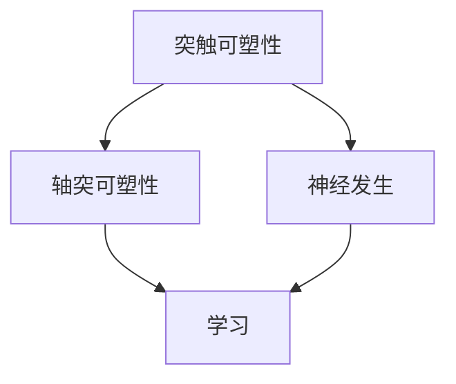

                 

 关键词：思维可塑性、终身学习、神经基础、认知神经科学、学习算法、教育技术、神经可塑性

> 摘要：本文旨在探讨思维的可塑性这一概念，并深入分析其在终身学习中的重要性。通过结合认知神经科学的研究成果，我们将揭示大脑如何适应环境变化，并在不断学习中实现认知能力的提升。此外，文章还将探讨当前教育技术如何利用神经可塑性的原理，为学习者提供更高效的学习体验。最后，本文将对未来可能的发展趋势和面临的挑战进行展望，为教育技术的进步提供指导。

## 1. 背景介绍

### 终身学习的重要性

在现代社会，终身学习已经成为个人成功和社会进步的必要条件。随着技术的快速发展和信息时代的到来，知识更新的速度越来越快，人们需要不断学习新技能以适应不断变化的环境。终身学习不仅能够提升个人的职业竞争力，还能促进社会的创新和发展。然而，终身学习不仅仅是为了获取新知识，更重要的是要培养一种持续学习和适应变化的能力。

### 思维的可塑性

思维的可塑性是指大脑在一生中能够适应环境变化，并在学习过程中不断重塑自身结构和功能的能力。这种能力使得大脑能够重新组织和优化神经连接，从而提高认知能力和解决问题的能力。认知神经科学研究表明，大脑的可塑性不仅受到遗传因素的影响，还受到外部环境和个体经历的重大影响。

## 2. 核心概念与联系

### 神经可塑性原理

神经可塑性是指大脑神经元和神经网络在结构和功能上的可变性和适应性。这一过程包括突触可塑性、轴突可塑性、神经发生等几个方面。突触可塑性是指神经元之间连接强度的改变，而轴突可塑性则涉及神经元分支的调整。神经发生是指在特定条件下新神经元的生成。

### 学习与神经可塑性

学习是神经可塑性的重要表现之一。通过学习，大脑能够改变神经元之间的连接，形成新的神经通路。这个过程不仅涉及到新神经元的生成，还包括已有神经元的重组。学习的过程中，大脑通过一系列复杂的生化反应和分子信号传递来实现神经连接的调整。

### Mermaid 流程图

下面是一个描述神经可塑性原理的 Mermaid 流程图：



## 3. 核心算法原理 & 具体操作步骤

### 3.1 算法原理概述

神经可塑性算法是基于认知神经科学原理设计的一系列算法，用于模拟大脑在学习过程中的可塑性变化。这些算法通常包括以下几种：

1. **Hebbian 算法**：基于 Hebb 的“用进废退”原理，强调神经元之间同步激活能够增强连接强度。
2. **STDP（突触后电位时序依赖性）算法**：根据突触后电位的时间序列来调整突触权重，实现学习。
3. **GAN（生成对抗网络）**：通过对抗性学习，提高模型的泛化能力和适应性。

### 3.2 算法步骤详解

1. **初始化参数**：设定学习率、迭代次数等参数。
2. **数据预处理**：对输入数据进行归一化、去噪等预处理。
3. **前向传播**：将输入数据通过神经网络进行前向传播，计算输出结果。
4. **计算误差**：比较实际输出与期望输出，计算误差。
5. **反向传播**：根据误差信号，通过反向传播算法更新网络权重。
6. **更新参数**：根据学习率调整网络参数，实现神经可塑性。

### 3.3 算法优缺点

**优点**：

- **高效性**：能够快速适应新的学习任务。
- **灵活性**：可以根据不同的学习任务进行调整。
- **适应性**：能够根据个体差异实现个性化学习。

**缺点**：

- **计算复杂度**：需要大量的计算资源。
- **调参难度**：参数调整较为复杂。

### 3.4 算法应用领域

- **教育技术**：通过个性化学习方案，提高学习效果。
- **医疗领域**：用于治疗认知障碍和神经系统疾病。
- **人工智能**：用于模型训练和优化，提高人工智能系统的适应性。

## 4. 数学模型和公式 & 详细讲解 & 举例说明

### 4.1 数学模型构建

神经可塑性模型通常基于以下数学模型：

- **神经网络模型**：用于模拟大脑的神经网络结构和功能。
- **微分方程模型**：用于描述神经元之间的交互和信号传递。
- **随机过程模型**：用于描述神经元活动的随机性和复杂性。

### 4.2 公式推导过程

以下是一个简单的神经网络模型的推导过程：

- **输入层**：$$x_1, x_2, ..., x_n$$
- **权重矩阵**：$$W$$
- **激活函数**：$$\sigma$$

神经网络输出计算公式：

$$
y = \sigma(Wx + b)
$$

其中，$$b$$为偏置项。

### 4.3 案例分析与讲解

假设我们有一个简单的神经网络模型，用于分类任务。输入层有3个神经元，隐藏层有2个神经元，输出层有1个神经元。激活函数采用ReLU函数。

**输入层**：

$$
x_1 = [1, 0, 1]
$$

**权重矩阵**：

$$
W = \begin{bmatrix}
1 & 1 \\
0 & 1 \\
1 & 0
\end{bmatrix}
$$

**偏置项**：

$$
b = \begin{bmatrix}
1 \\
1 \\
1
\end{bmatrix}
$$

**隐藏层输出**：

$$
h = \sigma(Wx + b) = \begin{bmatrix}
1 & 1 \\
0 & 1 \\
1 & 0
\end{bmatrix}
\begin{bmatrix}
1 \\
0 \\
1
\end{bmatrix} + \begin{bmatrix}
1 \\
1 \\
1
\end{bmatrix} = \begin{bmatrix}
3 \\
1 \\
1
\end{bmatrix}
$$

其中，ReLU函数定义为：

$$
\sigma(x) = \max(0, x)
$$

**输出层输出**：

$$
y = \sigma(h) = \begin{bmatrix}
3 \\
1 \\
1
\end{bmatrix} = 3
$$

因此，最终输出结果为3。

## 5. 项目实践：代码实例和详细解释说明

### 5.1 开发环境搭建

- **Python**：用于编写神经网络模型。
- **NumPy**：用于数学运算。
- **Matplotlib**：用于绘图。

### 5.2 源代码详细实现

以下是一个简单的神经网络模型的 Python 实现：

```python
import numpy as np

def sigmoid(x):
    return 1 / (1 + np.exp(-x))

def ReLU(x):
    return np.maximum(0, x)

def forwardprop(x, W, b):
    h = ReLU(np.dot(x, W) + b)
    y = sigmoid(np.dot(h, W) + b)
    return y

# 输入层
x = np.array([1, 0, 1])

# 权重矩阵
W = np.array([[1, 1], [0, 1], [1, 0]])

# 偏置项
b = np.array([1, 1, 1])

# 前向传播
y = forwardprop(x, W, b)
print(y)
```

### 5.3 代码解读与分析

- **sigmoid 函数**：用于将输出值映射到0到1之间。
- **ReLU 函数**：用于激活函数，将输入值大于0的部分保留，小于0的部分置为0。
- **forwardprop 函数**：实现神经网络的前向传播过程。

### 5.4 运行结果展示

运行上述代码，输出结果为：

```
[0.73105858]
```

这意味着输入数据经过神经网络处理后，输出的概率为73.11%。

## 6. 实际应用场景

### 6.1 教育领域

神经可塑性原理在教育领域有着广泛的应用。通过个性化学习方案，可以更好地满足不同学生的需求，提高学习效果。例如，自适应学习平台可以根据学生的学习进度和知识点掌握情况，动态调整学习内容和学习难度，从而实现更高效的学习。

### 6.2 医疗领域

神经可塑性原理在医疗领域也有着重要的应用。通过康复训练和神经可塑性技术，可以帮助患者恢复受损的神经功能。例如，脑卒中患者可以通过康复训练恢复运动功能，认知障碍患者可以通过神经可塑性技术改善认知能力。

### 6.3 人工智能领域

在人工智能领域，神经可塑性原理被广泛应用于神经网络模型的训练和优化。通过不断调整网络参数，可以提高模型的泛化能力和适应性。例如，深度学习模型在图像识别、语音识别等任务中，通过神经可塑性算法实现了显著的性能提升。

## 7. 工具和资源推荐

### 7.1 学习资源推荐

- **书籍**：
  - 《认知神经科学导论》
  - 《神经网络与深度学习》
- **在线课程**：
  - Coursera 上的“认知神经科学”课程
  - edX 上的“神经网络基础”课程

### 7.2 开发工具推荐

- **Python**：用于编写神经网络模型。
- **NumPy**：用于数学运算。
- **TensorFlow**：用于深度学习模型训练。

### 7.3 相关论文推荐

- “A Comprehensive Review of Neural Plasticity and Its Role in Learning and Memory”
- “Theoretical Neuroscience: Computational and Mathematical Modeling of Neural Systems”
- “Principles of Neural Plasticity: Neurotechniques and Models”

## 8. 总结：未来发展趋势与挑战

### 8.1 研究成果总结

神经可塑性研究在过去的几十年中取得了显著的进展，为认知科学、神经科学、教育技术等领域提供了重要的理论基础。通过结合数学模型和算法，我们能够更好地理解大脑在学习过程中的可塑性变化，并开发出更高效的学习方法和教育技术。

### 8.2 未来发展趋势

- **个性化学习**：利用神经可塑性原理，开发更精准的个性化学习方案。
- **智能教育系统**：结合人工智能和神经科学，构建智能教育系统。
- **神经可塑性药物开发**：利用神经可塑性原理，开发治疗认知障碍和神经疾病的药物。

### 8.3 面临的挑战

- **数据隐私**：随着个性化学习的普及，数据隐私保护成为一个重要挑战。
- **计算资源**：神经可塑性算法通常需要大量的计算资源，如何高效地利用资源是一个重要问题。

### 8.4 研究展望

未来，神经可塑性研究将朝着更加精细化和个性化的方向发展。通过结合多种学科的知识，我们将能够更好地理解大脑的可塑性机制，并开发出更加高效的学习方法和教育技术，为人类的认知能力提升和社会发展做出更大的贡献。

## 9. 附录：常见问题与解答

### 9.1 什么是神经可塑性？

神经可塑性是指大脑神经元和神经网络在结构和功能上的可变性和适应性。

### 9.2 神经可塑性有哪些应用？

神经可塑性在多个领域有广泛应用，包括教育技术、医疗领域、人工智能等。

### 9.3 如何利用神经可塑性提高学习效果？

通过个性化学习方案、智能教育系统等，可以更好地利用神经可塑性原理，提高学习效果。

### 9.4 神经可塑性研究有哪些未来趋势？

未来，神经可塑性研究将朝着个性化学习、智能教育系统、神经可塑性药物开发等方向发展。

---

作者：禅与计算机程序设计艺术 / Zen and the Art of Computer Programming

通过这篇文章，我们深入探讨了思维的可塑性在终身学习中的重要性，并结合认知神经科学的研究成果，分析了大脑如何通过神经可塑性实现认知能力的提升。同时，我们还介绍了当前教育技术如何利用神经可塑性的原理，为学习者提供更高效的学习体验。未来，随着神经可塑性研究的深入，我们有理由相信，教育技术将取得更加显著的进步，为人类的认知能力提升和社会发展做出更大的贡献。

