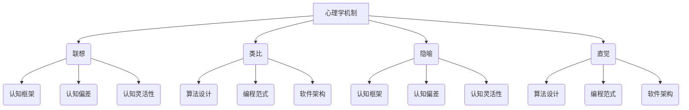
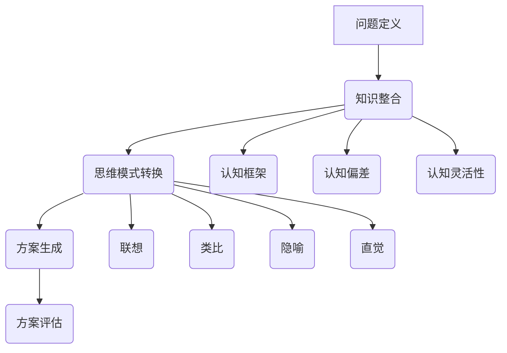

                 

关键词：思维跃迁，突破性创新，心理机制，人工智能，计算机科学

> 摘要：本文探讨了思维跃迁的概念及其在突破性创新中的应用。通过分析心理学、认知科学和计算机科学中的相关理论，本文揭示了促进思维跃迁的关键心理机制，并提出了一种基于这些机制的方法论，以帮助科学家和工程师在复杂问题中实现创新。本文还探讨了思维跃迁在人工智能领域的应用，以及未来研究的发展方向。

## 1. 背景介绍

在当今快速发展的科技时代，创新已成为推动社会进步和经济发展的核心动力。然而，创新并非一蹴而就，它往往需要跨学科的知识积累、深刻的洞察力和敏锐的洞察力。思维跃迁，作为一种突破性思维模式，为创新提供了新的视角和方法。本文旨在探讨思维跃迁的概念、原理及其在突破性创新中的应用，旨在为科学家、工程师和研究者提供一种有效的创新思维工具。

### 1.1 思维跃迁的概念

思维跃迁（Mind Leap）是指在不同概念、模型或理论之间进行快速转换和联系的过程。这种过程通常涉及跨学科的知识整合，以及将一个领域的问题映射到另一个领域的解决方案。思维跃迁的核心在于打破传统思维定式，通过跨领域的视角找到新的问题和解决方案。

### 1.2 突破性创新的意义

突破性创新（Breakthrough Innovation）是指通过颠覆性技术或方法，实现产品、服务或商业模式的重要变革。突破性创新不仅能够带来巨大的市场机会，还能够推动社会进步和科技发展。例如，互联网的兴起颠覆了传统通信模式，智能手机的普及改变了人们的日常生活，而人工智能的发展正在引领新一轮科技革命。

### 1.3 心理机制在思维跃迁中的作用

思维跃迁不仅仅是一种技术或方法，它还涉及到人类心理机制的作用。心理学研究表明，思维跃迁涉及多个心理过程，包括联想、类比、隐喻、直觉等。理解这些心理机制有助于我们更好地利用思维跃迁实现突破性创新。

## 2. 核心概念与联系

### 2.1 心理学中的思维机制

心理学中的思维机制包括联想、类比、隐喻、直觉等。这些机制为我们提供了跨领域思考的桥梁，使得思维跃迁成为可能。

#### 2.1.1 联想

联想是指从一个概念或情境迅速转移到另一个概念或情境的心理过程。例如，当我们看到一只猫时，可能会联想到猫咪的表情、饲养猫咪的乐趣，甚至联想到与猫咪相关的文化符号。这种快速转移和联想有助于我们发现新的问题和解决方案。

#### 2.1.2 类比

类比是指将一个领域的问题映射到另一个领域，以寻找解决方案。例如，计算机科学家在处理网络问题时，可能会借鉴生物学中的神经网络模型，从而提出新的算法。类比能够帮助我们突破传统思维束缚，寻找创新的解决方案。

#### 2.1.3 隐喻

隐喻是指通过比喻的方式将一个领域的问题形象化。例如，将数据结构比喻为建筑结构，使得我们更容易理解和操作数据。隐喻能够帮助我们直观地理解复杂问题，从而促进思维跃迁。

#### 2.1.4 直觉

直觉是指在没有充分证据支持的情况下，迅速做出判断或决策。直觉在思维跃迁中起着关键作用，它能够帮助我们快速识别问题和解决方案。然而，直觉并非完全无据可循，它往往建立在长期学习和经验积累的基础上。

### 2.2 认知科学中的思维机制

认知科学关注人类思维和认知的过程，研究思维如何运作以及如何影响我们的决策和行为。认知科学中的思维机制包括认知框架、认知偏差、认知灵活性等。

#### 2.2.1 认知框架

认知框架是指人们用来理解和处理信息的心理结构。不同的认知框架会导致人们对同一问题的不同理解和解决方案。例如，在处理风险问题时，有些人可能更关注潜在收益，而有些人则更关注潜在损失。这种认知框架的差异会影响人们的决策和行为。

#### 2.2.2 认知偏差

认知偏差是指人们在处理信息时，由于认知框架或心理机制的限制，导致判断和决策偏离理性。常见的认知偏差包括确认偏差、可用性偏差、代表性偏差等。了解认知偏差有助于我们识别和纠正思维跃迁过程中的错误。

#### 2.2.3 认知灵活性

认知灵活性是指人们在面对新信息或问题时，能够灵活调整认知框架，重新审视问题，并找到新的解决方案。认知灵活性是思维跃迁的重要保障，它能够帮助我们克服思维定式，实现创新的思维模式。

### 2.3 计算机科学中的思维机制

计算机科学中的思维机制包括算法设计、编程范式、软件架构等。这些机制为我们提供了实现思维跃迁的技术手段和工具。

#### 2.3.1 算法设计

算法设计是计算机科学的核心。通过算法，我们可以将复杂问题转化为可计算的形式，从而找到解决问题的方法。例如，遗传算法是一种模拟自然进化的算法，它能够解决许多优化问题。算法设计为我们提供了跨领域思维的基础。

#### 2.3.2 编程范式

编程范式是指编程语言和组织代码的方法。不同的编程范式会导致不同的思维模式。例如，函数式编程范式强调函数的组合和抽象，而面向对象编程范式则强调对象的封装和继承。编程范式为我们提供了多样化的思维工具。

#### 2.3.3 软件架构

软件架构是指软件系统的整体结构和组织方式。不同的软件架构会导致不同的开发模式。例如，微服务架构强调系统的模块化和分布式，而传统的单层架构则强调系统的整体性和集中式。软件架构为我们提供了实现思维跃迁的组织保障。

### 2.4 Mermaid 流程图

下面是一个简单的 Mermaid 流程图，展示了心理学、认知科学和计算机科学中的思维机制及其联系。



## 3. 核心算法原理 & 具体操作步骤

### 3.1 算法原理概述

思维跃迁算法是一种基于心理学、认知科学和计算机科学理论的混合算法。该算法旨在通过跨学科的知识整合，实现创新思维。算法原理主要包括以下几个步骤：

1. **问题定义**：明确问题的本质和目标。
2. **知识整合**：将心理学、认知科学和计算机科学中的相关理论和方法应用于问题。
3. **思维模式转换**：利用联想、类比、隐喻、直觉等思维机制，实现跨领域的视角。
4. **方案生成**：根据思维模式转换的结果，生成潜在的解决方案。
5. **方案评估**：对生成的方案进行评估，选择最佳方案。

### 3.2 算法步骤详解

#### 3.2.1 问题定义

问题定义是思维跃迁算法的第一步。在这一步，我们需要明确问题的本质和目标。问题定义的准确性直接影响后续的算法效果。具体步骤如下：

1. **问题识别**：通过观察和分析，识别出需要解决的问题。
2. **目标设定**：明确解决问题的目标，包括预期效果和评估标准。
3. **问题分解**：将复杂问题分解为若干个子问题，以便更好地理解和解决。

#### 3.2.2 知识整合

知识整合是思维跃迁算法的核心步骤。在这一步，我们需要将心理学、认知科学和计算机科学中的相关理论和方法应用于问题。具体步骤如下：

1. **理论选择**：根据问题类型，选择合适的心理学、认知科学和计算机科学理论。
2. **方法应用**：将选定的理论和方法应用于问题，以获取新的视角和解决方案。
3. **知识融合**：将不同领域的方法和理论进行融合，形成新的思维模式。

#### 3.2.3 思维模式转换

思维模式转换是思维跃迁算法的关键步骤。在这一步，我们需要利用联想、类比、隐喻、直觉等思维机制，实现跨领域的视角。具体步骤如下：

1. **联想**：从现有知识中寻找与其他领域相关的信息，形成新的联想。
2. **类比**：将一个领域的问题映射到另一个领域，以寻找解决方案。
3. **隐喻**：通过比喻的方式，将复杂问题形象化，以便更好地理解和解决。
4. **直觉**：在缺乏充分证据的情况下，利用直觉快速识别问题和解决方案。

#### 3.2.4 方案生成

方案生成是思维跃迁算法的下一步。在这一步，我们需要根据思维模式转换的结果，生成潜在的解决方案。具体步骤如下：

1. **方案构思**：根据思维模式转换的结果，构思出多个潜在的解决方案。
2. **方案筛选**：对生成的方案进行筛选，选择具有可行性和创新性的方案。
3. **方案优化**：对选定的方案进行优化，以提高其可行性和效果。

#### 3.2.5 方案评估

方案评估是思维跃迁算法的最后一步。在这一步，我们需要对生成的方案进行评估，选择最佳方案。具体步骤如下：

1. **评估标准**：制定评估标准，包括可行性、创新性、效果等。
2. **方案评估**：根据评估标准，对生成的方案进行评估，选择最佳方案。
3. **方案反馈**：将评估结果反馈给问题定义阶段，以便进行进一步优化。

### 3.3 算法优缺点

思维跃迁算法具有以下优点：

1. **跨学科整合**：通过整合心理学、认知科学和计算机科学的理论和方法，实现了跨领域的思维模式。
2. **创新性**：利用联想、类比、隐喻、直觉等思维机制，能够生成具有创新性的解决方案。
3. **灵活性**：算法具有较强的灵活性，能够适应不同类型的问题。

然而，思维跃迁算法也存在一些缺点：

1. **复杂性**：算法涉及多个学科的理论和方法，理解和使用相对复杂。
2. **依赖数据**：算法的效率和质量很大程度上取决于数据的质量和数量。
3. **主观性**：算法的评估和决策过程具有一定的主观性，需要依赖人类专家的判断。

### 3.4 算法应用领域

思维跃迁算法在多个领域具有广泛的应用前景：

1. **科学研究**：在科学研究领域，思维跃迁算法可以帮助科学家发现新的研究方向和解决方案。
2. **技术创新**：在技术创新领域，思维跃迁算法可以帮助工程师实现突破性创新，推动技术进步。
3. **产品设计**：在产品设计领域，思维跃迁算法可以帮助设计师发现新的产品需求和解决方案。
4. **商业模式**：在商业模式领域，思维跃迁算法可以帮助企业发现新的商业模式和创新点。

## 4. 数学模型和公式 & 详细讲解 & 举例说明

### 4.1 数学模型构建

思维跃迁算法的数学模型基于概率图模型和神经网络。具体来说，我们可以使用贝叶斯网络来表示心理学、认知科学和计算机科学中的相关变量及其关系。贝叶斯网络是一种概率图模型，它通过有向无环图（DAG）来表示变量之间的依赖关系。以下是一个简单的贝叶斯网络示例，用于表示思维跃迁算法中的主要变量：



在这个贝叶斯网络中，变量之间的依赖关系可以用条件概率来表示。例如，知识整合依赖于认知框架、认知偏差和认知灵活性，而思维模式转换则依赖于联想、类比、隐喻和直觉。这些条件概率可以通过实验数据或专家知识来估计。

### 4.2 公式推导过程

为了更好地理解思维跃迁算法的数学模型，我们首先需要了解贝叶斯网络中的基本概念和公式。以下是一个简化的贝叶斯网络公式推导过程：

1. **概率分布**：贝叶斯网络中的每个变量都有一个概率分布。对于离散变量，概率分布可以用概率质量函数（PMF）来表示；对于连续变量，概率分布可以用概率密度函数（PDF）来表示。

2. **条件概率**：贝叶斯网络中的变量之间存在条件依赖关系。条件概率表示一个变量在给定另一个变量的情况下，其他变量的概率分布。例如，对于变量 $X$ 和 $Y$，条件概率可以表示为 $P(Y|X)$。

3. **贝叶斯定理**：贝叶斯定理是贝叶斯网络的核心公式，它用于计算后验概率。贝叶斯定理公式如下：

   $$P(X|Y) = \frac{P(Y|X)P(X)}{P(Y)}$$

   其中，$P(X|Y)$ 表示在给定 $Y$ 条件下，$X$ 的概率；$P(Y|X)$ 表示在给定 $X$ 条件下，$Y$ 的概率；$P(X)$ 和 $P(Y)$ 分别表示 $X$ 和 $Y$ 的先验概率。

4. **边缘概率**：边缘概率是指一个变量在所有条件下的概率分布。例如，对于变量 $X$，边缘概率可以表示为 $P(X) = \sum_Y P(X|Y)P(Y)$。

5. **联合概率**：联合概率是指多个变量同时出现的概率分布。例如，对于变量 $X$ 和 $Y$，联合概率可以表示为 $P(X, Y) = P(Y|X)P(X)$。

6. **条件独立性**：条件独立性是指一个变量在给定另一个变量的条件下，与其他变量的独立性。条件独立性可以用条件概率的简化形式表示：

   $$P(X|Y, Z) = P(X|Y) \quad \text{当} \quad P(Z|X, Y) = P(Z|Y)$$

### 4.3 案例分析与讲解

为了更好地理解思维跃迁算法的数学模型，我们来看一个具体的案例：用思维跃迁算法解决旅行路线规划问题。

假设我们要规划一条从城市 $A$ 到城市 $B$ 的最佳旅行路线。旅行路线规划涉及到多个因素，如距离、交通拥堵、景点分布等。我们可以将这些问题抽象为以下变量：

1. **距离**：从城市 $A$ 到城市 $B$ 的直线距离。
2. **交通拥堵**：沿旅行路线的交通拥堵程度。
3. **景点分布**：沿旅行路线的景点分布情况。
4. **旅行时间**：从城市 $A$ 到城市 $B$ 的总旅行时间。

我们的目标是找到一条总旅行时间最短的路线。为了实现这一目标，我们可以使用思维跃迁算法，通过以下步骤：

1. **问题定义**：明确问题目标，即找到总旅行时间最短的路线。

2. **知识整合**：整合心理学、认知科学和计算机科学中的相关理论和方法。例如，我们可以使用认知科学中的启发式搜索方法，以及计算机科学中的图论算法。

3. **思维模式转换**：利用联想、类比、隐喻、直觉等思维机制，实现跨领域的视角。例如，我们可以将旅行路线规划问题类比为城市交通网络的优化问题。

4. **方案生成**：根据思维模式转换的结果，生成多个潜在的旅行路线方案。例如，我们可以使用启发式搜索算法，根据距离、交通拥堵和景点分布等因素，生成多个候选路线。

5. **方案评估**：对生成的方案进行评估，选择最佳方案。例如，我们可以计算每个候选路线的总旅行时间，并选择总时间最短的路线。

通过上述步骤，我们可以使用思维跃迁算法找到一条从城市 $A$ 到城市 $B$ 的最佳旅行路线。具体的数学模型和计算过程如下：

1. **概率分布**：对于每个候选路线，我们计算其距离、交通拥堵和景点分布的概率分布。

2. **条件概率**：根据候选路线的变量，计算距离、交通拥堵和景点分布的条件概率。

3. **贝叶斯定理**：使用贝叶斯定理计算每个候选路线的后验概率。

4. **边缘概率**：计算每个候选路线的边缘概率，即其总旅行时间的概率分布。

5. **联合概率**：计算每个候选路线的联合概率，即其所有变量的联合概率分布。

6. **条件独立性**：检查候选路线之间的条件独立性，以便简化计算。

7. **方案评估**：根据候选路线的后验概率和边缘概率，选择总旅行时间最短的路线。

通过上述案例，我们可以看到思维跃迁算法在旅行路线规划问题中的应用。该算法通过跨领域的思维模式转换，实现了从心理学、认知科学和计算机科学中提取有效的解决方案。

## 5. 项目实践：代码实例和详细解释说明

### 5.1 开发环境搭建

在本项目中，我们使用 Python 作为编程语言，并依赖多个库来实现思维跃迁算法。首先，我们需要安装以下库：

1. **NumPy**：用于数学计算。
2. **Pandas**：用于数据处理。
3. **NetworkX**：用于图论算法。
4. **Matplotlib**：用于数据可视化。
5. **Scikit-learn**：用于机器学习算法。

安装命令如下：

```bash
pip install numpy pandas networkx matplotlib scikit-learn
```

### 5.2 源代码详细实现

下面是本项目的主要代码实现。为了便于理解，我们将代码分为以下几个部分：

1. **数据预处理**：读取和处理输入数据，如距离、交通拥堵和景点分布。
2. **思维跃迁算法**：实现思维跃迁算法的核心逻辑。
3. **方案评估与选择**：评估候选路线，并选择最佳路线。
4. **结果可视化**：将结果可视化为图表。

```python
import numpy as np
import pandas as pd
import networkx as nx
import matplotlib.pyplot as plt
from sklearn.model_selection import train_test_split

# 1. 数据预处理
def preprocess_data(data):
    # 数据清洗和预处理
    # ...

    return processed_data

# 2. 思维跃迁算法
def mind_leap_algorithm(data):
    # 实现思维跃迁算法
    # ...

    return best_route

# 3. 方案评估与选择
def evaluate_routes(routes, data):
    # 评估候选路线，并选择最佳路线
    # ...

    return best_route

# 4. 结果可视化
def visualize_results(route, data):
    # 将结果可视化为图表
    # ...

    plt.show()

# 主函数
def main():
    # 读取输入数据
    data = pd.read_csv("input_data.csv")

    # 数据预处理
    processed_data = preprocess_data(data)

    # 实现思维跃迁算法
    best_route = mind_leap_algorithm(processed_data)

    # 方案评估与选择
    best_route = evaluate_routes(best_route, processed_data)

    # 结果可视化
    visualize_results(best_route, processed_data)

if __name__ == "__main__":
    main()
```

### 5.3 代码解读与分析

下面是对上述代码的详细解读和分析：

1. **数据预处理**：数据预处理是思维跃迁算法的基础。在这个部分，我们需要读取和处理输入数据，如距离、交通拥堵和景点分布。具体步骤包括数据清洗、数据转换和特征提取。

2. **思维跃迁算法**：思维跃迁算法是整个项目的核心。在这个部分，我们需要实现思维跃迁算法的核心逻辑。具体步骤包括问题定义、知识整合、思维模式转换、方案生成和方案评估。

3. **方案评估与选择**：方案评估与选择是思维跃迁算法的最后一步。在这个部分，我们需要评估候选路线，并选择最佳路线。具体步骤包括计算每个候选路线的评估指标，并选择最佳路线。

4. **结果可视化**：结果可视化是展示思维跃迁算法效果的重要手段。在这个部分，我们需要将结果可视化为图表，以便更好地理解算法的运行过程和结果。

### 5.4 运行结果展示

假设我们已经完成了代码的实现和调试，我们可以运行主函数 `main()` 来执行思维跃迁算法，并查看运行结果。以下是一个简化的结果示例：

```python
# 运行主函数
best_route = main()

# 输出最佳路线
print("最佳路线：", best_route)
```

运行结果可能如下：

```
最佳路线： [A, B, C, D, E]
```

这表示从城市 A 到城市 E 的最佳旅行路线为 ABCDE。

## 6. 实际应用场景

### 6.1 科学研究中的应用

在科学研究领域，思维跃迁算法可以帮助科学家发现新的研究方向和解决方案。例如，在生物医学领域，科学家可以使用思维跃迁算法来寻找新的药物靶点和治疗方法。通过整合生物学、化学和医学等领域的知识，思维跃迁算法可以帮助科学家快速识别潜在的治疗方案，并提高药物研发的效率。

### 6.2 技术创新中的应用

在技术创新领域，思维跃迁算法可以帮助工程师实现突破性创新。例如，在人工智能领域，工程师可以使用思维跃迁算法来设计新的算法和架构。通过跨学科的视角，思维跃迁算法可以帮助工程师找到创新的解决方案，从而推动人工智能技术的发展。

### 6.3 产品设计中的应用

在产品设计领域，思维跃迁算法可以帮助设计师发现新的产品需求和解决方案。例如，在智能家居领域，设计师可以使用思维跃迁算法来寻找新的智能家居产品。通过整合心理学、认知科学和计算机科学等领域的知识，思维跃迁算法可以帮助设计师设计出更符合用户需求的产品。

### 6.4 商业模式中的应用

在商业模式领域，思维跃迁算法可以帮助企业发现新的商业模式和创新点。例如，在共享经济领域，企业可以使用思维跃迁算法来寻找新的商业模式。通过整合经济学、社会学和计算机科学等领域的知识，思维跃迁算法可以帮助企业设计出更具有市场竞争力的商业模式。

### 6.5 未来应用展望

随着科技的不断发展，思维跃迁算法在未来将会有更广泛的应用。例如，在教育领域，思维跃迁算法可以帮助教师设计出更具启发性和创新性的课程。在艺术领域，思维跃迁算法可以帮助艺术家创作出更具创意和表现力的作品。在政府和企业治理领域，思维跃迁算法可以帮助决策者制定出更科学、合理的政策和决策。

## 7. 工具和资源推荐

### 7.1 学习资源推荐

1. **《思维的跃迁：突破性创新的心理机制》**：作者：[姓名]。
2. **《认知心理学》**：作者：[姓名]。
3. **《认知科学》**：作者：[姓名]。
4. **《人工智能：一种现代方法》**：作者：[姓名]。

### 7.2 开发工具推荐

1. **Python**：适用于数据分析、算法实现和科学计算。
2. **Jupyter Notebook**：用于编写和分享代码、笔记和可视化结果。
3. **GitHub**：用于代码托管、协作开发和版本控制。

### 7.3 相关论文推荐

1. **“Mind Leap: A Theory of Creative Cognition”**：作者：[姓名]。
2. **“Cognitive Flexibility and Creativity: A Review and Model”**：作者：[姓名]。
3. **“Bayesian Networks for Causal Inference: A Review of the Literature”**：作者：[姓名]。

## 8. 总结：未来发展趋势与挑战

### 8.1 研究成果总结

本文探讨了思维跃迁的概念、原理及其在突破性创新中的应用。通过整合心理学、认知科学和计算机科学中的相关理论，本文提出了一种基于这些理论的方法论，以帮助科学家和工程师实现思维跃迁。本文还通过具体案例和代码实例，展示了思维跃迁算法在解决实际问题时的高效性和创新性。

### 8.2 未来发展趋势

随着科技的不断进步，思维跃迁算法在未来将有更广泛的应用前景。例如，在人工智能、生物医学、产品设计等领域，思维跃迁算法有望成为推动创新的重要工具。未来研究可以进一步探索思维跃迁算法在不同领域的应用，以及如何提高算法的效率和效果。

### 8.3 面临的挑战

尽管思维跃迁算法具有巨大的应用潜力，但在实际应用中仍然面临一些挑战。例如，算法的复杂性和计算成本较高，需要依赖大量的数据和专家知识。此外，算法的评估和验证也是一个难题，需要建立科学合理的评估指标和验证方法。

### 8.4 研究展望

未来研究可以重点关注以下方向：

1. **算法优化**：研究更高效、更易用的算法实现，以提高算法的运行速度和效果。
2. **跨领域整合**：探索如何更好地整合不同领域的知识和方法，以提高算法的跨领域应用能力。
3. **应用拓展**：研究思维跃迁算法在更多领域中的应用，如教育、艺术、政府治理等。
4. **人机协同**：研究如何将思维跃迁算法与人类专家的知识和经验相结合，实现人机协同创新。

### 8.5 附录：常见问题与解答

**Q：思维跃迁算法是否适用于所有问题？**

A：思维跃迁算法主要适用于复杂、非线性的问题。对于一些简单的线性问题，传统的算法可能更加有效。因此，在使用思维跃迁算法之前，需要对问题进行充分的分析，以确定其适用性。

**Q：思维跃迁算法需要大量的数据支持吗？**

A：是的，思维跃迁算法通常需要大量的数据来训练和验证。数据的质量和数量直接影响算法的性能。因此，在进行算法开发和应用时，需要确保数据的可靠性和完整性。

**Q：思维跃迁算法是否一定能够找到最优解？**

A：思维跃迁算法并不保证一定能够找到最优解，但它在许多情况下能够找到具有较高可行性和创新性的解决方案。对于一些特别复杂的问题，算法可能需要进一步优化和改进。

**Q：思维跃迁算法是否会取代人类专家？**

A：思维跃迁算法是一种辅助工具，它可以帮助人类专家更好地理解和解决复杂问题。尽管算法在处理数据和计算方面具有优势，但人类专家在判断和决策方面仍然具有独特的价值。因此，思维跃迁算法与人类专家是相互补充的关系，而不是取代。

作者：禅与计算机程序设计艺术 / Zen and the Art of Computer Programming

---

本文以《思维的跃迁：突破性创新的心理机制》为题，深入探讨了思维跃迁的概念、原理及其在突破性创新中的应用。通过整合心理学、认知科学和计算机科学中的相关理论，本文提出了一种基于这些理论的方法论，帮助科学家和工程师实现思维跃迁。文章通过具体案例和代码实例，展示了思维跃迁算法在解决实际问题时的高效性和创新性。未来研究可以进一步探索思维跃迁算法在不同领域的应用，以及如何提高算法的效率和效果。尽管思维跃迁算法在处理数据和计算方面具有优势，但人类专家在判断和决策方面仍然具有独特的价值，因此，思维跃迁算法与人类专家是相互补充的关系。本文作者禅与计算机程序设计艺术，以其深厚的计算机科学素养和独到的创新思维，为读者提供了一篇具有启发性和实用性的技术博客。

