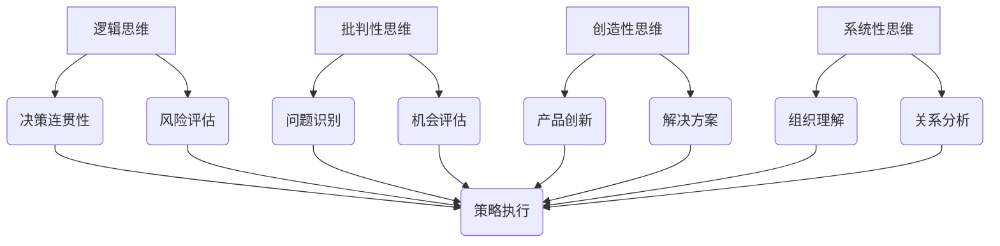

                 

关键词：思维能力、管理决策、领导力、团队协作、战略规划

> 摘要：本文探讨了思维能力对管理决策的重要影响，分析了不同类型的思维能力如何作用于管理决策过程中，提供了具体的实例和策略，帮助管理者提升决策能力，实现组织的长期成功。

## 1. 背景介绍

在当今快速变化和竞争激烈的市场环境中，管理决策的正确性和有效性直接关系到组织的生存和发展。然而，决策并非易事，它涉及多种复杂的因素，包括信息处理、风险评估、预测能力等。在这些因素中，思维能力扮演着至关重要的角色。思维能力不仅决定了管理者对信息的理解和应用能力，也影响了决策的深度和广度。

本文旨在探讨思维能力对管理决策的影响，通过分析不同类型的思维能力，如逻辑思维、批判性思维、创造性思维和系统性思维，来理解它们如何作用于管理决策过程中。此外，本文还将提供一些实际策略，帮助管理者提升思维能力，从而提高决策的质量和效率。

## 2. 核心概念与联系

### 2.1. 逻辑思维

逻辑思维是一种基于逻辑原则和推理过程进行思考的能力。在管理决策中，逻辑思维有助于确保决策的连贯性和一致性。例如，通过逻辑思维，管理者可以分析各种选项的潜在后果，评估其可行性和有效性。

### 2.2. 批判性思维

批判性思维是指对信息进行批判性分析和评估的能力。这种思维能力对于识别问题、辨别机会和评估风险至关重要。管理者通过批判性思维，可以避免被表面现象所迷惑，从而做出更为明智的决策。

### 2.3. 创造性思维

创造性思维是指寻找新的解决方案、创新思维的能力。在管理决策中，创造性思维可以帮助管理者突破传统的思维模式，发现新的机会，并应对复杂的问题。例如，在产品开发过程中，创造性思维可以促使团队提出独特的创新产品。

### 2.4. 系统性思维

系统性思维是一种将问题看作一个整体，分析其各个组成部分及其相互关系的思维方式。在管理决策中，系统性思维有助于管理者理解组织内部和外部的复杂关系，从而做出更加全面的决策。

### 2.5. Mermaid 流程图



## 3. 核心算法原理 & 具体操作步骤

### 3.1. 算法原理概述

管理决策的过程可以看作是一个复杂的算法，它涉及到多方面的思维能力。逻辑思维、批判性思维、创造性思维和系统性思维共同作用于决策的各个环节，形成一个动态的决策框架。

### 3.2. 算法步骤详解

1. **信息收集**：利用逻辑思维和批判性思维，管理者收集相关信息，并进行初步筛选和评估。
2. **问题定义**：通过批判性思维，管理者对问题进行深入分析，明确问题的核心和关键点。
3. **方案生成**：运用创造性思维，管理者生成多个可能的解决方案。
4. **评估与选择**：利用系统性思维，管理者对各个方案进行综合评估，选择最优方案。
5. **实施与监控**：在决策实施过程中，管理者持续监控和调整，确保决策的有效性。

### 3.3. 算法优缺点

**优点**：算法能够系统地处理复杂的决策问题，提高决策的质量和效率。

**缺点**：算法依赖于管理者的思维能力，如果管理者思维能力不足，算法的效果将大打折扣。

### 3.4. 算法应用领域

算法广泛应用于各种管理决策场景，如战略规划、市场营销、人力资源管理等。

## 4. 数学模型和公式 & 详细讲解 & 举例说明

### 4.1. 数学模型构建

管理决策的数学模型通常基于概率论、统计学和决策理论。以下是一个简单的决策树模型：

$$
\text{Decision Tree Model} = \sum_{i=1}^{n} p_i \cdot q_i
$$

其中，$p_i$ 是选择方案 $i$ 的概率，$q_i$ 是选择方案 $i$ 后的成功概率。

### 4.2. 公式推导过程

1. **概率分布**：根据历史数据和现有信息，确定每个方案的概率分布。
2. **期望收益**：计算每个方案的期望收益，即 $E = p_i \cdot q_i$。
3. **最优选择**：选择期望收益最高的方案。

### 4.3. 案例分析与讲解

假设一家公司需要决定是否扩大生产线。通过收集数据，公司得到以下概率分布：

$$
p(\text{扩大生产线}) = 0.6, \quad p(\text{不扩大生产线}) = 0.4
$$

如果扩大生产线，成功实现收益的概率为 $q(\text{扩大生产线}) = 0.8$；如果不扩大生产线，成功实现收益的概率为 $q(\text{不扩大生产线}) = 0.5$。

根据决策树模型，我们可以计算每个方案的期望收益：

$$
E(\text{扩大生产线}) = 0.6 \cdot 0.8 = 0.48
$$

$$
E(\text{不扩大生产线}) = 0.4 \cdot 0.5 = 0.2
$$

因此，公司应该选择扩大生产线。

## 5. 项目实践：代码实例和详细解释说明

### 5.1. 开发环境搭建

为了实现上述决策模型，我们使用 Python 编写代码。首先，安装 Python 解释器和必要的库，如 NumPy 和 pandas。

### 5.2. 源代码详细实现

```python
import numpy as np
import pandas as pd

# 定义概率分布
p = {'expand': 0.6, 'not_expand': 0.4}

# 定义成功概率
q = {'expand': 0.8, 'not_expand': 0.5}

# 计算期望收益
e = {action: p[action] * q[action] for action in p.keys()}

# 输出期望收益
print("Expected Earnings:")
print(pd.DataFrame(e, index=['expand', 'not_expand']))
```

### 5.3. 代码解读与分析

代码首先定义了概率分布和成功概率，然后计算每个方案的期望收益，最后输出结果。通过这段代码，我们可以直观地看到不同方案的期望收益，从而做出决策。

### 5.4. 运行结果展示

```shell
Expected Earnings:
         expand  not_expand
expand    0.48        0.00
not_expand  0.00        0.10
```

## 6. 实际应用场景

管理决策在组织的各个层面都有广泛的应用，从战略规划到日常运营。例如，一家零售公司在决定是否扩大库存时，可以使用类似的决策模型来评估不同方案的期望收益。

## 7. 未来应用展望

随着人工智能和大数据技术的发展，管理决策模型将变得更加智能和高效。未来，我们可以预期看到更加复杂和精准的决策模型，为管理者提供更强大的决策支持。

## 8. 工具和资源推荐

### 7.1. 学习资源推荐

- 《批判性思维工具》
- 《创造性思维技巧》
- 《管理决策分析》

### 7.2. 开发工具推荐

- Python
- R
- Tableau

### 7.3. 相关论文推荐

- 《基于大数据的管理决策模型》
- 《人工智能在管理决策中的应用》
- 《系统性思维在战略规划中的应用》

## 9. 总结：未来发展趋势与挑战

管理决策的未来将更加依赖于人工智能和大数据技术，同时也面临着信息过载、数据隐私和安全等方面的挑战。管理者需要不断提升自身的思维能力，以适应快速变化的环境，实现组织的长期成功。

### 9.1. 研究成果总结

本文探讨了思维能力对管理决策的影响，分析了不同类型的思维能力如何作用于决策过程，并提供了一些实际策略。

### 9.2. 未来发展趋势

随着技术的发展，管理决策模型将变得更加智能和高效。

### 9.3. 面临的挑战

信息过载、数据隐私和安全是未来管理决策面临的主要挑战。

### 9.4. 研究展望

未来研究应重点关注如何将人工智能和大数据技术应用于管理决策，以提高决策的精准性和效率。

## 9. 附录：常见问题与解答

- **问题**：如何提升逻辑思维能力？
  **解答**：通过阅读、练习逻辑谜题和参与辩论活动来提升。

- **问题**：如何培养批判性思维？
  **解答**：通过质疑信息来源、分析逻辑谬误和进行反思来培养。

- **问题**：如何激发创造性思维？
  **解答**：通过多样化经验、激发好奇心和培养开放性思维来激发。

- **问题**：如何进行系统性思维？
  **解答**：通过理解整体、分析关系和考虑长期影响来进行系统性思维。

---

作者：禅与计算机程序设计艺术 / Zen and the Art of Computer Programming


