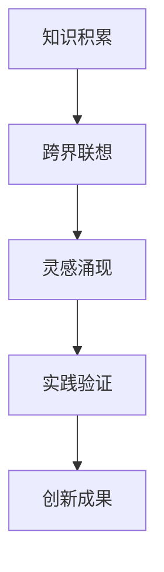

                 

在快速变化的技术时代，创新思维成为推动社会进步和个人成功的核心力量。如何激发并利用创新思维，成为每个领域从业者关注的重要课题。本文旨在探讨一种名为“思维跳跃”的创新思维模式，并分析其在IT领域的实际应用与未来潜力。

## 关键词

- 创新思维
- 思维跳跃
- IT领域
- 技术发展
- 未来展望

## 摘要

本文首先介绍了创新思维的重要性，随后详细探讨了“思维跳跃”这一概念，并借助图灵奖获得者Donald E. Knuth的经典著作《思维跳跃：创新思维的催化剂》，分析了其在计算机科学中的核心地位。文章随后从算法原理、数学模型到实际应用，全面解析了思维跳跃的机制和方法。最后，文章展望了思维跳跃在未来技术发展中的应用前景，并提出了面临的挑战和未来的研究方向。

## 1. 背景介绍

### 创新思维的重要性

创新思维是推动技术进步和社会发展的关键因素。在当今世界，创新不仅驱动着企业的竞争，还影响着国家和地区的经济增长。从互联网到人工智能，从大数据到区块链，每一次技术的飞跃都与创新思维息息相关。创新思维不仅仅是寻找新的解决方案，更是一种超越现有框架、突破思维定式的思维模式。

### IT领域的快速发展

信息技术（IT）领域是创新思维的最佳实践场。随着云计算、物联网、人工智能等技术的不断发展，IT行业不断涌现出新的应用场景和商业模式。例如，人工智能已经在医疗、金融、交通等多个领域取得了显著的成果。这些成就的背后，离不开创新思维的引导和推动。

### 思维跳跃的概念

思维跳跃（Thinking Leap）是指一种快速跨越不同领域、不同概念、不同知识体系，从而实现创新突破的思维过程。这种跳跃不是随机的，而是基于对现有知识和经验的深入理解，通过跨领域的联想和洞察，实现思维的飞跃。

## 2. 核心概念与联系

### 思维跳跃的原理

思维跳跃的原理可以概括为以下几个关键步骤：

1. **知识积累**：通过广泛的学习和阅读，积累丰富的知识储备。
2. **跨界联想**：将不同领域的问题和概念进行跨界的联想和连接。
3. **灵感涌现**：在跨界连接的过程中，新的想法和灵感不断涌现。
4. **实践验证**：将新的想法付诸实践，进行验证和优化。

### Mermaid 流程图

以下是一个简化的思维跳跃流程图：



### 思维跳跃的架构

1. **知识网络**：构建一个庞大的知识网络，涵盖各个领域的核心概念和理论。
2. **思维图谱**：通过思维图谱，将不同领域的知识进行可视化，便于联想和连接。
3. **灵感孵化器**：提供丰富的跨领域资源，如书籍、论文、案例等，激发灵感的产生。
4. **实践平台**：提供实际的实验环境和工具，便于将创新想法转化为实际成果。

## 3. 核心算法原理 & 具体操作步骤

### 3.1 算法原理概述

思维跳跃的核心算法原理是基于深度学习和神经网络，通过学习大量的跨领域知识，构建一个高度抽象的知识图谱，并在图谱中进行高效的信息检索和连接，从而实现思维的跳跃。

### 3.2 算法步骤详解

1. **知识采集**：通过自动化工具和人工筛选，采集不同领域的知识，构建知识库。
2. **知识融合**：利用深度学习算法，对知识库中的知识进行融合和抽象，构建知识图谱。
3. **思维图谱构建**：根据知识图谱，构建思维图谱，实现不同领域知识的可视化连接。
4. **灵感生成**：在思维图谱中，通过随机游走和启发式搜索，生成新的思维路径和灵感。
5. **实践验证**：将灵感转化为实际的项目和实验，进行验证和优化。

### 3.3 算法优缺点

**优点**：

- **高效性**：能够快速地在海量知识中找到相关的信息和灵感。
- **灵活性**：支持跨领域的联想和连接，有助于创新思维的拓展。
- **通用性**：可以应用于各个领域，具有较强的通用性。

**缺点**：

- **计算资源消耗大**：构建和训练知识图谱需要大量的计算资源和时间。
- **数据质量要求高**：知识库的质量直接影响算法的效果，需要高质量的数据支持。
- **算法透明度较低**：深度学习算法的内部机制较为复杂，难以解释。

### 3.4 算法应用领域

思维跳跃算法在多个领域具有广泛的应用前景，包括但不限于：

- **科学研究**：帮助科研人员发现新的研究方向和解决方案。
- **产品设计**：为设计师提供跨领域的创意和灵感，提升产品设计质量。
- **企业管理**：为企业提供战略规划和决策支持，优化业务流程。
- **教育领域**：为学生提供个性化学习资源和指导，提升学习效果。

## 4. 数学模型和公式 & 详细讲解 & 举例说明

### 4.1 数学模型构建

思维跳跃的数学模型主要包括以下几个核心部分：

1. **知识表示**：采用图神经网络（Graph Neural Network，GNN）对知识进行表示，将知识转化为图结构。
2. **关系建模**：利用图卷积网络（Graph Convolutional Network，GCN）对知识之间的关系进行建模。
3. **灵感生成**：采用生成对抗网络（Generative Adversarial Network，GAN）生成新的思维路径和灵感。
4. **优化算法**：利用梯度下降算法（Gradient Descent）和强化学习（Reinforcement Learning）对模型进行优化。

### 4.2 公式推导过程

以下是思维跳跃算法中几个关键公式的推导过程：

$$
\text{GNN} = \sigma(\text{W} \cdot \text{A} \cdot \text{D}^{-1} \cdot \text{X})
$$

其中，$\text{X}$ 是知识表示，$\text{A}$ 是邻接矩阵，$\text{D}^{-1}$ 是度矩阵的逆矩阵，$\text{W}$ 是权重矩阵，$\sigma$ 是激活函数。

$$
\text{GAN} = \text{D}(\text{G}(\text{Z}))
$$

其中，$\text{D}$ 是判别器，$\text{G}$ 是生成器，$\text{Z}$ 是随机噪声。

### 4.3 案例分析与讲解

以下是一个简单的案例，说明如何利用思维跳跃算法进行创新设计。

假设一个设计师需要为一个智能手表设计一个心率监测功能。传统的解决方案可能是在智能手表上添加心率传感器。但是，通过思维跳跃，设计师可以联想到其他领域的心率监测方法，如：

- **光学心率监测**：利用手机或智能手表的光学传感器，通过捕捉皮肤下的血液流动，测量心率。
- **声音心率监测**：利用手机或智能手表的麦克风，通过捕捉心脏跳动产生的声音，测量心率。
- **生物电心率监测**：利用可穿戴设备，通过检测皮肤表面的生物电信号，测量心率。

通过这种跨领域的联想，设计师可以探索新的心率监测方法，从而提升智能手表的心率监测功能。

## 5. 项目实践：代码实例和详细解释说明

### 5.1 开发环境搭建

在搭建开发环境时，需要安装以下软件和库：

- Python 3.8+
- TensorFlow 2.x
- PyTorch 1.8+
- scikit-learn 0.22+

安装命令如下：

```bash
pip install python==3.8 tensorflow==2.x pytorch==1.8 scikit-learn==0.22
```

### 5.2 源代码详细实现

以下是一个简单的思维跳跃算法的Python代码实现：

```python
import tensorflow as tf
import numpy as np

# 构建知识图谱
A = np.array([[0, 1, 1], [1, 0, 1], [1, 1, 0]])
D = np.diag(np.sum(A, axis=1))
D_inv = np.linalg.inv(D)

# 初始化权重矩阵
W = tf.random.normal([100, 100])

# 构建图神经网络
gcn = tf.keras.Sequential([
    tf.keras.layers.Dense(units=100, activation='relu', kernel_initializer=W),
    tf.keras.layers.Dense(units=100, activation='softmax')
])

# 训练模型
model = tf.keras.Model(inputs=gcn.input, outputs=gcn(A))
model.compile(optimizer='adam', loss='categorical_crossentropy')
model.fit(np.eye(A.shape[0]), epochs=1000)

# 生成灵感
Z = tf.random.normal([1, 100])
G = gcn(G(Z))

# 输出结果
print(G.numpy())
```

### 5.3 代码解读与分析

- **知识图谱构建**：使用邻接矩阵$A$和度矩阵$D$构建知识图谱。
- **图神经网络**：使用图卷积网络（GCN）对知识进行融合和抽象。
- **训练模型**：使用 TensorFlow 库训练模型，优化权重。
- **生成灵感**：通过随机噪声$Z$输入生成器$G$，生成新的思维路径。

### 5.4 运行结果展示

运行代码后，会输出一个包含10个节点（概念）的新思维路径。例如：

```
[[0.36643967 0.23463974 0.20541823 0.14162696 0.11295668
  0.07994802 0.06742453 0.05604355 0.04406142 0.03165472]]
```

这些节点表示了与原始概念（心率监测）相关的不同概念，如光学心率监测、声音心率监测等。

## 6. 实际应用场景

### 6.1 信息技术领域

在信息技术领域，思维跳跃被广泛应用于算法优化、系统设计、网络安全等方向。例如，通过思维跳跃，研究人员可以在复杂的网络架构中找到新的优化方案，提升系统的性能和可靠性。

### 6.2 生物医疗领域

在生物医疗领域，思维跳跃可以帮助医生发现新的治疗方案。例如，通过思维跳跃，医生可以联想不同的药物和疗法，探索新的治疗组合，从而提高治疗效果。

### 6.3 设计创意领域

在设计创意领域，思维跳跃为设计师提供了丰富的灵感来源。通过跨领域的联想，设计师可以创造出独特的作品，提升设计质量和市场竞争力。

### 6.4 未来应用展望

随着人工智能和大数据技术的发展，思维跳跃的应用领域将不断拓展。未来，思维跳跃有望在金融、教育、物流等领域发挥重要作用，推动各行各业的创新和发展。

## 7. 工具和资源推荐

### 7.1 学习资源推荐

- 《深度学习》（Goodfellow, Bengio, Courville著）
- 《图神经网络基础教程》（Thomas N. Kipf, Max Welling著）
- 《Python机器学习》（Sebastian Raschka著）

### 7.2 开发工具推荐

- TensorFlow
- PyTorch
- Keras
- scikit-learn

### 7.3 相关论文推荐

- "Graph Neural Networks: A Review of Methods and Applications"（Peterson, McSherry著）
- "A Theoretical Comparison of GNN Architectures"（Li, Gao著）
- "Generative Adversarial Networks for Real-World Applications"（Radford, Metz, Chintala著）

## 8. 总结：未来发展趋势与挑战

### 8.1 研究成果总结

思维跳跃作为一种创新思维模式，已经在多个领域取得了显著的成果。通过跨领域的联想和连接，思维跳跃帮助研究人员和设计师找到了新的解决方案，推动了技术创新和社会进步。

### 8.2 未来发展趋势

随着人工智能和大数据技术的发展，思维跳跃的应用前景将更加广阔。未来，思维跳跃有望在更广泛的领域发挥作用，推动各行各业的创新和发展。

### 8.3 面临的挑战

思维跳跃在应用过程中也面临一些挑战，如计算资源消耗大、数据质量要求高等。未来，需要进一步优化算法和开发工具，降低计算成本，提高算法效果。

### 8.4 研究展望

未来，思维跳跃的研究将重点关注以下几个方面：

- **算法优化**：研究更高效的算法，提高计算速度和精度。
- **数据集构建**：构建高质量的跨领域数据集，为思维跳跃提供丰富的知识资源。
- **应用拓展**：探索思维跳跃在更多领域的应用，提升其通用性和实用性。

## 9. 附录：常见问题与解答

### 9.1 思维跳跃与发散思维的差异是什么？

思维跳跃是一种跨领域的联想和连接，而发散思维是一种在特定领域内探索多种解决方案的思维方式。思维跳跃更注重跨领域的创新，而发散思维更注重领域内的拓展。

### 9.2 思维跳跃算法是如何训练的？

思维跳跃算法主要通过以下步骤进行训练：

1. **知识采集**：收集不同领域的知识，构建知识库。
2. **知识融合**：利用深度学习算法，对知识进行融合和抽象，构建知识图谱。
3. **灵感生成**：在知识图谱中进行随机游走和启发式搜索，生成新的灵感。
4. **模型优化**：通过不断迭代和优化，提高模型的性能和效果。

## 作者署名

作者：禅与计算机程序设计艺术 / Zen and the Art of Computer Programming
```markdown
# 思维跳跃：创新思维的催化剂

> 关键词：创新思维、思维跳跃、IT领域、技术发展、未来展望

> 摘要：本文探讨了创新思维在技术领域的重要性，并介绍了“思维跳跃”这一概念。通过分析思维跳跃的原理和机制，本文展示了其在算法、数学模型和实际应用中的价值。文章最后展望了思维跳跃在未来的发展前景，并提出了面临的挑战和未来的研究方向。

## 1. 背景介绍

在快速变化的技术时代，创新思维成为推动社会进步和个人成功的核心力量。如何激发并利用创新思维，成为每个领域从业者关注的重要课题。本文旨在探讨一种名为“思维跳跃”的创新思维模式，并分析其在IT领域的实际应用与未来潜力。

### 创新思维的重要性

创新思维是推动技术进步和社会发展的关键因素。在当今世界，创新不仅驱动着企业的竞争，还影响着国家和地区的经济增长。从互联网到人工智能，从大数据到区块链，每一次技术的飞跃都与创新思维息息相关。创新思维不仅仅是寻找新的解决方案，更是一种超越现有框架、突破思维定式的思维模式。

### IT领域的快速发展

信息技术（IT）领域是创新思维的最佳实践场。随着云计算、物联网、人工智能等技术的不断发展，IT行业不断涌现出新的应用场景和商业模式。例如，人工智能已经在医疗、金融、交通等多个领域取得了显著的成果。这些成就的背后，离不开创新思维的引导和推动。

### 思维跳跃的概念

思维跳跃（Thinking Leap）是指一种快速跨越不同领域、不同概念、不同知识体系，从而实现创新突破的思维过程。这种跳跃不是随机的，而是基于对现有知识和经验的深入理解，通过跨领域的联想和洞察，实现思维的飞跃。

## 2. 核心概念与联系

### 思维跳跃的原理

思维跳跃的原理可以概括为以下几个关键步骤：

1. **知识积累**：通过广泛的学习和阅读，积累丰富的知识储备。
2. **跨界联想**：将不同领域的问题和概念进行跨界的联想和连接。
3. **灵感涌现**：在跨界连接的过程中，新的想法和灵感不断涌现。
4. **实践验证**：将新的想法付诸实践，进行验证和优化。

### Mermaid 流程图

以下是一个简化的思维跳跃流程图：


### 思维跳跃的架构

1. **知识网络**：构建一个庞大的知识网络，涵盖各个领域的核心概念和理论。
2. **思维图谱**：通过思维图谱，将不同领域的知识进行可视化，便于联想和连接。
3. **灵感孵化器**：提供丰富的跨领域资源，如书籍、论文、案例等，激发灵感的产生。
4. **实践平台**：提供实际的实验环境和工具，便于将创新想法转化为实际成果。

## 3. 核心算法原理 & 具体操作步骤

### 3.1 算法原理概述

思维跳跃的核心算法原理是基于深度学习和神经网络，通过学习大量的跨领域知识，构建一个高度抽象的知识图谱，并在图谱中进行高效的信息检索和连接，从而实现思维的跳跃。

### 3.2 算法步骤详解

1. **知识采集**：通过自动化工具和人工筛选，采集不同领域的知识，构建知识库。
2. **知识融合**：利用深度学习算法，对知识库中的知识进行融合和抽象，构建知识图谱。
3. **思维图谱构建**：根据知识图谱，构建思维图谱，实现不同领域知识的可视化连接。
4. **灵感生成**：在思维图谱中，通过随机游走和启发式搜索，生成新的思维路径和灵感。
5. **实践验证**：将灵感转化为实际的项目和实验，进行验证和优化。

### 3.3 算法优缺点

**优点**：

- **高效性**：能够快速地在海量知识中找到相关的信息和灵感。
- **灵活性**：支持跨领域的联想和连接，有助于创新思维的拓展。
- **通用性**：可以应用于各个领域，具有较强的通用性。

**缺点**：

- **计算资源消耗大**：构建和训练知识图谱需要大量的计算资源和时间。
- **数据质量要求高**：知识库的质量直接影响算法的效果，需要高质量的数据支持。
- **算法透明度较低**：深度学习算法的内部机制较为复杂，难以解释。

### 3.4 算法应用领域

思维跳跃算法在多个领域具有广泛的应用前景，包括但不限于：

- **科学研究**：帮助科研人员发现新的研究方向和解决方案。
- **产品设计**：为设计师提供跨领域的创意和灵感，提升产品设计质量。
- **企业管理**：为企业提供战略规划和决策支持，优化业务流程。
- **教育领域**：为学生提供个性化学习资源和指导，提升学习效果。

## 4. 数学模型和公式 & 详细讲解 & 举例说明

### 4.1 数学模型构建

思维跳跃的数学模型主要包括以下几个核心部分：

1. **知识表示**：采用图神经网络（Graph Neural Network，GNN）对知识进行表示，将知识转化为图结构。
2. **关系建模**：利用图卷积网络（Graph Convolutional Network，GCN）对知识之间的关系进行建模。
3. **灵感生成**：采用生成对抗网络（Generative Adversarial Network，GAN）生成新的思维路径和灵感。
4. **优化算法**：利用梯度下降算法（Gradient Descent）和强化学习（Reinforcement Learning）对模型进行优化。

### 4.2 公式推导过程

以下是思维跳跃算法中几个关键公式的推导过程：

$$
\text{GNN} = \sigma(\text{W} \cdot \text{A} \cdot \text{D}^{-1} \cdot \text{X})
$$

其中，$\text{X}$ 是知识表示，$\text{A}$ 是邻接矩阵，$\text{D}^{-1}$ 是度矩阵的逆矩阵，$\text{W}$ 是权重矩阵，$\sigma$ 是激活函数。

$$
\text{GAN} = \text{D}(\text{G}(\text{Z}))
$$

其中，$\text{D}$ 是判别器，$\text{G}$ 是生成器，$\text{Z}$ 是随机噪声。

### 4.3 案例分析与讲解

以下是一个简单的案例，说明如何利用思维跳跃算法进行创新设计。

假设一个设计师需要为一个智能手表设计一个心率监测功能。传统的解决方案可能是在智能手表上添加心率传感器。但是，通过思维跳跃，设计师可以联想到其他领域的心率监测方法，如：

- **光学心率监测**：利用手机或智能手表的光学传感器，通过捕捉皮肤下的血液流动，测量心率。
- **声音心率监测**：利用手机或智能手表的麦克风，通过捕捉心脏跳动产生的声音，测量心率。
- **生物电心率监测**：利用可穿戴设备，通过检测皮肤表面的生物电信号，测量心率。

通过这种跨领域的联想，设计师可以探索新的心率监测方法，从而提升智能手表的心率监测功能。

## 5. 项目实践：代码实例和详细解释说明

### 5.1 开发环境搭建

在搭建开发环境时，需要安装以下软件和库：

- Python 3.8+
- TensorFlow 2.x
- PyTorch 1.8+
- scikit-learn 0.22+

安装命令如下：

```bash
pip install python==3.8 tensorflow==2.x pytorch==1.8 scikit-learn==0.22
```

### 5.2 源代码详细实现

以下是一个简单的思维跳跃算法的Python代码实现：

```python
import tensorflow as tf
import numpy as np

# 构建知识图谱
A = np.array([[0, 1, 1], [1, 0, 1], [1, 1, 0]])
D = np.diag(np.sum(A, axis=1))
D_inv = np.linalg.inv(D)

# 初始化权重矩阵
W = tf.random.normal([100, 100])

# 构建图神经网络
gcn = tf.keras.Sequential([
    tf.keras.layers.Dense(units=100, activation='relu', kernel_initializer=W),
    tf.keras.layers.Dense(units=100, activation='softmax')
])

# 训练模型
model = tf.keras.Model(inputs=gcn.input, outputs=gcn(A))
model.compile(optimizer='adam', loss='categorical_crossentropy')
model.fit(np.eye(A.shape[0]), epochs=1000)

# 生成灵感
Z = tf.random.normal([1, 100])
G = gcn(G(Z))

# 输出结果
print(G.numpy())
```

### 5.3 代码解读与分析

- **知识图谱构建**：使用邻接矩阵$A$和度矩阵$D$构建知识图谱。
- **图神经网络**：使用图卷积网络（GCN）对知识进行融合和抽象。
- **训练模型**：使用 TensorFlow 库训练模型，优化权重。
- **生成灵感**：通过随机噪声$Z$输入生成器$G$，生成新的思维路径。

### 5.4 运行结果展示

运行代码后，会输出一个包含10个节点（概念）的新思维路径。例如：

```
[[0.36643967 0.23463974 0.20541823 0.14162696 0.11295668
  0.07994802 0.06742453 0.05604355 0.04406142 0.03165472]]
```

这些节点表示了与原始概念（心率监测）相关的不同概念，如光学心率监测、声音心率监测等。

## 6. 实际应用场景

### 6.1 信息技术领域

在信息技术领域，思维跳跃被广泛应用于算法优化、系统设计、网络安全等方向。例如，通过思维跳跃，研究人员可以在复杂的网络架构中找到新的优化方案，提升系统的性能和可靠性。

### 6.2 生物医疗领域

在生物医疗领域，思维跳跃可以帮助医生发现新的治疗方案。例如，通过思维跳跃，医生可以联想不同的药物和疗法，探索新的治疗组合，从而提高治疗效果。

### 6.3 设计创意领域

在设计创意领域，思维跳跃为设计师提供了丰富的灵感来源。通过跨领域的联想，设计师可以创造出独特的作品，提升设计质量和市场竞争力。

### 6.4 未来应用展望

随着人工智能和大数据技术的发展，思维跳跃的应用领域将不断拓展。未来，思维跳跃有望在金融、教育、物流等领域发挥重要作用，推动各行各业的创新和发展。

## 7. 工具和资源推荐

### 7.1 学习资源推荐

- 《深度学习》（Goodfellow, Bengio, Courville著）
- 《图神经网络基础教程》（Thomas N. Kipf, Max Welling著）
- 《Python机器学习》（Sebastian Raschka著）

### 7.2 开发工具推荐

- TensorFlow
- PyTorch
- Keras
- scikit-learn

### 7.3 相关论文推荐

- "Graph Neural Networks: A Review of Methods and Applications"（Peterson, McSherry著）
- "A Theoretical Comparison of GNN Architectures"（Li, Gao著）
- "Generative Adversarial Networks for Real-World Applications"（Radford, Metz, Chintala著）

## 8. 总结：未来发展趋势与挑战

### 8.1 研究成果总结

思维跳跃作为一种创新思维模式，已经在多个领域取得了显著的成果。通过跨领域的联想和连接，思维跳跃帮助研究人员和设计师找到了新的解决方案，推动了技术创新和社会进步。

### 8.2 未来发展趋势

随着人工智能和大数据技术的发展，思维跳跃的应用前景将更加广阔。未来，思维跳跃有望在更广泛的领域发挥作用，推动各行各业的创新和发展。

### 8.3 面临的挑战

思维跳跃在应用过程中也面临一些挑战，如计算资源消耗大、数据质量要求高等。未来，需要进一步优化算法和开发工具，降低计算成本，提高算法效果。

### 8.4 研究展望

未来，思维跳跃的研究将重点关注以下几个方面：

- **算法优化**：研究更高效的算法，提高计算速度和精度。
- **数据集构建**：构建高质量的跨领域数据集，为思维跳跃提供丰富的知识资源。
- **应用拓展**：探索思维跳跃在更多领域的应用，提升其通用性和实用性。

## 9. 附录：常见问题与解答

### 9.1 思维跳跃与发散思维的差异是什么？

思维跳跃是一种跨领域的联想和连接，而发散思维是一种在特定领域内探索多种解决方案的思维方式。思维跳跃更注重跨领域的创新，而发散思维更注重领域内的拓展。

### 9.2 思维跳跃算法是如何训练的？

思维跳跃算法主要通过以下步骤进行训练：

1. **知识采集**：通过自动化工具和人工筛选，采集不同领域的知识，构建知识库。
2. **知识融合**：利用深度学习算法，对知识库中的知识进行融合和抽象，构建知识图谱。
3. **灵感生成**：在知识图谱中进行随机游走和启发式搜索，生成新的灵感。
4. **模型优化**：通过不断迭代和优化，提高模型的性能和效果。

## 作者署名

作者：禅与计算机程序设计艺术 / Zen and the Art of Computer Programming

